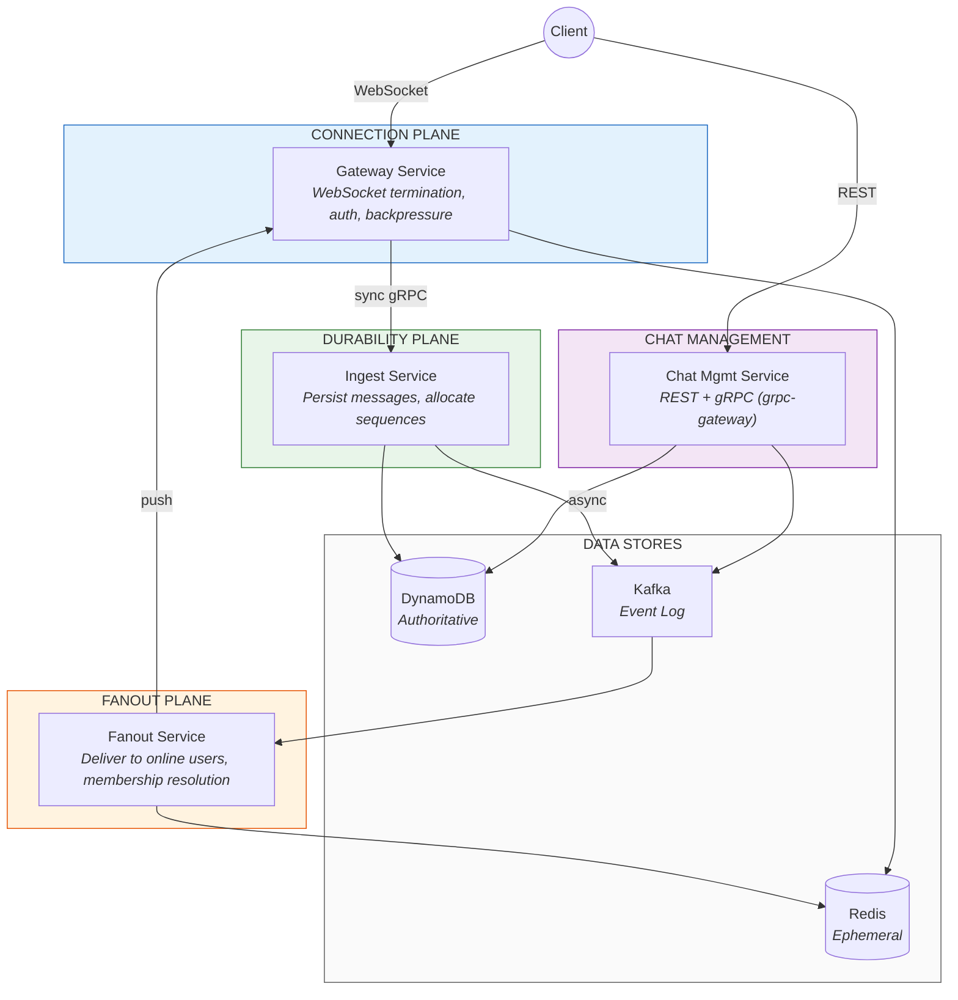

# Realtime Messaging Platform

A **Distributed Systems Lab** designed to demonstrate senior/staff-level decision making in the design and implementation of a real-time messaging system. The primary goal is to explore correctness, ordering, delivery semantics, scalability, and failure modes under realistic constraints — not to ship a production chat application.

This repository is intended to be read, reviewed, and reasoned about — not just run.

## Architecture Overview

The system implements a **three-plane architecture** (ADR-002) with four services:



**Foundational axiom:** ACK = Durability. A client acknowledgment confirms the message is persisted and will never be lost. It says nothing about whether recipients have received it.

### Technology Stack

| Component | Technology | Role |
|-----------|-----------|------|
| Language | Go 1.22+ | All four services |
| Database | DynamoDB | Authoritative source of truth (ADR-003) |
| Event log | Kafka (MSK Serverless / Redpanda locally) | Durable event stream for fanout (ADR-011) |
| Cache | Redis (ElastiCache / Redis 7 locally) | Ephemeral presence and connection routing (ADR-010) |
| WebSocket | `coder/websocket` | Real-time client protocol (ADR-005) |
| Inter-service | gRPC + `grpc-gateway` | Proto-first API design (ADR-006) |
| Observability | OpenTelemetry → CloudWatch / X-Ray | Traces, metrics, SLOs (ADR-012) |
| Infrastructure | Terraform + ECS Fargate | Infrastructure as code (ADR-014) |

### Key Design Decisions

| Guarantee | Implementation |
|-----------|---------------|
| Per-chat total ordering | Server-assigned monotonic `sequence` via DynamoDB atomic counters (ADR-001, ADR-004) |
| Effectively-once persistence | `client_message_id` deduplication on the write path (ADR-001) |
| At-least-once transport | Retry-safe protocol with idempotent server (ADR-005) |
| Offline delivery | Store-and-forward; sync-on-reconnect, not push (MVP Definition) |
| Failure isolation | Each plane fails independently; fanout failures never block persistence (ADR-002) |
| Defense-in-depth security | Distributed controls across all planes; Gateway authenticates, Durability authorizes (ADR-013) |

## Prerequisites

**Required:**

- Docker 24.0+ (includes Docker Compose v2)
- Make

**Optional (IDE support only):**

- Go 1.22+ — enables `gopls` for autocomplete and jump-to-definition
- Not required to build, test, lint, or run any part of the project

All build, test, lint, and code generation commands run inside Docker containers. The Makefile is the single interface — no local Go toolchain, `buf`, `golangci-lint`, or `terraform` installation is needed.

## Getting Started

```bash
git clone <repo-url>
cd messaging

# Start infrastructure (LocalStack, Redpanda, Redis)
make up

# Start all 4 services with hot reload
make dev

# Run the full CI check locally
make ci-local
```

`make dev` starts LocalStack (DynamoDB), Redpanda (Kafka-compatible), Redis, and all four services with Air hot reload. Edit code, save, and see changes rebuilt in ~1 second.

### Local Infrastructure

| Production Component | Local Substitute | Port |
|---------------------|-----------------|------|
| DynamoDB | LocalStack | 4566 |
| MSK Serverless | Redpanda | 9092 |
| ElastiCache Redis | Redis 7 | 6379 |
| Secrets Manager | Environment vars | — |
| CloudWatch / X-Ray | Console exporter | — |

See ADR-014 §9.3 for documented parity gaps between local and production.

## Repository Structure

The project is a Go monorepo with a single `go.mod` (ADR-014 §3). Four services map to the three-plane architecture (ADR-002):

```
cmd/
├── gateway/              # Connection Plane — WebSocket handling
├── ingest/               # Durability Plane — persist + sequence allocation
├── fanout/               # Fanout Plane — Kafka consumer, delivery dispatch
└── chatmgmt/             # Chat Management — REST + gRPC via grpc-gateway
internal/
├── gateway/
│   ├── port/             # WebSocket handlers, gRPC server (entry points)
│   ├── app/              # Use cases, orchestration logic
│   └── adapter/          # Redis presence, gRPC client to Ingest
├── ingest/
│   ├── port/             # gRPC server (PersistMessage RPC)
│   ├── app/              # Persist flow, sequence allocation logic
│   └── adapter/          # DynamoDB writer, Kafka producer
├── fanout/
│   ├── port/             # Kafka consumer handler, gRPC server
│   ├── app/              # Delivery dispatch logic
│   └── adapter/          # Redis lookup, gRPC client to Gateway
├── chatmgmt/
│   ├── port/             # REST + gRPC handlers (grpc-gateway)
│   ├── app/              # Chat CRUD, membership management
│   └── adapter/          # DynamoDB client, Kafka producer
├── domain/               # Shared: value objects, error types, constants
├── dynamo/               # Shared adapter: DynamoDB table operations
├── kafka/                # Shared adapter: franz-go producer/consumer
├── redis/                # Shared adapter: go-redis presence operations
├── auth/                 # Shared: JWT validation, token parsing
└── observability/        # Shared: OTel setup, trace propagation, metrics
pkg/
└── protocol/             # Public: WebSocket protocol types (ADR-005 schemas)
proto/
├── buf.yaml
├── buf.gen.yaml
└── messaging/v1/         # Versioned proto definitions
gen/                      # Generated code (git-ignored)
test/
├── harness/              # Reference client + test infrastructure (ADR-017)
├── conformance/          # L1: Protocol conformance tests
├── contract/             # L2: Inter-service contract tests
├── e2e/                  # L3: End-to-end scenario tests
└── chaos/                # L4: Failure injection tests
terraform/
├── modules/              # Reusable: ecs-service, msk-serverless, dynamodb, etc.
└── environments/
    ├── dev/
    └── prod/
docker/
├── dev.Dockerfile        # Multi-stage: base → dev (tools + Air) → build → prod
├── gateway.Dockerfile    # Production: builder → scratch
├── ingest.Dockerfile
├── fanout.Dockerfile
└── chatmgmt.Dockerfile
docker-compose.yaml       # Infrastructure: LocalStack, Redpanda, Redis
docker-compose.dev.yaml   # Override: 4 services with Air + toolbox
.air/                     # Per-service Air hot-reload configs
.golangci.yml             # golangci-lint v2 configuration
.arch-go.yml              # Architectural boundary rules
```

## Makefile Reference

All targets delegate to Docker. This is the complete interface for development:

| Target | Description |
|--------|-------------|
| `make help` | Show all available targets |
| **Infrastructure** | |
| `make up` | Start infrastructure (LocalStack, Redpanda, Redis) |
| `make down` | Stop infrastructure and remove volumes |
| **Development** | |
| `make dev` | Start infra + all 4 services with hot reload |
| `make dev-down` | Stop the full dev stack |
| **Proto** | |
| `make proto` | Generate Go code from proto definitions |
| `make proto-lint` | Lint proto files with buf |
| `make proto-breaking` | Check proto backward compatibility against `main` |
| **Go tooling** | |
| `make lint` | Run golangci-lint |
| `make lint-fix` | Run golangci-lint with auto-fix |
| `make fmt` | Format Go code |
| `make tidy` | Run `go mod tidy` |
| `make arch-lint` | Check Clean Architecture boundary violations |
| **Testing** | |
| `make test` | Run unit tests with race detection |
| `make test-integration` | Run integration tests (requires `make up`) |
| `make test-coverage` | Generate HTML coverage report |
| **Build** | |
| `make build` | Compile all 4 service binaries |
| `make docker` | Build production Docker images |
| **Terraform** | |
| `make terraform-fmt` | Format Terraform files |
| `make terraform-validate` | Validate Terraform configuration |
| **CI** | |
| `make ci-local` | Run full CI pipeline locally |

`make ci-local` runs the same checks as the GitHub Actions CI workflow (ADR-014 §8.2). If it passes locally, CI will pass.

## Architecture Decision Records

Every non-trivial design decision is documented as an Architecture Decision Record. The project currently has 17 ADRs plus a Client Protocol Contract and MVP Definition.

| ADR | Topic | Key Decisions |
|-----|-------|---------------|
| ADR-001 | Ordering & Idempotency | Per-chat total ordering, server-assigned sequences, `client_message_id` dedup |
| ADR-002 | Three-Plane Architecture | Connection / Durability / Fanout separation, "ACK = Durability" |
| ADR-003 | Source of Truth | DynamoDB (authoritative) → Kafka (event log) → Redis (ephemeral) |
| ADR-004 | Sequence Allocation | DynamoDB atomic counters, two-phase allocation |
| ADR-005 | WebSocket Protocol | Custom JSON protocol, client/server frame types |
| ADR-006 | REST API | Device binding, idempotency, authentication flows |
| ADR-007 | Data Model | 8-table DynamoDB design by velocity characteristics |
| ADR-008 | Delivery Acknowledgments | Delivery state semantics, per-user-per-chat tracking |
| ADR-009 | Failure Handling | Tier 1/2/3 failure classification, timeout contracts |
| ADR-010 | Presence & Routing | Redis-backed connection registry, Lua-scripted atomic ops |
| ADR-011 | Kafka Consumers | Consumer group strategy, offset management, topic design |
| ADR-012 | Observability | OTel traces, metrics, SLOs, console exporter for local |
| ADR-013 | Security | Defense-in-depth, JWT validation, device binding, abuse controls |
| ADR-014 | Dev Environment | Docker-only toolchain, CI pipeline, monorepo layout |
| ADR-015 | gRPC Contracts | Inter-service proto definitions, error mapping |
| ADR-016 | Deployment Topology | ECS Fargate, service discovery, scaling policies |
| ADR-017 | Test Pyramid | L1–L4 layers, reference client, chaos testing |

Read ADRs before proposing changes to architecture, data flow, or consistency guarantees.

## Contributing

See [CONTRIBUTING.md](CONTRIBUTING.md) for code standards, development workflow, architectural conventions, and the ADR process.

## License

TBD
