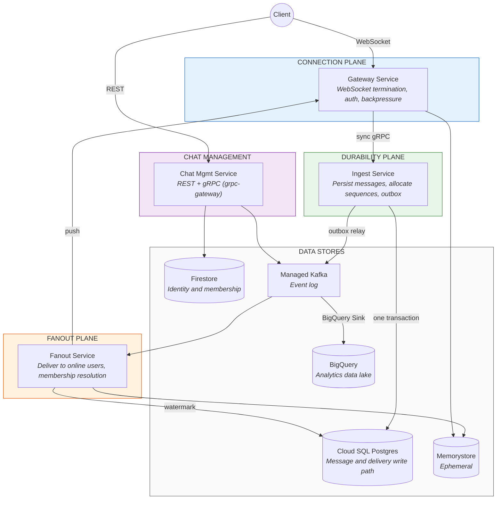

# Realtime Messaging Platform

A **Distributed Systems Lab** designed to demonstrate senior/staff-level decision making in the design and implementation of a real-time messaging system. The primary goal is to explore correctness, ordering, delivery semantics, scalability, and failure modes under realistic constraints — not to ship a production chat application.

This repository is intended to be **read, reviewed, and reasoned about** — not just run. The design lives in 23 Architecture Decision Records; the code is a faithful implementation of those decisions.

> [!NOTE]
> **Status — design complete, implementation in progress.** All architectural decisions (ADR-001 … ADR-023) are accepted. The substrate was migrated **AWS → GCP** (see [Substrate](#substrate)); implementation proceeds per [EXECUTION_PLAN v2.3](docs/EXECUTION_PLAN.md) as granular per-module PRs. **Module 0 is done:** the AWS SDK and all local cloud-emulation were removed and the container toolbox now runs `gcloud`/`terraform`/`kubectl`/`buf` (M0.1); the base GCP Terraform — VPC, **GKE Autopilot**, Artifact Registry, GCS state backend, budget guard — deploys the four `/healthz` services behind an external load balancer and destroys back to zero (M0.2, validated live); and the Kafka event wire format is fixed in code, in CI, and in the Managed Kafka schema registry (M0.3 — see [Event wire format](#event-wire-format)). Next is **M1** (Firestore identity and chat lifecycle). The v1 skeleton and authentication were built on the AWS substrate and are being re-homed to GCP.

## Architecture Overview

The system implements a **three-plane architecture** (ADR-002) with four services over a **polyglot datastore** (ADR-021, ADR-023):


```mermaid
flowchart TB
    subgraph CP["CONNECTION PLANE"]
        GW["Gateway Service<br/><i>WebSocket termination, auth, backpressure</i>"]
    end
    subgraph DP["DURABILITY PLANE"]
        IS["Ingest Service<br/><i>Persist messages, allocate sequences, outbox</i>"]
    end
    subgraph FP["FANOUT PLANE"]
        FW["Fanout Service<br/><i>Deliver to online users, membership resolution</i>"]
    end
    subgraph CM["CHAT MANAGEMENT"]
        CMS["Chat Mgmt Service<br/><i>REST + gRPC (grpc-gateway)</i>"]
    end
    subgraph DATA["DATA STORES"]
        PG[("Cloud SQL Postgres<br/><i>Message and delivery write path</i>")]
        FS[("Firestore<br/><i>Identity and membership</i>")]
        KAFKA["Managed Kafka<br/><i>Event log</i>"]
        REDIS[("Memorystore<br/><i>Ephemeral</i>")]
        BQ[("BigQuery<br/><i>Analytics data lake</i>")]
    end
    CLIENT((Client)) -->|WebSocket| GW
    CLIENT -->|REST| CMS
    GW -->|"sync gRPC"| IS
    IS -->|"one transaction"| PG
    IS -->|"outbox relay"| KAFKA
    KAFKA --> FW
    FW --> REDIS
    FW -->|"watermark"| PG
    FW -->|"push"| GW
    CMS --> FS
    CMS --> KAFKA
    GW --> REDIS
    KAFKA -->|"BigQuery Sink"| BQ

    style CP fill:#e3f2fd,stroke:#1565c0
    style DP fill:#e8f5e9,stroke:#2e7d32
    style FP fill:#fff3e0,stroke:#e65100
    style CM fill:#f3e5f5,stroke:#7b1fa2
    style DATA fill:#fafafa,stroke:#616161
```

**Foundational axiom:** ACK = Durability. A client acknowledgment confirms the message is persisted and will never be lost. It says nothing about whether recipients have received it.

### Technology Stack

| Component | Technology | Role |
|-----------|-----------|------|
| Language | Go 1.26+ | All four services |
| Write-path store | Cloud SQL for PostgreSQL | Authoritative message/delivery path — sequences, messages, idempotency, watermarks, outbox (ADR-023) |
| Entity store | Firestore (native mode) | Identity & membership — users, chats, memberships, sessions (ADR-023) |
| Event log | Managed Service for Apache Kafka | Durable event stream for fanout, Protobuf via Schema Registry (ADR-011, ADR-022) |
| Cache | Memorystore for Redis | Ephemeral presence and connection routing (ADR-010) |
| Analytics | BigQuery | Metadata-only data lake via Kafka → BigQuery Sink (ADR-022) |
| WebSocket | `coder/websocket` | Real-time client protocol (ADR-005) |
| Inter-service | gRPC + `grpc-gateway` | Proto-first API design (ADR-006) |
| Observability | OpenTelemetry → Managed Prometheus / Cloud Trace | Traces, metrics, SLOs (ADR-012) |
| Compute | GKE Autopilot | Container orchestration; long-lived WebSockets (ADR-021) |
| Infrastructure | Terraform | Infrastructure as code, deploy-and-destroy (ADR-021) |

### Key Design Decisions

| Guarantee | Implementation |
|-----------|---------------|
| Per-chat total ordering | Server-assigned monotonic `sequence` via a Postgres counter row, allocated in the same transaction as the write (ADR-001, ADR-004, ADR-023) |
| Effectively-once persistence | Check-before-allocate `client_message_id` idempotency (ADR-001, ADR-023) |
| At-least-once transport | Retry-safe protocol with an idempotent server (ADR-005) |
| Reliable event production | Transactional outbox + single-owner relay: an event exists iff its message committed (ADR-022, ADR-023) |
| Effectively-once analytics | Kafka → BigQuery Sink UPSERT keyed on `event_id` (ADR-022) |
| Offline delivery | Store-and-forward; sync-on-reconnect, not push (MVP Definition) |
| Failure isolation | Each plane fails independently; fanout failures never block persistence (ADR-002) |
| Defense-in-depth security | Distributed controls across planes; Gateway authenticates, Durability authorizes (ADR-013) |

## Substrate

The platform was migrated from AWS to GCP. The decision record is the interesting artifact:

- **[ADR-021](docs/adr/ADR-021.md)** — GCP substrate: polyglot Cloud SQL Postgres + Firestore, GKE Autopilot, Managed Kafka, Memorystore, Managed Prometheus/Cloud Trace. No local cloud-emulation (Docker toolchain retained); no push-triggered CD (manual `terraform apply`/`destroy`).
- **[ADR-022](docs/adr/ADR-022.md)** — analytics data lake: Protobuf events via the managed Schema Registry, BigQuery Sink, metadata-only, transactional outbox.
- **[ADR-023](docs/adr/ADR-023.md)** — two-store data model superseding the single-table ADR-007.

The headline finding, verifiable row-by-row in ADR-021's impact table: **13 of 20 prior ADR contracts survived a full cloud migration untouched** — they are about ordering, delivery, protocol, and service internals, not cloud primitives. Superseded/amended ADRs carry a banner linking to ADR-021; the originals are retained unchanged.

## Development

Nothing is installed on the host. The **Docker toolchain is the single interface** — `go`, `buf`, `golangci-lint`, `terraform`, `kubectl`, and `gcloud` all run inside containers, so the project is buildable and operable on any machine with only Docker present (ADR-021).

**Required:** Docker 24.0+ (includes Compose v2) and Make.
**Optional (IDE support only):** Go 1.26+ for `gopls` — not required to build, test, lint, or generate.

Unit tests, linting, proto generation, and builds are hermetic and run in-container with no cloud dependency:

```bash
make ci-local     # lint + test + build + proto checks — if it passes, CI passes
make test         # unit tests with race detection
make proto        # generate Go from proto definitions
make build        # compile all four service binaries
```

Integration, end-to-end, and chaos tests run against a **Terraform-provisioned GCP dev project**, deployed and destroyed per session (there is no local cloud emulation). The provisioning workflow is stood up in Module 0; see [EXECUTION_PLAN v2.3](docs/EXECUTION_PLAN.md) for the module roadmap and [CONTRIBUTING.md](CONTRIBUTING.md) for the development workflow, code standards, and commit conventions.

### Event wire format

Kafka events are Protobuf, registered in the **Managed Kafka schema registry** and pinned to **FULL** compatibility (ADR-022 D1, ADR-011 §5.1). Records carry the Confluent header:

```
0x00 | schema ID (4 bytes, big endian) | message index | Protobuf payload
```

| Topic | Subject | Schema |
|---|---|---|
| `messages.persisted` | `messages.persisted-value` | `events/v1/message_persisted.proto` |
| `memberships.changed` | `memberships.changed-value` | `events/v1/membership_changed.proto` |
| `chats.created` | `chats.created-value` | `events/v1/chat_created.proto` |
| — (imported) | `events.v1.envelope` | `events/v1/envelope.proto` |
| — (imported) | `wkt.timestamp` | `google/protobuf/timestamp.proto` (vendored) |

**One message per schema**, because the registry rejects anything else (*"Too many message types specified in schema definition"*). Each subject registers exactly one type and declares its direct imports as references, so the message index is always 0. The registry resolves no imports on its own — not even the well-known types — which is why `google/protobuf/timestamp.proto` is vendored verbatim under `proto/third_party` and registered as its own subject. Subject names may not start with `google`, hence `wkt.timestamp`.

`internal/events` owns that table, the registration order, and the encoder. Unit tests pin the invariants the registry enforces but `buf lint` cannot see: one message per file, imports listed in dependency order, and generated types matching the files that get published.

Compatibility is enforced twice: `buf breaking` (category `FILE`, stricter than wire + JSON) rejects an incompatible change in CI, and the registry holds each subject at FULL for producers that never went through CI.

The registry has **no Terraform resource** in either Google provider, and GCP refuses to create one in a region with no Kafka cluster, so it is created and populated by the deploy script after the cluster exists:

```bash
make schema-register   # create the registry (idempotent) + publish events/v1
make schema-verify     # read back subject, ID, version, compatibility
make schema-test       # live encode -> register -> decode round-trip
```

## Repository Structure

A Go monorepo with a single `go.mod` (ADR-014). Four services map to the three-plane architecture (ADR-002):

```
cmd/                     # Service entry points: gateway, ingest, fanout, chatmgmt (+ schemactl)
internal/
├── gateway/             # Connection Plane — WebSocket, presence (port/app/adapter)
├── ingest/              # Durability Plane — persist + sequence + outbox
├── fanout/              # Fanout Plane — Kafka consumer, delivery dispatch, watermarks
├── chatmgmt/            # Chat Management — REST + gRPC (grpc-gateway)
├── domain/              # Shared: value objects, error types, constants
├── events/              # Shared: Kafka event wire contract — subjects, message indexes, serde (ADR-022)
├── postgres/            # Shared adapter: Cloud SQL write path (ADR-023) — re-homing from internal/dynamo
├── firestore/           # Shared adapter: identity/membership documents (ADR-023)
├── kafka/               # Shared adapter: Managed Kafka producer/consumer + Schema Registry
├── redis/               # Shared adapter: Memorystore presence operations
├── auth/                # Shared: JWT validation, token parsing
├── server/              # Shared: service lifecycle, graceful shutdown (ADR-018)
└── observability/       # Shared: OTel setup, trace propagation, metrics
pkg/protocol/            # Public: WebSocket protocol types (ADR-005)
proto/
├── messaging/v1/        # Service contracts (gRPC)
└── events/v1/           # Event envelopes for Kafka + BigQuery (ADR-022)
test/                    # harness / conformance (L1) / contract (L2) / e2e (L3) / chaos (L4) — ADR-017
terraform/               # GCP modules + dev environment; GCS remote state (ADR-021)
docker/                  # toolbox.Dockerfile (gcloud/terraform/kubectl/buf/Go) + dev.Dockerfile (hot reload) + per-service production Dockerfiles (scratch)
```

> The `internal/postgres` and `internal/firestore` adapters replace the AWS-era `internal/dynamo` per ADR-023; this re-homing is tracked in EXECUTION_PLAN Module 1–2.

## Architecture Decision Records

Every non-trivial decision is an ADR (`docs/adr/`). Read the relevant ADRs before proposing changes to architecture, data flow, or consistency guarantees.

| ADR | Topic | Status |
|-----|-------|--------|
| ADR-001 | Ordering & idempotency | Accepted |
| ADR-002 | Three-plane architecture | Accepted |
| ADR-003 | Source of truth & dataflow | Amended by ADR-021 |
| ADR-004 | Sequence allocation | Superseded by ADR-021/023 (Postgres) |
| ADR-005 | WebSocket protocol | Accepted |
| ADR-006 | REST API | Accepted |
| ADR-007 | Data model | Superseded by ADR-023 |
| ADR-008 | Delivery acknowledgments | Accepted |
| ADR-009 | Failure handling | Accepted |
| ADR-010 | Presence & routing | Amended by ADR-021 (Memorystore) |
| ADR-011 | Kafka topics | Amended by ADR-021/022 (Managed Kafka, Protobuf) |
| ADR-012 | Observability | Amended by ADR-021 (Managed Prometheus) |
| ADR-013 | Security & abuse controls | Accepted |
| ADR-014 | Tech stack & deployment | Superseded by ADR-021 |
| ADR-015 | Authentication & OTP | Accepted |
| ADR-016 | Chat lifecycle & membership | Accepted |
| ADR-017 | Client contract & test harness | Accepted |
| ADR-018 | Service lifecycle extraction | Accepted |
| ADR-019 | Interface contracts & type ownership | Accepted |
| ADR-020 | Service lifecycle conventions | Accepted |
| **ADR-021** | **Cloud substrate migration (AWS → GCP)** | **Accepted** |
| **ADR-022** | **Analytics data lake** | **Accepted** |
| **ADR-023** | **Two-store data model** | **Accepted** |

The [Client Protocol Contract](docs/CLIENT_PROTOCOL_CONTRACT.md), [MVP Definition](docs/MVP-DEFINITION.md), and the [Execution Plan](docs/EXECUTION_PLAN.md) complete the design corpus.

## Contributing

See [CONTRIBUTING.md](CONTRIBUTING.md) for code standards, development workflow, architectural conventions, commit conventions (Conventional Commits), and the ADR process.

## License

This repository is dual-licensed:

- **Code** — [Apache License 2.0](LICENSE). You may use, modify, and distribute it, including commercially, with attribution and the license notice (see [NOTICE](NOTICE)).
- **Documentation** (everything under [`docs/`](docs/), including the ADRs) — [Creative Commons Attribution 4.0 International (CC BY 4.0)](LICENSE-docs). You may share and adapt the writing, including commercially, as long as you credit **Alexis Nava**.

Copyright 2026 Alexis Nava.
