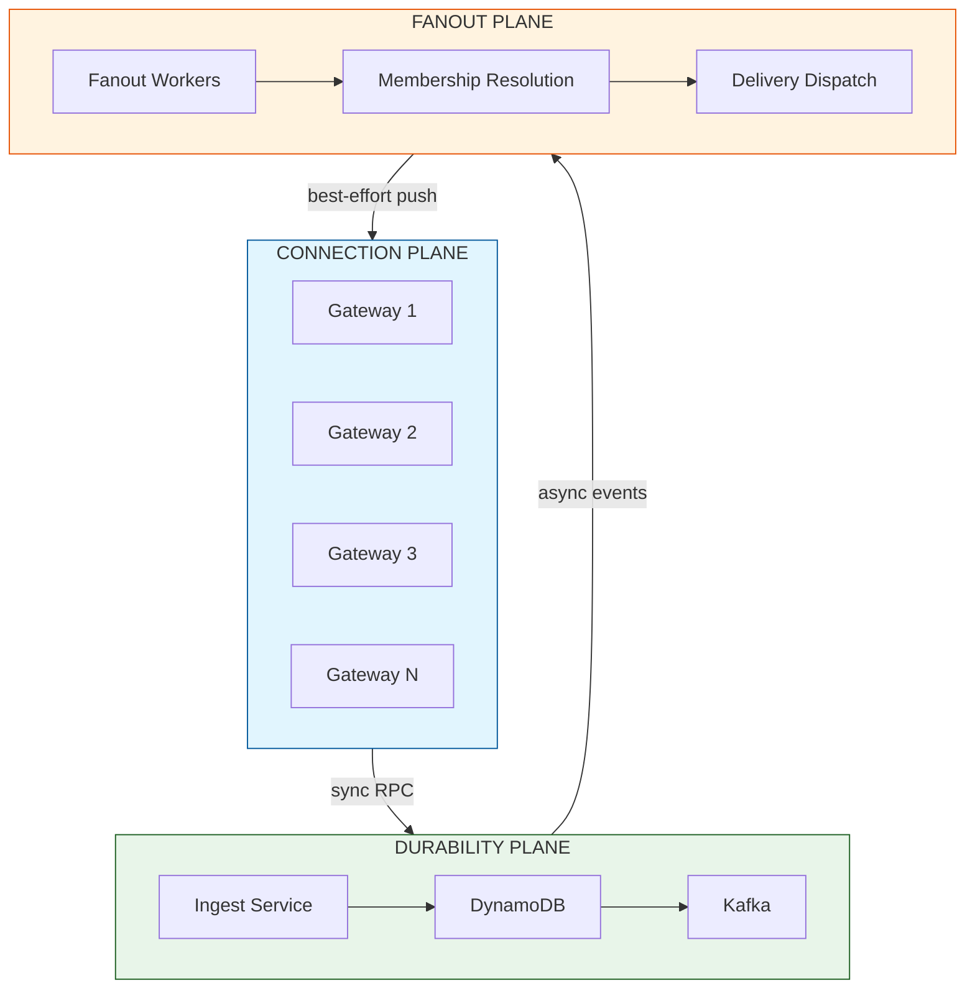
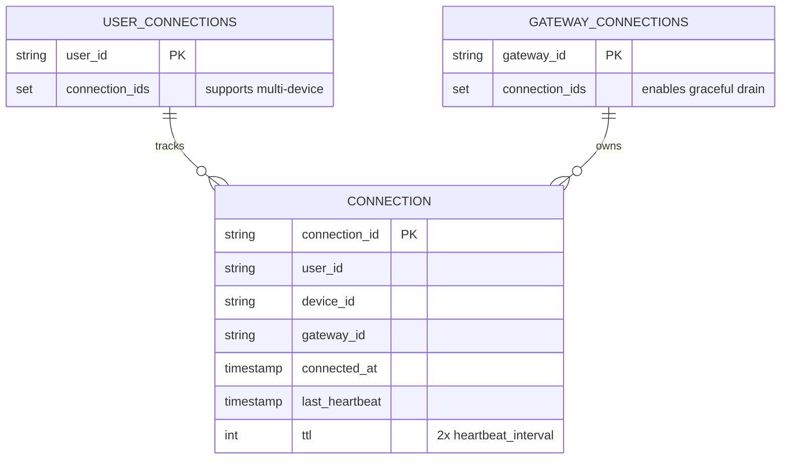
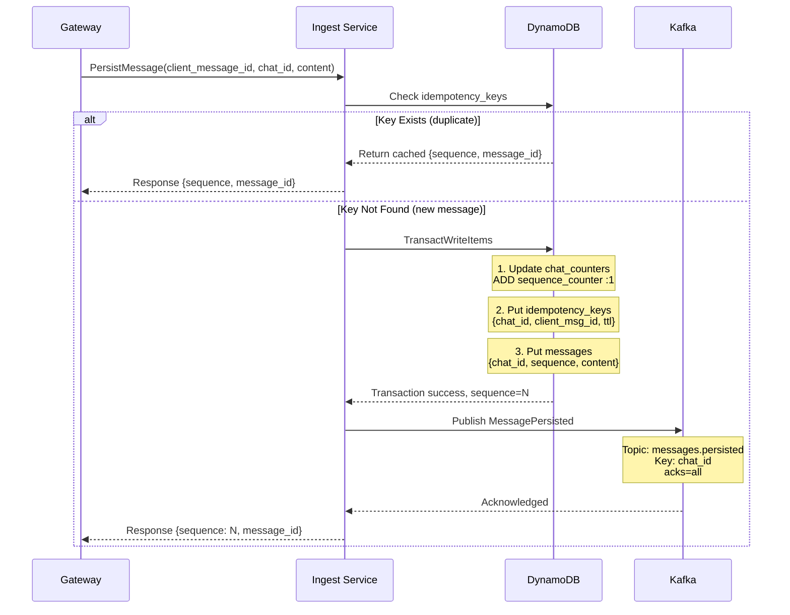
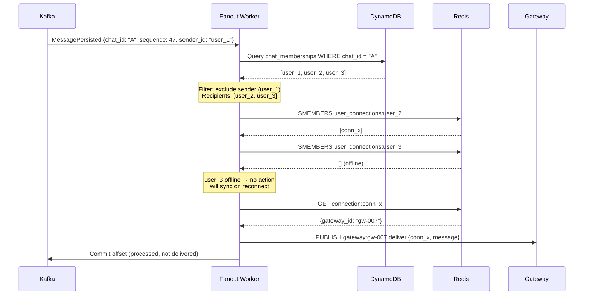
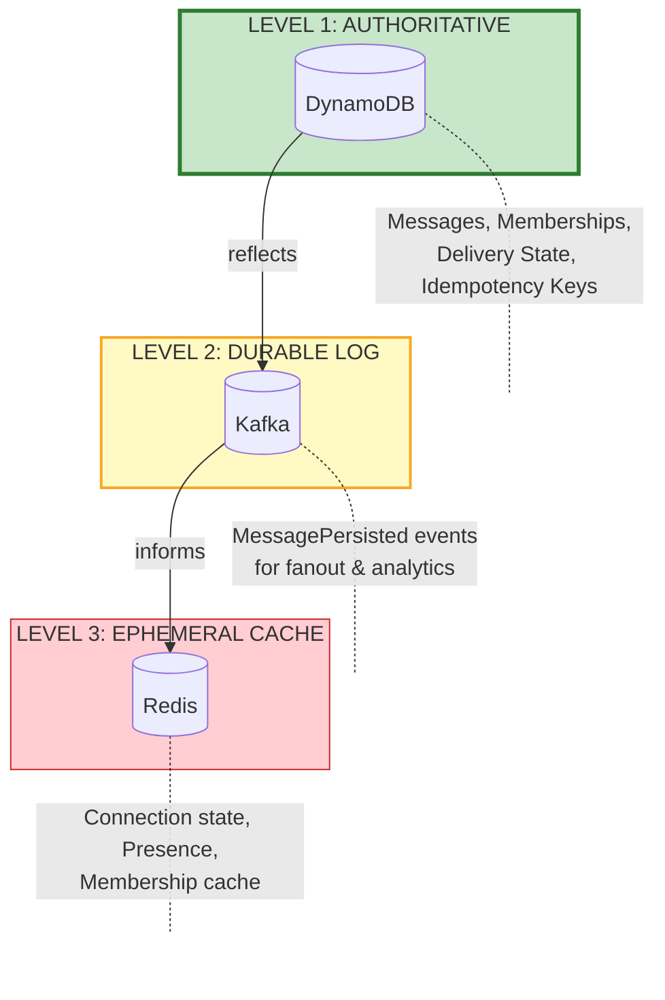
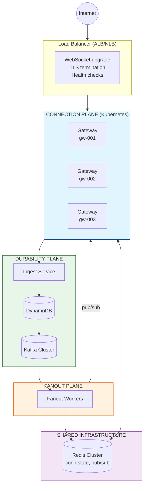
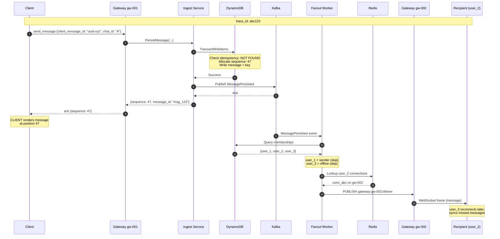

# ADR-002: Plane Separation and Responsibility Boundaries

- **Status**: Accepted
- **Date**: 2026-01-30

---

## Context and Problem Statement

Real-time messaging systems must simultaneously satisfy competing requirements: sub-100ms delivery latency for online users, strong durability guarantees for message persistence, and reliable delivery to potentially millions of concurrent connections. These requirements have fundamentally different characteristics:

- **Latency-sensitive operations** (WebSocket message delivery) cannot tolerate synchronous disk writes or cross-datacenter consensus.
- **Durability-critical operations** (message persistence) must guarantee data survival across hardware failures, even at the cost of latency.
- **Fan-out operations** (delivering one message to N recipients) must scale horizontally without blocking the sender.

Attempting to satisfy all requirements in a monolithic architecture leads to one of two failure modes:

1. **Durability compromise**: Optimizing for latency causes acknowledged messages to be lost during failures.
2. **Latency compromise**: Optimizing for durability causes unacceptable send latency as writes block on consensus or replication.

**Core Question:** How should the messaging system be decomposed into components with distinct responsibilities, and what contracts govern their interactions to ensure both correctness and performance?

---

## Decision Drivers

1. **Failure Isolation**: A failure in one component (e.g., WebSocket gateway crash) must not cause data loss or corrupt state in another component (e.g., message store).

2. **Independent Scalability**: Components must scale independently based on their specific bottlenecks (connections vs. write throughput vs. fan-out breadth).

3. **Clear Ownership**: Each piece of system state must have exactly one authoritative owner; no ambiguity about which component's view is correct.

4. **Operational Clarity**: On-call engineers must be able to reason about failures in isolation; a "Connection Plane issue" should not require understanding persistence internals.

5. **Consistency Model Alignment**: Components should be designed around their natural consistency requirements (AP for connections, CP for persistence).

6. **Testability**: Each plane must be testable in isolation with well-defined interfaces.

---

## Considered Options

### Option 1: Monolithic Architecture

All functionality (connection handling, message persistence, delivery) resides in a single service type.

**Mechanism**: Single deployable unit handles WebSocket connections, writes to database, and pushes to other connections.

### Option 2: Two-Tier Architecture (Gateway + Backend)

Separate connection-handling gateways from a unified backend service that handles both persistence and delivery.

**Mechanism**: Stateless gateways terminate WebSockets; backend service persists messages and coordinates delivery.

### Option 3: Three-Plane Architecture (Connection, Durability, Fanout)

Explicit separation into three planes with distinct responsibilities, consistency models, and failure domains.

**Mechanism**: Connection Plane handles WebSockets, Durability Plane handles persistence, Fanout Plane handles delivery coordination.

### Option 4: Event Sourcing with CQRS

All state changes flow through an event log; separate read and write models with eventual consistency.

**Mechanism**: Kafka as the primary store; derived views for queries and delivery state.

---

## Decision Outcome

**Chosen Option: Option 3 — Three-Plane Architecture**

This architecture provides explicit separation of concerns aligned with the natural boundaries of the problem domain. Each plane can be reasoned about, scaled, and operated independently while maintaining clear contracts at their interfaces.

### Foundational Axioms

Before detailing each plane, we establish axioms that govern the entire architecture. These are non-negotiable and inform all downstream design decisions.

| Axiom | Statement | Implication |
|-------|-----------|-------------|
| **ACK = Durability** | A client ACK represents *durability*, not *delivery*. | The sender's ACK confirms the message is persisted and will never be lost. It says nothing about whether recipients have received it. |
| **Delivery = Best-Effort** | Real-time delivery is best-effort; sync-on-reconnect provides guarantees. | Fanout failures are acceptable; the system does not retry indefinitely. |
| **Planes Flow One Way** | Connection → Durability (sync), Durability → Fanout (async), Fanout → Connection (best-effort). **Never reverse.** | Durability Plane never calls Connection Plane. Fanout Plane never writes to Durability Plane. This prevents circular dependencies and failure cascades. |
| **Membership Authority is Eventual** | If membership changes race with fanout, DynamoDB wins—even if fanout delivers one extra message. | Removing a user from a chat is not an instantaneous guarantee. A user removed mid-fanout may receive one additional message. This matches real-world systems (Slack, WhatsApp, Discord). |

These axioms are also encoded as machine-checkable invariants in Appendix C.

### Plane Overview



**Plane Characteristics:**

| Plane | Consistency | State | Failure Mode |
|-------|-------------|-------|--------------|
| **Connection** | AP (Availability) | Ephemeral (Redis-backed) | Reconnect & Sync |
| **Durability** | CP (Correctness) | Durable (Database is SoT) | Reject & Retry |
| **Fanout** | Eventual | Derived (from Durability) | Skip & Rely on Sync |

---

## Detailed Design

### 1. Connection Plane

The Connection Plane is the system's edge layer, responsible for managing client connections and translating between the external WebSocket protocol and internal system operations.

#### 1.1 Responsibilities

| Responsibility | Description |
|----------------|-------------|
| **WebSocket Termination** | Accept, authenticate, and maintain persistent WebSocket connections from clients. |
| **Protocol Translation** | Parse incoming WebSocket frames into typed messages; serialize outbound messages to frames. |
| **Authentication Enforcement** | Validate JWT tokens on connection establishment; reject unauthenticated requests. |
| **Connection State Management** | Track active connections, map `(user_id, device_id)` to gateway instances. |
| **Backpressure Enforcement** | Monitor per-connection outbound buffer sizes; disconnect slow clients. |
| **Heartbeat Management** | Send/receive pings to detect dead connections; clean up stale state. |

#### 1.2 What Connection Plane Does NOT Do

| Anti-Responsibility | Rationale |
|---------------------|-----------|
| **Message Persistence** | Durability is the Durability Plane's concern; gateways are ephemeral. |
| **Sequence Assignment** | Ordering is determined at persistence time, not connection time. |
| **Delivery Guarantees** | Gateways provide best-effort delivery; sync-on-reconnect provides guarantees. |
| **Membership Resolution** | Gateways do not query who is in a chat; Fanout Plane handles this. |

#### 1.3 State Model

The Connection Plane maintains **ephemeral state only**, backed by Redis:



**Redis Key Patterns:**
- `connection:{connection_id}` → Connection metadata (JSON)
- `user_connections:{user_id}` → SET of connection IDs (multi-device support)
- `gateway_connections:{gateway_id}` → SET of connection IDs (graceful shutdown)

**TTL Policy:** All keys expire at `2 × heartbeat_interval` (default: 60 seconds). On gateway crash, keys expire naturally; clients reconnect.

**Critical Invariant**: If Redis state is lost, the only consequence is that clients must reconnect. No messages are lost; delivery resumes via sync-on-reconnect.

#### 1.4 Scaling Model

| Dimension | Strategy |
|-----------|----------|
| **Connections** | Horizontal scaling: add gateway instances behind load balancer. |
| **Geographic Distribution** | Deploy gateways in multiple regions; clients connect to nearest. |
| **Load Balancing** | Consistent hashing by `user_id` for connection affinity (optional optimization). |
| **Resource Limits** | Per-gateway connection limit (configurable, default 100K); reject new connections when saturated. |

#### 1.5 Failure Modes and Recovery

| Failure | Detection | Recovery |
|---------|-----------|----------|
| **Gateway process crash** | Redis TTL expiration; client TCP timeout | Clients reconnect to any healthy gateway; sync missed messages |
| **Gateway host failure** | Health check failure; Redis TTL expiration | Same as process crash; load balancer routes to healthy instances |
| **Redis unavailable** | Connection lookup fails | Gateway operates in degraded mode: new connections rejected, existing connections continue (in-memory state) |
| **Network partition (gateway ↔ Redis)** | Redis operations timeout | Gateway marks itself unhealthy; drains connections gracefully |

---

### 2. Durability Plane

The Durability Plane is the system's correctness layer, responsible for ensuring that acknowledged messages are never lost and that ordering invariants are maintained.

#### 2.1 Responsibilities

| Responsibility | Description |
|----------------|-------------|
| **Idempotency Enforcement** | Detect and collapse duplicate message submissions using `client_message_id`. |
| **Sequence Allocation** | Assign monotonically increasing `sequence` numbers per chat using atomic counters. |
| **Atomic Persistence** | Write message, idempotency key, and sequence update in a single transaction. |
| **Event Emission** | Publish `MessagePersisted` events to Kafka for downstream consumption. |
| **History Queries** | Serve message history requests for sync and REST API. |

#### 2.2 What Durability Plane Does NOT Do

| Anti-Responsibility | Rationale |
|---------------------|-----------|
| **Connection Management** | No awareness of WebSocket state; operates via request/response. |
| **Delivery Tracking** | Does not know or care if recipients are online; emits events for Fanout. |
| **Real-time Push** | Never initiates outbound communication to clients. |
| **Retry to Clients** | If the response doesn't reach the client, the client must retry. |

#### 2.3 Data Flow



#### 2.4 State Model

The Durability Plane owns the **authoritative system state** in DynamoDB:

| Table | Partition Key | Sort Key | Purpose |
|-------|---------------|----------|---------|
| `messages` | `chat_id` | `sequence` | Message content and metadata; source of truth for chat history |
| `chat_counters` | `chat_id` | — | Current sequence counter per chat |
| `idempotency_keys` | `chat_id` | `client_message_id` | Duplicate detection with TTL (7 days) |
| `chats` | `chat_id` | — | Chat metadata (type, created_at, etc.) |
| `chat_memberships` | `chat_id` | `user_id` | Membership roster; who is in which chat |
| `delivery_state` | `user_id` | `chat_id` | Per-user per-chat delivery watermark |

**Critical Invariant**: DynamoDB is the single source of truth for all durable state. If a record exists in DynamoDB, it is real. If it doesn't exist, it never happened (or was never acknowledged).

#### 2.5 Kafka Event Schema

Events emitted to Kafka follow a strict schema to ensure downstream consumers can reliably process them:

```json
{
  "event_type": "MessagePersisted",
  "event_id": "evt_01HQX...",
  "event_time": "2026-01-30T14:30:00.000Z",
  "payload": {
    "message_id": "msg_01HQX...",
    "chat_id": "chat_abc123",
    "sequence": 47,
    "sender_id": "user_456",
    "content": "Hello, world!",
    "content_type": "text/plain",
    "created_at": "2026-01-30T14:30:00.000Z"
  }
}
```

**Kafka Configuration**:
- **Topic**: `messages.persisted`
- **Partitioning**: By `chat_id` (ensures per-chat ordering in Kafka mirrors sequence order)
- **Replication Factor**: 3 (durability)
- **Retention**: 7 days (allows replay for recovery scenarios)
- **Acknowledgment**: `acks=all` (wait for all replicas before confirming)

#### 2.6 Consistency Guarantees

| Guarantee | Mechanism |
|-----------|-----------|
| **Atomicity** | DynamoDB TransactWriteItems ensures all-or-nothing writes |
| **Sequence Integrity** | Atomic counter increment within transaction |
| **Idempotency** | Conditional write fails if idempotency key exists |
| **Durability** | DynamoDB synchronous replication across AZs |
| **Event Ordering** | Kafka partition by `chat_id` preserves sequence order |

#### 2.7 Failure Modes and Recovery

| Failure | Detection | Recovery |
|---------|-----------|----------|
| **Transaction failure (contention)** | DynamoDB TransactionCanceledException | Ingest service retries with backoff; client may also retry |
| **DynamoDB unavailable** | SDK timeout/error | Return error to gateway; client retries; alerts to on-call |
| **Kafka unavailable** | Producer send fails | **Critical decision**: See Section 2.8 |
| **Ingest service crash** | Health check failure | Stateless; another instance handles next request |

#### 2.8 Kafka Unavailability: Design Decision

When Kafka is unavailable after a successful DynamoDB write, the system faces a choice:

**Option A: Fail the request** — Return error to client; client retries; DynamoDB write is idempotent so retry is safe.

**Option B: Acknowledge success, async retry** — Message is durable; enqueue for later Kafka publish; risk of delayed fanout.

**Chosen Approach: Option A (Fail the request)**

**Rationale**: The Durability Plane's contract is "acknowledged means durable AND downstream notified." Splitting this guarantee creates subtle consistency issues where the sender sees success but recipients never receive the message until manual intervention. The idempotency mechanism ensures retries are safe, and Kafka unavailability is rare enough that failing fast is preferable to complex async recovery.

**Implementation**:
```
Transaction:
  1. DynamoDB TransactWriteItems (messages, idempotency_keys, counter)
  2. Kafka produce with acks=all
  
If step 2 fails:
  - Log error with full message context
  - Return 503 to gateway
  - Gateway returns error to client
  - Client retries with same client_message_id
  - Idempotency check sees existing key, returns cached response
  - This time, Kafka publish succeeds (assuming transient failure)
```

---

### 3. Fanout Plane

The Fanout Plane is the system's delivery layer, responsible for getting persisted messages to online recipients as quickly as possible.

#### 3.1 Responsibilities

| Responsibility | Description |
|----------------|-------------|
| **Event Consumption** | Subscribe to `messages.persisted` Kafka topic. |
| **Membership Resolution** | Determine which users should receive each message. |
| **Online Presence Check** | Query Redis to find which recipients are currently connected. |
| **Delivery Routing** | Route messages to the correct gateway instances. |
| **Delivery State Updates** | Update `delivery_state` after successful delivery (optional optimization). |

#### 3.2 What Fanout Plane Does NOT Do

| Anti-Responsibility | Rationale |
|---------------------|-----------|
| **Persistence** | Never writes to the messages table; that's Durability's job. |
| **Guaranteed Delivery** | Best-effort push; sync-on-reconnect provides guarantees. |
| **Retry to Offline Users** | Offline delivery is handled by sync, not retry loops. |
| **Sender Acknowledgment** | Sender ACK comes from Durability Plane, not Fanout. |

#### 3.3 Data Flow



**Note:** user_3 is offline and receives no push. They will receive the message via sync-on-reconnect. This is by design—the Fanout Plane is best-effort.

#### 3.4 Gateway Communication Protocol

Fanout workers communicate with gateways via an internal protocol (not exposed to clients):

```json
// Fanout Worker → Gateway (internal RPC or message queue)
{
  "type": "deliver",
  "connection_id": "conn_xyz",
  "message": {
    "type": "message",
    "message_id": "msg_01HQX...",
    "chat_id": "chat_abc123",
    "sequence": 47,
    "sender_id": "user_456",
    "content": "Hello, world!",
    "created_at": "2026-01-30T14:30:00.000Z"
  }
}
```

**Delivery Options**:

| Option | Mechanism | Trade-offs |
|--------|-----------|------------|
| **Direct RPC** | gRPC or HTTP call to gateway | Lower latency; requires service discovery |
| **Redis Pub/Sub** | Publish to gateway-specific channel | Decoupled; slight latency overhead |
| **Internal Kafka** | Per-gateway topic | Most decoupled; highest latency |

**Chosen Approach: Redis Pub/Sub**

Each gateway subscribes to a channel named `gateway:{gateway_id}:deliver`. Fanout workers publish delivery requests to the appropriate channel. This provides good decoupling without the latency of an additional Kafka hop.

#### 3.5 Scaling Model

| Dimension | Strategy |
|-----------|----------|
| **Throughput** | Kafka consumer group with multiple partitions; each partition handled by one worker |
| **Large Chats** | Fan-out within a single message may require significant work; worker must handle efficiently |
| **Membership Caching** | Cache hot chat memberships in Redis with short TTL to reduce DynamoDB reads |

#### 3.6 Failure Modes and Recovery

| Failure | Detection | Recovery |
|---------|-----------|----------|
| **Worker crash mid-fanout** | Kafka consumer heartbeat timeout | Partition rebalances to another worker; message reprocessed (idempotent delivery) |
| **Gateway unreachable** | Redis Pub/Sub timeout or error | Log and continue; affected users will sync on reconnect |
| **Redis unavailable** | Connection lookup fails | Cannot determine online users; skip delivery, rely on sync |
| **Stale connection state** | Gateway crashed, Redis keys expired | Pub/Sub to dead gateway fails silently; client reconnects and syncs |

**Key Design Principle**: The Fanout Plane is **best-effort**. Any message that cannot be delivered in real-time will be delivered via sync-on-reconnect. This eliminates the need for complex retry logic and allows the system to fail fast and move on.

---

### 4. Inter-Plane Communication Contracts

#### 4.1 Gateway → Durability Plane

**Protocol**: Synchronous RPC (gRPC or HTTP)

**Request: PersistMessage**
```json
{
  "client_message_id": "550e8400-e29b-41d4-a716-446655440000",
  "chat_id": "chat_abc123",
  "sender_id": "user_456",
  "content": "Hello, world!",
  "content_type": "text/plain"
}
```

**Response: PersistMessageResponse**
```json
{
  "success": true,
  "message_id": "msg_01HQX...",
  "sequence": 47
}
```

**Error Response**
```json
{
  "success": false,
  "error_code": "CHAT_NOT_FOUND",
  "error_message": "Chat chat_abc123 does not exist"
}
```

**Error Codes**:
| Code | Meaning | Client Action |
|------|---------|---------------|
| `CHAT_NOT_FOUND` | Invalid chat_id | Display error; do not retry |
| `NOT_A_MEMBER` | Sender not in chat | Display error; do not retry |
| `RATE_LIMITED` | Too many requests | Backoff and retry |
| `SERVICE_UNAVAILABLE` | Internal error | Retry with backoff |

#### 4.2 Durability Plane → Fanout Plane

**Protocol**: Kafka (asynchronous, ordered)

**Topic**: `messages.persisted`
**Key**: `chat_id` (ensures per-chat ordering)
**Value**: MessagePersisted event (see Section 2.5)

**Consumer Group**: `fanout-workers`

**Offset Commit Semantics**: Offsets are committed after successful *processing*, not after successful *delivery*.

> **Critical Rule**: Fanout workers **must not block Kafka offset commits on delivery success**. Delivery is best-effort; offset commits represent *processing*, not *outcome*. A message is "processed" when the fanout attempt has been made for all online recipients, regardless of whether those attempts succeeded.

This prevents:
- Backpressure explosions in large chats (one slow recipient blocks all)
- Retry storms when gateways are flaky
- Violation of the clean separation between Fanout and Sync responsibilities

Kafka replay is safe because idempotency is enforced upstream in the Durability Plane (see ADR-001). If a message is reprocessed due to consumer crash before offset commit, recipients may receive duplicates via fanout, but clients handle this via sequence-based deduplication.

#### 4.3 Fanout Plane → Connection Plane

**Protocol**: Redis Pub/Sub

**Channel**: `gateway:{gateway_id}:deliver`
**Message**: Delivery request (see Section 3.4)

**Timeout**: 100ms (if gateway doesn't respond, assume failure and move on)

#### 4.4 Client → Gateway (Sync Request)

**Protocol**: WebSocket

**Request: sync_request** (from ADR-001)
```json
{
  "type": "sync_request",
  "chat_id": "chat_abc123",
  "last_acked_sequence": 42
}
```

**Gateway Action**: Query Durability Plane for messages with `sequence > 42`, stream to client.

---

### 5. Source of Truth Hierarchy

A critical aspect of plane separation is establishing unambiguous ownership of state:



**Authority Rules:**

| Level | System | Rule |
|-------|--------|------|
| **1** | DynamoDB | If it's in DynamoDB, it's true. If it's not, it doesn't exist. |
| **2** | Kafka | Reflects DynamoDB state, not vice versa. On conflict, DynamoDB wins. |
| **3** | Redis | Can be wiped without data loss. Worst case: users reconnect. |

**Conflict Resolution:**
- If Redis says user is online but delivery fails → trust failure (Redis is stale)
- If Kafka has event but DynamoDB query returns nothing → trust DynamoDB (Kafka replay or corruption)
- If client claims sequence X but DynamoDB has X+1 → trust DynamoDB, send missing messages
- If membership changes during fanout → DynamoDB wins; removed user may receive one extra message (acceptable)

**Membership Authority Drift**: When a user is removed from a chat, the removal is persisted to DynamoDB immediately. However, if a fanout is already in progress using a cached membership list, the removed user may receive one additional message. This is acceptable because:

1. The message was sent *before* the removal was visible to the fanout system
2. Sync-on-reconnect respects the authoritative membership in DynamoDB
3. This matches the behavior of production systems (Slack, WhatsApp, Discord)

The alternative—strong consistency on every fanout membership check—would add unacceptable latency and complexity for a marginal correctness gain.

---

### 6. Operational Boundaries

Each plane has distinct operational characteristics that inform monitoring, alerting, and incident response:

#### 6.1 Connection Plane Operations

| Metric | Healthy Range | Alert Threshold |
|--------|---------------|-----------------|
| Connections per gateway | < 80% of limit | > 90% of limit |
| WebSocket errors/sec | < 10 | > 50 |
| Heartbeat timeout rate | < 1% | > 5% |
| Authentication failures/sec | < 5 | > 20 |
| P99 message forward latency | < 50ms | > 200ms |

**Runbook Triggers**:
- High connection count → Scale horizontally
- High auth failures → Check JWT validation, potential attack
- High heartbeat timeouts → Network issues, investigate path

#### 6.2 Durability Plane Operations

| Metric | Healthy Range | Alert Threshold |
|--------|---------------|-----------------|
| DynamoDB consumed WCU | < 80% provisioned | > 90% provisioned |
| Transaction conflict rate | < 1% | > 5% |
| Idempotency hit rate | < 1% (normal) | > 10% (retry storm?) |
| Kafka produce latency P99 | < 100ms | > 500ms |
| Error rate | < 0.1% | > 1% |

**Runbook Triggers**:
- High WCU → Scale DynamoDB or investigate hot partition
- High transaction conflicts → Hot chat, consider sharding (future ADR)
- High idempotency hits → Client retry bug or network instability

#### 6.3 Fanout Plane Operations

| Metric | Healthy Range | Alert Threshold |
|--------|---------------|-----------------|
| Kafka consumer lag | < 1000 messages | > 10000 messages |
| Fanout latency P99 | < 500ms | > 2s |
| Delivery success rate | > 95% | < 80% |
| Membership cache hit rate | > 80% | < 50% |

**Runbook Triggers**:
- High consumer lag → Scale workers or investigate slow processing
- Low delivery success → Gateway issues, Redis issues, or network
- Low cache hit → Consider increasing cache TTL or size

---

## Consequences

### Positive Consequences

1. **Failure Isolation**: A gateway crash affects only connected clients, not message durability. A Kafka outage delays fanout but doesn't lose messages.

2. **Independent Scaling**: Connection Plane scales with user count, Durability Plane scales with message volume, Fanout Plane scales with (messages × recipients).

3. **Clear Mental Model**: Engineers can reason about each plane independently; "where did the message get lost?" has a clear debugging path.

4. **Technology Flexibility**: Each plane can use optimal technology (WebSockets for connections, DynamoDB for persistence, Kafka for streaming) without coupling.

5. **Operational Clarity**: Alerts, dashboards, and runbooks can be organized by plane; on-call doesn't need to understand the entire system.

6. **Testability**: Each plane can be tested in isolation with mock dependencies; integration tests validate contracts.

### Negative Consequences

1. **Operational Complexity**: Three planes means three deployment pipelines, three sets of infrastructure, three failure domains to monitor.
   *Mitigation*: Investment in observability and automation; clear runbooks.

2. **Latency Overhead**: Cross-plane communication adds latency compared to monolithic in-process calls.
   *Mitigation*: Async where possible (Fanout); optimize critical path (Gateway → Durability).

3. **Consistency Lag**: Message visible to sender before recipients (by design, but could confuse users).
   *Mitigation*: Documented as "eventual visibility" in consistency model; acceptable trade-off.

4. **Debugging Complexity**: Tracing a message requires correlating logs across three planes.
   *Mitigation*: Distributed tracing (trace_id propagated through all planes); structured logging.

---

## Confirmation

The implementation of this ADR will be validated through:

1. **Failure Injection Tests**:
   - Kill gateway mid-connection → verify client reconnects and syncs
   - Kill Kafka broker → verify Durability Plane returns error, client retries successfully
   - Wipe Redis → verify only effect is reconnection, no data loss

2. **Latency Benchmarks**:
   - End-to-end send latency (client → ack) < 200ms P99
   - Fanout latency (persist → recipient receives) < 500ms P99

3. **Scale Tests**:
   - 100K concurrent connections per gateway
   - 10K messages/second through Durability Plane
   - Fan-out to 1000-member chat within SLA

4. **Contract Tests**:
   - Gateway → Durability Plane RPC contract validation
   - Durability → Fanout Kafka schema validation
   - Fanout → Gateway delivery protocol validation

---

## Pros and Cons of the Options

### Option 1: Monolithic Architecture

*All functionality in a single service type.*

| Aspect | Assessment |
|--------|------------|
| Good | Simple deployment; single codebase |
| Good | No inter-service latency |
| Good | Easy local development |
| Bad | **No failure isolation**: crash loses connections AND can corrupt state |
| Bad | **Scaling constraints**: cannot scale connections independent of persistence |
| Bad | **Operational complexity**: one failure affects everything |
| Bad | **Technology lock-in**: must use same stack for all concerns |

### Option 2: Two-Tier Architecture

*Gateways + unified backend.*

| Aspect | Assessment |
|--------|------------|
| Good | Separates connection handling from business logic |
| Good | Simpler than three planes |
| Neutral | Backend still couples persistence and delivery |
| Bad | **Delivery blocks persistence**: slow fanout affects write latency |
| Bad | **Scaling mismatch**: persistence and fanout have different scaling needs |
| Bad | **Partial failure modes**: unclear what happens if delivery fails |

### Option 3: Three-Plane Architecture (CHOSEN)

*Connection, Durability, Fanout as distinct planes.*

| Aspect | Assessment |
|--------|------------|
| Good | **Clear failure isolation**: each plane fails independently |
| Good | **Independent scaling**: match resources to actual bottlenecks |
| Good | **Optimal consistency models**: AP for connections, CP for persistence |
| Good | **Operational clarity**: clear ownership and debugging paths |
| Good | **Industry-proven**: pattern used by WhatsApp, Slack, Discord |
| Neutral | More infrastructure to manage |
| Bad | Cross-plane latency overhead |
| Bad | Distributed tracing required |

### Option 4: Event Sourcing with CQRS

*Kafka as primary store; derived views.*

| Aspect | Assessment |
|--------|------------|
| Good | Elegant model; complete audit trail |
| Good | Replay capability for debugging |
| Bad | **Operational complexity**: Kafka is not designed as primary store |
| Bad | **Query latency**: must maintain derived views for reads |
| Bad | **Compaction challenges**: message retention vs. storage costs |
| Bad | **Overkill**: messaging doesn't need full event sourcing benefits |

---

## More Information

### Related Patterns and Prior Art

1. **WhatsApp Architecture**: Separates connection servers (Erlang) from message storage (Mnesia/custom), with async delivery. Handles 100B+ messages/day.

2. **Discord Architecture**: Uses "guilds" (similar to our chats) as sharding unit. Separate gateway fleet from persistence layer. Kafka for cross-service communication.

3. **Slack Architecture**: "Edge" servers handle connections; "Message Server" handles persistence; "Job Queue" handles async delivery.

4. **Meta Messaging Infrastructure**: Explicit separation of "routing" (connection), "storage" (persistence), and "delivery" (fanout) tiers.

### References

- Kleppmann, M. (2017). *Designing Data-Intensive Applications*. O'Reilly Media. Chapter 11: Stream Processing.
- Nygard, M. (2018). *Release It!* 2nd Edition. Pragmatic Bookshelf. Chapter 4: Stability Patterns.
- Burns, B. (2018). *Designing Distributed Systems*. O'Reilly Media.
- AWS. "Building a Serverless Real-Time Chat Application." AWS Architecture Blog.

### Future Considerations

1. **ADR-XXX: Geographic Distribution**: How planes operate across regions; connection routing, data replication.

2. **ADR-XXX: Multi-Device Delivery**: Extending Fanout Plane to handle delivery to multiple devices per user.

3. **ADR-XXX: Presence System**: Detailed design of online/offline status within Connection Plane constraints.

---

## Appendix A: Deployment Topology



## Appendix B: Request Trace Example

Tracing a message from send to delivery:



## Appendix C: Invariants (Machine-Checkable)

```
INVARIANT ack_means_durability_not_delivery:
  ∀ message M, sender S, recipient R:
    sender_receives_ack(S, M) ⟹ persisted_in_dynamodb(M)
    ∧ sender_receives_ack(S, M) ⇏ recipient_received(R, M)
  -- ACK to sender confirms durability, NOT that any recipient has seen it
  -- This is the foundational axiom of the plane separation

INVARIANT plane_state_hierarchy:
  ∀ state S:
    authority(S) ∈ {DYNAMODB, KAFKA, REDIS}
    ∧ (authority(S) = DYNAMODB → S is authoritative)
    ∧ (authority(S) = KAFKA → S is derived from DYNAMODB)
    ∧ (authority(S) = REDIS → S is ephemeral ∧ loss(S) causes only reconnection)

INVARIANT durability_before_ack:
  ∀ message M, ack A:
    client_receives(A) ⟹ persisted_in_dynamodb(M)
    -- A client ACK is never sent before the message is durable

INVARIANT fanout_after_persist:
  ∀ message M, event E:
    E ∈ kafka_topic("messages.persisted") ∧ E.message_id = M.message_id
    ⟹ persisted_in_dynamodb(M)
    -- Kafka events only exist for persisted messages

INVARIANT connection_state_ephemeral:
  ∀ connection C, time T:
    redis_unavailable(T) ∧ connected_before(C, T)
    ⟹ (client(C) will reconnect ∧ no_message_loss(client(C)))
    -- Redis failure only causes reconnection, never data loss

INVARIANT delivery_best_effort:
  ∀ message M, recipient R:
    fanout_attempted(M, R) ∧ delivery_failed(M, R)
    ⟹ sync_will_deliver(M, R)
    -- Failed real-time delivery is recovered via sync

INVARIANT no_authoritative_redis:
  ∀ state S:
    authority(S) = REDIS ⟹ ∃ recovery_path(S) via sync
    -- Nothing in Redis is required for correctness

INVARIANT offset_commit_independent_of_delivery:
  ∀ kafka_message K, fanout_attempt F:
    processed(K) ⟹ commit_offset(K)
    ∧ processed(K) ⇏ all_deliveries_succeeded(F)
  -- Offset commits reflect processing, not delivery outcome
  -- This prevents backpressure cascades and retry storms

INVARIANT membership_authority_eventual:
  ∀ user U, chat C, message M, time T_remove, time T_fanout:
    removed_from_chat(U, C, T_remove) ∧ fanout_in_progress(M, C, T_fanout) ∧ T_fanout ≈ T_remove
    ⟹ may_receive(U, M) ∨ may_not_receive(U, M)
  -- Membership changes racing with fanout have undefined delivery behavior
  -- DynamoDB is authoritative; sync respects authoritative membership

INVARIANT planes_flow_one_way:
  ∀ call C:
    (caller(C) = CONNECTION_PLANE ∧ callee(C) = DURABILITY_PLANE) ∨
    (caller(C) = DURABILITY_PLANE ∧ callee(C) = FANOUT_PLANE) ∨
    (caller(C) = FANOUT_PLANE ∧ callee(C) = CONNECTION_PLANE)
  -- No reverse calls; no circular dependencies
  -- Durability never calls Connection; Fanout never writes to Durability

INVARIANT kafka_replay_safe:
  ∀ message M, replay R:
    replayed(M, R) ∧ idempotency_enforced(M)
    ⟹ no_duplicate_persistence(M) ∧ may_duplicate_delivery(M)
  -- Kafka replay is safe because persistence idempotency is upstream
  -- Duplicate fanout is acceptable; clients dedupe by sequence
```

## Appendix D: Failure Scenario Matrix

| Failure | Connection Plane Impact | Durability Plane Impact | Fanout Plane Impact | User-Visible Effect |
|---------|------------------------|-------------------------|---------------------|---------------------|
| Single gateway crash | Affected clients disconnect | None | Delivery to affected clients fails | Clients reconnect, sync catches up |
| All gateways crash | All clients disconnect | None | All real-time delivery fails | Clients reconnect when gateways recover |
| Redis crash | New connections fail; existing connections continue briefly | None | Cannot route deliveries | Existing clients continue; new clients wait; sync works |
| DynamoDB unavailable | Sends fail | All persistence fails | Fanout continues for already-persisted messages | Users cannot send; existing messages still deliver |
| Kafka unavailable | Sends fail (see 2.8) | Persistence fails | Fanout stops (no new events) | Users cannot send; sync still works |
| Network partition (gateway ↔ durability) | Sends timeout | No requests received | Unaffected | Sends fail; clients retry |
| Network partition (durability ↔ fanout) | Unaffected | Events not consumed | Fanout stops | Sends succeed; real-time delivery delayed; sync works |
| Kafka consumer crash/rebalance | Unaffected | Unaffected | Messages reprocessed after rebalance | Some recipients may see duplicate push (dedupe by sequence); no data loss |
| Membership change during fanout | Unaffected | Membership updated | Fanout uses stale cache | Removed user may receive one extra message; acceptable |

**Note on Kafka Replay Safety**: When Kafka consumers crash and rebalance, messages may be reprocessed. This is safe because:
1. Persistence idempotency is enforced upstream (ADR-001) — no duplicate writes
2. Fanout may send duplicate pushes, but clients deduplicate by `sequence` number
3. This is a conscious trade-off: we accept rare duplicate pushes to avoid complex exactly-once delivery semantics
