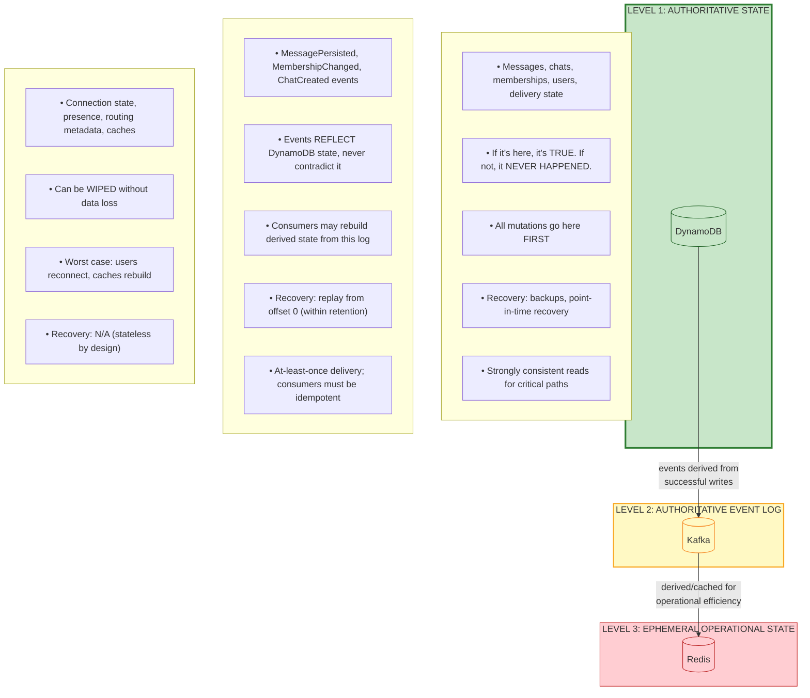
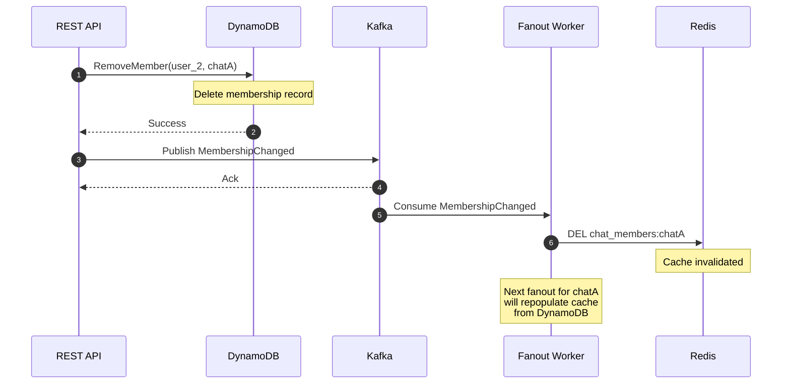
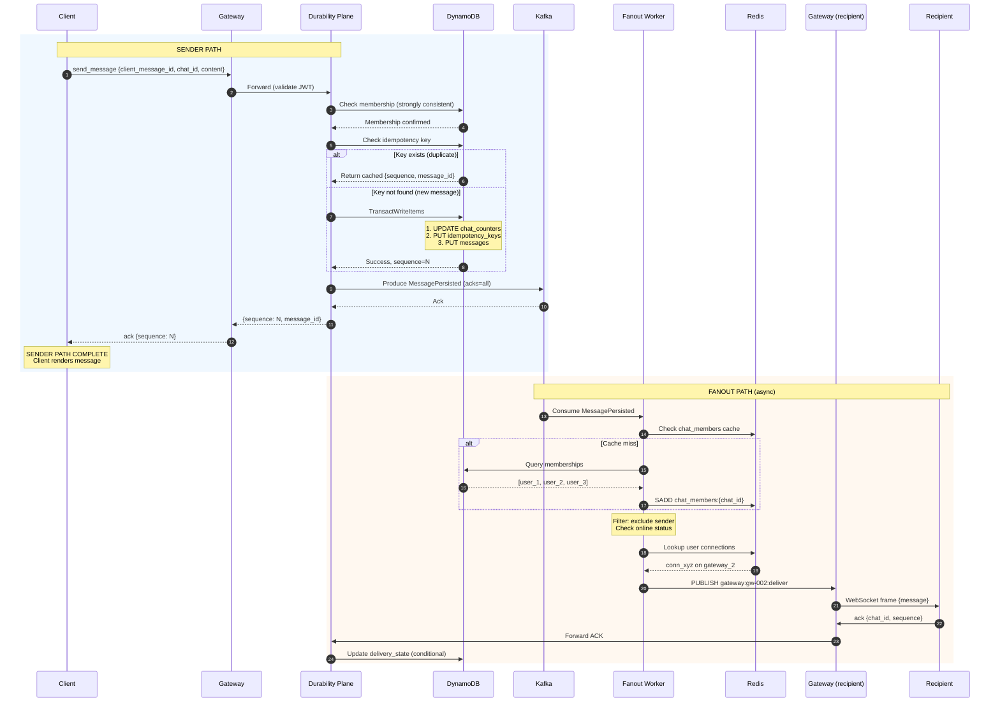
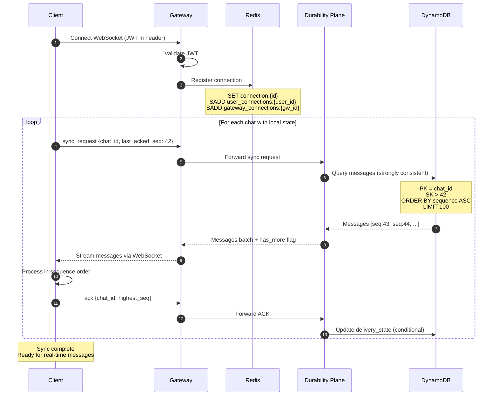
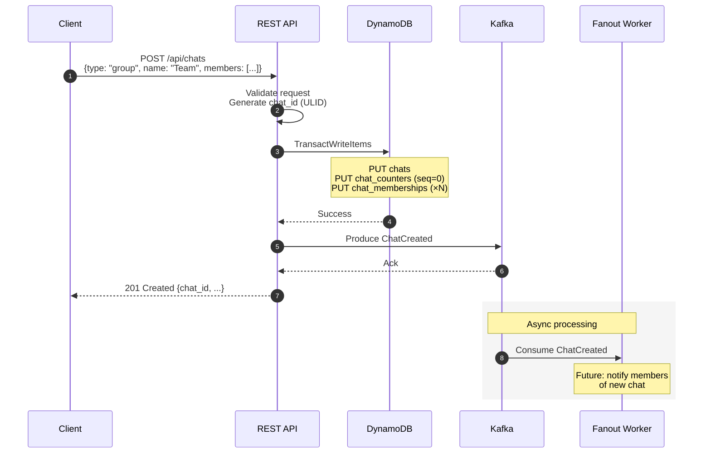
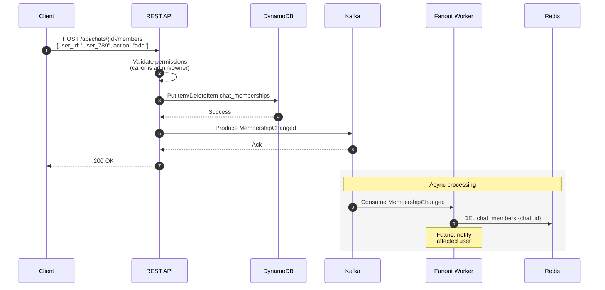
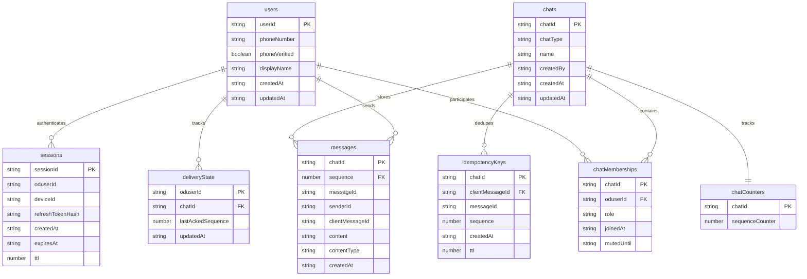
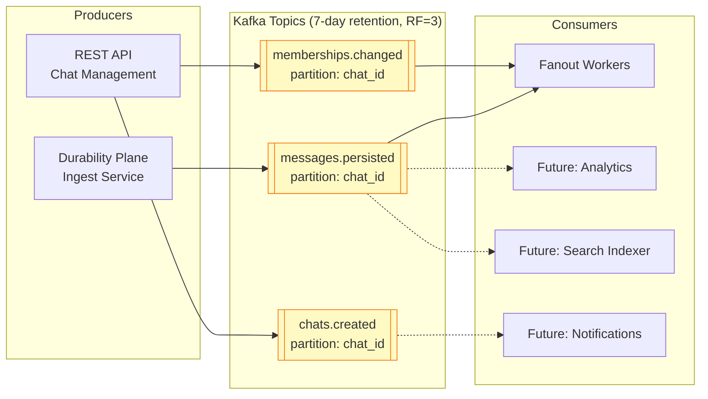
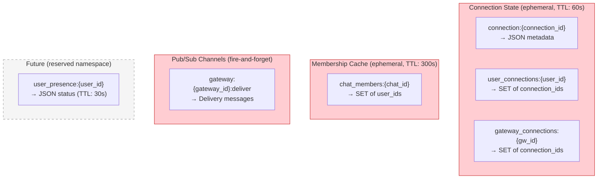

# ADR-003: Source of Truth and Dataflow

- **Status**: Accepted
- **Date**: 2026-01-30

---

## Context and Problem Statement

ADR-002 established the three-plane architecture and introduced a preliminary source of truth hierarchy (DynamoDB → Kafka → Redis). However, that treatment was intentionally high-level. A production messaging system requires precise answers to questions that arise during implementation and incident response:

- Which DynamoDB table owns which data, and what are the exact access patterns?
- When Kafka and DynamoDB disagree, what is the reconciliation procedure?
- How does data flow through the system during normal operation vs. recovery?
- What consistency guarantees can downstream consumers rely on?
- How do we prevent accidental violations of the authority hierarchy?

Without explicit answers, engineers may make well-intentioned decisions that subtly violate system invariants. For example, a developer might cache membership data in Redis with a long TTL, then use that cache as the source of truth for access control—accidentally making Redis authoritative for security-critical data.

**Core Question:** What is the complete specification of data ownership, storage schemas, access patterns, and dataflow contracts that govern the messaging system?

---

## Decision Drivers

1. **Unambiguous Ownership**: Every piece of system state must have exactly one authoritative store. "Which system is right?" must always have a clear answer.

2. **Recoverable by Design**: The system must be recoverable from the authoritative store alone. Derived state can be rebuilt; authoritative state cannot.

3. **Access Pattern Alignment**: Storage choices must align with actual query patterns. A mismatch creates latency problems or forces workarounds that violate ownership boundaries.

4. **Operational Debuggability**: On-call engineers must be able to trace any piece of data to its authoritative source and understand how it propagates.

5. **Explicit Consistency Boundaries**: Engineers must know which reads are strongly consistent, which are eventually consistent, and what the propagation delay bounds are.

6. **Prevention over Detection**: The architecture should make ownership violations difficult to introduce, not just detectable after the fact.

---

## Considered Options

### Option 1: Single Authoritative Store (DynamoDB Only)

All durable state lives in DynamoDB. Kafka is used purely for transient event notification. Redis is purely for caching with no durable semantics.

**Mechanism**: DynamoDB tables for everything; Kafka as ephemeral pub/sub; aggressive caching in Redis.

### Option 2: Event Sourcing (Kafka as Primary)

Kafka is the authoritative log; DynamoDB is a materialized view rebuilt from Kafka. This inverts the traditional relationship.

**Mechanism**: All writes go to Kafka first; consumers materialize state to DynamoDB; replays reconstruct state.

### Option 3: Tiered Authority with Explicit Contracts (DynamoDB + Kafka + Redis)

DynamoDB is authoritative for entity state. Kafka is the authoritative event log for what happened (derived from DynamoDB writes). Redis holds only ephemeral operational state.

**Mechanism**: Writes to DynamoDB trigger events to Kafka; Kafka consumers never modify authoritative state; Redis can be wiped without data loss.

### Option 4: Polyglot Persistence with Domain-Driven Ownership

Different bounded contexts own different stores. Messages owned by Kafka, memberships by DynamoDB, presence by Redis—each domain chooses its optimal store.

**Mechanism**: Per-domain store selection; explicit anti-corruption layers at boundaries.

---

## Decision Outcome

**Chosen Option: Option 3 — Tiered Authority with Explicit Contracts**

This approach provides clear ownership semantics while leveraging each technology's strengths. DynamoDB's transactional consistency is ideal for entity state; Kafka's ordered log is ideal for event propagation; Redis's low latency is ideal for ephemeral operational data.

The key insight is that **authority and storage are different concerns**. DynamoDB is authoritative for *current state*; Kafka is authoritative for *what events occurred*; Redis is authoritative for *nothing* (it's a cache and coordination layer).

### Authority Hierarchy



### Foundational Rules

| Rule | Statement | Violation Example |
|------|-----------|-------------------|
| **DynamoDB-First Writes** | All entity mutations write to DynamoDB before any other system. | Writing to Kafka before DynamoDB confirmation. |
| **Kafka Reflects, Never Contradicts** | Kafka events are derived from successful DynamoDB writes. If Kafka has an event, DynamoDB has the corresponding state. | Publishing a MessagePersisted event before the DynamoDB transaction commits. |
| **Redis is Ephemeral** | Redis may be wiped at any time. The only consequence is operational (reconnections, cache misses). | Storing delivery receipts only in Redis. |
| **Downstream Never Writes Upstream** | Fanout Plane (Kafka consumer) never writes to DynamoDB. Connection Plane (Redis user) never writes to Kafka. | Fanout worker updating message state in DynamoDB. |
| **Conflicts Resolve to DynamoDB** | When any two systems disagree, DynamoDB is correct. | Trusting a Kafka event over a DynamoDB query. |

---

## Detailed Design

### 1. DynamoDB Schema (Authoritative State)

DynamoDB is the single source of truth for all persistent entity state. The schema is designed around access patterns, not normalized relations.

#### 1.1 Table: `users`

Stores user identity and profile information.

| Attribute | Type | Key | Description |
|-----------|------|-----|-------------|
| `user_id` | String | PK | Unique identifier (ULID format: `user_01HQX...`) |
| `phone_number` | String | — | E.164 format, indexed via GSI |
| `phone_verified` | Boolean | — | Whether phone ownership is confirmed |
| `display_name` | String | — | User-chosen display name |
| `created_at` | String | — | ISO 8601 timestamp |
| `updated_at` | String | — | ISO 8601 timestamp |

**GSI: `phone_number-index`**
- Partition Key: `phone_number`
- Projection: `user_id` only (sparse index for lookup)

**Access Patterns:**
| Pattern | Operation | Key Condition |
|---------|-----------|---------------|
| Get user by ID | GetItem | `PK = user_id` |
| Find user by phone | Query GSI | `phone_number = X` |

#### 1.2 Table: `chats`

Stores chat metadata. Does NOT embed participants (see `chat_memberships`).

| Attribute | Type | Key | Description |
|-----------|------|-----|-------------|
| `chat_id` | String | PK | Unique identifier (ULID format: `chat_01HQX...`) |
| `chat_type` | String | — | `direct` or `group` |
| `name` | String | — | Display name (null for direct chats) |
| `created_by` | String | — | `user_id` of creator |
| `created_at` | String | — | ISO 8601 timestamp |
| `updated_at` | String | — | ISO 8601 timestamp |

**No GSI**: Chats are always accessed by `chat_id` (from membership lookups).

**Access Patterns:**
| Pattern | Operation | Key Condition |
|---------|-----------|---------------|
| Get chat metadata | GetItem | `PK = chat_id` |

#### 1.3 Table: `chat_memberships`

Maps users to chats. Supports bidirectional queries.

| Attribute | Type | Key | Description |
|-----------|------|-----|-------------|
| `chat_id` | String | PK | Partition key |
| `user_id` | String | SK | Sort key |
| `role` | String | — | `owner`, `admin`, `member` |
| `joined_at` | String | — | ISO 8601 timestamp |
| `muted_until` | String | — | ISO 8601 timestamp or null |

**GSI: `user_chats-index`**
- Partition Key: `user_id`
- Sort Key: `chat_id`
- Projection: ALL

**Access Patterns:**
| Pattern | Operation | Key Condition |
|---------|-----------|---------------|
| List chat members | Query | `PK = chat_id` |
| List user's chats | Query GSI | `user_id = X` |
| Check membership | GetItem | `PK = chat_id, SK = user_id` |
| Add member | PutItem | Conditional: attribute_not_exists(SK) |
| Remove member | DeleteItem | `PK = chat_id, SK = user_id` |

**Critical Invariant**: A user can send messages to a chat if and only if a membership record exists. The Durability Plane checks this on every message ingest.

#### 1.4 Table: `messages`

Stores message content. Partitioned by chat for locality.

| Attribute | Type | Key | Description |
|-----------|------|-----|-------------|
| `chat_id` | String | PK | Partition key |
| `sequence` | Number | SK | Sort key (monotonic per chat) |
| `message_id` | String | — | Globally unique (ULID: `msg_01HQX...`) |
| `sender_id` | String | — | `user_id` of sender |
| `client_message_id` | String | — | Client-provided idempotency key |
| `content` | String | — | Message text (UTF-8, ≤ 4KB) |
| `content_type` | String | — | MIME type (`text/plain` for MVP) |
| `created_at` | String | — | ISO 8601 timestamp (server time) |

**No GSI**: Messages are always accessed by `(chat_id, sequence)` or `(chat_id, sequence range)`.

**Access Patterns:**
| Pattern | Operation | Key Condition |
|---------|-----------|---------------|
| Get single message | GetItem | `PK = chat_id, SK = sequence` |
| Get messages after sequence | Query | `PK = chat_id, SK > last_acked_sequence` |
| Get recent messages | Query | `PK = chat_id`, ScanIndexForward=false, Limit=N |

#### 1.5 Table: `chat_counters`

Stores per-chat sequence counters. Separated from `chats` to avoid contention on chat metadata.

| Attribute | Type | Key | Description |
|-----------|------|-----|-------------|
| `chat_id` | String | PK | Partition key |
| `sequence_counter` | Number | — | Current highest sequence (atomic counter) |

**Access Patterns:**
| Pattern | Operation | Notes |
|---------|-----------|-------|
| Allocate sequence | UpdateItem | `ADD sequence_counter :1`, ReturnValues=UPDATED_NEW |

**Why Separate Table?** Sequence allocation is extremely hot (every message). Keeping it separate allows independent provisioning and prevents contention with chat metadata updates.

#### 1.6 Table: `idempotency_keys`

Tracks processed client message IDs for duplicate detection.

| Attribute | Type | Key | Description |
|-----------|------|-----|-------------|
| `chat_id` | String | PK | Partition key (locality with messages) |
| `client_message_id` | String | SK | Client-provided UUID |
| `message_id` | String | — | Server-assigned message ID |
| `sequence` | Number | — | Assigned sequence number |
| `created_at` | String | — | ISO 8601 timestamp |
| `ttl` | Number | — | Unix timestamp for DynamoDB TTL (7 days) |

**Access Patterns:**
| Pattern | Operation | Key Condition |
|---------|-----------|---------------|
| Check duplicate | GetItem | `PK = chat_id, SK = client_message_id` |
| Insert key | PutItem | Conditional: attribute_not_exists(SK) |

**TTL Behavior**: DynamoDB automatically deletes items after `ttl` timestamp. This is eventually consistent (may take up to 48 hours after TTL expiration).

#### 1.7 Table: `delivery_state`

Tracks per-user per-chat delivery watermarks.

| Attribute | Type | Key | Description |
|-----------|------|-----|-------------|
| `user_id` | String | PK | Partition key |
| `chat_id` | String | SK | Sort key |
| `last_acked_sequence` | Number | — | Highest sequence delivered to this user |
| `updated_at` | String | — | ISO 8601 timestamp |

**Access Patterns:**
| Pattern | Operation | Key Condition |
|---------|-----------|---------------|
| Get delivery state | GetItem | `PK = user_id, SK = chat_id` |
| Update watermark | UpdateItem | SET if new value > current |
| List unread chats | Query + Filter | `PK = user_id`, filter by comparing to chat's current sequence |

**Semantic Clarification**: The `last_acked_sequence` field indicates that the message was **delivered to the client application over the WebSocket connection**. It does NOT indicate that the user has read or seen the message. This is transport-level delivery acknowledgment, not user-level read receipts—the latter are explicitly out of scope for MVP per the MVP Definition.

**Update Semantics**: Watermarks only move forward. The update uses a condition expression:

```
UpdateItem:
  SET last_acked_sequence = :new_seq, updated_at = :now
  CONDITION: attribute_not_exists(last_acked_sequence) OR last_acked_sequence < :new_seq
```

This prevents race conditions where out-of-order ACKs could move the watermark backward.

#### 1.8 Table: `sessions`

Stores active user sessions (JWT refresh tokens, device bindings).

| Attribute | Type | Key | Description |
|-----------|------|-----|-------------|
| `session_id` | String | PK | Unique identifier (ULID) |
| `user_id` | String | — | Owning user, indexed via GSI |
| `device_id` | String | — | Client-generated device identifier |
| `refresh_token_hash` | String | — | SHA-256 of refresh token |
| `created_at` | String | — | ISO 8601 timestamp |
| `expires_at` | String | — | ISO 8601 timestamp |
| `ttl` | Number | — | Unix timestamp for automatic cleanup |

**GSI: `user_sessions-index`**
- Partition Key: `user_id`
- Projection: ALL

**Access Patterns:**
| Pattern | Operation | Key Condition |
|---------|-----------|---------------|
| Validate session | GetItem | `PK = session_id` |
| List user sessions | Query GSI | `user_id = X` |
| Revoke session | DeleteItem | `PK = session_id` |
| Revoke all sessions | Query GSI + BatchDelete | `user_id = X` |

---

### 2. Kafka Schema (Authoritative Event Log)

Kafka stores the authoritative record of what events occurred. Events are derived from successful DynamoDB writes and are immutable once published.

#### 2.1 Topic: `messages.persisted`

Published by Durability Plane after successful message persistence.

**Partitioning**: By `chat_id` (ensures per-chat ordering mirrors DynamoDB sequence order)
**Retention**: 7 days
**Replication Factor**: 3
**Acknowledgment**: `acks=all`

**Event Schema:**

```json
{
  "event_type": "MessagePersisted",
  "event_id": "evt_01HQX...",
  "event_time": "2026-01-30T14:30:00.000Z",
  "partition_key": "chat_abc123",
  "payload": {
    "message_id": "msg_01HQX...",
    "chat_id": "chat_abc123",
    "sequence": 47,
    "sender_id": "user_456",
    "content": "Hello, world!",
    "content_type": "text/plain",
    "created_at": "2026-01-30T14:30:00.000Z"
  }
}
```

**Consumers:**
- Fanout Plane (primary): Routes messages to online recipients
- Analytics (future): Aggregates messaging statistics
- Search indexer (future): Indexes messages for full-text search

#### 2.2 Topic: `memberships.changed`

Published by REST API (chat management) after membership mutations.

**Partitioning**: By `chat_id`
**Retention**: 7 days
**Replication Factor**: 3

**Event Schema:**

```json
{
  "event_type": "MembershipChanged",
  "event_id": "evt_01HQX...",
  "event_time": "2026-01-30T14:30:00.000Z",
  "partition_key": "chat_abc123",
  "payload": {
    "chat_id": "chat_abc123",
    "user_id": "user_789",
    "change_type": "added",
    "role": "member",
    "changed_by": "user_456"
  }
}
```

**Change Types**: `added`, `removed`, `role_changed`

**Consumers:**
- Fanout Plane: Invalidates membership cache
- Notification service (future): Sends "X added you to Y" notifications

#### 2.3 Topic: `chats.created`

Published when new chats are created.

**Partitioning**: By `chat_id`
**Retention**: 7 days

**Event Schema:**

```json
{
  "event_type": "ChatCreated",
  "event_id": "evt_01HQX...",
  "event_time": "2026-01-30T14:30:00.000Z",
  "partition_key": "chat_abc123",
  "payload": {
    "chat_id": "chat_abc123",
    "chat_type": "group",
    "name": "Project Team",
    "created_by": "user_456",
    "initial_members": ["user_456", "user_789", "user_012"]
  }
}
```

#### 2.4 Event Ordering Guarantees

| Guarantee | Mechanism |
|-----------|-----------|
| Per-chat message ordering | Kafka partition by `chat_id`; sequence assigned before publish |
| Event reflects committed state | Kafka publish happens after DynamoDB transaction commit |
| At-least-once delivery | Consumer offset commits after processing |
| Replay safety | Consumers must be idempotent (ADR-001) |

**Critical Invariant**: If a `MessagePersisted` event exists in Kafka with `sequence = N`, then a message with `sequence = N` exists in DynamoDB `messages` table. The reverse is not guaranteed during brief windows (DynamoDB committed, Kafka publish in flight).

---

### 3. Redis Schema (Ephemeral Operational State)

Redis stores operational state that enhances performance but is not required for correctness. All Redis data can be lost without data loss.

#### 3.1 Connection State

Tracks active WebSocket connections for routing.

**Key Patterns:**

```
connection:{connection_id}     → JSON { user_id, device_id, gateway_id, connected_at }
                                 TTL: 60 seconds (2x heartbeat interval)

user_connections:{user_id}     → SET of connection_ids
                                 TTL: 60 seconds

gateway_connections:{gateway_id} → SET of connection_ids
                                   TTL: 60 seconds
```

**Operations:**

| Operation | Redis Command | Notes |
|-----------|---------------|-------|
| Register connection | MULTI: SET + SADD + SADD + EXPIRE | Atomic registration |
| Heartbeat | EXPIRE on all keys | Refresh TTLs |
| Lookup user connections | SMEMBERS | Returns all devices |
| Graceful gateway drain | SMEMBERS gateway_connections | Lists connections to migrate |

**Recovery**: If Redis loses connection state, affected clients experience connection timeout and reconnect. No messages are lost; clients sync on reconnect.

#### 3.2 Membership Cache

Caches chat membership for fanout efficiency.

**Key Pattern:**

```
chat_members:{chat_id}         → SET of user_ids
                                 TTL: 300 seconds (5 minutes)
```

**Operations:**

| Operation | Redis Command | Notes |
|-----------|---------------|-------|
| Get members | SMEMBERS | Cache hit |
| Cache miss | Query DynamoDB → SADD + EXPIRE | Populate from authority |
| Invalidate | DEL | On MembershipChanged event |

**Consistency**: Cache may be stale by up to 5 minutes OR until invalidation event arrives (whichever is sooner). This is acceptable per ADR-002's "Membership Authority is Eventual" axiom. The staleness window is bounded by `min(cache TTL, event propagation latency)`—typically under 1 second for invalidation events, worst case 5 minutes if invalidation fails.

**Cache Invalidation Flow:**



#### 3.3 Presence (Future)

Out of scope for MVP but reserved namespace:

```
user_presence:{user_id}        → JSON { status, last_seen }
                                 TTL: 30 seconds (refreshed by heartbeat)
```

#### 3.4 Redis Pub/Sub Channels

Used for real-time communication between Fanout Workers and Gateways.

**Channel Pattern:**

```
gateway:{gateway_id}:deliver   → Messages for specific gateway
```

**Message Format:**

```json
{
  "type": "deliver",
  "connection_id": "conn_xyz",
  "message": {
    "type": "message",
    "message_id": "msg_01HQX...",
    "chat_id": "chat_abc123",
    "sequence": 47,
    "sender_id": "user_456",
    "content": "Hello, world!",
    "created_at": "2026-01-30T14:30:00.000Z"
  }
}
```

**Reliability**: Redis Pub/Sub is fire-and-forget. If a gateway misses a message (e.g., brief disconnect from Redis), the client catches up via sync-on-reconnect.

---

### 4. Dataflow Specifications

This section defines the complete data paths through the system for each major operation.

#### 4.1 Message Send (Happy Path)



**Write Summary:**

| Store | Data Written | Step |
|-------|--------------|------|
| DynamoDB | `chat_counters` (increment) | 5 |
| DynamoDB | `idempotency_keys` (insert) | 5 |
| DynamoDB | `messages` (insert) | 5 |
| Kafka | `MessagePersisted` event | 6 |
| Redis | `chat_members:{chat_id}` (cache) | 10 |
| Redis | Gateway pub/sub channel | 11 |
| DynamoDB | `delivery_state` (update) | 15 |

#### 4.2 Client Reconnection Sync



**Key Insight**: Sync reads exclusively from DynamoDB (authoritative). It never relies on Kafka state or Redis cache. This ensures correctness even if Kafka is unavailable or Redis was recently wiped.

#### 4.3 Chat Creation



#### 4.4 Membership Change



---

### 5. Consistency Boundaries

This section explicitly defines what consistency guarantees apply at each system boundary.

#### 5.1 DynamoDB Consistency

| Operation | Consistency | Rationale |
|-----------|-------------|-----------|
| Message write (TransactWriteItems) | Serializable | Transaction guarantees atomicity |
| Membership check during ingest | Strongly consistent | Critical for access control |
| Message query for sync | Strongly consistent | Client expects authoritative state |
| Chat metadata read | Eventually consistent | Stale metadata acceptable |
| Delivery state update | Strongly consistent | Watermark must not regress |

**Why Strongly Consistent for Critical Reads?** DynamoDB strongly consistent reads have ~2x latency of eventually consistent reads. We pay this cost for:
- Membership checks (security-critical)
- Sync queries (correctness-critical)

We accept eventual consistency for non-critical reads (chat metadata, user profiles).

#### 5.2 Kafka Consistency

| Guarantee | Configuration | Trade-off |
|-----------|---------------|-----------|
| Durability | `acks=all`, replication factor 3 | Higher write latency, no data loss |
| Ordering | Per-partition (partition by `chat_id`) | No cross-chat ordering (acceptable) |
| Delivery | At-least-once (consumer commits after processing) | Consumers must be idempotent |

**Kafka ↔ DynamoDB Consistency Window:**

Between DynamoDB commit and Kafka acknowledgment, there is a brief window (typically <100ms) where:
- DynamoDB has the message
- Kafka does not yet have the event

During this window:
- Sender has received ACK (correct: message is durable)
- Recipients have not received fanout (expected: fanout is async)
- Sync queries return the message (correct: reads DynamoDB)

This is not a consistency violation—it's the expected behavior of the asynchronous fanout model.

#### 5.3 Redis Consistency

| Data | Consistency | Impact of Staleness |
|------|-------------|---------------------|
| Connection state | TTL-bounded (~60s) | Dead connections time out; clients reconnect |
| Membership cache | TTL-bounded (~5min) or event-invalidated | Removed member may receive 1 extra message |
| Gateway pub/sub | Fire-and-forget | Missed delivery caught by sync |

**Redis is explicitly not consistent with DynamoDB.** This is by design:

```
Time 0:  User removed from chat (DynamoDB updated)
Time 1:  MembershipChanged event in flight
Time 2:  Message sent to chat
Time 3:  Fanout uses stale cache (user still listed)
Time 4:  Removed user receives message (ACCEPTABLE)
Time 5:  Event consumed, cache invalidated
Time 6+: Removed user no longer receives messages
```

Per ADR-002's "Membership Authority is Eventual" axiom, this edge case is acceptable and matches production behavior of Slack, WhatsApp, and Discord.

---

### 6. Anti-Corruption Patterns

These patterns prevent accidental violations of the authority hierarchy.

#### 6.1 Write Path Validation

The Durability Plane enforces that writes occur in the correct order:

```python
# Pseudocode for message ingest
def persist_message(request):
    # 1. Always check DynamoDB for membership (never Redis)
    membership = dynamodb.get_item(
        TableName='chat_memberships',
        Key={'chat_id': request.chat_id, 'user_id': request.sender_id},
        ConsistentRead=True  # CRITICAL: strong consistency
    )
    if not membership:
        raise NotAMemberError()
    
    # 2. DynamoDB transaction MUST succeed before Kafka publish
    try:
        sequence = dynamodb.transact_write_items([
            # ... counter, idempotency key, message
        ])
    except Exception:
        # Kafka publish NEVER happens if DynamoDB fails
        raise
    
    # 3. Kafka publish happens AFTER DynamoDB commit
    kafka.produce(
        topic='messages.persisted',
        key=request.chat_id,
        value=build_event(request, sequence)
    ).get(timeout=5)  # Synchronous wait
    
    return sequence
```

**Key Invariant**: The `kafka.produce()` call is inside the `try` block but after `transact_write_items()`. If Kafka fails, we raise an error to the client—the message is durable but not fanned out. The client will retry, idempotency will kick in, and the second attempt will successfully publish to Kafka.

> **Fanout Guarantee (MVP Scope)**: Real-time fanout is guaranteed *eventually*, assuming at least one successful client retry after Kafka recovery. The system does **not** provide autonomous fanout recovery without client participation in MVP. If the client crashes permanently after DynamoDB commit but before successful Kafka publish, the message is durable (recipients can retrieve it via sync) but will never be proactively fanned out. This is an acceptable trade-off for MVP simplicity—a background reconciliation job could be added in a future stage to close this gap.

#### 6.2 Read Path Layering

Consumers follow strict layering when reading data:

```python
# Pseudocode for fanout membership resolution
def get_chat_members(chat_id):
    # 1. Try cache first (Redis)
    members = redis.smembers(f'chat_members:{chat_id}')
    if members:
        return members  # Cache hit
    
    # 2. Cache miss: query authoritative source (DynamoDB)
    # NEVER query Kafka for current state
    response = dynamodb.query(
        TableName='chat_memberships',
        KeyConditionExpression='chat_id = :cid',
        ExpressionAttributeValues={':cid': chat_id}
    )
    members = [item['user_id'] for item in response['Items']]
    
    # 3. Populate cache for future requests
    if members:
        redis.sadd(f'chat_members:{chat_id}', *members)
        redis.expire(f'chat_members:{chat_id}', 300)
    
    return members
```

**Key Invariant**: Redis is only populated from DynamoDB, never from Kafka events. This ensures the cache reflects authoritative state, not event-derived state that might be incomplete during replay scenarios.

#### 6.3 Downstream Write Prohibition

Fanout workers are explicitly prohibited from writing to DynamoDB:

```python
# Fanout worker initialization
class FanoutWorker:
    def __init__(self, config):
        # Read-only DynamoDB client (enforced by IAM)
        self.dynamodb = create_readonly_client('dynamodb', config)
        
        # Full access to Redis (ephemeral)
        self.redis = create_client('redis', config)
        
        # Consumer only for Kafka (no producer)
        self.kafka = create_consumer('kafka', config)
```

**IAM Policy Enforcement:**

```json
{
  "Version": "2012-10-17",
  "Statement": [
    {
      "Effect": "Allow",
      "Action": [
        "dynamodb:GetItem",
        "dynamodb:Query",
        "dynamodb:Scan"
      ],
      "Resource": "arn:aws:dynamodb:*:*:table/*"
    },
    {
      "Effect": "Deny",
      "Action": [
        "dynamodb:PutItem",
        "dynamodb:UpdateItem",
        "dynamodb:DeleteItem",
        "dynamodb:TransactWriteItems"
      ],
      "Resource": "*"
    }
  ]
}
```

This makes it impossible for a Fanout worker to accidentally violate the "Downstream Never Writes Upstream" rule, even with a bug in the code.

---

### 7. Recovery Procedures

This section defines how to recover from various failure scenarios.

#### 7.1 Redis Total Loss

**Scenario**: Redis cluster fails completely; all data lost.

**Impact**:
- All active WebSocket connections eventually timeout
- Connection routing unavailable
- Membership cache empty
- Pub/sub channels unavailable

**Recovery**:
1. Restore Redis cluster (or provision new one)
2. No data migration needed (Redis is ephemeral by design)
3. Clients reconnect automatically
4. Connection state rebuilds as clients connect
5. Membership cache rebuilds on first fanout per chat

**Data Loss**: None. Messages are in DynamoDB.

**Downtime**: Duration of Redis cluster restoration + client reconnection (~1-5 minutes).

#### 7.2 Kafka Unavailability

**Scenario**: Kafka cluster is unreachable (network partition, broker failures).

**Impact**:
- Message sends fail at step 6 (after DynamoDB commit)
- Fanout stops (no events to consume)
- No new messages delivered in real-time

**Recovery**:
1. Fix Kafka cluster
2. Fanout workers resume from last committed offset
3. Messages persisted during outage are fanned out

**Data Loss**: None. Messages are in DynamoDB. Events will be published on retry or recovered from Kafka's durability.

**Subtle Case**: If DynamoDB commit succeeds but Kafka publish fails, the message is durable but not fanned out. The client receives an error and retries:
- Idempotency check finds existing key
- Returns cached {sequence, message_id}
- Kafka publish succeeds (Kafka now available)
- Message fans out

#### 7.3 DynamoDB Unavailability

**Scenario**: DynamoDB is unreachable or returning errors.

**Impact**:
- Message sends fail immediately
- Sync queries fail
- Membership checks fail
- No messages can be sent or retrieved

**Recovery**:
1. Wait for DynamoDB recovery (AWS-managed)
2. No manual intervention needed
3. System automatically resumes

**Data Loss**: None (DynamoDB is replicated across 3 AZs).

**During Outage**: Clients see errors for all operations requiring persistence. This is correct behavior—we cannot provide durability guarantees without the durable store.

#### 7.4 Rebuilding Derived State from Kafka

**Scenario**: Need to rebuild a derived system (e.g., search index, analytics) from scratch.

**Procedure**:
1. Deploy new consumer with fresh consumer group ID
2. Configure to start from offset 0 (beginning of retention)
3. Consumer replays all events, rebuilding state
4. Once caught up, switch traffic to new system

**Limitation**: Kafka retention is 7 days. Events older than 7 days cannot be replayed from Kafka. For full rebuilds, query DynamoDB directly (it's authoritative).

> **Important**: Kafka is an *operational event log*, not a complete system ledger. It exists to drive real-time fanout and enable short-term replay for consumer recovery. DynamoDB remains the only complete historical source beyond the retention window. This is intentional—Kafka is optimized for throughput and recency, not archival.

#### 7.5 Reconciling DynamoDB and Kafka Divergence

**Scenario**: Suspicion that Kafka events don't match DynamoDB state (rare, indicates bug).

**Procedure**:
1. **Stop fanout workers** (prevent further divergence)
2. **Query DynamoDB** for messages in affected chat(s)
3. **Query Kafka** topic for events in affected partition(s)
4. **Identify discrepancies**:
   - Message in DynamoDB, no event in Kafka → Kafka publish failed
   - Event in Kafka, no message in DynamoDB → Should never happen (bug)
5. **Remediation**:
   - For missing events: Republish from DynamoDB state
   - For orphan events: Investigate bug; events without DynamoDB backing are invalid
6. **Resume fanout workers**

**DynamoDB is always right.** If an event exists in Kafka without corresponding DynamoDB state, the event is invalid and should be ignored (or the orphan cleaned up).

---

## Consequences

### Positive Consequences

1. **Unambiguous Debugging**: "Where is the authoritative data?" always has a clear answer. On-call engineers don't have to guess which system to trust.

2. **Safe Recovery**: Any failure can be recovered by returning to the authoritative source. Redis wipe? Reconnect. Kafka lag? Catch up. Only DynamoDB requires AWS-level recovery.

3. **Audit Trail**: Kafka provides a complete audit log of what happened. Useful for debugging, compliance, and analytics.

4. **Technology-Appropriate Consistency**: DynamoDB provides strong consistency where needed; Kafka provides ordered events; Redis provides speed. Each system does what it's best at.

5. **Operational Isolation**: Problems in one tier don't cascade to others. Kafka down? Sync still works. Redis down? Messages still persist.

6. **IAM-Enforced Boundaries**: Architecture violations are impossible at runtime due to IAM policies that prevent downstream components from writing upstream.

### Negative Consequences

1. **Operational Overhead**: Three storage systems to operate, monitor, and maintain. Each has different failure modes and operational procedures.
   *Mitigation*: All are AWS-managed (DynamoDB, MSK, ElastiCache). Operational burden is monitoring, not infrastructure management.

2. **Latency Variability**: Message send requires DynamoDB transaction + Kafka publish. Under load, either can add latency.
   *Mitigation*: Provision appropriately; DynamoDB on-demand scaling; Kafka partition count tuned to throughput.

3. **Cost Complexity**: Three billing dimensions (DynamoDB WCU/RCU, Kafka storage/throughput, Redis nodes).
   *Mitigation*: Clear cost allocation by function; optimize independently.

4. **Consistency Mental Load**: Engineers must understand which consistency guarantees apply where.
   *Mitigation*: This ADR; explicit documentation; code reviews enforce patterns.

5. **Event Loss Window**: Brief window between DynamoDB commit and Kafka publish where event may be lost if process crashes.
   *Mitigation*: Client retry + idempotency ensures eventual Kafka publish. This is acceptable for MVP.

---

## Confirmation

The implementation of this ADR will be validated through:

1. **Schema Validation Tests**: Verify all access patterns work correctly with defined schemas.

2. **Consistency Tests**:
   - Write to DynamoDB; immediately read strongly consistent → data present
   - Write to DynamoDB; publish to Kafka; verify ordering preserved
   - Wipe Redis; verify system recovers without data loss

3. **Failure Injection Tests**:
   - Kill Kafka mid-publish; verify DynamoDB has data; verify retry succeeds
   - Wipe Redis during operation; verify clients reconnect and sync
   - DynamoDB throttling; verify graceful degradation

4. **Authority Violation Tests**:
   - Attempt to write to DynamoDB from Fanout worker; verify IAM blocks
   - Attempt to publish to Kafka from Gateway; verify IAM blocks

5. **Recovery Procedure Drills**:
   - Execute Redis total loss procedure; measure recovery time
   - Execute Kafka replay procedure; verify derived state correctness

---

## Pros and Cons of the Options

### Option 1: Single Authoritative Store (DynamoDB Only)

| Aspect | Assessment |
|--------|------------|
| Good | Simplest operational model |
| Good | Single source of truth, no reconciliation |
| Bad | **No event log**: Cannot replay history for new consumers |
| Bad | **Polling required**: Real-time fanout must poll DynamoDB |
| Bad | **Cost at scale**: DynamoDB streams have limitations |

### Option 2: Event Sourcing (Kafka as Primary)

| Aspect | Assessment |
|--------|------------|
| Good | Complete audit trail from day one |
| Good | Easy to add new consumers |
| Bad | **Kafka not designed as primary store**: Compaction, retention challenges |
| Bad | **Query latency**: Must materialize views for reads |
| Bad | **Operational complexity**: Kafka as SoT requires different tooling |
| Bad | **Recovery complexity**: Replaying entire log is slow |

### Option 3: Tiered Authority (CHOSEN)

| Aspect | Assessment |
|--------|------------|
| Good | **Clear ownership**: DynamoDB for state, Kafka for events |
| Good | **Technology-appropriate**: Each system does what it's best at |
| Good | **Recoverable**: Can rebuild derived state from authority |
| Good | **Industry-proven**: Pattern used by LinkedIn, Uber, Netflix |
| Neutral | Three systems to operate |
| Bad | Consistency boundaries require documentation |

### Option 4: Polyglot with Domain-Driven Ownership

| Aspect | Assessment |
|--------|------------|
| Good | Domains can optimize independently |
| Good | Clear team ownership |
| Bad | **Cross-domain queries**: Joining data across stores is complex |
| Bad | **Consistency nightmares**: Each domain has different guarantees |
| Bad | **Operational sprawl**: Many stores to manage |
| Bad | **Overkill for MVP**: Domain boundaries not yet clear |

---

## More Information

### Related Patterns and Prior Art

1. **LinkedIn's Databus**: Publishes database changelog to Kafka for downstream consumers. Similar to our DynamoDB → Kafka pattern.

2. **Uber's Schemaless**: Tiered storage with MySQL as source of truth, Cassandra for reads. Different technologies, same authority principle.

3. **Netflix's EVCache**: Redis as cache in front of persistent stores. Same ephemeral cache philosophy.

4. **Stripe's Dual Writes**: Writes to primary and queue atomically (where possible). We achieve similar with DynamoDB transaction + Kafka publish.

### References

- Kleppmann, M. (2017). *Designing Data-Intensive Applications*. O'Reilly Media. Chapter 11: Stream Processing.
- Amazon Web Services. "Best Practices for DynamoDB." AWS Documentation.
- Narkhede, N., Shapira, G., & Palino, T. (2017). *Kafka: The Definitive Guide*. O'Reilly Media.
- Helland, P. (2015). "Immutability Changes Everything." ACM Queue.

### Future Considerations

1. **ADR-XXX: Change Data Capture**: Using DynamoDB Streams instead of application-level Kafka publish for tighter coupling.

2. **ADR-XXX: Cross-Region Replication**: How authority hierarchy works across AWS regions.

3. **ADR-XXX: Schema Evolution**: How to evolve DynamoDB and Kafka schemas without breaking consumers.

### Why Not DynamoDB Streams? (Explicit Non-Goal for MVP)

A common question is: "Why use application-level dual writes (DynamoDB + Kafka) instead of DynamoDB Streams → Kafka?"

DynamoDB Streams is intentionally **not used in MVP** for the following reasons:

1. **Ordering ambiguity across shards**: DynamoDB Streams provides per-shard ordering, but our messages table is partitioned by `chat_id`. A single chat's messages are guaranteed ordered, but reconstructing cross-chat ordering (if ever needed) would be complex. Application-level publish gives us explicit control over event ordering.

2. **Error handling complexity**: With Streams, failures in the Lambda/Kinesis consumer are harder to reason about. Retries, dead-letter queues, and partial failures introduce operational complexity. Application-level publish keeps error handling in a single code path with clear retry semantics.

3. **Synchronous durability contract**: Our ACK-means-durable guarantee requires that the client knows the message *will* fan out. With Streams, there's a propagation delay between DynamoDB commit and Stream record availability. Application-level publish ensures Kafka acknowledgment before client ACK (or explicit error with retry).

4. **Simpler mental model for MVP**: Dual writes are easier to understand, test, and debug. The trade-off (slight redundancy, potential for divergence) is acceptable for the clarity it provides.

DynamoDB Streams remains a viable option for future stages, particularly if we need guaranteed delivery without client retry participation or want to add additional event consumers without modifying the write path.

---

## Appendix A: Complete DynamoDB Schema Summary



**Table Details:**

| Table | Keys | GSI | Notes |
|-------|------|-----|-------|
| `users` | PK: `user_id` | `phone_number-index` | User identity and profile |
| `chats` | PK: `chat_id` | — | Chat metadata |
| `chat_memberships` | PK: `chat_id`, SK: `user_id` | `user_chats-index` (user_id → chat_id) | Bidirectional membership |
| `messages` | PK: `chat_id`, SK: `sequence` | — | Message storage, ordered |
| `chat_counters` | PK: `chat_id` | — | Atomic sequence allocation |
| `idempotency_keys` | PK: `chat_id`, SK: `client_message_id` | — | TTL: 7 days |
| `delivery_state` | PK: `user_id`, SK: `chat_id` | — | Per-user delivery watermarks |
| `sessions` | PK: `session_id` | `user_sessions-index` (user_id) | TTL: expiration-based |

## Appendix B: Kafka Topic Summary



**Topic Configuration:**

| Topic | Partition Key | Retention | Replication | Purpose |
|-------|---------------|-----------|-------------|---------|
| `messages.persisted` | `chat_id` | 7 days | 3 | Trigger message delivery to recipients |
| `memberships.changed` | `chat_id` | 7 days | 3 | Membership change notifications |
| `chats.created` | `chat_id` | 7 days | 3 | New chat notifications |

## Appendix C: Redis Key Summary



**Key Properties:**

| Key Pattern | Type | TTL | Purpose |
|-------------|------|-----|---------|
| `connection:{id}` | JSON | 60s | Connection metadata |
| `user_connections:{user_id}` | SET | 60s | Multi-device support |
| `gateway_connections:{gw_id}` | SET | 60s | Graceful gateway drain |
| `chat_members:{chat_id}` | SET | 300s | Membership cache for fanout |
| `gateway:{gw_id}:deliver` | Channel | — | Real-time delivery routing |

## Appendix D: Invariants (Machine-Checkable)

```
INVARIANT dynamodb_is_authoritative:
  ∀ state S ∈ {messages, memberships, users, chats, delivery_state, sessions}:
    authoritative_source(S) = DYNAMODB
  -- DynamoDB is the single source of truth for all entity state

INVARIANT kafka_reflects_dynamodb:
  ∀ event E ∈ Kafka:
    E.type = "MessagePersisted" ∧ E.payload.message_id = M.message_id
    ⟹ ∃ M ∈ DynamoDB.messages : M.message_id = E.payload.message_id
  -- Every Kafka event corresponds to a DynamoDB record
  -- The reverse is NOT guaranteed (brief publish window)

INVARIANT redis_is_ephemeral:
  ∀ data D ∈ Redis:
    loss(D) ⟹ no_data_loss() ∧ (reconnection_required() ∨ cache_miss())
  -- Redis data loss causes only operational impact, never data loss

INVARIANT write_order_preserved:
  ∀ message M:
    write_sequence = [
      dynamodb.transact_write(M),
      kafka.produce(MessagePersisted(M))
    ]
    ∧ kafka.produce HAPPENS-AFTER dynamodb.transact_write
  -- Kafka publish never precedes DynamoDB commit

INVARIANT downstream_never_writes_upstream:
  ∀ component C:
    (C = FANOUT_PLANE ⟹ ¬can_write(C, DYNAMODB))
    ∧ (C = CONNECTION_PLANE ⟹ ¬can_write(C, KAFKA))
  -- Enforced by IAM policies

INVARIANT sync_reads_authority:
  ∀ sync_request S:
    data_source(S) = DYNAMODB ∧ consistency(S) = STRONG
  -- Sync never reads from Kafka or Redis

INVARIANT membership_check_uses_authority:
  ∀ message_ingest M:
    membership_check(M).source = DYNAMODB
    ∧ membership_check(M).consistency = STRONG
  -- Security-critical membership checks use authoritative source

INVARIANT cache_populated_from_authority:
  ∀ cache_write W ∈ Redis:
    W.source ∈ {DYNAMODB_QUERY, COMPUTED_FROM_DYNAMODB}
  -- Cache is never populated from Kafka events directly

INVARIANT delivery_watermark_monotonic:
  ∀ user U, chat C, time T1 < T2:
    delivery_state(U, C, T1).last_acked_sequence 
      ≤ delivery_state(U, C, T2).last_acked_sequence
  -- Delivery watermarks only move forward (enforced by conditional write)

INVARIANT conflict_resolution:
  ∀ state S, time T:
    disagree(dynamodb(S, T), kafka(S, T)) ∨ disagree(dynamodb(S, T), redis(S, T))
    ⟹ authoritative_value(S, T) = dynamodb(S, T)
  -- DynamoDB wins all conflicts
```

## Appendix E: Access Pattern Quick Reference

| I need to... | Query | Table/Index | Consistency |
|--------------|-------|-------------|-------------|
| Get user by ID | GetItem(user_id) | users | Eventually |
| Find user by phone | Query(phone_number) | users.phone_number-index | Eventually |
| Get chat metadata | GetItem(chat_id) | chats | Eventually |
| List chat members | Query(chat_id) | chat_memberships | **Strongly** (for ingest) |
| List user's chats | Query(user_id) | chat_memberships.user_chats-index | Eventually |
| Check if user in chat | GetItem(chat_id, user_id) | chat_memberships | **Strongly** |
| Get messages after seq | Query(chat_id, SK > seq) | messages | **Strongly** |
| Get recent messages | Query(chat_id), Limit, ScanIndexForward=false | messages | **Strongly** |
| Allocate sequence | UpdateItem(ADD) | chat_counters | N/A (write) |
| Check idempotency | GetItem(chat_id, client_message_id) | idempotency_keys | Eventually* |
| Get delivery state | GetItem(user_id, chat_id) | delivery_state | Eventually |
| Update delivery state | UpdateItem (conditional) | delivery_state | N/A (write) |

*Idempotency check is followed by conditional write, so eventual consistency is acceptable.
