# ADR-005: WebSocket Protocol Contract

- **Status**: Accepted
- **Date**: 2026-01-31

---

## Context and Problem Statement

ADR-001 through ADR-004 established the foundational architecture: per-chat ordering with server-assigned sequences, three-plane separation (Connection, Durability, Fanout), DynamoDB as the source of truth, and atomic counter-based sequence allocation. However, none of these documents specify the precise wire protocol that clients use to communicate with the system over WebSockets.

A real-time messaging system requires a well-defined protocol contract that answers:

- What message types exist, and what are their exact schemas?
- How does authentication and session binding work at the WebSocket level?
- What is the connection lifecycle (handshake, steady state, graceful close)?
- How are errors communicated to clients?
- What timing guarantees (heartbeats, timeouts) govern connection health?
- How does flow control and backpressure work?

Without an explicit protocol specification, client implementations diverge, error handling becomes inconsistent, and debugging distributed issues becomes nearly impossible. The protocol is the contract between clients and the Connection Plane—it must be precise, versioned, and testable.

**Core Question:** What is the complete WebSocket protocol specification that governs real-time communication between clients and the messaging system?

---

## Decision Drivers

1. **Interoperability**: Multiple client implementations (web, mobile, test harnesses) must behave identically. The protocol must be unambiguous.

2. **Debuggability**: Every message must be traceable. Protocol violations must be detectable and reportable.

3. **Resilience**: The protocol must handle network instability, client crashes, and server restarts gracefully.

4. **Efficiency**: Minimize round trips for common operations. Avoid chatty protocols that add latency.

5. **Extensibility**: The protocol must support future message types without breaking existing clients.

6. **Security**: Authentication must be enforced at connection time. Unauthorized operations must be rejected immediately.

7. **Simplicity**: Favor well-understood patterns (JSON over WebSocket) over novel or complex encodings for MVP.

---

## Considered Options

### Option 1: Custom Binary Protocol

Design a compact binary protocol with fixed headers and variable payloads for maximum efficiency.

**Mechanism**: Binary framing with type bytes, length prefixes, and Protocol Buffers or MessagePack payloads.

### Option 2: JSON over WebSocket (Text Frames)

Use JSON-encoded messages over WebSocket text frames with a consistent envelope structure.

**Mechanism**: JSON objects with `type` field for routing and type-specific payloads.

### Option 3: GraphQL Subscriptions

Use GraphQL subscription protocol over WebSocket for real-time updates.

**Mechanism**: graphql-ws or subscriptions-transport-ws protocol with GraphQL query language.

### Option 4: Socket.IO Protocol

Adopt the Socket.IO protocol for its built-in features (auto-reconnect, multiplexing, fallbacks).

**Mechanism**: Socket.IO client/server libraries with event-based communication.

### Option 5: gRPC-Web with Streaming

Use gRPC-Web for type-safe, schema-driven communication with server streaming.

**Mechanism**: Protocol Buffers over HTTP/2 with streaming responses.

---

## Decision Outcome

**Chosen Option: Option 2 — JSON over WebSocket (Text Frames)**

JSON over WebSocket provides the right balance of simplicity, debuggability, and universality for MVP. Every platform has native JSON support, messages are human-readable in logs and debugging tools, and the overhead is acceptable for text-based chat messages.

The protocol uses a consistent envelope structure with a `type` field for message routing and type-specific payloads. Versioning is built into the envelope for future evolution.

### Protocol Overview

```mermaid
flowchart TB
    subgraph STACK
        STACK_HEADER["PROTOCOL LAYER STACK"]
        
        subgraph APP
            APP_HEADER["APPLICATION LAYER"]
            APP1["• Message types: send_message, message, ack, sync_request, etc."]
            APP2["• Business logic validation"]
            APP3["• Idempotency enforcement"]
            APP_HEADER --> APP1
        end
        
        subgraph FRAME
            FRAME_HEADER["FRAMING LAYER"]
            FRAME1["• JSON envelope: {type, payload, request_id, timestamp}"]
            FRAME2["• Schema validation"]
            FRAME3["• Protocol versioning"]
            FRAME_HEADER --> FRAME1
        end
        
        subgraph TRANS
            TRANS_HEADER["TRANSPORT LAYER"]
            TRANS1["• WebSocket (RFC 6455)"]
            TRANS2["• Text frames for messages"]
            TRANS3["• Ping/Pong for keepalive"]
            TRANS_HEADER --> TRANS1
        end
        
        subgraph SEC
            SEC_HEADER["SECURITY LAYER"]
            SEC1["• TLS 1.3 (wss://)"]
            SEC2["• JWT authentication at handshake"]
            SEC3["• Connection-scoped authorization"]
            SEC_HEADER --> SEC1
        end
        
        STACK_HEADER --> APP
        APP --> FRAME
        FRAME --> TRANS
        TRANS --> SEC
    end
    
    style APP fill:#e3f2fd,stroke:#1565c0
    style APP_HEADER fill:#e3f2fd,stroke:#1565c0
    style FRAME fill:#e8f5e9,stroke:#2e7d32
    style FRAME_HEADER fill:#e8f5e9,stroke:#2e7d32
    style TRANS fill:#fff3e0,stroke:#e65100
    style TRANS_HEADER fill:#fff3e0,stroke:#e65100
    style SEC fill:#fce4ec,stroke:#c2185b
    style SEC_HEADER fill:#fce4ec,stroke:#c2185b
```

### Foundational Principles

| Principle | Description |
|-----------|-------------|
| **Request-Response Correlation** | Client requests that expect a response include a `request_id`; server responses echo this ID for correlation. One-way messages (`ack`, `typing_*`) do not require `request_id`. |
| **Server-Initiated Messages** | The server may push messages at any time (new messages, presence updates). These have no `request_id`. |
| **Idempotency at Application Layer** | Protocol handles transport; idempotency is enforced by Durability Plane (ADR-001). |
| **Fail-Fast on Protocol Violations** | Malformed messages trigger immediate error response; repeated violations may close connection. |
| **Heartbeat-Based Liveness** | WebSocket ping/pong at transport level; application-level heartbeat for monitoring. |
| **Graceful Degradation** | Unknown message types are logged and ignored (forward compatibility). |

---

## Detailed Design

### 1. Connection Establishment

#### 1.1 WebSocket Handshake

Clients connect via secure WebSocket (wss://). Authentication occurs during the HTTP upgrade handshake.

**Primary Method: Authorization Header (RECOMMENDED)**

The preferred authentication method uses the `Authorization` header to avoid token leakage:

```
GET /v1/ws HTTP/1.1
Host: gateway.example.com
Upgrade: websocket
Connection: Upgrade
Sec-WebSocket-Key: dGhlIHNhbXBsZSBub25jZQ==
Sec-WebSocket-Version: 13
Authorization: Bearer {jwt}
X-Device-ID: {device_id}
```

| Header | Required | Description |
|--------|----------|-------------|
| `Authorization` | Yes | Bearer token with JWT access token |
| `X-Device-ID` | Yes | Client-generated stable device identifier (UUIDv4) |

**Fallback Method: Query Parameters (RESTRICTED)**

For clients that cannot set custom headers during WebSocket upgrade (e.g., browser WebSocket API without a proxy), query parameters are supported as a fallback:

```
wss://gateway.example.com/v1/ws?token={jwt}&device_id={device_id}
```

> **⚠️ Security Warning**: Query parameter authentication has significant security risks:
> - Tokens appear in server access logs, proxy logs, and CDN logs
> - Tokens may be cached in browser history
> - Tokens may be visible in network monitoring tools
> - Tokens may be leaked via Referer headers
>
> **Required Mitigations When Using Query Parameters:**
> 1. Configure load balancers and proxies to redact `token` parameter from access logs
> 2. Use short-lived tokens (≤15 minutes) to limit exposure window
> 3. Implement token binding to IP address or device fingerprint where possible
> 4. Monitor for token reuse from unexpected sources
>
> **Clients SHOULD use Authorization header when possible.** Query parameters are a fallback for constrained environments only.

**Gateway Behavior:**

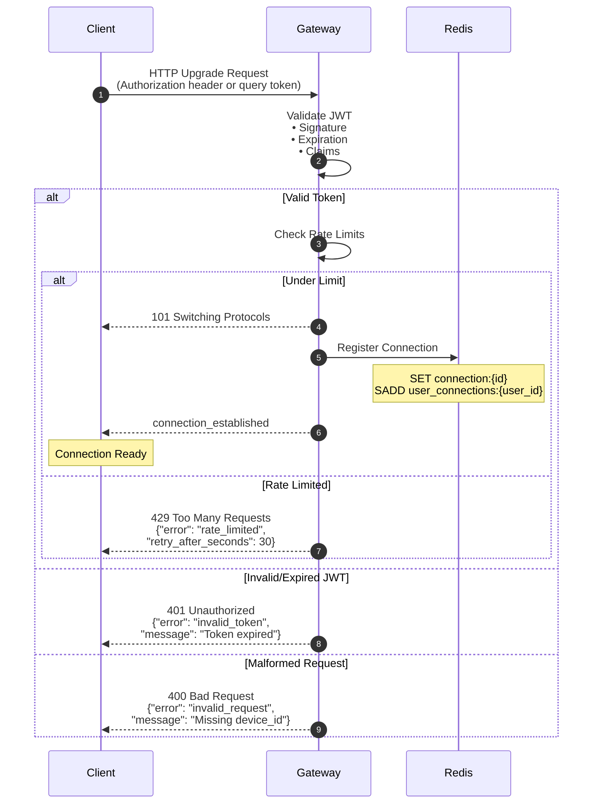

#### 1.2 Handshake Failure Responses

Handshake failures occur before WebSocket upgrade completes and are returned as HTTP responses:

| HTTP Status | Error Code | Description | Client Action |
|-------------|------------|-------------|---------------|
| `400 Bad Request` | `invalid_request` | Missing required parameter, malformed header | Fix client code |
| `401 Unauthorized` | `invalid_token` | JWT signature invalid, expired, or malformed | Refresh token and retry |
| `401 Unauthorized` | `token_revoked` | Token has been explicitly revoked | Re-authenticate |
| `429 Too Many Requests` | `rate_limited` | Too many connection attempts | Wait `retry_after_seconds` |
| `503 Service Unavailable` | `service_unavailable` | Gateway overloaded or Redis unavailable | Retry with backoff |

**Error Response Format** (JSON body on failed upgrade):

```json
{
  "error": "invalid_token",
  "message": "Token has expired",
  "details": {
    "expired_at": "2026-01-31T09:55:00.000Z"
  }
}
```

**WebSocket Close Codes** (RFC 6455): If the connection is established but immediately closed due to a late-detected error, the gateway uses standard close codes:

| Close Code | Meaning | When Used |
|------------|---------|-----------|
| `1008` | Policy Violation | Authentication failed after upgrade |
| `1011` | Internal Error | Server error during setup |
| `1013` | Try Again Later | Rate limited or overloaded |

#### 1.3 JWT Token Requirements

The JWT access token must contain the following claims:

| Claim | Type | Required | Description |
|-------|------|----------|-------------|
| `sub` | String | Yes | User ID (e.g., `user_01HQX...`) |
| `iat` | Number | Yes | Issued-at timestamp (Unix seconds) |
| `exp` | Number | Yes | Expiration timestamp (Unix seconds) |
| `jti` | String | Yes | Unique token ID for revocation checking |
| `scope` | String | No | Space-separated scopes (default: `messaging`) |

**Token Lifetime**: Access tokens are short-lived (15-60 minutes). Clients must obtain new tokens via refresh token flow before expiration. The gateway does NOT handle token refresh—clients must reconnect with a new token.

**Token Validation**:

1. Verify signature using gateway's public key
2. Check `exp > current_time`
3. Check `iat < current_time` (not issued in the future)
4. Optionally check revocation list (future enhancement)

#### 1.4 Connection State Registration

Upon successful handshake, the gateway registers the connection in Redis (per ADR-002):

```json
// SET connection:{connection_id}
{
  "connection_id": "conn_01HQX...",
  "user_id": "user_01HQX...",
  "device_id": "550e8400-e29b-41d4-a716-446655440000",
  "gateway_id": "gw-us-east-1a-001",
  "connected_at": "2026-01-31T10:00:00.000Z",
  "last_heartbeat": "2026-01-31T10:00:00.000Z",
  "protocol_version": 1
}
```

**Multi-Device Support**: A single user may have multiple concurrent connections (different devices). All connections are registered in `user_connections:{user_id}` SET.

#### 1.5 Connection Established Message

After successful registration, the gateway sends a `connection_established` message:

```json
{
  "type": "connection_established",
  "timestamp": "2026-01-31T10:00:00.000Z",
  "payload": {
    "connection_id": "conn_01HQX...",
    "user_id": "user_01HQX...",
    "device_id": "550e8400-e29b-41d4-a716-446655440000",
    "server_time": "2026-01-31T10:00:00.000Z",
    "heartbeat_interval_ms": 30000,
    "protocol_version": 1
  }
}
```

**Client Behavior After `connection_established`:**

1. Store `connection_id` for debugging/logging
2. Note `heartbeat_interval_ms` for keepalive scheduling
3. Initiate sync requests for chats with pending state (see Section 4)
4. Begin sending/receiving messages

---

### 2. Message Envelope Format

All messages (client-to-server and server-to-client) use a consistent JSON envelope.

#### 2.1 Client-to-Server Envelope

```json
{
  "type": "message_type",
  "request_id": "req_01HQX...",
  "timestamp": "2026-01-31T10:00:00.000Z",
  "payload": {
    // Type-specific fields
  }
}
```

| Field | Type | Required | Description |
|-------|------|----------|-------------|
| `type` | String | Yes | Message type identifier (see Section 3) |
| `request_id` | String | **Conditional** | Required for request-response messages (`send_message`, `sync_request`). Optional for one-way messages (`ack`, `typing_*`, `heartbeat`). |
| `timestamp` | String | No | Client timestamp (ISO 8601). Server uses server time for ordering; client timestamp is for debugging only. |
| `payload` | Object | Yes | Type-specific payload (may be empty `{}`) |

**`request_id` Requirements:**

- Required for: `send_message`, `sync_request` (messages expecting a response)
- Optional for: `ack`, `typing_start`, `typing_stop`, `heartbeat` (one-way messages)
- Must be unique per client session when provided
- Used for correlating responses and detecting duplicates
- NOT the same as `client_message_id` (which is for idempotency across reconnects)

#### 2.2 Server-to-Client Envelope (Response)

Responses to client requests echo the `request_id`:

```json
{
  "type": "response_type",
  "request_id": "req_01HQX...",
  "timestamp": "2026-01-31T10:00:00.123Z",
  "payload": {
    // Type-specific fields
  }
}
```

#### 2.3 Server-to-Client Envelope (Push)

Server-initiated messages (new messages, presence updates) have no `request_id`:

```json
{
  "type": "message",
  "timestamp": "2026-01-31T10:00:00.123Z",
  "payload": {
    // Type-specific fields
  }
}
```

**Client Behavior**: If `request_id` is absent, the message is server-initiated. If present, it's a response to a prior request.

---

### 3. Message Types

#### 3.1 Message Type Registry

| Type | Direction | Response Expected | Description |
|------|-----------|-------------------|-------------|
| `send_message` | C→S | Yes (`send_message_ack`) | Client sends a new message |
| `send_message_ack` | S→C | — | Server acknowledges message persistence |
| `message` | S→C | — | Server delivers a message to recipient |
| `ack` | C→S | **No** | Client acknowledges message receipt |
| `sync_request` | C→S | Yes (`sync_response`) | Client requests missed messages |
| `sync_response` | S→C | — | Server responds with message batch |
| `typing_start` | C→S | **No** | Client indicates user is typing *(MVP-optional)* |
| `typing_stop` | C→S | **No** | Client indicates user stopped typing *(MVP-optional)* |
| `typing_indicator` | S→C | — | Server broadcasts typing status *(MVP-optional)* |
| `heartbeat` | C→S | Yes (`heartbeat_ack`) | Client keepalive (application level) |
| `heartbeat_ack` | S→C | — | Server keepalive response |
| `error` | S→C | — | Server reports an error |
| `connection_established` | S→C | — | Connection setup confirmation |
| `connection_closing` | S→C | — | Server-initiated graceful close |

> **MVP Scope Note**: Typing indicators (`typing_start`, `typing_stop`, `typing_indicator`) are **MVP-optional**. Implementations MAY defer these to a later stage. Core MVP requires only: `send_message`, `send_message_ack`, `message`, `ack`, `sync_request`, `sync_response`, `heartbeat`, `heartbeat_ack`, `error`, `connection_established`, `connection_closing`.

#### 3.2 `send_message` (Client → Server)

Client sends a new message to a chat.

```json
{
  "type": "send_message",
  "request_id": "req_01HQX...",
  "timestamp": "2026-01-31T10:00:00.000Z",
  "payload": {
    "client_message_id": "550e8400-e29b-41d4-a716-446655440000",
    "chat_id": "chat_01HQX...",
    "content": "Hello, world!",
    "content_type": "text/plain"
  }
}
```

| Field | Type | Required | Description |
|-------|------|----------|-------------|
| `client_message_id` | String | Yes | Idempotency key (UUIDv4). Must be stable across retries. |
| `chat_id` | String | Yes | Target chat identifier |
| `content` | String | Yes | Message content (UTF-8, max 4KB) |
| `content_type` | String | No | MIME type (default: `text/plain`) |

**`request_id` is REQUIRED** for `send_message` since it expects a `send_message_ack` response.

**Gateway Processing:**

1. Validate envelope structure
2. Validate payload fields
3. Forward to Durability Plane (synchronous RPC)
4. Await persistence confirmation
5. Send `send_message_ack` to client

**Validation Rules:**

- `client_message_id`: Valid UUIDv4 format
- `chat_id`: Non-empty, valid chat ID format
- `content`: 1-4096 bytes UTF-8
- `content_type`: Must be `text/plain` for MVP (other types rejected)

#### 3.3 `send_message_ack` (Server → Client)

Server acknowledges successful message persistence.

```json
{
  "type": "send_message_ack",
  "request_id": "req_01HQX...",
  "timestamp": "2026-01-31T10:00:00.123Z",
  "payload": {
    "client_message_id": "550e8400-e29b-41d4-a716-446655440000",
    "message_id": "msg_01HQX...",
    "chat_id": "chat_01HQX...",
    "sequence": 47,
    "created_at": "2026-01-31T10:00:00.100Z"
  }
}
```

| Field | Type | Description |
|-------|------|-------------|
| `client_message_id` | String | Echo of client's idempotency key |
| `message_id` | String | Server-assigned message identifier |
| `chat_id` | String | Echo of target chat |
| `sequence` | Number | Server-assigned sequence (per ADR-001) |
| `created_at` | String | Server timestamp of persistence |

**Client Behavior on Receive:**

1. Match `request_id` to pending send request
2. Clear retry timer for this `client_message_id`
3. Update local message with server-assigned `sequence` and `message_id`
4. Render message in chat (read-your-own-writes)

**Semantic Guarantee**: Receipt of `send_message_ack` means the message is **durably persisted** and **will be delivered** to other participants (via fanout or sync). This is the ACK = Durability guarantee from ADR-002.

#### 3.4 `message` (Server → Client)

Server delivers a message to a recipient (via fanout).

```json
{
  "type": "message",
  "timestamp": "2026-01-31T10:00:00.150Z",
  "payload": {
    "message_id": "msg_01HQX...",
    "chat_id": "chat_01HQX...",
    "sequence": 47,
    "sender_id": "user_01ABC...",
    "content": "Hello, world!",
    "content_type": "text/plain",
    "created_at": "2026-01-31T10:00:00.100Z"
  }
}
```

| Field | Type | Description |
|-------|------|-------------|
| `message_id` | String | Unique message identifier |
| `chat_id` | String | Chat this message belongs to |
| `sequence` | Number | Per-chat sequence number for ordering |
| `sender_id` | String | User who sent the message |
| `content` | String | Message content |
| `content_type` | String | MIME type |
| `created_at` | String | Server timestamp of original persistence |

**No `request_id`**: This is a server-initiated push, not a response.

**Client Behavior on Receive:**

1. Check if `chat_id` is known; if not, may need to fetch chat metadata
2. Insert message into local store, ordered by `sequence`
3. If `sequence` is non-contiguous with local state, note potential gap (do not block)
4. Render message in UI
5. Send `ack` to confirm receipt (see Section 3.5)

**Duplicate Handling**: Client may receive the same message multiple times (fanout retry, sync overlap). Deduplicate by `(chat_id, sequence)` or `message_id`.

#### 3.5 `ack` (Client → Server)

Client acknowledges receipt of messages. This is a **one-way message**—no server response is sent.

```json
{
  "type": "ack",
  "timestamp": "2026-01-31T10:00:00.200Z",
  "payload": {
    "chat_id": "chat_01HQX...",
    "last_acked_sequence": 47
  }
}
```

| Field | Type | Description |
|-------|------|-------------|
| `chat_id` | String | Chat for which messages are being acknowledged |
| `last_acked_sequence` | Number | Highest sequence number received by client |

**No `request_id` required**: `ack` is a one-way message. The server does not send a response.

**Cumulative Acknowledgment**: Acknowledging sequence N implicitly acknowledges all sequences ≤ N for this chat. This reduces protocol chattiness.

**Gateway Processing:**

1. Forward to Durability Plane
2. Update `delivery_state` table: `(user_id, chat_id, last_acked_sequence)`
3. **No response sent** (fire-and-forget from client's perspective)

**Ack Batching**: Clients SHOULD batch acks (e.g., ack every 5 seconds or every 10 messages) rather than acking every message individually.

**Failure Handling**: If the ack fails to reach the server (network issue, server crash), the client's `last_acked_sequence` will be stale. On reconnect, the client will receive duplicate messages (which it deduplicates locally). This is acceptable—acks are an optimization, not a correctness requirement.

#### 3.6 `sync_request` (Client → Server)

Client requests missed messages after reconnection (per ADR-001).

```json
{
  "type": "sync_request",
  "request_id": "req_01HQZ...",
  "timestamp": "2026-01-31T10:00:00.000Z",
  "payload": {
    "chat_id": "chat_01HQX...",
    "last_acked_sequence": 42,
    "limit": 100
  }
}
```

| Field | Type | Required | Description |
|-------|------|----------|-------------|
| `chat_id` | String | Yes | Chat to sync |
| `last_acked_sequence` | Number | Yes | Last sequence client has (0 for full sync) |
| `limit` | Number | No | Maximum messages to return (default: 100, max: 500) |

**`request_id` is REQUIRED** for `sync_request` since it expects a `sync_response`.

**Gateway Processing:**

1. Query Durability Plane for messages with `sequence > last_acked_sequence`
2. Return messages in ascending sequence order
3. Indicate if more messages are available

#### 3.7 `sync_response` (Server → Client)

Server responds to sync request with message batch.

```json
{
  "type": "sync_response",
  "request_id": "req_01HQZ...",
  "timestamp": "2026-01-31T10:00:00.050Z",
  "payload": {
    "chat_id": "chat_01HQX...",
    "messages": [
      {
        "message_id": "msg_01HQX...",
        "sequence": 43,
        "sender_id": "user_01ABC...",
        "content": "First missed message",
        "content_type": "text/plain",
        "created_at": "2026-01-30T23:00:00.000Z"
      },
      {
        "message_id": "msg_01HQY...",
        "sequence": 44,
        "sender_id": "user_01DEF...",
        "content": "Second missed message",
        "content_type": "text/plain",
        "created_at": "2026-01-30T23:01:00.000Z"
      }
    ],
    "has_more": true,
    "next_sequence": 45
  }
}
```

| Field | Type | Description |
|-------|------|-------------|
| `chat_id` | String | Echo of requested chat |
| `messages` | Array | Messages in ascending sequence order |
| `has_more` | Boolean | True if more messages exist beyond this batch |
| `next_sequence` | Number | Sequence to use for next sync request (if `has_more`) |

**Pagination**: If `has_more` is true, client should send another `sync_request` with `last_acked_sequence = next_sequence - 1`.

**Client Behavior:**

1. Process messages in order
2. Update local store
3. If `has_more`, issue subsequent sync request
4. When sync complete, send `ack` with highest received sequence

#### 3.8 `typing_start` / `typing_stop` (Client → Server) — *MVP-Optional*

Client indicates typing status. These are **one-way messages**—no server response is sent.

```json
{
  "type": "typing_start",
  "timestamp": "2026-01-31T10:00:00.000Z",
  "payload": {
    "chat_id": "chat_01HQX..."
  }
}
```

```json
{
  "type": "typing_stop",
  "timestamp": "2026-01-31T10:00:05.000Z",
  "payload": {
    "chat_id": "chat_01HQX..."
  }
}
```

**No `request_id` required**: Typing messages are one-way. The server broadcasts to other participants but does not respond to the sender.

**Gateway Processing:**

1. Validate user is member of chat (optional for MVP, can skip for latency)
2. Broadcast `typing_indicator` to other online members
3. No persistence (ephemeral state only)
4. **No response sent**

**Typing Timeout**: If no `typing_stop` received within 10 seconds, gateway auto-expires typing state.

#### 3.9 `typing_indicator` (Server → Client) — *MVP-Optional*

Server broadcasts typing status to chat participants.

```json
{
  "type": "typing_indicator",
  "timestamp": "2026-01-31T10:00:00.100Z",
  "payload": {
    "chat_id": "chat_01HQX...",
    "user_id": "user_01ABC...",
    "is_typing": true
  }
}
```

| Field | Type | Description |
|-------|------|-------------|
| `chat_id` | String | Chat where typing is occurring |
| `user_id` | String | User who is typing |
| `is_typing` | Boolean | True for start, false for stop |

**Client Behavior:**

1. Update typing indicator UI for the chat
2. Auto-clear after 10 seconds if no update (defensive timeout)

#### 3.10 `heartbeat` / `heartbeat_ack` (Keepalive)

Application-level heartbeat for connection health monitoring.

```json
// Client → Server
{
  "type": "heartbeat",
  "timestamp": "2026-01-31T10:00:30.000Z",
  "payload": {}
}
```

```json
// Server → Client
{
  "type": "heartbeat_ack",
  "timestamp": "2026-01-31T10:00:30.005Z",
  "payload": {
    "server_time": "2026-01-31T10:00:30.005Z"
  }
}
```

**`request_id` is optional** for heartbeat. If provided, it will be echoed in `heartbeat_ack`. If omitted, `heartbeat_ack` will have no `request_id`.

**Heartbeat Interval**: Clients should send heartbeats at the interval specified in `connection_established` (default: 30 seconds).

**Relationship to WebSocket Ping/Pong**: The WebSocket protocol has built-in ping/pong frames for keepalive. Application heartbeats serve a different purpose:

- WebSocket ping/pong: TCP connection liveness
- Application heartbeat: Session liveness, clock sync, latency measurement

**Gateway Behavior:**

1. Update `last_heartbeat` in Redis connection state
2. Respond with `heartbeat_ack` immediately
3. If no heartbeat received within 2× interval, consider connection unhealthy

#### 3.11 `error` (Server → Client)

Server reports an error condition.

```json
{
  "type": "error",
  "request_id": "req_01HQX...",
  "timestamp": "2026-01-31T10:00:00.100Z",
  "payload": {
    "code": "NOT_A_MEMBER",
    "message": "You are not a member of this chat",
    "details": {
      "chat_id": "chat_01HQX..."
    }
  }
}
```

| Field | Type | Description |
|-------|------|-------------|
| `code` | String | Machine-readable error code |
| `message` | String | Human-readable error description |
| `details` | Object | Additional context (optional) |

**If `request_id` is present**: Error is in response to a specific client request.

**If `request_id` is absent**: Error is unsolicited (e.g., rate limit warning, connection issue).

**Error Codes:**

| Code | HTTP Equivalent | Description | Client Action |
|------|-----------------|-------------|---------------|
| `INVALID_MESSAGE` | 400 | Malformed message or payload | Fix client code |
| `UNAUTHORIZED` | 401 | Token expired or invalid | Reconnect with fresh token |
| `FORBIDDEN` | 403 | Operation not permitted | Do not retry |
| `NOT_A_MEMBER` | 403 | User not in chat | Do not retry |
| `NOT_FOUND` | 404 | Chat or resource not found | Do not retry |
| `RATE_LIMITED` | 429 | Too many requests | Backoff and retry |
| `MESSAGE_TOO_LARGE` | 413 | Content exceeds 4KB limit | Reduce message size |
| `INVALID_CONTENT_TYPE` | 415 | Unsupported content type | Use text/plain |
| `INTERNAL_ERROR` | 500 | Server error | Retry with backoff |
| `SERVICE_UNAVAILABLE` | 503 | Durability plane unavailable | Retry with backoff |
| `SLOW_CONSUMER` | 429 | Client not consuming messages fast enough | Reconnect and sync |

#### 3.12 `connection_closing` (Server → Client)

Server initiates graceful connection close.

```json
{
  "type": "connection_closing",
  "timestamp": "2026-01-31T10:00:00.000Z",
  "payload": {
    "reason": "server_shutdown",
    "message": "Gateway is restarting for maintenance",
    "reconnect_delay_ms": 5000
  }
}
```

| Field | Type | Description |
|-------|------|-------------|
| `reason` | String | Machine-readable close reason |
| `message` | String | Human-readable explanation |
| `reconnect_delay_ms` | Number | Suggested delay before reconnecting |

**Close Reasons:**

| Reason | Description |
|--------|-------------|
| `server_shutdown` | Gateway is shutting down (deployment, maintenance) |
| `idle_timeout` | Connection idle too long (no heartbeats) |
| `rate_limited` | Persistent rate limit violations |
| `protocol_error` | Repeated protocol violations |
| `duplicate_connection` | Another connection for same device established |
| `token_expired` | JWT expired during session |
| `slow_consumer` | Client not consuming messages fast enough (buffer overflow) |

**Client Behavior:**

1. Receive `connection_closing`
2. Wait `reconnect_delay_ms` (with jitter)
3. Reconnect to any available gateway
4. Resume with sync

---

### 4. Connection Lifecycle

#### 4.1 State Machine

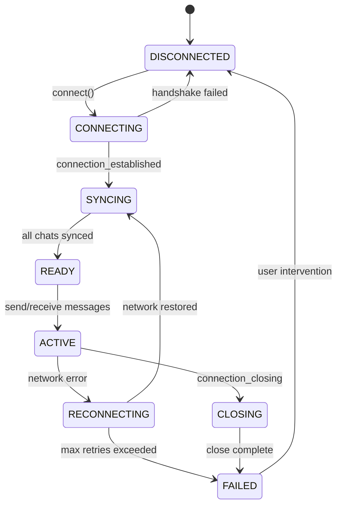

**States:**

| State | Description |
|-------|-------------|
| `DISCONNECTED` | No active connection; initial or terminal state |
| `CONNECTING` | WebSocket handshake in progress |
| `SYNCING` | Connected; fetching missed messages |
| `READY` | Sync complete; ready for real-time operation |
| `ACTIVE` | Sending/receiving messages normally |
| `RECONNECTING` | Connection lost; attempting to reconnect |
| `CLOSING` | Graceful close in progress |
| `FAILED` | Unrecoverable failure; requires user intervention |

#### 4.2 Reconnection Strategy

Clients MUST implement automatic reconnection with exponential backoff:

```
Base delay:     1 second
Max delay:      60 seconds
Jitter:         ±25%
Max attempts:   10 (then enter FAILED state)

delay(attempt) = min(base * 2^attempt, max) * (1 + random(-0.25, 0.25))

Attempt 1:  1s   ± 0.25s  →  0.75s - 1.25s
Attempt 2:  2s   ± 0.5s   →  1.5s  - 2.5s
Attempt 3:  4s   ± 1s     →  3s    - 5s
Attempt 4:  8s   ± 2s     →  6s    - 10s
Attempt 5:  16s  ± 4s     →  12s   - 20s
Attempt 6:  32s  ± 8s     →  24s   - 40s
Attempt 7+: 60s  ± 15s    →  45s   - 75s
```

**Reset Conditions:**

- Successful connection establishment resets attempt counter to 0
- User-initiated reconnect resets attempt counter to 0

#### 4.3 Sync-on-Reconnect Protocol

After reconnection, client MUST sync all chats before transitioning to READY:

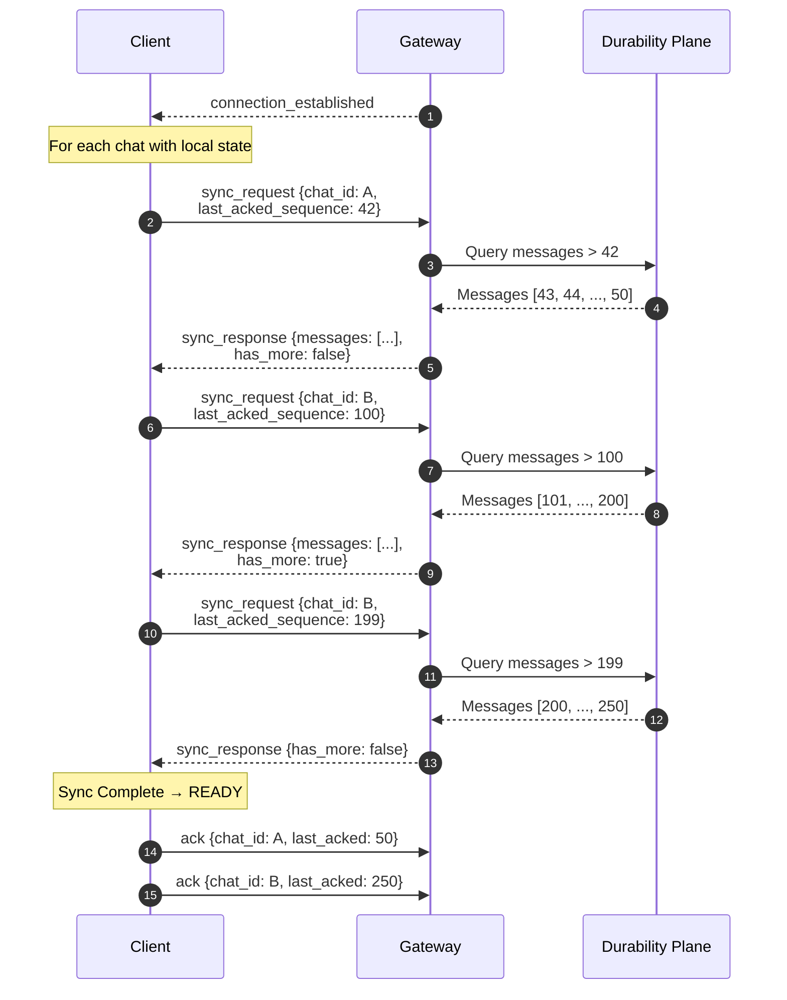

**Parallel Sync**: Clients MAY issue sync requests for multiple chats in parallel (up to 5 concurrent) to reduce sync time.

**Interleaving with Real-time**: During sync, the client may also receive real-time `message` pushes for new messages. Client should:

1. Accept and buffer these messages
2. Deduplicate against sync responses (by sequence)
3. Merge into final state

---

### 5. Flow Control and Backpressure

#### 5.1 Client-Side Rate Limiting

Clients MUST self-limit outbound message rate:

| Operation | Default Limit | Notes |
|-----------|---------------|-------|
| `send_message` | 10/second per chat | Burst: 20 in 1 second, then throttled |
| `send_message` | 30/second total | Across all chats |
| `typing_start` | 1/second per chat | Debounce keystroke events *(MVP-optional)* |
| `sync_request` | 5/second | Parallel sync across chats |
| `heartbeat` | 1/30 seconds | As specified by server |

**Exceeding Limits**: If a client exceeds limits, the gateway MAY:

1. Respond with `error` code `RATE_LIMITED`
2. Silently drop messages (for typing indicators only)
3. Close connection with `connection_closing` reason `rate_limited` (persistent abuse)

#### 5.2 Server-Side Backpressure

Per ADR-002, the gateway enforces per-connection outbound limits to protect against slow consumers:

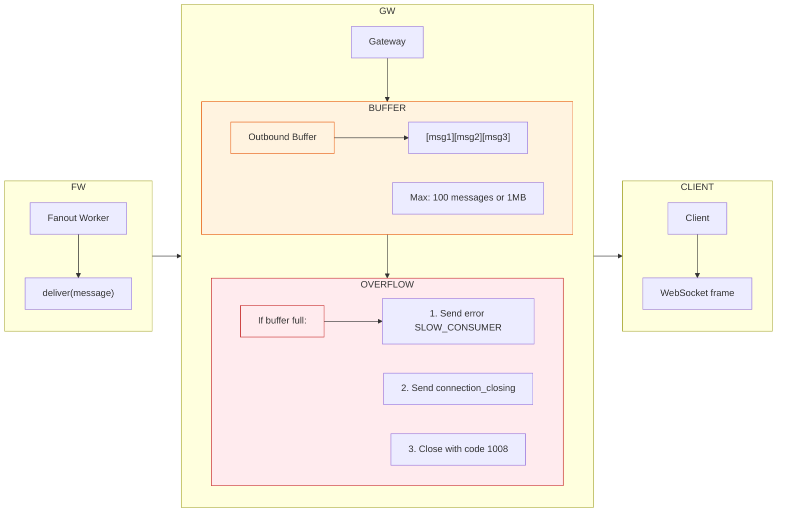

**Buffer Limits:**

| Limit | Value | Action When Exceeded |
|-------|-------|---------------------|
| Message count | 100 messages | Trigger slow consumer handling |
| Buffer size | 1 MB | Trigger slow consumer handling |
| Overflow duration | 30 seconds | Force disconnect |

**Slow Consumer Handling** (NOT silent):

When a client's outbound buffer exceeds limits, the gateway MUST:

1. Send `error` with code `SLOW_CONSUMER` warning the client
2. If overflow persists for 30 seconds, send `connection_closing` with reason `slow_consumer`
3. Close the WebSocket with close code `1008` (Policy Violation)

**Message drops are NOT silent.** The gateway does not silently discard messages. Overflow always results in connection termination, forcing the client to reconnect and sync.

**Client Recovery**: After receiving `SLOW_CONSUMER` error or `connection_closing` with reason `slow_consumer`:

1. Reconnect with fresh connection
2. Sync all chats to retrieve any messages that may have been in the buffer
3. Consider processing messages more quickly or reducing subscribed chats

**Client Behavior on Sequence Gaps**: If a client detects a sequence gap during normal operation (received sequence N, then sequence N+3), this indicates either:
- Network-level message loss (rare with TCP)
- Server-side buffer overflow before disconnect was processed

Client SHOULD issue a `sync_request` to fill gaps rather than waiting indefinitely.

#### 5.3 Large Chat Considerations

For chats with many participants (e.g., 100+ members), fanout creates burst traffic. Gateway protections:

1. **Per-chat rate limiting at fanout**: Fanout workers limit delivery rate per chat
2. **Staggered delivery**: Messages to large chats delivered in waves
3. **Connection prioritization**: Active senders prioritized over idle connections

These are future optimizations; MVP accepts potential latency spikes for large chats.

---

### 6. Error Handling

#### 6.1 Error Response Patterns

**Request-Response Errors**: Errors in response to client requests include the `request_id`:

```json
{
  "type": "error",
  "request_id": "req_01HQX...",
  "timestamp": "2026-01-31T10:00:00.100Z",
  "payload": {
    "code": "NOT_A_MEMBER",
    "message": "You are not a member of this chat",
    "details": {
      "chat_id": "chat_01HQX..."
    }
  }
}
```

**Unsolicited Errors**: Server-initiated errors (warnings, connection issues) omit `request_id`:

```json
{
  "type": "error",
  "timestamp": "2026-01-31T10:00:00.100Z",
  "payload": {
    "code": "SLOW_CONSUMER",
    "message": "You are not consuming messages fast enough. Connection may be closed.",
    "details": {
      "buffer_size": 95,
      "buffer_limit": 100
    }
  }
}
```

#### 6.2 Client Error Handling Matrix

| Error Code | Retry? | Backoff? | User Notification? | Action |
|------------|--------|----------|-------------------|--------|
| `INVALID_MESSAGE` | No | N/A | No (client bug) | Fix client, log error |
| `UNAUTHORIZED` | Yes | No | Yes ("Session expired") | Refresh token, reconnect |
| `FORBIDDEN` | No | N/A | Yes ("Access denied") | Show error, disable action |
| `NOT_A_MEMBER` | No | N/A | Yes ("Not in chat") | Remove chat from local state |
| `NOT_FOUND` | No | N/A | Yes ("Chat not found") | Remove chat from local state |
| `RATE_LIMITED` | Yes | Yes | Maybe ("Please slow down") | Pause, retry after delay |
| `MESSAGE_TOO_LARGE` | No | N/A | Yes ("Message too long") | Show error, truncate |
| `INVALID_CONTENT_TYPE` | No | N/A | Yes ("Unsupported type") | Show error |
| `INTERNAL_ERROR` | Yes | Yes | Yes ("Server error") | Retry 3x, then show error |
| `SERVICE_UNAVAILABLE` | Yes | Yes | Yes ("Service unavailable") | Retry with backoff |
| `SLOW_CONSUMER` | N/A | N/A | Maybe | Reconnect and sync |

#### 6.3 Protocol Violation Handling

If the gateway receives an unparseable or malformed message:

```json
{
  "type": "error",
  "timestamp": "2026-01-31T10:00:00.100Z",
  "payload": {
    "code": "INVALID_MESSAGE",
    "message": "Failed to parse message as JSON",
    "details": {
      "parse_error": "Unexpected token at position 42"
    }
  }
}
```

**Repeated Violations**: If a client sends 10+ invalid messages in 60 seconds, gateway MAY close connection with reason `protocol_error`.

#### 6.4 Unknown Message Type Handling

For forward compatibility, gateways MUST ignore unknown message types:

```
Client sends:  {"type": "new_feature_v2", "request_id": "...", "payload": {...}}
Gateway:       Logs warning, does not respond (no error sent)
```

This allows newer clients to gracefully degrade when connecting to older gateways.

---

### 7. Security Considerations

#### 7.1 Authentication Lifecycle

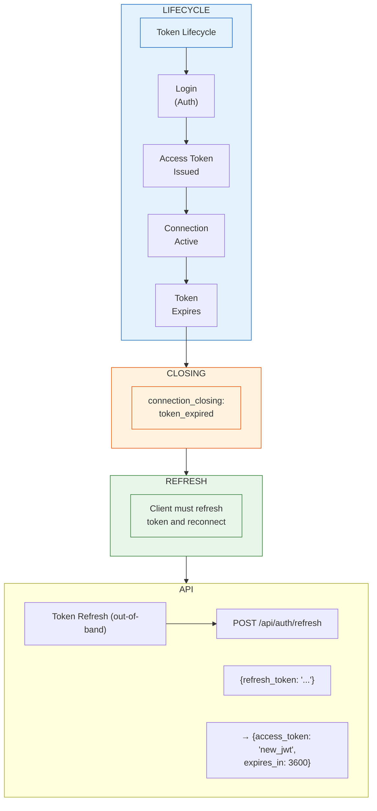

**Token Refresh Timing**: Clients SHOULD refresh tokens proactively, approximately 5 minutes before expiration. This avoids interruption of active connections.

**Token Expiration During Session**: If a token expires while connected:

1. Gateway sends `connection_closing` with reason `token_expired`
2. Client refreshes token via REST API
3. Client reconnects with new token
4. Client syncs missed messages

#### 7.2 Authorization Model

Authorization is enforced at multiple layers:

| Layer | Enforcement | Scope |
|-------|-------------|-------|
| Connection | Gateway | User identity (from JWT) |
| Message Send | Durability Plane | Chat membership (from DynamoDB) |
| Sync Request | Durability Plane | Chat membership |
| Message Receive | Fanout Plane | Chat membership |

**No Gateway-Level Membership Cache**: The gateway does NOT cache membership. Every write operation validates membership in the Durability Plane with a strongly consistent read (per ADR-003).

#### 7.3 Input Validation

All client inputs are validated:

| Field | Validation |
|-------|------------|
| `type` | Enum whitelist |
| `request_id` | UUIDv4 or ULID format, max 36 chars |
| `client_message_id` | UUIDv4 format, max 36 chars |
| `chat_id` | ULID format with prefix, max 50 chars |
| `content` | UTF-8, 1-4096 bytes |
| `content_type` | Enum whitelist (`text/plain` for MVP) |
| `sequence` | Positive integer, max 2^53-1 |

**Validation Failure**: Returns `error` with code `INVALID_MESSAGE` and field-specific details.

#### 7.4 JSON Parsing Guidelines

- **Use a strict JSON parser where available**; validate schema and enforce size limits
- **Content Escaping**: Content is treated as opaque bytes; no interpretation or execution
- **ID Validation**: All IDs validated against strict regex patterns before use in queries
- **Size Limits**: Reject messages larger than 64KB at the envelope level (defense in depth)

> **Implementation Note**: Strict JSON parsing (rejecting duplicate keys, trailing commas, comments) varies across JSON libraries and platforms. Implementations SHOULD use strict mode where available, but MUST at minimum validate schema structure and enforce size limits. Do not chase impossible cross-platform uniformity on edge cases.

---

### 8. Observability

#### 8.1 Logging Requirements

All protocol events MUST be logged with structured fields:

```json
{
  "timestamp": "2026-01-31T10:00:00.123Z",
  "level": "INFO",
  "event": "message_received",
  "connection_id": "conn_01HQX...",
  "user_id": "user_01HQX...",
  "gateway_id": "gw-us-east-1a-001",
  "message_type": "send_message",
  "request_id": "req_01HQX...",
  "chat_id": "chat_01HQX...",
  "latency_ms": 45
}
```

**Required Fields:**

| Field | Always Present | Description |
|-------|----------------|-------------|
| `timestamp` | Yes | Event time |
| `connection_id` | After handshake | Connection identifier |
| `user_id` | After handshake | User identifier |
| `gateway_id` | Yes | Gateway instance |
| `message_type` | For message events | Protocol message type |
| `request_id` | If present in message | Request correlation |
| `latency_ms` | For responses | Processing time |

#### 8.2 Metrics

| Metric | Type | Labels | Description |
|--------|------|--------|-------------|
| `ws_connections_active` | Gauge | gateway_id | Current active connections |
| `ws_connections_total` | Counter | gateway_id, status | Connection attempts (success/fail) |
| `ws_messages_received_total` | Counter | gateway_id, type | Inbound messages by type |
| `ws_messages_sent_total` | Counter | gateway_id, type | Outbound messages by type |
| `ws_message_latency_seconds` | Histogram | gateway_id, type | Processing latency |
| `ws_errors_total` | Counter | gateway_id, code | Errors by code |
| `ws_buffer_size_bytes` | Histogram | gateway_id | Outbound buffer utilization |
| `ws_slow_consumer_disconnects_total` | Counter | gateway_id | Slow consumer disconnections |

#### 8.3 Distributed Tracing — *MVP-Optional*

> **MVP Scope Note**: Distributed tracing is **MVP-optional**. Implementations MAY defer tracing infrastructure to a later stage. The protocol supports an optional `trace_context` field for future use.

For implementations that include tracing, message flows MAY propagate a trace context:

```json
// Incoming message (client may include trace context)
{
  "type": "send_message",
  "request_id": "req_01HQX...",
  "trace_context": {
    "trace_id": "abc123...",
    "span_id": "def456..."
  },
  "payload": {...}
}
```

If client does not provide `trace_context`, gateway generates one. The trace_id propagates through:

1. Gateway → Durability Plane RPC
2. Durability Plane → Kafka event
3. Kafka → Fanout Worker
4. Fanout Worker → Gateway (for delivery)

---

### 9. Protocol Versioning

#### 9.1 Version Scheme

The protocol uses a **single integer version** in the URL path:

```
wss://gateway.example.com/v1/ws
                          ^^
                          Protocol version (integer)
```

**Current Version**: `1`

The `protocol_version` field in `connection_established` echoes this integer:

```json
{
  "type": "connection_established",
  "payload": {
    "protocol_version": 1,
    ...
  }
}
```

**Version Semantics**:
- Version is a single integer (1, 2, 3, ...) in the URL path
- Minor/patch changes (backward-compatible additions) do NOT bump the version
- Breaking changes (removed fields, changed semantics) bump the version
- The `connection_established` response confirms the negotiated version

#### 9.2 Version Support Policy

- Gateway supports current version (vN) and previous version (vN-1)
- Clients connecting with unsupported version receive `400 Bad Request` during handshake:
  ```json
  {
    "error": "unsupported_version",
    "message": "Protocol version 0 is not supported",
    "details": {
      "supported_versions": [1, 2],
      "requested_version": 0
    }
  }
  ```
- Deprecation warnings sent via `error` message 30 days before version removal

#### 9.3 Backward Compatibility Rules

When evolving the protocol within a version:

1. **New Optional Fields**: May be added to existing message types without version bump
2. **New Required Fields**: Require version bump
3. **New Message Types**: May be added without version bump (unknown types ignored)
4. **Changed Semantics**: Require version bump
5. **Removed Fields/Types**: Require version bump

---

## Consequences

### Positive Consequences

1. **Interoperability**: Explicit schema enables multiple client implementations with consistent behavior.

2. **Debuggability**: JSON messages are human-readable; `request_id` correlation enables end-to-end tracing.

3. **Resilience**: Clear reconnection protocol, sync mechanism, and error codes enable robust client implementations.

4. **Extensibility**: Unknown type handling and capability negotiation support future evolution.

5. **Security**: Authentication at handshake, authorization at operation, input validation at parsing.

### Negative Consequences

1. **Bandwidth Overhead**: JSON is verbose compared to binary protocols (~30-50% overhead for small messages).
   *Mitigation*: Acceptable for text messaging; can add binary protocol option in future version.

2. **Parsing Overhead**: JSON parsing slower than binary protocols.
   *Mitigation*: Modern JSON parsers are highly optimized; latency is dominated by network, not parsing.

3. **No Schema Enforcement at Wire Level**: JSON schema validation is runtime, not compile-time.
   *Mitigation*: Strict validation on gateway; typed client SDKs can provide compile-time safety.

4. **Message Size Limits**: 4KB content limit constrains use cases.
   *Mitigation*: Appropriate for text messaging MVP; media messages (future) will have different paths.

---

## Confirmation

The implementation of this ADR will be validated through:

1. **Schema Validation Tests**: Verify all message types conform to documented schemas.

2. **Handshake Tests**:
   - Valid token via header → connection established
   - Valid token via query param → connection established (with security warning logged)
   - Invalid token → 401 rejection with JSON error body
   - Expired token → 401 rejection
   - Missing device_id → 400 rejection
   - Unsupported version → 400 rejection with supported versions

3. **Message Flow Tests**:
   - send_message → send_message_ack with correct sequence
   - Duplicate client_message_id → same sequence returned
   - sync_request → correct message batch
   - ack without request_id → processed successfully (no response)

4. **Error Handling Tests**:
   - Malformed JSON → INVALID_MESSAGE error
   - Unknown message type → no response (logged)
   - Membership violation → NOT_A_MEMBER error

5. **Backpressure Tests**:
   - Slow consumer → SLOW_CONSUMER error, then connection_closing
   - Buffer overflow → forced disconnect with close code 1008
   - Client reconnect after slow_consumer → successful sync

6. **Reconnection Tests**:
   - Disconnect and reconnect → sync retrieves missed messages
   - Token expiration → connection_closing sent

7. **Load Tests**:
   - 10K concurrent connections per gateway
   - 1000 messages/second throughput
   - Measure latency percentiles

8. **Conformance Tests**: Reference test suite that any client implementation must pass.

---

## Pros and Cons of the Options

### Option 1: Custom Binary Protocol

| Aspect | Assessment |
|--------|------------|
| Good | Minimal bandwidth overhead |
| Good | Fast parsing |
| Bad | **Custom tooling required** for debugging |
| Bad | **Client complexity**: Every platform needs binary codec |
| Bad | **Versioning complexity**: Binary schema evolution is hard |
| Bad | **Overkill for text messages**: Compression gains minimal |

### Option 2: JSON over WebSocket (CHOSEN)

| Aspect | Assessment |
|--------|------------|
| Good | **Universal support**: Every platform has JSON |
| Good | **Debuggable**: Human-readable in logs and tools |
| Good | **Simple implementation**: No custom codecs |
| Good | **Flexible evolution**: Easy to add optional fields |
| Neutral | Verbose (acceptable overhead for text messaging) |
| Bad | Runtime schema validation only |

### Option 3: GraphQL Subscriptions

| Aspect | Assessment |
|--------|------------|
| Good | Strong typing |
| Good | Flexible querying |
| Bad | **Complexity overkill**: Chat messages don't need flexible queries |
| Bad | **Library dependency**: Requires GraphQL client/server |
| Bad | **Subscription semantics**: Don't map well to chat patterns |

### Option 4: Socket.IO Protocol

| Aspect | Assessment |
|--------|------------|
| Good | Built-in reconnection, multiplexing |
| Good | Fallback to polling |
| Bad | **Abstraction overhead**: Socket.IO adds its own protocol layer |
| Bad | **Less control**: Harder to tune for specific requirements |
| Bad | **Library lock-in**: Must use Socket.IO client libraries |

### Option 5: gRPC-Web with Streaming

| Aspect | Assessment |
|--------|------------|
| Good | Strong typing with Protocol Buffers |
| Good | Efficient binary encoding |
| Bad | **Browser support**: Requires gRPC-Web proxy |
| Bad | **Streaming limitations**: Bidirectional streaming not natively supported in browsers |
| Bad | **Operational complexity**: Additional infrastructure |

---

## More Information

### Related Patterns and Prior Art

1. **Slack Real Time Messaging API**: Uses JSON over WebSocket with similar message envelope pattern (`type`, `payload`, acknowledgments).

2. **Discord Gateway**: JSON over WebSocket with sequence numbers for resume, heartbeat-based keepalive.

3. **WhatsApp Web Protocol**: Binary protocol (Protocol Buffers) over WebSocket, optimized for mobile.

4. **Firebase Realtime Database**: JSON over WebSocket with path-based subscriptions.

### References

- RFC 6455: The WebSocket Protocol
- RFC 7519: JSON Web Token (JWT)
- RFC 8259: The JavaScript Object Notation (JSON) Data Interchange Format
- Fielding, R. (2000). *Architectural Styles and the Design of Network-based Software Architectures*. Doctoral dissertation.

### Future Considerations

1. **ADR-XXX: Binary Protocol Option**: Add Protocol Buffers as optional wire format for bandwidth-constrained clients.

2. **ADR-XXX: Read Receipts Protocol**: Extend protocol for read receipt messages and state.

3. **ADR-XXX: Presence Protocol**: Detailed presence (online/offline/away) over WebSocket.

4. **ADR-XXX: Message Reactions**: Protocol extension for emoji reactions.

5. **ADR-XXX: Multi-Region Protocol**: How protocol handles cross-region routing and failover.

---

## Appendix A: Complete Message Type Reference

### A.1 Client → Server Messages

```python
# Type definitions for client-to-server messages
from dataclasses import dataclass
from typing import Optional


@dataclass
class ClientMessage:
    """Base class for all client-to-server messages."""
    type: str
    timestamp: Optional[str] = None  # ISO 8601, optional
    payload: dict = None


@dataclass
class RequestResponseMessage(ClientMessage):
    """Base class for messages that expect a response."""
    request_id: str = None  # Required for request-response messages


@dataclass
class OneWayMessage(ClientMessage):
    """Base class for fire-and-forget messages."""
    request_id: Optional[str] = None  # Optional, not used


@dataclass
class SendMessagePayload:
    """Payload for send_message type."""
    client_message_id: str  # UUIDv4, idempotency key
    chat_id: str            # Chat identifier
    content: str            # UTF-8, 1-4096 bytes
    content_type: Optional[str] = "text/plain"


@dataclass
class SendMessage(RequestResponseMessage):
    """Client sends a new message to a chat. Expects send_message_ack."""
    type: str = "send_message"
    request_id: str = None   # REQUIRED
    payload: SendMessagePayload = None


@dataclass
class AckPayload:
    """Payload for ack type."""
    chat_id: str
    last_acked_sequence: int  # Cumulative acknowledgment


@dataclass
class Ack(OneWayMessage):
    """Client acknowledges message receipt. No response expected."""
    type: str = "ack"
    # request_id is optional and ignored
    payload: AckPayload = None


@dataclass
class SyncRequestPayload:
    """Payload for sync_request type."""
    chat_id: str
    last_acked_sequence: int  # 0 for full sync
    limit: Optional[int] = 100  # Default: 100, max: 500


@dataclass
class SyncRequest(RequestResponseMessage):
    """Client requests missed messages. Expects sync_response."""
    type: str = "sync_request"
    request_id: str = None   # REQUIRED
    payload: SyncRequestPayload = None


@dataclass
class TypingPayload:
    """Payload for typing_start and typing_stop types."""
    chat_id: str


@dataclass
class TypingStart(OneWayMessage):
    """Client indicates user started typing. No response expected. MVP-optional."""
    type: str = "typing_start"
    # request_id is optional and ignored
    payload: TypingPayload = None


@dataclass
class TypingStop(OneWayMessage):
    """Client indicates user stopped typing. No response expected. MVP-optional."""
    type: str = "typing_stop"
    # request_id is optional and ignored
    payload: TypingPayload = None


@dataclass
class HeartbeatPayload:
    """Payload for heartbeat type (empty)."""
    pass


@dataclass
class Heartbeat(ClientMessage):
    """Client keepalive. Response optional based on request_id presence."""
    type: str = "heartbeat"
    request_id: Optional[str] = None  # If provided, echoed in heartbeat_ack
    payload: HeartbeatPayload = None
```

### A.2 Server → Client Messages

```python
# Type definitions for server-to-client messages
from dataclasses import dataclass
from typing import Optional, List


@dataclass
class ServerMessage:
    """Base class for all server-to-client messages."""
    type: str
    timestamp: str           # ISO 8601
    request_id: Optional[str] = None  # Present only for responses
    payload: dict = None


@dataclass
class ConnectionEstablishedPayload:
    """Payload for connection_established type."""
    connection_id: str
    user_id: str
    device_id: str
    server_time: str
    heartbeat_interval_ms: int
    protocol_version: int  # Integer version number


@dataclass
class ConnectionEstablished(ServerMessage):
    """Server confirms connection setup."""
    type: str = "connection_established"
    payload: ConnectionEstablishedPayload = None


@dataclass
class SendMessageAckPayload:
    """Payload for send_message_ack type."""
    client_message_id: str
    message_id: str
    chat_id: str
    sequence: int
    created_at: str


@dataclass
class SendMessageAck(ServerMessage):
    """Server acknowledges message persistence."""
    type: str = "send_message_ack"
    request_id: str = None   # Required: correlates to send_message
    payload: SendMessageAckPayload = None


@dataclass
class MessagePayload:
    """Payload for message type (server push)."""
    message_id: str
    chat_id: str
    sequence: int
    sender_id: str
    content: str
    content_type: str
    created_at: str


@dataclass
class Message(ServerMessage):
    """Server delivers a message to recipient."""
    type: str = "message"
    # No request_id: server-initiated push
    payload: MessagePayload = None


@dataclass
class SyncMessageItem:
    """Individual message in sync response."""
    message_id: str
    sequence: int
    sender_id: str
    content: str
    content_type: str
    created_at: str


@dataclass
class SyncResponsePayload:
    """Payload for sync_response type."""
    chat_id: str
    messages: List[SyncMessageItem]
    has_more: bool
    next_sequence: Optional[int] = None  # Present if has_more is True


@dataclass
class SyncResponse(ServerMessage):
    """Server responds to sync request with message batch."""
    type: str = "sync_response"
    request_id: str = None   # Required: correlates to sync_request
    payload: SyncResponsePayload = None


@dataclass
class TypingIndicatorPayload:
    """Payload for typing_indicator type. MVP-optional."""
    chat_id: str
    user_id: str
    is_typing: bool


@dataclass
class TypingIndicator(ServerMessage):
    """Server broadcasts typing status. MVP-optional."""
    type: str = "typing_indicator"
    # No request_id: server-initiated push
    payload: TypingIndicatorPayload = None


@dataclass
class HeartbeatAckPayload:
    """Payload for heartbeat_ack type."""
    server_time: str


@dataclass
class HeartbeatAck(ServerMessage):
    """Server responds to client heartbeat."""
    type: str = "heartbeat_ack"
    request_id: Optional[str] = None  # Echoed if provided in heartbeat
    payload: HeartbeatAckPayload = None


@dataclass
class ErrorPayload:
    """Payload for error type."""
    code: str
    message: str
    details: Optional[dict] = None


@dataclass
class Error(ServerMessage):
    """Server reports an error."""
    type: str = "error"
    request_id: Optional[str] = None  # Present if error is response to request
    payload: ErrorPayload = None


@dataclass
class ConnectionClosingPayload:
    """Payload for connection_closing type."""
    reason: str
    message: str
    reconnect_delay_ms: int


@dataclass
class ConnectionClosing(ServerMessage):
    """Server initiates graceful connection close."""
    type: str = "connection_closing"
    # No request_id: server-initiated
    payload: ConnectionClosingPayload = None
```

---

## Appendix B: Example Message Flows

### B.1 Successful Message Send

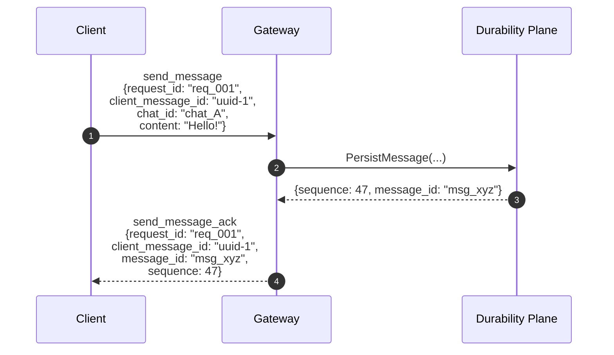

### B.2 Duplicate Detection

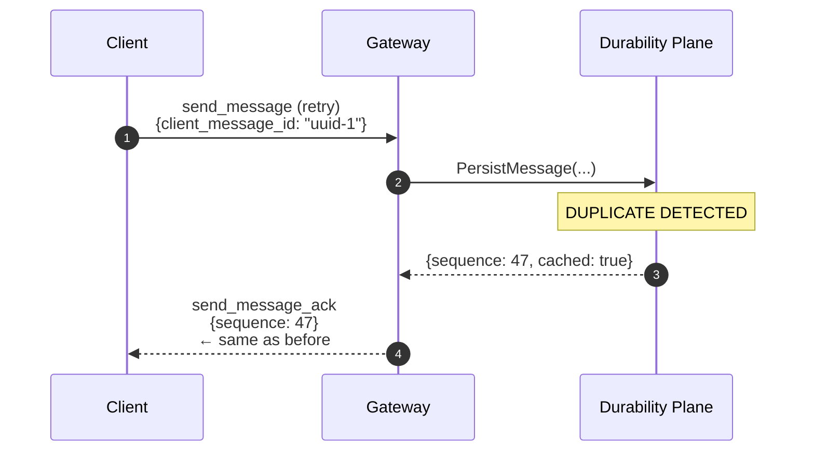

### B.3 Sync After Reconnection

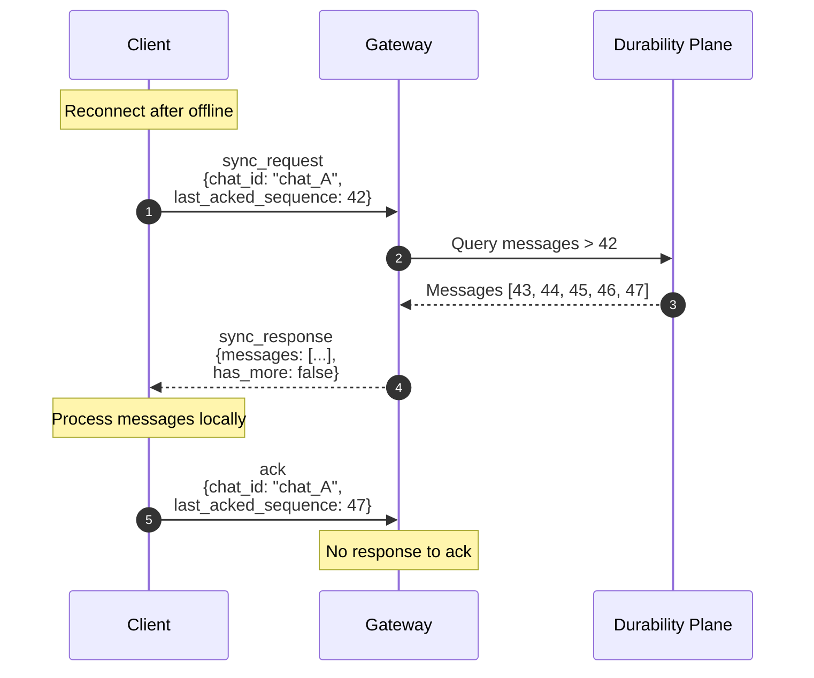

### B.4 Error Response

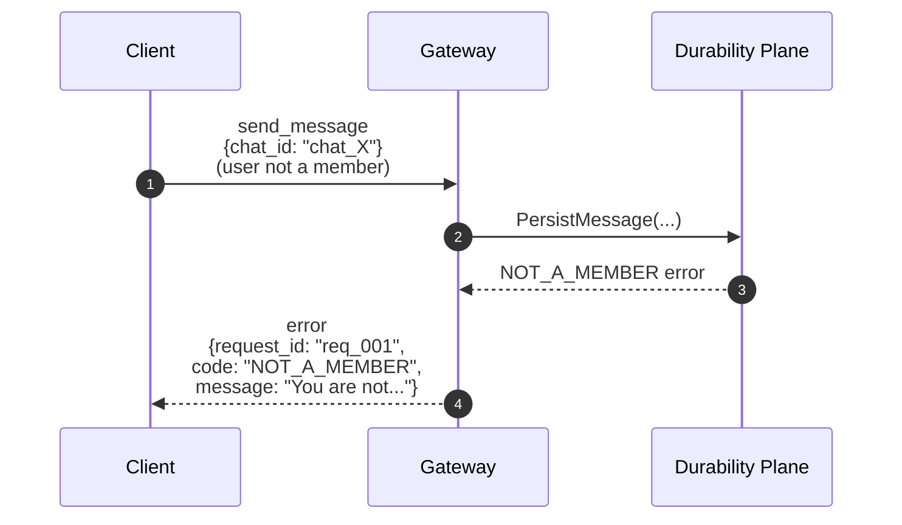

### B.5 Slow Consumer Disconnect

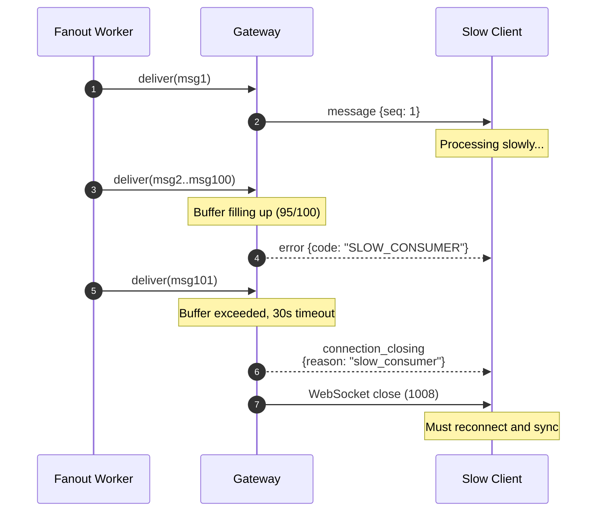

---

## Appendix C: Invariants (Machine-Checkable)

```
INVARIANT request_response_correlation:
  ∀ response R with R.request_id ≠ null:
    ∃ request Q: Q.request_id = R.request_id ∧ R.timestamp > Q.timestamp
  -- Every response with a request_id correlates to a prior request

INVARIANT one_way_messages_no_response:
  ∀ message M with M.type ∈ {ack, typing_start, typing_stop}:
    ¬∃ response R: R correlates to M
  -- One-way messages never receive responses

INVARIANT server_push_no_request_id:
  ∀ message M with M.type ∈ {message, typing_indicator, connection_closing}:
    M.request_id = null
  -- Server-initiated pushes never have request_id

INVARIANT ack_cumulative:
  ∀ ack A for (user, chat):
    A.last_acked_sequence ≥ previous_ack.last_acked_sequence
  -- Acknowledgments are monotonically increasing

INVARIANT sync_returns_ordered:
  ∀ sync_response S:
    S.messages is ordered by sequence ascending
    ∧ ∀ i: S.messages[i].sequence < S.messages[i+1].sequence
  -- Sync responses are strictly ordered by sequence

INVARIANT send_ack_matches_request:
  ∀ send_message_ack A:
    A.payload.client_message_id = corresponding_request.payload.client_message_id
  -- ACK echoes the client_message_id from the request

INVARIANT connection_established_required:
  ∀ client_message M sent over connection C:
    ∃ connection_established E: E.timestamp < M.timestamp
  -- Clients must receive connection_established before sending messages

INVARIANT heartbeat_interval_respected:
  ∀ heartbeat H:
    time_since_last_heartbeat ≈ connection.heartbeat_interval_ms (±10%)
  -- Clients should heartbeat at the specified interval

INVARIANT error_code_is_documented:
  ∀ error E:
    E.payload.code ∈ documented_error_codes
  -- Only documented error codes are sent

INVARIANT sequence_in_message_is_valid:
  ∀ message M:
    M.payload.sequence > 0 ∧ M.payload.sequence ≤ chat_counter(M.payload.chat_id)
  -- Delivered message sequences are valid positive integers within counter range

INVARIANT idempotency_preserved_across_connections:
  ∀ send_message S1, S2 with same client_message_id on same chat:
    response(S1).sequence = response(S2).sequence
  -- Same client_message_id always returns same sequence, even across reconnects

INVARIANT slow_consumer_not_silent:
  ∀ buffer_overflow B on connection C:
    ∃ error E: E.code = "SLOW_CONSUMER" ∧ E.timestamp < B.disconnect_time
    ∨ ∃ close CL: CL.reason = "slow_consumer" ∧ CL.timestamp ≤ B.disconnect_time
  -- Buffer overflows always result in error or connection_closing, never silent drops

INVARIANT version_consistency:
  ∀ connection C:
    url_version(C) = connection_established(C).payload.protocol_version
  -- Protocol version in URL matches version in connection_established
```

---

## Appendix D: Client Implementation Checklist

### D.1 Required Behaviors (MVP Core)

- [ ] Use `Authorization` header for authentication when possible
- [ ] Generate unique `request_id` for request-response messages (`send_message`, `sync_request`)
- [ ] Omit or ignore `request_id` for one-way messages (`ack`, `typing_*`)
- [ ] Generate stable `client_message_id` per logical message (not per attempt)
- [ ] Persist `client_message_id` until ACK received
- [ ] Implement exponential backoff for reconnection
- [ ] Send heartbeats at server-specified interval
- [ ] Handle `connection_closing` gracefully
- [ ] Deduplicate incoming messages by `(chat_id, sequence)`
- [ ] Order messages by `sequence`, not arrival time
- [ ] Tolerate sequence gaps (do not block waiting)
- [ ] Batch ACKs (not per-message)
- [ ] Sync all chats after reconnection
- [ ] Handle all documented error codes
- [ ] Reconnect and sync after `SLOW_CONSUMER` error or `slow_consumer` close

### D.2 Recommended Behaviors

- [ ] Buffer outbound messages during CONNECTING/SYNCING states
- [ ] Retry failed sends with same `client_message_id`
- [ ] Debounce typing indicators (max 1/second) *(if implementing)*
- [ ] Proactively refresh JWT before expiration
- [ ] Log all errors with `request_id` for debugging
- [ ] Measure and report round-trip latency
- [ ] Implement parallel sync for multiple chats
- [ ] Display connection state to user (connected/reconnecting/offline)
- [ ] Issue `sync_request` when detecting sequence gaps

### D.3 Anti-Patterns to Avoid

- [ ] DO NOT put tokens in URLs when headers are available
- [ ] DO NOT assume message delivery order matches `sequence` order
- [ ] DO NOT generate new `client_message_id` on retry
- [ ] DO NOT ACK messages not yet rendered to user
- [ ] DO NOT retry on `FORBIDDEN` or `NOT_A_MEMBER` errors
- [ ] DO NOT assume immediate delivery (fanout is async)
- [ ] DO NOT cache membership decisions client-side for authorization
- [ ] DO NOT send messages before `connection_established`
- [ ] DO NOT ignore unknown message types (log and continue)
- [ ] DO NOT require `request_id` in `ack` messages
- [ ] DO NOT wait indefinitely for gap-filling (sync instead)

---

## Appendix E: Test Vectors

### E.1 Valid Messages

```json
// Minimal valid send_message (request_id required)
{
  "type": "send_message",
  "request_id": "550e8400-e29b-41d4-a716-446655440000",
  "payload": {
    "client_message_id": "6ba7b810-9dad-11d1-80b4-00c04fd430c8",
    "chat_id": "chat_01HQX123ABC",
    "content": "Hello"
  }
}

// Valid ack (no request_id required)
{
  "type": "ack",
  "payload": {
    "chat_id": "chat_01HQX123ABC",
    "last_acked_sequence": 47
  }
}

// Valid ack with optional request_id (ignored)
{
  "type": "ack",
  "request_id": "will-be-ignored",
  "payload": {
    "chat_id": "chat_01HQX123ABC",
    "last_acked_sequence": 47
  }
}

// Valid sync_request (request_id required)
{
  "type": "sync_request",
  "request_id": "550e8400-e29b-41d4-a716-446655440003",
  "payload": {
    "chat_id": "chat_01HQX123ABC",
    "last_acked_sequence": 0,
    "limit": 100
  }
}

// Valid heartbeat without request_id
{
  "type": "heartbeat",
  "payload": {}
}

// Valid heartbeat with request_id (will be echoed)
{
  "type": "heartbeat",
  "request_id": "hb-001",
  "payload": {}
}

// Valid typing_start (no request_id needed, MVP-optional)
{
  "type": "typing_start",
  "payload": {
    "chat_id": "chat_01HQX123ABC"
  }
}
```

### E.2 Invalid Messages (Should Produce Errors)

```json
// Missing type
{
  "request_id": "...",
  "payload": {}
}
// Expected: INVALID_MESSAGE

// send_message missing request_id (required for request-response)
{
  "type": "send_message",
  "payload": {
    "client_message_id": "...",
    "chat_id": "...",
    "content": "Hello"
  }
}
// Expected: INVALID_MESSAGE

// Invalid client_message_id format
{
  "type": "send_message",
  "request_id": "...",
  "payload": {
    "client_message_id": "not-a-uuid",
    "chat_id": "chat_01HQX123ABC",
    "content": "Hello"
  }
}
// Expected: INVALID_MESSAGE

// Content too large (>4KB)
{
  "type": "send_message",
  "request_id": "...",
  "payload": {
    "client_message_id": "...",
    "chat_id": "...",
    "content": "[4097 bytes of text]"
  }
}
// Expected: MESSAGE_TOO_LARGE

// Negative sequence in ack
{
  "type": "ack",
  "payload": {
    "chat_id": "...",
    "last_acked_sequence": -1
  }
}
// Expected: INVALID_MESSAGE
```

### E.3 Edge Cases

```json
// Empty content (invalid)
{
  "type": "send_message",
  "request_id": "...",
  "payload": {
    "client_message_id": "...",
    "chat_id": "...",
    "content": ""
  }
}
// Expected: INVALID_MESSAGE (content must be 1-4096 bytes)

// Unicode edge case (valid)
{
  "type": "send_message",
  "request_id": "...",
  "payload": {
    "client_message_id": "...",
    "chat_id": "...",
    "content": "👨‍👩‍👧‍👦 Family emoji (multi-codepoint)"
  }
}
// Expected: Success

// Sync with sequence 0 (full sync, valid)
{
  "type": "sync_request",
  "request_id": "...",
  "payload": {
    "chat_id": "...",
    "last_acked_sequence": 0
  }
}
// Expected: All messages in chat returned
```
