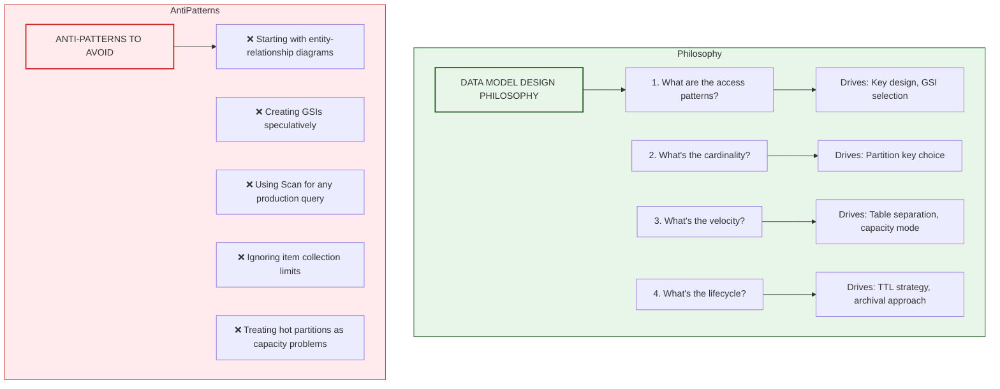
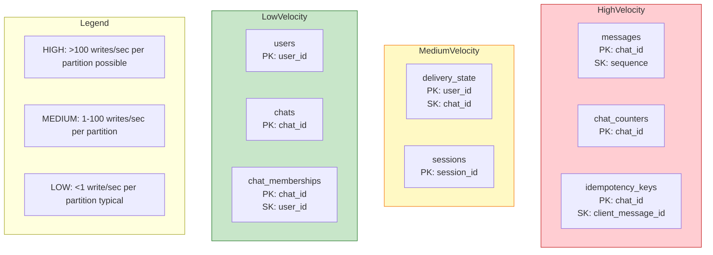
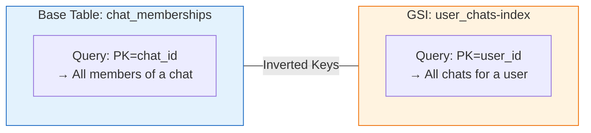
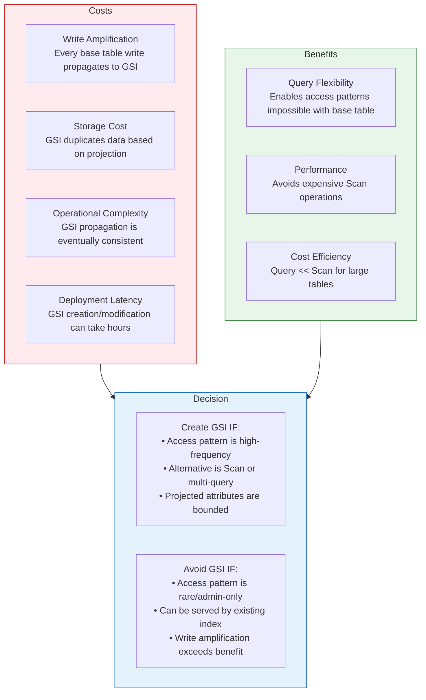
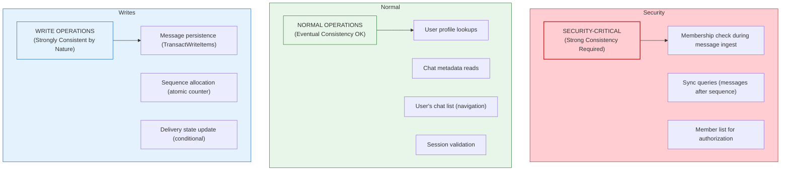
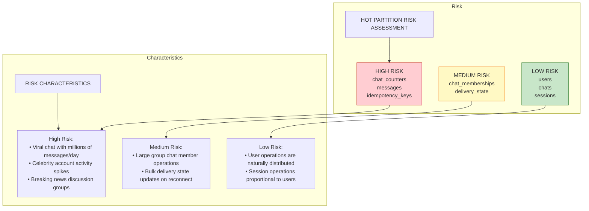
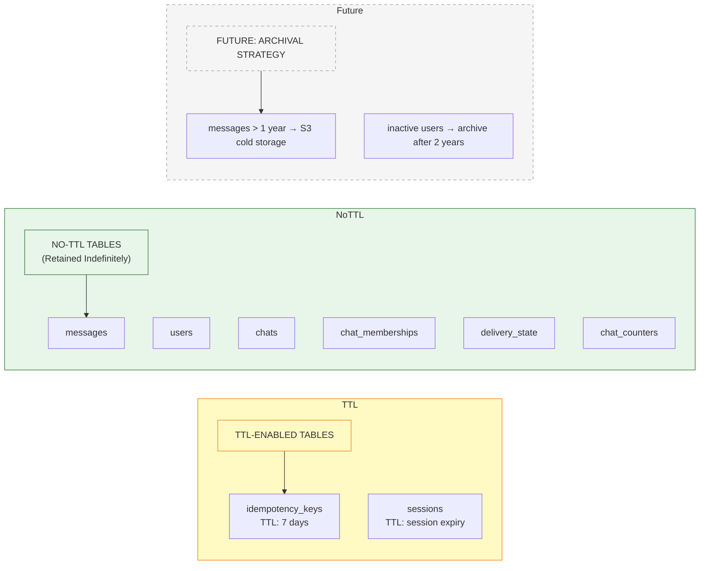
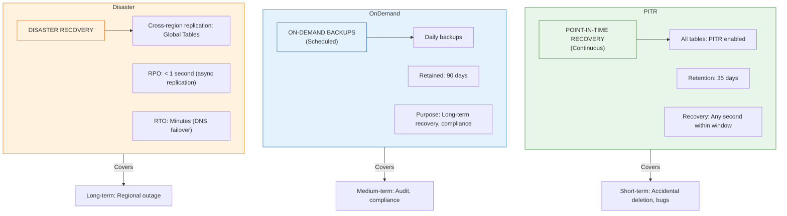
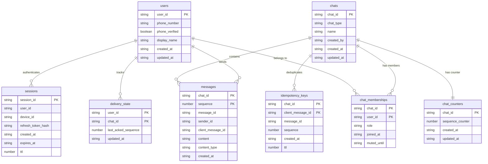

# ADR-007: Data Model and Index Strategy

- **Status**: Accepted
- **Date**: 2026-01-31

---

## Context and Problem Statement

ADR-003 established the source of truth hierarchy (DynamoDB → Kafka → Redis) and dataflow contracts. ADR-004 defined the sequence allocation mechanism using atomic counters. ADR-006 specified the REST API contract with its access patterns. However, these documents treat the data model as a collection of independent concerns without addressing the holistic design principles that ensure query efficiency, cost optimization, and scalability.

This ADR consolidates all data model specifications into a single authoritative reference. Previous ADRs now reference this document for schema details while retaining focus on their primary concerns (dataflow, sequencing, API contracts).

In production DynamoDB systems, poor data modeling decisions manifest as:

- **Expensive scans**: Queries that require table scans instead of index lookups
- **Hot partitions**: Uneven data distribution causing throttling on popular items
- **GSI proliferation**: Unnecessary indexes that increase write costs and operational complexity
- **Inefficient access patterns**: Multiple round-trips for operations that could be single queries
- **Capacity misalignment**: Over-provisioning quiet tables while under-provisioning hot ones

Without explicit design rationale, engineers may:
- Create new GSIs for every new query pattern (expensive and slow to deploy)
- Use `Scan` operations where `Query` would suffice (10-100x cost difference)
- Design schemas that work for current scale but break at 10x growth
- Ignore item collection limits until they cause production incidents

**Core Question:** What are the complete data modeling principles, index strategy, and capacity planning guidelines that govern the messaging system's DynamoDB implementation?

---

## Decision Drivers

1. **Access Pattern Alignment**: Schema design must be driven by access patterns, not normalized data modeling. "How will this be queried?" precedes "How should this be stored?"

2. **Partition Key Selection**: Partition keys must distribute load evenly while supporting all required access patterns. Hot partitions are architectural failures, not capacity problems.

3. **GSI Minimization**: Every GSI increases write costs (each write propagates to all GSIs) and adds operational complexity. GSIs are justified only when they enable critical access patterns not achievable with the base table.

4. **Single-Table vs. Multi-Table**: The design must explicitly justify table separation vs. single-table design based on access patterns, not conceptual entity boundaries.

5. **Item Collection Awareness**: For tables with sort keys, item collections (all items sharing a partition key) have a 10GB limit. The design must ensure this limit is never approached.

6. **Cost Predictability**: The data model must enable predictable cost scaling. Unbounded growth patterns must be identified and bounded.

7. **Query Efficiency**: Every documented access pattern must be achievable with a single `GetItem` or `Query` operation. Patterns requiring `Scan` or multiple operations must be explicitly justified.

---

## Considered Options

### Option 1: Single-Table Design

All entities (users, chats, memberships, messages, etc.) stored in a single DynamoDB table with composite keys and overloaded attributes.

**Mechanism**: Generic `PK`/`SK` attributes with patterns like `USER#123`, `CHAT#456#MSG#789`; GSIs with inverted keys for alternate access patterns.

### Option 2: Entity-Per-Table Design

Each logical entity gets its own table with entity-specific attributes. Relationships managed via application-level joins.

**Mechanism**: Separate `users`, `chats`, `messages`, `memberships` tables; application fetches related data with multiple queries.

### Option 3: Hybrid Design with Access-Pattern-Driven Boundaries

Tables are separated based on access pattern isolation, not entity boundaries. Entities with shared access patterns may coexist; entities with divergent patterns are separated.

**Mechanism**: Group by query pattern similarity; separate by scaling characteristics; minimize cross-table operations.

### Option 4: Normalized Relational Design (Anti-Pattern for DynamoDB)

Traditional third-normal-form design with foreign keys and joins implemented in application code.

**Mechanism**: Highly normalized tables; application-level joins; heavy use of GSIs to support query patterns.

---

## Decision Outcome

**Chosen Option: Option 3 — Hybrid Design with Access-Pattern-Driven Boundaries**

This approach recognizes that DynamoDB is not a relational database and should not be modeled like one. Tables are separated based on:

1. **Scaling characteristics**: High-velocity tables (messages, counters) separate from low-velocity tables (users, chats)
2. **Access pattern isolation**: Tables that are always queried independently can scale independently
3. **Item collection constraints**: Entities with unbounded growth per partition require careful partition key design

The hybrid approach avoids both extremes: single-table designs that become unmaintainable at scale, and entity-per-table designs that fragment related data unnecessarily.

### Design Philosophy



---

## Detailed Design

### 1. Table Architecture Overview

The messaging system uses **8 DynamoDB tables** organized by access pattern similarity and scaling characteristics:



### 2. Table-by-Table Design Rationale

#### 2.1 Table: `messages`

**Purpose**: Stores all message content. The most read-heavy table in the system.

| Attribute | Type | Key | Description |
|-----------|------|-----|-------------|
| `chat_id` | String | PK | Partition key — isolates messages by conversation |
| `sequence` | Number | SK | Sort key — enables range queries, ordering |
| `message_id` | String | — | Globally unique identifier (ULID) |
| `sender_id` | String | — | Reference to user who sent the message |
| `client_message_id` | String | — | Client idempotency key |
| `content` | String | — | Message text (≤ 4KB for MVP) |
| `content_type` | String | — | MIME type |
| `created_at` | String | — | ISO 8601 timestamp |

**Why This Key Design:**

```
PK = chat_id    →  All messages for a chat are co-located
SK = sequence   →  Messages naturally ordered; range queries efficient
```

| Access Pattern | Query | Efficiency |
|----------------|-------|------------|
| Get messages after sequence | `Query(PK=chat_id, SK > last_seen)` | ✅ Single query, index-only |
| Get recent N messages | `Query(PK=chat_id, ScanIndexForward=false, Limit=N)` | ✅ Single query, index-only |
| Get specific message | `GetItem(PK=chat_id, SK=sequence)` | ✅ Single read, O(1) |

**Why No GSI:**

- Messages are never queried by `sender_id` alone (would require knowing chat_id anyway)
- Messages are never queried by `message_id` alone (always have chat_id context)
- Any future "search" use case would use a dedicated search service (Elasticsearch/OpenSearch), not DynamoDB

**Item Collection Analysis:**

For a chat with `sequence` as sort key:
- Typical message size: ~500 bytes (after DynamoDB overhead)
- 10GB limit / 500 bytes = ~20 million messages per chat
- Even at 1 message/second, this is ~231 days of continuous messages
- For MVP scope, this is acceptable. Hot partition mitigation (ADR-future) addresses high-volume chats.

**Capacity Considerations:**

| Scenario | Read Pattern | Write Pattern |
|----------|--------------|---------------|
| Normal usage | Bursty reads on reconnect; steady reads during active use | Steady writes proportional to user activity |
| High-traffic chat | Potential read hot partition during sync | Write hot partition on active chat |
| Mitigation | Adaptive capacity + read replicas (DAX) | Deferred to hot partition ADR |

#### 2.2 Table: `chat_counters`

**Purpose**: Dedicated atomic counter for sequence allocation. Separated from `chats` to prevent contention.

| Attribute | Type | Key | Description |
|-----------|------|-----|-------------|
| `chat_id` | String | PK | Partition key — one counter per chat |
| `sequence_counter` | Number | — | Current highest allocated sequence |
| `created_at` | String | — | Counter creation timestamp |
| `updated_at` | String | — | Last increment timestamp |

**Why Separate Table:**

```
CRITICAL: Every message send increments this counter.

If counters were in the `chats` table:
- Chat metadata reads would contend with counter writes
- Counter throughput limited by chat metadata access patterns
- Capacity planning becomes complex (mixed access patterns)

Separate table enables:
- Independent scaling (counters are write-heavy, chats are read-heavy)
- Isolated capacity provisioning
- Cleaner operational monitoring
```

**No GSI**: Counters are only accessed by `chat_id`. No alternate access patterns exist.

**Item Collection**: N/A — single item per partition key (no sort key).

#### 2.3 Table: `idempotency_keys`

**Purpose**: Deduplication tracking for message sends. Supports safe client retries.

| Attribute | Type | Key | Description |
|-----------|------|-----|-------------|
| `chat_id` | String | PK | Co-located with messages for transactional writes |
| `client_message_id` | String | SK | Client-provided UUID |
| `message_id` | String | — | Server-assigned message ID |
| `sequence` | Number | — | Assigned sequence number |
| `created_at` | String | — | First successful write time |
| `ttl` | Number | — | Unix timestamp for auto-deletion (7 days) |

**Why Co-located with `chat_id`:**

The idempotency key is semantically scoped to a chat—the same `client_message_id` in different chats represents different messages. Co-locating by `chat_id` provides:

1. **Natural lookup key**: Queries are always `(chat_id, client_message_id)`
2. **Throughput alignment**: Idempotency key writes scale with per-chat message rate
3. **Operational simplicity**: Monitoring and capacity planning align with message tables

*Note*: `TransactWriteItems` can operate across different tables and partition keys (up to 100 items, 4MB total). The co-location is for data modeling clarity, not a transactional requirement.

**TTL Strategy:**

```
Idempotency windows are finite:
- Client retries happen within seconds to minutes
- 7-day TTL provides generous safety margin
- Auto-deletion prevents unbounded growth
- DynamoDB TTL deletion is eventually consistent (up to 48h delay)

After TTL expiration:
- Reusing the same client_message_id would create a new message
- This is acceptable: 7 days >> any reasonable retry window
```

**Item Collection Analysis:**

- Bounded by message rate per chat × 7 days
- Same order of magnitude as messages table (acceptable)

#### 2.4 Table: `users`

**Purpose**: User identity and profile information.

| Attribute | Type | Key | Description |
|-----------|------|-----|-------------|
| `user_id` | String | PK | ULID format unique identifier |
| `phone_number` | String | — | E.164 format |
| `phone_verified` | Boolean | — | Verification status |
| `display_name` | String | — | User-chosen name |
| `created_at` | String | — | Account creation time |
| `updated_at` | String | — | Last profile update time |

**GSI: `phone_number-index`**

| Attribute | Key Role | Projection |
|-----------|----------|------------|
| `phone_number` | PK | `user_id` only (sparse projection) |

**Why This GSI:**

```
Access Pattern: "Find user by phone number"
- Used during: Login, contact lookup, adding members by phone
- Frequency: Medium (every login, contact search)
- Alternative: Full table scan (unacceptable at scale)

Sparse Projection Rationale:
- Only need user_id from this lookup
- Subsequent GetItem fetches full profile if needed
- Reduces GSI storage and write amplification
```

**Why Only One GSI:**

- Users are always queried by `user_id` (post-authentication)
- Phone number lookup is the only alternate access pattern
- Future patterns (email lookup, etc.) would add GSIs only when needed

#### 2.5 Table: `chats`

**Purpose**: Chat metadata (name, type, creator). Does NOT contain members.

| Attribute | Type | Key | Description |
|-----------|------|-----|-------------|
| `chat_id` | String | PK | ULID format unique identifier |
| `chat_type` | String | — | `direct` or `group` |
| `name` | String | — | Display name (null for direct) |
| `created_by` | String | — | Creator's user_id |
| `created_at` | String | — | Creation timestamp |
| `updated_at` | String | — | Last metadata update |

**No GSI:**

- Chats are always accessed via `chat_id`
- "List all chats" uses `chat_memberships` GSI, not this table
- "Search chats by name" is not an MVP requirement

**Why Members Are Not Embedded:**

```
ANTI-PATTERN: Embedding members list in chat document

Problems:
1. Write amplification: Every member add/remove rewrites entire item
2. Size limits: DynamoDB item limit is 400KB
3. Concurrent updates: Member operations conflict with each other
4. Query inefficiency: Can't query "all chats for user X" efficiently

CORRECT PATTERN: Separate chat_memberships table with bidirectional queries
```

#### 2.6 Table: `chat_memberships`

**Purpose**: Many-to-many relationship between users and chats. Supports bidirectional queries.

| Attribute | Type | Key | Description |
|-----------|------|-----|-------------|
| `chat_id` | String | PK | Partition key |
| `user_id` | String | SK | Sort key |
| `role` | String | — | `owner`, `admin`, `member` |
| `joined_at` | String | — | ISO 8601 timestamp |
| `muted_until` | String | — | Mute expiration (null if not muted) |

**GSI: `user_chats-index`**

| Attribute | Key Role | Projection |
|-----------|----------|------------|
| `user_id` | PK | ALL (full item) |
| `chat_id` | SK | — |

**Bidirectional Query Support:**



| Access Pattern | Table/Index | Query |
|----------------|-------------|-------|
| List chat members | Base table | `Query(PK=chat_id)` |
| List user's chats | GSI | `Query(PK=user_id)` |
| Check if user in chat | Base table | `GetItem(PK=chat_id, SK=user_id)` |
| Add member | Base table | `PutItem` with condition |
| Remove member | Base table | `DeleteItem` |

**Why Full Projection on GSI:**

- "List user's chats" is a high-frequency operation (every app open)
- Sparse projection would require `BatchGetItem` for each chat's details
- Full projection enables single-query response with all membership data

**Item Collection Analysis:**

- Base table: Bounded by max chat size (1000 members for MVP groups)
- GSI: Bounded by user's chat count (typically <100, extreme <1000)

#### 2.7 Table: `delivery_state`

**Purpose**: Per-user per-chat delivery watermarks for sync-on-reconnect.

| Attribute | Type | Key | Description |
|-----------|------|-----|-------------|
| `user_id` | String | PK | Partition key — user-centric access |
| `chat_id` | String | SK | Sort key |
| `last_acked_sequence` | Number | — | Highest delivered sequence |
| `updated_at` | String | — | Last update timestamp |

**Why User-Centric Partitioning:**

```
Access Pattern Analysis:

Pattern 1: "Get delivery state for user+chat" (on reconnect sync)
  → GetItem(PK=user_id, SK=chat_id)

Pattern 2: "Update delivery state after delivery"
  → UpdateItem(PK=user_id, SK=chat_id)

Pattern 3: "List all delivery states for user" (initial sync)
  → Query(PK=user_id)

All patterns are user-centric. chat_id as PK would require:
  - Scan to find "all chats where user has delivery state"
  - This is unacceptable for the reconnect flow
```

**No GSI:**

- No access pattern requires "all delivery states for a chat"
- Such a pattern would be chat-centric (useful for admin tooling, not runtime)

**Update Semantics (Monotonic Only):**

```
UpdateItem:
  SET last_acked_sequence = :new_seq, updated_at = :now
  CONDITION: attribute_not_exists(last_acked_sequence) 
             OR last_acked_sequence < :new_seq
```

This prevents race conditions where out-of-order ACKs move the watermark backward.

#### 2.8 Table: `sessions`

**Purpose**: Active session tracking for authentication and device management.

| Attribute | Type | Key | Description |
|-----------|------|-----|-------------|
| `session_id` | String | PK | ULID format unique identifier |
| `user_id` | String | — | Owning user |
| `device_id` | String | — | Client-generated device ID |
| `refresh_token_hash` | String | — | SHA-256 hash of refresh token |
| `created_at` | String | — | Session creation time |
| `expires_at` | String | — | Expiration timestamp |
| `ttl` | Number | — | Unix timestamp for auto-deletion |

**GSI: `user_sessions-index`**

| Attribute | Key Role | Projection |
|-----------|----------|------------|
| `user_id` | PK | ALL |

**Access Patterns:**

| Pattern | Table/Index | Query |
|---------|-------------|-------|
| Validate session | Base table | `GetItem(PK=session_id)` |
| List user's sessions | GSI | `Query(PK=user_id)` |
| Revoke session | Base table | `DeleteItem(PK=session_id)` |
| Revoke all sessions | GSI + base | `Query` then `BatchWriteItem` |

**TTL Strategy:**

Sessions auto-delete when `ttl` is reached, ensuring cleanup of expired sessions without explicit garbage collection.

---

### 3. GSI Strategy and Justification

Every GSI has both benefits and costs. This section provides explicit justification for each GSI.



#### GSI Inventory

| Table | GSI Name | Purpose | Justification |
|-------|----------|---------|---------------|
| `users` | `phone_number-index` | Lookup user by phone | **Required**: Phone login flow. Alternative is Scan (unacceptable). |
| `chat_memberships` | `user_chats-index` | List user's chats | **Required**: Primary navigation UI. Called every app open. |
| `sessions` | `user_sessions-index` | List user's sessions | **Required**: Session management UI. Security feature. |
| `messages` | *None* | — | **Intentional**: All patterns supported by base table. |
| `chats` | *None* | — | **Intentional**: Always accessed by `chat_id`. |
| `chat_counters` | *None* | — | **Intentional**: Single access pattern. |
| `idempotency_keys` | *None* | — | **Intentional**: Always accessed with `chat_id`. |
| `delivery_state` | *None* | — | **Intentional**: User-centric access only. |

#### GSI Anti-Pattern Examples

```
❌ REJECTED: messages.sender_id-index
   Pattern: "All messages sent by a user"
   Rejection: Admin/analytics pattern, not runtime. Use offline export or search service.

❌ REJECTED: chats.created_by-index  
   Pattern: "All chats created by a user"
   Rejection: Rare operation. Acceptable to query memberships where role='owner'.

❌ REJECTED: delivery_state.chat_id-index
   Pattern: "All delivery states for a chat"
   Rejection: Admin-only pattern. Not on critical path.
```

---

### 4. Access Pattern Quick Reference

This matrix maps all documented access patterns to their implementation:

| Access Pattern | Table | Index | Operation | Consistency |
|----------------|-------|-------|-----------|-------------|
| **Users** |||||
| Get user by ID | `users` | Base | `GetItem(user_id)` | Eventually |
| Find user by phone | `users` | `phone_number-index` | `Query(phone)` | Eventually |
| **Chats** |||||
| Get chat metadata | `chats` | Base | `GetItem(chat_id)` | Eventually |
| **Memberships** |||||
| List chat members | `chat_memberships` | Base | `Query(chat_id)` | **Strongly** |
| List user's chats | `chat_memberships` | `user_chats-index` | `Query(user_id)` | Eventually |
| Check user in chat | `chat_memberships` | Base | `GetItem(chat_id, user_id)` | **Strongly** |
| Add member | `chat_memberships` | Base | `PutItem` (conditional) | N/A |
| Remove member | `chat_memberships` | Base | `DeleteItem` | N/A |
| **Messages** |||||
| Get messages after seq | `messages` | Base | `Query(chat_id, SK > seq)` | **Strongly** |
| Get recent N messages | `messages` | Base | `Query` (reverse, limit) | **Strongly** |
| Get specific message | `messages` | Base | `GetItem(chat_id, seq)` | Context-dependent* |
| **Sequences** |||||
| Allocate sequence | `chat_counters` | Base | `UpdateItem(ADD)` | N/A |
| **Idempotency** |||||
| Check duplicate | `idempotency_keys` | Base | `GetItem(chat_id, client_msg_id)` | Eventually** |
| **Delivery** |||||
| Get delivery state | `delivery_state` | Base | `GetItem(user_id, chat_id)` | Eventually |
| Update watermark | `delivery_state` | Base | `UpdateItem` (conditional) | N/A |
| **Sessions** |||||
| Validate session | `sessions` | Base | `GetItem(session_id)` | Eventually |
| List user sessions | `sessions` | `user_sessions-index` | `Query(user_id)` | Eventually |

*Get specific message: Use strong consistency during sync flows (correctness-critical); eventual consistency acceptable for display/UI purposes.

**Idempotency check uses eventual consistency but is followed by conditional write, making the end-to-end operation safe—the conditional write will fail if the key already exists.

---

### 5. Consistency Model by Operation



**When to Use Strong Consistency:**

| Scenario | Rationale |
|----------|-----------|
| Membership check during message send | Security: Must not deliver to non-members |
| Message sync after reconnect | Correctness: Must not miss messages |
| Authorization decisions | Security: Stale data could allow unauthorized access |

**When Eventual Consistency Is Acceptable:**

| Scenario | Rationale |
|----------|-----------|
| User profile lookup | Display-only; stale name is cosmetic |
| Chat list for navigation | Worst case: new chat appears slightly delayed |
| Session validation | Token already validated; session lookup is secondary |

---

### 6. Partition Key Design and Hot Partition Prevention

#### 6.1 Partition Key Selection Rationale

| Table | Partition Key | Selection Rationale |
|-------|---------------|---------------------|
| `messages` | `chat_id` | Messages always queried in chat context; enables range queries on sequence |
| `chat_counters` | `chat_id` | Counter per chat; 1:1 relationship |
| `idempotency_keys` | `chat_id` | Co-located for transactional writes with messages |
| `users` | `user_id` | Users always accessed by ID post-auth |
| `chats` | `chat_id` | Chats always accessed by ID |
| `chat_memberships` | `chat_id` | Primary pattern is "members of chat"; GSI inverts for "chats of user" |
| `delivery_state` | `user_id` | Sync is user-centric; needs all chats for one user |
| `sessions` | `session_id` | Sessions validated by ID; GSI for user listing |

#### 6.2 Hot Partition Risk Analysis



#### 6.3 MVP Hot Partition Strategy

For MVP, we accept the following constraints:

| Constraint | Limit | Consequence | Mitigation (Future) |
|------------|-------|-------------|---------------------|
| Chat message rate | ~1000 msg/sec | Throttling on viral chats | Partition sharding (ADR-future) |
| Chat member count | 1000 members | Soft limit in application | Tiered group architecture |
| Reconnect sync rate | ~500 users/sec/chat | Throttling during mass reconnect | DAX read replicas |

**Operational Monitoring:**

```
CloudWatch Alarms:
- ConsumedReadCapacityUnits > 80% of provisioned (per table)
- ConsumedWriteCapacityUnits > 80% of provisioned (per table)
- ThrottledRequests > 0 (immediate alert)
- SuccessfulRequestLatency P99 > 100ms (degradation alert)
```

---

### 7. Capacity Planning

#### 7.1 Capacity Mode Selection

| Table | Mode | Rationale |
|-------|------|-----------|
| `messages` | On-Demand | Highly variable; viral chats unpredictable |
| `chat_counters` | On-Demand | Proportional to messages; same variability |
| `idempotency_keys` | On-Demand | Proportional to messages |
| `delivery_state` | On-Demand | Bursty during mass reconnects |
| `users` | Provisioned | Predictable; grows with user base |
| `chats` | Provisioned | Predictable; grows with chat creation rate |
| `chat_memberships` | Provisioned | Predictable; grows with membership changes |
| `sessions` | Provisioned | Predictable; proportional to active users |

**On-Demand vs. Provisioned Decision Matrix:**

```
Use ON-DEMAND when:
- Traffic is highly variable (>10x peaks)
- Unpredictable spike events (viral content)
- Cost tolerance for peaks > cost of provisioned headroom

Use PROVISIONED when:
- Traffic is predictable within 2x variance
- Cost optimization is priority
- Steady-state operations
```

#### 7.2 Baseline Capacity Estimates (MVP)

Assuming 10,000 daily active users, 100 messages per user per day:

| Table | Reads/sec (avg) | Writes/sec (avg) | Storage (GB) |
|-------|-----------------|------------------|--------------|
| `messages` | 100 | 12 | 5 |
| `chat_counters` | 0 | 12 | 0.01 |
| `idempotency_keys` | 12 | 12 | 0.5 |
| `delivery_state` | 50 | 20 | 0.1 |
| `users` | 20 | 0.1 | 0.05 |
| `chats` | 30 | 0.5 | 0.01 |
| `chat_memberships` | 50 | 1 | 0.1 |
| `sessions` | 10 | 1 | 0.01 |

*Note: Peak loads during reconnect storms may be 10-50x average.*

---

### 8. Item Size and Collection Limits

#### 8.1 Item Size Constraints

DynamoDB item size limit: **400 KB**

| Table | Max Item Size | Headroom |
|-------|---------------|----------|
| `messages` | ~5 KB (4KB content + metadata) | ✅ 80x headroom |
| `users` | ~2 KB (profile data) | ✅ 200x headroom |
| `chats` | ~1 KB (metadata) | ✅ 400x headroom |
| `chat_memberships` | ~500 bytes | ✅ 800x headroom |
| Others | <1 KB | ✅ Ample headroom |

**Future Risk: Rich Media**

When adding media attachments (images, files), content will be stored in S3 with DynamoDB holding only references. This maintains item size constraints.

#### 8.2 Item Collection Limits

For tables with sort keys, all items sharing a partition key form an "item collection" with a **10 GB limit**.

| Table | Collection Key | Items per Collection | Size Estimate | Risk |
|-------|----------------|----------------------|---------------|------|
| `messages` | `chat_id` | ~20M messages | 10 GB max | **Medium** (viral chats) |
| `idempotency_keys` | `chat_id` | ~20M keys (with TTL) | Bounded by TTL | **Low** |
| `chat_memberships` | `chat_id` | 1000 members (MVP limit) | ~500 KB | **None** |
| `delivery_state` | `user_id` | ~1000 chats/user | ~500 KB | **None** |
| `sessions` | N/A (no SK) | 1 | Single item | **None** |

**Monitoring:**

```
CloudWatch Metric: ItemCollectionSizeLimit
Alert: When any collection exceeds 8 GB (80% threshold)
Response: Initiate hot partition mitigation (archive old messages or shard)
```

---

### 9. Data Lifecycle and TTL Strategy



| Table | TTL Attribute | Retention | Rationale |
|-------|---------------|-----------|-----------|
| `idempotency_keys` | `ttl` | 7 days | Retry window << 7 days; prevents unbounded growth |
| `sessions` | `ttl` | Session expiry | Natural lifecycle; prevents zombie sessions |
| `messages` | *None* | Indefinite | User expectation: messages are permanent |
| `delivery_state` | *None* | Indefinite | Needed for all-time sync capability |
| Others | *None* | Indefinite | Low-velocity; storage cost negligible |

---

### 10. Backup and Recovery Strategy



**Table-Specific Strategy:**

| Table | PITR | On-Demand | Global Tables | Rationale |
|-------|------|-----------|---------------|-----------|
| `messages` | ✅ | ✅ | ✅ | Core data; must survive any failure |
| `users` | ✅ | ✅ | ✅ | Identity data; critical |
| `chats` | ✅ | ✅ | ✅ | Chat metadata; critical |
| `chat_memberships` | ✅ | ✅ | ✅ | Authorization data; critical |
| `chat_counters` | ✅ | ✅ | ✅ | Sequence integrity; critical |
| `delivery_state` | ✅ | ✅ | ✅ | Sync correctness; critical |
| `idempotency_keys` | ✅ | ❌ | ❌ | Ephemeral; rebuild from messages if needed |
| `sessions` | ✅ | ❌ | ❌ | Ephemeral; users re-login if lost |

---

## Consequences

### Positive

1. **Query Efficiency**: Every access pattern maps to a single DynamoDB operation (GetItem or Query). No Scans in production paths.

2. **Predictable Scaling**: Table separation allows independent capacity management. High-velocity tables don't contend with low-velocity tables.

3. **Minimal GSI Overhead**: Only 3 GSIs across 8 tables, minimizing write amplification and operational complexity.

4. **Clear Ownership**: Each piece of data has exactly one home. No ambiguity about which table is authoritative.

5. **Future Flexibility**: Design accommodates future patterns (search, analytics) without requiring schema changes to core tables.

### Negative

1. **Table Proliferation**: 8 tables increase deployment and monitoring complexity compared to single-table design.
   *Mitigation*: Infrastructure-as-code (Terraform/CloudFormation) manages table creation; unified monitoring dashboard.

2. **Cross-Table Joins**: Application must coordinate queries across tables for composite views (e.g., chat with members and recent messages).
   *Mitigation*: GraphQL or BFF layer aggregates data; common patterns are well-defined.

3. **Hot Partition Risk**: `chat_id`-partitioned tables (messages, counters) risk throttling on viral chats.
   *Mitigation*: Deferred to ADR-XXX (Hot Partition Mitigation). MVP accepts this constraint with monitoring.

4. **GSI Eventual Consistency**: GSI reads are eventually consistent; application must handle stale data.
   *Mitigation*: GSIs are only used for non-critical paths (navigation, session listing). Security-critical paths use base tables with strong consistency.

---

## Confirmation

The implementation of this ADR will be validated through:

1. **Access Pattern Verification**:
   - Every REST API endpoint (ADR-006) maps to documented DynamoDB operation
   - No endpoint requires Scan or multiple queries

2. **Load Testing**:
   - Sustained 10x baseline load with <100ms P99 latency
   - No throttling events under normal operation
   - Controlled throttling under simulated hot partition

3. **Capacity Monitoring**:
   - CloudWatch dashboards for all tables
   - Alerts configured per Section 6.3
   - Monthly capacity review process

4. **Data Recovery Drills**:
   - Quarterly PITR recovery test
   - Annual cross-region failover test
   - Documented runbooks for each scenario

5. **Schema Drift Prevention**:
   - Infrastructure-as-code for all tables
   - CI/CD validation against documented schema
   - GSI changes require ADR amendment

---

## Pros and Cons of the Options

### Option 1: Single-Table Design

| Aspect | Assessment |
|--------|------------|
| Good | Single deployment unit |
| Good | Transactions across all entities easier |
| Good | "Pure" DynamoDB design philosophy |
| Bad | **Complexity explosion**: Composite keys become unreadable |
| Bad | **Operational difficulty**: Single table metrics hide per-entity behavior |
| Bad | **Maintenance burden**: Schema changes affect all entities |
| Bad | **Capacity coupling**: Can't scale entities independently |

### Option 2: Entity-Per-Table Design

| Aspect | Assessment |
|--------|------------|
| Good | Conceptually simple: one entity = one table |
| Good | Clear operational boundaries |
| Bad | **Over-separation**: Related entities can't share partitions |
| Bad | **Transaction limitations**: Cross-table transactions more constrained |
| Bad | **GSI proliferation**: Each table needs its own indexes |

### Option 3: Hybrid Design (CHOSEN)

| Aspect | Assessment |
|--------|------------|
| Good | **Access-pattern-driven**: Tables match query patterns |
| Good | **Scalability-aware**: High/medium/low velocity separation |
| Good | **Operationally clear**: Metrics are meaningful per table |
| Good | **Transaction-friendly**: Co-located entities share partitions |
| Neutral | Requires upfront access pattern analysis |
| Bad | Not "pure" single-table or entity-per-table |

### Option 4: Normalized Relational Design

| Aspect | Assessment |
|--------|------------|
| Good | Familiar to engineers with SQL background |
| Bad | **Fundamentally wrong for DynamoDB**: Optimized for joins that don't exist |
| Bad | **Expensive**: Requires GSI for every relationship query |
| Bad | **Slow**: Multi-query patterns add latency |
| Bad | **Anti-pattern**: Documented as explicitly wrong by AWS |

---

## More Information

### Related ADRs

This ADR serves as the **authoritative reference for data model details**, consolidating schema specifications previously distributed across multiple documents:

- **ADR-003 (Source of Truth and Dataflow)**: Defines the authority hierarchy (DynamoDB → Kafka → Redis) and dataflow contracts. References this ADR for complete DynamoDB schema specifications.
- **ADR-004 (Sequencing Strategy)**: Defines the atomic counter mechanism for sequence allocation. References this ADR for `chat_counters` table design rationale.
- **ADR-006 (REST API Contract)**: Defines the REST API endpoints and request/response schemas. References this ADR for access pattern mappings and query implementation details.

### References

- Amazon Web Services. "Best Practices for Designing and Using Partition Keys Effectively." DynamoDB Developer Guide.
- Amazon Web Services. "NoSQL Design for DynamoDB." AWS Documentation.
- Rick Houlihan. "Advanced Design Patterns for Amazon DynamoDB." AWS re:Invent 2018 (DAT401).
- Alex DeBrie. *The DynamoDB Book*. 2020.

### Future Considerations

1. **ADR-XXX: Hot Partition Mitigation**: Sharding strategies for viral chats; write-behind patterns for counters.

2. **ADR-XXX: Message Search**: OpenSearch integration; search index population from Kafka events.

3. **ADR-XXX: Data Archival**: Cold storage strategy for messages older than 1 year; tiered access patterns.

4. **ADR-XXX: Multi-Region**: Global Tables configuration; conflict resolution for active-active.

---

## Appendix A: Complete Schema Reference



## Appendix B: GSI Configuration Summary

| GSI Name | Base Table | Partition Key | Sort Key | Projection | Purpose |
|----------|------------|---------------|----------|------------|---------|
| `phone_number-index` | `users` | `phone_number` | — | `user_id` only | Phone-based login |
| `user_chats-index` | `chat_memberships` | `user_id` | `chat_id` | ALL | List user's chats |
| `user_sessions-index` | `sessions` | `user_id` | — | ALL | Session management |

## Appendix C: Consistency Decision Tree

```
Is this operation security-critical?
├── YES → Use Strong Consistency
│   Examples: membership check for message send, authorization decisions
│
└── NO → Is this a user-facing read on the critical path?
    ├── YES → Evaluate: Is stale data harmful?
    │   ├── YES → Use Strong Consistency
    │   │   Examples: message sync (must not miss messages)
    │   │
    │   └── NO → Use Eventual Consistency
    │       Examples: user profile display, chat list navigation
    │
    └── NO → Use Eventual Consistency
        Examples: analytics queries, admin lookups
```

## Appendix D: Invariants (Machine-Checkable)

```
INVARIANT access_pattern_efficiency:
  ∀ pattern P ∈ DocumentedAccessPatterns:
    implementation(P).operation ∈ {GetItem, Query}
    ∧ implementation(P).operation ≠ Scan
  -- All documented patterns are efficient (no scans)

INVARIANT gsi_justification:
  ∀ gsi G ∈ GlobalSecondaryIndexes:
    ∃ pattern P ∈ DocumentedAccessPatterns:
      G.enables(P) ∧ ¬achievable_with_base_table(P)
  -- Every GSI enables a pattern not achievable otherwise

INVARIANT item_size_bounded:
  ∀ item I ∈ DynamoDB:
    size(I) < 400KB × 0.5
  -- All items stay well under size limit (50% headroom)

INVARIANT item_collection_bounded:
  ∀ collection C ∈ ItemCollections:
    size(C) < 10GB × 0.8
  -- All collections stay under limit (20% headroom, alerting at 80%)

INVARIANT partition_key_distributed:
  ∀ table T ∈ Tables:
    ∀ time_window W:
      max_partition_requests(T, W) < 3000 × (1.5)
  -- No partition exceeds 3000 RCU/1000 WCU with 50% headroom

INVARIANT ttl_bounded_tables:
  table ∈ {idempotency_keys, sessions} ⟹ has_ttl(table)
  -- Ephemeral tables must have TTL to prevent unbounded growth

INVARIANT backup_enabled:
  ∀ table T ∈ {messages, users, chats, chat_memberships, chat_counters, delivery_state}:
    pitr_enabled(T) ∧ on_demand_backup_scheduled(T)
  -- Critical tables have comprehensive backup strategy
```
