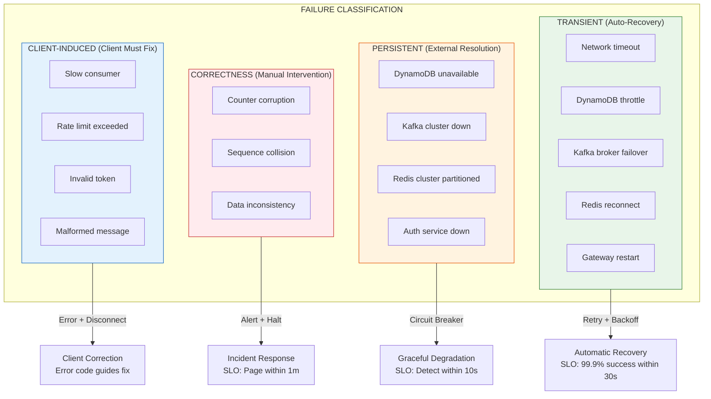
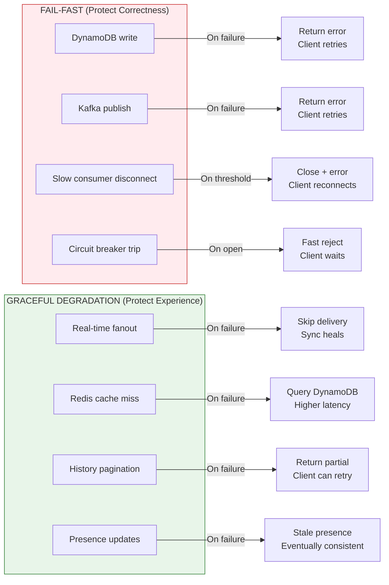
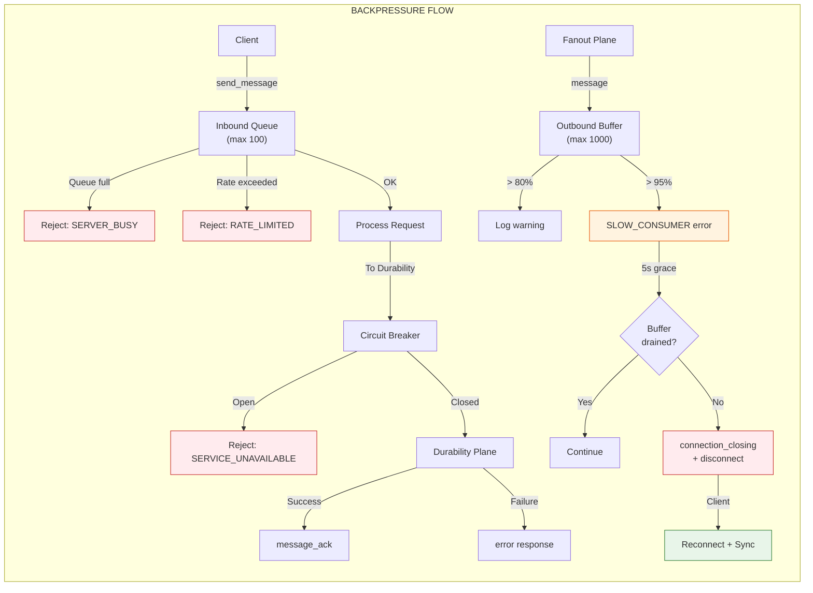
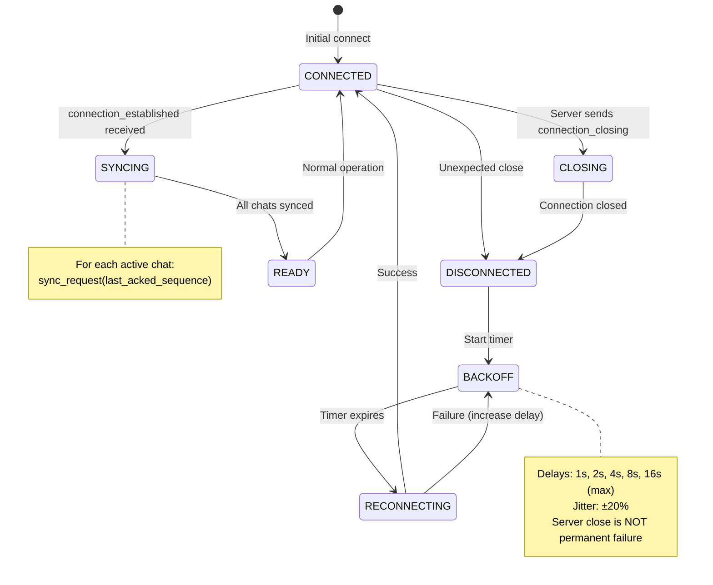
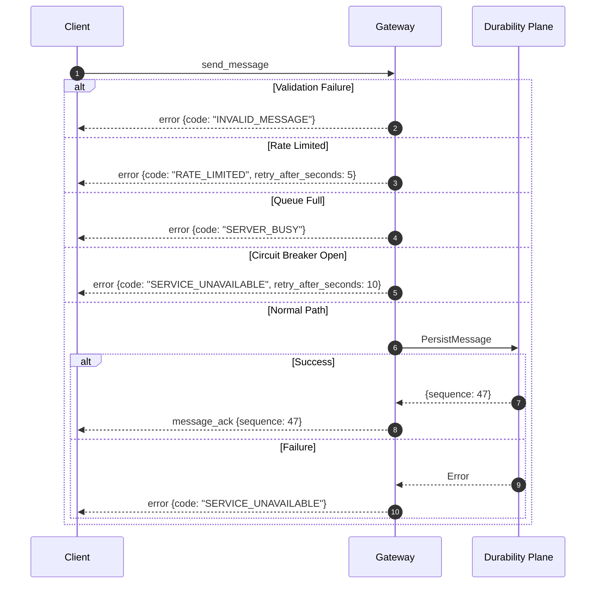
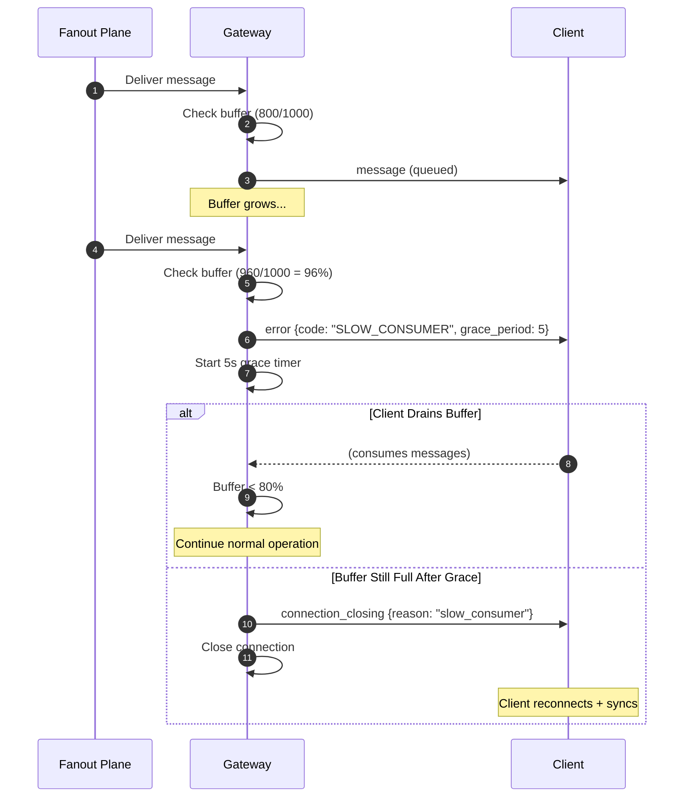
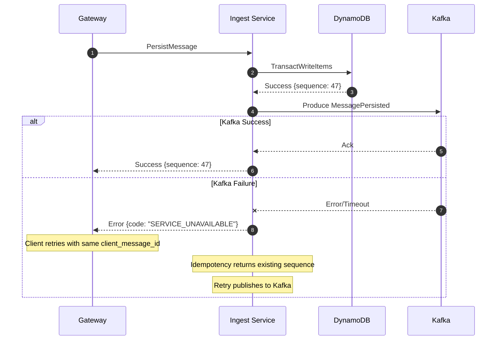
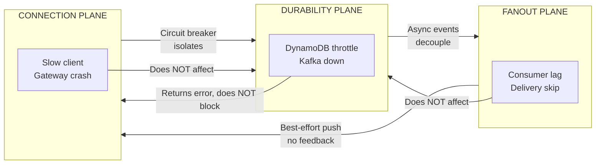

# ADR-009: Failure Handling and Backpressure

- **Status**: Accepted
- **Date**: 2026-01-31

---

## Context and Problem Statement

ADR-001 through ADR-008 established the foundational architecture: per-chat ordering with server-assigned sequences (ADR-001), three-plane separation (ADR-002), DynamoDB as the source of truth (ADR-003), atomic counter-based sequence allocation (ADR-004), WebSocket protocol contracts (ADR-005), REST API specifications (ADR-006), data model definitions (ADR-007), and delivery acknowledgement semantics (ADR-008).

The MVP-DEFINITION.md explicitly states:

> "**Failure Handling & Backpressure**: WebSocket gateways enforce per-connection outbound limits. Slow or unresponsive clients are disconnected. Fanout failures rely on reconnect sync, not infinite retries."

Additionally, the MVP failure scenarios include:
- Gateway crashes mid-fanout → messages remain durable; client syncs on reconnect
- Slow client triggers backpressure → gateway disconnects; client reconnects and syncs
- Client disconnects before receiving ACK → idempotent retry on reconnect

While individual ADRs address failure handling within their specific domains, no document provides a unified view of:

- **What contracts the system guarantees** under failure conditions
- **What behaviors are mandatory** vs. best-effort
- **When the system chooses fail-fast** vs. graceful degradation
- **How reconnection serves as a backpressure mechanism**
- **What operational signals indicate system health**

Without explicit normative contracts, implementations diverge on timeout values, retry policies, and degradation strategies. "Well-intentioned optimization" introduces subtle invariant violations. Operators lack clear SLOs for failure-related metrics.

**Core Question:** What are the **binding contracts** for failure handling and backpressure that preserve correctness guarantees while enabling predictable system behavior under stress?

---

## Decision Drivers

1. **Correctness is Non-Negotiable**: Failure handling must never violate: ACK = Durability (ADR-002), idempotency (ADR-001), per-chat ordering (ADR-001).

2. **Contracts Over Mechanisms**: This ADR defines **what the system guarantees**, not just how it's implemented.

3. **Explicit Degradation Hierarchy**: The system must declare which guarantees degrade first and which are preserved at all costs.

4. **Bounded Resources**: No single client, chat, or failure condition may consume unbounded memory, connections, or processing capacity.

5. **Reconnection is a Feature**: Forcing clients to reconnect and resync is a **valid and intentional** load control mechanism, not a failure.

6. **Observable Health**: System health must be measurable via a small set of SLO metrics.

---

## Considered Options

### Option 1: Fail-Fast Everywhere

Reject requests immediately on any upstream failure. No retries, no queuing, no buffering.

**Mechanism**: Each component returns errors synchronously; clients retry with exponential backoff.

### Option 2: Infinite Retry with Exponential Backoff

Retry all failures indefinitely with exponential backoff and jitter.

**Mechanism**: Every component retries upstream failures; no request is ever dropped.

### Option 3: Circuit Breaker with Selective Retry

Use circuit breakers to detect sustained failures, fast-fail during open state, and selectively retry only idempotent operations.

**Mechanism**: Per-dependency circuit breakers; retry policies vary by operation type; backpressure propagates upstream.

### Option 4: Bulkhead Isolation with Backpressure

Isolate resources per tenant/chat, enforce admission control, and apply backpressure when capacity is exceeded.

**Mechanism**: Per-connection buffers, per-chat rate limits, queue depth limits; shed load at boundaries.

---

## Decision Outcome

**Chosen Option: Combination of Option 3 and Option 4, with explicit fail-fast/graceful-degradation boundaries**

The system uses circuit breakers for dependency failures and bulkhead isolation for resource protection. Critically, this ADR explicitly declares **where the system fails fast** (protecting correctness) and **where it degrades gracefully** (protecting user experience), and establishes **reconnection + resync as a first-class backpressure mechanism**.

---

## Normative Contracts

This section defines **binding guarantees** that implementations MUST uphold. Violations of these contracts are bugs, not design trade-offs.

### Contract 1: No Silent Data Loss

> **The server MUST NOT silently discard any message for which a `send_message` request was received.**

| Condition | Required Behavior |
|-----------|-------------------|
| Message successfully persisted | Return `message_ack` with sequence |
| Message rejected (validation, rate limit) | Return `error` with code |
| Persistence failed (DynamoDB, Kafka) | Return `error` with retryable code |
| Connection lost before response | Client retries; idempotency ensures correctness |

**Prohibited**: Accepting a `send_message`, failing to persist, and closing the connection without error response.

### Contract 2: No Unbounded Buffering

> **The server MUST NOT buffer unbounded messages for any single connection, chat, or user.**

| Resource | Hard Limit | Exceeded Action |
|----------|------------|-----------------|
| Per-connection outbound buffer | 1000 messages | Close with `slow_consumer` |
| Per-connection inbound queue | 100 requests | Reject with `SERVER_BUSY` |
| Per-connection send rate | 10 msg/sec sustained | Reject with `RATE_LIMITED` |

**Prohibited**: Buffering messages indefinitely waiting for a slow client to drain.

### Contract 3: Backpressure is Always Signaled

> **Before any adverse action (disconnect, rejection), the system MUST signal the condition to the client.**

| Adverse Action | Required Signal |
|----------------|-----------------|
| Disconnect due to slow consumption | `SLOW_CONSUMER` error → grace period → `connection_closing` |
| Request rejected due to rate limit | `RATE_LIMITED` error with `retry_after_seconds` |
| Request rejected due to overload | `SERVER_BUSY` error |
| Disconnect due to upstream failure | `connection_closing` with reason |

**Prohibited**: Closing a connection without sending a close frame or error message.

### Contract 4: Reconnection + Resync is a Valid Response

> **Under resource pressure, the system MAY close connections and require clients to reconnect and resync. This is intentional load control, not a failure.**

Reconnection is the **canonical recovery mechanism** for:
- Slow consumers that cannot keep up with fanout
- Gateways under memory pressure
- Clients with stale state after network partitions
- System-wide overload requiring load shedding

**Client Obligation**: Clients MUST implement reconnection with exponential backoff and sync-on-reconnect (ADR-005).

### Contract 5: Persistence Failures are Fail-Fast

> **If a message cannot be durably persisted, the system MUST fail the request immediately. No optimistic acknowledgment. Client retry is expected and safe due to idempotency (ADR-001).**

| Component Failure | Behavior |
|-------------------|----------|
| DynamoDB write fails | Return error; client retries |
| Kafka publish fails | Return error; client retries |
| Transaction conflict | Server retries (bounded); then returns error |

**Prohibited**: Returning `message_ack` before DynamoDB transaction commits.

### Contract 6: Delivery Failures are Graceful

> **If real-time delivery fails, the system MUST NOT retry indefinitely. Sync-on-reconnect provides the guarantee.**

| Fanout Failure | Behavior |
|----------------|----------|
| Recipient offline | No action; sync on reconnect |
| Gateway unreachable | Skip; recipient syncs elsewhere |
| Redis lookup fails | Skip; sync on reconnect |

**Prohibited**: Unbounded retry queues for failed deliveries.

---

## Failure Taxonomy

Every failure is classified by **scope**, **impact on guarantees**, **mitigation strategy**, and **observable signal**.

### Taxonomy Table

| Failure | Scope | Impact on Guarantees | Mitigation | Observable Signal |
|---------|-------|----------------------|------------|-------------------|
| **Network timeout (client↔gateway)** | Single connection | None (client retries) | Reconnect + resync | `gateway.connection.timeout` counter |
| **Slow consumer** | Single connection | Delivery delayed | Disconnect + resync | `gateway.slow_consumer.disconnects` counter |
| **DynamoDB throttling** | Per-table (potentially many chats) | Send latency increases | Retry with backoff; scale capacity | `durability.dynamodb.throttle_count` counter |
| **DynamoDB transaction conflict** | Single chat | Send latency increases | Retry with jitter | `durability.transaction.conflict_rate` gauge |
| **DynamoDB unavailable** | All persistence | **RYOW violated** until recovery | Fail-fast; alert | `durability.dynamodb.available` gauge (0/1) |
| **Kafka broker failover** | Partition subset | Fanout delayed | Automatic rebalance | `durability.kafka.produce_latency_p99` histogram |
| **Kafka cluster down** | All fanout | **Delivery stopped** (durability intact) | Fail-fast on publish; sync heals | `durability.kafka.available` gauge (0/1) |
| **Redis connection reset** | Single gateway | Fanout routing degraded | Reconnect; degrade to sync | `gateway.redis.connection_errors` counter |
| **Redis cluster unavailable** | All gateways | Real-time delivery stops | Degrade; sync heals all | `gateway.redis.available` gauge (0/1) |
| **Gateway crash** | Connections on that instance | Delivery interrupted | Clients reconnect elsewhere | `gateway.instances.healthy` gauge |
| **Counter corruption** | Single chat | **Ordering violated** | **HALT chat; manual recovery** | `durability.counter.corruption` counter (alert on >0) |
| **Idempotency collision** | Single message | None (by design) | Return cached result | `durability.idempotency.hit_rate` gauge |

### Failure Classification Diagram



---

## Fail-Fast vs. Graceful Degradation

This section explicitly declares **where each strategy applies**. This is a design decision, not an implementation detail.

### Strategy Assignment

| Component/Path | Strategy | Rationale |
|----------------|----------|-----------|
| **Message persistence** | **FAIL-FAST** | ACK = Durability is inviolable. No optimistic acks. |
| **Kafka publish** | **FAIL-FAST** | Contract includes "downstream notified". Fail request if Kafka down. |
| **Real-time fanout** | **GRACEFUL** | Best-effort by design. Sync heals all. |
| **WebSocket slow consumer** | **FAIL-FAST** | Disconnect protects server. Reconnect + sync heals client. |
| **Gateway → Durability RPC** | **FAIL-FAST** | Circuit breaker prevents cascade. Return error to client. |
| **Fanout → Gateway delivery** | **GRACEFUL** | Skip failed deliveries. No retry queue. |
| **Redis lookup** | **GRACEFUL** | Degrade to sync-only. No blocking. |
| **DynamoDB read (history)** | **GRACEFUL** | Return partial results or error. Don't block writes. |

### Decision Diagram



### Why This Split?

**Fail-fast protects invariants**: The guarantees in ADR-001/002/004 (ACK = Durability, ordering, idempotency) are non-negotiable. Any path that could violate these MUST fail fast.

**Graceful degradation protects users**: Real-time delivery, presence, and read-path operations can tolerate delays and partial failures because sync-on-reconnect provides eventual consistency.

---

## Backpressure Contracts

The server **never buffers unbounded messages**. When limits are reached, the **only permitted actions** are:

### Permitted Actions Under Pressure

| Condition | Permitted Actions | Prohibited Actions |
|-----------|-------------------|-------------------|
| Outbound buffer > 95% | 1. Send `SLOW_CONSUMER` error<br/>2. Start grace period<br/>3. Close connection after grace | Silent drop of messages |
| Inbound rate exceeded | 1. Reject with `RATE_LIMITED`<br/>2. Include `retry_after_seconds` | Silent drop of requests |
| Request queue full | 1. Reject with `SERVER_BUSY`<br/>2. Close connection if persistent | Unbounded queue growth |
| Upstream (Durability) slow | 1. Circuit breaker opens<br/>2. Fast-reject with `SERVICE_UNAVAILABLE` | Unbounded request accumulation |
| Kafka consumer lag high | 1. Scale consumers<br/>2. Alert if sustained | Unbounded lag growth |

### Explicit Limits (Normative)

These limits are **binding**. Implementations MUST enforce them.

> **Configuration Governance**: Values below are MVP defaults. Changes require either an ADR amendment or explicit configuration change with architectural review. Silent "tuning" without review is a process violation.

| Limit | Value | Scope | Rationale |
|-------|-------|-------|-----------|
| Outbound buffer size | **1000 messages** | Per connection | Bounds memory per client |
| Inbound request queue | **100 requests** | Per connection | Bounds memory per client |
| Send rate limit | **10 msg/sec** sustained | Per connection | Prevents single-client flood |
| Send rate burst | **20 messages** | Per connection | Allows brief spikes |
| Message size | **4 KB** | Per message | Bounds per-message memory |
| Gateway → Durability timeout | **5 seconds** | Per request | Bounds request lifetime |
| Circuit breaker threshold | **5 failures / 30 seconds** | Per dependency | Detects sustained failure |
| Slow consumer grace period | **5 seconds** | Per connection | Allows recovery before disconnect |

### Backpressure Flow



---

## Reconnection as Backpressure Mechanism

This section makes explicit what is implicit in ADR-005: **forced reconnection is a designed-in load control mechanism, not an error condition.**

> **Design Principle**: A disconnected but consistent client is strictly preferable to a connected but inconsistent one.

### When Reconnection is the Correct Response

| Condition | Why Reconnection is Correct |
|-----------|----------------------------|
| Slow consumer exceeds buffer | Client cannot process at system speed; resync from known-good state |
| Gateway under memory pressure | Shedding connections protects all clients on this gateway |
| Client state diverged (missed acks) | Resync rebuilds consistent state |
| Long-lived connection (> 24h) | Prevents resource leaks; rotates to healthy gateways |
| Gateway graceful shutdown | Planned redistribution; clients reconnect elsewhere |

### Reconnection Contract

> **When the server closes a connection for load control, it MUST:**
> 1. Send `connection_closing` with reason before TCP close
> 2. Include `reconnect_allowed: true` if client should retry
> 3. Include `sync_from_sequence` hints if available

> **Clients MUST:**
> 1. Implement exponential backoff (1s → 2s → 4s → 8s → 16s max, ±20% jitter)
> 2. Sync all active chats on reconnection
> 3. Not treat server-initiated close as permanent failure

### Reconnection State Machine



---

## Operational Health Metrics (SLO)

This section defines **mandatory metrics** that indicate system health. These are not "nice to have"—they are **invariants for operational sanity**.

### Tier 1: Correctness Indicators (Alert Immediately)

| Metric | Healthy | Unhealthy | Alert Condition |
|--------|---------|-----------|-----------------|
| `durability.counter.corruption` | 0 | > 0 | **Any occurrence** (SEV-1) |
| `durability.duplicate.sequence` | 0 | > 0 | **Any occurrence** (SEV-1) |
| `durability.dynamodb.available` | 1 | 0 | 0 for > 10 seconds (SEV-1) |
| `durability.kafka.available` | 1 | 0 | 0 for > 30 seconds (SEV-2) |

### Tier 2: Capacity/Performance Indicators (Alert if Sustained)

| Metric | Healthy | Warning | Alert Condition |
|--------|---------|---------|-----------------|
| `gateway.slow_consumer.disconnects` | < 10/min | 10-50/min | > 50/min for 5 minutes (SEV-3) |
| `gateway.circuit_breaker.open` | 0 | 1 | Any open for > 1 minute (SEV-2) |
| `durability.persist.latency_p99` | < 200ms | 200-500ms | > 500ms for 5 minutes (SEV-3) |
| `durability.transaction.conflict_rate` | < 1% | 1-5% | > 5% for 5 minutes (SEV-3) |
| `fanout.kafka.consumer_lag` | < 1000 | 1K-10K | > 10K for 5 minutes (SEV-3) |
| `fanout.delivery.skip_rate` | < 5% | 5-20% | > 20% for 5 minutes (SEV-3) |

### Tier 3: Operational Indicators (Dashboard, No Auto-Alert)

| Metric | Purpose |
|--------|---------|
| `gateway.connections.active` | Capacity planning |
| `gateway.connections.rate` | Traffic patterns |
| `durability.messages.persisted_rate` | Throughput |
| `fanout.messages.delivered_rate` | Delivery throughput |
| `client.resync.forced_rate` | Load control frequency |
| `durability.idempotency.hit_rate` | Retry/duplicate indicator |

### SLO Targets (MVP)

| SLO | Target | Measurement Window |
|-----|--------|-------------------|
| **Availability** (message persistence) | 99.9% | Rolling 30 days |
| **Durability** (no acknowledged message loss) | 99.999% | Rolling 30 days |
| **Persist Latency** (P99) | < 500ms | Rolling 1 hour |
| **Delivery Lag** (persisted → delivered, online users) | < 2s P99 | Rolling 1 hour |
| **Forced Resync Rate** | < 1% of connections/hour | Rolling 1 hour |

---

## Detailed Design

### 1. Connection Plane Failure Handling

#### 1.1 Inbound Path



#### 1.2 Outbound Path (Slow Consumer Handling)



#### 1.3 Circuit Breaker to Durability Plane

| State | Behavior | Transition |
|-------|----------|------------|
| **CLOSED** | Forward requests normally | 5 failures in 30s → OPEN |
| **OPEN** | Reject immediately with `SERVICE_UNAVAILABLE` | 30s timer → HALF-OPEN |
| **HALF-OPEN** | Allow 1 probe request | Success → CLOSED; Failure → OPEN |

### 2. Durability Plane Failure Handling

#### 2.1 DynamoDB Failures

| Error | Retry? | Max Retries | Backoff | Client Response |
|-------|--------|-------------|---------|-----------------|
| `ProvisionedThroughputExceeded` | Yes | 3 | Exponential (100ms → 5s) | Error if exhausted |
| `TransactionConflict` | Yes | 5 | Jittered (50ms → 500ms) | Error if exhausted |
| `ConditionalCheckFailed` | No | — | — | Return cached result (idempotency hit) |
| `ServiceUnavailable` | No | — | — | Immediate error |
| `ValidationException` | No | — | — | Immediate error (bug) |

#### 2.2 Kafka Failures

**Contract**: If Kafka publish fails after DynamoDB success, **fail the entire request**.



**Rationale**: The Durability Plane contract is "ACK means durable AND downstream notified." Splitting this creates subtle bugs where sender sees success but recipients never receive.

#### 2.3 Counter Corruption Recovery

Counter corruption is a **SEV-1 correctness incident** requiring immediate manual intervention.

**Detection**: `TransactWriteItems` fails with "item not found" on `chat_counters`.

**Response**:
1. Immediately reject all messages for affected chat
2. Page on-call (SEV-1)
3. **Manual restoration procedure**:

```bash
# Step 1: Find maximum sequence in messages table
aws dynamodb query \
  --table-name messages \
  --key-condition-expression "chat_id = :cid" \
  --expression-attribute-values '{":cid": {"S": "AFFECTED_CHAT_ID"}}' \
  --scan-index-forward false \
  --limit 1 \
  --projection-expression "sequence"

# Step 2: Restore counter (max_sequence + 1 for safety)
aws dynamodb put-item \
  --table-name chat_counters \
  --item '{"chat_id": {"S": "AFFECTED_CHAT_ID"}, "sequence_counter": {"N": "MAX_PLUS_ONE"}}'

# Step 3: Verify with test message
# Step 4: Post-incident review (how did counter get deleted?)
```

### 3. Fanout Plane Failure Handling

The Fanout Plane is **best-effort by design**. Failures result in skipped deliveries, healed by sync.

#### 3.1 Consumer Failure Handling

| Failure | Action | Metric |
|---------|--------|--------|
| Transient (timeout, connection reset) | Retry with backoff (max 3) | `fanout.retry.count` |
| Poison pill (invalid event) | Send to DLQ; continue | `fanout.dlq.depth` |
| Fatal (auth failure, consumer crash) | Let Kubernetes restart | `fanout.consumer.restarts` |

#### 3.2 Delivery Failure Handling

| Failure | Action | Why Not Retry? |
|---------|--------|----------------|
| Recipient offline | Skip | Sync on reconnect |
| Gateway unreachable | Skip | Client will reconnect elsewhere |
| Redis lookup fails | Skip | Sync on reconnect |
| Send timeout | Skip | Unbounded retry queue would grow forever |

**Prohibited**: Retry queues for failed deliveries. This would cause unbounded memory growth during gateway outages.

---

## Cross-Plane Failure Isolation

Failures in one plane MUST NOT cascade to others.



### Isolation Rules

| Origin Plane | Affected Plane | Isolation Mechanism |
|--------------|----------------|---------------------|
| Connection (slow client) | Durability | None—requests complete normally for other clients |
| Connection (gateway crash) | Durability | None—stateless; other gateways continue |
| Durability (DynamoDB down) | Connection | Circuit breaker; fast error response |
| Durability (Kafka down) | Connection | Error response; no hanging requests |
| Durability (any failure) | Fanout | Async—Fanout processes what's in Kafka |
| Fanout (consumer lag) | Durability | None—Kafka absorbs lag |
| Fanout (delivery fails) | Connection | None—just skips; no retry to gateway |

---

## Configuration Reference

### Gateway Configuration

```yaml
gateway:
  backpressure:
    inbound:
      rate_limit_per_second: 10
      rate_limit_burst: 20
      max_queue_depth: 100
      max_message_size_bytes: 4096
    outbound:
      max_buffer_messages: 1000
      warning_threshold_percent: 80
      critical_threshold_percent: 95
      grace_period_seconds: 5
  
  circuit_breaker:
    failure_threshold: 5
    failure_window_seconds: 30
    open_duration_seconds: 30
    half_open_probe_count: 1
  
  timeouts:
    durability_rpc_seconds: 5
    heartbeat_interval_seconds: 30
    heartbeat_timeout_seconds: 10
  
  shutdown:
    drain_timeout_seconds: 30
```

### Durability Plane Configuration

```yaml
durability:
  dynamodb:
    retry:
      max_attempts: 3
      initial_backoff_ms: 100
      max_backoff_ms: 5000
    transaction_conflict:
      max_attempts: 5
      jitter_ms: 50
  
  kafka:
    producer:
      acks: "all"
      timeout_ms: 10000
      retries: 3
      retry_backoff_ms: 100
```

### Fanout Plane Configuration

```yaml
fanout:
  kafka:
    consumer:
      group_id: "fanout-workers"
      max_poll_records: 500
      enable_auto_commit: false
  
  retry:
    max_attempts: 3
    initial_backoff_ms: 100
    max_backoff_ms: 1000
  
  dlq:
    topic: "dead_letters.messages"
    alert_threshold_per_hour: 100
```

---

## Consequences

### Positive

1. **Explicit Contracts**: Clear guarantees enable confident implementation and testing.

2. **Predictable Degradation**: The system's behavior under stress is designed, not emergent.

3. **Reconnection as Feature**: Load shedding via disconnect is legitimate, not an error.

4. **Observable Health**: Tier 1/2/3 metrics provide clear operational signals.

5. **Failure Isolation**: Plane separation prevents cascade failures.

### Negative

1. **Aggressive Disconnect**: Slow clients are disconnected rather than accommodated.
   *Mitigation*: Grace period; sync-on-reconnect heals cleanly.

2. **Kafka Failure = Full Request Failure**: More aggressive than necessary.
   *Mitigation*: Idempotency makes retry safe; Kafka unavailability is rare.

3. **No Delivery Retry**: Failed fanout deliveries are not retried.
   *Mitigation*: Sync-on-reconnect guarantees eventual delivery.

---

## Confirmation

Implementation will be validated through:

1. **Contract Verification Tests**:
   - Slow consumer receives `SLOW_CONSUMER` before disconnect
   - All rejected requests receive error responses
   - Circuit breaker opens after threshold failures

2. **Backpressure Tests**:
   - Fill outbound buffer → verify warning → verify disconnect after grace
   - Exceed rate limit → verify `RATE_LIMITED` response
   - Fill request queue → verify `SERVER_BUSY` response

3. **Failure Injection Tests**:
   - Kill DynamoDB → verify fast error response
   - Kill Kafka → verify request failure (not hang)
   - Kill gateway → verify client reconnects and syncs

4. **SLO Validation**:
   - Measure persist latency P99 under load
   - Measure forced resync rate
   - Verify Tier 1 metrics alert correctly

---

## Appendix A: Formal Invariants

```
INVARIANT no_silent_message_loss:
  ∀ send_message S received by gateway:
    (S persisted) ⟹ client_receives(message_ack)
    ∨ (S not persisted) ⟹ client_receives(error)
  -- Every request gets explicit success or failure

INVARIANT bounded_buffer:
  ∀ connection C:
    |outbound_buffer(C)| ≤ 1000
    ∧ |inbound_queue(C)| ≤ 100
  -- No unbounded growth per connection

INVARIANT backpressure_signaled:
  ∀ disconnect D due to slow_consumer:
    ∃ error E: E.code = "SLOW_CONSUMER" ∧ E.timestamp < D.timestamp - 5s
  -- Grace period always observed

INVARIANT failfast_persistence:
  ∀ message_ack A:
    ∃ dynamodb_commit C: C.timestamp < A.timestamp
  -- Never ack before commit

INVARIANT graceful_fanout:
  ∀ fanout_failure F:
    ¬∃ retry R: R.message = F.message ∧ R.attempt > 3
  -- Fanout retries are bounded

INVARIANT reconnect_heals:
  ∀ client C disconnected at time T:
    C.reconnects_at(T') ∧ C.syncs_all_chats ⟹
      C.state = consistent
  -- Sync restores correct state

INVARIANT isolation_holds:
  ∀ failure F in plane P:
    ¬∃ cascade C: C.origin = P ∧ C.affects ≠ P
  -- Failures don't cross planes
```

---

## Appendix B: Failure Scenario Runbooks

### B.1 Slow Consumer Spike

**Symptom**: `gateway.slow_consumer.disconnects` > 50/min

**Diagnosis**:
1. Check if specific client population (mobile network, region)
2. Check fanout rate—is message volume unusually high?
3. Check client logs for processing bottlenecks

**Resolution**:
- If specific clients: likely client-side issue; monitor
- If system-wide: consider reducing fanout batch size
- If sustained: investigate if message volume exceeds design capacity

### B.2 Circuit Breaker Open

**Symptom**: `gateway.circuit_breaker.open` = 1

**Diagnosis**:
1. Check Durability Plane health
2. Check DynamoDB CloudWatch metrics
3. Check network connectivity

**Resolution**:
- If DynamoDB throttling: increase capacity
- If Durability Plane pods unhealthy: check logs; restart if needed
- Circuit breaker auto-recovers when upstream healthy

### B.3 High Consumer Lag

**Symptom**: `fanout.kafka.consumer_lag` > 10K

**Diagnosis**:
1. Check consumer group status
2. Check for hot partitions (single busy chat)
3. Check consumer processing time

**Resolution**:
- Scale consumer group
- If hot partition: monitor; future ADR addresses sharding
- If processing slow: optimize membership lookup

### B.4 Counter Corruption

**Symptom**: `durability.counter.corruption` > 0

**Immediate Actions**:
1. Page on-call (SEV-1)
2. Identify affected chat(s)
3. Chat is effectively read-only until restored

**Resolution**:
See §2.3 Counter Corruption Recovery procedure.

---

## Appendix C: Related ADRs

| ADR | Relationship |
|-----|--------------|
| ADR-001 | Ordering invariants that failures must preserve |
| ADR-002 | Plane separation enabling failure isolation |
| ADR-003 | Source of truth hierarchy for recovery decisions |
| ADR-004 | Counter allocation and corruption scenarios |
| ADR-005 | WebSocket protocol including error codes |
| ADR-006 | REST API error responses |
| ADR-007 | Data model for recovery queries |
| ADR-008 | Delivery state and sync semantics |
