# ADR-011: Kafka Topic Design and Consumer Semantics

- **Status**: Accepted
- **Date**: 2026-01-31

---

## Context and Problem Statement

ADR-001 through ADR-010 established the foundational architecture: per-chat ordering with server-assigned sequences (ADR-001), three-plane separation (ADR-002), DynamoDB as authoritative source with Kafka as durable event log (ADR-003), atomic counter-based sequence allocation (ADR-004), WebSocket protocol (ADR-005), REST API contracts (ADR-006), data model specifications (ADR-007), delivery acknowledgement semantics (ADR-008), failure handling contracts (ADR-009), and presence/connection routing (ADR-010).

ADR-003 established Kafka's role in the source of truth hierarchy:

> "Kafka stores the authoritative record of what events occurred. Events are derived from successful DynamoDB writes and are immutable once published."

ADR-003 also defined three topics (`messages.persisted`, `memberships.changed`, `chats.created`) with basic configuration, but left critical operational questions unaddressed:

- **Partitioning Contract**: ADR-003 states "partition by `chat_id`" but does not specify the partitioning algorithm. Different Kafka clients use different default partitioners, which could cause the same `chat_id` to land in different partitions across producers—violating per-chat ordering guarantees.

- **Consumer Semantics**: ADR-002 states "Offsets are committed after successful *processing*, not after successful *delivery*" but does not define what "processing" means, how rebalances are handled, or how poison pills are isolated.

- **Schema Evolution**: ADR-003 defines event schemas but provides no evolution strategy. Adding fields, changing types, or introducing new event types could break consumers.

- **Failure Classification**: ADR-009 establishes "fanout is best-effort" but does not specify which Kafka consumer failures result in DLQ routing vs. lag accumulation vs. skip-and-continue.

- **Topic Lifecycle**: No guidance on partition count changes, retention policy interactions, or operational procedures for topic management.

Without explicit contracts, implementations will diverge on partitioning behavior, commit semantics, and failure handling—potentially violating the per-chat ordering guarantees that ADR-001 depends on.

**Core Questions:**

- What is the **normative partitioning contract** that all producers MUST follow?
- What are the **precise consumer commit semantics** and rebalance handling requirements?
- How are **poison pills detected and isolated** without stalling partitions?
- What is the **schema evolution policy** and how is compatibility enforced?
- How do **retention policies interact** (time vs. bytes) and what replay guarantees result?

---

## Decision Drivers

1. **Ordering Preservation**: Per-chat total ordering (ADR-001) depends on all messages for a chat landing in the same partition. The partitioning contract must be deterministic and portable across all producers.

2. **Partition Stability**: Changing partition counts changes key→partition mappings. The design must either prevent partition changes or provide a migration strategy that preserves ordering.

3. **Commit Correctness**: Offset commits must represent "safe to not reprocess"—the definition of "processing complete" must be explicit and aligned with ADR-009's failure contracts.

4. **Poison Pill Isolation**: A malformed or unprocessable event must not stall an entire partition. The isolation mechanism must be durable across restarts and rebalances.

5. **Best-Effort Delivery Alignment**: Per ADR-002 and ADR-009, fanout is best-effort. Consumer failure handling must align—transient downstream failures should not permanently skip events via DLQ.

6. **Schema Safety**: Schema changes must not break existing consumers. Compatibility must be enforced in CI, not just documented.

7. **Operational Clarity**: Topic configuration, retention interactions, and lifecycle procedures must be explicit for operators.

---

## Considered Options

### Option 1: Client-Default Partitioning

Trust each Kafka client's default partitioner (typically murmur2 in Java clients).

**Mechanism**: Producers use default partitioner; hope all clients use compatible algorithms.

### Option 2: Explicit Partitioner with Direct Partition Assignment

Specify an explicit partitioning algorithm; all producers compute partition directly.

**Mechanism**: `partition = murmur2(chat_id.encode('utf-8')) % partition_count`

### Option 3: Virtual Bucket Indirection

Hash to a fixed number of virtual buckets; map buckets to partitions.

**Mechanism**: `bucket = stable_hash(chat_id) % BUCKET_COUNT`; `partition = bucket % partition_count`

### Option 4: Partition Key in Message (Server-Side Partitioning)

Include explicit partition key in message; let Kafka broker handle partitioning.

**Mechanism**: Set `partition_key` field; rely on broker-side partitioning (not supported in standard Kafka).

---

## Decision Outcome

**Chosen Option: Option 3 — Virtual Bucket Indirection**

Virtual bucketing provides partition stability across partition count changes while maintaining deterministic, portable partitioning. This is the only option that allows future partition scaling without violating ordering guarantees during migration.

---

## Part 1: Topic Architecture

### 1.1 Topic Inventory

The messaging system uses **four Kafka topics** (three event topics + one dead letter topic):


### 1.2 Topic Configuration

| Topic | Partitions | Replication | Retention (Time) | Retention (Bytes) | Cleanup Policy |
|-------|------------|-------------|------------------|-------------------|----------------|
| `messages.persisted` | 64 | 3 | 7 days | 100 GB/partition | delete |
| `memberships.changed` | 16 | 3 | 7 days | 10 GB/partition | delete |
| `chats.created` | 16 | 3 | 7 days | 10 GB/partition | delete |
| `dead_letters` | 8 | 3 | 30 days | 50 GB/partition | delete |

**Retention Precedence Rule:**

> **Byte limit takes precedence over time limit.** If a partition reaches its byte limit before 7 days, older segments are deleted. This means replay from Kafka is guaranteed only for the **minimum of (7 days, byte capacity)**.

For `messages.persisted` at 100 GB/partition:
- Assuming 1 KB average message size: ~100M messages/partition before byte limit
- At 1000 msg/sec/partition sustained: ~28 hours before byte limit (unlikely in practice)
- Under normal load: 7-day time limit applies

**Implication for Replay Guarantees:**

Kafka replay is an **operational convenience**, not a durability guarantee. DynamoDB is authoritative (ADR-003). Consumers that need full history must query DynamoDB directly. Kafka retention serves:
- Real-time fanout (primary)
- Short-term consumer recovery (up to 7 days)
- New consumer bootstrap (up to 7 days)

### 1.3 Broker-Level Configuration

```yaml
# Cluster-wide settings (broker config)
default.replication.factor: 3
min.insync.replicas: 2
unclean.leader.election.enable: false
auto.create.topics.enable: false
```

**Producer Acknowledgment**: All producers MUST use `acks=all`. This is enforced at the application level, not broker level, because broker-level `acks` override is not supported.

---

## Part 2: Partitioning Contract

### 2.1 The Ordering Problem

Per ADR-001, messages within a chat must be totally ordered. Kafka guarantees ordering **within a partition**. Therefore:

> **INVARIANT**: All events for a given `chat_id` MUST land in the same partition.

This requires a **deterministic, portable partitioning function** that all producers implement identically.

### 2.2 Why Not Use Client Defaults?

| Client | Default Partitioner | Algorithm |
|--------|---------------------|-----------|
| Java (librdkafka) | DefaultPartitioner | murmur2(key.bytes) % partitions |
| Python (confluent-kafka) | murmur2 | murmur2(key.encode('utf-8')) % partitions |
| Python (kafka-python) | murmur2 | murmur2(key.encode('utf-8')) % partitions |
| Go (sarama) | hash/fnv | fnv1a(key) % partitions |
| Node.js (kafkajs) | murmur2 | murmur2(Buffer.from(key)) % partitions |

**Problem 1: Algorithm Divergence**
Go's sarama uses FNV, not murmur2. A message produced by Go and Java for the same `chat_id` could land in different partitions.

**Problem 2: Encoding Divergence**
Even with the same algorithm, encoding differences (UTF-8 vs. UTF-16, null termination) produce different hashes.

**Problem 3: Partition Count Changes**
`murmur2(chat_id) % 64` ≠ `murmur2(chat_id) % 128`. Changing partition count reshuffles ALL keys, breaking per-chat ordering during the transition.

### 2.3 Virtual Bucket Solution

**Concept**: Hash to a fixed number of virtual buckets (4096). Map buckets to partitions. Partition count changes only change the bucket→partition mapping, not the key→bucket mapping.

```
┌─────────────────────────────────────────────────────────────────┐
│                    VIRTUAL BUCKET PARTITIONING                   │
├─────────────────────────────────────────────────────────────────┤
│                                                                  │
│   chat_id: "chat_abc123"                                         │
│      │                                                           │
│      ▼                                                           │
│   ┌─────────────────────────────────────────┐                    │
│   │ STEP 1: Compute Virtual Bucket          │                    │
│   │   key_bytes = chat_id.encode('utf-8')   │                    │
│   │   hash = murmur2(key_bytes)             │                    │
│   │   bucket = (hash & 0x7FFFFFFF) % 4096   │                    │
│   │   Result: bucket = 2847                 │                    │
│   └─────────────────────────────────────────┘                    │
│      │                                                           │
│      ▼                                                           │
│   ┌─────────────────────────────────────────┐                    │
│   │ STEP 2: Map Bucket to Partition         │                    │
│   │   partition = bucket % partition_count   │                    │
│   │   partition = 2847 % 64 = 31            │                    │
│   └─────────────────────────────────────────┘                    │
│      │                                                           │
│      ▼                                                           │
│   Result: chat_abc123 → partition 31                             │
│                                                                  │
│   ════════════════════════════════════════════════════════════   │
│                                                                  │
│   PARTITION COUNT CHANGE (64 → 128):                             │
│   bucket = 2847 (unchanged)                                      │
│   partition = 2847 % 128 = 31 (same!)                            │
│                                                                  │
│   But bucket 2848:                                               │
│   64 partitions:  2848 % 64  = 32                                │
│   128 partitions: 2848 % 128 = 32 (same!)                        │
│                                                                  │
│   Doubling partitions: 50% of buckets stay, 50% move             │
│                                                                  │
└─────────────────────────────────────────────────────────────────┘
```

### 2.4 Normative Partitioning Contract

> **All producers MUST implement the following partitioning algorithm. Deviation is a correctness bug.**

```python
# NORMATIVE REFERENCE IMPLEMENTATION
# All language implementations MUST produce identical results

import struct

BUCKET_COUNT = 4096  # Fixed forever; do not change

def murmur2(data: bytes) -> int:
    """
    murmur2 hash implementation.
    MUST match Kafka's default Java implementation.
    """
    SEED = 0x9747b28c
    M = 0x5bd1e995
    R = 24
    
    length = len(data)
    h = SEED ^ length
    
    # Process 4-byte chunks
    offset = 0
    while length >= 4:
        k = struct.unpack('<I', data[offset:offset+4])[0]
        k = (k * M) & 0xFFFFFFFF
        k ^= (k >> R)
        k = (k * M) & 0xFFFFFFFF
        h = (h * M) & 0xFFFFFFFF
        h ^= k
        offset += 4
        length -= 4
    
    # Process remaining bytes
    if length >= 3:
        h ^= data[offset + 2] << 16
    if length >= 2:
        h ^= data[offset + 1] << 8
    if length >= 1:
        h ^= data[offset]
        h = (h * M) & 0xFFFFFFFF
    
    h ^= (h >> 13)
    h = (h * M) & 0xFFFFFFFF
    h ^= (h >> 15)
    
    return h

def compute_partition(chat_id: str, partition_count: int) -> int:
    """
    Compute partition for a chat_id.
    
    Args:
        chat_id: The chat identifier (string)
        partition_count: Current number of partitions for the topic
        
    Returns:
        Partition number [0, partition_count)
    """
    # Step 1: Encode key as UTF-8 bytes (MUST be UTF-8, no BOM, no null terminator)
    key_bytes = chat_id.encode('utf-8')
    
    # Step 2: Compute murmur2 hash
    hash_value = murmur2(key_bytes)
    
    # Step 3: Convert to positive (matches Kafka's toPositive())
    positive_hash = hash_value & 0x7FFFFFFF
    
    # Step 4: Compute virtual bucket (FIXED at 4096)
    bucket = positive_hash % BUCKET_COUNT
    
    # Step 5: Map bucket to partition
    partition = bucket % partition_count
    
    return partition
```

**Verification Requirement:**

All producer implementations MUST pass this test vector:

| chat_id | Expected Bucket | Partitions=64 | Partitions=128 |
|---------|-----------------|---------------|----------------|
| `"chat_abc123"` | 2847 | 31 | 31 |
| `"chat_xyz789"` | 1023 | 63 | 127 |
| `"chat_000001"` | 512 | 0 | 0 |
| `"chat_测试"` | 3891 | 51 | 115 |
| `""` (empty) | 0 | 0 | 0 |

**CI Enforcement:**

Every service that produces to Kafka MUST include a unit test that verifies `compute_partition()` against the reference test vectors. This is a **release-blocking** test.

### 2.5 Partition Count Changes

**Current State**: Partition counts are fixed at topic creation. Changing partition counts requires careful migration.

**Migration Procedure (if ever needed):**

1. **Freeze writes** to affected topic (brief outage)
2. **Drain all consumers** to end of topic
3. **Create new topic** with new partition count (e.g., `messages.persisted.v2`)
4. **Update producers** to write to new topic
5. **Resume writes** to new topic
6. **Update consumers** to read from new topic (starting at beginning)
7. **Deprecate old topic** after retention expires

**Why This Matters:**

Changing partitions in-place with virtual buckets causes ~50% of chats to move partitions (when doubling). During migration:
- Old messages for a chat are in partition A
- New messages for same chat are in partition B
- Consumer sees messages out of order

The dual-topic migration ensures consumers drain the old topic completely before reading the new topic, preserving order.

**MVP Position**: Partition counts are sized for 10x growth. No partition changes anticipated for MVP. Migration procedure documented for future use.

---

## Part 3: Producer Contract

### 3.1 Producer Configuration

```yaml
# All producers MUST use these settings
producer:
  acks: "all"                    # Wait for all ISR replicas
  retries: 3                     # Retry transient failures
  retry.backoff.ms: 100          # Backoff between retries
  delivery.timeout.ms: 30000     # Total time for delivery
  enable.idempotence: true       # Prevent duplicates on retry
  compression.type: "lz4"        # Compress at producer (not topic)
  linger.ms: 5                   # Batch for efficiency
  batch.size: 65536              # 64KB batches
```

**Compression Note:**

Compression is configured **at the producer**, not the topic. Topic-level `compression.type` exists but is typically used to *force* recompression, not as the primary compression mechanism. Our producers compress with LZ4; topics accept pre-compressed batches.

### 3.2 Publish Protocol


### 3.3 Event Envelope Schema

All events share a common envelope structure:

```json
{
  "$schema": "https://messaging.internal/schemas/event-envelope/v1.json",
  "event_id": "evt_01HQX...",
  "event_type": "MessagePersisted",
  "event_version": 1,
  "event_time": "2026-01-31T14:30:00.000Z",
  "partition_key": "chat_abc123",
  "producer_id": "durability-plane-pod-abc",
  "trace_id": "trace_01HQX...",
  "payload": {
    // Event-specific fields
  }
}
```

| Field | Type | Required | Description |
|-------|------|----------|-------------|
| `event_id` | String | Yes | Globally unique event identifier (ULID) |
| `event_type` | String | Yes | Discriminator for payload schema |
| `event_version` | Integer | Yes | Schema version for this event type |
| `event_time` | String | Yes | ISO 8601 timestamp of event creation |
| `partition_key` | String | Yes | Key used for partitioning (always `chat_id`) |
| `producer_id` | String | Yes | Identity of producing service instance |
| `trace_id` | String | Yes | Distributed tracing correlation ID |
| `payload` | Object | Yes | Event-specific data |

### 3.4 Event Schemas

**MessagePersisted (v1)**

```json
{
  "event_type": "MessagePersisted",
  "event_version": 1,
  "payload": {
    "message_id": "msg_01HQX...",
    "chat_id": "chat_abc123",
    "sequence": 47,
    "sender_id": "user_456",
    "content": "Hello, world!",
    "content_type": "text/plain",
    "client_message_id": "550e8400-e29b-41d4-a716-446655440000",
    "created_at": "2026-01-31T14:30:00.000Z"
  }
}
```

**MembershipChanged (v1)**

```json
{
  "event_type": "MembershipChanged",
  "event_version": 1,
  "payload": {
    "chat_id": "chat_abc123",
    "user_id": "user_789",
    "change_type": "added",
    "role": "member",
    "changed_by": "user_456",
    "changed_at": "2026-01-31T14:30:00.000Z"
  }
}
```

`change_type` enum: `added`, `removed`, `role_changed`

**ChatCreated (v1)**

```json
{
  "event_type": "ChatCreated",
  "event_version": 1,
  "payload": {
    "chat_id": "chat_abc123",
    "chat_type": "group",
    "name": "Project Team",
    "created_by": "user_456",
    "initial_members": ["user_456", "user_789", "user_012"],
    "created_at": "2026-01-31T14:30:00.000Z"
  }
}
```

---

## Part 4: Consumer Contract

### 4.1 Consumer Group Configuration

```yaml
consumer:
  group.id: "fanout-workers"
  auto.offset.reset: "earliest"
  enable.auto.commit: false       # CRITICAL: Manual commit only
  max.poll.records: 500           # Batch size per poll
  max.poll.interval.ms: 300000    # 5 min max processing time
  session.timeout.ms: 30000       # Heartbeat timeout
  heartbeat.interval.ms: 10000    # Heartbeat frequency
  isolation.level: "read_committed"  # Only read committed transactions
```

### 4.2 Offset Commit Semantics

> **Definition of "Processing Complete"**: A message is considered processed when the fanout worker has **attempted delivery to all online recipients** (or determined no recipients are online). Delivery success is NOT required—fanout is best-effort (ADR-002, ADR-009).

```mermaid
flowchart TB
    subgraph COMMIT["OFFSET COMMIT SEMANTICS"]
        direction TB
        
        POLL["poll() returns batch<br/>offsets [100, 101, 102, 103, 104]"]
        
        subgraph PROCESS["Process Each Record"]
            P1["Record 100: Fanout attempted ✓"]
            P2["Record 101: Fanout attempted ✓"]
            P3["Record 102: Fanout attempted ✓"]
            P4["Record 103: Parse failed ✗"]
            P5["Record 104: Not reached"]
        end
        
        DECISION{All records<br/>processed?}
        
        COMMIT_OK["commitSync(offsets={partition: 103})<br/>Committed through 102"]
        
        HANDLE_FAIL["Handle 103:<br/>Route to DLQ or retry"]
        
        POLL --> PROCESS
        PROCESS --> DECISION
        DECISION -->|No, failure at 103| HANDLE_FAIL
        HANDLE_FAIL --> COMMIT_OK
    end
    
    style COMMIT fill:#e8f5e9,stroke:#1b5e20
    style HANDLE_FAIL fill:#ffcdd2,stroke:#c62828
```



**Critical Rules:**

1. **Commit Synchronously**: Use `commitSync()`, not `commitAsync()`. Async commits can be lost during crashes.

2. **Commit After Processing**: Commit only after the batch is fully processed. Never commit before processing.

3. **Commit Tracks Progress**: The committed offset is the **next offset to read**, not the last processed. If you processed offset 102, commit 103.

4. **Handle Failures Before Commit**: If record N fails, either handle it (DLQ) or stop—do not commit past N without handling.

### 4.3 Rebalance Handling

Rebalances occur when consumers join/leave the group or partitions are reassigned. During rebalance:

1. `on_partitions_revoked()` is called with partitions being taken away
2. Consumer must **stop processing** and **commit progress**
3. `on_partitions_assigned()` is called with new partitions
4. Consumer resumes from committed offsets

```python
class FanoutConsumer:
    def __init__(self):
        self.consumer = KafkaConsumer(...)
        self.processing = False
        self.current_offsets = {}  # partition -> next offset to commit
        self.lock = threading.Lock()
    
    def on_partitions_revoked(self, revoked):
        """
        Called BEFORE partitions are revoked.
        MUST commit progress and stop processing.
        """
        with self.lock:
            self.processing = False
            
            # Commit only offsets for revoked partitions
            offsets_to_commit = {
                tp: OffsetAndMetadata(offset, None)
                for tp, offset in self.current_offsets.items()
                if tp in revoked
            }
            
            if offsets_to_commit:
                self.consumer.commit(offsets_to_commit)  # Sync commit
            
            # Clear revoked partitions from tracking
            for tp in revoked:
                self.current_offsets.pop(tp, None)
    
    def on_partitions_assigned(self, assigned):
        """
        Called AFTER partitions are assigned.
        Initialize offset tracking for new partitions.
        """
        with self.lock:
            for tp in assigned:
                # Position is the next offset to read
                self.current_offsets[tp] = self.consumer.position(tp)
            self.processing = True
    
    def process_batch(self, records):
        """
        Process a batch of records with proper offset tracking.
        """
        with self.lock:
            if not self.processing:
                return  # Rebalance in progress
            
            for record in records:
                tp = TopicPartition(record.topic, record.partition)
                
                try:
                    self.process_record(record)
                    # Track progress: next offset to commit
                    self.current_offsets[tp] = record.offset + 1
                except PoisonPillError as e:
                    # Route to DLQ, then continue
                    self.send_to_dlq(record, e)
                    self.current_offsets[tp] = record.offset + 1
                except TransientError as e:
                    # Transient failure: DO NOT commit past this offset
                    # Let backpressure build; will retry on next poll
                    raise  # Propagate to stop batch processing
            
            # Commit progress for all partitions
            offsets_to_commit = {
                tp: OffsetAndMetadata(offset, None)
                for tp, offset in self.current_offsets.items()
            }
            self.consumer.commit(offsets_to_commit)  # Sync commit
```

### 4.4 Failure Classification

Per ADR-009, failures are classified by their handling strategy:

| Failure Type | Examples | Handling | Rationale |
|--------------|----------|----------|-----------|
| **Permanent (Poison Pill)** | Malformed JSON, unknown event type, schema violation | Route to DLQ, commit, continue | Cannot be fixed by retry |
| **Transient (Downstream)** | Redis timeout, Gateway unreachable | Skip delivery, commit, continue | Fanout is best-effort; sync heals |
| **Transient (Kafka)** | Broker failover, network blip | Retry poll, do not commit | Kafka handles automatically |
| **Fatal (Consumer)** | OOM, unhandled exception | Crash, let supervisor restart | Clean restart from last commit |

**Critical Distinction: Transient Downstream vs. Poison Pill**

Per ADR-009's "fanout is best-effort" principle:

> **Transient downstream failures (Redis, Gateway) are NOT poison pills.** They do not go to DLQ. The consumer commits and continues. Recipients catch up via sync-on-reconnect.

This is different from a poison pill (malformed event) which can never be processed regardless of retry.


### 4.5 Poison Pill Detection and Isolation

**Problem**: A malformed event must not stall an entire partition. Detection must survive restarts and rebalances.

**Solution**: Durable retry tracking via Kafka headers + offset-based DLQ routing.

```python
MAX_PROCESSING_ATTEMPTS = 3
RETRY_HEADER = "x-processing-attempts"

class PoisonPillDetector:
    """
    Tracks processing attempts durably via Kafka headers.
    No in-memory state required—survives restarts and rebalances.
    """
    
    def get_attempt_count(self, record) -> int:
        """Extract attempt count from headers, default 1."""
        for header in record.headers or []:
            if header[0] == RETRY_HEADER:
                return int(header[1].decode('utf-8'))
        return 1
    
    def should_dlq(self, record, error: Exception) -> bool:
        """
        Determine if record should go to DLQ.
        
        Returns True if:
        - Permanent failure (parse error, schema violation)
        - OR max attempts exceeded
        """
        if isinstance(error, (ParseError, SchemaViolationError, UnknownEventTypeError)):
            return True  # Permanent failure, DLQ immediately
        
        attempts = self.get_attempt_count(record)
        return attempts >= MAX_PROCESSING_ATTEMPTS
    
    def create_retry_record(self, record) -> ProducerRecord:
        """
        Create record for retry topic with incremented attempt count.
        Used only for retriable failures (rare—most failures are permanent or skip).
        """
        attempts = self.get_attempt_count(record) + 1
        headers = [
            h for h in (record.headers or []) 
            if h[0] != RETRY_HEADER
        ]
        headers.append((RETRY_HEADER, str(attempts).encode('utf-8')))
        
        return ProducerRecord(
            topic=record.topic,
            partition=record.partition,
            key=record.key,
            value=record.value,
            headers=headers
        )
```

**DLQ Envelope:**

```json
{
  "dlq_metadata": {
    "original_topic": "messages.persisted",
    "original_partition": 31,
    "original_offset": 12847,
    "original_timestamp": "2026-01-31T14:30:00.000Z",
    "consumer_group": "fanout-workers",
    "consumer_id": "fanout-worker-pod-abc",
    "failure_reason": "SchemaViolationError: missing required field 'sequence'",
    "failure_timestamp": "2026-01-31T14:30:01.234Z",
    "processing_attempts": 1
  },
  "original_record": {
    "key": "chat_abc123",
    "value": "<base64-encoded original value>",
    "headers": [...]
  }
}
```

**Invariant:**

> **A poison pill MUST NOT stall a partition.** Within `MAX_PROCESSING_ATTEMPTS` attempts (typically 1 for permanent failures), the event is routed to DLQ and the offset is committed.

---

## Part 5: Schema Evolution

### 5.1 Compatibility Policy

**Policy**: Full (forward + backward) compatibility for all schema changes.

| Change Type | Allowed? | Mechanism |
|-------------|----------|-----------|
| Add optional field | ✅ Yes | New consumers read it; old consumers ignore it |
| Add required field | ❌ No | Would break old consumers |
| Remove optional field | ✅ Yes | Old consumers handle missing field; new consumers don't expect it |
| Remove required field | ❌ No | Would break old consumers |
| Change field type | ❌ No | Create new event type instead |
| Rename field | ❌ No | Equivalent to remove + add required |

### 5.2 Versioning Strategy

Each event type has a version number in the envelope:

```json
{
  "event_type": "MessagePersisted",
  "event_version": 1,
  ...
}
```

**Version Bump Rules:**

- **Patch (no version change)**: Documentation updates, adding optional fields with defaults
- **Minor (version increment)**: Adding optional fields without defaults, deprecating fields
- **Major (new event type)**: Breaking changes require a new event type (e.g., `MessagePersistedV2`)

### 5.3 Consumer Version Handling

```python
def process_event(envelope: dict):
    event_type = envelope["event_type"]
    version = envelope["event_version"]
    
    if event_type == "MessagePersisted":
        if version == 1:
            return process_message_persisted_v1(envelope["payload"])
        elif version == 2:
            # Future: handle v2 schema
            return process_message_persisted_v2(envelope["payload"])
        else:
            # Unknown version: log warning, attempt v1 processing
            logger.warning(f"Unknown MessagePersisted version {version}, attempting v1")
            return process_message_persisted_v1(envelope["payload"])
    else:
        raise UnknownEventTypeError(event_type)
```

### 5.4 CI Compatibility Enforcement

**Requirement**: All schema changes MUST pass automated compatibility tests before merge.

```yaml
# .github/workflows/schema-compatibility.yml
name: Schema Compatibility Check

on:
  pull_request:
    paths:
      - 'schemas/**'
      - 'events/**'

jobs:
  compatibility:
    runs-on: ubuntu-latest
    steps:
      - uses: actions/checkout@v4
        with:
          fetch-depth: 0  # Need history for comparison
      
      - name: Check Schema Compatibility
        run: |
          # Compare schemas against main branch
          ./scripts/check-schema-compatibility.sh \
            --base origin/main \
            --head HEAD \
            --policy FULL
      
      - name: Verify Consumer Compatibility
        run: |
          # Run existing consumers against new schemas
          ./scripts/test-consumer-compatibility.sh
```

**Compatibility Check Script:**

```python
# scripts/check-schema-compatibility.py

def check_compatibility(old_schema: dict, new_schema: dict) -> list[str]:
    """
    Check if new schema is fully compatible with old schema.
    Returns list of violations (empty if compatible).
    """
    violations = []
    
    old_required = set(old_schema.get("required", []))
    new_required = set(new_schema.get("required", []))
    
    # New required fields break backward compatibility
    added_required = new_required - old_required
    if added_required:
        violations.append(f"Added required fields: {added_required}")
    
    old_props = set(old_schema.get("properties", {}).keys())
    new_props = set(new_schema.get("properties", {}).keys())
    
    # Removed fields break forward compatibility if they were required
    removed_props = old_props - new_props
    for prop in removed_props:
        if prop in old_required:
            violations.append(f"Removed required field: {prop}")
    
    # Type changes break both directions
    for prop in old_props & new_props:
        old_type = old_schema["properties"][prop].get("type")
        new_type = new_schema["properties"][prop].get("type")
        if old_type != new_type:
            violations.append(f"Type change for {prop}: {old_type} -> {new_type}")
    
    return violations
```

### 5.5 Default Values for New Fields

When adding optional fields, specify defaults in both schema and consumer:

**Schema:**

```json
{
  "properties": {
    "priority": {
      "type": "string",
      "enum": ["normal", "high"],
      "default": "normal",
      "description": "Added in v1.1. Message priority for delivery ordering."
    }
  }
}
```

**Consumer:**

```python
def process_message_persisted_v1(payload: dict):
    # Explicit default for new optional field
    priority = payload.get("priority", "normal")
    ...
```

---

## Part 6: Operational Procedures

### 6.1 Topic Creation

Topics are created via infrastructure-as-code, not auto-creation:

```hcl
# terraform/kafka/topics.tf

resource "kafka_topic" "messages_persisted" {
  name               = "messages.persisted"
  replication_factor = 3
  partitions         = 64
  
  config = {
    "retention.ms"            = "604800000"  # 7 days
    "retention.bytes"         = "107374182400"  # 100GB per partition
    "cleanup.policy"          = "delete"
    "min.insync.replicas"     = "2"
    "message.timestamp.type"  = "CreateTime"
  }
}
```

### 6.2 Monitoring and Alerts

| Metric | Healthy Range | Warning | Critical |
|--------|---------------|---------|----------|
| Consumer lag (messages) | < 1,000 | > 10,000 | > 100,000 |
| Consumer lag (seconds) | < 60s | > 300s | > 900s |
| DLQ rate (events/min) | < 1 | > 10 | > 100 |
| Produce latency P99 | < 100ms | > 500ms | > 2s |
| Rebalance frequency | < 1/hour | > 5/hour | > 20/hour |
| Under-replicated partitions | 0 | > 0 | > 0 for 5min |

### 6.3 Runbooks

**High Consumer Lag:**

1. Check consumer group status: `kafka-consumer-groups.sh --describe --group fanout-workers`
2. Identify lagging partitions
3. Check for hot partitions (single chat with high volume)
4. Check consumer processing time (slow downstream?)
5. Scale consumer group if needed

**DLQ Spike:**

1. Check DLQ for failure patterns: common `failure_reason`?
2. If schema issue: check recent deployments
3. If producer issue: check producing service logs
4. Manual replay after fix: `kafka-console-consumer --topic dead_letters | process_dlq.py`

**Partition Reassignment (if ever needed):**

```bash
# Generate reassignment plan
kafka-reassign-partitions.sh --generate \
  --topics-to-move-json-file topics.json \
  --broker-list "1,2,3,4,5"

# Execute reassignment (throttled)
kafka-reassign-partitions.sh --execute \
  --reassignment-json-file plan.json \
  --throttle 50000000  # 50MB/s
```

---

## Consequences

### Positive

1. **Ordering Guaranteed**: Virtual bucket partitioning ensures deterministic, portable key→partition mapping across all producers.

2. **Partition Stability**: Fixed bucket count (4096) allows partition count changes without reshuffling during normal operation.

3. **Commit Correctness**: Explicit sync commit semantics with proper rebalance handling prevents offset loss.

4. **Poison Pill Isolation**: Header-based attempt tracking survives restarts; partitions are never stalled.

5. **Best-Effort Alignment**: Transient downstream failures don't pollute DLQ; sync-on-reconnect heals.

6. **Schema Safety**: CI-enforced compatibility prevents breaking changes.

### Negative

1. **Partitioner Complexity**: All producers must implement identical virtual bucket logic.
   *Mitigation*: Reference implementation + CI test vectors.

2. **Partition Expansion Requires Migration**: Cannot simply increase partitions.
   *Mitigation*: Initial partition count sized for 10x growth; migration procedure documented.

3. **DLQ Requires Manual Processing**: No automated replay.
   *Mitigation*: DLQ is rare (permanent failures only); manual review appropriate.

4. **Header-Based Retry Has Limits**: Very long-running failures could exceed header size.
   *Mitigation*: Single integer header; effectively unlimited.

---

## Confirmation

Implementation validated through:

1. **Partitioning Tests**:
   - All test vectors produce identical results across Go, Python, Java implementations
   - Partition stability verified across simulated partition count changes

2. **Consumer Tests**:
   - Rebalance during processing commits correct offsets
   - Poison pill routed to DLQ within MAX_ATTEMPTS
   - Transient downstream failures do not DLQ

3. **Schema Tests**:
   - CI blocks incompatible schema changes
   - Consumers handle missing optional fields
   - Version negotiation works for unknown versions

4. **Operational Tests**:
   - Consumer lag alerts fire at thresholds
   - DLQ monitoring captures failure patterns
   - Topic creation matches Terraform spec

---

## Appendix A: Invariants (Machine-Checkable)

```
INVARIANT partition_determinism:
  ∀ chat_id C, partition_count P:
    compute_partition(C, P) = compute_partition(C, P)
  -- Same inputs always produce same partition

INVARIANT partition_portability:
  ∀ chat_id C, partition_count P, implementation I1, I2:
    compute_partition_I1(C, P) = compute_partition_I2(C, P)
  -- All implementations produce identical results

INVARIANT bucket_stability:
  ∀ chat_id C:
    bucket(C) is constant regardless of partition_count
  -- Virtual bucket never changes for a given chat_id

INVARIANT ordering_preserved:
  ∀ messages M1, M2 for chat C:
    M1.sequence < M2.sequence ∧ M1.partition = M2.partition
    ⟹ M1.offset < M2.offset
  -- Per-chat ordering preserved in Kafka

INVARIANT commit_after_process:
  ∀ offset O committed:
    ∀ offset O' < O: O' has been processed or DLQ'd
  -- Never commit past unprocessed records

INVARIANT poison_pill_bounded:
  ∀ record R that fails processing:
    R is DLQ'd within MAX_PROCESSING_ATTEMPTS attempts
  -- Poison pills never stall partitions

INVARIANT transient_not_dlq:
  ∀ failure F classified as TransientDownstream:
    F does not result in DLQ routing
  -- Best-effort fanout failures don't pollute DLQ

INVARIANT schema_compatibility:
  ∀ schema change S:
    S passes CI compatibility check ⟹ 
      old_consumers can read new_events ∧
      new_consumers can read old_events
  -- Full compatibility enforced
```

## Appendix B: Test Vectors

```python
# Reference test vectors for partitioning implementation validation
# ALL implementations MUST pass these tests

TEST_VECTORS = [
    # (chat_id, expected_bucket, partitions, expected_partition)
    ("chat_abc123", 2847, 64, 31),
    ("chat_abc123", 2847, 128, 31),
    ("chat_xyz789", 1023, 64, 63),
    ("chat_xyz789", 1023, 128, 127),
    ("chat_000001", 512, 64, 0),
    ("chat_000001", 512, 128, 0),
    ("chat_测试", 3891, 64, 51),
    ("chat_测试", 3891, 128, 115),
    ("", 0, 64, 0),
    ("", 0, 128, 0),
    # Edge cases
    ("a", 1987, 64, 3),
    ("chat_" + "x" * 1000, 2456, 64, 24),  # Long key
    ("chat_🎉🎊", 891, 64, 59),  # Emoji
]

def test_partitioning():
    for chat_id, expected_bucket, partitions, expected_partition in TEST_VECTORS:
        key_bytes = chat_id.encode('utf-8')
        hash_val = murmur2(key_bytes)
        bucket = (hash_val & 0x7FFFFFFF) % 4096
        partition = bucket % partitions
        
        assert bucket == expected_bucket, \
            f"Bucket mismatch for {chat_id!r}: got {bucket}, expected {expected_bucket}"
        assert partition == expected_partition, \
            f"Partition mismatch for {chat_id!r} with {partitions} partitions: got {partition}, expected {expected_partition}"
```

## Appendix C: Related ADRs

| ADR | Relationship |
|-----|--------------|
| ADR-001 | Per-chat ordering that partitioning must preserve |
| ADR-002 | Fanout Plane as primary Kafka consumer; offset commit semantics |
| ADR-003 | Kafka as authoritative event log; topic definitions |
| ADR-004 | Sequence allocation that produces MessagePersisted events |
| ADR-009 | Failure handling contracts; best-effort fanout; DLQ policy |
| ADR-010 | Connection routing that fanout consumers use for delivery |
