# ADR-013: Security & Abuse Controls (MVP-lite)

- **Status**: Accepted
- **Date**: 2026-01-31

---

## Context and Problem Statement

ADR-001 through ADR-012 established the foundational architecture: per-chat ordering with server-assigned sequences (ADR-001), three-plane separation (ADR-002), DynamoDB as authoritative source with Kafka as durable event log (ADR-003), atomic counter-based sequence allocation (ADR-004), WebSocket protocol (ADR-005), REST API contracts (ADR-006), data model specifications (ADR-007), delivery acknowledgement semantics (ADR-008), failure handling contracts (ADR-009), presence/connection routing (ADR-010), Kafka topic design (ADR-011), and observability/SLOs (ADR-012).

While individual ADRs address specific security concerns (device binding in ADR-006, rate limiting in ADR-005/ADR-006, JWT validation in ADR-005), no document provides:

- **Unified Threat Model**: Systematic analysis of attack surfaces across all three planes
- **Defense-in-Depth Architecture**: How security controls layer across connection, durability, and fanout
- **Abuse Prevention Framework**: Rate limiting, spam detection, and automated response mechanisms
- **Token Security Lifecycle**: Comprehensive token revocation, rotation, and compromise response
- **Content Security Policy**: Input validation, output encoding, and content-based abuse detection
- **Audit Trail Requirements**: Security-relevant event logging for forensics and compliance

The MVP-DEFINITION.md states this is a "Distributed Systems Lab" focused on "correctness, ordering, delivery semantics, scalability, and failure modes." Security is orthogonal to none of these—an exploited system cannot maintain correctness or ordering guarantees.

**Core Questions:**

- What is the **threat model** for the MVP messaging system?
- How do **security controls layer** across the three-plane architecture?
- What **abuse prevention mechanisms** protect against spam, flooding, and enumeration attacks?
- What is the **token lifecycle** including revocation and compromise response?
- How are **security events audited** for incident response and forensics?

---

## Decision Drivers

1. **Defense-in-Depth**: No single control should be the only barrier. Security must layer across planes.

2. **Fail-Secure**: Security failures should deny access, not grant it. Ambiguity resolves to denial.

3. **Minimal Attack Surface**: Expose only necessary functionality. Default-deny for new features.

4. **Auditability**: All security-relevant events must be logged with sufficient detail for forensics.

5. **Operational Feasibility**: Security controls must be implementable within MVP constraints without specialized security infrastructure.

6. **Alignment with Existing ADRs**: Security controls must integrate with established contracts (rate limits, device binding, session management).

7. **Industry Standards**: Follow OWASP guidelines, NIST recommendations, and industry best practices for messaging systems.

---

## Considered Options

### Option 1: Minimal Security (Authentication Only)

Rely solely on JWT authentication; defer all other security controls.

**Mechanism**: Validate tokens at connection time; no additional controls.

### Option 2: Perimeter Security

Concentrate security controls at the edge (Gateway layer only).

**Mechanism**: WAF-style rules, connection-level rate limiting, all validation at gateway.

### Option 3: Defense-in-Depth with Distributed Controls

Layer security controls across all planes with clear responsibility boundaries.

**Mechanism**: Gateway handles connection security, Durability handles authorization and content validation, Fanout handles delivery policy. Audit trail spans all planes.

### Option 4: Zero-Trust Architecture

Treat every component as potentially compromised; verify at every boundary.

**Mechanism**: Mutual TLS everywhere, re-validate authorization on every operation, cryptographic proof of authorization.

---

## Decision Outcome

**Chosen Option: Option 3 — Defense-in-Depth with Distributed Controls**

This approach distributes security responsibilities across planes according to their roles:
- **Connection Plane**: Authentication, connection-level rate limiting, protocol validation
- **Durability Plane**: Authorization, content validation, write-path abuse detection
- **Fanout Plane**: Delivery policy enforcement, read-path abuse detection

This aligns with the three-plane architecture (ADR-002) and provides layered defense without the operational complexity of full zero-trust.

### Security Authority Invariant

This invariant is **binding** and governs all security decisions in this ADR:

```
INVARIANT security_authority:
  - Gateway MAY authenticate but MUST NOT authorize
  - Durability Plane is the SOLE authority for write authorization
  - Fanout Plane MAY enforce delivery policy but MUST NOT mutate state
  - Redis failures in security-critical paths MUST fail closed (deny access)
```

This preserves ADR-002's single-write-authority principle and prevents authorization drift to edge components.

---

## Non-Goals (Explicit Exclusions)

The following are **explicitly out of scope** for MVP-lite. This is intentional scope discipline, not oversight:

| Non-Goal | Rationale |
|----------|-----------|
| **End-to-End Encryption (E2EE)** | Requires key exchange protocols, device key management, forward secrecy—significant complexity |
| **ML-Based Content Moderation** | Requires training infrastructure, model serving, feedback loops |
| **Fraud Scoring / Risk Engine** | Requires behavioral modeling, feature pipelines, threshold tuning |
| **Zero-Trust Internal Auth** | mTLS everywhere adds operational complexity disproportionate to MVP threat model |
| **Device Fingerprinting** | Privacy concerns, implementation complexity, limited value without ML |
| **Real-Time Anomaly Detection** | Requires streaming analytics infrastructure |
| **User-Facing Security Notifications** | UX design dependency; security events are logged, not pushed to users |

These may be addressed in future ADRs as the system matures.

---

## Part 1: Threat Model

### 1.1 Attack Surface Overview

```mermaid
flowchart TB
    subgraph Attackers["THREAT ACTORS"]
        EXT["External Attacker<br/>(No credentials)"]
        AUTH["Authenticated Abuser<br/>(Valid credentials)"]
        COMP["Compromised Account<br/>(Stolen credentials)"]
        INS["Malicious Insider<br/>(Internal access)"]
    end
    
    subgraph Surfaces["ATTACK SURFACES"]
        WS["WebSocket Gateway<br/>• Connection flooding<br/>• Protocol abuse<br/>• Token theft"]
        REST["REST API<br/>• Enumeration<br/>• Brute force<br/>• Injection"]
        MSG["Message Path<br/>• Spam/flooding<br/>• Content abuse<br/>• Amplification"]
        DATA["Data Stores<br/>• Unauthorized access<br/>• Data exfiltration<br/>• Corruption"]
    end
    
    subgraph Assets["PROTECTED ASSETS"]
        USER["User Data<br/>• Phone numbers<br/>• Messages<br/>• Memberships"]
        SYS["System Integrity<br/>• Message ordering<br/>• Delivery guarantees<br/>• Availability"]
        PRIV["Privacy<br/>• Presence<br/>• Relationships<br/>• Communication patterns"]
    end
    
    EXT --> WS
    EXT --> REST
    AUTH --> MSG
    AUTH --> REST
    COMP --> MSG
    COMP --> DATA
    INS --> DATA
    
    WS --> SYS
    REST --> USER
    MSG --> USER
    MSG --> SYS
    DATA --> USER
    DATA --> PRIV
    
    style EXT fill:#ffcdd2,stroke:#c62828
    style AUTH fill:#fff9c4,stroke:#f57f17
    style COMP fill:#ffcdd2,stroke:#c62828
    style INS fill:#ffcdd2,stroke:#c62828
```

### 1.2 Threat Catalog

Each threat is categorized by **MVP Handling**:
- **Prevented**: Active controls block the attack
- **Detected**: Logged and monitored; may trigger manual response
- **Rate-Limited**: Throttled to reduce impact, not fully prevented
- **Out of Scope**: Explicitly not addressed in MVP (organizational or future work)

| ID | Threat | Actor | MVP Handling | Mitigation Reference |
|----|--------|-------|--------------|---------------------|
| T-001 | Connection Flooding | External | **Prevented** | §2.1 Connection Rate Limiting |
| T-002 | OTP Brute Force | External | **Prevented** | §2.2 Authentication Protection |
| T-003 | Token Theft/Replay | External/Compromised | **Prevented** (device-bound) | §3.1 Token Security |
| T-004 | Phone Number Enumeration | Authenticated | **Rate-Limited + Detected** | §2.3 Enumeration Resistance |
| T-005 | Message Spam/Flooding | Authenticated | **Prevented** | §4.1 Message Rate Limiting |
| T-006 | Content Abuse | Authenticated | **Detected** (no ML) | §4.2 Content Policy |
| T-007 | Amplification Attack | Authenticated | **Rate-Limited** | §4.3 Fanout Protection |
| T-008 | Session Hijacking | External | **Prevented** (device binding) | §3.2 Session Security |
| T-009 | Data Exfiltration | Compromised/Insider | **Out of Scope** (organizational) | §5.1 Access Controls |
| T-010 | Message Ordering Attack | Authenticated | **Prevented** (integrity HMAC) | §5.2 Integrity Controls |

### 1.3 Trust Boundaries

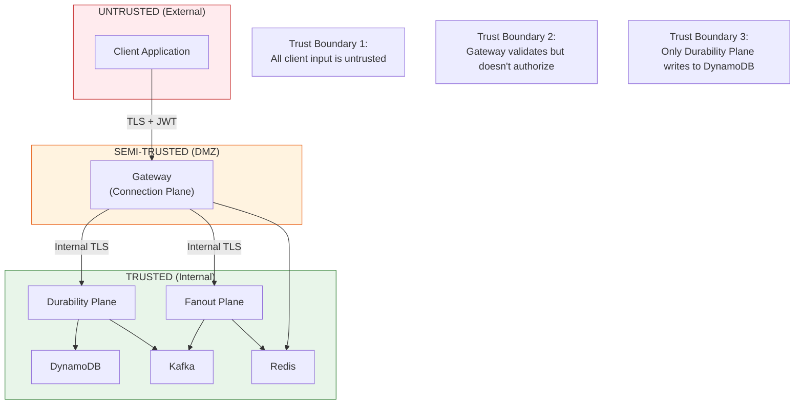

**Trust Boundary Contracts:**

| Boundary | Validation Responsibility | Authorization Responsibility |
|----------|--------------------------|------------------------------|
| Client → Gateway | Gateway validates protocol, token signature | None (authentication only) |
| Gateway → Durability | Durability re-validates critical fields | Durability authorizes all writes |
| Gateway → Fanout | Fanout trusts message source | Fanout enforces delivery policy |
| Any → Data Stores | N/A (internal) | IAM roles enforce least privilege |

---

## Part 2: Connection-Level Security

### 2.1 Connection Rate Limiting

Building on ADR-005 handshake flow, connection-level rate limiting prevents resource exhaustion:

```mermaid
flowchart TB
    subgraph Limits["CONNECTION RATE LIMITS"]
        LH["LIMIT HIERARCHY"]
        
        IP["Per-IP Limits"]
        IP1["• 10 connections/sec"]
        IP2["• 100 connections/minute"]
        IP3["• Shared across all IPs in /24"]
        
        USER["Per-User Limits"]
        USER1["• 5 concurrent connections"]
        USER2["• 10 new connections/minute"]
        USER3["• Applied after authentication"]
        
        GLOBAL["Global Limits"]
        GLOBAL1["• 10K connections/sec cluster-wide"]
        GLOBAL2["• Circuit breaker at 80% capacity"]
        
        LH --> IP
        IP --> IP1
        IP --> IP2
        IP --> IP3
        LH --> USER
        USER --> USER1
        USER --> USER2
        USER --> USER3
        LH --> GLOBAL
        GLOBAL --> GLOBAL1
        GLOBAL --> GLOBAL2
    end
```

**Rate Limit Enforcement Points:**

| Layer | Limit | Action on Exceed | Storage |
|-------|-------|------------------|---------|
| Load Balancer | IP: 10/sec | TCP RST | In-memory |
| Gateway (pre-auth) | IP: 100/min | HTTP 429 | Redis |
| Gateway (post-auth) | User: 5 concurrent | WebSocket close | Redis |
| Gateway (post-auth) | User: 10/min new | WebSocket close | Redis |

**Connection Tracking Schema (Redis):**

```
# Per-IP connection count (sliding window)
conn_rate:ip:{ip_hash}  →  ZSET { timestamp: count }
TTL: 5 minutes

# Per-user concurrent connections
conn_active:user:{user_id}  →  SET { connection_id, ... }
TTL: None (managed by connection lifecycle)

# Per-user new connection rate
conn_rate:user:{user_id}  →  ZSET { timestamp: 1 }
TTL: 5 minutes
```

### 2.2 Authentication Protection

Building on ADR-006 authentication endpoints:

**OTP Security Controls:**

| Control | Value | Rationale |
|---------|-------|-----------|
| OTP length | 6 digits | 1M combinations; rate limiting makes brute force infeasible |
| OTP validity | 5 minutes | Balance usability with exposure window |
| OTP attempts per phone | 5 per validity window | Prevents brute force |
| OTP requests per phone | 3 per 15 minutes | Prevents OTP bombing |
| OTP requests per IP | 10 per 15 minutes | Prevents distributed attacks |
| Lockout after failures | 15 minutes after 5 failures | Temporary lockout, not permanent |

**OTP Verification Flow with Security Checks:**

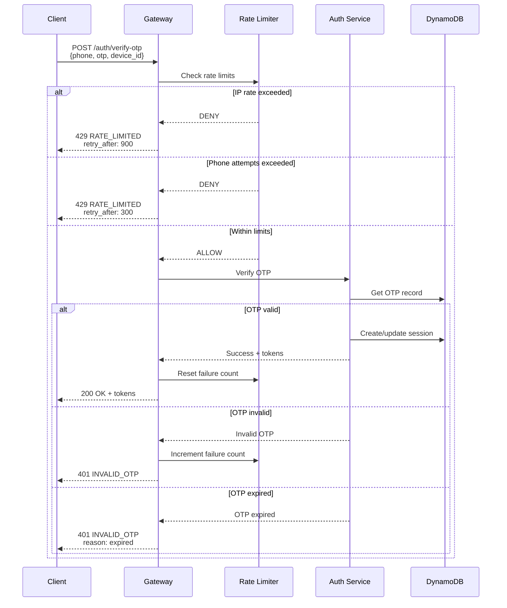

**JWT Security Requirements:**

Per ADR-005 §1.3, JWT tokens must contain standard claims. Additional security requirements:

| Requirement | Implementation | Rationale |
|-------------|----------------|-----------|
| Algorithm | RS256 (RSA + SHA-256) | Asymmetric; public key verification |
| Key size | 2048-bit minimum | NIST recommendation through 2030 |
| Key rotation | 90-day rotation with 7-day overlap | Limits exposure from key compromise |
| `jti` claim | Required, ULID format | Enables revocation checking |
| `aud` claim | Required, service identifier | Prevents token confusion attacks |
| Short-lived | 15-60 minutes | Limits exposure window |

### 2.3 Enumeration Resistance

The `/users/lookup` endpoint (ADR-006 §3.4) is a high-value target for enumeration attacks:

**Enumeration Defense Controls:**

| Control | Implementation | Rationale |
|---------|----------------|-----------|
| Strict rate limiting | 10/min, 100/hour per user | Limits enumeration rate |
| Batch size limit | 100 numbers per request | Prevents bulk harvesting |
| Response timing normalization | Fixed 200-300ms response | Prevents timing side-channels |
| Audit logging | All lookups logged with user_id | Enables abuse detection |
| Behavioral analysis | Flag high-volume, low-match queries | Detects fishing patterns |

**Enumeration Detection Heuristics:**

```
Flag account for review if ANY of:
  - > 500 lookups in 24 hours
  - < 10% match rate over 100+ lookups
  - Sequential phone number patterns detected
  - Lookups from newly created account (< 24h old)
  - Lookups with no subsequent chat creation
```

**Response Normalization Implementation:**

```python
async def lookup_users(phone_numbers: List[str]) -> Response:
    start_time = time.monotonic()
    
    # Perform actual lookup
    result = await do_lookup(phone_numbers)
    
    # Normalize response time to hide timing signals
    elapsed = time.monotonic() - start_time
    target_time = 0.250  # 250ms baseline
    jitter = random.uniform(-0.050, 0.050)  # ±50ms jitter
    
    if elapsed < target_time + jitter:
        await asyncio.sleep(target_time + jitter - elapsed)
    
    return result
```

---

## Part 3: Token & Session Security

### 3.1 Token Security Lifecycle

```mermaid
flowchart TB
    subgraph Lifecycle["TOKEN LIFECYCLE"]
        ISSUE["Token Issued<br/>• OTP verification<br/>• Token refresh"]
        ACTIVE["Token Active<br/>• Used for auth<br/>• Validated each request"]
        REFRESH["Token Refreshed<br/>• New access token<br/>• New refresh token"]
        REVOKE["Token Revoked<br/>• Explicit logout<br/>• Session deletion<br/>• Security event"]
        EXPIRE["Token Expired<br/>• TTL exceeded<br/>• Natural expiration"]
    end
    
    ISSUE --> ACTIVE
    ACTIVE -->|"Refresh flow"| REFRESH
    REFRESH --> ACTIVE
    ACTIVE -->|"Logout/revoke"| REVOKE
    ACTIVE -->|"TTL exceeded"| EXPIRE
    
    subgraph Revocation["REVOCATION TRIGGERS"]
        REV1["Explicit logout"]
        REV2["Session deletion via API"]
        REV3["Password/OTP reset"]
        REV4["Suspicious activity detected"]
        REV5["Admin action"]
    end
    
    REV1 --> REVOKE
    REV2 --> REVOKE
    REV3 --> REVOKE
    REV4 --> REVOKE
    REV5 --> REVOKE
```

**Token Revocation Strategy:**

For MVP, we use a **revocation list** approach rather than token introspection:

| Approach | Trade-off | MVP Choice |
|----------|-----------|------------|
| Short-lived tokens only | Revocation gap up to token TTL | No — 15-60min gap unacceptable |
| Revocation list in Redis | Requires check on every request | **Yes** — acceptable latency |
| Token introspection service | Additional dependency, latency | No — complexity for MVP |
| Cryptographic revocation | Complex key management | No — complexity for MVP |

**Revocation List Schema (Redis):**

```
# Revoked token JTI set
revoked_tokens  →  SET { jti_1, jti_2, ... }
TTL: None (cleaned by background job)

# Per-token revocation (alternative for targeted revocation)
revoked_token:{jti}  →  "1"
TTL: Max token lifetime (24 hours)
```

**Token Validation with Revocation Check:**

```python
async def validate_token(token: str) -> TokenClaims:
    # 1. Verify signature and standard claims
    claims = verify_jwt_signature(token)
    
    # 2. Check expiration
    if claims.exp < current_timestamp():
        raise TokenExpiredError()
    
    # 3. Check revocation list
    if await redis.sismember("revoked_tokens", claims.jti):
        raise TokenRevokedError()
    
    # 4. Validate audience
    if claims.aud != "messaging-api":
        raise InvalidAudienceError()
    
    return claims
```

**Revocation Store Failure Mode Contract:**

```
INVARIANT revocation_fail_secure:
  If revocation store (Redis) is unavailable:
    token validation MUST fail closed (deny access)
    ∧ error response = SERVICE_UNAVAILABLE
    ∧ client should retry with backoff
```

**Accepted Consequence**: Redis outage in the revocation path causes authentication outage. This is consistent with ADR-009's fail-fast philosophy—security failures deny access rather than grant it.

**Implementation:**

```python
async def validate_token(token: str) -> TokenClaims:
    claims = verify_jwt_signature(token)
    
    if claims.exp < current_timestamp():
        raise TokenExpiredError()
    
    try:
        is_revoked = await redis.sismember("revoked_tokens", claims.jti)
        if is_revoked:
            raise TokenRevokedError()
    except RedisConnectionError:
        # FAIL SECURE: deny access if revocation store unavailable
        log_security_event("revocation_check_failed", {"jti": claims.jti})
        raise ServiceUnavailableError("Authentication service temporarily unavailable")
    
    return claims
```

### 3.2 Session Security

Building on ADR-006 session management:

**Session Binding Controls:**

| Control | Implementation | Threat Mitigated |
|---------|----------------|------------------|
| Device binding | Session bound to device_id | Token theft from different device |
| IP tracking | Log IPs per session | Forensics, anomaly detection |
| Concurrent session limit | Max 5 sessions per user | Limits compromise blast radius |
| Session visibility | User can list all sessions | Enables user-driven revocation |
| Forced re-auth | After 30 days regardless of activity | Limits persistent compromise |

**Session Anomaly Detection:**

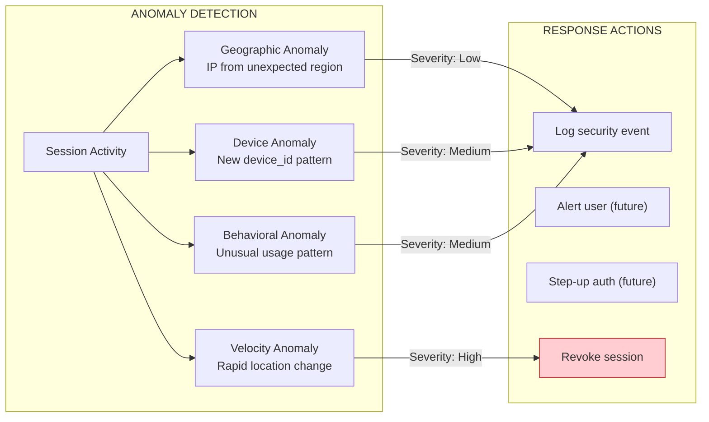

**MVP Anomaly Detection Scope:**

| Check | MVP Status | Implementation |
|-------|------------|----------------|
| Geographic anomaly | **Logged only** | IP geolocation comparison |
| Velocity anomaly | **Logged + revoke** | Impossible travel detection |
| Device anomaly | Deferred | Requires device fingerprinting |
| Behavioral anomaly | Deferred | Requires ML infrastructure |

**Impossible Travel Detection:**

```python
MAX_TRAVEL_SPEED_KPH = 1000  # Generous for air travel

async def check_impossible_travel(
    user_id: str, 
    current_ip: str, 
    previous_session: Session
) -> bool:
    current_loc = geolocate_ip(current_ip)
    previous_loc = geolocate_ip(previous_session.last_ip)
    
    distance_km = haversine_distance(current_loc, previous_loc)
    time_hours = (now() - previous_session.last_active_at).total_seconds() / 3600
    
    if time_hours > 0:
        speed_kph = distance_km / time_hours
        if speed_kph > MAX_TRAVEL_SPEED_KPH:
            await log_security_event("impossible_travel", {
                "user_id": user_id,
                "distance_km": distance_km,
                "time_hours": time_hours,
                "speed_kph": speed_kph
            })
            return True  # Anomaly detected
    
    return False
```

### 3.3 Credential Compromise Response

**Compromise Response Playbook:**

| Trigger | Automated Response | Manual Response |
|---------|-------------------|-----------------|
| User reports compromise | Revoke all sessions, require re-auth | Review account activity |
| Impossible travel detected | Revoke session, log event | Monitor for pattern |
| High-value account anomaly | Flag for review | Security team review |
| Credential dump detected | N/A (no passwords) | Monitor for phone number reuse |

**Session Revocation Cascade:**

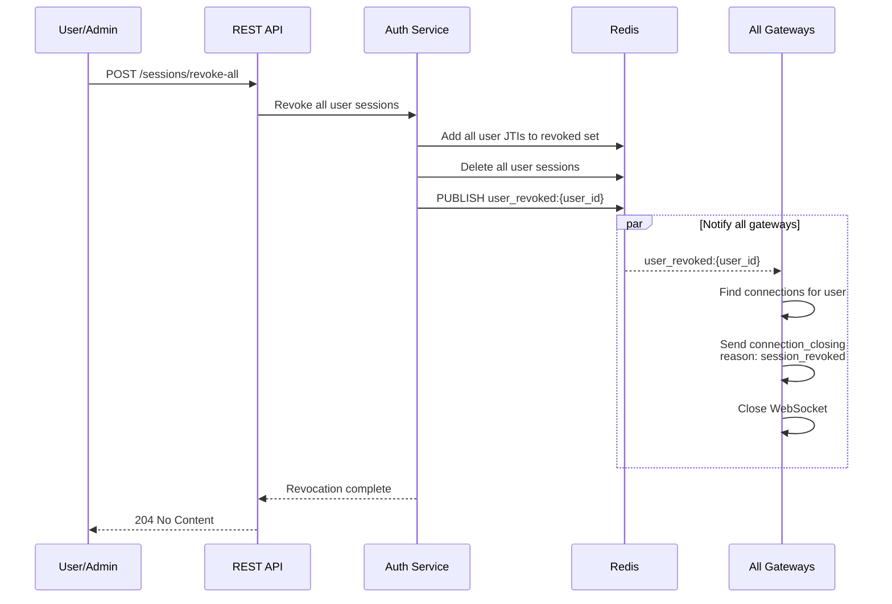

---

### 3.4 Redis Failure Mode Classification

Redis is used for multiple security-related functions with different criticality levels. This table clarifies which paths fail closed vs open:

| Redis Usage | Criticality | Failure Mode | Rationale |
|-------------|-------------|--------------|-----------|
| Token revocation list | **Security-critical** | Fail closed | Unauthorized access worse than outage |
| Session tracking | **Security-critical** | Fail closed | Session integrity required for auth |
| Connection rate limiting | Abuse control | Fail open | Bounded by auth; transient exposure |
| Message rate limiting | Abuse control | Fail open | Bounded by Durability Plane |
| Fanout budget tracking | Abuse control | Fail open | Bounded by group size limits |
| Security log aggregation | Observability | Fail open | Logs to persistent store anyway |

**Implementation Guidance:**

```python
# Security-critical Redis operations
async def check_token_revocation(jti: str) -> bool:
    try:
        return await redis.sismember("revoked_tokens", jti)
    except RedisError:
        raise ServiceUnavailableError()  # FAIL CLOSED

# Abuse-control Redis operations  
async def check_rate_limit(key: str) -> bool:
    try:
        return await redis.get(key) < LIMIT
    except RedisError:
        log.warning("Rate limit check failed, allowing request")
        return True  # FAIL OPEN
```

---

## Part 4: Message-Level Security

### 4.1 Message Rate Limiting

Building on ADR-005 §5.1 and ADR-009 backpressure contracts:

**Rate Limit Hierarchy:**

```mermaid
flowchart TB
    subgraph Limits["MESSAGE RATE LIMITS"]
        LH["LIMIT HIERARCHY<br/>(Most specific wins)"]
        
        PERCHAT["Per-Chat Limits"]
        PC1["• 10 msg/sec sustained"]
        PC2["• 20 msg burst (1 sec)"]
        PC3["• Applies to sender in chat"]
        
        PERUSER["Per-User Limits"]
        PU1["• 30 msg/sec total"]
        PU2["• 1000 msg/hour total"]
        PU3["• Across all chats"]
        
        GLOBAL["Global Limits"]
        GL1["• 100K msg/sec cluster"]
        GL2["• Backpressure at 80%"]
        
        LH --> PERCHAT
        PERCHAT --> PC1
        PERCHAT --> PC2
        PERCHAT --> PC3
        LH --> PERUSER
        PERUSER --> PU1
        PERUSER --> PU2
        PERUSER --> PU3
        LH --> GLOBAL
        GLOBAL --> GL1
        GLOBAL --> GL2
    end
```

**Rate Limit Implementation:**

| Limit | Algorithm | Storage | Enforcement Point |
|-------|-----------|---------|-------------------|
| Per-chat sustained | Token bucket | Redis | Gateway |
| Per-chat burst | Sliding window | Redis | Gateway |
| Per-user total | Token bucket | Redis | Gateway |
| Per-user hourly | Fixed window counter | Redis | Gateway |
| Global | Atomic counter | Redis | Gateway (distributed) |

**Rate Limit Schema (Redis):**

```
# Per-chat token bucket
msg_rate:chat:{chat_id}:user:{user_id}  →  HASH {
    tokens: 10,          # Current token count
    last_refill: timestamp
}
TTL: 1 minute

# Per-user hourly counter
msg_count:user:{user_id}:hour:{hour}  →  INT
TTL: 2 hours

# Global rate (approximate)
msg_rate:global:{minute}  →  INT (atomic counter)
TTL: 2 minutes
```

**Rate Limiting and Ordering Correctness:**

Rate limits intersect with ADR-004 sequence allocation. The following invariant ensures ordering guarantees are preserved:

```
INVARIANT rate_limit_precedes_sequencing:
  ∀ message M rejected by rate limiting:
    sequence_counter for M.chat_id is NOT incremented
    ∧ M is never written to messages table
    ∧ M is never published to Kafka
  -- Rate-limited messages never consume sequences or affect ordering
```

**Enforcement Semantics:**

| Scenario | Behavior | Ordering Impact |
|----------|----------|-----------------|
| Rate limit check fails | Reject at Gateway with `RATE_LIMITED` | None (no sequence allocated) |
| Rate limit check passes, then Durability fails | Return error, sequence may be allocated | Gap in sequence (per ADR-004 gap handling) |
| Rate limit Redis unavailable | **Fail open** (allow message) | None (message proceeds normally) |

> **Design Decision**: Rate limiting fails **open** (allows traffic) rather than closed. This prioritizes availability over abuse prevention during Redis outages. This is acceptable because: (1) abuse is bounded by Durability Plane controls, (2) outages are transient, (3) security logging captures anomalies for post-hoc analysis.

> **Clarification on Fail-Secure vs Fail-Open**: Rate limiting is an **availability protection** (abuse control), not an **authorization control**. The system distinguishes:
> - **Authorization/Revocation failures → Fail closed** (deny access)
> - **Rate limiting/Budget failures → Fail open** (allow traffic)
>
> This is not a contradiction—it reflects that unauthorized access is worse than temporary abuse, and abuse during outages is bounded and observable.

### 4.2 Content Security

**Input Validation (Durability Plane):**

All message content is validated before persistence:

| Validation | Rule | Action on Failure |
|------------|------|-------------------|
| Size | ≤ 4KB (ADR-005) | Reject with `MESSAGE_TOO_LARGE` |
| Encoding | Valid UTF-8 | Reject with `INVALID_ENCODING` |
| Content type | Whitelist (`text/plain` for MVP) | Reject with `INVALID_CONTENT_TYPE` |
| Control characters | Strip C0/C1 except newline, tab | Sanitize silently |
| Null bytes | Reject | Reject with `INVALID_CONTENT` |

**Content Sanitization Flow:**

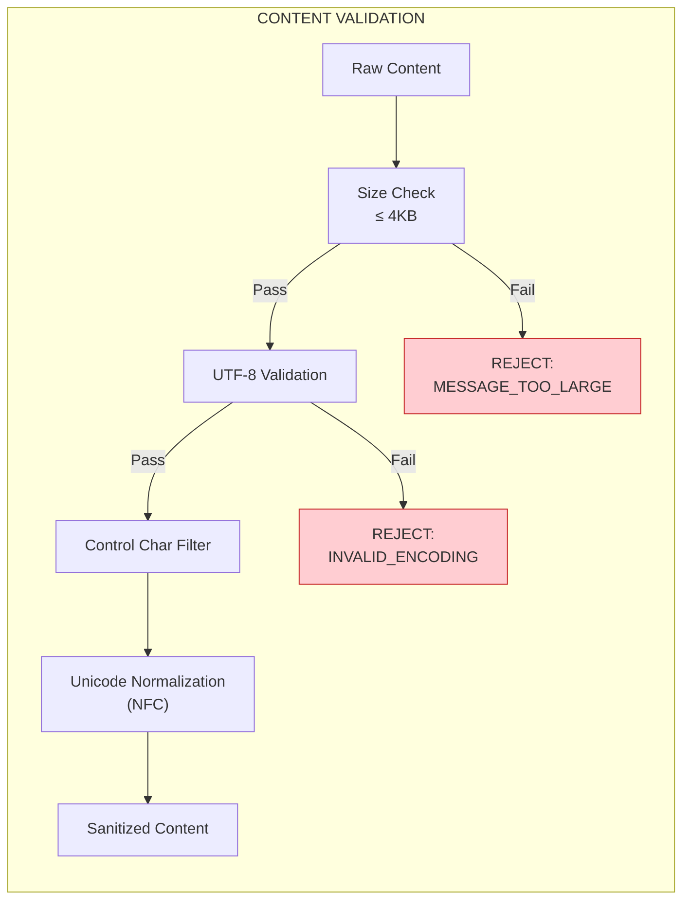

**Content-Based Abuse Detection (MVP-Lite):**

For MVP, content abuse detection is limited to obvious signals:

| Signal | Detection | Action |
|--------|-----------|--------|
| Repeated identical messages | Hash comparison, 3+ repeats in 1 minute | Rate limit reduction |
| URL spam | > 5 URLs in single message | Flag for review |
| Excessive mentions | > 10 @mentions in message | Reject |
| Character flooding | > 90% identical character | Flag for review |

> **MVP Scope Note**: Advanced content moderation (ML-based toxicity detection, image scanning, link safety) is explicitly out of scope for MVP.

### 4.3 Fanout Protection

Preventing amplification attacks through group messaging:

**Group Size Limits:**

| Limit | Value | Rationale |
|-------|-------|-----------|
| Max members per group | 1000 | Per ADR-007 hot partition limits |
| Max groups per user | 500 | Prevents group creation abuse |
| Max new groups per day | 20 | Prevents mass group creation |

**Fanout Rate Limiting:**

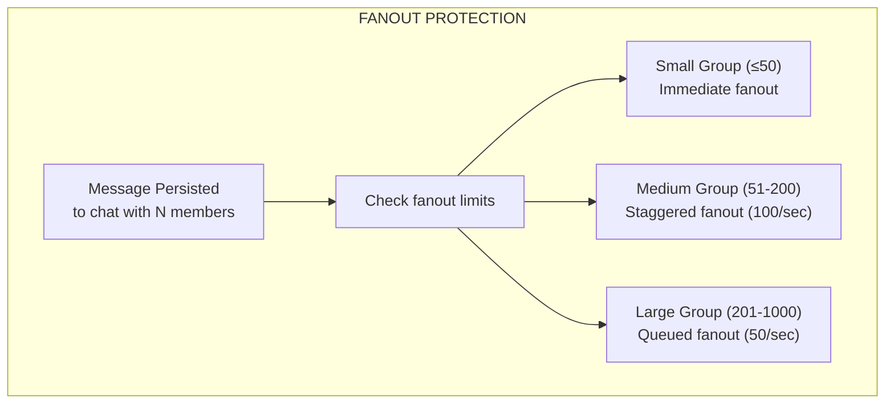

**Per-User Fanout Budget:**

To prevent a single user from triggering excessive fanout:

```
Daily fanout budget per user: 100,000 recipient deliveries

Example:
- Send to 1:1 chat: costs 1
- Send to 100-member group: costs 100
- Send 1000 messages to 100-member group: costs 100,000 (budget exhausted)
```

**Budget Tracking Schema (Redis):**

```
fanout_budget:user:{user_id}:day:{date}  →  INT (atomic counter)
TTL: 48 hours
```

---

## Part 5: Data Security

### 5.1 Access Controls

**IAM Role Separation:**

| Component | IAM Role | DynamoDB Permissions | Kafka Permissions |
|-----------|----------|---------------------|-------------------|
| Gateway | `gateway-role` | None | None |
| Durability Service | `durability-role` | Read/Write all tables | Produce to all topics |
| Fanout Workers | `fanout-role` | Read `messages`, `chat_memberships` | Consume from topics |
| Auth Service | `auth-role` | Read/Write `users`, `sessions` | None |
| Admin Service | `admin-role` | Read all tables | Read all topics |

**Principle of Least Privilege:**

```mermaid
flowchart TB
    subgraph Roles["IAM ROLE PERMISSIONS"]
        GW["Gateway Role"]
        GW1["• Redis: Read/Write"]
        GW2["• DynamoDB: None"]
        GW3["• Kafka: None"]
        
        DP["Durability Role"]
        DP1["• DynamoDB: Full"]
        DP2["• Kafka: Produce"]
        DP3["• Redis: Limited"]
        
        FP["Fanout Role"]
        FP1["• DynamoDB: Read"]
        FP2["• Kafka: Consume"]
        FP3["• Redis: Read/Write"]
        
        GW --> GW1
        GW --> GW2
        GW --> GW3
        DP --> DP1
        DP --> DP2
        DP --> DP3
        FP --> FP1
        FP --> FP2
        FP --> FP3
    end
```

### 5.2 Data Integrity Controls

**Message Integrity:**

| Layer | Integrity Control | Verification Point |
|-------|-------------------|-------------------|
| Transport | TLS 1.3 | All connections |
| Message | HMAC of (chat_id, sequence, content) | Durability → Fanout |
| Storage | DynamoDB checksums | Automatic |

**Sequence Integrity (per ADR-001, ADR-004):**

```
INVARIANT sequence_monotonic:
  ∀ messages M1, M2 in chat C:
    M1.created_at < M2.created_at → M1.sequence < M2.sequence
  -- Messages are always in creation order
```

**Integrity Verification in Fanout:**

```python
def verify_message_integrity(message: KafkaMessage) -> bool:
    """Verify message wasn't tampered between Durability and Fanout."""
    expected_hmac = compute_hmac(
        key=INTEGRITY_KEY,
        data=f"{message.chat_id}:{message.sequence}:{message.content}"
    )
    return hmac.compare_digest(expected_hmac, message.integrity_hmac)
```

**HMAC Key Trust Model:**

| Aspect | Specification |
|--------|---------------|
| Key ownership | Durability Plane generates; Fanout Plane verifies |
| Key scope | Per-environment (dev/staging/prod isolated) |
| Key storage | AWS Secrets Manager, accessed via IAM role |
| Key rotation | **Explicitly deferred** for MVP; manual rotation via deployment |
| Compromise scope | Single environment; cross-environment attack requires multiple key compromises |

> **MVP Scope Note**: Automated HMAC key rotation is deferred. Compromise of `INTEGRITY_KEY` allows message tampering within Kafka, but does not affect DynamoDB (authoritative source). Recovery requires key rotation and re-processing from DynamoDB if tampering suspected.

### 5.3 Encryption

**Encryption at Rest:**

| Store | Encryption | Key Management |
|-------|-----------|----------------|
| DynamoDB | AES-256 (AWS managed) | AWS KMS, automatic rotation |
| Kafka | AES-256 (broker-side) | AWS KMS |
| Redis | TLS for transit; no at-rest (ephemeral) | N/A |
| Backups | AES-256 | AWS KMS, separate key |

**Encryption in Transit:**

| Connection | Protocol | Certificate |
|------------|----------|-------------|
| Client → Gateway | TLS 1.3 | Public CA (Let's Encrypt) |
| Gateway → Durability | mTLS | Internal CA |
| Durability → Kafka | TLS | Internal CA |
| Fanout → Gateway | mTLS | Internal CA |
| Any → DynamoDB | TLS | AWS managed |

> **MVP Scope Note**: End-to-end encryption (E2EE) where only clients can decrypt message content is explicitly out of scope for MVP. This is a significant future enhancement requiring key exchange protocols, device key management, and forward secrecy mechanisms.

---

## Part 6: Audit & Security Logging

### 6.1 Security Event Taxonomy

```mermaid
flowchart TB
    subgraph Events["SECURITY EVENT TAXONOMY"]
        AUTH["Authentication Events"]
        AUTH1["• auth.otp_requested"]
        AUTH2["• auth.otp_verified"]
        AUTH3["• auth.otp_failed"]
        AUTH4["• auth.token_refreshed"]
        AUTH5["• auth.logout"]
        
        SESSION["Session Events"]
        SESS1["• session.created"]
        SESS2["• session.revoked"]
        SESS3["• session.expired"]
        SESS4["• session.anomaly_detected"]
        
        ACCESS["Access Events"]
        ACC1["• access.denied"]
        ACC2["• access.rate_limited"]
        ACC3["• access.membership_violation"]
        
        ABUSE["Abuse Events"]
        ABUSE1["• abuse.spam_detected"]
        ABUSE2["• abuse.flooding_detected"]
        ABUSE3["• abuse.enumeration_suspected"]
        
        AUTH --> AUTH1
        AUTH --> AUTH2
        AUTH --> AUTH3
        AUTH --> AUTH4
        AUTH --> AUTH5
        SESSION --> SESS1
        SESSION --> SESS2
        SESSION --> SESS3
        SESSION --> SESS4
        ACCESS --> ACC1
        ACCESS --> ACC2
        ACCESS --> ACC3
        ABUSE --> ABUSE1
        ABUSE --> ABUSE2
        ABUSE --> ABUSE3
    end
```

### 6.2 Security Log Schema

All security events use a consistent schema extending ADR-012 logging requirements:

```json
{
  "timestamp": "2026-01-31T10:00:00.123Z",
  "level": "SECURITY",
  "event_type": "auth.otp_failed",
  "event_id": "evt_01HQX...",
  "trace_id": "abc123...",
  "source": {
    "service": "auth-service",
    "instance": "auth-001",
    "version": "1.2.3"
  },
  "actor": {
    "type": "user",
    "user_id": "user_01HQX...",
    "ip_address": "192.0.2.1",
    "user_agent": "MessagingApp/1.0 iOS/17.0",
    "device_id": "550e8400-..."
  },
  "target": {
    "type": "phone_number",
    "phone_number_hash": "sha256:abc...",
    "resource_id": null
  },
  "action": {
    "outcome": "failure",
    "reason": "invalid_otp",
    "details": {
      "attempt_number": 3,
      "remaining_attempts": 2
    }
  },
  "context": {
    "session_id": null,
    "request_id": "req_01HQX...",
    "geo": {
      "country": "US",
      "region": "CA",
      "city": "San Francisco"
    }
  }
}
```

**Required Fields by Event Type:**

| Event Category | Required `actor` Fields | Required `target` Fields |
|----------------|------------------------|-------------------------|
| Authentication | ip_address, user_agent | phone_number_hash |
| Session | user_id, device_id | session_id |
| Access | user_id, ip_address | resource_type, resource_id |
| Abuse | user_id, ip_address | Varies by abuse type |

### 6.3 Log Retention & Protection

| Log Type | Retention | Storage | Access |
|----------|-----------|---------|--------|
| Security events | 2 years | S3 (encrypted) | Security team only |
| Authentication logs | 90 days | CloudWatch | Security + on-call |
| Access denied logs | 30 days | CloudWatch | All engineers |
| Rate limit logs | 7 days | CloudWatch | All engineers |

**Log Integrity:**

```
INVARIANT log_immutability:
  ∀ security log L written at time T:
    L.content is immutable after T
    ∧ L.deletion requires security team approval
    ∧ L.modification is prohibited
  -- Security logs cannot be altered or deleted
```

**Log Volume Protection:**

Security logging must not become a DoS vector. Attackers could deliberately trigger high volumes of security events to overwhelm the logging pipeline or inflate storage costs.

```
INVARIANT log_rate_limiting:
  Security logging is rate-limited per actor:
    - Max 100 events/minute per (user_id, event_type)
    - Max 1000 events/minute per (ip_address, event_type)
  Excess events are aggregated into summary records:
    {event_type, actor, count, first_seen, last_seen}
```

**Implementation:**

```python
async def log_security_event(event_type: str, actor: Actor, details: dict):
    rate_key = f"log_rate:{actor.identifier}:{event_type}"
    current_count = await redis.incr(rate_key)
    
    if current_count == 1:
        await redis.expire(rate_key, 60)  # 1-minute window
    
    if current_count <= SECURITY_LOG_RATE_LIMIT:
        await emit_security_log(event_type, actor, details)
    elif current_count == SECURITY_LOG_RATE_LIMIT + 1:
        # Emit aggregation start marker
        await emit_security_log("security.rate_limited", actor, {
            "event_type": event_type,
            "message": "Subsequent events will be aggregated"
        })
    # else: silently aggregate (count tracked in rate_key)
```

### 6.4 Security Metrics

Building on ADR-012 observability:

| Metric | Type | Labels | Alert Threshold |
|--------|------|--------|-----------------|
| `security_auth_failures_total` | Counter | reason | > 100/min |
| `security_rate_limits_total` | Counter | endpoint, limit_type | > 1000/min |
| `security_session_revocations_total` | Counter | reason | > 50/hour |
| `security_access_denied_total` | Counter | reason | > 100/min |
| `security_anomalies_detected_total` | Counter | anomaly_type | > 10/hour |

---

## Part 7: Operational Security

### 7.1 Security Incident Response

**Incident Severity Classification:**

| Severity | Criteria | Response Time | Examples |
|----------|----------|---------------|----------|
| SEV-1 | Active exploitation, data breach | Immediate | Credential dump, active attack |
| SEV-2 | Vulnerability with high impact | 4 hours | Auth bypass discovered |
| SEV-3 | Vulnerability with medium impact | 24 hours | Rate limit bypass |
| SEV-4 | Security improvement opportunity | Best effort | Hardening recommendation |

**Incident Response Flow:**

```mermaid
flowchart TB
    subgraph Response["INCIDENT RESPONSE"]
        DETECT["Detection<br/>• Alerts<br/>• User report<br/>• External report"]
        TRIAGE["Triage<br/>• Assess severity<br/>• Assign responder"]
        CONTAIN["Containment<br/>• Isolate affected systems<br/>• Revoke compromised creds"]
        MITIGATE["Mitigation<br/>• Deploy fix<br/>• Verify resolution"]
        RECOVER["Recovery<br/>• Restore normal ops<br/>• Monitor for recurrence"]
        REVIEW["Post-Incident<br/>• Root cause analysis<br/>• Process improvements"]
        
        DETECT --> TRIAGE
        TRIAGE --> CONTAIN
        CONTAIN --> MITIGATE
        MITIGATE --> RECOVER
        RECOVER --> REVIEW
    end
```

### 7.2 Security Configuration

**Security-Critical Configuration:**

| Configuration | Default | Changeable | Change Requires |
|--------------|---------|------------|-----------------|
| JWT signing key | Generated | Yes | Key rotation procedure |
| Rate limit values | Per §2.1, §4.1 | Yes | Security review |
| Token TTL | 60 minutes | Yes | Security review |
| Session max age | 30 days | Yes | Security review |
| OTP validity | 5 minutes | Yes | Security review |

**Configuration Change Audit:**

All security-critical configuration changes are logged:

```json
{
  "event_type": "config.security_change",
  "config_key": "auth.token_ttl_minutes",
  "old_value": 60,
  "new_value": 30,
  "changed_by": "admin_01HQX...",
  "change_reason": "Reduce token exposure window",
  "approved_by": "security_01HQX...",
  "timestamp": "2026-01-31T10:00:00Z"
}
```

### 7.3 Dependency Security

**Dependency Monitoring:**

| Dependency Type | Monitoring | Update Policy |
|-----------------|-----------|---------------|
| Runtime libraries | Dependabot, Snyk | Critical: 24h, High: 7d, Medium: 30d |
| Base images | ECR scanning | Rebuild on critical CVE |
| Infrastructure | AWS Inspector | Patch on critical findings |

---

## Trade-offs and Consequences

### Positive Consequences

1. **Layered Defense**: No single point of failure; compromise of one layer doesn't grant full access
2. **Auditable**: All security-relevant events logged for forensics
3. **Aligned with ADRs**: Security controls integrate with existing contracts
4. **Operational Feasibility**: Implementable without specialized security infrastructure
5. **Clear Threat Model**: Explicit understanding of what is and isn't protected

### Negative Consequences

1. **Latency Overhead**: Revocation checks, rate limit checks add ~5-10ms per request
   *Mitigation*: Redis-based checks are fast; cache hot paths

2. **Operational Complexity**: More configuration, more monitoring, more runbooks
   *Mitigation*: Clear documentation, automated alerts

3. **Limited Content Moderation**: No ML-based detection in MVP
   *Mitigation*: Explicit scope; manual review fallback

4. **No E2EE**: Messages readable by service operators
   *Mitigation*: Documented as future enhancement; access controls limit exposure

### Explicitly Deferred

| Feature | Status | Future ADR |
|---------|--------|------------|
| End-to-end encryption | Out of scope | ADR-XXX: E2EE Implementation |
| ML-based abuse detection | Out of scope | ADR-XXX: Content Moderation |
| Device fingerprinting | Out of scope | ADR-XXX: Device Trust |
| Fraud detection | Out of scope | ADR-XXX: Fraud Prevention |
| Bug bounty program | Out of scope | Operational procedure |

---

## Confirmation

The implementation of this ADR will be validated through:

1. **Authentication Tests**:
   - OTP rate limiting enforced at specified thresholds
   - Token validation rejects expired, revoked, and malformed tokens
   - Device binding prevents token use from different device

2. **Rate Limiting Tests**:
   - Connection rate limits enforced per §2.1
   - Message rate limits enforced per §4.1
   - Rate limit headers returned correctly

3. **Session Security Tests**:
   - Session revocation cascade works correctly
   - Impossible travel detection triggers on simulated anomalies
   - Concurrent session limits enforced

4. **Audit Logging Tests**:
   - All security events logged with required fields
   - Log integrity maintained (no modification possible)
   - Log queries return expected results

5. **Penetration Testing**:
   - External security assessment before production launch
   - Focus areas: authentication, authorization, rate limiting
   - Remediation of critical/high findings required

6. **Chaos Engineering**:
   - Redis failure doesn't grant elevated access (fail-secure)
   - Rate limit bypass doesn't enable unlimited access
   - Token service failure denies access, doesn't grant it

---

## Appendices

### Appendix A: Security Checklist

Pre-launch security verification:

```
[ ] JWT signing keys generated and stored securely
[ ] Token revocation mechanism tested
[ ] Rate limits configured and tested at all layers
[ ] Security logging enabled and retention configured
[ ] Access denied responses don't leak information
[ ] Error messages are generic (no stack traces)
[ ] TLS configured correctly (TLS 1.3, strong ciphers)
[ ] IAM roles follow least privilege
[ ] Secrets management in place (no hardcoded secrets)
[ ] Security alerts configured and tested
[ ] Incident response runbooks documented
[ ] External penetration test completed
```

### Appendix B: Related ADRs

| ADR | Security Relationship |
|-----|----------------------|
| ADR-001 | Message ordering integrity |
| ADR-002 | Plane separation enables defense-in-depth |
| ADR-003 | Source of truth hierarchy for authorization |
| ADR-004 | Sequence allocation integrity |
| ADR-005 | WebSocket authentication, rate limiting |
| ADR-006 | REST API authentication, device binding, rate limiting |
| ADR-007 | Data model for sessions, access patterns |
| ADR-008 | Delivery semantics (no security impact) |
| ADR-009 | Failure handling, backpressure |
| ADR-010 | Presence privacy considerations |
| ADR-011 | Kafka security (topic ACLs) |
| ADR-012 | Security metrics and alerting |

### Appendix C: Invariants (Machine-Checkable)

These invariants are **binding** and govern the security implementation. Violations are bugs, not trade-offs.

```
# ═══════════════════════════════════════════════════════════════════
# AUTHORITY INVARIANTS (from Decision Outcome)
# ═══════════════════════════════════════════════════════════════════

INVARIANT security_authority:
  - Gateway MAY authenticate but MUST NOT authorize
  - Durability Plane is the SOLE authority for write authorization
  - Fanout Plane MAY enforce delivery policy but MUST NOT mutate state
  - Redis failures in security-critical paths MUST fail closed (deny access)
  -- Preserves single-write-authority and prevents authorization drift

# ═══════════════════════════════════════════════════════════════════
# FAIL-SECURE INVARIANTS
# ═══════════════════════════════════════════════════════════════════

INVARIANT fail_secure:
  ∀ security check C that fails due to infrastructure error:
    C.result = DENY
  -- Infrastructure failures deny access, never grant it

INVARIANT revocation_fail_secure:
  If revocation store (Redis) is unavailable:
    token validation MUST fail closed (deny access)
    ∧ error response = SERVICE_UNAVAILABLE
  -- Token revocation check failure denies access

# ═══════════════════════════════════════════════════════════════════
# TOKEN & SESSION INVARIANTS
# ═══════════════════════════════════════════════════════════════════

INVARIANT token_revocation_effective:
  ∀ token T revoked at time R:
    ∀ request REQ using T at time R' where R' > R:
      REQ.result = UNAUTHORIZED
  -- Revoked tokens are immediately rejected

INVARIANT session_device_binding:
  ∀ session S created with device D:
    ∀ refresh request REQ for S with device D':
      D ≠ D' → REQ.result = DEVICE_MISMATCH
  -- Sessions cannot be used from different devices

# ═══════════════════════════════════════════════════════════════════
# RATE LIMITING & ORDERING INVARIANTS
# ═══════════════════════════════════════════════════════════════════

INVARIANT rate_limit_enforcement:
  ∀ request REQ from actor A at time T:
    rate(A, window) > limit(A, operation) → REQ.result = RATE_LIMITED
  -- Rate limits are always enforced

INVARIANT rate_limit_precedes_sequencing:
  ∀ message M rejected by rate limiting:
    sequence_counter for M.chat_id is NOT incremented
    ∧ M is never written to messages table
    ∧ M is never published to Kafka
  -- Rate-limited messages never consume sequences or affect ordering

# ═══════════════════════════════════════════════════════════════════
# AUTHORIZATION INVARIANTS
# ═══════════════════════════════════════════════════════════════════

INVARIANT authorization_at_durability:
  ∀ write operation W to chat C by user U:
    ¬member(U, C) → W.result = FORBIDDEN
  -- Authorization is enforced at Durability Plane (not Gateway)

INVARIANT no_information_leakage:
  ∀ access denied response R:
    R.error_message ∈ GENERIC_ERROR_MESSAGES
    ∧ R.details ∩ SENSITIVE_DATA = ∅
  -- Error responses don't leak sensitive information

# ═══════════════════════════════════════════════════════════════════
# AUDIT & LOGGING INVARIANTS
# ═══════════════════════════════════════════════════════════════════

INVARIANT security_event_logged:
  ∀ security-relevant operation OP:
    ∃ log entry L: L.event_type ∈ SECURITY_EVENTS
      ∧ L.timestamp ≈ OP.timestamp
      ∧ L.actor = OP.actor
  -- All security operations are logged

INVARIANT audit_immutability:
  ∀ security log L:
    L.created_at = T → L.content is immutable for all T' > T
  -- Security logs cannot be modified after creation

INVARIANT log_rate_limiting:
  Security logging is rate-limited per actor:
    - Max 100 events/minute per (user_id, event_type)
    - Max 1000 events/minute per (ip_address, event_type)
  Excess events are aggregated into summary records
  -- Prevents log-based DoS attacks
```

### Appendix D: Security Metrics Dashboard

```yaml
# Grafana dashboard specification
dashboard:
  title: "Security Overview"
  refresh: "30s"
  
  rows:
    - title: "Authentication"
      panels:
        - type: graph
          title: "Auth Failures by Reason"
          query: "sum(rate(security_auth_failures_total[5m])) by (reason)"
          
        - type: stat
          title: "OTP Success Rate"
          query: |
            sum(rate(security_auth_otp_verified_total[1h])) /
            sum(rate(security_auth_otp_attempts_total[1h]))
    
    - title: "Rate Limiting"
      panels:
        - type: graph
          title: "Rate Limit Hits"
          query: "sum(rate(security_rate_limits_total[5m])) by (endpoint)"
          
        - type: heatmap
          title: "Rate Limits by Hour"
          query: "sum(increase(security_rate_limits_total[1h])) by (hour)"
    
    - title: "Sessions"
      panels:
        - type: graph
          title: "Session Revocations"
          query: "sum(rate(security_session_revocations_total[5m])) by (reason)"
          
        - type: stat
          title: "Active Sessions"
          query: "sum(sessions_active)"
    
    - title: "Anomalies"
      panels:
        - type: graph
          title: "Anomalies Detected"
          query: "sum(rate(security_anomalies_detected_total[5m])) by (type)"
          
        - type: table
          title: "Recent Security Events"
          query: "topk(20, security_events_total)"
```

### Appendix E: Rate Limit Quick Reference

| Resource | Limit | Window | Key | Enforcement |
|----------|-------|--------|-----|-------------|
| Connections per IP | 10 | 1 sec | IP | Load Balancer |
| Connections per IP | 100 | 1 min | IP | Gateway |
| Concurrent connections per user | 5 | - | user_id | Gateway |
| New connections per user | 10 | 1 min | user_id | Gateway |
| OTP requests per phone | 3 | 15 min | phone_hash | Auth Service |
| OTP verifications per phone | 5 | 5 min | phone_hash | Auth Service |
| Messages per chat per user | 10/sec | Sustained | (chat_id, user_id) | Gateway |
| Messages per chat per user | 20 | 1 sec burst | (chat_id, user_id) | Gateway |
| Messages per user total | 30/sec | Sustained | user_id | Gateway |
| Messages per user total | 1000 | 1 hour | user_id | Gateway |
| User lookups | 10 | 1 min | user_id | REST API |
| User lookups | 100 | 1 hour | user_id | REST API |
| Fanout budget per user | 100,000 | 1 day | user_id | Durability |
