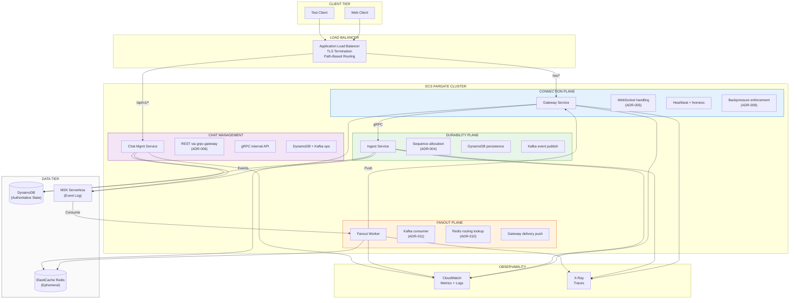
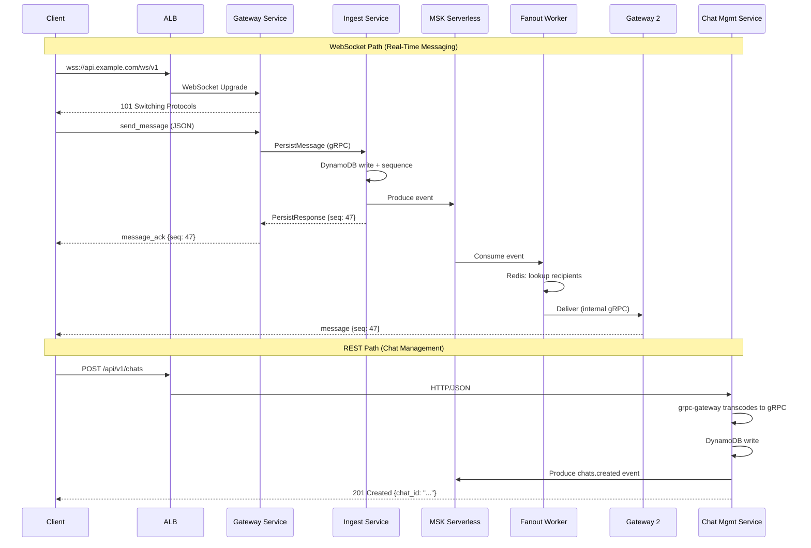
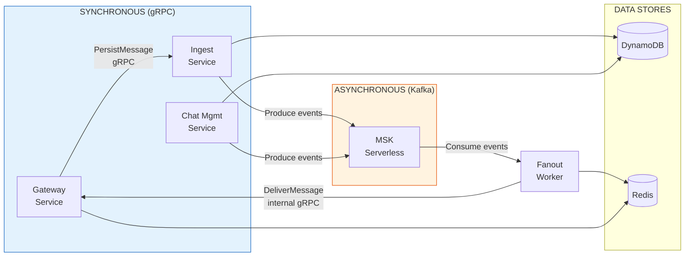
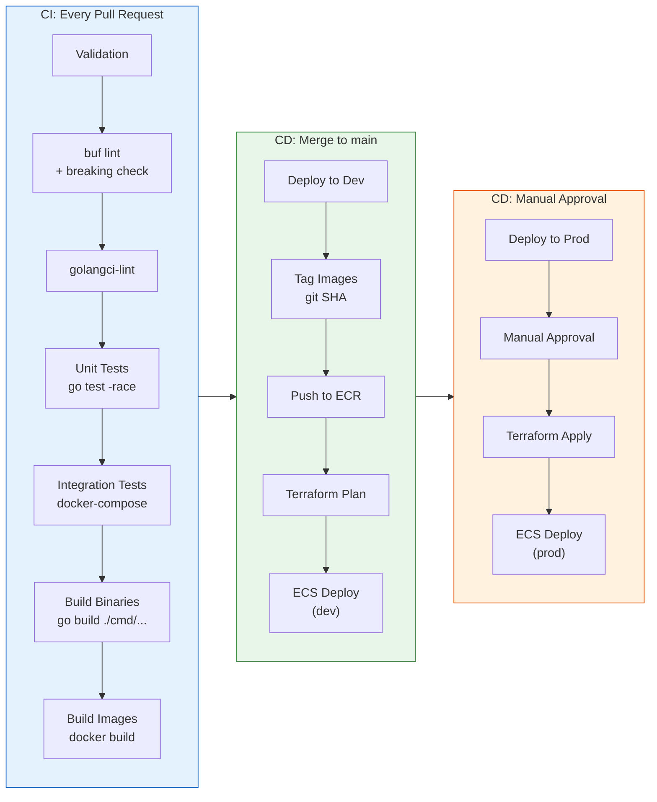

# ADR-014: Technology Stack, Service Architecture & Deployment Topology

- **Status**: Accepted
- **Date**: 2026-01-31

---

## Context and Problem Statement

ADR-001 through ADR-013 established the foundational architecture: per-chat ordering with server-assigned sequences (ADR-001), three-plane separation (ADR-002), DynamoDB as authoritative source with Kafka as durable event log (ADR-003), atomic counter-based sequence allocation (ADR-004), WebSocket protocol (ADR-005), REST API contracts (ADR-006), data model specifications (ADR-007), delivery acknowledgement semantics (ADR-008), failure handling contracts (ADR-009), presence/connection routing (ADR-010), Kafka topic design (ADR-011), observability/SLOs (ADR-012), and security/abuse controls (ADR-013).

These ADRs define *what* the system does — its invariants, contracts, failure modes, and behavioral guarantees. None specifies *how* it is built, packaged, deployed, or run. Without explicit technology and infrastructure decisions:

- **Language divergence**: Developers independently choose languages, creating incompatible partitioning implementations (the exact problem ADR-011 §2.2 warns about).
- **Dependency fragmentation**: Ad-hoc library choices may conflict with architectural contracts (e.g., a Kafka client that doesn't support IAM authentication, or a WebSocket library without context-aware cancellation).
- **Service boundary confusion**: The three-plane architecture (ADR-002) does not directly map to deployable units. Which binary handles what?
- **Infrastructure drift**: Without codified infrastructure-as-code, environments diverge, and ADR-011 topic configurations or ADR-007 DynamoDB schemas are manually provisioned with errors.
- **Local development friction**: Without a standardized local stack, developers cannot validate cross-plane interactions or test failure scenarios (ADR-009).

**Core Questions:**

- What **programming language** implements all services, and why?
- What **compute platform** runs the services, and how does it map to the three-plane architecture?
- How are **REST endpoints** (ADR-006) exposed alongside **gRPC** internal communication?
- What **Kafka infrastructure** satisfies ADR-011's topic configuration and producer requirements?
- What **observability backend** implements ADR-012's contracts?
- What **repository structure** maps to service boundaries, proto contracts, and infrastructure?
- What **CI/CD pipeline** enforces schema compatibility, proto breaking change detection, and immutable deployment artifacts?
- What **local development stack** enables full-system testing including failure injection?

---

## Decision Drivers

1. **Contract Fulfillment**: Every technology choice must demonstrably satisfy the architectural contracts in ADR-001 through ADR-013. Choices that introduce incompatibilities or require workarounds are disqualified.

2. **Operational Simplicity**: The MVP is a distributed systems lab, not a platform team exercise. Infrastructure management overhead must be minimized to preserve time for correctness-focused implementation.

3. **Single-Binary Deployment**: Services should compile to self-contained binaries with minimal runtime dependencies. This simplifies container images, reduces attack surface (ADR-013 §3.2), and eliminates dependency resolution at deploy time.

4. **Proto-First API Design**: The gRPC service definitions are the source of truth for inter-service communication. REST exposure, documentation, and client generation all derive from proto files — no duplicate API definitions.

5. **AWS-Native Integration**: The system already depends on DynamoDB (ADR-003/007), Kafka (ADR-011), and Redis (ADR-010). Technology choices should minimize cross-cloud friction and leverage native IAM, networking, and service discovery.

6. **Reproducible Environments**: Development, CI, and production environments must use identical configurations where possible. "Works on my machine" is not acceptable for a distributed systems lab.

7. **Escape Hatches**: Choices should avoid deep vendor lock-in where alternatives exist. ADR-012's OpenTelemetry abstraction is the model: define contracts against open standards, implement with pragmatic vendor choices.

---

## Considered Options

### Language

#### Option A: Go 1.22+

**Mechanism**: Statically compiled, garbage-collected language with goroutine-based concurrency. Single binary output per service.

#### Option B: Rust

**Mechanism**: Systems language with zero-cost abstractions, ownership-based memory safety, no GC. Produces highly optimized binaries.

#### Option C: Java / Kotlin (JVM)

**Mechanism**: JVM-based with extensive ecosystem. Mature gRPC and Kafka libraries. Requires JVM runtime in container images.

#### Option D: Node.js / TypeScript

**Mechanism**: Event-loop concurrency model. Large ecosystem, rapid prototyping. Single-threaded by default.

**Decision: Option A — Go 1.22+**

Go provides the optimal balance for this project's constraints. Its goroutine model directly maps to WebSocket connection handling (ADR-005 targets 10K+ concurrent connections per gateway) without thread-pool tuning. Single-binary compilation produces minimal container images (scratch-based, no runtime dependencies) aligned with Decision Driver #3. First-class gRPC support via `google.golang.org/grpc` and a mature `grpc-gateway` ecosystem satisfy Decision Driver #4. The `franz-go` Kafka client provides native AWS MSK IAM authentication — critical for the chosen Kafka infrastructure. Fast compilation enables tight CI feedback loops.

Rust was seriously considered for its performance characteristics but rejected due to slower iteration speed. The ownership model, while excellent for correctness, significantly increases development time for the rapid prototyping cycles a distributed systems lab requires. Java/Kotlin carries JVM overhead (200MB+ base container image, cold start latency) that conflicts with the ECS Fargate per-second billing model. Node.js's single-threaded event loop creates GC pressure under sustained WebSocket load and lacks native gRPC performance comparable to Go.

### Compute Platform

#### Option A: ECS Fargate

**Mechanism**: Serverless container orchestration. Define task definitions per service; Fargate provisions and manages the underlying compute. Native ALB integration for load balancing and WebSocket support.

#### Option B: EKS (Kubernetes)

**Mechanism**: Managed Kubernetes control plane. Full K8s API for scheduling, service mesh, and custom controllers.

#### Option C: AWS Lambda

**Mechanism**: Function-as-a-service. Event-driven, pay-per-invocation. No persistent processes.

#### Option D: EC2 Directly

**Mechanism**: Virtual machines with full OS control. Manual capacity management, patching, and scaling.

**Decision: Option A — ECS Fargate**

ECS Fargate eliminates cluster management while providing the granularity needed for the three-plane architecture. Each service (Gateway, Ingest, Fanout, Chat Management) becomes an independent ECS service with its own task definition, scaling policy, and resource allocation — directly mapping to ADR-002's independent scaling requirement. Fargate's native ALB integration supports WebSocket upgrades (required by ADR-005) without additional proxy layers. The $0/month control plane cost (vs. EKS's ~$75/month) is meaningful for a lab project.

EKS was the strongest alternative and provides a future migration path. However, its operational overhead (control plane management, node group configuration, RBAC policies, ingress controller selection) is undifferentiated work that does not advance the distributed systems learning objectives. Lambda is fundamentally incompatible with WebSocket connections — ADR-005's persistent connection model requires long-running processes. EC2 requires manual capacity management, OS patching, and scaling automation that Fargate handles natively.

### REST API Exposure Strategy

#### Option A: grpc-gateway (In-Process Reverse Proxy)

**Mechanism**: A `protoc` plugin that generates a Go reverse-proxy server from `google.api.http` annotations in proto files. The generated proxy translates RESTful HTTP/JSON requests into gRPC calls within the same process — zero network hop. Produces an OpenAPI specification from the same proto source.

#### Option B: AWS API Gateway → gRPC Backend

**Mechanism**: AWS API Gateway handles REST ingress, transforms requests, and forwards to backend gRPC services. Managed TLS, throttling, and API key management.

#### Option C: Separate Hand-Written REST Service

**Mechanism**: A standalone REST service (using chi or echo) that translates HTTP requests to gRPC calls to backend services. Manually maintained route definitions and request/response mapping.

#### Option D: Envoy gRPC-JSON Transcoder (Sidecar)

**Mechanism**: Envoy proxy deployed as a sidecar, configured with proto descriptors to transcode HTTP/JSON to gRPC automatically. Language-agnostic, configuration-driven.

**Decision: Option A — grpc-gateway**

grpc-gateway provides a single source of truth for API definitions: proto files annotated with `google.api.http` options generate both the gRPC server stubs and the REST reverse proxy. This directly satisfies Decision Driver #4 and eliminates the duplicate-definition problem that Option C introduces. The generated proxy runs in-process with zero network hop, avoiding the latency and failure-mode complexity of a sidecar (Option D) or external API Gateway (Option B).

grpc-gateway is battle-tested at scale — it powers the REST APIs of etcd, Istio, and numerous production systems handling millions of requests per day since 2018. The OpenAPI specification it generates from proto annotations enables automatic documentation and client generation for ADR-006's REST endpoints.

AWS API Gateway was rejected for three reasons: it has no native REST-to-gRPC transcoding (requiring a Lambda shim), it charges per-request (cost scaling with traffic), and its WebSocket API has a 29-minute idle timeout and 500K concurrent connection limit — both conflicting with ADR-005's WebSocket lifecycle requirements. By handling REST via grpc-gateway and WebSockets via the Gateway Service directly, we avoid API Gateway entirely.

**Architectural Implication**: The Gateway Service handles WebSocket connections exclusively (ADR-005 protocol). A separate Chat Management Service handles REST + gRPC via grpc-gateway. The ALB routes by path prefix. No AWS API Gateway exists in the architecture.

### Kafka Infrastructure

#### Option A: MSK Serverless

**Mechanism**: Fully managed Kafka with automatic scaling, IAM-based authentication, and pay-per-use pricing. No broker provisioning or capacity planning.

#### Option B: MSK Provisioned

**Mechanism**: Managed Kafka with explicit broker instance types, storage volumes, and networking configuration. Full control over broker-level settings.

#### Option C: Self-Managed Kafka on EC2

**Mechanism**: Kafka deployed on EC2 instances with manual ZooKeeper/KRaft management, storage provisioning, and operational procedures.

**Decision: Option A — MSK Serverless**

MSK Serverless eliminates broker management entirely — no instance sizing, no storage provisioning, no patching. For a distributed systems lab focused on application-level correctness rather than Kafka operations, this trade-off is correct. Every ADR-011 requirement is satisfiable, as demonstrated in the compatibility analysis in Part 2.

MSK Provisioned provides full control but requires capacity planning and broker lifecycle management — operational work orthogonal to the project's learning objectives. Self-managed Kafka maximizes control at the cost of managing ZooKeeper/KRaft, storage, replication, and upgrades. Both alternatives are viable for production workloads where Kafka operational expertise is a team capability; for this project, they add undifferentiated overhead.

### Inter-Service Communication

#### Option A: gRPC with buf Tooling

**Mechanism**: Protocol Buffers define service contracts. `buf` CLI handles linting, breaking change detection, and code generation. Synchronous calls use gRPC; asynchronous events use Kafka (established in ADR-003/011).

#### Option B: REST Everywhere

**Mechanism**: HTTP/JSON for all inter-service communication. OpenAPI specs define contracts. No binary protocol.

#### Option C: gRPC with Raw protoc

**Mechanism**: gRPC with direct `protoc` invocation for code generation. Manual dependency management for proto plugins.

**Decision: Option A — gRPC with buf Tooling**

gRPC provides type-safe, schema-driven inter-service communication with built-in streaming support. The `buf` CLI replaces raw `protoc` with a modern developer experience: deterministic dependency resolution, configurable linting rules (ensuring consistent proto style), and CI-integrated breaking change detection. Breaking change detection is critical — a proto field renumbering could silently corrupt ADR-011's Kafka event schemas.

REST everywhere (Option B) loses the type safety and performance benefits of binary serialization. For the Gateway → Ingest Service path (the hot path per ADR-002), gRPC's binary framing and HTTP/2 multiplexing provide measurable latency reduction over JSON-over-HTTP/1.1. Raw `protoc` (Option C) works but lacks `buf`'s breaking change detection and lint enforcement — exactly the kind of guardrail a correctness-focused project needs.

### Observability Backend

#### Option A: OpenTelemetry SDK → CloudWatch / X-Ray

**Mechanism**: Application code instruments with the OpenTelemetry Go SDK. Metrics export to CloudWatch Metrics, traces export to X-Ray, logs export to CloudWatch Logs. AWS-native integration with no additional infrastructure.

#### Option B: Grafana Cloud (from Day One)

**Mechanism**: Metrics to Grafana Cloud Prometheus, traces to Grafana Tempo, logs to Grafana Loki. Superior query and visualization UX. SaaS pricing.

#### Option C: Datadog

**Mechanism**: Datadog agent collects metrics, traces, and logs. Full-featured APM with proprietary protocol. Per-host pricing.

#### Option D: Self-Hosted Prometheus + Grafana + Jaeger

**Mechanism**: Deploy and manage Prometheus, Grafana, and Jaeger on ECS or EC2. Full control, no SaaS cost.

**Decision: Option A — OpenTelemetry SDK → CloudWatch / X-Ray**

ADR-012 explicitly designed the observability architecture to be backend-agnostic via OpenTelemetry abstractions. CloudWatch/X-Ray is the path of least resistance for MVP: zero additional infrastructure, native ECS integration, and included in the AWS spend already required for DynamoDB, MSK, and ElastiCache. The OTel SDK abstraction means swapping to Grafana Cloud (Option B) requires only exporter configuration changes — no application code modifications.

Grafana Cloud provides a superior query and visualization experience (PromQL + LogQL vs. CloudWatch Insights) and is the likely future migration target. However, adding it at MVP introduces additional SaaS cost and operational setup (API keys, data source configuration, alerting rules migration) that does not advance correctness validation. Datadog (Option C) introduces significant vendor lock-in and per-host pricing that scales poorly. Self-hosted observability (Option D) creates an entire operational domain orthogonal to the project's goals.

### Repository Structure

#### Option A: Go Monorepo (Single Module)

**Mechanism**: Single `go.mod` at the root. All services share dependencies and are built from the same module. `cmd/` directories produce independent binaries.

#### Option B: Multi-Module Monorepo

**Mechanism**: Separate `go.mod` per service within a single repository. Independent dependency trees.

#### Option C: Polyrepo

**Mechanism**: Separate Git repository per service. Independent CI/CD pipelines, versioned proto packages.

**Decision: Option A — Go Monorepo (Single Module)**

A single Go module with multiple `cmd/` entrypoints provides the right balance for a 4-service system. Shared packages (`internal/domain`, `internal/dynamo`, `internal/kafka`) are imported directly without versioning overhead. A single `go.mod` eliminates diamond dependency conflicts. Proto definitions live alongside the services that use them, enabling atomic changes that span contract and implementation. CI builds all services in a single pipeline, detecting integration issues early.

Multi-module monorepo (Option B) adds module versioning overhead without benefit — the services are always deployed together at MVP scale. Polyrepo (Option C) introduces cross-repo dependency management, proto package versioning, and coordination overhead that is justified only at team scales where independent deployment cadences are required. With a single developer or small team, polyrepo creates friction without value.

---

## Decision Outcome

| Decision Point | Chosen Option | Key Rationale |
|----------------|---------------|---------------|
| Language | Go 1.22+ | Goroutine concurrency, single-binary, first-class gRPC |
| Compute | ECS Fargate | No cluster management, per-service task definitions, native ALB |
| REST Exposure | grpc-gateway (in-process) | Proto-first, zero network hop, battle-tested |
| Kafka | MSK Serverless | Zero broker management, full ADR-011 compatibility |
| Inter-Service Comms | gRPC + buf | Type-safe, breaking change detection in CI |
| Observability Backend | CloudWatch / X-Ray via OTel | Path of least resistance, ADR-012 OTel abstraction enables future swap |
| Service Discovery | ECS Service Connect (Cloud Map-backed) | gRPC-aware LB, native ECS integration, no mesh overhead |
| Secrets Management | Secrets Manager + SSM Parameter Store | Sensitive vs. non-sensitive separation |
| Repository | Go monorepo (single module) | Atomic changes, shared packages, single CI |
| CI/CD | GitHub Actions | PR validation, immutable artifacts, manual prod approval |

---

## Part 1: Deployment Architecture

### 1.1 Service Topology

The three-plane architecture (ADR-002) maps to four deployable services:



### 1.2 ALB Routing Rules

| Rule Priority | Condition | Target Group | Protocol | Notes |
|---------------|-----------|--------------|----------|-------|
| 1 | Path: `/ws/*`, Header: `Upgrade: websocket` | Gateway Service | WebSocket | No sticky sessions (see below) |
| 2 | Path: `/api/v1/*` | Chat Mgmt Service | HTTP/1.1 | grpc-gateway REST endpoints |
| 3 | Path: `/health` | All services | HTTP/1.1 | Health check (per-service target groups) |
| Default | All other paths | 404 fixed response | — | Reject unknown paths |

**Why no sticky sessions for WebSocket**: Once the ALB upgrades a connection to WebSocket, the TCP connection is pinned to the specific Gateway task for its lifetime — ALB does not re-route mid-connection. No session cookie is needed. If the Gateway task fails, the connection is lost and the client reconnects (ADR-009 §Reconnection as Backpressure Mechanism). The reconnecting client may land on any healthy Gateway task because all connection state (routing, presence) lives in Redis (ADR-010), not in local Gateway memory. The only local state is the per-connection outbound buffer (ADR-009 §1.2), which is rebuilt from Kafka/DynamoDB via sync-on-reconnect. This stateless Gateway design is a direct consequence of ADR-002's axiom: "Gateways hold connections, not state."

**TLS Termination**: ALB terminates TLS using ACM certificates. Internal service-to-service communication uses plaintext gRPC within the VPC — acceptable for MVP per ADR-013 §3.2 (internal network trust boundary). Mutual TLS for internal communication is an explicitly deferred enhancement.

### 1.3 Request Flow



### 1.4 Service-to-Plane Mapping

| Service | Plane (ADR-002) | Binary | Scaling Dimension | ECS Service Type |
|---------|-----------------|--------|-------------------|-----------------|
| Gateway Service | Connection Plane | `cmd/gateway` | Concurrent connections | Service (long-running) |
| Ingest Service | Durability Plane | `cmd/ingest` | Write throughput (msg/sec) | Service (long-running) |
| Fanout Worker | Fanout Plane | `cmd/fanout` | Kafka partition count | Service (long-running) |
| Chat Mgmt Service | — (cross-cutting) | `cmd/chatmgmt` | REST request rate | Service (long-running) |

The Chat Management Service does not map to a single plane — it handles chat creation, membership management, and message history reads that span the Durability and Connection concerns. It is a separate service because its scaling dimension (REST request rate) is independent of WebSocket connection count or Kafka throughput.

---

## Part 2: MSK Serverless Compatibility Analysis

This section demonstrates that MSK Serverless satisfies every Kafka requirement established in ADR-011.

### 2.1 Topic-Level Configuration Compatibility

| ADR-011 Requirement | MSK Serverless Support | Status |
|---------------------|----------------------|--------|
| `retention.ms` = 604800000 (7 days) | Configurable at topic creation; default is 7 days | ✅ Supported |
| `retention.bytes` = 100GB/partition | Configurable at topic creation; max 250GB/partition | ✅ Supported |
| `cleanup.policy` = delete | Set at topic creation time only (not alterable after creation) | ✅ Supported |
| `compression.type` = producer | Configurable at topic level | ✅ Supported |
| `max.message.bytes` | Configurable; max 8MB (ADR-005 caps messages at 64KB) | ✅ Supported |
| `message.timestamp.type` = CreateTime | Configurable at topic level | ✅ Supported |
| Replication factor = 3 | Automatic (2 additional replicas = 3 total); not configurable but matches target | ✅ Supported |
| `min.insync.replicas` = 2 | Fixed default; not configurable but matches target | ✅ Supported |
| `unclean.leader.election.enable` = false | Fixed default; cannot be enabled | ✅ Supported |
| `auto.create.topics.enable` = false | Enforced; broker-level config changes not permitted | ✅ Supported |
| `acks=all` (producer config) | Client-side configuration; works normally | ✅ Supported |
| `enable.idempotence` = true (producer) | Client-side configuration; works normally | ✅ Supported |
| Total partitions: 64+16+16+8 = 104 | Max 2,400 leader partitions per cluster | ✅ Supported |

**Verdict**: 13/13 requirements satisfied. No gaps.

### 2.2 Broker-Level Configuration Alignment

ADR-011 §1.3 specifies four broker-level settings. MSK Serverless does not permit broker-level configuration changes. However, all four settings match MSK Serverless's fixed defaults:

| ADR-011 Broker Config | Required Value | MSK Serverless Default | Match? |
|----------------------|----------------|----------------------|--------|
| `default.replication.factor` | 3 | 3 (fixed) | ✅ |
| `min.insync.replicas` | 2 | 2 (fixed) | ✅ |
| `unclean.leader.election.enable` | false | false (fixed) | ✅ |
| `auto.create.topics.enable` | false | false (enforced) | ✅ |

### 2.3 Producer Configuration Compatibility

ADR-011 §3.1 specifies mandatory producer settings. All are client-side configurations that operate identically regardless of MSK variant:

| Producer Config | ADR-011 Value | MSK Serverless | Notes |
|----------------|---------------|----------------|-------|
| `acks` | `all` | Client-side | `franz-go` default: `all` |
| `retries` | 3 | Client-side | Configured in franz-go producer |
| `enable.idempotence` | true | Client-side | `franz-go` supports idempotent producer |
| `compression.type` | lz4 | Client-side | `franz-go` LZ4 codec available |
| `linger.ms` | 5 | Client-side | `franz-go` batching config |
| `batch.size` | 65536 | Client-side | `franz-go` `MaxRecordBatchBytes` |

### 2.4 MSK Serverless Limitations and Assumptions

The following limitations are accepted trade-offs. Throughput and storage caps are based on AWS documentation at the time of this ADR — they may change. These values are captured as **assumptions to validate** during initial infrastructure provisioning; if any cap proves different from documented values, revisit the capacity analysis.

| Limitation | Documented Value (Validate) | Impact | Mitigation |
|------------|----------------------------|--------|------------|
| IAM-only authentication | Enforced | Requires `aws-msk-iam-auth` SASL mechanism; no SCRAM or mTLS | `franz-go` has native `aws-msk-iam-auth` support via `kgo.WithDialer` + AWS SDK |
| No broker-level config changes | Enforced | Cannot customize settings beyond topic-level | All ADR-011 critical configs are topic-level or client-side (verified in §2.1–2.3) |
| `cleanup.policy` immutable after creation | Enforced | Cannot change from `delete` to `compact` | All four topics use `delete` policy permanently; no compacted topics needed |
| `segment.bytes` not configurable | Enforced | Cannot tune log segment size | Default segment size is acceptable; no micro-optimization needed for MVP |
| Per-partition write throughput cap | ~5 MBps (validate) | At 1KB avg message + 1000 msg/sec ≈ 1 MBps; headroom appears sufficient | Monitor `kafka_partition_throughput_bytes`; migrate to MSK Provisioned if cap tightens |
| Per-partition read throughput cap | ~10 MBps (validate) | Multiple consumer groups share this cap | Monitor consumer lag; scale partitions if contention appears |
| Max per-partition storage | ~250GB (validate) | ADR-011 retention is 100GB/partition | Headroom appears sufficient |

> **Validation checkpoint**: During Terraform provisioning of the MSK Serverless cluster, create a test topic and run a throughput benchmark (`franz-go` producer at sustained 4 MBps) to confirm the per-partition write cap. Document the actual observed limit in an operational runbook.

### 2.5 Authentication Configuration

MSK Serverless requires IAM-based SASL authentication. The `franz-go` client supports this natively:

```yaml
# MSK Serverless connection config (application config, not broker config)
kafka:
  brokers:
    - "boot-xxxxxx.c1.kafka-serverless.us-east-1.amazonaws.com:9098"
  sasl:
    mechanism: "AWS_MSK_IAM"
    # Credentials resolved via ECS task role — no static secrets
  tls:
    enabled: true  # Required for MSK Serverless
```

The ECS task role for each service includes an IAM policy granting `kafka-cluster:*` permissions scoped to the specific MSK cluster ARN. No Kafka credentials are stored in Secrets Manager — IAM handles authentication end-to-end.

---

## Part 3: Repository Structure

### 3.1 Directory Layout

```
/
├── cmd/                        # Service entrypoints (one binary per dir)
│   ├── gateway/                # WebSocket Gateway Service (Connection Plane)
│   │   └── main.go
│   ├── ingest/                 # Ingest Service (Durability Plane)
│   │   └── main.go
│   ├── fanout/                 # Fanout Worker (Fanout Plane)
│   │   └── main.go
│   └── chatmgmt/              # Chat Management Service (REST + gRPC)
│       └── main.go
├── internal/                   # Private packages (not importable outside module)
│   ├── gateway/                # Gateway-specific: WS handler, backpressure, conn mgr
│   ├── ingest/                 # Ingest-specific: persist flow, sequence allocation
│   ├── fanout/                 # Fanout-specific: consumer loop, delivery dispatch
│   ├── chatmgmt/              # Chat mgmt-specific: CRUD handlers, membership
│   ├── domain/                 # Shared domain types, error definitions, constants
│   ├── dynamo/                 # DynamoDB client wrapper (ADR-007 table operations)
│   ├── kafka/                  # Kafka producer/consumer wrappers (franz-go)
│   ├── redis/                  # Redis client wrapper (ADR-010 presence operations)
│   ├── auth/                   # JWT validation, token parsing (ADR-013)
│   └── observability/          # OTel setup, trace propagation, metric middleware
├── pkg/                        # Public packages (importable by external tools)
│   └── protocol/               # WebSocket protocol types (ADR-005 message schemas)
├── proto/                      # Protobuf definitions (the contract boundary)
│   ├── buf.yaml                # buf module configuration
│   ├── buf.gen.yaml            # Code generation targets
│   └── messaging/v1/           # Versioned service definitions
│       ├── ingest.proto        # IngestService: PersistMessage, AllocateSequence
│       ├── chatmgmt.proto      # ChatMgmtService: CreateChat, AddMember, etc.
│       └── common.proto        # Shared message types: ChatID, UserID, Timestamp
├── gen/                        # Generated code (from buf generate; git-ignored)
│   └── messaging/v1/
├── terraform/                  # Infrastructure as Code
│   ├── modules/                # Reusable Terraform modules
│   │   ├── ecs-service/        # Generic ECS Fargate service module
│   │   ├── msk-serverless/     # MSK Serverless cluster + topics
│   │   ├── dynamodb/           # DynamoDB tables (ADR-007 schemas)
│   │   ├── elasticache/        # Redis cluster configuration
│   │   └── networking/         # VPC, subnets, security groups
│   └── environments/
│       ├── dev/                # Development environment
│       └── prod/               # Production environment
├── docker/                     # Dockerfiles per service
│   ├── gateway.Dockerfile
│   ├── ingest.Dockerfile
│   ├── fanout.Dockerfile
│   └── chatmgmt.Dockerfile
├── docker-compose.yaml         # Local development stack
├── .github/
│   └── workflows/
│       ├── ci.yaml             # Lint, test, build on every PR
│       ├── cd-dev.yaml         # Deploy to dev on merge to main
│       └── cd-prod.yaml        # Deploy to prod via manual approval
├── Makefile                    # Developer ergonomics
├── go.mod                      # Single Go module
├── go.sum
└── README.md
```

### 3.2 Design Rationale

**Single Go Module (`go.mod` at root)**: All four services share one dependency tree. This eliminates diamond dependency conflicts (e.g., two services using different `franz-go` versions with incompatible IAM auth behavior) and enables atomic commits that change both a shared package and the services that use it.

**`cmd/` for Independent Binaries**: Each subdirectory produces a separate binary via `go build ./cmd/gateway`, enabling independent Docker images and ECS task definitions. The Gateway Service (CPU-bound on connection handling) can use different Fargate task sizes than the Ingest Service (I/O-bound on DynamoDB writes).

**`internal/` for Encapsulation**: Go's `internal` directory convention prevents external packages from importing these packages. This enforces architectural boundaries — `internal/ingest` cannot be accidentally imported by a future external tool, and `internal/domain` provides shared types without exposing implementation details.

**`proto/` as the Contract Boundary**: Proto definitions are the single source of truth for inter-service APIs. `buf generate` produces Go stubs in `gen/`, which are git-ignored (generated code should not be committed). Breaking changes to proto definitions are detected in CI via `buf breaking`.

**`pkg/protocol/` as the Public API**: The WebSocket protocol types (ADR-005 message schemas) are in `pkg/` because they may be imported by test clients or future SDKs. Only types that genuinely need external visibility belong here.

**`terraform/modules/` for Composable Infrastructure**: Each infrastructure concern (ECS service, MSK, DynamoDB) is a reusable module. Environments (`dev/`, `prod/`) compose modules with environment-specific variables (instance sizes, retention periods, scaling thresholds).

---

## Part 4: Service Dockerfiles and Build

### 4.1 Multi-Stage Dockerfile Pattern

All services use the same multi-stage build pattern. The builder stage compiles the Go binary; the runtime stage uses a minimal base image:

```dockerfile
# Example: docker/gateway.Dockerfile
# Stage 1: Build
FROM golang:1.22-alpine AS builder
RUN apk add --no-cache ca-certificates tzdata
WORKDIR /src
COPY go.mod go.sum ./
RUN go mod download
COPY . .
RUN CGO_ENABLED=0 GOOS=linux GOARCH=amd64 \
    go build -ldflags="-s -w" -o /bin/gateway ./cmd/gateway

# Stage 2: Runtime
FROM scratch
COPY --from=builder /etc/ssl/certs/ca-certificates.crt /etc/ssl/certs/
COPY --from=builder /usr/share/zoneinfo /usr/share/zoneinfo
COPY --from=builder /bin/gateway /bin/gateway
USER 65534:65534
EXPOSE 8080
ENTRYPOINT ["/bin/gateway"]
```

**Key decisions**:
- `CGO_ENABLED=0`: Pure Go binary, no C dependencies. Enables `scratch` base image.
- `scratch` base image: Minimal attack surface (ADR-013 §3.2). No shell, no package manager, no OS utilities.
- `-ldflags="-s -w"`: Strip debug symbols and DWARF information. Reduces binary size.
- `USER 65534:65534`: Run as `nobody` — non-root execution. ECS Fargate enforces this user at the task level as well.
- CA certificates and timezone data copied explicitly: CA certs required for TLS connections to AWS services (DynamoDB, MSK, ElastiCache); tzdata required for `time.LoadLocation` in Go (used by structured logging timestamps per ADR-012 §1.4).

**Graceful Shutdown (SIGTERM)**: ECS sends `SIGTERM` to the container's PID 1 when draining a task (during deployments or scale-in). Each service's `main.go` MUST trap `SIGTERM` via `signal.NotifyContext` and initiate graceful shutdown: the Gateway drains WebSocket connections with `connection_closing` (ADR-005 §5.2), the Ingest Service finishes in-flight DynamoDB writes, and the Fanout Worker commits Kafka offsets for completed batches. The ECS `stopTimeout` (task definition parameter) is set to 35 seconds — 5 seconds longer than the Gateway's 30-second drain timeout (ADR-009 §Configuration Reference) — ensuring graceful shutdown completes before ECS sends `SIGKILL`.

**Operational Limitations of `scratch`**: The `scratch` base image contains no shell, no `curl`, no `dig`, no debugging utilities. This means:
- Cannot `exec` into a running container for interactive debugging
- Cannot install tools at runtime for diagnostics
- Health checks must use the binary's built-in HTTP health endpoint, not shell-based `curl` checks

**Diagnostic Escape Hatch**: For incident diagnosis, each Dockerfile includes a commented-out `distroless` variant:

```dockerfile
# Diagnostic variant — uncomment for debugging builds (NOT for production):
# FROM gcr.io/distroless/static-debian12:debug
# (provides /busybox shell, but still no package manager)
```

This can be activated in a feature branch for ad-hoc debugging. Production images always use `scratch`. The choice between `scratch` (default) and `distroless/debug` (diagnostic) is enforced by CI: the `cd-prod.yaml` workflow validates that the `FROM` line in each Dockerfile is `scratch`.

### 4.2 Makefile Targets

```makefile
.PHONY: all proto lint test build docker up down

# Generate code from proto definitions
proto:
	cd proto && buf generate

# Lint proto files and Go code
lint:
	cd proto && buf lint
	golangci-lint run ./...

# Run unit tests
test:
	go test -race -cover ./...

# Run integration tests (requires docker-compose up)
test-integration:
	go test -race -tags=integration ./...

# Build all service binaries
build:
	go build ./cmd/gateway
	go build ./cmd/ingest
	go build ./cmd/fanout
	go build ./cmd/chatmgmt

# Build Docker images
docker:
	docker build -f docker/gateway.Dockerfile -t messaging/gateway .
	docker build -f docker/ingest.Dockerfile -t messaging/ingest .
	docker build -f docker/fanout.Dockerfile -t messaging/fanout .
	docker build -f docker/chatmgmt.Dockerfile -t messaging/chatmgmt .

# Start local development stack
up:
	docker compose up -d

# Stop local development stack
down:
	docker compose down -v

# Proto breaking change check (against main branch)
proto-breaking:
	cd proto && buf breaking --against '../.git#branch=main,subdir=proto'
```

---

## Part 5: Inter-Service Communication

### 5.1 Proto Definition Structure

All proto tooling is rooted in `proto/`. The `buf.yaml` and `buf.gen.yaml` files live exclusively in `proto/` — there is no root-level buf config. All `buf` commands are run from the `proto/` directory (the Makefile `cd`s into it). This keeps the proto module boundary clean: `buf lint`, `buf breaking`, and `buf generate` all operate against `proto/` as the module root.

```yaml
# proto/buf.yaml — module root is proto/ itself
version: v2
modules:
  - path: messaging/v1
    name: buf.build/messaging/api
lint:
  use:
    - STANDARD
  except:
    - PACKAGE_VERSION_SUFFIX  # We use messaging.v1, not messaging.v1beta1
breaking:
  use:
    - FILE
```

```yaml
# proto/buf.gen.yaml — output paths relative to proto/
version: v2
managed:
  enabled: true
  override:
    - file_option: go_package
      value: "github.com/example/messaging/gen/messaging/v1"
plugins:
  - remote: buf.build/protocolbuffers/go
    out: ../gen
    opt: paths=source_relative
  - remote: buf.build/grpc/go
    out: ../gen
    opt: paths=source_relative
  - remote: buf.build/grpc-ecosystem/gateway
    out: ../gen
    opt: paths=source_relative
  - remote: buf.build/grpc-ecosystem/openapiv2
    out: ../gen
```

**Tooling invocation**: The Makefile `proto` target runs `cd proto && buf generate`. The CI `proto-breaking` target runs `cd proto && buf breaking --against '..\.git#branch=main,subdir=proto'`. This ensures `buf` always resolves paths relative to the proto module root, not the repository root.

### 5.2 Service Dependency Graph



**Communication contracts**:

- **Gateway → Ingest (gRPC, synchronous)**: The hot path. `PersistMessage` RPC with 5-second deadline (ADR-009 §Configuration Reference). Circuit breaker on this path (ADR-009 §1.3).
- **Fanout → Gateway (internal gRPC, synchronous)**: Delivery push. Best-effort — skip on failure (ADR-009 §Fanout Plane).
- **Ingest / Chat Mgmt → Kafka (async)**: Event publication after DynamoDB write succeeds. `acks=all`, idempotent producer (ADR-011 §3.1).
- **Kafka → Fanout (async)**: Consumer group with manual offset commit after processing (ADR-011 §4).

### 5.3 Service Discovery and gRPC Load Balancing

**Mechanism**: ECS Service Connect, which uses AWS Cloud Map as its backing registry but provides an Envoy-based local proxy per task. ECS registers/deregisters task IPs in Cloud Map automatically on task start/stop. Service Connect then configures a per-task Envoy sidecar that resolves Cloud Map entries and load-balances outbound connections.

This distinction matters: raw Cloud Map + DNS gives one IP per DNS TTL (round-robin at resolution time), which is insufficient for gRPC. gRPC uses long-lived HTTP/2 connections — a single DNS resolution pins all RPCs to one backend for the connection's lifetime. Service Connect's Envoy proxy solves this by performing connection-level load balancing across all healthy task IPs, re-resolving on task changes.

| Service | Service Connect Name | Port | Consumers |
|---------|---------------------|------|-----------|
| Gateway Service | `gateway.messaging.local` | 8080 | Fanout Worker (delivery push) |
| Ingest Service | `ingest.messaging.local` | 9090 | Gateway Service (PersistMessage RPC) |
| Chat Mgmt Service | `chatmgmt.messaging.local` | 9091 | — (external via ALB only) |

**How gRPC calls are resolved**: Within an ECS task, outbound calls to `ingest.messaging.local:9090` route through the local Service Connect proxy. The proxy maintains connections to all healthy Ingest Service tasks and distributes RPCs across them using round-robin. When a task is drained or replaced, Service Connect removes it from the pool — no client-side retry or re-resolution needed.

**Why not a service mesh (App Mesh / Istio)?**: Service Connect provides the specific capability we need (connection-aware load balancing for gRPC) without requiring mesh-wide mTLS configuration, control plane management, or sidecar resource overhead beyond the lightweight ECS-managed proxy. For MVP with 3 internal services, a full mesh adds operational complexity disproportionate to its benefits. Service Connect is the escape hatch on the path toward App Mesh if mTLS or traffic shaping becomes necessary.

---

## Part 6: Key Library Choices

### 6.1 Library Matrix

| Concern | Library | Version | Rationale | ADR Alignment |
|---------|---------|---------|-----------|---------------|
| gRPC server/client | `google.golang.org/grpc` | Latest stable | Standard Go gRPC implementation | Gateway → Ingest path (ADR-002) |
| REST gateway | `grpc-ecosystem/grpc-gateway/v2` | v2.x | Proto-first REST exposure; OpenAPI generation | ADR-006 REST endpoints |
| Kafka producer/consumer | `github.com/twmb/franz-go` | Latest stable | Native AWS MSK IAM auth; modern API; actively maintained | ADR-011 §3.1 producer config (`acks=all`, `enable.idempotence`) |
| DynamoDB client | `github.com/aws/aws-sdk-go-v2/service/dynamodb` | v2.x | Official AWS SDK; expression builder for ADR-007 access patterns | ADR-007 table operations |
| Redis client | `github.com/redis/go-redis/v9` | v9.x | Context-aware; pipeline support; Lua scripting for ADR-010 atomic ops | ADR-010 §presence and routing |
| WebSocket | `github.com/coder/websocket` | Latest stable | Production-grade; context-aware read/write; clean close handshake | ADR-005 WebSocket protocol |
| Proto tooling | `buf` CLI | Latest stable | Linting, breaking change detection, code generation | Proto-first API design |
| Go linting | `golangci-lint` | Latest stable | Aggregated linters (staticcheck, errcheck, govet, etc.) | Code quality enforcement |
| Testing | `testing` + `github.com/stretchr/testify` | Standard lib + latest | Familiar assertions; table-driven test support | Test coverage requirement |
| OTel SDK | `go.opentelemetry.io/otel` | Latest stable | Metrics, traces, context propagation | ADR-012 OTel contracts |
| OTel AWS exporter | `go.opentelemetry.io/contrib/exporters/autoexport` | Latest stable | CloudWatch Metrics + X-Ray trace export | ADR-012 backend integration |

### 6.2 Library Selection Criteria

**franz-go over confluent-kafka-go**: The Confluent client wraps librdkafka (C library), requiring CGO and complicating the `scratch` Docker image strategy. `franz-go` is pure Go, supports MSK IAM authentication natively, and implements the exact producer semantics ADR-011 §3.1 requires — including `acks=all`, idempotent producer, and LZ4 compression.

**coder/websocket over gorilla/websocket**: Selection criteria are (1) `context.Context` integration for read/write deadlines — critical for ADR-009's 5-second timeout enforcement via `context.WithTimeout`, (2) clean close handshake implementation per RFC 6455 §7 — required for ADR-005 §5.2 graceful connection closing, and (3) active maintenance cadence (commits within last 6 months, responsive issue triage). `coder/websocket` (formerly `nhooyr/websocket`) satisfies all three. `gorilla/websocket` lacks native context integration (requires manual deadline management) and has an uncertain maintenance trajectory. This choice should be re-validated at implementation start — if `gorilla/websocket` resumes active development with context support, it remains a viable alternative.

**go-redis/v9 over redigo**: `go-redis` v9 provides native `context.Context` support, pipeline batching, and Lua script helpers. The ADR-010 presence operations (atomic register/deregister with TTL) benefit from pipelined commands and Lua-based CAS operations.

---

## Part 7: Secrets and Configuration Management

### 7.1 Separation of Concerns

| Store | Purpose | Examples | Access Pattern |
|-------|---------|----------|---------------|
| **AWS Secrets Manager** | Sensitive credentials that must be rotated | JWT signing keys (ADR-013 §1.3), database credentials (if applicable) | ECS task role → Secrets Manager API; injected as environment variables via ECS secret references |
| **SSM Parameter Store** | Non-sensitive configuration values | Feature flags, service URLs, tuning parameters (rate limits from ADR-009) | ECS task role → SSM API; resolved at startup or via parameter store SDK |
| **Environment variables** | Deployment-specific, non-sensitive settings | `AWS_REGION`, `LOG_LEVEL`, `SERVICE_NAME` | Set in ECS task definition |

### 7.2 Configuration Hierarchy

Services resolve configuration in this precedence order (highest to lowest):

1. **Environment variables** (deployment-specific overrides)
2. **SSM Parameter Store** (shared configuration)
3. **Compiled defaults** (hardcoded in binary, matching ADR-009 normative limits)

ADR-009's normative limits (e.g., outbound buffer = 1000 messages, rate limit = 10 msg/sec) are compiled as defaults. SSM Parameter Store can override these for operational tuning. Per ADR-009: "Changes require either an ADR amendment or explicit configuration change with architectural review."

---

## Part 8: CI/CD Pipeline

### 8.1 Pipeline Architecture



### 8.2 CI Workflow Detail

**Triggered on**: Every pull request to `main`.

| Stage | Tool | Purpose | Failure = PR Blocked? |
|-------|------|---------|-----------------------|
| Proto lint | `buf lint` | Enforce proto style (naming, packages) | Yes |
| Proto breaking | `cd proto && buf breaking --against '../.git#branch=main,subdir=proto'` | Detect wire-incompatible changes | Yes |
| Go lint | `golangci-lint run` | Static analysis (errcheck, staticcheck, govet) | Yes |
| Unit tests | `go test -race -cover ./...` | Logic correctness, race detection | Yes |
| Integration tests | `go test -race -tags=integration` | Cross-service interaction with docker-compose infra | Yes |
| Build binaries | `go build ./cmd/...` | Compilation check | Yes |
| Build Docker images | `docker build` (all 4 services) | Image build verification | Yes |
| Terraform plan | `terraform plan` (dev environment) | Infrastructure change preview | No (informational) |

**Immutable Artifacts Principle**: Docker images are tagged with the Git commit SHA. The same image deployed to dev is promoted to prod — no rebuild. This ensures the exact binary tested in CI is the binary running in production.

**Proto Breaking Change Guarantees**: `buf breaking` compares the PR's proto files against `main` using the `--against '../.git#branch=main,subdir=proto'` reference, which resolves the proto module at the same path in the `main` branch. This ensures the comparison input set is consistent: same module root, same buf.yaml configuration, same dependency graph. The CI step runs *after* `buf generate` to guarantee the generated code in the PR corresponds to the proto definitions being checked.

**Schema Change Enforcement**: When a PR modifies any `.proto` file under `proto/`, the CI pipeline additionally requires:
1. **Consumer golden tests pass**: Each Kafka consumer (Fanout Worker) includes golden tests that deserialize known-good event payloads (from ADR-011 §5 schema definitions). A proto change that alters the wire format of existing fields will fail these tests, forcing the PR author to update consumers in the same commit.
2. **ADR-011 partitioning test vectors pass**: Any change to `common.proto` (which defines `ChatID`) triggers the ADR-011 §2.4 partitioning reference test vectors as a release-blocking gate.

This enforces the invariant that proto definition changes, consumer updates, and golden test updates ship atomically — preventing wire-format drift between producers and consumers.

### 8.3 CD Workflow

**Deploy to dev** (automatic on merge to `main`):
1. Build Docker images tagged with commit SHA
2. Push to Amazon ECR
3. Update ECS service task definitions with new image tags
4. ECS rolling deployment (one task at a time, health check gating)

**Deploy to prod** (manual approval):
1. GitHub Actions manual dispatch or environment protection rules
2. Same image SHA from dev → no rebuild
3. Terraform apply for any infrastructure changes
4. ECS rolling deployment with circuit breaker (auto-rollback on health check failure)

---

## Part 9: Local Development Stack

### 9.1 Component Mapping

| Production Component | Local Substitute | Image | Rationale |
|---------------------|-----------------|-------|-----------|
| DynamoDB | LocalStack | `localstack/localstack` | Full DynamoDB API compatibility; create tables at startup |
| MSK Serverless | Redpanda | `redpanda-data/redpanda` | Kafka-compatible API; lighter than Apache Kafka in Docker; no ZooKeeper |
| ElastiCache Redis | Redis | `redis:7-alpine` | Direct compatibility; no translation layer needed |
| Secrets Manager | Environment variables | — | Simplified for local; secrets injected via `.env` file |
| ALB | Direct port access | — | Services accessed directly on localhost ports |
| CloudWatch / X-Ray | Console exporter | — | OTel console exporter prints traces/metrics to stdout |

### 9.2 Docker Compose Configuration

```yaml
# docker-compose.yaml
version: "3.9"

services:
  localstack:
    image: localstack/localstack:latest
    ports:
      - "4566:4566"       # LocalStack gateway
    environment:
      - SERVICES=dynamodb
      - DEFAULT_REGION=us-east-1
    volumes:
      - "./scripts/init-dynamodb.sh:/etc/localstack/init/ready.d/init.sh"

  redpanda:
    image: redpanda-data/redpanda:latest
    command:
      - redpanda
      - start
      - --smp=1
      - --memory=512M
      - --overprovisioned
      - --kafka-addr=PLAINTEXT://0.0.0.0:9092
      - --advertise-kafka-addr=PLAINTEXT://redpanda:9092
    ports:
      - "9092:9092"       # Kafka API
      - "9644:9644"       # Admin API
    healthcheck:
      test: ["CMD", "rpk", "cluster", "health"]
      interval: 5s
      retries: 10

  redpanda-init:
    image: redpanda-data/redpanda:latest
    depends_on:
      redpanda:
        condition: service_healthy
    entrypoint: /bin/sh
    command: >
      -c "
      rpk topic create messages.persisted -p 64 -r 1 &&
      rpk topic create memberships.changed -p 16 -r 1 &&
      rpk topic create chats.created -p 16 -r 1 &&
      rpk topic create dead_letters -p 8 -r 1
      "

  redis:
    image: redis:7-alpine
    ports:
      - "6379:6379"
    healthcheck:
      test: ["CMD", "redis-cli", "ping"]
      interval: 5s
      retries: 5
```

**Note**: Replication factor is 1 for local development (single Redpanda node). The `redpanda-init` service creates the four topics defined in ADR-011 §1.1 with correct partition counts. The `init-dynamodb.sh` script creates all eight DynamoDB tables per ADR-007 schemas.

### 9.3 Local Parity Gaps

The local stack is API-compatible but not behavior-identical. The following gaps are accepted for local development but MUST be validated in the dev environment (ECS + real AWS services) before considering a feature complete:

| Gap | Local Behavior | Production Behavior | Risk if Untested | Validation Strategy |
|-----|---------------|---------------------|-------------------|---------------------|
| Kafka authentication | Redpanda: no auth (plaintext) | MSK Serverless: IAM SASL + TLS | `franz-go` IAM handshake may fail silently or timeout | Dev environment smoke test on every CD deploy |
| Kafka replication | Redpanda: RF=1, no ISR enforcement | MSK: RF=3, `min.insync.replicas=2` | `acks=all` succeeds trivially locally; latency and failure modes differ | Integration test in dev with broker kill simulation |
| Kafka throughput caps | Redpanda: uncapped | MSK Serverless: ~5 MBps write/partition | Throughput issues invisible locally | Load test in dev (Part 2 §2.4 validation checkpoint) |
| Kafka rebalance behavior | Redpanda: single-node, instant | MSK: multi-AZ, cooperative-sticky rebalance | Consumer rebalance stalls invisible locally | Fanout Worker scaling test in dev (add/remove tasks during load) |
| DynamoDB throttling | LocalStack: unlimited throughput | DynamoDB: on-demand has per-partition limits | Retry logic (ADR-009 §2.1) never exercised locally | Chaos test in dev: inject `ProvisionedThroughputExceeded` via fault injection |
| TLS everywhere | Plaintext connections | TLS to all AWS services | Certificate validation, TLS handshake latency | Dev environment uses ACM certs; verify connection establishment |
| Redis cluster mode | Single Redis node | ElastiCache: cluster mode possible | Lua script atomicity differs across cluster vs. single-node | Dev environment matches production Redis topology |

> **Principle**: Local development validates logic correctness. The dev environment validates operational correctness (auth, TLS, throttling, rebalance). No feature is considered "done" until it passes in the dev environment.

### 9.4 Local Development Workflow

```bash
# Start infrastructure
make up

# In separate terminals, run each service:
go run ./cmd/gateway
go run ./cmd/ingest
go run ./cmd/fanout
go run ./cmd/chatmgmt

# Or use air for hot reload:
air -c .air.gateway.toml
```

Services detect the local environment via `ENVIRONMENT=local` and configure:
- DynamoDB endpoint → `http://localhost:4566`
- Kafka brokers → `localhost:9092` (no SASL — Redpanda runs without auth locally)
- Redis → `localhost:6379`
- OTel exporter → console (stdout)

---

## Part 10: ECS Task Definitions

### 10.1 Resource Allocation

| Service | CPU (vCPU) | Memory (GB) | Min Tasks | Max Tasks | Scaling Metric |
|---------|-----------|-------------|-----------|-----------|----------------|
| Gateway | 0.5 | 1.0 | 2 | 10 | `gateway_connections_active` per task |
| Ingest | 0.25 | 0.5 | 2 | 8 | `durability_persist_duration_seconds` P99 |
| Fanout | 0.25 | 0.5 | 2 | 8 | Kafka consumer lag (`fanout_consumer_lag`) |
| Chat Mgmt | 0.25 | 0.5 | 2 | 4 | ALB request count |

**Gateway gets the most resources** because it holds WebSocket connections in memory. Each connection consumes ~10KB (read/write buffers + outbound queue per ADR-009). At 10K connections per task: ~100MB for connections alone, plus goroutine stacks and GC overhead.

**Minimum 2 tasks per service** ensures availability during deployments (rolling update drains one task while the other serves traffic) and satisfies ADR-009's failure isolation requirement — a single task failure does not take down a plane.

### 10.2 Health Checks

| Service | Health Endpoint | Check Interval | Healthy Threshold | Unhealthy Threshold |
|---------|----------------|----------------|-------------------|---------------------|
| Gateway | `GET /health` | 10s | 2 consecutive | 3 consecutive |
| Ingest | `GET /health` | 10s | 2 consecutive | 3 consecutive |
| Fanout | `GET /health` | 15s | 2 consecutive | 3 consecutive |
| Chat Mgmt | `GET /health` | 10s | 2 consecutive | 3 consecutive |

Health checks verify:
- Service is accepting connections
- Critical dependencies are reachable (DynamoDB, Kafka, Redis — with fast timeout)
- No deadlocked goroutines (Go runtime health)

Fanout Worker uses a 15-second interval because Kafka consumer rebalances can cause brief unresponsiveness during partition assignment — a tighter interval would cause false-positive unhealthy signals.

---

## Consequences

### Positive

1. **Full ADR-011 Kafka Compatibility**: MSK Serverless satisfies all 13 topic, broker, and producer requirements with no gaps or workarounds. The compatibility analysis (Part 2) provides an auditable verification matrix.

2. **Single Source of Truth for APIs**: Proto definitions generate gRPC stubs, REST reverse proxy (grpc-gateway), and OpenAPI specs. ADR-006's REST contract and the internal gRPC contract share one definition — no drift possible.

3. **Minimal Container Images**: Go's `scratch`-based images contain only the static binary and CA certificates — no OS, no shell, no package manager. This minimizes attack surface (ADR-013 §3.2), reduces ECR storage costs, and eliminates cold-start overhead. No runtime dependency resolution.

4. **Atomic Cross-Service Changes**: The monorepo structure enables a single commit to modify a proto definition, update the generated code, adjust the service implementation, and update the Terraform infrastructure — all reviewed and tested together.

5. **Local Parity**: Docker Compose provides DynamoDB (LocalStack), Kafka (Redpanda), and Redis locally. Developers can test full cross-plane message flows and failure scenarios (ADR-009) without cloud access.

6. **CI Guardrails**: `buf breaking` prevents wire-incompatible proto changes; `golangci-lint` catches common Go errors; `-race` flag in tests detects concurrency bugs. The ADR-011 partitioning test vectors are enforced as release-blocking unit tests.

7. **Observable from Day One**: OTel SDK integration means ADR-012's metric naming conventions, trace propagation (W3C Trace Context), and structured logging are built into every service from the first line of code — not bolted on later.

### Negative

1. **Go's Generics Limitations**: Go's type system is less expressive than Rust's or Kotlin's for complex domain modeling. Some patterns (e.g., typed error hierarchies, ADT-style union types) require workarounds.
   *Mitigation*: The domain model (ADR-007) is data-oriented, not type-hierarchy-oriented. Interface-based polymorphism covers the needed abstractions.

2. **MSK Serverless Throughput Ceiling**: The documented per-partition write cap (~5 MBps, to be validated per Part 2 §2.4) may become a constraint at significant scale beyond MVP. At 1KB messages and 1000 msg/sec, throughput is ~1 MBps — headroom appears sufficient but the cap itself is an assumption to verify. A 10x traffic spike on a single partition could approach the limit.
   *Mitigation*: Monitor `kafka_partition_throughput_bytes` (ADR-012). Migration to MSK Provisioned requires only Terraform changes; IAM auth is preserved.

3. **CloudWatch Limitations**: CloudWatch Insights query language is less powerful than PromQL/LogQL. Complex SLI calculations (ADR-012 §Appendix D recording rules) may require CloudWatch Metric Math workarounds or custom Lambda-based aggregation.
   *Mitigation*: ADR-012's OTel abstraction means switching exporters to Grafana Cloud requires configuration changes only, not code changes.

4. **Single-Module Coupling**: All services share one `go.mod`. A dependency upgrade in one service affects all services. A slow test in one package slows the entire CI pipeline.
   *Mitigation*: At 4 services, this coupling is manageable. If services exceed 8+, re-evaluate multi-module or polyrepo (see Deferred decisions).

5. **grpc-gateway Constraints**: The REST API surface is constrained to what `google.api.http` annotations can express. Complex query parameters, multipart uploads, or streaming REST endpoints require custom handlers outside the generated proxy.
   *Mitigation*: ADR-006's REST endpoints are standard CRUD + cursor pagination — well within grpc-gateway's capabilities. Media upload is out of scope for MVP.

### Explicitly Deferred

| Decision | Status | Trigger for Revisit |
|----------|--------|---------------------|
| Kubernetes (EKS) migration | Out of scope | Team exceeds 3 engineers or need for custom operators (e.g., CRD-based topic management) |
| Multi-region deployment | Out of scope | ADR-XXX: Geographic Distribution (referenced in ADR-002 Future Considerations) |
| Grafana Cloud migration | Out of scope | CloudWatch query limitations block SLO reporting; requires only exporter config change |
| Service mesh (App Mesh / Istio) | Out of scope | Service count exceeds 6 or need for mutual TLS, traffic shaping, or canary deployment |
| Multi-module Go monorepo | Out of scope | CI pipeline exceeds 15 minutes or dependency conflicts between services |
| Protobuf schema registry (Buf Schema Registry) | Out of scope | Consumer count exceeds 3 teams or need for cross-language proto distribution |

---

## Confirmation

The implementation of this ADR will be validated through:

1. **Repository Structure Tests**:
   - All four binaries compile: `go build ./cmd/gateway ./cmd/ingest ./cmd/fanout ./cmd/chatmgmt`
   - `internal/` packages are not importable from outside the module
   - `buf lint` and `buf generate` succeed with no warnings

2. **Docker Build Tests**:
   - All four Dockerfiles produce images based on `scratch`
   - Images run as non-root user (UID 65534)
   - Health endpoints respond on container startup
   - `SIGTERM` triggers graceful shutdown (connections drained, offsets committed)

3. **Local Development Tests**:
   - `docker compose up` provisions DynamoDB tables, Kafka topics, and Redis
   - All four services start and connect to local infrastructure
   - End-to-end message flow works locally: send via WebSocket → persist → fanout → deliver

4. **MSK Serverless Verification**:
   - All four ADR-011 topics created with correct partition counts and retention
   - `franz-go` producer connects via IAM auth and publishes with `acks=all`
   - `franz-go` consumer connects and receives events in partition order
   - Throughput benchmark confirms per-partition write cap (Part 2 §2.4 validation checkpoint)

5. **Local Parity Gap Validation** (in dev environment):
   - IAM SASL authentication to MSK Serverless succeeds from all producer/consumer services
   - Fanout Worker handles cooperative-sticky rebalance during task scaling without message loss
   - DynamoDB retry logic exercised under injected `ProvisionedThroughputExceeded` errors
   - TLS connections to all AWS services established with ACM certificates

6. **CI Pipeline Tests**:
   - `buf breaking` detects a deliberately introduced breaking proto change
   - `golangci-lint` catches a deliberately introduced lint violation
   - `-race` flag catches a deliberately introduced data race
   - Integration tests pass with docker-compose infrastructure
   - Proto change to event schema without updating consumer golden tests → CI failure
   - Proto change triggers ADR-011 §2.4 partitioning test vector validation

7. **grpc-gateway Verification**:
   - REST endpoints (ADR-006) accessible via HTTP/JSON through grpc-gateway
   - OpenAPI spec generated and matches ADR-006 endpoint definitions
   - gRPC and REST paths return identical business responses

---

## Appendix A: Related ADRs

| ADR | Relationship |
|-----|--------------|
| ADR-001 | Per-chat ordering; Go + franz-go implements the virtual bucket partitioner (ADR-011 §2.4) |
| ADR-002 | Three-plane architecture maps to four ECS services (§1.4 Service-to-Plane Mapping) |
| ADR-003 | DynamoDB + Kafka + Redis authority hierarchy implemented by AWS SDK v2, franz-go, go-redis |
| ADR-004 | DynamoDB atomic counters for sequence allocation; aws-sdk-go-v2 UpdateItem with SET expression |
| ADR-005 | WebSocket protocol implemented by coder/websocket; Gateway Service is the sole WebSocket handler |
| ADR-006 | REST API exposed via grpc-gateway from proto annotations; OpenAPI spec auto-generated |
| ADR-007 | DynamoDB table schemas provisioned by Terraform dynamodb module; accessed via aws-sdk-go-v2 |
| ADR-008 | Delivery ACK semantics implemented in Fanout Worker; Redis delivery state via go-redis |
| ADR-009 | Failure handling: circuit breakers in Go, backpressure in Gateway, timeouts via context.Context |
| ADR-010 | Redis presence/routing implemented by go-redis with Lua scripts for atomic registration |
| ADR-011 | Kafka topics provisioned on MSK Serverless; franz-go producer/consumer with IAM auth (§2) |
| ADR-012 | Observability via OTel Go SDK; CloudWatch/X-Ray exporters; backend-swappable per OTel design |
| ADR-013 | Security: scratch images minimize attack surface; JWT via internal/auth; Secrets Manager for keys |

---

## Appendix B: Technology Version Pinning

| Technology | Minimum Version | Rationale |
|------------|----------------|-----------|
| Go | 1.22 | Required for `net/http` routing enhancements, `slices` package in stdlib |
| buf CLI | 1.28+ | Required for `v2` buf.yaml and buf.gen.yaml format |
| Terraform | 1.5+ | Required for `import` blocks and `check` blocks for drift detection |
| Docker | 24+ | Required for BuildKit multi-stage build optimizations |
| docker-compose | 2.20+ | Required for `depends_on.condition` with health checks |
| golangci-lint | 1.55+ | Required for Go 1.22 compatibility |
| Redpanda | 23.2+ | Required for full Kafka protocol compatibility (KIP-848 consumer group) |

---

## Appendix C: Invariants (Machine-Checkable)

```
INVARIANT single_language:
  ∀ service S ∈ {gateway, ingest, fanout, chatmgmt}:
    S.language = "Go"
  -- All services use the same language to prevent partitioner divergence (ADR-011 §2.2)

INVARIANT proto_source_of_truth:
  ∀ inter-service API A:
    A.definition_source = "proto/" ∧ A.generated_code ∈ "gen/"
  -- All inter-service APIs defined in proto; no hand-written RPC contracts

INVARIANT immutable_artifacts:
  ∀ deployment D to environment E:
    D.image_sha = CI.build_sha
    ∧ ¬∃ rebuild between environments
  -- Same image built once in CI; promoted across environments without rebuild

INVARIANT scratch_base_image:
  ∀ production service image I:
    I.base = "scratch"
    ∧ I.user ≠ "root"
  -- Minimal attack surface; non-root execution; no shell, no package manager

INVARIANT graceful_shutdown:
  ∀ service S:
    S.handles(SIGTERM) = true
    ∧ S.drain_timeout < ECS.stopTimeout
  -- All services handle SIGTERM; ECS stopTimeout exceeds service drain timeout

INVARIANT msk_compatibility:
  ∀ ADR-011 requirement R:
    ∃ MSK Serverless capability C: C.satisfies(R)
  -- Every Kafka requirement satisfied by infrastructure choice

INVARIANT local_parity:
  ∀ production service S:
    ∃ local substitute L: L.API_compatible(S.dependency)
  -- All production dependencies have API-compatible local substitutes

INVARIANT secrets_separation:
  ∀ credential C where C.sensitive = true:
    C.store = "SecretsManager"
  ∀ config V where V.sensitive = false:
    V.store ∈ {"SSMParameterStore", "EnvironmentVariable", "CompiledDefault"}
  -- Sensitive credentials never in environment variables or source code
```
