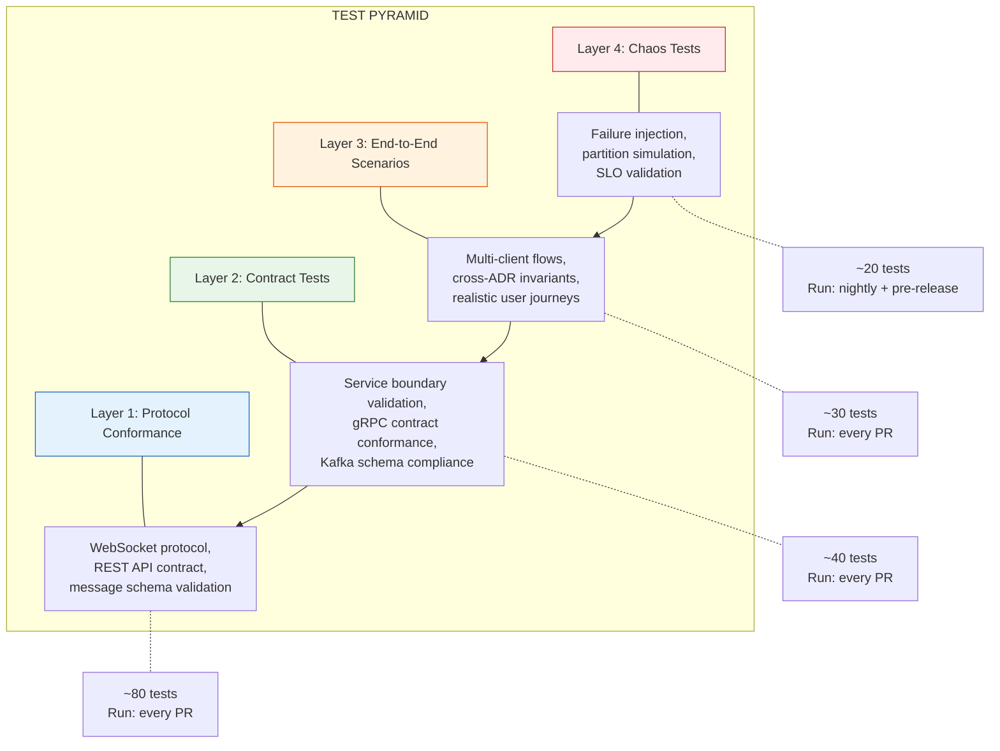
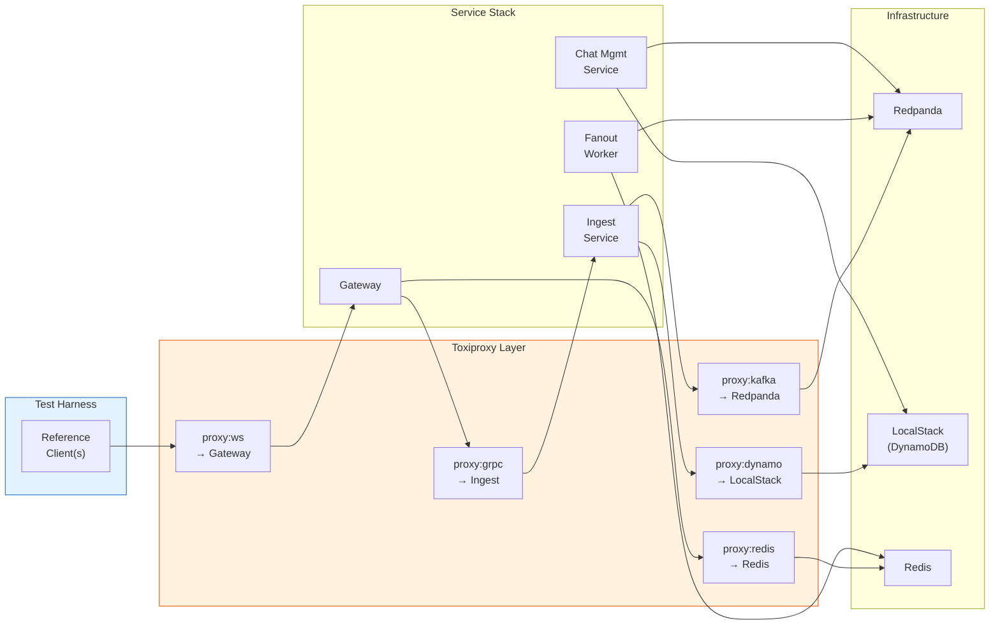
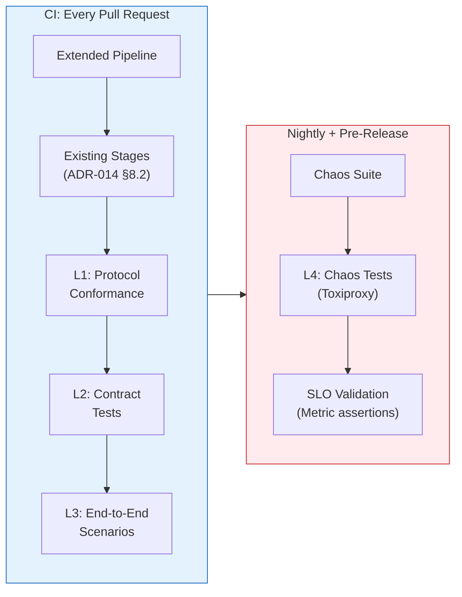

# ADR-017: Client Contract & Test Harness

- **Status**: Accepted
- **Date**: 2026-02-01

---

## Context and Problem Statement

ADR-001 through ADR-016 established the foundational architecture for the distributed messaging platform. Each ADR includes a **Confirmation** section listing test scenarios that validate its contracts. Additionally, several ADRs define explicit client-facing obligations:

- **ADR-001 §6**: Client responsibilities for `client_message_id` stability, sequence ordering, gap tolerance, and `last_acked_sequence` tracking.
- **ADR-005 §Appendix D**: Client implementation checklist — 15 required behaviors, 12 recommended behaviors, and 11 anti-patterns.
- **ADR-005 §Appendix E**: Test vectors for valid and invalid messages.
- **ADR-005 §8**: Conformance tests referenced as "reference test suite that any client implementation must pass."
- **ADR-008 §2–3**: Acknowledgement timing, batching strategy, and reference pseudocode implementation.
- **ADR-009 §1–3**: Client-side error handling for backpressure, rate limiting, and failure classification.
- **ADR-014 §9**: Local development stack with docker-compose but no structured test harness.
- **ADR-014 §8.2**: CI pipeline runs unit and integration tests, but no end-to-end protocol conformance suite.

While individual ADRs define *what* must be tested, no document addresses:

1. **Reference client specification**: No ADR defines a concrete, runnable client implementation that demonstrates correct behavior for all protocol contracts. ADR-005 §Appendix D is a checklist, not an implementation. Developers building clients (web, mobile, test) have no reference to validate against.

2. **Protocol conformance suite**: ADR-005 §8 references a "reference test suite" but never defines it. Without a runnable suite, client implementations cannot be validated for correctness — each team interprets the checklist independently.

3. **Cross-ADR invariant validation**: Individual ADR confirmation sections test in isolation. No document specifies how invariants spanning multiple ADRs are validated together. For example, the end-to-end guarantee "ACK = Durability" (ADR-002) depends on the Gateway → Ingest gRPC path (ADR-014), DynamoDB persistence (ADR-003/ADR-007), sequence allocation (ADR-004), and the WebSocket protocol (ADR-005). A test that validates this guarantee must exercise all five ADRs simultaneously.

4. **Failure injection framework**: ADR-002, ADR-009, ADR-010, and ADR-014 all list failure injection tests (kill gateway, kill Kafka, wipe Redis, DynamoDB throttling). No document specifies *how* failures are injected in the local development stack (ADR-014 §9) or CI pipeline (ADR-014 §8.2).

5. **Test harness architecture**: ADR-014 defines four services and a docker-compose stack. Where does the test harness run? How does it interact with the services? What observability hooks (ADR-012) does it consume to validate SLO targets?

6. **Regression gate**: ADR-014 §8.2 CI pipeline includes unit tests and integration tests. Protocol conformance tests — which validate the *contracts* that make this a distributed systems lab — are not a release gate.

Without a unified client contract and test harness, the project cannot fulfill its stated purpose: **"This repository is intended to be read, reviewed, and reasoned about — not just run"** (MVP-DEFINITION.md). A distributed systems lab without a rigorous test harness is an assertion without proof.

**Core Questions:**

- What is the **reference client contract** that all client implementations must satisfy?
- What is the **protocol conformance suite** and how is it structured?
- How are **cross-ADR invariants** validated end-to-end?
- What is the **failure injection framework** for testing fault-tolerance guarantees?
- How does the **test harness integrate** with CI/CD (ADR-014 §8) and observability (ADR-012)?

---

## Decision Drivers

1. **Invariant Coverage**: Every machine-checkable invariant across ADR-001 through ADR-016 must have at least one test that exercises it. Untested invariants are aspirational, not guaranteed.

2. **Client Correctness**: The reference client is the normative example. A client that passes the conformance suite is correct by definition. A client that fails is not.

3. **Reproducibility**: Tests must produce deterministic results in the local docker-compose stack (ADR-014 §9). Flaky tests erode confidence and are treated as bugs.

4. **Failure Realism**: Failure injection must simulate real failure modes (process crash, network partition, latency injection), not just error code returns. The local stack's parity gaps (ADR-014 §9.3) are acknowledged and documented.

5. **CI Integration**: The conformance suite must run in the CI pipeline (ADR-014 §8.2) as a release-blocking gate, not an optional advisory check.

6. **Observability Validation**: Tests must consume ADR-012 metrics and traces to validate SLO targets, not just functional correctness.

7. **Separation of Concerns**: The test harness tests *the system* — it is not part of the system. It lives in a distinct package, depends only on public contracts (WebSocket, REST, Prometheus endpoints), and never imports internal service code.

---

## Considered Options

### Test Harness Architecture

- **Option A**: In-process test client embedded in each service's `_test.go` files — uses Go's standard testing package with service internals accessible.
- **Option B**: External test harness as a standalone Go binary that interacts with services exclusively through public interfaces (WebSocket, REST, gRPC).
- **Option C**: Language-agnostic test harness (e.g., Python + pytest) that validates the protocol without Go dependency.
- **Option D**: Hybrid — external Go test harness for protocol conformance and cross-ADR tests; existing `_test.go` files for unit/integration tests.

### Failure Injection Strategy

- **Option A**: Application-level fault flags (environment variables that trigger errors) — simple but unrealistic.
- **Option B**: Infrastructure-level injection via docker-compose manipulation (stop/pause containers, network disconnect) — realistic but slower.
- **Option C**: Proxy-based injection (Toxiproxy between services) — granular control over latency, packet loss, and connection reset.
- **Option D**: Hybrid — Toxiproxy for network faults, docker-compose for process faults.

### Conformance Suite Structure

- **Option A**: Flat test list — one test per invariant, no grouping or ordering.
- **Option B**: Layered test pyramid — protocol → contract → integration → end-to-end, where each layer builds on the one below.
- **Option C**: Scenario-based — tests organized by user story (connect → send → receive → disconnect → reconnect → sync).

---

## Decision Outcome

**Chosen Options:**

- **Test Harness Architecture: Option D** — Hybrid with external Go conformance harness
- **Failure Injection: Option D** — Hybrid with Toxiproxy and docker-compose
- **Conformance Suite: Option B** — Layered test pyramid

The external harness validates contracts from the client's perspective — exactly how a real client would interact with the system. Internal `_test.go` files continue to test implementation details. This separation ensures that protocol tests remain valid even if internal implementations change, which is the entire point of contract-based design.

---

## Document Hierarchy

> **Normative vs. Implementation distinction**: This ADR establishes the *architectural decisions* — the reference client strategy, test pyramid structure, CI gating policy, and failure injection approach. These are the durable choices that define the testing architecture.
>
> The *detailed specifications* that implement these decisions live in companion documents that can evolve with versioning, without re-opening this ADR:
>
> | Document | Content | Authority Level |
> |----------|---------|-----------------|
> | **This ADR** | Architectural decisions, rationale, trade-offs | Irrevocable (standard ADR process) |
> | **[CLIENT_CONTRACT.md](CLIENT_CONTRACT.md)** | 36 numbered client requirements (CL-\*, MS-\*, MR-\*, AK-\*, RS-\*, EH-\*), client state machine | Normative contract (MUST changes require ADR review) |
> | **`test/README.md`** | Exhaustive test IDs, step-by-step scenarios, infrastructure setup | Implementation guide (editable without ADR review) |
>
> This separation ensures that the *decision to have a reference client and conformance suite* (this ADR) outlasts the *specific test list* (which grows with each feature). The contract can be versioned independently; the test plan can be updated as invariants are added.

---

## Part 1: Reference Client Contract

> **Full specification**: See **[CLIENT_CONTRACT.md](CLIENT_CONTRACT.md)** for the complete, versioned contract with all 36 requirements and the normative state machine diagram.

### 1.1 Contract Summary

The client protocol contract formalizes the scattered obligations from ADR-005 §Appendix D (implementation checklist) and ADR-008 §2–3 (acknowledgement strategy) into a single, numbered, testable specification. It defines what "correct client behavior" means for this system.

A **conformant client** satisfies all MUST requirements. A **well-behaved client** additionally satisfies all SHOULD requirements. The contract covers six domains:

| Category | MUST | SHOULD | Key Obligations |
|----------|------|--------|-----------------|
| Connection Lifecycle (CL-\*) | 6 | 2 | JWT auth, device_id, heartbeat, backoff |
| Message Sending (MS-\*) | 6 | 1 | Stable `client_message_id` on retry, content validation |
| Message Receiving (MR-\*) | 4 | 1 | Order by `sequence`, deduplicate, tolerate gaps |
| Acknowledgement (AK-\*) | 5 | 1 | Cumulative batched acks, flush before disconnect |
| Reconnection/Sync (RS-\*) | 4 | 1 | Sync all chats, use `last_acked_sequence` cursor |
| Error Handling (EH-\*) | 4 | 1 | Handle all error codes, log unknowns, classify transient vs. permanent |
| **Total** | **29** | **7** | |

### 1.2 Client State Machine

The contract defines a **normative** 7-state machine: `Disconnected → Connecting → Authenticating → Connected → Syncing → Ready → Closing`. Transitions outside this machine are bugs. The full diagram with per-state invariants is in [CLIENT_CONTRACT.md §7](CLIENT_CONTRACT.md#7-client-state-machine).

### 1.3 Reference Client Implementation

The reference client is a Go package at `test/harness/client/`. It is the *initial canonical implementation* of the contract — a **test fixture**, not a production client or SDK. The contract is authoritative; the reference client code is expected to evolve.

**Design principles:**

1. All state transitions are logged with structured fields (for test assertions)
2. All timings are injectable (for deterministic tests)
3. Message send/receive events are published on Go channels (for programmatic observation)
4. Local persistence uses in-memory maps (not SQLite/IndexedDB)
5. No UI — purely programmatic interaction

**Component structure:**

| Component | Responsibility | Contract Requirements |
|-----------|---------------|----------------------|
| `Connector` | TCP/TLS/WebSocket handshake, JWT injection, backoff | CL-01 through CL-08 |
| `Sender` | `client_message_id` generation, retry with stable ID, `request_id` correlation | MS-01 through MS-07 |
| `Receiver` | Sequence ordering, deduplication, gap detection | MR-01 through MR-05 |
| `Acknowledger` | Batched cumulative acks, timer/threshold flush, graceful flush | AK-01 through AK-06 |
| `Syncer` | Post-reconnect sync, parallel chat sync, cursor management | RS-01 through RS-05 |
| `StateStore` | In-memory per-chat state: messages, `last_acked_sequence`, pending sends | AK-05, MS-04 |

The reference client emits observable events (`StateTransition`, `MessageSent`, `AckReceived`, `MessageReceived`, `SyncCompleted`, `GapDetected`, etc.) on channels for test assertions. The full event type catalog is defined in `test/harness/client/events.go`.

---

## Part 2: Test Pyramid Architecture

### 2.1 Layer Definitions

The test pyramid has four layers. Each layer builds on the one below and adds scope.



| Layer | Scope | Infrastructure | Runtime | CI Gate? |
|-------|-------|---------------|---------|----------|
| **L1: Protocol Conformance** | WebSocket + REST contract validation | docker-compose full stack | ~2 minutes | Yes (PR-blocking) |
| **L2: Contract Tests** | Inter-service boundary validation | docker-compose full stack | ~3 minutes | Yes (PR-blocking) |
| **L3: End-to-End Scenarios** | Multi-client user journeys | docker-compose full stack | ~5 minutes | Yes (PR-blocking) |
| **L4: Chaos Tests** | Failure injection + SLO validation | docker-compose + Toxiproxy | ~15 minutes | Nightly + pre-release |

### 2.2 Repository Layout

The test harness lives in a dedicated top-level directory, separated from service code per Decision Driver #7.

```
test/
├── harness/
│   ├── client/              # Reference client implementation
│   │   ├── client.go        # State machine, connection lifecycle
│   │   ├── sender.go        # Message sending with idempotency
│   │   ├── receiver.go      # Message receiving, ordering, dedup
│   │   ├── acknowledger.go  # Batched cumulative acks
│   │   ├── syncer.go        # Post-reconnect sync
│   │   ├── store.go         # In-memory state store
│   │   └── events.go        # Observable event types
│   ├── assertions/          # Custom test assertions
│   │   ├── ordering.go      # Sequence ordering validators
│   │   ├── invariants.go    # Machine-checkable invariant validators
│   │   └── timing.go        # Latency and SLO assertions
│   ├── fixtures/            # Test data factories
│   │   ├── users.go         # User creation helpers
│   │   ├── chats.go         # Chat creation helpers
│   │   └── messages.go      # Message generation helpers
│   └── infra/               # Infrastructure control
│       ├── docker.go        # docker-compose lifecycle management
│       ├── toxiproxy.go     # Toxiproxy fault injection
│       └── metrics.go       # Prometheus metric scraping
├── conformance/             # L1: Protocol conformance tests
│   ├── websocket_test.go    # WebSocket protocol (ADR-005)
│   ├── rest_test.go         # REST API contract (ADR-006)
│   ├── auth_test.go         # Authentication flows (ADR-015)
│   └── schema_test.go       # Message schema validation
├── contract/                # L2: Inter-service contract tests
│   ├── gateway_ingest_test.go  # Gateway → Ingest gRPC
│   ├── ingest_kafka_test.go    # Ingest → Kafka events
│   ├── kafka_fanout_test.go    # Kafka → Fanout delivery
│   └── chat_mgmt_test.go      # Chat Mgmt orchestration
├── e2e/                     # L3: End-to-end scenarios
│   ├── messaging_test.go    # Send → persist → deliver → ack
│   ├── reconnect_test.go    # Disconnect → reconnect → sync
│   ├── membership_test.go   # Chat creation, member mutations
│   └── ordering_test.go     # Per-chat total ordering under load
├── chaos/                   # L4: Chaos tests
│   ├── gateway_crash_test.go    # Kill gateway mid-flow
│   ├── kafka_failure_test.go    # Kafka unavailability
│   ├── redis_wipe_test.go       # Redis data loss
│   ├── dynamo_throttle_test.go  # DynamoDB throttling
│   └── network_partition_test.go # Split-brain scenarios
└── README.md                # Test harness documentation
```

---

## Part 3: Layer 1 — Protocol Conformance Suite

The protocol conformance suite validates every client-facing contract defined in ADR-005 (WebSocket) and ADR-006 (REST). Tests interact with the system exclusively through public interfaces.

> **Full test catalog**: The exhaustive test ID tables, step-by-step procedures, and expected outputs are maintained in `test/conformance/README.md`. This section defines the *scope and structure* of the suite; the companion document contains the *specific tests*, which grow as invariants are added.

### 3.1 Suite Structure and Coverage

The conformance suite is organized into four test groups:

| Group | Source ADR(s) | Test Prefix | Test Count | Scope |
|-------|---------------|-------------|------------|-------|
| WebSocket Handshake | ADR-005 §1 | WS-H-* | ~8 | JWT validation, `device_id`, protocol version, revocation |
| WebSocket Message Flow | ADR-005 §3, ADR-001 | WS-M-* | ~9 | Send/ack, idempotency, sync ordering, membership enforcement |
| WebSocket Error + Backpressure | ADR-005 §5–6, ADR-009 | WS-E-*, WS-B-* | ~8 | Malformed input, rate limits, slow consumer, content size |
| REST API Contract | ADR-006, ADR-015 | REST-*, AUTH-* | ~17 | Auth flows, pagination, idempotency, error format, schema consistency |

### 3.2 Representative Test Examples

To illustrate the conformance suite's depth and style, three representative tests spanning different groups:

**Idempotency (WS-M-02)**: Send `send_message` with `client_message_id=CMI-1`, receive `send_message_ack` with `sequence=N`. Send identical `send_message` with same `client_message_id=CMI-1`. Assert: second ack returns identical `sequence=N`. Validates invariant `idempotency_guarantee` (ADR-001 §3).

**Token Revocation (WS-H-07)**: Obtain valid JWT, add its JTI to the Redis revocation set, attempt WebSocket connection. Assert: 401 rejection. Validates invariant `revocation_fail_secure` (ADR-013 §3.1, ADR-015 §6.2).

**REST Schema Consistency (REST-08)**: Send message via WebSocket, query same message via REST `GET /messages`. Assert: message schema fields are identical across both interfaces. Validates invariant `sequence_consistency` (ADR-006 §Appendix D).

### 3.3 Invariant Coverage Principle

Every invariant marked as "machine-checkable" in ADR-001 through ADR-016 must be covered by at least one L1 test. The full mapping is maintained in Appendix A (invariant-to-test coverage matrix). A conformance suite with unmapped invariants is incomplete by definition.

---

## Part 4: Layer 2 — Contract Tests

Contract tests validate inter-service boundaries by observing side effects. They do not mock services — they run against the full docker-compose stack and verify that outputs of one service match expected inputs of the next.

> **Full test catalog**: Exhaustive test IDs and verification methods are maintained in `test/contract/README.md`.

### 4.1 Service Boundary Coverage

| Boundary | Test Prefix | Test Count | Key Validations |
|----------|-------------|------------|-----------------|
| Gateway → Ingest Service | CT-GI-* | ~3 | gRPC `PersistMessage` call produces valid sequence; non-member rejection |
| Ingest Service → Kafka | CT-IK-* | ~3 | `MessagePersisted` event schema, partition assignment, Protobuf compliance |
| Kafka → Fanout Worker | CT-KF-* | ~3 | Online member delivery, payload completeness, offline member no-op |
| Chat Management Service | CT-CM-* | ~4 | Atomic create (chat + membership + counter), event publication, idempotent direct chat |

### 4.2 Verification Strategy

Contract tests observe *side effects*, not internal state. For each boundary:

1. Trigger an action via the upstream service's public interface
2. Assert the downstream side effect occurred correctly (by observing a public output)

For example, the Gateway → Ingest boundary is tested by sending a `send_message` via WebSocket (upstream trigger), then asserting that a `send_message_ack` arrives with a valid `sequence` and that a `MessagePersisted` event appears on the Kafka topic (downstream observations). At no point does the test import Gateway or Ingest internal packages.

---

## Part 5: Layer 3 — End-to-End Scenarios

End-to-end tests validate cross-ADR invariants by running realistic user journeys through the full system. Each scenario exercises multiple ADR contracts simultaneously. These five scenarios are **architecturally significant** — they test the interactions that make this a distributed system, not just a collection of services.

> **Full scenario specifications**: Step-by-step setup, actions, and assertions are maintained in `test/e2e/README.md`. This section defines the *required scenario coverage*; the companion document contains operational details.

### 5.1 Core Messaging Scenario

**Validates**: ADR-001, ADR-002, ADR-003, ADR-004, ADR-005, ADR-007, ADR-008, ADR-011

```
SCENARIO: Send → Persist → Deliver → Ack (Happy Path)

  SETUP:
    - Create users Alice and Bob via REST (ADR-015)
    - Create direct chat between Alice and Bob via REST (ADR-016)
    - Connect Alice and Bob via WebSocket (ADR-005)

  STEPS:
    1. Alice sends "Hello Bob" with client_message_id=M1
    2. Alice receives send_message_ack with sequence=1
    3. Bob receives message push with sequence=1, content="Hello Bob"
    4. Bob acks sequence=1
    5. Bob sends "Hi Alice" with client_message_id=M2
    6. Bob receives send_message_ack with sequence=2
    7. Alice receives message push with sequence=2, content="Hi Alice"
    8. Alice acks sequence=2

  ASSERTIONS:
    - Alice's messages ordered: [seq=1, seq=2]           (ADR-001: per-chat total order)
    - Bob's messages ordered: [seq=1, seq=2]             (ADR-001: per-chat total order)
    - Alice's seq=1 ack arrived before Bob received msg  (ADR-002: ACK = Durability)
    - Messages queryable via REST GET /messages           (ADR-003: DynamoDB authoritative)
    - Kafka topic contains MessagePersisted for both      (ADR-011: event log)
```

### 5.2 Reconnection and Sync Scenario

**Validates**: ADR-001 §4, ADR-005 §3.6–3.7, ADR-008 §3, ADR-009

```
SCENARIO: Disconnect → Miss Messages → Reconnect → Sync

  SETUP:
    - Users Alice and Bob in a chat, both connected
    - Alice has received and acked through sequence=5

  STEPS:
    1. Disconnect Alice's WebSocket (simulate network failure)
    2. Bob sends 3 messages (sequences 6, 7, 8)
    3. Reconnect Alice
    4. Alice issues sync_request(chat_id, last_acked_sequence=5)
    5. Alice receives sync_response with messages [seq=6, seq=7, seq=8]

  ASSERTIONS:
    - sync_response.messages ordered ascending by sequence  (ADR-005: sync_returns_ordered)
    - All 3 messages present in response                    (ADR-001: sync_completeness)
    - has_more=false (no further pages)
    - Messages match content sent by Bob
    - Alice can ack sequence=8 after sync
```

### 5.3 Idempotency Under Retry Scenario

**Validates**: ADR-001 §3, ADR-004, ADR-005, ADR-007

```
SCENARIO: Client Retry with Same client_message_id

  STEPS:
    1. Alice sends message with client_message_id=CMI-1
    2. Alice receives send_message_ack with sequence=N
    3. Alice sends SAME message with client_message_id=CMI-1 (retry)
    4. Alice receives send_message_ack with sequence=N (same)

  ASSERTIONS:
    - Both acks return identical sequence                    (ADR-001: idempotency_guarantee)
    - Only one message exists in DynamoDB (verify via REST)  (ADR-001: effectively-once)
    - Only one MessagePersisted event in Kafka               (ADR-003: no duplicate events)
```

### 5.4 Per-Chat Ordering Under Concurrent Load

**Validates**: ADR-001 §2, ADR-004, ADR-011

```
SCENARIO: Multiple Senders, Same Chat, Total Order Preserved

  SETUP:
    - Group chat with users Alice, Bob, and Carol
    - All three connected via WebSocket

  STEPS:
    1. Alice, Bob, and Carol each send 10 messages concurrently
    2. All three clients collect all 30 received messages
    3. Each client orders messages by sequence

  ASSERTIONS:
    - All three clients observe identical sequence ordering  (ADR-001: per-chat total order)
    - Sequences are contiguous 1..30 (no gaps under normal)  (ADR-004: atomic counter)
    - No duplicates in any client's view                     (ADR-005: dedup by (chat_id, seq))
```

### 5.5 Cross-Chat Independence

**Validates**: ADR-001 §2 ("No cross-chat ordering"), MVP-DEFINITION.md

```
SCENARIO: Messages in Different Chats Have No Ordering Relationship

  SETUP:
    - Alice has two chats: Chat-X with Bob, Chat-Y with Carol

  STEPS:
    1. Alice sends message to Chat-X (gets seq=1 in Chat-X)
    2. Alice sends message to Chat-Y (gets seq=1 in Chat-Y)
    3. Query both chats via REST

  ASSERTIONS:
    - Chat-X sequence space is independent of Chat-Y
    - Both start at sequence=1
    - No global ordering implied
```

---

## Part 6: Layer 4 — Chaos Tests

Chaos tests validate fault-tolerance guarantees by injecting realistic failures. They require the Toxiproxy infrastructure layer.

### 6.1 Failure Injection Infrastructure



**Toxiproxy configuration** (extends `docker-compose.yml`):

```yaml
# docker-compose.chaos.yml — overlay for chaos testing
services:
  toxiproxy:
    image: ghcr.io/shopify/toxiproxy:2.9.0
    ports:
      - "8474:8474"    # Toxiproxy API
      - "19090:19090"  # proxy:ws → gateway:8080
      - "19091:19091"  # proxy:grpc → ingest:50051
      - "19092:19092"  # proxy:kafka → redpanda:9092
      - "19093:19093"  # proxy:dynamo → localstack:4566
      - "19094:19094"  # proxy:redis → redis:6379
```

**Available fault types:**

| Fault | Toxiproxy Toxic | What It Simulates |
|-------|-----------------|-------------------|
| Latency injection | `latency` | Slow network, cross-AZ latency |
| Connection reset | `reset_peer` | TCP RST, process crash |
| Bandwidth limit | `bandwidth` | Degraded network |
| Packet loss | `timeout` (with `timeout: 0`) | Network black hole |
| Slow close | `slow_close` | Half-open connection |
| Data corruption | `slicer` | Packet fragmentation |

### 6.2 Chaos Test Specifications

The chaos suite defines five architecturally significant failure scenarios. Each targets a different infrastructure dependency and validates a distinct fault-tolerance guarantee.

> **Full chaos specifications**: Step-by-step inject/expect/recover procedures and metric validation assertions are maintained in `test/chaos/README.md`.

| Scenario | Injection Method | What It Tests | Key ADR Guarantee |
|----------|-----------------|---------------|-------------------|
| Gateway Crash Recovery | `docker stop gateway` | Graceful drain, reconnect, sync | ADR-002 §Confirmation #1, ADR-009 §Cross-Plane |
| Kafka Unavailability | Toxiproxy `timeout` on Kafka | DynamoDB persists without Kafka; idempotent retry after recovery | ADR-002 "ACK = Durability", ADR-009 §2.2 |
| Redis Data Loss | `redis-cli FLUSHALL` | Routing degrades to broadcast; rebuilds within 15s | ADR-003 authority hierarchy, ADR-010 §4.3 |
| DynamoDB Throttling | Toxiproxy `latency` on DynamoDB | Elevated latency, no data loss, ordering preserved | ADR-009 §2.1, ADR-014 §9.3 |
| Network Partition (Gateway ↔ Ingest) | Toxiproxy `timeout` on gRPC | Fail-fast error to client, idempotent retry | ADR-002 §Appendix D, ADR-009 §Failure Classification |

**Representative example — Kafka Unavailability:**

```
CHAOS: Kafka broker unreachable during message send

  INJECT: toxiproxy.proxy:kafka.addToxic("timeout", timeout=0)

  EXPECT:
    - Client sends message
    - Ingest Service persists to DynamoDB (succeeds)
    - Ingest Service fails to publish to Kafka → returns error to Gateway
    - Client retries with same client_message_id              (MS-02)

  RECOVER: toxiproxy.proxy:kafka.removeToxic("timeout")
    - Retry succeeds: DynamoDB idempotency returns existing seq
    - Kafka event published on retry
    - Fanout delivers to recipients

  ASSERTIONS:
    - Exactly one message in DynamoDB                         (ADR-001: idempotency)
    - Exactly one Kafka event (after recovery)
    - No silent message loss
```

Each chaos test follows this inject → expect → recover → assert pattern, ensuring that failure injection is always reversible and that the system returns to a healthy state with zero data loss.

---

## Part 7: Observability Integration

The test harness consumes observability signals as *assertions*, not just dashboards. This is a deliberate architectural decision: if metrics and traces are part of the system's contract (ADR-012), they must be verified as part of the system's test suite.

### 7.1 Metric-Based Assertions

The test harness scrapes Prometheus endpoints exposed by each service (ADR-012) to validate SLO targets during test execution. The specific metric names, thresholds, and label selectors are implementation details maintained in `test/harness/infra/metrics.go`. The **normative principle** is:

- Every SLO defined in ADR-009 and ADR-012 must have a corresponding metric assertion
- Assertions run after L3 scenarios (normal operation) and after L4 chaos tests (degraded operation)
- A passing metric assertion under normal load that fails during chaos injection indicates a real SLO violation

Key SLO assertions:

| Metric | Condition | Source |
|--------|-----------|--------|
| `durability_persist_duration_seconds` (P99) | < 500ms | ADR-009 SLO |
| `durability_counter_corruption` | = 0 | ADR-009 Tier 1 |
| `durability_duplicate_sequence` | = 0 | ADR-009 Tier 1 |

### 7.2 Trace-Based Assertions

End-to-end tests validate trace completeness by querying the OpenTelemetry collector.

| Assertion | What It Validates | Source |
|-----------|-------------------|--------|
| Trace spans all three planes | Cross-plane trace propagation | ADR-012 §3 |
| Kafka async boundary maintains trace context | `trace_id` survives Kafka produce/consume | ADR-012 §3 |
| `send_message` → `send_message_ack` latency matches reported metric | Metric and trace consistency | ADR-012 §2 |

---

## Part 8: CI/CD Integration

### 8.1 Pipeline Extension

This ADR extends ADR-014 §8.2 CI pipeline with conformance and chaos test stages.



### 8.2 CI Stage Definitions

| Stage | Trigger | Infrastructure | Timeout | Blocking? |
|-------|---------|---------------|---------|-----------|
| L1: Protocol Conformance | Every PR | docker-compose | 5 min | Yes |
| L2: Contract Tests | Every PR | docker-compose | 5 min | Yes |
| L3: End-to-End | Every PR | docker-compose | 10 min | Yes |
| L4: Chaos Tests | Nightly cron + pre-release tag | docker-compose + Toxiproxy | 20 min | Pre-release only |
| SLO Validation | Post-L3 and post-L4 | Prometheus scrape | 2 min | Yes (pre-release) |

### 8.3 Failure Handling in CI

| CI Failure | Action | Rationale |
|------------|--------|-----------|
| L1/L2/L3 test failure | PR blocked | Protocol contracts are non-negotiable |
| L4 test failure (nightly) | Issue created, team notified | Chaos failures may be intermittent; investigate before blocking |
| L4 test failure (pre-release) | Release blocked | Cannot ship without fault-tolerance validation |
| Flaky test (fails inconsistently) | Quarantined, tracked as bug | Flaky tests erode confidence (Decision Driver #3) |
| Infrastructure timeout (docker-compose startup) | Retry once, then fail | Distinguish infra issues from test failures |

---

## Consequences

### Positive

1. **Invariant Coverage**: Every machine-checkable invariant from ADR-001 through ADR-016 has at least one test that exercises it. The distributed systems lab now has proof, not just assertions.

2. **Client Correctness**: The client protocol contract ([CLIENT_CONTRACT.md](CLIENT_CONTRACT.md)) formalizes the scattered checklists from ADR-005 and ADR-008 into a single, versioned, testable specification. Client developers have an unambiguous target.

3. **Regression Safety**: Protocol conformance tests as a CI gate (Part 8) prevent contract violations from reaching any environment. Breaking changes are caught before merge.

4. **Failure Realism**: Toxiproxy-based chaos tests (Part 6) validate fault-tolerance claims with real network faults, not mocked error returns. This is what distinguishes a distributed systems lab from a CRUD application.

5. **Observability Validation**: Metric and trace assertions (Part 7) ensure that ADR-012's observability contracts actually work — metrics reflect reality, traces span planes, SLOs are measurable.

6. **Documentation as Code**: The test harness itself is documentation — each test maps to specific ADR sections and invariants. Reading the tests is a guided tour of the system's contracts.

7. **Evolvable Specification**: The document hierarchy (ADR → contract → test plans) enables the contract and test suite to evolve independently of the architectural decision. Adding a new invariant updates `CLIENT_CONTRACT.md` and `test/conformance/README.md`, not this ADR.

### Negative

1. **CI Pipeline Duration**: Adding L1–L3 tests increases PR pipeline time by approximately 10–20 minutes.
   *Mitigation*: Parallelization across layers; docker-compose caching; tests run after existing unit/lint stages pass.

2. **Toxiproxy Complexity**: Chaos testing infrastructure adds operational overhead.
   *Mitigation*: Toxiproxy only required for L4 (nightly); L1–L3 use standard docker-compose. Separate `docker-compose.chaos.yml` overlay isolates complexity.

3. **Reference Client Maintenance**: The reference client must be updated when protocol contracts change.
   *Mitigation*: This is a feature, not a bug — protocol changes that break the reference client are caught immediately. The client *is* the contract.

4. **Local Stack Parity Gaps**: Chaos tests against LocalStack/Redpanda may not reproduce production failure modes exactly (ADR-014 §9.3).
   *Mitigation*: Acknowledged and documented per ADR-014's principle: "Local development validates logic correctness. The dev environment validates operational correctness."

5. **Test Harness as Coupling Surface**: The external test harness depends on public API shapes; changes require harness updates.
   *Mitigation*: This coupling is intentional — it validates that API contracts are stable. Breakage indicates a backward-incompatible change that needs ADR review.

### Explicitly Deferred

| Feature | Status | Future ADR |
|---------|--------|------------|
| Multi-region chaos testing | Out of scope | ADR-XXX: Geographic Distribution |
| Performance benchmarking suite | Out of scope | ADR-XXX: Load Testing & Capacity Planning |
| Client SDK generation from proto | Out of scope | ADR-XXX: Client SDK Strategy |
| Mutation testing (test quality analysis) | Out of scope | Operational improvement |
| Visual regression testing (UI) | Out of scope | No UI in MVP |

---

## Confirmation

The implementation of this ADR will be validated through:

1. **Reference Client Tests**:
   - Reference client passes all CL-*, MS-*, MR-*, AK-*, RS-*, EH-* requirements
   - State machine transitions match §1.2 diagram (no undocumented transitions)
   - Observable events emitted for all state changes

2. **Conformance Suite Completeness**:
   - Every invariant from ADR-001 through ADR-016 Appendix (machine-checkable invariants) mapped to at least one test ID
   - Coverage matrix reviewed: no unmapped invariant
   - All ADR-005 §Appendix E test vectors pass

3. **CI Integration**:
   - L1–L3 tests run on every PR and block merge on failure
   - L4 tests run nightly with results published
   - Flaky test detection active with quarantine mechanism

4. **Chaos Infrastructure**:
   - `docker compose -f docker-compose.yml -f docker-compose.chaos.yml up` provisions Toxiproxy
   - Each Toxiproxy proxy reachable and forwarding traffic
   - Each toxic type (latency, reset, timeout) injectable and removable via API

5. **Observability Integration**:
   - Prometheus scraping returns metrics from all four services during test execution
   - SLO assertions pass under normal operation
   - SLO assertions detect degradation during chaos tests

---

## More Information

### Related ADRs

| ADR | Relationship |
|-----|--------------|
| ADR-001 | Ordering, idempotency, sync invariants — primary validation targets |
| ADR-002 | Three-plane architecture; failure isolation — chaos test targets |
| ADR-003 | Source of truth hierarchy; DynamoDB authority — contract test targets |
| ADR-004 | Sequence allocation — ordering test targets |
| ADR-005 | WebSocket protocol — L1 conformance suite primary source |
| ADR-006 | REST API contract — L1 conformance suite REST tests |
| ADR-007 | Data model — contract test verification (query via REST) |
| ADR-008 | Delivery acknowledgement — reference client ack strategy |
| ADR-009 | Failure handling — chaos test expected behaviors |
| ADR-010 | Presence and routing — Redis wipe chaos test |
| ADR-011 | Kafka topic design — contract test Kafka event verification |
| ADR-012 | Observability and SLOs — metric/trace assertion source |
| ADR-013 | Security controls — auth handshake and revocation tests |
| ADR-014 | Technology stack, CI/CD — test harness infrastructure and pipeline integration |
| ADR-015 | Authentication — auth flow conformance tests |
| ADR-016 | Chat lifecycle — membership and creation contract tests |

### References

- Hodgson, J. (2017). *Consumer-Driven Contract Testing*. Martin Fowler's blog.
- Nygard, M. (2018). *Release It!* 2nd Edition. Pragmatic Bookshelf. Chapter 17: Chaos Engineering.
- Rosenthal, C. & Jones, N. (2020). *Chaos Engineering: System Resiliency in Practice*. O'Reilly Media.
- Clemson, T. (2014). "Testing Strategies in a Microservice Architecture." Martin Fowler's blog.
- Netflix. "Principles of Chaos Engineering." principlesofchaos.org.
- Shopify. "Toxiproxy: A TCP proxy to simulate network and system conditions." GitHub.

### Future Considerations

1. **ADR-XXX: Load Testing & Capacity Planning**: Systematic performance benchmarking using the reference client at scale (10K+ connections, sustained message throughput). Distinct from correctness-focused chaos tests.

2. **ADR-XXX: Client SDK Strategy**: Code-generated client SDKs (TypeScript, Swift, Kotlin) from proto definitions, with conformance suite as acceptance criteria for each SDK.

3. **ADR-XXX: Contract Testing in Production**: Synthetic transaction monitoring using the reference client against production, validating SLOs continuously (not just in CI).

4. **ADR-XXX: Chaos Maturity Progression**: Graduating from local Toxiproxy to AWS Fault Injection Simulator (FIS) for production-grade chaos engineering in the dev/staging environment.

---

## Appendix A: Invariant-to-Test Coverage Matrix

This matrix maps every machine-checkable invariant from ADR-001 through ADR-016 to the test(s) that validate it. An empty "Test ID" column indicates a gap that must be addressed before the conformance suite is considered complete.

| Invariant | Source ADR | Test ID(s) |
|-----------|-----------|------------|
| `sequence_monotonic` | ADR-001 | WS-M-01, E2E-§5.4 |
| `idempotency_guarantee` | ADR-001, ADR-006 | WS-M-02, REST-05, E2E-§5.3 |
| `sync_completeness` | ADR-001 | WS-M-06, WS-B-03, E2E-§5.2 |
| `delivery_state_consistency` | ADR-001 | REST-09 |
| `request_response_correlation` | ADR-005 | WS-M-04 |
| `one_way_messages_no_response` | ADR-005 | WS-M-07 |
| `server_push_no_request_id` | ADR-005 | WS-M-08 |
| `ack_cumulative` | ADR-005, ADR-008 | E2E-§5.1 |
| `sync_returns_ordered` | ADR-005 | WS-M-05, E2E-§5.2 |
| `send_ack_matches_request` | ADR-005 | WS-M-03 |
| `connection_established_required` | ADR-005 | WS-H-08 |
| `heartbeat_interval_respected` | ADR-005 | WS-H-08 (implicit) |
| `error_code_is_documented` | ADR-005 | WS-E-01, WS-E-05 |
| `slow_consumer_not_silent` | ADR-005 | WS-B-01, WS-B-02 |
| `version_consistency` | ADR-005 | WS-H-06, WS-H-08 |
| `idempotency_preserved_across_connections` | ADR-005 | E2E-§5.3 |
| `sequence_in_message_is_valid` | ADR-005 | E2E-§5.4 |
| `authentication_required` | ADR-006 | REST-01, WS-H-03, WS-H-04 |
| `chat_membership_enforced` | ADR-006 | REST-03, WS-M-09 |
| `pagination_completeness` | ADR-006 | REST-04 |
| `pagination_stability` | ADR-006 | REST-04 (extended) |
| `rate_limit_headers_present` | ADR-006 | REST-06 |
| `error_format_consistent` | ADR-006 | REST-07 |
| `sequence_consistency` | ADR-006 | REST-08 |
| `delivery_state_monotonic` | ADR-006, ADR-008 | REST-09 |
| `direct_chat_uniqueness` | ADR-006, ADR-016 | REST-10, CT-CM-04 |
| `owner_cannot_leave` | ADR-006 | CT-CM (membership tests) |
| `watermark_monotonic` | ADR-008 | REST-09, E2E-§5.1 |
| `delivered_implies_persisted` | ADR-008 | E2E-§5.1 |
| `watermark_bounded_by_counter` | ADR-008 | E2E-§5.1 |
| `routing_ttl_bounded` | ADR-010 | CHAOS-§6.2.3 |
| `zombie_prevention` | ADR-010 | CHAOS-§6.2.1 |
| `presence_derives_from_connections` | ADR-010 | CHAOS-§6.2.3 |
| `schema_compatibility` | ADR-011 | CT-IK-03 |
| `poison_pill_isolation` | ADR-011 | CT-KF (DLQ test) |
| `revocation_fail_secure` | ADR-013, ADR-015 | WS-H-07 |
| `security_authority` | ADR-013 | WS-M-09, REST-03 |
| `single_language` | ADR-014 | CI build verification (existing) |
| `proto_source_of_truth` | ADR-014 | CI buf lint (existing) |
| `immutable_artifacts` | ADR-014 | CI pipeline (existing) |
| `four_service_preserved` | ADR-015 | docker-compose service count assertion |
| `direct_chat_immutable_membership` | ADR-016 | CT-CM (membership tests) |
| `group_size_bounded` | ADR-016 | CT-CM (membership tests) |
| `member_count_eventually_consistent` | ADR-016 | CT-CM-01 |
| `event_follows_commit` | ADR-016 | CT-IK-01, CT-CM-02 |
| `authorization_requires_membership` | ADR-016 | REST-03, WS-M-09 |

## Appendix B: docker-compose.chaos.yml

```yaml
# Overlay for chaos testing — extends base docker-compose.yml
# Usage: docker compose -f docker-compose.yml -f docker-compose.chaos.yml up

services:
  toxiproxy:
    image: ghcr.io/shopify/toxiproxy:2.9.0
    ports:
      - "8474:8474"
    volumes:
      - ./test/chaos/toxiproxy.json:/config/toxiproxy.json
    command: ["-config", "/config/toxiproxy.json"]
    depends_on:
      gateway:
        condition: service_healthy
      ingest:
        condition: service_healthy
      redpanda:
        condition: service_healthy
      localstack:
        condition: service_healthy
      redis:
        condition: service_healthy

  # Override services to route through Toxiproxy where needed
  gateway:
    environment:
      - INGEST_ADDR=toxiproxy:19091
      - REDIS_ADDR=toxiproxy:19094

  ingest:
    environment:
      - KAFKA_BROKERS=toxiproxy:19092
      - DYNAMODB_ENDPOINT=http://toxiproxy:19093

  fanout:
    environment:
      - KAFKA_BROKERS=toxiproxy:19092
      - REDIS_ADDR=toxiproxy:19094
```

## Appendix C: Invariants (Machine-Checkable)

```
INVARIANT conformance_completeness:
  ∀ invariant I ∈ {ADR-001..ADR-016}.appendix.invariants:
    ∃ test T ∈ conformance_suite: T.validates(I)
  -- Every documented invariant has at least one test

INVARIANT reference_client_conformant:
  ∀ requirement R ∈ client_contract where R.level = "MUST":
    reference_client.satisfies(R)
  -- Reference client passes all MUST requirements

INVARIANT test_determinism:
  ∀ test T ∈ {L1, L2, L3}:
    run(T, env1) = run(T, env1)
  -- Same test on same environment produces same result

INVARIANT ci_gate_enforced:
  ∀ merge M to main:
    ∃ CI run R: R.L1_passed ∧ R.L2_passed ∧ R.L3_passed
  -- No merge without passing conformance tests

INVARIANT chaos_isolation:
  ∀ chaos test CT:
    CT interacts only via public interfaces
    ∧ CT does not import internal/ packages
  -- Chaos tests validate contracts, not implementations

INVARIANT failure_injection_reversible:
  ∀ fault F injected during chaos test CT:
    ∃ recovery R: after R, system returns to healthy state
    ∧ no data loss occurred
  -- All injected faults are recoverable
```
