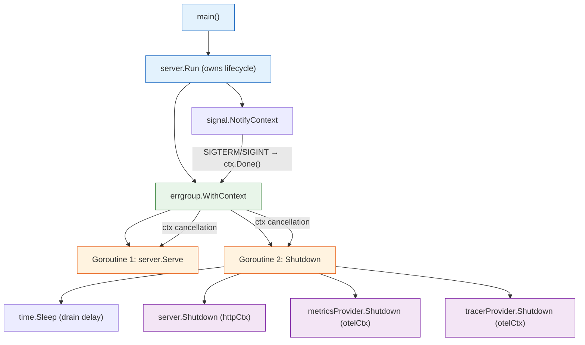

# ADR-018: Service Lifecycle Extraction — `internal/server` Package

- **Status**: Accepted
- **Date**: 2026-02-05

---

## Context and Problem Statement

After implementing graceful shutdown (ADR-014 §4.1) across all four services, the `cmd/*/main.go` files converged to ~97% identical code. Each service's `runServer` function contained the same lifecycle sequence:

1. `signal.NotifyContext` for SIGTERM/SIGINT
2. `config.Load` for configuration
3. `observability.InitLogger`, `InitTracer`, `InitMetrics`
4. `atomic.Bool` health check with `/healthz` endpoint
5. `(&net.ListenConfig{}).Listen` with injected listener support
6. `errgroup.WithContext` with serve + shutdown goroutines
7. Reverse-order shutdown: drain delay → HTTP → metrics → tracer

The only differences between services were:
- The `serviceName` constant (`"gateway"`, `"ingest"`, `"fanout"`, `"chatmgmt"`)
- The config field for the HTTP port (`cfg.Gateway.HTTPPort`, `cfg.Ingest.HTTPPort`, etc.)
- Hardcoded service name in health check JSON strings

This duplication creates several problems:
- **Consistency risk**: A shutdown bug fix must be applied identically to 4 files. Divergence is inevitable.
- **Test duplication**: 4 identical `main_test.go` files (150 lines each) test the same lifecycle logic.
- **Onboarding friction**: New services require copy-pasting 164 lines and changing 3 values.

**Core Question**: How should the shared lifecycle code be extracted while preserving explicitness and testability?

---

## Decision Drivers

1. **DRY without abstraction tax**: Eliminate duplication without hiding the lifecycle behind opaque interfaces. A reader should understand the full startup/shutdown sequence by reading one file.

2. **Explicit lifecycle**: The startup and shutdown sequence is safety-critical (ADR-014 §4.1). It must remain readable as a single linear flow, not scattered across interface implementations.

3. **Structured concurrency**: The `errgroup` pattern (Go Senior-Level Handbook Ch. 05) must be preserved — goroutines are scoped to a parent context, errors propagate, and the group waits for all goroutines.

4. **Testability**: Port-0 listener injection for tests must continue to work. Tests must not require real config or real ports.

5. **Context flow correctness**: Follow Go Senior-Level Handbook Ch. 04 — context created at boundaries, propagated through core, never stored in structs.

---

## Considered Options

### Option A: Runner Function — `server.Run(ctx, Params, ln)`

**Mechanism**: A single exported function `Run` takes a `Params` struct (service name + port extractor closure) and an optional listener. The entire lifecycle lives in one function body — identical to the current `runServer` but parameterized.

```go
type Params struct {
    Name           string
    PortFromConfig func(cfg *config.Config) int
}

func Run(ctx context.Context, p Params, ln net.Listener) error
```

Each `cmd/*/main.go` becomes ~25 lines:

```go
func run(ctx context.Context) error {
    return server.Run(ctx, server.Params{
        Name:           "gateway",
        PortFromConfig: func(cfg *config.Config) int { return cfg.Gateway.HTTPPort },
    }, nil)
}
```

### Option B: Component Interface

**Mechanism**: Define an interface that each service implements:

```go
type Component interface {
    Name() string
    Run(ctx context.Context) error
}
```

A `Lifecycle` struct orchestrates startup/shutdown of multiple components. Each service registers its components (HTTP server, gRPC server, Kafka consumer) and the lifecycle manages them.

### Option C: Functional Options — `server.Run(ctx, WithName("gateway"), WithPort(...))`

**Mechanism**: Use the functional options pattern to configure the runner:

```go
func Run(ctx context.Context, opts ...Option) error
```

---

## Decision Outcome

**Chosen option: Option A — Runner Function**, because:

- The lifecycle is a single linear flow. A function is the natural representation — no interface dispatch, no registration, no orchestration layer.
- `Params` has exactly two required fields. A struct with named fields is clearer than functional options, which make required parameters look optional.
- The `PortFromConfig` closure avoids a `switch` on service name while keeping the config dependency explicit at the call site.
- Tests call `server.Run(ctx, testParams(), ln)` directly — same pattern as before, but consolidated into one test file.

**Option B is the documented growth path**: When any service needs multiple concurrent components (e.g., Gateway adds a gRPC server alongside HTTP, or Fanout adds a Kafka consumer goroutine alongside the health server), migrate from Option A to Option B. The migration is mechanical: `Run` becomes the lifecycle orchestrator, and each component implements the `Component` interface. This decision should be revisited when any service reaches 3+ concurrent components.

**Option C is rejected**: Functional options are appropriate when most parameters are optional. `Name` and `PortFromConfig` are both required — making them options would allow callers to omit them, producing runtime errors instead of compile-time errors.

---

## Architecture Details

### Ownership Hierarchy

Ownership forms a tree rooted at `main()`. Each node owns the goroutines it spawns and is responsible for their cancellation and cleanup. Cancellation flows down the tree via context; completion flows up via `errgroup.Wait`.



**Reading the diagram**: `main()` owns `server.Run`, which creates the signal context and the errgroup. The errgroup owns two goroutines — one serving HTTP, one waiting for shutdown. When SIGTERM arrives, the signal context cancels, `ctx.Done()` unblocks Goroutine 2, and it executes the reverse-order shutdown sequence. Goroutine 1 exits when `server.Shutdown` closes the listener. `errgroup.Wait` blocks until both goroutines return — no goroutine outlives its owner.

### Context Flow (Go Senior-Level Handbook Ch. 04)

`server.Run` is a **boundary function** — it sits at the process entry point and creates the root lifecycle context:

- **"Creation at boundaries, propagation through core"**: `Run` creates the signal context via `signal.NotifyContext` and propagates it to all subsystems (config loader, tracer, metrics, errgroup).
- **"Creator owns cancellation"**: Every `WithCancel`/`WithTimeout` has a matching `defer cancel()`/`defer stop()`.
- **"Never store context in structs"**: `Params` has no context field. Context is passed as the first parameter to `Run`.

**Shutdown `context.Background()` justification**: The shutdown goroutine uses `context.Background()` for its timeout contexts (HTTP drain, OTEL flush). This is intentional, not a violation of the "no root contexts in core" guidance. The parent context is already cancelled — that's what triggered shutdown. The shutdown phase has its own lifecycle that must outlive the cancelled parent. Using the cancelled parent context would cause immediate timeout of `server.Shutdown()` and `provider.Shutdown()`.

### Signal Handling (Go Senior-Level Handbook Ch. 04, 06)

`signal.NotifyContext` converts OS signals into context cancellation — the idiomatic Go pattern for process-level lifecycle. This keeps all cancellation flowing through a single mechanism (context) rather than mixing channels and contexts.

### Structured Concurrency (Go Senior-Level Handbook Ch. 05)

The `errgroup.WithContext` pattern scopes two goroutines (serve + shutdown) to a shared context:
- If `Serve` fails, the context cancels, triggering the shutdown goroutine.
- If the shutdown goroutine completes, `g.Wait()` returns after both goroutines finish.
- No goroutine outlives the errgroup — structured concurrency guarantees.

### `atomic.Bool` Health Check Coordination

The `shuttingDown` flag coordinates between the shutdown goroutine (writer) and HTTP handler (reader) without locks. `atomic.Bool` provides the minimal synchronization needed for a single-writer, multiple-reader flag.

### `PortFromConfig` Closure Strategy

Rather than passing the port directly (which would require loading config before calling `Run`) or using a service name → port mapping (which couples `server` to config structure), `PortFromConfig` defers port extraction to after config is loaded. The closure captures only the field access path, keeping `server` decoupled from config internals.

### Health Check Service Name

The previous implementation used hardcoded JSON strings per service (`{"status":"healthy","service":"gateway"}`). The extracted version uses `fmt.Fprintf(w, '{"status":"healthy","service":%q}', p.Name)`, which produces identical output with `%q` providing proper JSON string escaping.

---

## Consequences

### Positive

1. **656 lines eliminated**: 4 × 164-line files reduced to 4 × 27-line files + 1 × 152-line shared file.
2. **600 test lines eliminated**: 4 × 150-line test files consolidated into 1 × 155-line test file.
3. **Single fix point**: Shutdown bug fixes, timeout adjustments, and health check changes apply once in `internal/server/server.go`.
4. **New service in 27 lines**: Adding a fifth service requires only a `cmd/newservice/main.go` with the standard pattern — no lifecycle code to copy.
5. **Preserved readability**: The full lifecycle remains in one function body in `server.go`. No indirection through interfaces or registries.

### Negative

1. **Coupling to shared lifecycle**: All services share the same startup/shutdown sequence. A service needing a fundamentally different lifecycle (e.g., a batch job with no HTTP server) cannot use `server.Run`.
   *Mitigation*: Such services would not use `server.Run` — they'd have their own `main.go` with a custom lifecycle. The package is opt-in, not mandatory.

2. **`fmt.Fprintf` in health handler**: The previous hardcoded strings had zero allocations. `fmt.Fprintf` with `%q` allocates per request.
   *Mitigation*: Health check endpoints handle ~0.1 QPS (load balancer probes). The allocation is immeasurable.

### Growth Path: Option A → Option B Migration

When a service needs multiple components:

1. Define `Component` interface in `internal/server`
2. `Run` becomes the orchestrator: starts components in order, shuts down in reverse
3. Each service's `main.go` constructs components and passes them to `Run`
4. Health check aggregates readiness across components

This migration is mechanical and backward-compatible — existing services continue working with their current `Params`.

---

## Confirmation

1. **Lint passes**: `make lint` (golangci-lint v2 with noctx, errcheck, contextcheck) reports 0 issues.
2. **Tests pass**: `make test` (go test -race -v ./...) — all 3 lifecycle tests pass with goleak verification.
3. **Behavioral equivalence**: Same shutdown sequence, same timeouts, same health check responses (verified by `TestHealthCheckReturns503DuringShutdown`).
4. **No test coverage regression**: All lifecycle paths previously tested in 4 files are tested in `internal/server/server_test.go`.

---

## References

- Go Senior-Level Handbook Ch. 04: Context Flow Architecture
- Go Senior-Level Handbook Ch. 05: Structured Concurrency with errgroup
- Go Senior-Level Handbook Ch. 06: Signal Handling and Process Lifecycle
- ADR-009: Failure Handling Contracts (shutdown timeouts)
- ADR-012: Observability Architecture (OTEL initialization/shutdown)
- ADR-014: Technology Stack & Service Architecture (graceful shutdown budget §4.1)
