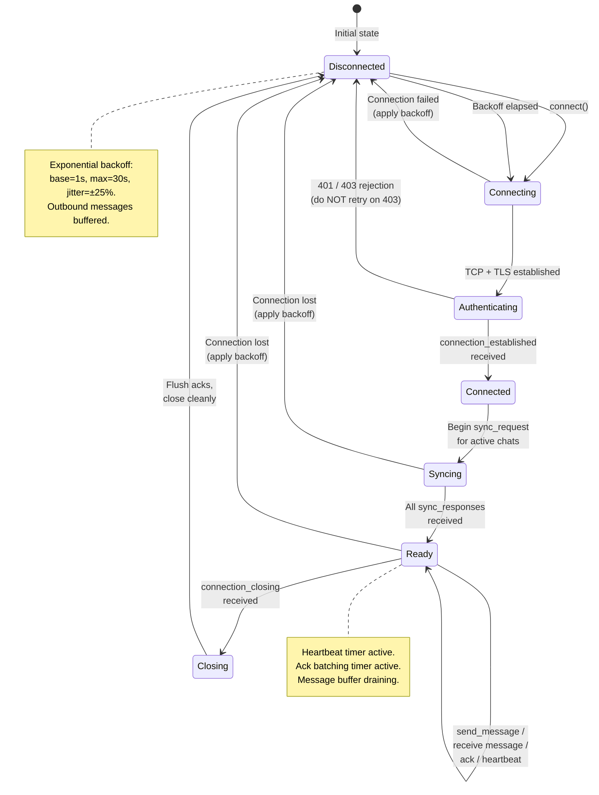

# Client Protocol Contract

- **Version**: 1.0
- **Status**: Normative
- **Governed by**: ADR-017 (Client Contract & Test Harness)
- **Date**: 2026-02-01

---

## Overview

This document is the **normative specification** of correct client behavior for the distributed messaging platform. It subsumes and formalizes ADR-005 §Appendix D (implementation checklist) and ADR-008 §2–3 (acknowledgement strategy) into a single, machine-checkable contract.

ADR-017 establishes the architectural decision to maintain this contract. This document contains the contract itself and is expected to evolve with versioning as the protocol matures. Changes to this document that modify MUST-level requirements require ADR review; changes to SHOULD-level recommendations or editorial clarifications do not.

**Definitions:**

- A **conformant client** satisfies all MUST requirements.
- A **well-behaved client** additionally satisfies all SHOULD requirements.
- The **reference client** is the initial canonical implementation of this contract, located at `test/harness/client/`. The contract is authoritative; the reference client code is expected to evolve.

---

## 1. Connection Lifecycle

| ID | Requirement | Level | Source ADR |
|----|-------------|-------|------------|
| CL-01 | Client MUST authenticate via `Authorization` header (or query parameter as fallback) with a valid JWT | MUST | ADR-005 §1.1 |
| CL-02 | Client MUST include `device_id` in the connection URL | MUST | ADR-005 §1.1, ADR-006 §1.3 |
| CL-03 | Client MUST NOT send any message before receiving `connection_established` | MUST | ADR-005 §1.2, Invariant `connection_established_required` |
| CL-04 | Client MUST send heartbeats at the interval specified in `connection_established.heartbeat_interval_ms` (±10%) | MUST | ADR-005 §4, Invariant `heartbeat_interval_respected` |
| CL-05 | Client MUST handle `connection_closing` by ceasing sends and preparing for reconnection | MUST | ADR-005 §3.9, ADR-009 §1 |
| CL-06 | Client MUST implement exponential backoff for reconnection (base: 1s, max: 30s, jitter: ±25%) | MUST | ADR-005 §4.2 |
| CL-07 | Client SHOULD proactively refresh JWT before expiration | SHOULD | ADR-005 §D.2, ADR-015 §4 |
| CL-08 | Client SHOULD display connection state to the user (connected / reconnecting / offline) | SHOULD | ADR-005 §D.2 |

## 2. Message Sending

| ID | Requirement | Level | Source ADR |
|----|-------------|-------|------------|
| MS-01 | Client MUST generate a unique `client_message_id` (UUIDv4) per logical message | MUST | ADR-001 §6, ADR-005 §3.2 |
| MS-02 | Client MUST use the **same** `client_message_id` on retry of the same logical message | MUST | ADR-001 §6, Invariant `idempotency_guarantee` |
| MS-03 | Client MUST include a unique `request_id` for `send_message` and `sync_request` | MUST | ADR-005 §2.1 |
| MS-04 | Client MUST persist `client_message_id` locally until `send_message_ack` is received | MUST | ADR-001 §6 |
| MS-05 | Client MUST NOT reuse a `client_message_id` for a different logical message | MUST | ADR-001 §6, ADR-005 §D.3 |
| MS-06 | Client MUST validate content is 1–4096 bytes UTF-8 before sending | MUST | ADR-005 §3.2 |
| MS-07 | Client SHOULD buffer outbound messages during CONNECTING/SYNCING states | SHOULD | ADR-005 §D.2 |

## 3. Message Receiving and Ordering

| ID | Requirement | Level | Source ADR |
|----|-------------|-------|------------|
| MR-01 | Client MUST order messages by `sequence`, not by arrival time | MUST | ADR-001 §6, ADR-005 §D.1 |
| MR-02 | Client MUST deduplicate incoming messages by `(chat_id, sequence)` | MUST | ADR-005 §3.4, ADR-005 §D.1 |
| MR-03 | Client MUST tolerate sequence gaps without blocking | MUST | ADR-001 §6, ADR-005 §D.1 |
| MR-04 | Client MUST NOT assume message delivery order matches sequence order | MUST | ADR-005 §D.3 |
| MR-05 | Client SHOULD issue `sync_request` when detecting sequence gaps | SHOULD | ADR-005 §D.2 |

## 4. Acknowledgement Strategy

| ID | Requirement | Level | Source ADR |
|----|-------------|-------|------------|
| AK-01 | Client MUST send cumulative `ack` messages (acknowledging sequence N acknowledges all ≤ N) | MUST | ADR-005 §3.5, ADR-008 §2, Invariant `ack_cumulative` |
| AK-02 | Client MUST batch acknowledgements (not per-message) | MUST | ADR-005 §D.1, ADR-008 §2.1 |
| AK-03 | Client MUST NOT ack before durable local persistence | MUST | ADR-008 §2.2 |
| AK-04 | Client MUST flush pending acks before graceful disconnect | MUST | ADR-008 §2.1, ADR-008 §2.3 |
| AK-05 | Client MUST track `last_acked_sequence` per chat for sync-on-reconnect | MUST | ADR-001 §6, ADR-005 §D.1 |
| AK-06 | Client SHOULD ack on periodic timer (5 seconds) or batch threshold (10 messages), whichever comes first | SHOULD | ADR-008 §2.1 |

## 5. Reconnection and Sync

| ID | Requirement | Level | Source ADR |
|----|-------------|-------|------------|
| RS-01 | Client MUST issue `sync_request` for all active chats after reconnection | MUST | ADR-001 §4, ADR-005 §D.1 |
| RS-02 | Client MUST use `last_acked_sequence` (from local persistent state) as the sync cursor | MUST | ADR-001 §4, ADR-008 §3 |
| RS-03 | Client MUST reconnect and sync after `SLOW_CONSUMER` error or `slow_consumer` close | MUST | ADR-005 §D.1, ADR-009 §1.2 |
| RS-04 | Client MUST NOT retry on `FORBIDDEN` or `NOT_A_MEMBER` errors | MUST | ADR-005 §D.3 |
| RS-05 | Client SHOULD implement parallel sync for multiple chats | SHOULD | ADR-005 §D.2 |

## 6. Error Handling

| ID | Requirement | Level | Source ADR |
|----|-------------|-------|------------|
| EH-01 | Client MUST handle all documented error codes (ADR-005 §6) | MUST | ADR-005 §D.1 |
| EH-02 | Client MUST log unknown message types and continue (not crash) | MUST | ADR-005 §D.3, ADR-005 §2.5 |
| EH-03 | Client MUST NOT cache membership decisions for authorization | MUST | ADR-005 §D.3 |
| EH-04 | Client MUST treat `SERVICE_UNAVAILABLE` as a transient error and retry with backoff | MUST | ADR-009 §Failure Classification |
| EH-05 | Client SHOULD measure and report round-trip latency | SHOULD | ADR-005 §D.2, ADR-012 §4 |

---

## 7. Client State Machine

The reference client follows a well-defined state machine. Transitions outside this state machine are bugs. This state machine is **normative** — any client implementation must follow these states and transitions.

**States and their invariants:**

| State | Allowed Operations | Invariant |
|-------|-------------------|-----------|
| Disconnected | `connect()` only; outbound messages buffered | Backoff timer active if previously connected |
| Connecting | None (waiting for TCP/TLS) | Timeout applies |
| Authenticating | None (waiting for server) | JWT sent; awaiting `connection_established` or rejection |
| Connected | `sync_request` only | Must sync before any message sends |
| Syncing | `sync_request` processing | Multiple chat syncs may be in-flight |
| Ready | `send_message`, `ack`, `heartbeat` | Heartbeat timer active; ack batching timer active |
| Closing | Flush pending acks only | No new sends; graceful teardown |

---

## 8. Contract Summary

| Category | MUST | SHOULD | Total |
|----------|------|--------|-------|
| Connection Lifecycle (CL-*) | 6 | 2 | 8 |
| Message Sending (MS-*) | 6 | 1 | 7 |
| Message Receiving (MR-*) | 4 | 1 | 5 |
| Acknowledgement (AK-*) | 5 | 1 | 6 |
| Reconnection/Sync (RS-*) | 4 | 1 | 5 |
| Error Handling (EH-*) | 4 | 1 | 5 |
| **Total** | **29** | **7** | **36** |

---

## Versioning

This contract follows semantic versioning:

- **Major**: MUST-level requirement added or modified (requires ADR review)
- **Minor**: SHOULD-level recommendation added or modified
- **Patch**: Editorial clarification, source ADR reference correction

| Version | Date | Change |
|---------|------|--------|
| 1.0 | 2026-02-01 | Initial contract extracted from ADR-017 |
