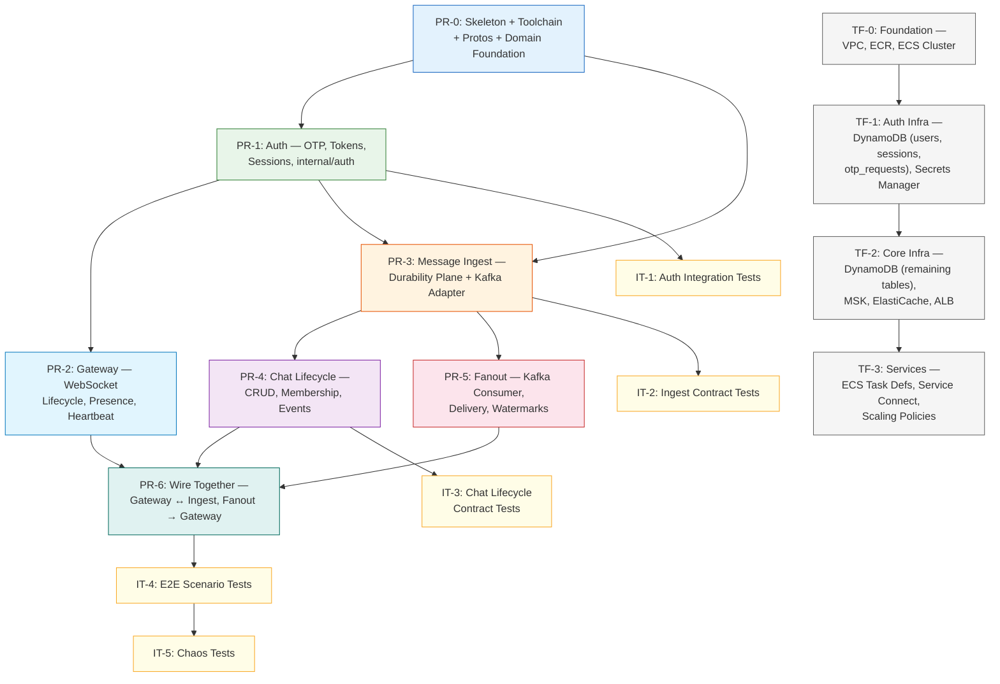

# Execution Plan — Realtime Messaging Platform

- **Status**: Active
- **Created**: 2026-02-01
- **Last Updated**: 2026-02-01

---

## Purpose

This document defines the incremental implementation plan for the Distributed Systems Lab messaging platform. It translates the 17 Architecture Decision Records (ADR-001 through ADR-017), the MVP Definition, and the Client Protocol Contract into a sequence of Pull Requests that are minimal, functional, and testable — each delivering real capability with no empty stubs or speculative boilerplate.

---

## Guiding Principles

1. **Every PR ships working functionality.** No empty interfaces, no stub implementations, no "wire it up later" code. If a PR introduces a function, that function is called and tested.

2. **PR-0 is the sole exception to Principle 1.** PR-0 creates four services with only health-check endpoints and no business logic. This is a **one-time exception** because the toolchain, CI pipeline, and proto contract boundary *are* the deliverable. No subsequent PR may introduce a service or endpoint without business logic behind it. This invariant is non-negotiable — invoking "but PR-0 did it" to justify health-only code in PR-2 through PR-6 is explicitly prohibited.

3. **No hidden stubs.** If a PR registers a gRPC server, HTTP handler, or Kafka consumer that is not yet called by any upstream component, the PR must explicitly document why the endpoint exists and that no code paths depend on it. "Registered but unreachable by design" is acceptable when architecturally justified; an unexplained empty handler is not.

4. **PRs are as small as possible while remaining coherent.** A PR implements a complete vertical slice — from proto definition through domain logic to adapter and tests — for a bounded capability.

5. **Code and infrastructure travel together.** If a feature needs a DynamoDB table, the LocalStack init script (and later, Terraform module) ships in the same PR as the code that reads/writes that table.

6. **Observability is woven, not bolted on.** Every PR includes the OTel metrics, structured logging, and trace propagation that its ADRs define. No "add observability later" PR.

7. **Unit tests ship with code; integration/E2E tests follow.** Each PR includes unit tests for its logic. Integration tests that validate cross-service contracts ship as dedicated follow-up PRs once the services they test are implemented.

8. **Terraform is incremental.** A foundational Terraform PR establishes networking and base infrastructure. Subsequent Terraform PRs provision the specific AWS resources each vertical needs, enabling continuous deployment as the project grows.

---

## Vertical Dependency Graph



### Reading the Graph

- **Solid arrows** indicate hard dependencies (the target PR cannot start until the source is merged).
- **PR-1 and PR-3** can proceed in parallel after PR-0, but PR-3's Kafka adapter is needed by PR-4.
- **Terraform track** (TF-*) and **Integration Test track** (IT-*) run in parallel with implementation PRs.

---

## PR-0: Skeleton, Toolchain, Protos & Domain Foundation

### What This PR Delivers

A fully functional project skeleton where `make ci-local` passes, `make dev` starts all infrastructure + 4 healthy services, and the proto contract boundary is established. This is ADR-014's confirmation criteria.

### ADR Coverage

| ADR | Sections Implemented | What's Covered |
|-----|---------------------|----------------|
| ADR-014 | §3 (Repo Structure), §4 (Dockerfiles), §4A (Toolbox), §5 (Makefile), §8 (CI) | Complete project skeleton, Docker-only toolchain, CI pipeline |
| ADR-014 | §6 (Libraries) | `go.mod` with all dependencies declared |
| ADR-014 | §3.1 (Proto boundary) | `proto/messaging/v1/*.proto`, `buf.yaml`, `buf.gen.yaml`, `buf generate` |
| ADR-012 | §1 (OTel setup) | `internal/observability/` — trace provider, metric middleware, structured logging |
| ADR-007 | (partial) | Domain value objects referenced by protos |

### Scope

**Repository structure (ADR-014 §3.1):**

```
cmd/
├── gateway/main.go           # Health check HTTP server only
├── ingest/main.go            # Health check gRPC + HTTP server only
├── fanout/main.go            # Health check HTTP server only
└── chatmgmt/main.go          # Health check gRPC + HTTP server only
internal/
├── domain/                   # Shared value objects, error types
│   ├── ids.go                # ChatID, UserID, MessageID, SessionID, DeviceID
│   ├── errors.go             # Domain error types (ErrNotFound, ErrNotMember, etc.)
│   └── constants.go          # Normative limits from ADR-009 (rate limits, buffer sizes)
├── observability/            # OTel setup
│   ├── tracer.go             # Trace provider initialization
│   ├── metrics.go            # Metric provider initialization
│   └── logging.go            # Structured logging (slog)
├── gateway/
│   ├── port/
│   ├── app/
│   └── adapter/
├── ingest/
│   ├── port/
│   ├── app/
│   └── adapter/
├── fanout/
│   ├── port/
│   ├── app/
│   └── adapter/
└── chatmgmt/
    ├── port/
    ├── app/
    └── adapter/
pkg/
└── protocol/                 # WebSocket protocol types (ADR-005 schemas)
proto/
├── buf.yaml
├── buf.gen.yaml
└── messaging/v1/
    ├── common.proto           # ChatID, UserID, Timestamp, error types
    ├── ingest.proto           # IngestService: PersistMessage RPC
    ├── chatmgmt.proto         # ChatMgmtService: CreateChat, AddMember, Auth RPCs
    └── gateway.proto          # GatewayService: DeliverMessage RPC (Fanout → Gateway)
docker/
├── dev.Dockerfile            # Multi-stage: Go + tools + Air
├── gateway.Dockerfile        # Production: builder → scratch
├── ingest.Dockerfile
├── fanout.Dockerfile
└── chatmgmt.Dockerfile
docker-compose.yaml           # Infrastructure: LocalStack, Redpanda, Redis
docker-compose.dev.yaml        # Override: 4 services with Air + toolbox
.air/
├── gateway.toml
├── ingest.toml
├── fanout.toml
└── chatmgmt.toml
.github/workflows/
├── ci.yaml
├── cd-dev.yaml
└── cd-prod.yaml
.golangci.yml
.arch-go.yml
Makefile
go.mod
go.sum
CONTRIBUTING.md
README.md
```

**Each service's `main.go` does exactly three things:**

1. Initialize OTel (tracer + metrics + structured logging)
2. Start an HTTP health check endpoint (`/healthz`)
3. Handle `SIGTERM` for graceful shutdown

This is not empty boilerplate — it validates ADR-014's Docker-only toolchain, graceful shutdown invariant, and OTel integration from day one. Every `make` target works.

**Proto definitions** are complete and final — they define the inter-service contract boundary. `buf lint` and `buf generate` run in CI. This establishes the contract that all subsequent PRs implement against.

**`internal/domain/`** ships with the types that protos reference plus domain errors. Each subsequent PR grows this package with the types it needs.

### Acceptance Criteria

- [x] `make ci-local` passes (proto lint, proto breaking, go lint, arch lint, unit tests, build, docker)
- [x] `make dev` starts LocalStack + Redpanda + Redis + 4 services with Air hot reload
- [x] All 4 services report healthy on `/healthz`
- [x] `buf lint` passes with no warnings
- [x] `buf generate` produces Go stubs in `gen/`
- [x] `golangci-lint` passes
- [x] `go-arch-lint` validates Clean Architecture boundaries
- [x] Docker images build from `scratch` with non-root user
- [x] All services handle `SIGTERM` gracefully

### Correctness Invariants

| ID | Invariant | Source ADR | Verification |
|----|-----------|-----------|--------------|
| PR0-INV-1 | `∀ Makefile target T: T.invokes_host_tool ∈ {docker, docker compose, make}` — No Makefile target invokes Go, buf, or lint tools on the host | ADR-014 `docker_only_toolchain` | Grep Makefile for direct tool invocations |
| PR0-INV-2 | `∀ production image I: I.base = "scratch" ∧ I.user ≠ "root"` — All production images use scratch base and non-root user | ADR-014 `scratch_base_image` | Dockerfile inspection + `docker inspect` |
| PR0-INV-3 | `∀ service S: S.handles(SIGTERM) = true ∧ S.drain_timeout < ECS.stopTimeout` — All services handle SIGTERM within ECS bounds | ADR-014 `graceful_shutdown` | Send SIGTERM to container, verify clean exit |

### TBD Notes (Resolve During Implementation)

- **TBD-PR0-1: Config & secrets injection parity.** Services reference Secrets Manager / SSM, but the local development parity mechanism isn't pinned. Define config precedence: `env var → config file → AWS SDK (Secrets Manager / SSM)`. In `docker-compose.dev.yaml`, secrets are injected as env vars from `.env.dev` (never committed). In production, ECS task definitions reference Secrets Manager ARNs. Ensure secrets are never logged — the structured logger must redact fields matching `*_key`, `*_secret`, `*_token`, `*_password`. **Decide before PR-1** (auth needs signing keys).
- **TBD-PR0-2: Error taxonomy — canonical domain error → wire mapping.** `internal/domain/errors.go` defines canonical error types. Define mapping functions: `domain error → gRPC status code` (for Ingest, Chat Mgmt), `domain error → HTTP status + JSON body` (for grpc-gateway REST), `domain error → WebSocket error frame` (for Gateway). Ship golden tests that assert each mapping. **Decide during PR-0, enforce from PR-1 onward.**
- **TBD-PR0-3: Clock semantics.** All persisted timestamps are wall clock UTC milliseconds since epoch (`time.Now().UTC().UnixMilli()`). All in-process durations and timeouts use monotonic clock (Go's default `time.Since()`). Never persist `time.Time` directly — always convert to epoch millis before DynamoDB write. Define a `domain.Now()` function that returns `time.Time` and is injectable for tests. **Decide in PR-0, used from PR-1 onward.**

---

## PR-1: Authentication — OTP, Tokens & Sessions

### What This PR Delivers

A fully functional authentication flow: request OTP → verify OTP → get JWT + refresh token → refresh tokens → logout. The Chat Mgmt Service handles all `/auth/*` endpoints. The `internal/auth/` package provides JWT minting and validation, cleanly separated so Gateway (PR-2) can import validation without pulling in minting dependencies.

### ADR Coverage

| ADR | Sections Implemented | What's Covered |
|-----|---------------------|----------------|
| ADR-015 | All sections | OTP lifecycle, token minting, refresh rotation, session management |
| ADR-013 | §2.2 (OTP security), §3.1 (Token revocation), §4.1 (Rate limiting) | Rate limits, fail-secure, revocation via Redis |
| ADR-006 | §2.1–2.4 (Auth endpoints) | REST endpoints: request-otp, verify-otp, refresh, logout |
| ADR-007 | §2.7 (users), §2.8 (sessions) | DynamoDB tables: `users`, `sessions` |
| ADR-015 | §2 (OTP storage), Appendix A | DynamoDB table: `otp_requests` |
| ADR-014 | §7 (Secrets mgmt) | Secrets Manager integration for JWT signing keys |

### Scope

**`internal/auth/` package (ADR-015 §3.1):**

```
internal/auth/
├── jwt.go          # JWT validation — imported by Gateway, Ingest, Chat Mgmt
├── mint.go         # JWT minting — imported by Chat Mgmt only
├── keys.go         # Key loading from Secrets Manager / SSM
├── refresh.go      # Refresh token generation, hashing, rotation detection
├── claims.go       # Token claims types (sub, iss, aud, iat, exp, jti, sid, scope)
├── sms.go          # SMSProvider interface
├── otp.go          # OTP generation, HMAC verification, constant-time comparison
└── provider/
    ├── sns.go      # AWS SNS implementation
    ├── log.go      # Development: logs OTP to stdout
    └── fixed.go    # Test: returns fixed OTP
```

**Design intent for `jwt.go` vs `mint.go` separation:** `jwt.go` depends only on the public key (loaded from SSM Parameter Store). `mint.go` depends on the private key (loaded from Secrets Manager). Gateway imports `jwt.go` only — no Secrets Manager IAM permission needed. This enforces ADR-015's least-privilege principle at the import level.

**Chat Mgmt Service handlers:**

| Endpoint | Handler | DynamoDB Operations | Redis Operations |
|----------|---------|-------------------|-----------------|
| `POST /auth/request-otp` | Request OTP | PutItem `otp_requests` | INCR `otp_req:phone:{hash}`, INCR `otp_req:ip:{hash}` |
| `POST /auth/verify-otp` | Verify OTP | GetItem `otp_requests`, TransactWriteItems (`users` + phone sentinel + `sessions`) | INCR `otp_verify:phone:{hash}`, SET `otp_lockout:phone:{hash}` |
| `POST /auth/refresh` | Refresh tokens | GetItem `sessions`, UpdateItem `sessions` (rotate) | INCR `auth_refresh:user:{id}` |
| `POST /auth/logout` | Logout | DeleteItem `sessions` | SET `revoked_jti:{jti}` with TTL |

**LocalStack init script** creates DynamoDB tables: `users`, `sessions`, `otp_requests`.

**gRPC + grpc-gateway** for Chat Mgmt Service is wired up in this PR. Auth endpoints are the first REST endpoints exposed through grpc-gateway, validating ADR-014's decision.

### Acceptance Criteria

- [ ] `POST /auth/request-otp` rate-limited (3/phone/15min, 10/IP/15min)
- [ ] OTP stored as HMAC-SHA256 — no plaintext in DynamoDB
- [ ] `POST /auth/verify-otp` returns JWT access + refresh tokens
- [ ] New user: 201 Created with `is_new_user: true`; existing user: 200 OK
- [ ] Device binding: `device_id` in header must match body
- [ ] `POST /auth/refresh` rotates tokens; reuse detection revokes session
- [ ] `POST /auth/logout` revokes session and blacklists JTI in Redis
- [ ] Redis failure on rate limit check → 503 (fail-closed)
- [ ] Max 5 concurrent sessions per user enforced
- [ ] OTel metrics: `auth_otp_requests_total`, `auth_token_minted_total`, `auth_session_created_total`
- [ ] Structured logging with trace_id correlation
- [ ] Unit tests for OTP generation, HMAC verification, token minting, refresh rotation

### Correctness Invariants

| ID | Invariant | Source ADR | Verification |
|----|-----------|-----------|--------------|
| PR1-INV-1 | `∀ security failure F: F.result = DENY` — Redis unavailable during rate limit or revocation check returns 503, never silently allows | ADR-013 `revocation_fail_secure` | Integration test: stop Redis → verify 503 on request-otp and verify-otp |
| PR1-INV-2 | `∀ refresh R1, R2 where R1.token = R2.prev_token: replay(R1.token) after R2 ⟹ session revoked` — Refresh token reuse triggers full session revocation | ADR-015 §4 | Unit test: rotate token, replay old token, assert session deleted |
| PR1-INV-3 | `|{services}| = 4 ∧ services = {gateway, ingest, fanout, chatmgmt}` — Auth implementation adds zero new services | ADR-015 `four_service_preserved` | docker-compose service count assertion |

### TBD Notes (Resolve During Implementation)

- **TBD-PR1-1: Key rotation workflow & dual-key validation.** ADR-015 specifies `kid` in JWT header, implying key rotation support. Pin the rotation workflow: (1) generate new key pair, store in Secrets Manager with new version, (2) publish new public key to SSM alongside old key, (3) validators accept JWTs signed by either key for `rotation_window` duration, (4) after window, remove old public key. Define `rotation_window` (recommendation: 2× max token lifetime = 2 hours). Define public key cache TTL in validators (recommendation: 5 minutes). **Decide during PR-1; PR-2 (Gateway) will import the validator.**
- **TBD-PR1-2: TTL values for auth tables.** Define explicit TTL for: `otp_requests` (recommendation: 10 minutes — 2× OTP validity), `sessions` (recommendation: 30 days — max refresh token lifetime), revoked JTI in Redis (recommendation: equal to access token max lifetime, 1 hour). Ensure `sessions` TTL doesn't break refresh rotation detection — a revoked session record must persist long enough for reuse detection to trigger. **Decide during PR-1.**

---

## PR-2: Gateway — WebSocket Lifecycle & Presence

### What This PR Delivers

A Gateway Service that accepts WebSocket connections authenticated via JWT (using `internal/auth/jwt.go` from PR-1), registers connections in Redis (ADR-010), manages heartbeats, handles graceful disconnection, and enforces backpressure limits. The Gateway cannot yet send or receive messages — that's PR-6.

### ADR Coverage

| ADR | Sections Implemented | What's Covered |
|-----|---------------------|----------------|
| ADR-005 | §1 (Handshake), §5 (Connection lifecycle), §6 (Heartbeat) | WebSocket upgrade, auth, ping/pong, close |
| ADR-010 | All sections | Redis connection registry, Lua scripts for atomic register/deregister |
| ADR-009 | §2 (Backpressure), §3 (Connection limits) | Outbound buffer limits, slow client disconnect |
| ADR-013 | §2.1 (Connection plane security) | JWT validation at handshake, connection rate limiting |
| ADR-002 | §1 (Connection Plane) | Ephemeral state model, what Gateway does NOT do |

### Scope

**`internal/gateway/` package structure:**

```
internal/gateway/
├── port/
│   ├── ws_handler.go        # WebSocket upgrade + authentication
│   └── grpc_server.go       # DeliverMessage RPC (see note below)
├── app/
│   ├── connection.go        # Connection lifecycle management
│   ├── heartbeat.go         # Ping/pong with ADR-009 timeouts
│   └── backpressure.go      # Outbound buffer monitoring + disconnect
└── adapter/
    ├── redis_presence.go    # ADR-010 Lua scripts: atomic register/deregister
    └── auth_validator.go    # Wraps internal/auth/jwt.go
```

**On `DeliverMessage` RPC (Guiding Principle 3 — No Hidden Stubs):** The gRPC server is registered so the Gateway's port is listening and health checks pass, but the `DeliverMessage` RPC is unreachable by design until PR-6 — no Fanout Worker exists to call it. No code paths in PR-2 depend on this RPC. It exists because the Gateway's gRPC server must be registered at startup (Go's gRPC server requires all services registered before `Serve()`), and splitting server registration across PRs would require restructuring `main.go` in PR-6. The handler returns `codes.Unimplemented` until PR-6 wires it.

**`internal/redis/` shared adapter** — connection routing operations (ADR-010 §3):

- `REGISTER_CONNECTION` Lua script: atomic set of `connection:{id}`, add to `user_connections:{user_id}` and `gateway_connections:{gateway_id}`, all with TTL.
- `DEREGISTER_CONNECTION` Lua script: atomic removal from all three key families.
- Heartbeat renewal: extends TTL on `connection:{id}`.

**WebSocket handshake flow (ADR-005 §1.1):**

1. Client sends HTTP upgrade with `Authorization: Bearer {jwt}`
2. Gateway validates JWT via `internal/auth/jwt.go`
3. Check revocation: `GET revoked_jti:{jti}` in Redis (fail-closed on Redis failure per ADR-013)
4. Connection rate limit: `ZADD conn_rate:user:{user_id}` (ADR-013 §2.1)
5. If all pass: upgrade to WebSocket, register in Redis, send `connection_ack`
6. If any fail: reject with appropriate HTTP status (401, 429, 503)

**`pkg/protocol/` types** for WebSocket frames get their Go implementations here — `ConnectionAck`, `ConnectionClosing`, `Ping`, `Pong`, `Error` frame types. Message-related types (`SendMessage`, `MessageAck`, etc.) are defined but not handled yet.

### Acceptance Criteria

- [ ] WebSocket upgrade succeeds with valid JWT
- [ ] WebSocket upgrade rejected with expired/invalid/revoked JWT
- [ ] Connection registered in Redis: `connection:{id}`, `user_connections:{user_id}`, `gateway_connections:{gw_id}`
- [ ] Heartbeat: client receives ping, must respond within ADR-009 timeout (30s)
- [ ] Missed heartbeat → connection closed with `connection_closing` frame
- [ ] Token expiry during connection → `connection_closing` with `reason: token_expired`
- [ ] Graceful shutdown: SIGTERM drains connections (sends `connection_closing` with `reason: server_shutdown`)
- [ ] Redis key TTL = 2× heartbeat interval (60s)
- [ ] Redis crash → connections continue but re-register on next heartbeat
- [ ] Connection rate limit: max 5 connections per user per 10 seconds
- [ ] OTel metrics: `gateway_connections_active`, `gateway_connections_total`, `gateway_heartbeat_timeout_total`
- [ ] Unit tests for connection lifecycle, heartbeat logic, backpressure

### Correctness Invariants

| ID | Invariant | Source ADR | Verification |
|----|-----------|-----------|--------------|
| PR2-INV-1 | `∀ Redis state loss: consequence = reconnection only, ¬data_loss` — Wiping Redis causes reconnections but loses zero messages or auth state | ADR-002 §1.3, ADR-010 | Integration test: flush Redis → verify connections re-register, no auth state corruption |
| PR2-INV-2 | `∀ connection C: C.ttl = 2 × heartbeat_interval ∧ TTL refresh on each heartbeat` — Zombie connections expire naturally on gateway crash | ADR-010 `routing_ttl_bounded` | Unit test: verify Redis key TTL set at registration and refreshed on heartbeat |
| PR2-INV-3 | `∀ revocation check with Redis down: result = DENY (503)` — JWT revocation check failure is fail-closed, never fail-open | ADR-013 `revocation_fail_secure` | Integration test: stop Redis → attempt WebSocket upgrade with valid JWT → verify rejection |

---

## PR-3: Message Ingest — The Durability Plane

### What This PR Delivers

The Ingest Service implementing the complete 5-step message persistence flow from ADR-004: idempotency check → membership validation → atomic counter sequence allocation → TransactWriteItems → Kafka produce. This also builds the shared `internal/kafka/` and `internal/dynamo/` adapters that subsequent PRs reuse.

### ADR Coverage

| ADR | Sections Implemented | What's Covered |
|-----|---------------------|----------------|
| ADR-004 | All sections | 5-step persist flow, atomic counters, two-phase allocation |
| ADR-001 | §2 (Ordering), §3 (Idempotency), §6 (Gaps) | Per-chat total ordering, `client_message_id` dedup, gap tolerance |
| ADR-003 | §1 (DynamoDB authority), §4.1–4.2 (Write path) | DynamoDB as source of truth, write path dataflow |
| ADR-007 | §2.3 (messages), §2.4 (idempotency_keys), §2.5 (chat_counters) | DynamoDB tables: `messages`, `idempotency_keys`, `chat_counters` |
| ADR-011 | §2 (Partitioning), §3 (Producer), §4 (Schema) | Kafka `messages.persisted` topic, murmur2 partitioner, event schema |
| ADR-013 | §Security Authority Invariant | Durability Plane as sole write authorization authority |
| ADR-009 | §1 (Tier classification) | Timeout contracts on DynamoDB and Kafka operations |

### Scope

**`internal/ingest/` package structure:**

```
internal/ingest/
├── port/
│   └── grpc_server.go          # PersistMessage RPC handler
├── app/
│   ├── persist.go              # 5-step orchestration logic
│   ├── idempotency.go          # Check + write idempotency keys
│   └── sequence.go             # Atomic counter allocation
└── adapter/
    ├── dynamo_messages.go      # DynamoDB message + idempotency writes
    ├── dynamo_membership.go    # ConsistentRead membership check
    └── kafka_producer.go       # Wraps internal/kafka/ for messages.persisted
```

**`internal/dynamo/` shared adapter** — DynamoDB table operations:

- Expression builder helpers for ADR-007 access patterns
- TransactWriteItems wrapper with condition expression error parsing
- ConsistentRead helpers
- Created here, reused by Chat Mgmt in PR-4

**`internal/kafka/` shared adapter** — franz-go producer/consumer:

- Producer with `acks=all`, idempotent producer enabled, LZ4 compression (ADR-011 §3.1)
- Murmur2 partitioner matching Java default — **critical for per-chat ordering** (ADR-011 §2.2)
- Schema envelope helpers (ADR-011 §4 envelope format)
- Consumer base (used by Fanout in PR-5)
- Created here, reused by Chat Mgmt (PR-4) and Fanout (PR-5)

**5-step persist flow (ADR-004 §6):**

```
Step 1: Idempotency Check
  → GetItem(idempotency_keys, {chat_id, client_message_id})
  → If exists: return cached {sequence, message_id}

Step 2: Membership Validation
  → GetItem(chat_memberships, {chat_id, sender_id}, ConsistentRead=true)
  → If not member: reject NOT_A_MEMBER

Step 3: Sequence Allocation (Atomic Counter)
  → UpdateItem(chat_counters, {chat_id}, ADD sequence_counter :1)
  → sequence = response.Attributes.sequence_counter

Step 4: Persist Message + Idempotency Key (Atomic)
  → TransactWriteItems([
      Put(idempotency_keys, ConditionExpression: attribute_not_exists),
      Put(messages)
    ])
  → On ConditionalCheckFailed: race — query idempotency_keys, return cached

Step 5: Publish to Kafka
  → kafka.Produce("messages.persisted", key=chat_id, MessagePersisted event)
```

**LocalStack init script** creates DynamoDB tables: `messages`, `idempotency_keys`, `chat_counters`, `chat_memberships` (needed for Step 2 reads — writes come from PR-4). **Redpanda init script** creates Kafka topic: `messages.persisted` with partition config from ADR-011.

**Note on `chat_memberships` table:** This table is created here for Ingest to read during membership validation. PR-4 (Chat Lifecycle) will be the service that writes to it. In this PR, integration tests seed membership data directly into DynamoDB to test the persist flow.

### Acceptance Criteria

- [ ] `PersistMessage` gRPC RPC returns `{message_id, sequence}` on success
- [ ] Idempotent: same `client_message_id` returns same `sequence`, no duplicate in DynamoDB
- [ ] Non-member sender → `NOT_A_MEMBER` error
- [ ] Sequences are strictly monotonic per chat
- [ ] `MessagePersisted` event published to `messages.persisted` Kafka topic
- [ ] Kafka partitioning uses murmur2 on `chat_id` — verifiable with test vectors from ADR-011
- [ ] TransactWriteItems race (concurrent idempotent writes) handled correctly
- [ ] DynamoDB timeout → error returned, client retries, idempotency handles it
- [ ] Kafka produce failure → error returned (message persisted but not published — documented gap)
- [ ] OTel metrics: `durability_persist_duration_seconds`, `durability_sequence_allocated_total`, `durability_idempotency_hit_total`
- [ ] Trace spans: `persist_message`, `check_idempotency`, `validate_membership`, `allocate_sequence`, `write_message`, `publish_kafka`
- [ ] Unit tests for each step in isolation; integration test for full 5-step flow against LocalStack + Redpanda

### Correctness Invariants

| ID | Invariant | Source ADR | Verification |
|----|-----------|-----------|--------------|
| PR3-INV-1 | `∀ chat_id C: ¬∃ m1, m2 ∈ PersistedMessages where m1.chat_id = m2.chat_id ∧ m1.sequence = m2.sequence ∧ m1.message_id ≠ m2.message_id` — No two distinct messages in the same chat share a sequence, even under crash between Step 4 (DynamoDB write) and Step 5 (Kafka publish) | ADR-001 `sequence_monotonic`, ADR-004 | Concurrent write test: 10 goroutines, same chat, verify unique sequences; crash simulation: kill process between Step 4 and 5, restart, retry — verify no sequence collision |
| PR3-INV-2 | `∀ r1, r2 where r1.client_message_id = r2.client_message_id ∧ r1.chat_id = r2.chat_id: |persisted messages| = 1 ∧ response(r1).sequence = response(r2).sequence` — Idempotency holds across process restarts | ADR-001 `idempotency_guarantee` | Test: persist message, kill ingest, restart, retry same client_message_id — verify same sequence, single record in DynamoDB |
| PR3-INV-3 | `∀ Kafka event E on messages.persisted: ∃ DynamoDB record R where R.message_id = E.message_id ∧ R.persisted_at < E.published_at` — Kafka event never precedes DynamoDB commit | ADR-003 authority hierarchy | Test: consume Kafka event, query DynamoDB for message_id — must exist. No test can prove the converse (event without record) under normal operation, but crash testing validates it |

---

## PR-4: Chat Lifecycle — CRUD, Membership & Events

### What This PR Delivers

Chat Management Service handling all chat and membership REST endpoints: create chats (direct + group), add/remove members, leave, mute/unmute, list chats, get chat details. Uses the shared `internal/kafka/` adapter from PR-3 to publish `ChatCreated` and `MembershipChanged` events.

### ADR Coverage

| ADR | Sections Implemented | What's Covered |
|-----|---------------------|----------------|
| ADR-016 | All sections | Chat lifecycle, direct chat dedup, two-phase group creation, membership mutations |
| ADR-006 | §4.1–4.10 (Chat endpoints), §5.1–5.3 (Message history) | All chat + member REST endpoints |
| ADR-007 | §2.5 (chats), §2.6 (chat_memberships), §2.5 (chat_counters) | DynamoDB table writes |
| ADR-011 | §Part 3 (Event schemas) | Kafka: `chats.created`, `memberships.changed` topics |
| ADR-016 | §2 (direct_chat_index) | New DynamoDB table for direct chat deduplication |
| ADR-013 | §Security Authority Invariant | Authorization checks (membership, role) before mutations |

### Scope

**`internal/chatmgmt/` package structure:**

```
internal/chatmgmt/
├── port/
│   ├── grpc_server.go            # gRPC handlers (CreateChat, AddMember, etc.)
│   └── rest_gateway.go           # grpc-gateway setup for REST exposure
├── app/
│   ├── create_chat.go            # Direct dedup + two-phase group creation
│   ├── membership.go             # Add, remove, leave, role change
│   ├── chat_query.go             # List chats, get chat, message history
│   └── mute.go                   # Mute/unmute (per-user setting)
└── adapter/
    ├── dynamo_chats.go           # chats, chat_counters table operations
    ├── dynamo_memberships.go     # chat_memberships table operations
    ├── dynamo_direct_index.go    # direct_chat_index table operations
    ├── dynamo_messages.go        # Message history queries (read-only)
    └── kafka_events.go           # Wraps internal/kafka/ for lifecycle events
```

**Key implementation details:**

- **Direct chat deduplication (ADR-016 §2):** `direct_chat_index` table with PK=`{min(user_a, user_b)}#{max(user_a, user_b)}`. Conditional PutItem races resolved by the loser doing GetItem to return the existing chat.

- **Two-phase group creation (ADR-016 §3.1):**
  - Phase 1: TransactWriteItems — `chats` + `chat_counters` + `direct_chat_index` (for direct) or first batch of memberships
  - Phase 2: BatchWriteItem for remaining memberships (groups >25 members)
  - Kafka publish after commit

- **Member count atomicity (ADR-016 §4.1):** `ADD member_count :1` with `ConditionExpression: member_count < :max` in a transaction with the membership Put. Prevents TOCTOU races.

- **Direct chat immutability (ADR-016 §5):** Condition expressions enforce `chat_type = :group` on all mutation transactions. Defense-in-depth per ADR-013.

**LocalStack init script** creates DynamoDB table: `direct_chat_index`. Redpanda init creates topics: `chats.created`, `memberships.changed`.

**Message history endpoints** (`GET /chats/{id}/messages`) read from the `messages` table created in PR-3. This is read-only — Ingest writes, Chat Mgmt reads.

### Acceptance Criteria

- [ ] `POST /chats` (direct): creates chat or returns existing (idempotent dedup)
- [ ] `POST /chats` (group): two-phase creation handles up to 100 members
- [ ] Concurrent direct chat creation for same pair → exactly one chat
- [ ] `POST /chats/{id}/members`: atomic member_count + membership insert
- [ ] Group size enforcement: 101st member rejected
- [ ] Direct chat immutability: add/remove/leave → 400 `INVALID_OPERATION`
- [ ] `ChatCreated` and `MembershipChanged` events published to Kafka
- [ ] Event published only after DynamoDB commit (ADR-016 §6 invariant)
- [ ] Owner cannot leave group chat → 403
- [ ] Cursor-based pagination on chat list and message history
- [ ] OTel metrics: `chat_created_total`, `membership_mutation_total`, `direct_chat_dedup_total`
- [ ] Unit tests for dedup logic, transaction error parsing, two-phase creation

### Correctness Invariants

| ID | Invariant | Source ADR | Verification |
|----|-----------|-----------|--------------|
| PR4-INV-1 | `∀ direct chat pair (A, B): |{chats where type=direct ∧ members={A,B}}| ≤ 1` — At most one direct chat exists per user pair, even under concurrent creation | ADR-016 `direct_chat_immutable_membership` | Concurrent test: 10 goroutines POST /chats with same pair → exactly 1 chat_id returned |
| PR4-INV-2 | `∀ mutation M on chat C where C.chat_type = "direct": M.result = REJECTED` — Direct chats reject all membership mutations at the data layer, not just the API layer | ADR-016 §5 | Test: bypass API handler, call DynamoDB TransactWriteItems directly with add_member on direct chat → ConditionalCheckFailed on `chat_type = :group` |
| PR4-INV-3 | `∀ event E ∈ {ChatCreated, MembershipChanged}: E.published_at > E.dynamo_commit_at` — Lifecycle events never precede the DynamoDB write they describe | ADR-016 `event_follows_commit` | Test: inject Kafka publish failure → verify DynamoDB state is correct (authoritative), event absent (acceptable) |

---

## PR-5: Fanout — Kafka Consumer, Delivery & Watermarks

### What This PR Delivers

The Fanout Worker consuming `messages.persisted` from Kafka, resolving chat membership, looking up recipient connections in Redis, and publishing delivery requests via Redis pub/sub. Also implements delivery state watermark tracking (ADR-008).

### ADR Coverage

| ADR | Sections Implemented | What's Covered |
|-----|---------------------|----------------|
| ADR-002 | §3 (Fanout Plane) | Best-effort delivery, skip-and-rely-on-sync |
| ADR-008 | All sections | Delivery watermarks, per-user-per-chat tracking, ack semantics |
| ADR-011 | §5 (Consumer semantics) | Consumer group, offset commit after processing, rebalance handling |
| ADR-010 | §3 (Connection lookup) | Redis connection routing for delivery dispatch |
| ADR-003 | §3.2 (Membership cache) | Redis membership cache with TTL for fanout |
| ADR-009 | §Fanout failure handling | Best-effort delivery, no infinite retries |

### Scope

**`internal/fanout/` package structure:**

```
internal/fanout/
├── port/
│   └── kafka_consumer.go       # Kafka consumer entrypoint (franz-go consumer group)
├── app/
│   ├── dispatch.go             # Membership resolution → connection lookup → deliver
│   ├── membership_resolver.go  # DynamoDB consistent read + Redis cache
│   └── watermark.go            # Delivery state watermark updates
└── adapter/
    ├── redis_routing.go        # Connection lookup via user_connections:{user_id}
    ├── redis_pubsub.go         # Publish delivery request to gateway channel
    ├── redis_membership.go     # Membership cache read/write with TTL
    ├── dynamo_membership.go    # ConsistentRead fallback for cache miss
    └── dynamo_delivery.go      # delivery_state table watermark writes
```

**Fanout flow per message:**

```
1. Consume MessagePersisted event from Kafka
2. Resolve membership:
   a. Check Redis cache: GET chat_members:{chat_id}
   b. Cache miss → ConsistentRead from DynamoDB chat_memberships
   c. Cache result with 300s TTL
3. For each member (except sender):
   a. Lookup connections: SMEMBERS user_connections:{user_id}
   b. For each connection:
      → PUBLISH to Redis channel gateway:{gateway_id}
4. Commit Kafka offset (after processing, not after delivery)
5. Update delivery watermark: UpdateItem delivery_state with MAX semantics
```

**Offset commit semantics (ADR-011 §5):** Offsets committed after *processing* (membership resolved, delivery attempted), NOT after successful delivery. Delivery failures are logged, not retried.

**Delivery state watermarks (ADR-008):**

- `delivery_state` table: PK=`user_id`, SK=`chat_id`, attribute `last_acked_sequence`
- Updates use `SET last_acked_sequence = :seq IF :seq > last_acked_sequence` (max-wins)
- This is the server-side record; client-side ack handling comes in PR-6

**LocalStack init script** creates DynamoDB table: `delivery_state`.

### Acceptance Criteria

- [ ] Consumes `messages.persisted` events from Kafka
- [ ] Resolves membership from DynamoDB (consistent read) with Redis cache
- [ ] Publishes delivery requests to correct gateway Redis channel
- [ ] Kafka offset committed after processing, not after delivery
- [ ] Cache miss → DynamoDB read → cache populated with 300s TTL
- [ ] Missing connection (user offline) → logged, no retry, rely on sync-on-reconnect
- [ ] Redis unavailable → skip delivery, rely on sync
- [ ] Consumer rebalance handled correctly (no duplicate processing in steady state)
- [ ] Delivery state watermark updated with max-wins semantics
- [ ] OTel metrics: `fanout_messages_processed_total`, `fanout_delivery_success_total`, `fanout_delivery_skip_total`, `fanout_consumer_lag`
- [ ] Unit tests for membership resolution, delivery dispatch, watermark max-wins logic

### Correctness Invariants

| ID | Invariant | Source ADR | Verification |
|----|-----------|-----------|--------------|
| PR5-INV-1 | `∀ watermark update W on (user_id, chat_id): W.new_sequence ≤ max(persisted_sequences for chat_id)` — Fanout must never advance a delivery watermark beyond the highest persisted sequence in DynamoDB | ADR-008 `watermark_bounded_by_durability` | Test: produce Kafka event with sequence N, verify watermark ≤ N; attempt to write watermark N+1 directly → condition expression rejects |
| PR5-INV-2 | `∀ Kafka offset commit O: O occurs after membership resolution and delivery attempt, regardless of delivery success or failure` — Offset committed after processing, never before | ADR-011 `offset_after_processing` | Test: inject Redis pub/sub failure → verify Kafka offset still committed (delivery failed, but processing completed) |
| PR5-INV-3 | `∀ message M delivered to user U: U ∈ chat_memberships(M.chat_id) at resolution time` — Fanout never delivers to non-members, even with stale cache | ADR-002 §3 | Test: remove user from chat, invalidate cache, produce message → verify user does NOT receive delivery |

### TBD Notes (Resolve During Implementation)

- **TBD-PR5-1: Membership cache invalidation — TTL-only vs event-driven.** MVP decision: TTL-only (300s) for membership cache. The Fanout Worker does NOT consume `memberships.changed` events for cache invalidation — this would require a second consumer group and complicate partition assignment. Consequence: a removed member may receive messages for up to 300s after removal. This is acceptable for MVP because (a) the member already had access to all prior messages, and (b) sync-on-reconnect will not include messages after removal. **If this becomes unacceptable, event-driven invalidation is a post-MVP enhancement that requires its own ADR.**
- **TBD-PR5-2: Poison pill classification & retry budget.** Define what constitutes a poison pill (unparseable Kafka event, invalid chat_id reference, schema version mismatch) vs a transient failure (DynamoDB throttle, Redis timeout). Transient failures: retry with exponential backoff, max 3 attempts. Poison pills: log with full event payload, skip, emit `fanout_poison_pill_total` metric, alert. No DLQ for MVP — poison pills are logged and skipped. **Decide during PR-5 implementation.**

---

## PR-6: Wire Together — End-to-End Message Flow

### What This PR Delivers

The integration layer that connects all planes: Gateway calls Ingest's `PersistMessage` RPC on `send_message`, Fanout delivers back to Gateway via Redis pub/sub, Gateway pushes `message` frames to recipients. Also implements `sync_request`/`sync_response` for catch-up on reconnect. This is where "ACK = Durability" becomes testable end-to-end.

### ADR Coverage

| ADR | Sections Implemented | What's Covered |
|-----|---------------------|----------------|
| ADR-002 | §4 (Inter-plane contracts) | Gateway → Durability sync RPC, Fanout → Gateway best-effort push |
| ADR-005 | §2 (send_message), §3 (message), §4 (sync) | WebSocket message types: send, ack, receive, sync |
| ADR-001 | §4 (Sync completeness) | sync_request/sync_response with last_acked_sequence |
| ADR-009 | §2 (Backpressure) | Outbound buffer enforcement, slow client disconnect |
| ADR-008 | §2 (Client ack) | Client ack → watermark update flow |

### Scope

**Gateway additions:**

```
internal/gateway/
├── port/
│   ├── ws_handler.go          # EXTENDED: handle send_message, ack, sync_request frames
│   └── grpc_server.go         # IMPLEMENTED: DeliverMessage RPC (Fanout → Gateway)
├── app/
│   ├── message_handler.go     # NEW: send_message → gRPC call to Ingest → send_message_ack
│   ├── delivery_handler.go    # NEW: DeliverMessage → find connection → push message frame
│   ├── sync_handler.go        # NEW: sync_request → query messages → sync_response
│   └── ack_handler.go         # NEW: client ack → update delivery watermark
└── adapter/
    ├── ingest_client.go       # NEW: gRPC client to Ingest Service (PersistMessage)
    ├── redis_subscriber.go    # NEW: Subscribe to gateway:{gateway_id} channel
    └── dynamo_messages.go     # NEW: Query messages for sync (read-only)
```

**End-to-end message flow:**

```
Client A                Gateway-1         Ingest          Kafka         Fanout        Redis         Gateway-2        Client B
   │                       │                │               │             │             │              │                │
   │─send_message─────────▶│                │               │             │             │              │                │
   │                       │─PersistMessage▶│               │             │             │              │                │
   │                       │                │──DynamoDB TxW─│             │             │              │                │
   │                       │                │──Kafka Produce│─────────────│             │              │                │
   │                       │◀──{seq, msg_id}│               │             │             │              │                │
   │◀─send_message_ack────│                │               │             │             │              │                │
   │                       │                │               │─Consume────▶│             │              │                │
   │                       │                │               │             │─Membership──│              │                │
   │                       │                │               │             │─Conn Lookup─│              │                │
   │                       │                │               │             │─PUBLISH────▶│              │                │
   │                       │                │               │             │             │─Subscribe───▶│                │
   │                       │                │               │             │             │              │──message──────▶│
   │                       │                │               │             │             │              │◀──ack─────────│
```

**Sync on reconnect (ADR-005 §4):**

1. Client sends `sync_request` with `{chat_id, last_acked_sequence}`
2. Gateway queries `messages` table: `chat_id = :chat_id AND sequence > :last_acked`
3. Returns `sync_response` with paginated messages in ascending sequence order
4. Client processes messages and sends ack with highest sequence

### Acceptance Criteria

- [ ] Client A sends message → Client B receives it via WebSocket
- [ ] `send_message_ack` returned to sender with `{sequence, message_id}` after DynamoDB persist
- [ ] Messages arrive at recipient in per-chat sequence order
- [ ] Client disconnects and reconnects → `sync_request` returns missed messages
- [ ] Duplicate send (same `client_message_id`) → same sequence, no duplicate delivery
- [ ] Slow client (outbound buffer full) → disconnected with `connection_closing`
- [ ] Gateway crash → messages already persisted; client syncs on reconnect to new gateway
- [ ] Fanout delivery failure (gateway unreachable) → no retry, client syncs on reconnect
- [ ] Client ack → delivery watermark updated
- [ ] OTel: end-to-end trace from `send_message` through Ingest, Kafka, Fanout, to recipient `message` frame
- [ ] `trace_id` propagated across all planes (ADR-012 invariant)

### Correctness Invariants

| ID | Invariant | Source ADR | Verification |
|----|-----------|-----------|--------------|
| PR6-INV-1 | `∀ send_message_ack A received by client: ∃ DynamoDB record R where R.message_id = A.message_id ∧ R.sequence = A.sequence` — "ACK = Durability": every ack the client receives corresponds to a persisted record. If Ingest crashes after DynamoDB write but before responding, the client retries and idempotency ensures correctness | ADR-002 `ack_equals_durability` | E2E test: send message, receive ack, query DynamoDB — record must exist. Chaos test: kill Ingest between persist and response, client retries, verify single record with same sequence |
| PR6-INV-2 | `∀ sync_response S for (chat_id, last_acked_seq): S.messages = {m ∈ messages(chat_id) where m.sequence > last_acked_seq} ordered by sequence ASC` — Sync returns exactly the messages the client hasn't acked, with no gaps and no duplicates | ADR-001 `sync_completeness` | E2E test: send 10 messages, ack up to sequence 5, disconnect, reconnect, sync → receive exactly sequences 6–10 in order |
| PR6-INV-3 | `∀ trace T originating from send_message: T.spans ⊇ {gateway.receive, ingest.persist, kafka.produce, fanout.dispatch, gateway.deliver}` — End-to-end trace propagation covers all three planes with no broken spans | ADR-012 `trace_completeness` | E2E test: send message, collect trace via OTel exporter, verify all 5 span kinds present with same trace_id |

---

## Terraform Track

### TF-0: Foundation

**Scope:** VPC, subnets (public + private), NAT gateway, security groups, ECR repositories (4 repos — one per service), ECS cluster, ALB (with WebSocket-compatible target groups), Route 53 hosted zone, ACM certificate.

**ADR coverage:** ADR-014 §1 (Deployment Architecture), §1.3 (Service Discovery base).

**Trigger:** Can start immediately after PR-0; blocks no implementation PRs.

### TF-1: Auth Infrastructure

**Scope:** DynamoDB tables (`users`, `sessions`, `otp_requests`), Secrets Manager secret (JWT signing key pair), SSM parameters (JWT public key, OTP pepper reference), IAM roles (Chat Mgmt task role with Secrets Manager + DynamoDB + Redis access).

**ADR coverage:** ADR-015, ADR-007 §2.7–2.8, ADR-014 §7.

**Trigger:** After TF-0. Should align with PR-1 (Auth implementation).

### TF-2: Core Infrastructure

**Scope:** DynamoDB tables (`messages`, `idempotency_keys`, `chat_counters`, `chat_memberships`, `chats`, `direct_chat_index`, `delivery_state`), MSK Serverless cluster + topics (`messages.persisted`, `chats.created`, `memberships.changed`), ElastiCache Redis cluster, IAM roles for remaining services.

**ADR coverage:** ADR-007 (all remaining tables), ADR-011 (topic config), ADR-010 (Redis), ADR-014 §2 (MSK).

**Trigger:** After TF-1. Should align with PR-3/PR-4.

**Operational note — blast radius:** TF-2 is versioned as a single logical Terraform module composition, but **should be applied incrementally in dev** to isolate failures during initial provisioning: (1) DynamoDB tables first — these are the authoritative data layer; if table schemas are wrong, nothing works, and DynamoDB errors are clear and fast. (2) ElastiCache Redis — fast to validate, low blast radius, deterministic behavior. (3) MSK Serverless last — highest provisioning complexity, longest create time (~15 minutes), and hardest to debug if misconfigured. This ordering matches the source-of-truth hierarchy from ADR-003: authoritative → ephemeral → derived. In CI/CD, `terraform apply` runs against the full module; this incremental strategy applies only to first-time provisioning and debugging.

### TF-3: Service Deployment

**Scope:** ECS task definitions (4 services with resource allocations from ADR-014 §10.1), ECS services with Service Connect (ADR-014 §1.3), auto-scaling policies, CloudWatch alarms and dashboards (ADR-012), deployment configuration (rolling update).

**ADR coverage:** ADR-014 §10, ADR-012 (dashboards/alerts), ADR-014 §8 (CD pipelines).

**Trigger:** After TF-2. Enables first deployment to dev environment.

---

## Integration & E2E Test Track

### IT-1: Auth Integration Tests

**Scope:** Full OTP → token → refresh → logout flow against real LocalStack + Redis. Rate limit enforcement. Concurrent session limits. Device binding validation. Token revocation propagation.

**ADR coverage:** ADR-015 Confirmation §1–9, ADR-017 L1 (REST conformance tests for auth endpoints).

**Trigger:** After PR-1.

### IT-2: Ingest Contract Tests

**Scope:** PersistMessage gRPC call against real LocalStack + Redpanda. Idempotency under concurrent writes. Sequence monotonicity verification. Kafka event schema validation. Murmur2 partitioner test vectors from ADR-011.

**ADR coverage:** ADR-004 Confirmation, ADR-001 Confirmation, ADR-011 §2.4 (test vectors), ADR-017 L2 (inter-service contract tests).

**Trigger:** After PR-3.

### IT-3: Chat Lifecycle Contract Tests

**Scope:** Chat creation (direct dedup + group two-phase), membership mutations under concurrency, Kafka event verification, member count consistency, direct chat immutability enforcement.

**ADR coverage:** ADR-016 Confirmation §1–5, ADR-017 L2.

**Trigger:** After PR-4.

### IT-4: E2E Scenario Tests

**Scope:** Full end-to-end scenarios from ADR-017 §5: basic message flow, offline sync, idempotency under retry, per-chat ordering under concurrent load, cross-chat independence. Uses the reference client from ADR-017 §1.

**ADR coverage:** ADR-017 §5 (all E2E scenarios), L3 layer.

**Trigger:** After PR-6.

### IT-5: Chaos Tests

**Scope:** Toxiproxy-based failure injection from ADR-017 §6: gateway crash, Redis wipe, Kafka partition leader election, DynamoDB throttling. Validates that the system maintains its correctness guarantees under failure.

**ADR coverage:** ADR-017 §6 (L4 chaos tests), ADR-009 (failure contracts), ADR-002 (failure isolation).

**Trigger:** After IT-4. Last test track before production readiness.

---

## ADR Traceability Matrix

This matrix maps every ADR to the PR(s) that implement its contracts. An ADR may span multiple PRs when its scope crosses vertical boundaries.

| ADR | Topic | PR-0 | PR-1 | PR-2 | PR-3 | PR-4 | PR-5 | PR-6 | TF | IT |
|-----|-------|------|------|------|------|------|------|------|----|----|
| ADR-001 | Ordering & Idempotency | | | | ● | | | ◐ | | IT-2 |
| ADR-002 | Three-Plane Architecture | ◐ | | ◐ | ◐ | | ◐ | ● | | IT-4 |
| ADR-003 | Source of Truth | | | | ● | ◐ | ◐ | | TF-2 | IT-2 |
| ADR-004 | Sequence Allocation | | | | ● | | | | | IT-2 |
| ADR-005 | WebSocket Protocol | ◐ | | ● | | | | ● | | IT-4 |
| ADR-006 | REST API | | ● | | | ● | | | | IT-1, IT-3 |
| ADR-007 | Data Model | ◐ | ● | | ● | ● | ● | | TF-1, TF-2 | IT-2, IT-3 |
| ADR-008 | Delivery Acks | | | | | | ● | ◐ | | IT-4 |
| ADR-009 | Failure Handling | ◐ | | ● | ◐ | | ◐ | ● | | IT-5 |
| ADR-010 | Presence & Routing | | | ● | | | ◐ | | TF-2 | IT-4 |
| ADR-011 | Kafka Topics | | | | ● | ◐ | ● | | TF-2 | IT-2 |
| ADR-012 | Observability | ● | ◐ | ◐ | ◐ | ◐ | ◐ | ◐ | TF-3 | IT-4 |
| ADR-013 | Security | | ● | ● | ◐ | ◐ | | | TF-1 | IT-1 |
| ADR-014 | Tech Stack & Deploy | ● | ◐ | | ◐ | | | | TF-0–3 | |
| ADR-015 | Authentication | | ● | | | | | | TF-1 | IT-1 |
| ADR-016 | Chat Lifecycle | | | | | ● | | | TF-2 | IT-3 |
| ADR-017 | Test Pyramid | ◐ | | | | | | | | IT-1–5 |

**Legend:** ● = Primary implementation, ◐ = Partial/supporting implementation

---

## Estimated Sequencing

```
Week 1-2:   PR-0 (Skeleton + Toolchain + Protos + Domain)
            TF-0 (Foundation infra — can parallel)

Week 3-4:   PR-1 (Auth vertical)
            TF-1 (Auth infra — can parallel)

Week 5:     PR-2 (Gateway WebSocket) + PR-3 begins (Ingest)
            IT-1 (Auth integration tests)

Week 6-7:   PR-3 (Message Ingest)
            TF-2 (Core infra)

Week 7-8:   PR-4 (Chat Lifecycle)
            IT-2 (Ingest contract tests)

Week 8-9:   PR-5 (Fanout)
            IT-3 (Chat lifecycle contract tests)

Week 9-10:  PR-6 (Wire Together)
            TF-3 (Service deployment)

Week 10-11: IT-4 (E2E scenario tests)

Week 11-12: IT-5 (Chaos tests)
            First deployment to dev environment
```

These are rough estimates. The critical path is PR-0 → PR-1 → PR-3 → PR-4 → PR-6.

---

## Non-Goals & Explicit Tradeoffs

This section declares what the execution plan intentionally does **not** solve. These are not oversights — they are deliberate scope boundaries derived from the ADRs and MVP definition. Each non-goal includes the reasoning and the ADR that documents the decision.

### Delivery Guarantees

**Non-goal: Exactly-once delivery.** The system provides at-most-once delivery via Fanout (best-effort push) and at-least-once delivery via sync-on-reconnect. Exactly-once would require either distributed transactions across the Fanout and Gateway planes or a client-side deduplication protocol with server-coordinated sequence fencing. Both add complexity disproportionate to the value for a messaging system where duplicate display is a UX annoyance, not a correctness violation. The client is responsible for deduplicating by `message_id` (CL-003 in CLIENT_PROTOCOL_CONTRACT). **Source:** ADR-002 §3.2, ADR-008 §1.

**Non-goal: Delivery receipts / read receipts.** The system tracks delivery watermarks (last_acked_sequence per user per chat) for sync purposes, but does not expose "delivered to" or "read by" state to other users. Read receipts require a separate fanout path (user A's read state → all other members), which doubles fanout volume and introduces a new consistency domain. **Source:** MVP-DEFINITION §3.

### Ordering Guarantees

**Non-goal: Global ordering across chats.** Messages are totally ordered within a chat (per-chat sequence via atomic counter) but have no ordering relationship across chats. Global ordering would require a single serialization point (single-partition Kafka or single-row DynamoDB counter), which becomes the throughput bottleneck and single point of failure for the entire system. Per-chat ordering is the industry standard (WhatsApp, Signal, Slack all use it). **Source:** ADR-001 §2.1.

**Non-goal: Causal ordering.** The system provides total ordering per chat, which is strictly stronger than causal ordering within a chat. However, cross-chat causality ("I sent a message in Chat A, then referenced it in Chat B") is not preserved. This would require vector clocks or hybrid logical clocks, adding significant complexity with minimal user-visible benefit. **Source:** ADR-001 §2.3.

### Features

**Non-goal: Push notifications (APNs/FCM).** The system delivers messages to connected WebSocket clients only. Offline users catch up via sync-on-reconnect. Push notifications require platform-specific integration (Apple APNs, Google FCM), token management, and a separate delivery pipeline — orthogonal to the distributed systems patterns this project explores. **Source:** MVP-DEFINITION §3.

**Non-goal: Media/file attachments.** Messages are text-only (`content_type: text`). Media would require an object storage layer (S3), upload/download URLs, thumbnail generation, and content moderation — all significant subsystems that dilute the distributed systems focus. **Source:** MVP-DEFINITION §3.

**Non-goal: Message editing or deletion.** Messages are immutable after persistence. Edit/delete would require a versioning model on the `messages` table, a new event type (`MessageEdited`, `MessageDeleted`), and client-side reconciliation logic. The current model treats messages as an append-only log, which simplifies ordering and sync semantics. **Source:** MVP-DEFINITION §3.

**Non-goal: End-to-end encryption.** Messages are encrypted in transit (TLS) and at rest (DynamoDB encryption), but the server can read message content. E2E encryption would require client-side key management, the Signal Protocol (or similar), and would prevent server-side features like search. **Source:** MVP-DEFINITION §3.

### Infrastructure

**Non-goal: Multi-region deployment.** The system deploys to a single AWS region. Multi-region would require DynamoDB Global Tables, cross-region Kafka replication (MirrorMaker), and a conflict resolution strategy for concurrent writes — each of which is a significant distributed systems problem that deserves its own ADR track. **Source:** ADR-014 §1.

**Non-goal: Cross-chat transactions.** No operation spans multiple chats atomically. Creating a chat and sending the first message are two independent operations. This avoids distributed transactions and keeps the blast radius of any failure contained to a single chat. **Source:** ADR-001 §7.

### Tradeoffs Accepted

| Tradeoff | What We Chose | What We Gave Up | Why |
|----------|--------------|-----------------|-----|
| Durability over latency | ACK after DynamoDB write | Sub-10ms send latency | Correctness-first: "ACK = Durability" is the foundational invariant |
| Simplicity over throughput | DynamoDB atomic counter per chat | Horizontal write scaling per chat | Atomic counter is correct-by-construction; batched allocation adds complexity for throughput we don't need at MVP scale |
| Availability over consistency in Fanout | Best-effort delivery + sync | Guaranteed real-time delivery | Fanout plane failure doesn't lose messages — they're already persisted. Client syncs on reconnect |
| Per-chat ordering over global ordering | Atomic counter per chat_id | Cross-chat ordering guarantees | Global ordering requires single serialization point — unacceptable SPOF |
| Fail-closed security over availability | Redis down → reject auth/connections | 100% uptime on auth | Security invariants (rate limiting, revocation) must never be bypassed, even during infrastructure failures |

---

## Open Questions

1. **Proto evolution during development:** If a proto definition needs to change after PR-0 (likely), should the change go in the PR that needs it, or in a separate "proto update" PR? Recommendation: in the PR that needs it, since `buf breaking` will catch incompatibilities in CI.

2. **LocalStack init script management:** As tables accumulate across PRs, the init script grows. Should each PR append to a single script, or should each service own its table definitions? Recommendation: single `scripts/localstack-init.sh` that all PRs append to — matches the single-module philosophy.

3. **Reference client (ADR-017 §1):** The reference client is needed for IT-4 (E2E tests). Should it be built incrementally as part of IT-1/IT-2/IT-3, or as a single deliverable before IT-4? Recommendation: build incrementally — IT-1 adds auth client, IT-2 adds message client, IT-3 adds chat client, IT-4 composes them.

---

## Document Revision History

| Date | Change | Author |
|------|--------|--------|
| 2026-02-01 | Initial version — execution plan agreed in conversation | Alexis + Claude |
| 2026-02-01 | Added: PR-0 one-time exception invariant (Principle 2), no-hidden-stubs rule (Principle 3), DeliverMessage architectural justification in PR-2, correctness invariants for all PRs (PR0-INV through PR6-INV), TF-2 blast radius operational note, Non-Goals & Explicit Tradeoffs section | Alexis + Claude |
| 2026-02-01 | Added: TBD notes for implementation ambiguities in PR-0 (config/secrets, error taxonomy, clock semantics), PR-1 (key rotation, auth TTLs), and PR-5 (membership cache invalidation, poison pills). Assessed 10 candidate ambiguities; 7 warranted TBD notes, 3 deferred as already covered by existing ADRs | Alexis + Claude |
