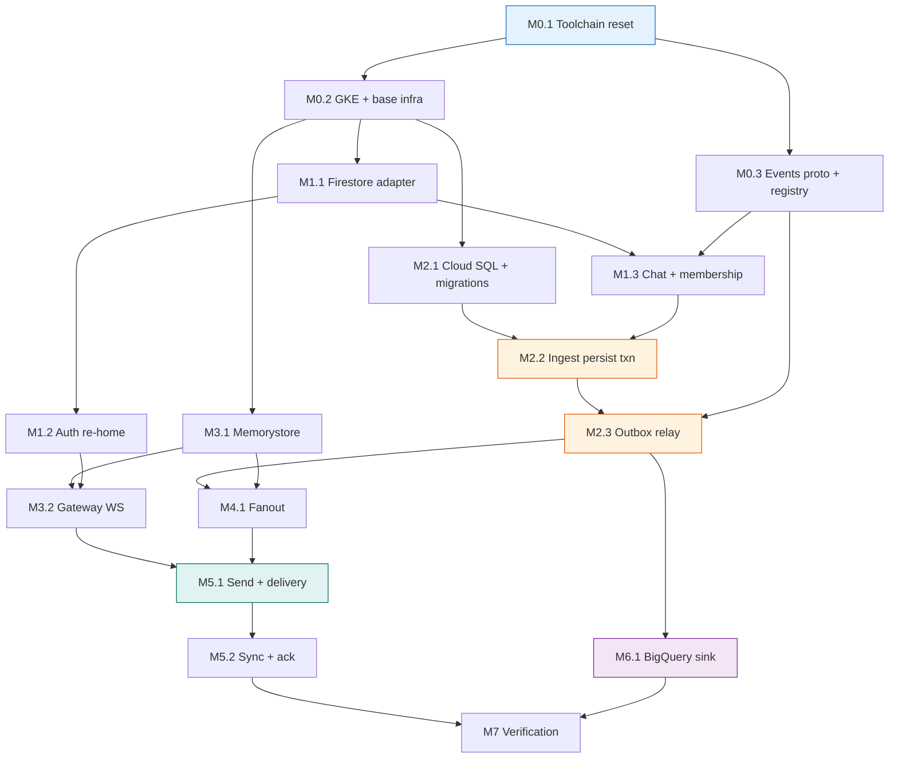

# Execution Plan — Realtime Messaging Platform (v2.0, GCP substrate)

- **Status**: Active
- **Created**: 2026-02-01
- **Re-split**: 2026-07-24 (v2.0 — modules → granular PRs on the GCP substrate)

> [!IMPORTANT]
> **This v2.0 plan supersedes the v1 (AWS) plan.** The substrate migration (ADR-021), analytics data lake (ADR-022), and two-store data model (ADR-023) changed the target from AWS (DynamoDB, MSK, ECS, ALB, LocalStack) to GCP (Cloud SQL Postgres + Firestore, Managed Kafka + Schema Registry, GKE Autopilot, Memorystore, BigQuery). The v1 PR/TF/IT structure is retired; work is now organized as **Modules → small vertical-slice PRs** (the v1 PRs were too large). The git history of the v1 build is preserved; nothing is deleted.

---

## Purpose

This document is the incremental implementation roadmap. It translates the ADRs (001–023) into a sequence of **modules**, each a coherent theme, decomposed into **small pull requests** that are individually shippable, testable, and reviewable. It is the artifact the first implementation session opens against.

---

## Migration Context — what exists, what changes

The v1 build reached PR-0 (skeleton) and PR-1 (auth), both merged on the AWS substrate. This is not thrown away; it is **re-homed**.

| v1 artifact | State | Disposition on GCP |
|---|---|---|
| PR-0 skeleton (Go, chi, `buf` protos, domain value objects, OTel, Docker toolchain, CI) | Merged | **Salvaged.** Language, protos, domain, and OTel are substrate-neutral. Adapters change (AWS SDK → GCP clients; `franz-go` MSK-IAM auth → SASL/mTLS), and LocalStack is removed (Module 0). |
| PR-1 auth logic (OTP, JWT issue/verify, refresh, sessions) | Merged | **Salvaged, re-homed.** The auth *logic* is substrate-neutral; only persistence moves DynamoDB → Firestore (Module 1). |
| TF-0 / TF-1 (AWS VPC/ECR/ECS/DynamoDB/Secrets Manager) | Applied then torn down | **Retired.** Replaced by GCP Terraform, folded into the modules (code + infra travel together). |

Three things are genuinely new versus v1: the **Postgres write path with a transactional outbox** (ADR-023), the **analytics data lake** (ADR-022), and **GKE + Managed-Kafka + Firestore + Memorystore** infrastructure. Everything else is a faithful re-homing of decisions ADR-021 proved 13/20 substrate-neutral.

---

## Guiding Principles

1. **Every PR ships working functionality.** No empty interfaces, no stubs, no "wire it up later." If a PR introduces a function, that function is called and tested.
2. **The M0.1 toolchain PR is the sole exception.** It re-homes the skeleton and stands up base infra with only health-check services — the toolchain and the deploy-and-destroy loop *are* the deliverable. No subsequent PR may introduce a service or endpoint without business logic behind it.
3. **No hidden stubs.** A registered-but-unreachable handler (e.g. Gateway's `DeliverMessage` before Fanout exists) must explicitly document why it exists and that no code path depends on it. "Registered but unreachable by design" is acceptable when architecturally justified; an unexplained empty handler is not.
4. **PRs are as small as possible while remaining coherent.** A PR is a complete vertical slice — proto/DDL → domain logic → adapter → tests — for one bounded capability. This is the v2.0 correction to v1's oversized PRs: prefer three small PRs over one large one.
5. **Code and infrastructure travel together.** Each PR ships the Terraform for the GCP resources it needs (a Cloud SQL table, a Kafka topic, a Firestore collection, a Memorystore instance), so `terraform apply` + deploy exercises the slice end-to-end. There is no separate infra track.
6. **Observability is woven, not bolted on.** Every PR ships its OTel metrics, structured logs, and trace propagation (ADR-012), exported to Managed Prometheus / Cloud Trace.
7. **Unit tests ship with code; contract/E2E tests follow** (Module 7). Unit tests are hermetic and run in the Docker workspace with no cloud dependency.
8. **No local cloud emulation; Docker toolchain retained** (ADR-021 Axis F). Dev targets a real GCP dev project via Terraform. `gcloud`/`terraform`/`kubectl`/`buf`/Go all run in the workspace container — nothing on the host. Deployment is **manual `terraform apply` / `terraform destroy`**; there is no push-triggered CD.

---

## Module & PR Structure

Eight modules. Each PR lists what it delivers, the ADRs it implements, its scope, and its key acceptance/invariant gates. `M<n>.<k>` is the PR id.

### Module 0 — Foundation & GCP Substrate Reset

*Re-home the skeleton to GCP; stand up base infra and the events schema.*

**M0.1 — Toolchain reset & GCP-targeting workspace** *(the one health-only PR, Principle 2)*
- **Delivers:** the Docker workspace now runs `gcloud`/`terraform`/`kubectl`/`buf`; LocalStack and `docker-compose` service-emulation removed; `Makefile`/CI updated; the four services still expose only `/healthz`.
- **ADRs:** ADR-021 (Axis F, Docker toolchain; no local emulation), ADR-014 (repo structure — retained), ADR-012 (OTel setup).
- **Gate:** `make ci-local` passes in-container; `buf generate` clean; no AWS SDK imports remain.

**M0.2 — Base Terraform: GKE + networking + registry + state**
- **Delivers:** Terraform for the GCP project wiring — VPC, **GKE Autopilot** cluster, **Artifact Registry**, GCS Terraform state backend, budget alert (ADR-021 Deployment Req §4). Four health services deploy to GKE and pass health checks; `terraform destroy` returns to zero.
- **ADRs:** ADR-021 (Decision B GKE; budget guard), ADR-014 (deployment topology, re-homed).
- **Gate:** deploy-and-destroy loop validated; **GKE external-LB backend timeout raised** for the Gateway path (ADR-021 Deployment Req §1) even before Gateway logic exists (config lands with the ingress).

**M0.3 — Events proto module & Schema Registry**
- **Delivers:** `proto/events/v1/*.proto` (`EnvelopeMeta`, `MessagePersisted`, `MembershipChanged`, `ChatCreated` — ADR-022 D1, ADR-023 fidelity); `buf` gen; the Managed-Kafka Schema Registry provisioning + publish flow; FULL compatibility wired into `buf breaking` CI.
- **ADRs:** ADR-022 (D1 wire format), ADR-011 (§5.1 FULL compatibility, re-homed).
- **Gate:** events generate; a round-trip encode/register/decode test passes; `buf breaking` rejects an incompatible change.

### Module 1 — Identity & Membership (Firestore)

*Re-home auth; add the chat/membership entity store.*

**M1.1 — Firestore adapter & infra**
- **Delivers:** Terraform for Firestore (native mode) + **TTL policy on `sessions.expires_at`**; `internal/firestore` client with typed collection helpers (`users`, `chats`, `memberships`, `sessions`) per ADR-023.
- **ADRs:** ADR-023 (Firestore model), ADR-021 (Decision A entity tier).
- **Gate:** CRUD round-trip against the dev Firestore; deterministic `memberships/{chat}__{user}` doc-id helper enforces the 54-byte bound.

**M1.2 — Auth re-home (OTP, tokens, sessions) to Firestore**
- **Delivers:** port the merged v1 auth logic from DynamoDB to Firestore; **auth validates `sessions.expires_at` in code** (ADR-023 invariant — TTL is GC, not the gate); OTP + JWT issue/verify/refresh/logout.
- **ADRs:** ADR-015 (auth), ADR-013 (abuse controls), ADR-006 (auth REST), ADR-023 (`sessions`, `users`).
- **Gate:** full OTP → token → refresh → logout flow green against dev Firestore; expired session rejected in code even if the doc still exists.

**M1.3 — Chat & membership lifecycle (Chat Mgmt)**
- **Delivers:** `internal/chatmgmt` REST/gRPC — create chat (direct dedup + group), add/remove/leave member, role change, mute, list chats, get chat; writes `chats`/`memberships` to Firestore; publishes `chats.created` / `memberships.changed` (at-least-once, ADR-022 D4).
- **ADRs:** ADR-016 (chat lifecycle), ADR-006 (chat REST), ADR-023 (`chats`, `memberships`), ADR-011/022 (entity events).
- **Key invariants:** at most one direct chat per pair under concurrency (Firestore transaction on the deterministic direct-pair doc id); group-size cap enforced; membership mutation on a direct chat rejected; event published only after the Firestore write commits.
- **Gate:** concurrent direct-chat creation → exactly one; owner cannot leave a group; events land in `memberships.changed`.

### Module 2 — Message Durability (Postgres + Outbox)

*The write path — ADR-023's core, the "ACK = Durability" backbone.*

**M2.1 — Cloud SQL adapter, migrations & infra**
- **Delivers:** Terraform for **Cloud SQL Postgres** + **PgBouncer** (transaction pooling; `pgx` prepared-statement caveat handled — ADR-021 Deployment Req §2); `golang-migrate` migrations for the five ADR-023 tables (`chat_counters`, `messages`, `idempotency_keys`, `delivery_state`, `outbox`) with all indexes; **`pg_cron` sweep** for `idempotency_keys`/`outbox` (Postgres has no native TTL); **all reads pinned to the primary**.
- **ADRs:** ADR-023 (Postgres DDL), ADR-021 (Decision A, pooling).
- **Gate:** migrations apply clean; primary-only connection routing asserted; sweep job scheduled.

**M2.2 — Ingest persist flow (check-before-allocate, one transaction)**
- **Delivers:** `internal/ingest` `PersistMessage` gRPC — the ADR-023 load-bearing transaction: fast-path idempotency `SELECT` (primary) → `BEGIN` claim-key + `UPDATE chat_counters … RETURNING` + insert message + insert outbox → `COMMIT`. Membership validated against Firestore (M1.3).
- **ADRs:** ADR-004 (Option 5 sequencing), ADR-001 (per-chat order, gaps, idempotency), ADR-023 (allocation SQL), ADR-003 (Postgres authority).
- **Key invariants:** no two persisted messages in a chat share a sequence (even across crash between claim and commit); retry with same `client_message_id` returns the *same* sequence, one row; gaps tolerated.
- **Gate:** 10-goroutine same-chat concurrency → unique monotonic sequences; kill-and-retry → single row, same sequence.

**M2.3 — Outbox relay → Managed Kafka**
- **Delivers:** the in-process relay poller in Ingest — **claim (`FOR UPDATE SKIP LOCKED`) → produce Protobuf event with `acks=all` → mark `published_at`** (never before the ack; ADR-023 CI-2); Managed-Kafka producer with murmur2/`chat_id` partitioning (ADR-011) and Schema-Registry-encoded `MessagePersisted` (ADR-022 D1).
- **ADRs:** ADR-022 (D2/D4 relay + effectively-once), ADR-023 (relay claim), ADR-011 (partitioning).
- **Key invariants:** an event exists on Kafka iff its message committed; a crash between claim and ack leaves the row reclaimable (at-least-once), never lost; per-chat order preserved (single owner per `chat_id`).
- **Gate:** message persisted → exactly one `MessagePersisted` on `messages.persisted`; induced crash mid-relay → event reappears, deduped downstream by `event_id`.

### Module 3 — Connection Plane (Gateway on GKE)

**M3.1 — Memorystore adapter & presence infra**
- **Delivers:** Terraform for **Memorystore (Redis)**; `internal/redis` presence adapter — atomic register/deregister Lua scripts, connection/user/gateway key families with TTL (ADR-010).
- **ADRs:** ADR-010 (presence/routing), ADR-021 (Decision D).
- **Gate:** register/deregister atomicity; TTL = 2× heartbeat; Redis wipe → re-register, no auth/data loss.

**M3.2 — Gateway WebSocket lifecycle & backpressure**
- **Delivers:** `internal/gateway` — WS upgrade + JWT auth (M1.2) + revocation check (fail-closed), heartbeat ping/pong, graceful drain on SIGTERM, backpressure/slow-client disconnect, presence registration. `DeliverMessage` gRPC registered but unreachable (Principle 3) until Module 5.
- **ADRs:** ADR-005 (protocol), ADR-009 (backpressure), ADR-010, ADR-013 (connection security), ADR-021 (LB 60-min/24-h WS caps — heartbeat under idle timeout).
- **Key invariants:** Redis loss ⇒ reconnection only, no data loss; revocation check with Redis down ⇒ deny (fail-closed).
- **Gate:** upgrade succeeds/refuses per JWT validity; missed heartbeat closes; SIGTERM drains.

### Module 4 — Fanout (Kafka consumer → delivery)

**M4.1 — Fanout worker & delivery watermarks**
- **Delivers:** `internal/fanout` consumer group on `messages.persisted` — membership resolve (Firestore + Memorystore cache, TTL), connection lookup, deliver via Redis pub/sub to the owning gateway; **offset commit after processing**; **delivery watermark to Postgres `delivery_state`** via the monotonic `INSERT … ON CONFLICT … WHERE last < new` (ADR-023, ADR-008 — note `delivery_state` is Postgres, not Firestore).
- **ADRs:** ADR-002 (fanout plane, best-effort), ADR-008 (watermarks), ADR-011 (consumer semantics), ADR-010 (routing), ADR-023 (`delivery_state`).
- **Key invariants:** watermark never exceeds the highest persisted sequence; offset committed after processing regardless of delivery success; never deliver to a non-member.
- **Gate:** offline recipient → logged, no retry; watermark max-wins; rebalance → no duplicate steady-state processing.

### Module 5 — End-to-End Wire-Up

**M5.1 — Send path + delivery push**
- **Delivers:** Gateway `send_message` → `PersistMessage` gRPC to Ingest → `send_message_ack` to sender; Fanout → Gateway `DeliverMessage` (now implemented) → `message` frame to recipient; Redis subscriber on `gateway:{id}`.
- **ADRs:** ADR-002 (inter-plane contracts), ADR-005 (send/message), ADR-008 (client ack path begins).
- **Key invariant (the headline):** **every `send_message_ack` corresponds to a committed Postgres record** — "ACK = Durability" (Artifact 00). Ingest crash between commit and response → client retries, idempotency yields one record.
- **Gate:** Client A → Client B receives via WS; ack after commit; per-chat order at recipient.

**M5.2 — Sync-on-reconnect + client ack → watermark**
- **Delivers:** `sync_request`/`sync_response` (`WHERE chat_id=$1 AND sequence > $watermark ORDER BY sequence`, paginated, primary read); client `ack` → `delivery_state` watermark update.
- **ADRs:** ADR-001 (sync completeness), ADR-005 (sync), ADR-008 (ack → watermark).
- **Key invariant:** sync returns exactly the unacked messages, ascending, no gaps/dupes.
- **Gate:** send 10, ack 5, reconnect → receive 6–10 in order; end-to-end trace covers all planes (ADR-012).

### Module 6 — Analytics Data Lake

**M6.1 — BigQuery sink & landing tables**
- **Delivers:** Terraform for the **BigQuery** dataset + landing tables (`raw_messages_persisted`, `raw_memberships_changed`, `raw_chats_created`; partition `DATE(occurred_at)`, cluster `chat_id`, **90-day** expiration) and the **BigQuery Sink V2 connector on Managed Kafka Connect** (Storage Write API, **UPSERT on `event_id`**, DLQ → `dead_letters`).
- **ADRs:** ADR-022 (all), ADR-003 (BigQuery as analytical consumer).
- **Key invariants:** metadata-only (no message body reaches BigQuery); effectively-once (relay at-least-once + `event_id` upsert); coverage = the three topics since sink activation (G1–G4 documented).
- **Gate:** events land in BigQuery; a replayed duplicate `event_id` collapses to one row; no `content` column exists.

### Module 7 — Verification (contract → E2E → chaos)

*Runs against the GCP dev project (no emulation). Reference client built incrementally.*

- **M7.1 — Auth & Ingest contract tests:** OTP/token flow; `PersistMessage` idempotency-under-concurrency, sequence monotonicity, murmur2 test vectors; outbox-relay effectively-once.
- **M7.2 — Chat lifecycle contract tests:** direct dedup, group two-phase, membership concurrency, entity-event verification.
- **M7.3 — E2E scenarios (ADR-017 §5):** basic flow, offline sync, idempotency-under-retry, per-chat ordering under load, cross-chat independence — asserting the M5.1 "ACK = Durability" invariant end-to-end.
- **M7.4 — Chaos (ADR-017 §6):** gateway crash, Memorystore wipe, Kafka partition-leader loss, **Cloud SQL failover**, relay crash mid-publish — validating correctness holds under failure. (Toxiproxy sidecars / GKE fault injection replace the AWS FIS approach.)

---

## Dependency Graph


```mermaid
flowchart TD
    M01["M0.1 Toolchain reset"] --> M02["M0.2 GKE + base infra"]
    M01 --> M03["M0.3 Events proto + registry"]
    M02 --> M11["M1.1 Firestore adapter"]
    M11 --> M12["M1.2 Auth re-home"]
    M11 --> M13["M1.3 Chat + membership"]
    M03 --> M13
    M02 --> M21["M2.1 Cloud SQL + migrations"]
    M21 --> M22["M2.2 Ingest persist txn"]
    M13 --> M22
    M22 --> M23["M2.3 Outbox relay"]
    M03 --> M23
    M02 --> M31["M3.1 Memorystore"]
    M31 --> M32["M3.2 Gateway WS"]
    M12 --> M32
    M23 --> M41["M4.1 Fanout"]
    M31 --> M41
    M32 --> M51["M5.1 Send + delivery"]
    M41 --> M51
    M51 --> M52["M5.2 Sync + ack"]
    M23 --> M61["M6.1 BigQuery sink"]
    M52 --> M7["M7 Verification"]
    M61 --> M7
    style M01 fill:#e3f2fd,stroke:#1565c0
    style M22 fill:#fff3e0,stroke:#e65100
    style M23 fill:#fff3e0,stroke:#e65100
    style M51 fill:#e0f2f1,stroke:#00695c
    style M61 fill:#f3e5f5,stroke:#7b1fa2
```

**Critical path:** M0.1 → M0.2 → M2.1 → M2.2 → M2.3 → M4.1 → M5.1 → M5.2. Identity (M1) and connection (M3) parallelize with durability (M2) once base infra (M0.2) lands.

---

## ADR Traceability Matrix

| ADR | Topic | Module(s) |
|---|---|---|
| ADR-001 | Ordering & idempotency | M2.2, M5.2 |
| ADR-002 | Three-plane architecture | M2.2, M3.2, M4.1, M5.1 |
| ADR-003 | Source of truth (Postgres/Firestore→Kafka→Redis; +BigQuery) | M2.2, M4.1, M6.1 |
| ADR-004 | Sequence allocation (Option 5) | M2.2 |
| ADR-005 | WebSocket protocol | M3.2, M5.1, M5.2 |
| ADR-006 | REST API | M1.2, M1.3 |
| ADR-007 | Data model (superseded → ADR-023) | see ADR-023 |
| ADR-008 | Delivery acks / watermarks | M4.1, M5.2 |
| ADR-009 | Failure handling / backpressure | M3.2, M4.1, M7.4 |
| ADR-010 | Presence & routing (Memorystore) | M3.1, M3.2, M4.1 |
| ADR-011 | Kafka topics (Managed Kafka) | M0.3, M2.3, M4.1 |
| ADR-012 | Observability (Managed Prometheus/Trace) | all modules |
| ADR-013 | Security & abuse | M1.2, M3.2 |
| ADR-014 | Tech stack (superseded → ADR-021) | see ADR-021 |
| ADR-015 | Authentication | M1.2 |
| ADR-016 | Chat lifecycle | M1.3 |
| ADR-017 | Test pyramid | M7.1–M7.4 |
| **ADR-021** | GCP substrate | M0.2, M2.1, M3.1, all infra |
| **ADR-022** | Analytics data lake | M0.3, M2.3, M6.1 |
| **ADR-023** | Two-store data model | M1.1, M2.1, M2.2, M4.1 |

---

## Estimated Sequencing

Rough, single-developer, AI-augmented; modules overlap where the graph allows.

```
Phase 1  Foundation      M0.1 -> M0.2 -> M0.3
Phase 2  Identity        M1.1 -> M1.2 -> M1.3         (parallels Phase 3)
Phase 3  Durability      M2.1 -> M2.2 -> M2.3         (critical path)
Phase 4  Connection      M3.1 -> M3.2                 (parallels Phase 3)
Phase 5  Fanout          M4.1
Phase 6  Wire-up         M5.1 -> M5.2                 ("ACK = Durability" testable E2E)
Phase 7  Data lake       M6.1                         (parallels from M2.3)
Phase 8  Verification    M7.1 -> M7.2 -> M7.3 -> M7.4
```

Deploy-and-destroy per session throughout — no environment persists between working sessions (ADR-021).

---

## Non-Goals & Explicit Tradeoffs

Deliberate scope boundaries, carried from v1 and updated for the GCP substrate.

**Delivery:** no exactly-once delivery (at-most-once push + at-least-once sync; client dedupes by `message_id`); no read receipts. **Ordering:** per-chat total order only — no global or causal cross-chat ordering. **Features:** no push notifications (APNs/FCM), media/attachments, message edit/delete, or E2E encryption. **Infrastructure (GCP-updated):** single-region GCP; **no push-triggered CD** (manual `terraform apply`/`destroy`, ADR-021); **no local cloud emulation** (Docker toolchain only); **data lake is metadata-only** (no message content, ADR-022 D3). **Analytics history:** entity mutation/deletion history beyond `memberships.changed` is a deferred v2 lake addition (ADR-022 G2).

| Tradeoff | Chosen | Gave up | Why |
|---|---|---|---|
| Durability over latency | ACK after Postgres commit | sub-10ms send | "ACK = Durability" is foundational |
| Simplicity over throughput | Postgres counter row per chat, one txn | horizontal per-chat write scaling | correct-by-construction; the per-chat row lock is the same ceiling DynamoDB had |
| Availability over consistency in Fanout | best-effort push + sync | guaranteed real-time delivery | fanout failure loses nothing — messages are persisted |
| Effectively-once over exactly-once (lake) | at-least-once relay + `event_id` upsert | end-to-end exactly-once | correctness rests on the upsert key, auditable (ADR-022) |
| Fail-closed security | Redis down → reject auth/connections | 100% auth uptime | revocation/rate-limit must never be bypassed |
| Managed services over self-host | Cloud SQL / Firestore / Managed Kafka / Memorystore | some cost control | deploy-and-destroy + $5,238 credit makes managed correct for the lab (ADR-021) |

---

## Open Questions

1. **Proto/DDL evolution mid-development:** changes go in the PR that needs them (`buf breaking` + `golang-migrate` catch incompatibilities), not a separate "schema update" PR.
2. **Terraform module granularity:** each PR ships its own resources, composed under a root module; first-time apply is incremental (data → cache → Kafka) per ADR-003's authority order, mirroring the v1 TF-2 blast-radius note.
3. **Reference client (ADR-017 §1):** built incrementally across M7.1–M7.3 (auth client → message client → chat client), composed for E2E in M7.3.
4. **`pg_cron` availability on Cloud SQL:** confirm the extension is enabled in the chosen Cloud SQL tier during M2.1; fall back to a scheduled Cloud Run/GKE CronJob sweep if not.

---

## Document Revision History

| Date | Change | Author |
|---|---|---|
| 2026-02-01 | Initial version (v1, AWS) — PR-0…PR-6, TF-0…TF-3, IT-1…IT-5; correctness invariants; Non-Goals | Alexis + Claude |
| 2026-07-24 | **v2.0 re-split (GCP substrate).** Retired the v1 PR/TF/IT structure; reorganized into Modules 0–7 with granular vertical-slice PRs on the GCP substrate (ADR-021/022/023). Folded infra into each PR (code + Terraform travel together; no separate TF track; no CD). Added Migration Context (salvage/re-home map), GCP traceability, and updated Non-Goals/Tradeoffs (Postgres counter, metadata-only lake, single-region GCP, no CD, no local emulation). Preserved Guiding Principles and correctness-invariant discipline. | Alexis + Claude |
