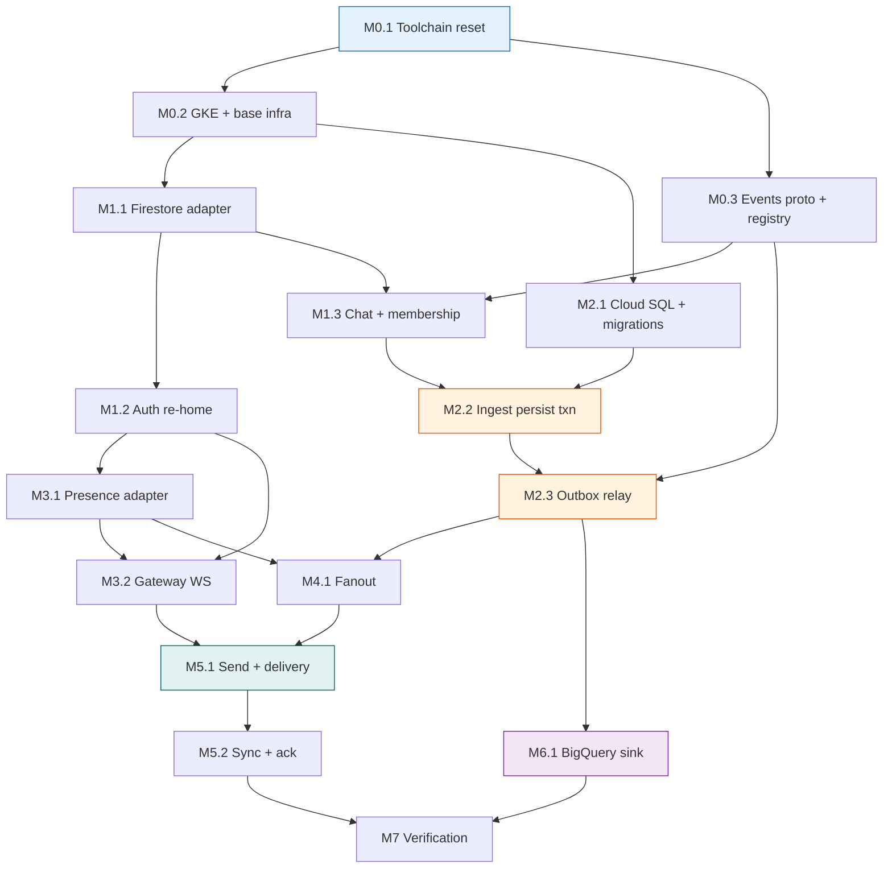

# Execution Plan — Realtime Messaging Platform (v2.5, GCP substrate)

- **Status**: Active
- **Created**: 2026-02-01
- **Re-split**: 2026-07-24 (v2.0 — modules → granular PRs on the GCP substrate)
- **Last amended**: 2026-07-26 (v2.5 — M1.2 done; see Document Revision History)

> [!IMPORTANT]
> **This v2.0 plan supersedes the v1 (AWS) plan.** The substrate migration (ADR-021), analytics data lake (ADR-022), and two-store data model (ADR-023) changed the target from AWS (DynamoDB, MSK, ECS, ALB, LocalStack) to GCP (Cloud SQL Postgres + Firestore, Managed Kafka + Schema Registry, GKE Autopilot, Memorystore, BigQuery). The v1 PR/TF/IT structure is retired; work is now organized as **Modules → small vertical-slice PRs** (the v1 PRs were too large). The git history of the v1 build is preserved; nothing is deleted.

---

## Purpose

This document is the incremental implementation roadmap. It translates the ADRs (001–023) into a sequence of **modules**, each a coherent theme, decomposed into **small pull requests** that are individually shippable, testable, and reviewable. It is the artifact the first implementation session opens against.

---

## Migration Context — what exists, what changes

The v1 build reached PR-0 (skeleton) and PR-1 (auth), both merged on the AWS substrate. This is not thrown away; it is **re-homed**.

| v1 artifact | State | Disposition on GCP |
|---|---|---|
| PR-0 skeleton (Go, chi, `buf` protos, domain value objects, OTel, Docker toolchain, CI) | Merged | **Salvaged.** Language, protos, domain, and OTel are substrate-neutral. Adapters change (AWS SDK → GCP clients; `franz-go` MSK-IAM auth → SASL/mTLS), and LocalStack is removed (Module 0). |
| PR-1 auth logic (OTP, JWT issue/verify, refresh, sessions) | Merged | **Salvaged, re-homed.** The auth *logic* is substrate-neutral; only persistence moves DynamoDB → Firestore (Module 1). |
| TF-0 / TF-1 (AWS VPC/ECR/ECS/DynamoDB/Secrets Manager) | Applied then torn down | **Retired.** Replaced by GCP Terraform, folded into the modules (code + infra travel together). |

Three things are genuinely new versus v1: the **Postgres write path with a transactional outbox** (ADR-023), the **analytics data lake** (ADR-022), and **GKE + Managed-Kafka + Firestore + Memorystore** infrastructure. Everything else is a faithful re-homing of decisions ADR-021 proved 13/20 substrate-neutral.

---

## Guiding Principles

1. **Every PR ships working functionality.** No empty interfaces, no stubs, no "wire it up later." If a PR introduces a function, that function is called and tested.
2. **The M0.1 toolchain PR is the sole exception.** It re-homes the skeleton and stands up base infra with only health-check services — the toolchain and the deploy-and-destroy loop *are* the deliverable. No subsequent PR may introduce a service or endpoint without business logic behind it.
3. **No hidden stubs.** A registered-but-unreachable handler (e.g. Gateway's `DeliverMessage` before Fanout exists) must explicitly document why it exists and that no code path depends on it. "Registered but unreachable by design" is acceptable when architecturally justified; an unexplained empty handler is not.
4. **PRs are as small as possible while remaining coherent.** A PR is a complete vertical slice — proto/DDL → domain logic → adapter → tests — for one bounded capability. This is the v2.0 correction to v1's oversized PRs: prefer three small PRs over one large one.
5. **Code and infrastructure travel together.** Each PR ships the Terraform for the GCP resources it needs (a Cloud SQL table, a Kafka topic, a Firestore collection, a Memorystore instance), so `terraform apply` + deploy exercises the slice end-to-end. There is no separate infra track.
6. **Observability is woven, not bolted on.** Every PR ships its OTel metrics, structured logs, and trace propagation (ADR-012), exported to Managed Prometheus / Cloud Trace.
7. **Unit tests ship with code; contract/E2E tests follow** (Module 7). Unit tests are hermetic and run in the Docker workspace with no cloud dependency.
8. **No local cloud emulation; Docker toolchain retained** (ADR-021 Axis F). Dev targets a real GCP dev project via Terraform. `gcloud`/`terraform`/`kubectl`/`buf`/Go all run in the workspace container — nothing on the host. Deployment is **manual `terraform apply` / `terraform destroy`**; there is no push-triggered CD.

---

## Module & PR Structure

Eight modules. Each PR lists what it delivers, the ADRs it implements, its scope, and its key acceptance/invariant gates. `M<n>.<k>` is the PR id.

### Module 0 — Foundation & GCP Substrate Reset

*Re-home the skeleton to GCP; stand up base infra and the events schema.*

**M0.1 — Toolchain reset & GCP-targeting workspace** *(the one health-only PR, Principle 2)* — ✅ **Done**
- **Status:** ✅ **Done** (PR #11). Gate met: `make ci-local` green inside the new GCP toolbox (gcloud/terraform/kubectl/buf), `buf generate` clean, zero `aws-sdk-go` imports. The AWS SDK, LocalStack, and Redpanda were removed; chatmgmt reduced to `/healthz` with its substrate-neutral auth logic retained for the M1.2 re-home. Retired AWS `terraform/` left in place for M0.2 to replace.
- **Delivers:** the Docker workspace now runs `gcloud`/`terraform`/`kubectl`/`buf`; LocalStack and `docker-compose` service-emulation removed; `Makefile`/CI updated; the four services still expose only `/healthz`.
- **ADRs:** ADR-021 (Axis F, Docker toolchain; no local emulation), ADR-014 (repo structure — retained), ADR-012 (OTel setup).
- **Gate:** `make ci-local` passes in-container; `buf generate` clean; no AWS SDK imports remain.

**M0.2 — Base Terraform: GKE + networking + registry + state** — ✅ **Done**
- **Status:** ✅ **Done** (PR #12). Gate met: the full deploy-and-destroy loop ran live — `deploy` brought up 4 pods `1/1` behind an external LB (`/healthz` → 200), `teardown` destroyed 16 resources back to zero. The Gateway `BackendConfig` (`timeoutSec = 86400`) lands with the ingress, discharging ADR-021 Deployment Req §1. Five first-deploy bugs were fixed in the same PR: the budget API needs `user_project_override` + `billing_project`; the billing account's currency is **MXN**, so `currency_code` must be inherited, not hardcoded; the default compute SA needs an explicit `roles/artifactregistry.reader` binding; images must be built `--platform linux/amd64` for the Autopilot nodes; ADC needs a quota project.
- **Delivers:** Terraform for the GCP project wiring — VPC, **GKE Autopilot** cluster, **Artifact Registry**, GCS Terraform state backend, budget alert (ADR-021 Deployment Req §4). Four health services deploy to GKE and pass health checks; `terraform destroy` returns to zero.
- **ADRs:** ADR-021 (Decision B GKE; budget guard), ADR-014 (deployment topology, re-homed).
- **Gate:** deploy-and-destroy loop validated; **GKE external-LB backend timeout raised** for the Gateway path (ADR-021 Deployment Req §1) even before Gateway logic exists (config lands with the ingress).

**M0.3 — Events proto module & Schema Registry** — ✅ **Done**
- **Status:** ✅ **Done**. Gate met live against `messaging_dev` in `us-central1`: five schemas registered (`wkt.timestamp` id=1, `events.v1.envelope` id=2, `messages.persisted-value` id=3, `memberships.changed-value` id=4, `chats.created-value` id=5), each reading back at **FULL**; the encode → register → decode round-trip passes and re-publishing identical text returns the same IDs; `buf breaking` rejects a renumbered field. Everything torn down afterwards.
- **Delivers:** `proto/events/v1/*.proto` (`EnvelopeMeta`, `MessagePersisted`, `MembershipChanged`, `ChatCreated` — ADR-022 D1, ADR-023 fidelity); `buf` gen; the Managed-Kafka Schema Registry provisioning + publish flow; FULL compatibility wired into `buf breaking` CI.
- **ADRs:** ADR-022 (D1 wire format), ADR-011 (§5.1 FULL compatibility, re-homed).
- **Gate:** events generate; a round-trip encode/register/decode test passes; `buf breaking` rejects an incompatible change.
- **Substrate corrections found by probing the live service (they change *how*, not *what*):**
  1. **The schema registry has no Terraform resource.** Neither `hashicorp/google` nor `google-beta` ships `google_managed_kafka_schema_registry` — only `managed_kafka_{cluster,topic,acl,connect_cluster,connector}`. The registry is therefore created imperatively in `scripts/deploy.sh` (and deleted in `scripts/teardown.sh`), *not* by Terraform. Chosen over a `terraform_data` + `local-exec` wrapper so state never claims to own a resource it cannot manage.
  2. **A Managed Kafka cluster in the same region is a prerequisite for the registry** (`FAILED_PRECONDITION`), so the cluster moves from M2.3 into M0.3 (minimum size: 3 vCPU / 3 GiB, no topics — topics stay in M2.3 with the producer, per Principle 3). Sequencing only: ADR-021 Acceptance Condition §1 (wire format fixed before the cluster exists) is already discharged by ADR-022, and the same PR fixes the format.
  3. **One message type per schema.** A four-message `events.proto` is rejected with *"Too many message types specified in schema definition"*, so the file is split one-message-per-file and each subject declares its imports as references (ADR-022 v1.2). The wire message index is consequently always 0.
  4. **The registry resolves no imports** — not even the Protobuf well-known types. `google/protobuf/timestamp.proto` is vendored under `proto/third_party` (excluded from the buf module) and registered as its own subject.
  5. **Naming rules:** registry IDs allow only letters, digits and underscores (`messaging-dev` is rejected, `messaging_dev` is not); subject names may not begin with `google`, hence `wkt.timestamp`.
  6. **Client interop:** franz-go's typed compatibility read expects Confluent's `compatibilityLevel` on `GET /config/{subject}`, while GCP returns `compatibility` — the helper silently reports an empty level, so the read-back accepts both spellings. Its 5-second default HTTP timeout is also too tight for this registry and is raised to 30s.
- **`buf breaking` needs no new CI wiring:** `proto/buf.yaml` uses the `FILE` breaking category — strictly stronger than wire + JSON compatibility — and the `proto` job already runs `buf breaking` against `main` on every PR. `proto/events/v1` sits inside the same module, so it is covered on landing. FULL is also set registry-side by the publish flow.

### Module 1 — Identity & Membership (Firestore)

*Re-home auth; add the chat/membership entity store.*

**M1.1 — Firestore adapter & infra** — ✅ **Done**
- **Status:** ✅ **Done**. Gate met live against `messaging-dev` in `us-central1`: the CRUD round-trip passes for all four collections, the composite membership ID is the derived 74-byte value and serves the point lookup plus both list directions from one document, an expired session reads back successfully with `IsExpired` true (TTL is GC, not the gate), and unknown IDs/phones yield `domain.ErrNotFound`. The TTL policy on `sessions.expires_at` reports `state: ACTIVE`. `terraform destroy` **removed** the database rather than abandoning it — the `deletion_policy` finding below, verified rather than assumed.
- **Four schema notes settled while implementing** (details in the ADR-023 changelog): `expires_at` must be a **timestamp**, not the DynamoDB-era RFC3339 string, because TTL policies only act on timestamp fields; `sessions` gains `prev_token_hash` and `token_generation`, which ADR-015 requires and ADR-023's list omitted; the composite membership ID is **74 bytes** (UUID identifiers), not the 54 the ADR computed from ULIDs — and UUIDs are the better choice regardless, since Firestore documents warn against monotonically increasing document IDs, which is exactly what a ULID prefix produces; the DynamoDB `ttl` attribute has no counterpart.
- **Two provisioning findings:** `google_firestore_database.deletion_policy` defaults to **ABANDON**, which leaves the database and its data behind while reporting a successful destroy (the GKE `deletion_protection` trap again) — it is set to `DELETE`, with `DELETE_PROTECTION_DISABLED`. And deleting a `google_firestore_field` takes **~6 minutes**, so a teardown that includes Firestore is dominated by that field operation, not by the database.
- **Delivers:** Terraform for Firestore (native mode) + **TTL policy on `sessions.expires_at`**; `internal/firestore` client with typed collection helpers (`users`, `chats`, `memberships`, `sessions`) per ADR-023.
- **ADRs:** ADR-023 (Firestore model), ADR-021 (Decision A entity tier).
- **Gate:** CRUD round-trip against the dev Firestore; deterministic `memberships/{chat}__{user}` doc-id helper enforces the 54-byte bound.

**M1.2 — Auth re-home (OTP, tokens, sessions) to Firestore** — ✅ **Done**
- **Status:** ✅ **Done**. Both halves of the gate met live against `aelexs-rtm` in `us-central1`. **Firestore half:** the conditional OTP write refuses a live code and accepts once it has lapsed (the case a bare `Create()` gets wrong for the ~24 h until TTL runs); attempt increments are atomic under five concurrent guesses; registration commits user + session + sentinel + consumed OTP or nothing; a replayed or expired OTP leaves no user and no session behind; **five goroutines racing one valid OTP produce exactly one user**; rotation is single-use and a refused rotation preserves `prev_token_hash`; and `expires_at` survives the round-trip byte-identically, so the MAC still verifies against what Firestore returns. **Flow half:** OTP → registration → replay refused → login from a second device → refresh → reuse detected and the *session* revoked → logout → per-phone rate limit enforced through Memorystore. Infrastructure deployed from scratch and torn down.
- **Three defects the live run found**, none reachable from unit tests (all fixed in-PR):
  1. **Key discovery was ungrantable.** `RemoteKeyStore` listed secrets by prefix to discover valid `kid` values, and the pod crash-looped on `PermissionDenied` for `secretmanager.secrets.list`. That permission **cannot be scoped to a secret** — listing is a query over the project's whole secret collection — so the per-secret accessor bindings could never satisfy it, and supporting it would have meant `roles/secretmanager.viewer` project-wide. Keys are resolved by name instead; the cost is one accepted `kid` at a time, so a rotation forces re-auth bounded by the 1 h access-token lifetime. **Workload Identity itself was correct on the first deploy** — the pod reached Secret Manager as its own service account, and the failure was one missing permission, not a missing identity.
  2. **A consumed OTP blocked reissue** for the rest of its five-minute window. ADR-015 §1.2's condition has three disjuncts (absent, verified, expired) and the implementation had two. The ADR was right; the code was wrong.
  3. **False bools vanished from REST responses.** protojson omits zero values, so a returning user's `VerifyOTP` carried no `is_new_user` at all — a client reading "absent" as "false" cannot distinguish that from a field the server never set. The mux now sets `EmitUnpopulated`.
- **Two provisioning notes:** Private Services Access peering created in **1m3s** and Memorystore attached over it in **4m25s**, so the `PRIVATE_SERVICE_ACCESS` connect mode chosen to avoid Autopilot's `ip-masq-agent` limitation works without further configuration. `kubectl wait` lost its HTTP/2 connection during the rollout and failed the deploy script even though every pod became healthy — a client-side flake, not a deploy failure.
- **Delivers:** port the merged v1 auth logic from DynamoDB to Firestore; **auth validates `sessions.expires_at` in code** (ADR-023 invariant — TTL is GC, not the gate); OTP + JWT issue/verify/refresh/logout; the ChatMgmt composition root returns (gRPC + grpc-gateway), retired at M0.1.
- **ADRs:** ADR-015 (auth, amended v1.1 for GCP), ADR-013 (abuse controls), ADR-006 (auth REST), ADR-023 v1.2 (`sessions`, `users`, `otp_requests`, `phone_index`).
- **Gate:** full OTP → token → refresh → logout flow green against dev Firestore; expired session rejected in code even if the doc still exists.
- **Four scope decisions settled here** (each recorded in the ADR it amends, not only in this plan):
  1. **`otp_requests` lands in Firestore** with its own TTL policy — ADR-023 had deferred its home to "when auth is re-implemented", which is this PR (ADR-023 v1.2). The conditional put becomes a **transaction**, not a `Create()`: TTL lag (≤24 h) against a 5-minute credential means an expired OTP document is still present, and a bare `Create()` would lock a phone number out for a day.
  2. **The `PHONE#` uniqueness sentinel survives as `phone_index/{phone_hash}`.** Firestore's strong consistency does *not* retire ADR-015 §5.1's argument — a transaction locks documents it reads, and a query matching nothing locks nothing, so concurrent first-time registrations would both commit. `tx.Create` restores `attribute_not_exists`.
  3. **`otp_ciphertext` / KMS same-OTP re-send is dropped** (ADR-015 v1.1 Appendix F) — never implemented, needs Cloud KMS on the OTP path, and the in-flight-SMS property it protected holds anyway when nothing is re-sent.
  4. **Memorystore moves forward from M3.1 into this PR.** Rate limiting and revocation are Redis-backed and ADR-013 requires the revocation check to fail closed, so the gate cannot run without it — Principle 5, code and infra travel together.
- **Testing consequence of decision 4:** Memorystore has **no public endpoint** (private VPC IP), unlike Firestore's public API. The M1.1 pattern of driving a live gate from the toolbox therefore only covers the Firestore half. The flow gate runs against the **deployed pod** via `kubectl port-forward` — the first module where the gate must execute inside the cluster's network, which M3.x and M7 will need regardless.

**M1.3 — Chat & membership lifecycle (Chat Mgmt)**
- **Delivers:** `internal/chatmgmt` REST/gRPC — create chat (direct dedup + group), add/remove/leave member, role change, mute, list chats, get chat; writes `chats`/`memberships` to Firestore; publishes `chats.created` / `memberships.changed` (at-least-once, ADR-022 D4).
- **ADRs:** ADR-016 (chat lifecycle), ADR-006 (chat REST), ADR-023 (`chats`, `memberships`), ADR-011/022 (entity events).
- **Key invariants:** at most one direct chat per pair under concurrency (Firestore transaction on the deterministic direct-pair doc id); group-size cap enforced; membership mutation on a direct chat rejected; event published only after the Firestore write commits.
- **Gate:** concurrent direct-chat creation → exactly one; owner cannot leave a group; events land in `memberships.changed`.

### Module 2 — Message Durability (Postgres + Outbox)

*The write path — ADR-023's core, the "ACK = Durability" backbone.*

**M2.1 — Cloud SQL adapter, migrations & infra**
- **Delivers:** Terraform for **Cloud SQL Postgres** + **PgBouncer** (transaction pooling; `pgx` prepared-statement caveat handled — ADR-021 Deployment Req §2); `golang-migrate` migrations for the five ADR-023 tables (`chat_counters`, `messages`, `idempotency_keys`, `delivery_state`, `outbox`) with all indexes; **hourly `pg_cron` sweeps** — `idempotency_keys WHERE expires_at < now()` and `outbox WHERE published_at IS NOT NULL AND published_at < now() - interval '1 day'` (**keyed on `published_at`, so the sweep can delete only already-published rows — an unpublished outbox row, however far behind the relay, is never swept, so a slow relay cannot silently lose messages**); **all reads pinned to the primary**.
- **ADRs:** ADR-023 (Postgres DDL), ADR-021 (Decision A, pooling).
- **Gate:** migrations apply clean; primary-only connection routing asserted; sweep job scheduled.

**M2.2 — Ingest persist flow (check-before-allocate, one transaction)**
- **Delivers:** `internal/ingest` `PersistMessage` gRPC — the ADR-023 load-bearing transaction: fast-path idempotency `SELECT` (primary) → `BEGIN` claim-key + `UPDATE chat_counters … RETURNING` + insert message + insert outbox → `COMMIT`. Membership validated against Firestore (M1.3).
- **ADRs:** ADR-004 (Option 5 sequencing), ADR-001 (per-chat order, gaps, idempotency), ADR-023 (allocation SQL), ADR-003 (Postgres authority).
- **Key invariants:** no two persisted messages in a chat share a sequence (even across crash between claim and commit); retry with same `client_message_id` returns the *same* sequence, one row; gaps tolerated.
- **Gate:** 10-goroutine same-chat concurrency → unique monotonic sequences; kill-and-retry → single row, same sequence.

**M2.3 — Outbox relay → Managed Kafka**
- **Delivers:** the in-process relay poller in Ingest — **claim (`FOR UPDATE SKIP LOCKED`) → produce Protobuf event with `acks=all` → mark `published_at`** (never before the ack; ADR-023 CI-2); Managed-Kafka producer with murmur2/`chat_id` partitioning (ADR-011) and Schema-Registry-encoded `MessagePersisted` (ADR-022 D1).
- **ADRs:** ADR-022 (D2/D4 relay + effectively-once), ADR-023 (relay claim), ADR-011 (partitioning).
- **Relay topology (required for per-chat order):** the relay runs as a **single replica** (the ADR-023 default) — or, if ever scaled out, each worker takes a Postgres advisory lock on `hash(chat_id)` so exactly one worker owns a chat at a time. `FOR UPDATE SKIP LOCKED` gives row-level mutual exclusion, **not** per-chat sequential ordering: with N replicas, instances could claim seq 1/2/3 of one chat and race them onto the same Kafka partition (murmur2 on `chat_id`), violating ADR-001's per-chat total order. `acks=all` + producer idempotence do not fix this — it is a cross-producer ordering problem. Single-replica is the simplest-correct choice for the lab; its only cost is a brief publish pause on restart, bounded because the outbox is durable and the relay resumes from it. *(Future, out of scope: advisory-lock-per-`chat_id` scale-out is limited by `pg_advisory_lock`'s finite hash buckets — distinct chats colliding in a bucket serialize unnecessarily; the real scale-out answer is a **partitioned-consumer relay** where each instance owns a range of Kafka partitions rather than `chat_id`s. Only relevant if single-replica ever becomes the bottleneck.)*
- **Key invariants:** an event exists on Kafka iff its message committed; a crash between claim and ack leaves the row reclaimable (at-least-once), never lost; **per-chat Kafka order is preserved by the single-owner-per-`chat_id` topology above, not by `SKIP LOCKED` alone**.
- **Gate:** message persisted → exactly one `MessagePersisted` on `messages.persisted`; induced crash mid-relay → event reappears, deduped downstream by `event_id`.

### Module 3 — Connection Plane (Gateway on GKE)

**M3.1 — Presence adapter** *(Memorystore infra moved to M1.2)*
- **Delivers:** the `internal/redis` presence adapter — atomic register/deregister Lua scripts, connection/user/gateway key families with TTL (ADR-010). **The Memorystore instance itself, and the private-services-access range it connects over, ship in M1.2**, which needs Redis for ADR-013's fail-closed rate limiting and revocation and therefore owns the Terraform under Principle 5. This PR adds no infrastructure.
- **ADRs:** ADR-010 (presence/routing), ADR-021 (Decision D).
- **Gate:** register/deregister atomicity; TTL = 2× heartbeat; Redis wipe → re-register, no auth/data loss.

**M3.2 — Gateway WebSocket lifecycle & backpressure**
- **Delivers:** `internal/gateway` — WS upgrade + JWT auth (M1.2) + revocation check (fail-closed), heartbeat ping/pong, graceful drain on SIGTERM, backpressure/slow-client disconnect, presence registration. `DeliverMessage` gRPC registered but unreachable (Principle 3) until Module 5.
- **ADRs:** ADR-005 (protocol), ADR-009 (backpressure), ADR-010, ADR-013 (connection security), ADR-021 (LB 60-min/24-h WS caps — heartbeat under idle timeout).
- **Key invariants:** Redis loss ⇒ reconnection only, no data loss; revocation check with Redis down ⇒ deny (fail-closed).
- **Gate:** upgrade succeeds/refuses per JWT validity; missed heartbeat closes; SIGTERM drains.

### Module 4 — Fanout (Kafka consumer → delivery)

**M4.1 — Fanout worker & delivery watermarks**
- **Delivers:** `internal/fanout` consumer group on `messages.persisted` — membership resolve (Firestore + Memorystore cache, TTL), connection lookup, deliver via Redis pub/sub to the owning gateway; **offset commit after processing**; **delivery watermark to Postgres `delivery_state`** via the monotonic `INSERT … ON CONFLICT … WHERE last < new` (ADR-023, ADR-008 — note `delivery_state` is Postgres, not Firestore).
- **ADRs:** ADR-002 (fanout plane, best-effort), ADR-008 (watermarks), ADR-011 (consumer semantics), ADR-010 (routing), ADR-023 (`delivery_state`).
- **Key invariants:** watermark never exceeds the highest persisted sequence; offset committed after processing regardless of delivery success; never deliver to a non-member.
- **Watermark failure & concurrency (safe by design):** if the `delivery_state` write fails *after* the Kafka offset commits, the watermark simply **lags** — sync-on-reconnect (M5.2) then re-sends those messages, which the client dedupes by `message_id` (at-least-once push; a documented non-goal, not data loss). Under a consumer rebalance, two Fanout instances may write the same chat's watermark out of order; the `ON CONFLICT … WHERE last < new` update is **max-wins and commutative**, so it converges to the correct maximum regardless of application order — "never exceeds highest persisted" is a bound, not an ordering requirement.
- **Gate:** offline recipient → logged, no retry; watermark max-wins; rebalance → no duplicate steady-state processing.

### Module 5 — End-to-End Wire-Up

**M5.1 — Send path + delivery push**
- **Delivers:** Gateway `send_message` → `PersistMessage` gRPC to Ingest → `send_message_ack` to sender; Fanout → Gateway `DeliverMessage` (now implemented) → `message` frame to recipient; Redis subscriber on `gateway:{id}`.
- **ADRs:** ADR-002 (inter-plane contracts), ADR-005 (send/message), ADR-008 (client ack path begins).
- **Key invariant (the headline):** **every `send_message_ack` corresponds to a committed Postgres record** — "ACK = Durability" (Artifact 00). Ingest crash between commit and response → client retries, idempotency yields one record.
- **Gate:** Client A → Client B receives via WS; ack after commit; per-chat order at recipient.

**M5.2 — Sync-on-reconnect + client ack → watermark**
- **Delivers:** `sync_request`/`sync_response` (`WHERE chat_id=$1 AND sequence > $watermark ORDER BY sequence`, paginated, primary read); client `ack` → `delivery_state` watermark update.
- **ADRs:** ADR-001 (sync completeness), ADR-005 (sync), ADR-008 (ack → watermark).
- **Key invariant:** sync returns exactly the unacked messages, ascending, no gaps/dupes.
- **Gate:** send 10, ack 5, reconnect → receive 6–10 in order; end-to-end trace covers all planes (ADR-012).

### Module 6 — Analytics Data Lake

**M6.1 — BigQuery sink & landing tables**
- **Delivers:** Terraform for the **BigQuery** dataset + landing tables (`raw_messages_persisted`, `raw_memberships_changed`, `raw_chats_created`; partition `DATE(occurred_at)`, cluster `chat_id`, **90-day** expiration) and the **BigQuery Sink V2 connector on Managed Kafka Connect** (Storage Write API, **UPSERT on `event_id`**, DLQ → `dead_letters`).
- **ADRs:** ADR-022 (all), ADR-003 (BigQuery as analytical consumer).
- **Backfill window (the M2.3→M6.1 gap):** the sink connector starts from the **earliest retained offset** (`auto.offset.reset=earliest`), not `latest`, so on first activation it backfills whatever Kafka still holds — bounded by Managed Kafka's **7-day retention** (ADR-011). Land M6.1 within 7 days of M2.3 and there is *no* analytics gap; land it later and events older than the retention horizon are permanently absent — that is exactly ADR-022's **G1 (pre-sink events)**, an accepted non-goal, not a silent surprise.
- **Key invariants:** metadata-only (no message body reaches BigQuery); effectively-once (relay at-least-once + `event_id` upsert); coverage = the three topics since sink activation, backfilled to the retention horizon (G1–G4 documented).
- **Gate:** events land in BigQuery; a replayed duplicate `event_id` collapses to one row; no `content` column exists.

### Module 7 — Verification (contract → E2E → chaos)

*Runs against the GCP dev project (no emulation). Reference client built incrementally.*

- **M7.1 — Auth & Ingest contract tests:** OTP/token flow; `PersistMessage` idempotency-under-concurrency, sequence monotonicity, murmur2 test vectors; outbox-relay effectively-once.
- **M7.2 — Chat lifecycle contract tests:** direct dedup, group two-phase, membership concurrency, entity-event verification.
- **M7.3 — E2E scenarios (ADR-017 §5):** basic flow, offline sync, idempotency-under-retry, per-chat ordering under load, cross-chat independence — asserting the M5.1 "ACK = Durability" invariant end-to-end.
- **M7.4 — Chaos (ADR-017 §6):** gateway crash, Memorystore wipe, Kafka partition-leader loss, **Cloud SQL failover**, relay crash mid-publish — validating correctness holds under failure. Mechanism: **Toxiproxy sidecars** for network faults (latency, partition) + Kubernetes **pod-kill / NetworkPolicy** for crashes, replacing the AWS FIS approach. No service mesh is in the stack, so no Istio/ASM-based injection. **Relay-resume gate:** the relay-crash test must *measure and assert* the time to resume publishing from the outbox after a pod-kill, and confirm it is within the lab's tolerance — the single-replica topology (M2.3) deliberately trades a publish pause for ordering correctness, so that pause is quantified, not assumed.

---

## Dependency Graph


```mermaid
flowchart TD
    M01["M0.1 Toolchain reset"] --> M02["M0.2 GKE + base infra"]
    M01 --> M03["M0.3 Events proto + registry"]
    M02 --> M11["M1.1 Firestore adapter"]
    M11 --> M12["M1.2 Auth re-home"]
    M11 --> M13["M1.3 Chat + membership"]
    M03 --> M13
    M02 --> M21["M2.1 Cloud SQL + migrations"]
    M21 --> M22["M2.2 Ingest persist txn"]
    M13 --> M22
    M22 --> M23["M2.3 Outbox relay"]
    M03 --> M23
    M12 --> M31["M3.1 Presence adapter"]
    M31 --> M32["M3.2 Gateway WS"]
    M12 --> M32
    M23 --> M41["M4.1 Fanout"]
    M31 --> M41
    M32 --> M51["M5.1 Send + delivery"]
    M41 --> M51
    M51 --> M52["M5.2 Sync + ack"]
    M23 --> M61["M6.1 BigQuery sink"]
    M52 --> M7["M7 Verification"]
    M61 --> M7
    style M01 fill:#e3f2fd,stroke:#1565c0
    style M22 fill:#fff3e0,stroke:#e65100
    style M23 fill:#fff3e0,stroke:#e65100
    style M51 fill:#e0f2f1,stroke:#00695c
    style M61 fill:#f3e5f5,stroke:#7b1fa2
```

**Critical path:** M2.2 (Ingest) validates membership against Firestore, so it is gated on **both** M2.1 *and* the M1 chain (M1.1 → M1.2 → M1.3). The true longest chain therefore runs through Identity:

`M0.1 → M0.2 → M1.1 → M1.2 → M1.3 → M2.2 → M2.3 → M4.1 → M5.1 → M5.2`

**M3.x no longer parallelizes with the M1 chain.** M1.2 owns the Memorystore Terraform (see its scope note), so M3.1 depends on M1.2 rather than on M0.2. This costs nothing on the single-developer default — M3.2 already waited on M1.2 for JWT validation — but it removes M3.1 from the list of work a second contributor could start early.

**What actually parallelizes:** M2.1 (Cloud SQL infra + migrations) runs alongside the M1 chain — but M2.2 waits on M1.3. If a second contributor needs M1 and M2 fully independent, split M2.2 into (a) the pure persist transaction with membership behind an interface (tested with a fake), then (b) a small PR wiring the real Firestore membership check. For the single-developer default this false-parallelism costs nothing, but the graph edge `M1.3 → M2.2` is the real constraint.

---

## ADR Traceability Matrix

| ADR | Topic | Module(s) |
|---|---|---|
| ADR-001 | Ordering & idempotency | M2.2, M5.2 |
| ADR-002 | Three-plane architecture | M2.2, M3.2, M4.1, M5.1 |
| ADR-003 | Source of truth (Postgres/Firestore→Kafka→Redis; +BigQuery) | M2.2, M4.1, M6.1 |
| ADR-004 | Sequence allocation (Option 5) | M2.2 |
| ADR-005 | WebSocket protocol | M3.2, M5.1, M5.2 |
| ADR-006 | REST API | M1.2, M1.3 |
| ADR-007 | Data model (superseded → ADR-023) | see ADR-023 |
| ADR-008 | Delivery acks / watermarks | M4.1, M5.2 |
| ADR-009 | Failure handling / backpressure | M3.2, M4.1, M7.4 |
| ADR-010 | Presence & routing (Memorystore) | M3.1, M3.2, M4.1 (instance provisioned in M1.2) |
| ADR-011 | Kafka topics (Managed Kafka) | M0.3, M2.3, M4.1 |
| ADR-012 | Observability (Managed Prometheus/Trace) | all modules |
| ADR-013 | Security & abuse | M1.2, M3.2 |
| ADR-014 | Tech stack (superseded → ADR-021) | see ADR-021 |
| ADR-015 | Authentication | M1.2 |
| ADR-016 | Chat lifecycle | M1.3 |
| ADR-017 | Test pyramid | M7.1–M7.4 |
| **ADR-021** | GCP substrate | M0.2, M2.1, M3.1, all infra |
| **ADR-022** | Analytics data lake | M0.3, M2.3, M6.1 |
| **ADR-023** | Two-store data model | M1.1, M1.2, M2.1, M2.2, M4.1 |

---

## Estimated Sequencing

Rough, single-developer, AI-augmented; modules overlap where the graph allows.

```
Phase 1  Foundation      M0.1 -> M0.2 -> M0.3
Phase 2  Identity        M1.1 -> M1.2 -> M1.3         (parallels Phase 3)
Phase 3  Durability      M2.1 -> M2.2 -> M2.3         (critical path)
Phase 4  Connection      M3.1 -> M3.2                 (parallels Phase 3)
Phase 5  Fanout          M4.1
Phase 6  Wire-up         M5.1 -> M5.2                 ("ACK = Durability" testable E2E)
Phase 7  Data lake       M6.1                         (parallels from M2.3)
Phase 8  Verification    M7.1 -> M7.2 -> M7.3 -> M7.4
```

Deploy-and-destroy per session throughout — no environment persists between working sessions (ADR-021).

---

## Non-Goals & Explicit Tradeoffs

Deliberate scope boundaries, carried from v1 and updated for the GCP substrate.

**Delivery:** no exactly-once delivery (at-most-once push + at-least-once sync; client dedupes by `message_id`); no read receipts. **Ordering:** per-chat total order only — no global or causal cross-chat ordering. **Features:** no push notifications (APNs/FCM), media/attachments, message edit/delete, or E2E encryption. **Infrastructure (GCP-updated):** single-region GCP; **no push-triggered CD** (manual `terraform apply`/`destroy`, ADR-021); **no local cloud emulation** (Docker toolchain only); **data lake is metadata-only** (no message content, ADR-022 D3). **Analytics history:** entity mutation/deletion history beyond `memberships.changed` is a deferred v2 lake addition (ADR-022 G2).

| Tradeoff | Chosen | Gave up | Why |
|---|---|---|---|
| Durability over latency | ACK after Postgres commit | sub-10ms send | "ACK = Durability" is foundational |
| Simplicity over throughput | Postgres counter row per chat, one txn | horizontal per-chat write scaling | correct-by-construction; the per-chat row lock is the same ceiling DynamoDB had |
| Availability over consistency in Fanout | best-effort push + sync | guaranteed real-time delivery | fanout failure loses nothing — messages are persisted |
| Effectively-once over exactly-once (lake) | at-least-once relay + `event_id` upsert | end-to-end exactly-once | correctness rests on the upsert key, auditable (ADR-022) |
| Fail-closed security | Redis down → reject auth/connections | 100% auth uptime | revocation/rate-limit must never be bypassed |
| Managed services over self-host | Cloud SQL / Firestore / Managed Kafka / Memorystore | some cost control | deploy-and-destroy + $5,238 credit makes managed correct for the lab (ADR-021) |

---

## Open Questions

1. **Proto/DDL evolution mid-development:** changes go in the PR that needs them (`buf breaking` + `golang-migrate` catch incompatibilities), not a separate "schema update" PR.
2. **Terraform module granularity:** each PR ships its own resources, composed under a root module; first-time apply is incremental (data → cache → Kafka) per ADR-003's authority order, mirroring the v1 TF-2 blast-radius note.
3. **Reference client (ADR-017 §1):** built incrementally across M7.1–M7.3 (auth client → message client → chat client), composed for E2E in M7.3.
4. **`pg_cron` on Cloud SQL:** supported on Cloud SQL for PostgreSQL 12+ across tiers — enable the `cloudsql.enable_pg_cron` flag in M2.1. The sweep predicate is safety-checked (only `published_at IS NOT NULL` outbox rows are deletable, so a lagging relay never loses messages). Fallback if ever unavailable: a GKE `CronJob` running the same `DELETE`s.

---

## Document Revision History

| Date | Change | Author |
|---|---|---|
| 2026-02-01 | Initial version (v1, AWS) — PR-0…PR-6, TF-0…TF-3, IT-1…IT-5; correctness invariants; Non-Goals | Alexis + Claude |
| 2026-07-24 | **v2.0 re-split (GCP substrate).** Retired the v1 PR/TF/IT structure; reorganized into Modules 0–7 with granular vertical-slice PRs on the GCP substrate (ADR-021/022/023). Folded infra into each PR (code + Terraform travel together; no separate TF track; no CD). Added Migration Context (salvage/re-home map), GCP traceability, and updated Non-Goals/Tradeoffs (Postgres counter, metadata-only lake, single-region GCP, no CD, no local emulation). Preserved Guiding Principles and correctness-invariant discipline. | Alexis + Claude |
| 2026-07-24 | **v2.1 review response.** Fixed three under-specified invariants the plan asserted but did not guarantee: (Issue 2, most urgent) **M2.3 relay must be single-replica or advisory-lock-per-`chat_id`** — `SKIP LOCKED` alone does not preserve per-chat Kafka order under N replicas; (Issue 1) corrected the **critical path** to route through the M1 chain since M2.2 validates membership against Firestore (M1.3), with a split option for a second contributor; (Issue 3) **M6.1 sink starts from `earliest` offset**, backfilling to Kafka's 7-day retention, beyond which is ADR-022 G1. Clarified: M4.1 watermark-write-failure lags safely (re-sync + client dedup) and max-wins is commutative under rebalance; the **`outbox` sweep deletes only `published_at IS NOT NULL` rows** (a slow relay cannot lose messages); M7.4 uses Toxiproxy + pod-kill (no service mesh); `pg_cron` is supported on Cloud SQL PG12+. | Alexis + Claude |
| 2026-07-25 | **v2.3 (implementation status + M0.3 substrate correction).** Marked **M0.2 Done** (PR #12 — deploy-and-destroy validated live; five first-deploy bugs recorded). Amended **M0.3**: the Managed Kafka **schema registry has no Terraform resource** in either Google provider, so it is created/deleted in the deploy/teardown scripts rather than by Terraform; and because GCP requires an **active Kafka cluster in-region before a registry can exist**, the minimum cluster (3 vCPU / 3 GiB, no topics) moves from M2.3 into M0.3. Sequencing change only — ADR-021 Acceptance Condition §1 was already discharged by ADR-022. | Alexis + Claude |
| 2026-07-26 | **v2.5 (M1.2 done).** Marked **M1.2 Done** — both halves of the gate met live: the Firestore semantics (conditional OTP write across the TTL-lag window, transaction atomicity, five-way concurrent registration yielding exactly one user, single-use rotation, byte-exact `expires_at` round-trip) and the full deployed flow (OTP → registration → login → refresh → reuse-revokes-session → logout → Memorystore rate limit). Recorded three defects only a deploy could surface — **key enumeration is ungrantable** (`secretmanager.secrets.list` is project-scoped, so per-secret bindings cannot satisfy it; keys are resolved by name, ADR-015 v1.2), a **consumed OTP blocked reissue** (ADR-015 §1.2 has three disjuncts, the code had two), and **protojson omitting false bools** from REST responses. Also recorded that **Workload Identity was correct on the first deploy**, that Private Services Access + Memorystore came up in 1m3s and 4m25s, and that `kubectl wait` can drop its HTTP/2 connection and fail the deploy script while every pod is in fact healthy. | Alexis + Claude |
| 2026-07-26 | **v2.4 (M1.2 scope decisions).** Recorded the four decisions the auth re-home had to settle, each amended into its governing ADR rather than living only here: `otp_requests` and the `phone_index` uniqueness sentinel land in Firestore (**ADR-023 v1.2**), the KMS-backed same-OTP re-send is **dropped** and the unknown-`kid` refresh **deferred** (**ADR-015 v1.1**), and **Memorystore moves forward from M3.1 into M1.2** because ADR-013's fail-closed rate limiting and revocation are on the critical path of M1.2's own gate (Principle 5). M3.1 is consequently reduced to the presence adapter and now depends on M1.2; the dependency graph and the parallelization note are updated. Also named the testing consequence: Memorystore has no public endpoint, so from M1.2 onward a live gate must run inside the cluster's network (`kubectl port-forward` against the deployed pod), not from the toolbox as M1.1's Firestore gate did. | Alexis + Claude |
| 2026-07-24 | **v2.2 (approved; knowledge-capture only).** Added the M7.4 **relay-resume gate** (measure/assert publish-resume time after a relay pod-kill) and an out-of-scope future note on M2.3 (advisory-lock hash-bucket limits → partitioned-consumer relay as the eventual scale-out). No structural change; plan is ready as the implementation document. | Alexis + Claude |
