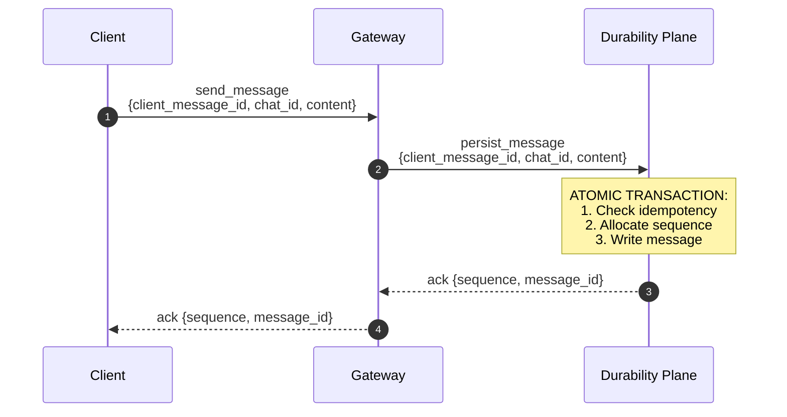
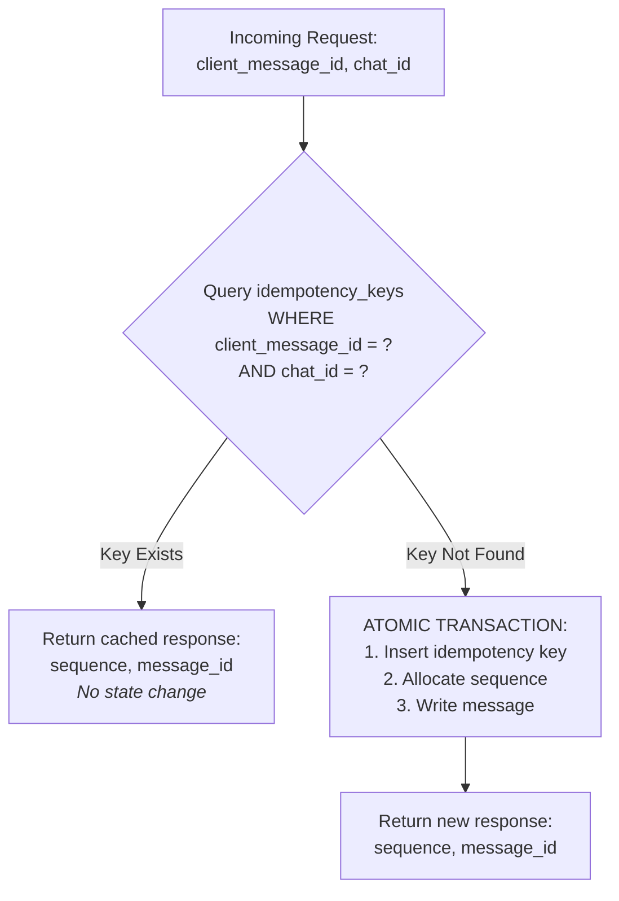
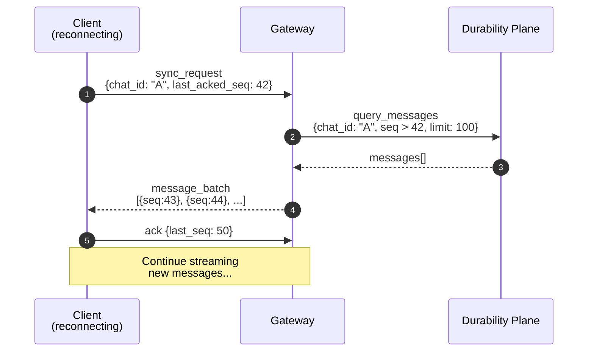

# ADR-001: Ordering, Delivery Semantics, and Idempotency


**Status**: Accepted
**Date**: 2026-01-30

---

## Context and Problem Statement

A real-time messaging platform must provide users with a coherent, predictable experience when sending and receiving messages. In distributed systems, network failures, client disconnections, and server crashes are inevitable. Without explicit guarantees around message ordering, delivery semantics, and duplicate handling, users may experience:

- Messages appearing out of order within a conversation
- Duplicate messages when clients retry after network failures
- Lost messages that were acknowledged but never persisted
- Inconsistent conversation state across multiple devices

**Core Question:** What ordering, delivery, and idempotency guarantees should our messaging system provide, and how should these be implemented to balance correctness, performance, and operational complexity?

---

## Decision Drivers

1. **Correctness over Performance**: The system must never lose acknowledged messages or corrupt conversation ordering, even if this introduces latency.

2. **Retry Safety**: Clients operating on unreliable networks must be able to safely retry message sends without causing duplicates.

3. **Deterministic Replay**: On reconnection, clients must be able to reliably catch up on missed messages in the correct order.

4. **Scalability**: The ordering mechanism must not create global bottlenecks; ordering guarantees should be scoped appropriately.

5. **Simplicity**: Favor well-understood patterns over novel approaches; minimize coordination complexity.

6. **Observability**: The system's state must be inspectable and debuggable; ordering and delivery state should be explicit.

---

## Considered Options

### Option 1: Global Total Ordering (Single Sequencer)

All messages across the entire system receive a globally unique, monotonically increasing sequence number from a centralized sequencer service.

**Mechanism**: Centralized service (e.g., single-leader database, dedicated sequencer) assigns global sequence numbers.

### Option 2: Per-Chat Total Ordering with Server-Assigned Sequences

Messages are totally ordered within each chat using a server-assigned monotonic sequence number. No ordering relationship exists between messages in different chats.

**Mechanism**: Each chat maintains its own sequence counter; sequence is assigned atomically at persistence time in the Durability Plane.

### Option 3: Client-Assigned Timestamps with Conflict Resolution

Clients assign timestamps to messages; the server uses conflict resolution (e.g., last-writer-wins, Lamport clocks, or vector clocks) to establish ordering.

**Mechanism**: Clients include high-resolution timestamps; server applies deterministic tie-breaking rules.

### Option 4: Causal Ordering with Vector Clocks

Messages carry causal dependency information; the system ensures causally-related messages are ordered correctly while allowing concurrent messages to be unordered.

**Mechanism**: Each message includes vector clock metadata; recipients reconstruct causal order.

---

## Decision Outcome

**Chosen Option: Option 2 — Per-Chat Total Ordering with Server-Assigned Sequences**

This approach provides strong, understandable ordering guarantees within the scope that matters to users (individual conversations) while avoiding the scalability bottlenecks of global ordering and the complexity of causal consistency models.

### Core Guarantees

| Guarantee | Description |
|-----------|-------------|
| **Per-Chat Total Order** | All participants in a chat observe messages in identical order, determined by a server-assigned `sequence` number. |
| **Transport: At-Least-Once** | The transport layer may deliver the same message multiple times due to retries and reconnections. |
| **Persistence: Effectively-Once** | Duplicate writes with the same `client_message_id` are collapsed; from the client's perspective, each logical message is persisted exactly once. |
| **Read-Your-Own-Writes** | A sender observes their own message immediately after receiving a success acknowledgment from the Durability Plane. |
| **Eventual Visibility** | Other participants observe messages with eventual consistency; ordering is preserved but delivery timing depends on connectivity and fanout latency. |
| **No Cross-Chat Ordering** | Messages in different chats have no ordering relationship. |

---

## Detailed Design

### 1. Sequence Number Assignment



**Sequence Properties:**
- `sequence` is a 64-bit unsigned integer, starting at 1 for each chat
- Assigned by the Durability Plane at ingest time using DynamoDB atomic counters
- Monotonically increasing within a chat (gaps are permitted if writes fail)
- Persisted atomically with the message record

**Sequence Counter Storage:**

Each chat maintains a dedicated counter item in DynamoDB keyed by `chat_id`. Sequence allocation uses `UpdateItem` with `ADD sequence_counter :1` and `ReturnValues: UPDATED_NEW` within the same DynamoDB transaction that writes the message and idempotency key. This ensures the counter increment, message write, and idempotency key insertion succeed or fail atomically.

### 2. Client Message Identifier

Every message sent by a client MUST include a `client_message_id`:

```json
{
  "type": "send_message",
  "client_message_id": "550e8400-e29b-41d4-a716-446655440000",
  "chat_id": "chat_abc123",
  "content": "Hello, world!"
}
```

**Requirements:**
- Format: UUIDv4 (128-bit, cryptographically random)
- Generated by the client before transmission
- Immutable across retries (same logical message = same `client_message_id`)
- Unique per client per chat (collisions within a chat are treated as duplicates)

**Why UUIDv4?** No coordination required for generation, sufficient entropy to prevent accidental collisions, and well-supported across all client platforms.

### 3. Idempotency Implementation

The Durability Plane enforces idempotency through a dedicated tracking mechanism:



**Idempotency Key Schema:**

| Field | Type | Description |
|-------|------|-------------|
| `chat_id` | String (PK) | Partition key for locality |
| `client_message_id` | String (SK) | The client-provided idempotency key |
| `message_id` | String | Server-assigned message identifier |
| `sequence` | Number | Assigned sequence number |
| `created_at` | Timestamp | When the key was first seen |
| `ttl` | Number | Expiration timestamp for cleanup |

**Retention Policy:**
- Idempotency keys are retained for **7 days** after creation
- This window accommodates extended client offline periods
- After TTL expiration, a resubmitted `client_message_id` would create a new message

**TTL Trade-off Rationale:** This is acceptable because clients are expected to retry within bounded windows (seconds to hours, not days). Replaying a UUID after 7+ days indicates either a client bug or a data restore scenario, which are explicitly out of scope for MVP correctness guarantees. The 7-day window is chosen to exceed typical "weekend offline" scenarios with margin.

### 4. Reconnection and Catch-Up Protocol

When a client reconnects, it initiates a sync to receive missed messages:



**Sync Request Parameters:**

| Parameter | Type | Description |
|-----------|------|-------------|
| `chat_id` | String | The conversation to sync |
| `last_acked_sequence` | Number | Last sequence the client confirmed receiving |

**Invariants:**
- Server MUST return messages with `sequence > last_acked_sequence`
- Messages MUST be returned in ascending `sequence` order
- Pagination is supported for large catch-up windows
- Client MUST NOT display messages until the batch is complete and ordered

### 5. Delivery Acknowledgment

Clients acknowledge receipt of messages to enable accurate delivery tracking:

```json
// Client -> Server
{
  "type": "ack",
  "chat_id": "chat_abc123",
  "last_acked_sequence": 47
}
```

**Acknowledgment Semantics:**
- Acknowledging sequence N implicitly acknowledges all sequences ≤ N
- The server persists `(user_id, chat_id, last_acked_sequence)` in `delivery_state`
- "Delivered" means the client application received the message, NOT that the user read it
- Per-message per-recipient tracking is explicitly OUT OF SCOPE for MVP

### 6. Client Responsibilities

The ordering and idempotency guarantees require specific client-side behaviors:

| Responsibility | Description |
|----------------|-------------|
| **Persist `client_message_id` until ACK** | Client must retain the ID locally until a success acknowledgment is received; this enables safe retries. |
| **Never reuse IDs across logical messages** | Each distinct user-initiated message must have a unique `client_message_id`. Reusing an ID is a client bug. |
| **Tolerate out-of-order transport delivery** | Messages may arrive via WebSocket in a different order than their `sequence` values; client must reorder by `sequence` before display. |
| **Track `last_acked_sequence` per chat** | Client must persist the highest acknowledged sequence to enable correct sync on reconnection. |
| **Handle sequence gaps gracefully** | Gaps in sequence numbers do not indicate missing messages; client must not block waiting for gap-filling. |

### 7. Read-Your-Own-Writes Implementation

The Read-Your-Own-Writes guarantee is achieved through synchronous acknowledgment:

> The Gateway returns the persisted `sequence` synchronously from the Durability Plane response. The sender's client renders the message immediately upon receiving this ACK, without waiting for fanout to complete. This ensures the sender always sees their own message in the correct position, even before other participants receive it.

---

## Consequences

### Positive Consequences

1. **Predictable User Experience**: All participants see messages in the same order within a conversation, eliminating confusion from out-of-order delivery.

2. **Safe Retries**: Clients can retry failed sends indefinitely without risk of duplicate messages appearing in the conversation.

3. **Deterministic Recovery**: After any failure (client crash, network partition, server restart), clients can resume with a simple sync request.

4. **Horizontal Scalability**: Per-chat ordering allows different chats to be processed by different servers without coordination.

5. **Debuggability**: Sequence numbers provide a clear audit trail; any ordering dispute can be resolved by examining sequences.

6. **Simple Client Logic**: Clients need only track `last_acked_sequence` per chat; no complex merge or conflict resolution required.

### Negative Consequences

1. **Hot Partition Risk**: Very active chats (e.g., large groups with high message volume) may create hot partitions in DynamoDB. *Mitigation: Deferred to future ADR; MVP accepts this limitation.*

2. **Sequence Gaps**: Failed writes may leave gaps in sequence numbers. *Mitigation: Clients must tolerate gaps; gaps do not indicate missing messages.*

3. **Idempotency Key Storage**: Requires additional storage and TTL management. *Mitigation: Keys are small; 7-day retention is a reasonable trade-off.*

4. **No Global Ordering**: Cannot answer "what was the 1000th message sent on the platform?" *Mitigation: This is not a product requirement; per-chat ordering is sufficient.*

5. **Clock Independence Trade-off**: Server-assigned sequences mean message order may not match send-time order if messages from different clients arrive out of order. *Mitigation: Server receipt order is the source of truth; this is a conscious design choice.*

---

## Confirmation

The implementation of this ADR will be validated through:

1. **Unit Tests**: Idempotency logic, sequence allocation, and sync query correctness.

2. **Integration Tests**: End-to-end message flow with simulated retries and reconnections.

3. **Failure Scenario Tests**: Explicit validation of the failure scenarios defined in MVP-DEFINITION.md:
   - Client reconnects with stale sequence → correct catch-up
   - Duplicate message submission → no duplicate stored
   - Client disconnects before ACK → retry succeeds with same sequence

4. **Load Tests**: Verify sequence allocation performance under concurrent write load.

5. **Chaos Tests**: Simulate gateway crashes mid-fanout; verify no message loss.

---

## Pros and Cons of the Options

### Option 1: Global Total Ordering

*All messages receive a globally unique sequence from a centralized sequencer.*

| Aspect | Assessment |
|--------|------------|
| Good | Enables cross-chat queries and global analytics |
| Good | Simple mental model: one sequence for everything |
| Bad | **Single point of failure** for the entire system |
| Bad | **Scalability bottleneck**: all writes contend for one sequencer |
| Bad | Unnecessary: users don't need global ordering |
| Bad | High latency for geographically distributed deployments |

### Option 2: Per-Chat Total Ordering (CHOSEN)

*Messages are ordered within each chat using server-assigned sequences.*

| Aspect | Assessment |
|--------|------------|
| Good | **Matches user mental model**: ordering matters within conversations |
| Good | **Horizontally scalable**: chats are independent |
| Good | **Low coordination overhead**: no global state required |
| Good | Well-understood pattern used by WhatsApp, Slack, Discord |
| Neutral | Requires per-chat sequence management (acceptable complexity) |
| Bad | Cannot provide global ordering (not required) |
| Bad | Hot partitions possible for very active chats (deferred) |

### Option 3: Client-Assigned Timestamps

*Clients assign timestamps; server applies conflict resolution.*

| Aspect | Assessment |
|--------|------------|
| Good | No server-side sequence allocation |
| Good | Messages reflect "real" send time |
| Bad | **Clock skew**: client clocks are unreliable |
| Bad | **Non-deterministic**: different clients may see different orders |
| Bad | **Spoofable**: malicious clients can manipulate timestamps |
| Bad | Conflict resolution adds complexity without clear benefit |

### Option 4: Causal Ordering with Vector Clocks

*Messages carry causal dependency metadata.*

| Aspect | Assessment |
|--------|------------|
| Good | Theoretically elegant: captures "happens-before" relationships |
| Good | Allows concurrency where causality permits |
| Bad | **High complexity**: vector clocks are hard to implement correctly |
| Bad | **Metadata overhead**: grows with number of participants |
| Bad | **Overkill**: chat messages are rarely truly concurrent |
| Bad | Poor developer experience: hard to debug and reason about |

---

## More Information

### Related Patterns and Prior Art

1. **Kafka Partition Ordering**: Kafka provides total ordering within a partition, similar to our per-chat ordering. Messages are assigned offsets (analogous to our sequences) at write time.

2. **WhatsApp Message Ordering**: WhatsApp uses server-assigned timestamps for ordering within chats, with the server as the source of truth for order.

3. **Stripe Idempotency Keys**: Stripe's API requires client-provided idempotency keys for non-idempotent operations, a pattern we adopt directly.

4. **DynamoDB Transactions**: We leverage DynamoDB's transactional writes to atomically allocate sequences and persist messages.

### References

- Kleppmann, M. (2017). *Designing Data-Intensive Applications*. O'Reilly Media. Chapter 9: Consistency and Consensus.
- Helland, P. (2012). "Idempotence Is Not a Medical Condition." *ACM Queue*.
- Lamport, L. (1978). "Time, Clocks, and the Ordering of Events in a Distributed System." *Communications of the ACM*.
- Amazon Web Services. "DynamoDB Transactions." AWS Documentation.

### Future Considerations

1. **ADR-XXX: Hot Partition Mitigation**: Address scalability for high-traffic chats (sharding strategies, sequence allocation optimization).

2. **ADR-XXX: Multi-Device Sync**: Extend delivery tracking for users with multiple connected devices.

3. **ADR-XXX: Message Editing and Deletion**: Define how edits/deletes interact with sequence numbers and idempotency.

---

## Appendix A: Message Schema

```json
{
  "message_id": "msg_01HQXYZ...",
  "chat_id": "chat_abc123",
  "sequence": 47,
  "sender_id": "user_456",
  "client_message_id": "550e8400-e29b-41d4-a716-446655440000",
  "content": "Hello, world!",
  "content_type": "text/plain",
  "created_at": "2026-01-30T14:30:00.000Z"
}
```

## Appendix B: Failure Scenario Matrix

| Scenario | Client Behavior | Server Behavior | Outcome |
|----------|-----------------|-----------------|---------|
| Network timeout during send | Retry with same `client_message_id` | Idempotency check returns cached response | No duplicate; client gets correct `sequence` |
| Client crash before ACK | On restart, retry send | Idempotency check returns cached response | No duplicate; client gets correct `sequence` |
| Server crash after persist, before ACK | Retry with same `client_message_id` | New server instance returns cached response | No duplicate; client gets correct `sequence` |
| Client offline for extended period | On reconnect, send `sync_request` | Server returns all messages since `last_acked_sequence` | Client catches up; no lost messages |
| Duplicate `client_message_id` (different content) | Client error: must not reuse IDs | Server returns original message's `sequence` | Original content preserved; duplicate rejected |

## Appendix C: Invariants (Machine-Checkable)

```
INVARIANT sequence_monotonic:
  ∀ m1, m2 ∈ PersistedMessages:
    m1.chat_id = m2.chat_id ∧ m1.persisted_at < m2.persisted_at
    ⟹ m1.sequence < m2.sequence
  -- Note: Ordering is based on successful persistence time, not send time.
  -- Sequence gaps may exist due to failed writes; gaps do not violate this invariant.

INVARIANT idempotency_guarantee:
  ∀ r1, r2 ∈ Requests:
    r1.client_message_id = r2.client_message_id ∧ r1.chat_id = r2.chat_id
    ⟹ response(r1).sequence = response(r2).sequence
       ∧ |{m ∈ PersistedMessages : m.client_message_id = r1.client_message_id ∧ m.chat_id = r1.chat_id}| = 1

INVARIANT sync_completeness:
  ∀ client, chat:
    after sync_request(chat, last_acked_seq):
      client.messages[chat] ⊇ {m ∈ PersistedMessages : m.chat_id = chat ∧ m.sequence > last_acked_seq}

INVARIANT delivery_state_consistency:
  ∀ user, chat:
    delivery_state(user, chat).last_acked_sequence ≤ max({m.sequence : m ∈ PersistedMessages ∧ m.chat_id = chat})
```
