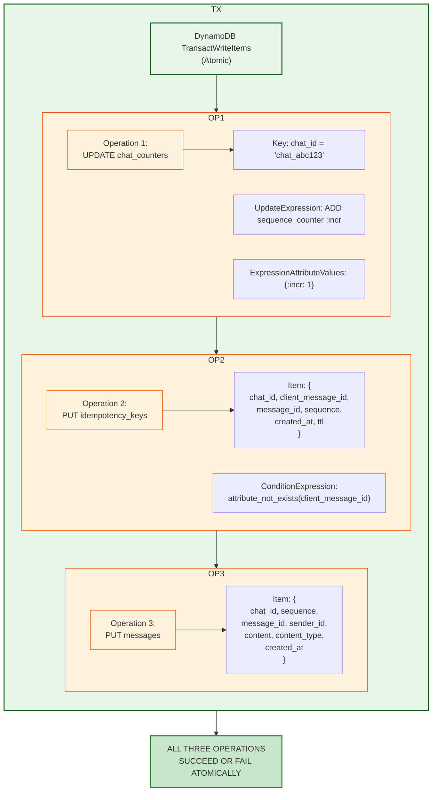
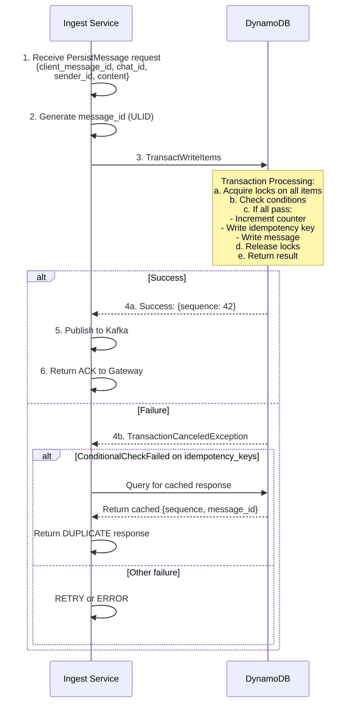
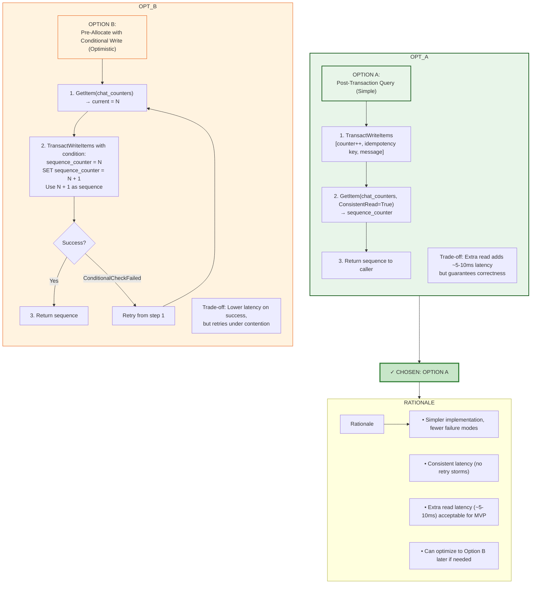
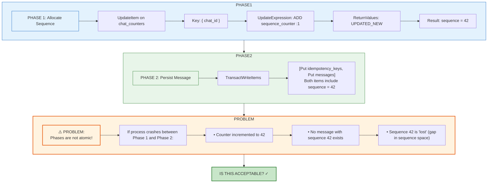
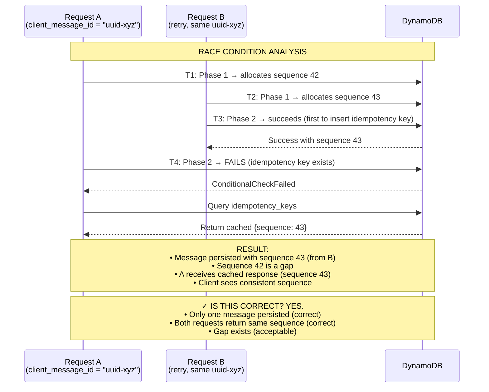
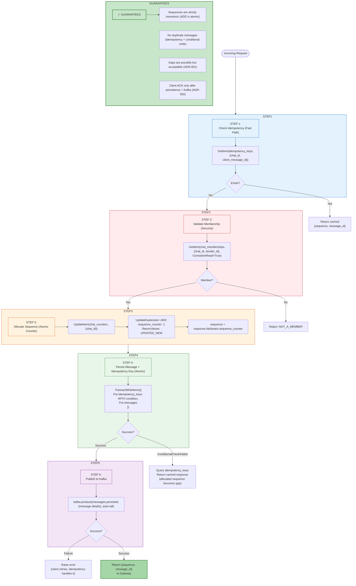
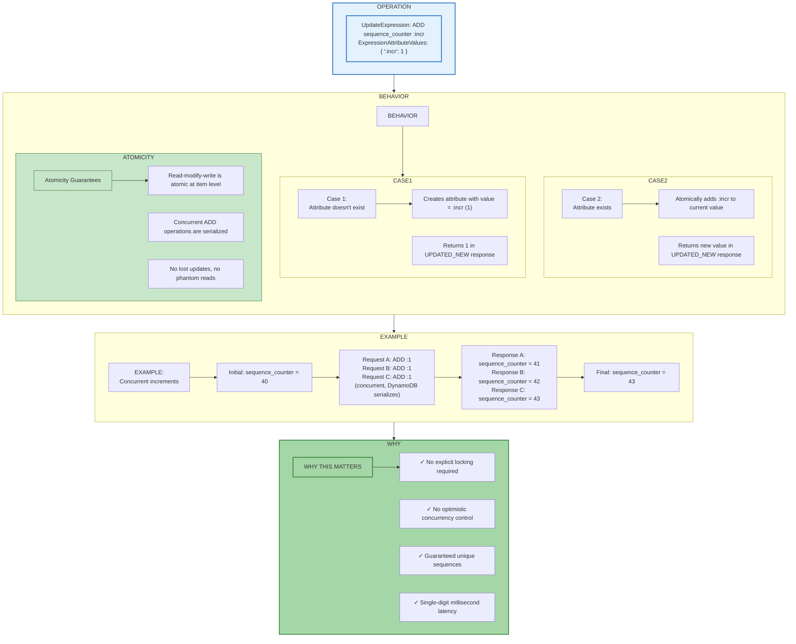

# ADR-004: Sequencing Strategy (DynamoDB Atomic Counters)

- **Status**: Accepted
- **Date**: 2026-01-30

---

## Context and Problem Statement

ADR-001 established that messages within a chat must be totally ordered using a server-assigned monotonic `sequence` number. ADR-003 defined the source of truth hierarchy with DynamoDB as authoritative. However, neither document specifies the precise mechanics of how sequence numbers are allocated under concurrent load, what consistency guarantees the allocation provides, or how the system behaves under failure conditions.

> **Note**: This ADR focuses on **sequence allocation mechanics, concurrency handling, and failure recovery**. For complete table schema specifications, see **[ADR-007: Data Model and Index Strategy](./ADR-007.md)**.

In a distributed messaging system, sequence allocation is one of the most critical operations:

- **Every message send** requires a sequence number before it can be persisted
- **Concurrent senders** in the same chat must receive distinct, monotonically increasing sequences
- **Failures during allocation** must not corrupt the sequence space or cause duplicates
- **Latency directly impacts** user-perceived send time (sequence allocation is on the critical path)

Without explicit design, subtle bugs emerge:

- Two messages could receive the same sequence (violates total ordering)
- A failed write could "consume" a sequence, leaving permanent gaps (acceptable but must be understood)
- High-traffic chats could experience contention that degrades to unacceptable latency
- Recovery procedures could inadvertently reset or corrupt counters

**Core Question:** What is the precise mechanism for allocating sequence numbers that guarantees correctness under concurrent writes, provides acceptable latency characteristics, and handles failures gracefully?

---

## Decision Drivers

1. **Correctness Above All**: No two *persisted* messages in the same chat may share the same sequence number, regardless of concurrency, failures, or retries.

2. **Low Latency**: Sequence allocation is on the critical path for message sends. P99 allocation latency should be <50ms under normal load.

3. **ACK-After-Persistence**: The client receives an ACK only after the message is durably persisted. Sequences may be allocated but never persisted (creating gaps); this is acceptable.

4. **Gaps Are Acceptable**: Failed or raced writes may consume sequence numbers without persisting messages. Clients must tolerate gaps (per ADR-001).

5. **Failure Safety**: Crashes, timeouts, or network partitions during allocation must not cause duplicate sequences for persisted messages. Counter corruption or deletion is a critical incident, not a recoverable state.

6. **Operational Simplicity**: The mechanism should be understandable, debuggable, and recoverable without specialized tooling.

7. **Scalability Awareness**: While hot partition mitigation is out of scope for MVP (per MVP-DEFINITION.md), the design should not preclude future optimization.

---

## Considered Options

### Option 1: DynamoDB Atomic Counter (Two-Phase)

Use DynamoDB's `UpdateItem` with `ADD` operation to atomically increment a counter and retrieve the new value, followed by a `TransactWriteItems` to atomically write the message and idempotency key using the allocated sequence.

**Mechanism**: Phase 1 allocates sequence via atomic increment; Phase 2 persists message + idempotency key transactionally. Phases are not atomic with each other—gaps may occur if Phase 2 fails.

### Option 2: Optimistic Locking with Conditional Writes

Read current counter value, compute next sequence, write message with condition that counter hasn't changed.

**Mechanism**: GetItem → compute → TransactWriteItems with ConditionExpression; retry on conflict.

### Option 3: External Sequencer Service

Dedicated service (e.g., Zookeeper, etcd, or custom) that allocates sequences; DynamoDB stores messages only.

**Mechanism**: RPC to sequencer → receive sequence → write to DynamoDB.

### Option 4: Snowflake-Style IDs

Use a distributed ID generation scheme (timestamp + worker ID + sequence) that provides approximate ordering without coordination.

**Mechanism**: Each ingest worker generates IDs locally; ordering is approximate within time windows.

### Option 5: Database-Generated Sequences (Aurora/PostgreSQL)

Use a relational database with native `SERIAL` or `SEQUENCE` support for sequence generation.

**Mechanism**: Insert with `RETURNING sequence`; sequence managed by database engine.

---

## Decision Outcome

**Chosen Option: Option 1 — DynamoDB Atomic Counter (Two-Phase)**

This approach provides the guarantees we need: strict monotonicity for allocated sequences, no duplicate sequences for persisted messages, and single-digit millisecond latency. The design is explicitly **two-phase**: sequence allocation is atomic, message persistence is atomic, but the two phases are not atomic with each other. This means gaps can occur (acceptable per ADR-001), but no two persisted messages will ever share a sequence.

This approach aligns with our existing DynamoDB investment (ADR-003) and avoids introducing additional infrastructure.

### Correctness Boundary

Understanding what the system guarantees—and when—is critical:

| State | Guarantee |
|-------|-----------|
| **Before ACK** | Sequence may be allocated but not persisted. No client-visible effect. Gaps may form. |
| **After ACK** | Message is durably persisted with unique sequence. Kafka event enqueued. Fanout will occur. |
| **On Retry (same client_message_id)** | Returns cached sequence from first successful persistence. No duplicate message created. |

**Key Insight**: The sequence number returned in the ACK is the sequence of a *persisted* message. Allocated-but-not-persisted sequences are invisible to clients—they only manifest as gaps in the sequence space, which clients already tolerate.

### Core Mechanism



### Foundational Guarantees

| Guarantee | Mechanism | Implication |
|-----------|-----------|-------------|
| **Strict Monotonicity (Allocation)** | DynamoDB `ADD` is atomic at the item level | No two allocations return the same sequence |
| **Uniqueness (Persistence)** | Idempotency key + conditional write in transaction | No two *persisted* messages share a sequence |
| **Two-Phase (Not Atomic End-to-End)** | Phase 1: allocate; Phase 2: persist | Gaps occur when Phase 2 fails after Phase 1 succeeds |
| **Gap Safety** | Gaps indicate failed/raced writes, not missing data | Clients use `sequence > last_acked` queries (ADR-001) |
| **Idempotency Integration** | Conditional put on idempotency key within Phase 2 | Retries return cached sequence; no duplicate persistence |
| **Read-After-Write** | ACK sent only after Phase 2 completes | Sender can rely on sequence immediately after ACK |

---

## Detailed Design

### 1. Counter Table Schema

> **Complete Schema**: See **[ADR-007: Data Model and Index Strategy](./ADR-007.md#22-table-chat_counters)** for the full `chat_counters` table specification.

The `chat_counters` table stores one item per chat with `chat_id` as the partition key and `sequence_counter` as the atomic counter attribute.

**Counter Semantics**: The `sequence_counter` value represents the **last allocated sequence**, not the next available. After incrementing, the new value IS the sequence for the current message.

```
Before: sequence_counter = 41
ADD sequence_counter :1
After:  sequence_counter = 42  ← This message's sequence
```

**Critical Operational Constraint**: The counter item **must never be deleted**. If the counter is missing, sequence allocation will fail (enforced by `ConditionExpression`). A missing counter is a **SEV-2 correctness incident** requiring operational intervention—not a self-healing scenario.

### 2. Sequence Allocation Flow



### 3. Transaction Structure (Pseudocode)

```python
def persist_message(request: PersistMessageRequest) -> PersistMessageResponse:
    """
    Atomically allocate sequence and persist message.
    
    This is the ONLY code path that allocates sequences.
    """
    
    # 1. Validate membership (strongly consistent read)
    membership = dynamodb.get_item(
        TableName='chat_memberships',
        Key={'chat_id': request.chat_id, 'user_id': request.sender_id},
        ConsistentRead=True
    )
    if not membership:
        raise NotAMemberError(request.chat_id, request.sender_id)
    
    # 2. Check for existing idempotency key (duplicate detection)
    existing = dynamodb.get_item(
        TableName='idempotency_keys',
        Key={
            'chat_id': request.chat_id,
            'client_message_id': request.client_message_id
        }
    )
    if existing:
        # Duplicate request - return cached response
        return PersistMessageResponse(
            sequence=existing['sequence'],
            message_id=existing['message_id'],
            deduplicated=True
        )
    
    # 3. Generate server-side identifiers
    message_id = generate_ulid(prefix='msg_')
    now = utc_now_iso8601()
    ttl = int(time.time()) + (7 * 24 * 60 * 60)  # 7 days
    
    # 4. Execute atomic transaction
    try:
        response = dynamodb.transact_write_items(
            TransactItems=[
                # Operation 1: Increment counter and capture new value
                {
                    'Update': {
                        'TableName': 'chat_counters',
                        'Key': {'chat_id': request.chat_id},
                        'UpdateExpression': 'ADD sequence_counter :incr SET updated_at = :now',
                        'ExpressionAttributeValues': {
                            ':incr': 1,
                            ':now': now
                        },
                        'ReturnValuesOnConditionCheckFailure': 'ALL_OLD'
                    }
                },
                # Operation 2: Insert idempotency key (fails if exists)
                {
                    'Put': {
                        'TableName': 'idempotency_keys',
                        'Item': {
                            'chat_id': request.chat_id,
                            'client_message_id': request.client_message_id,
                            'message_id': message_id,
                            'sequence': {'N': 'PLACEHOLDER'},  # Filled by post-processing
                            'created_at': now,
                            'ttl': ttl
                        },
                        'ConditionExpression': 'attribute_not_exists(client_message_id)'
                    }
                },
                # Operation 3: Insert message
                {
                    'Put': {
                        'TableName': 'messages',
                        'Item': {
                            'chat_id': request.chat_id,
                            'sequence': {'N': 'PLACEHOLDER'},  # Filled by post-processing
                            'message_id': message_id,
                            'sender_id': request.sender_id,
                            'client_message_id': request.client_message_id,
                            'content': request.content,
                            'content_type': request.content_type or 'text/plain',
                            'created_at': now
                        }
                    }
                }
            ]
        )
        
        # 5. Extract allocated sequence from response
        # Note: DynamoDB TransactWriteItems does not return updated values directly.
        # We must query the counter after successful transaction.
        counter = dynamodb.get_item(
            TableName='chat_counters',
            Key={'chat_id': request.chat_id},
            ConsistentRead=True
        )
        sequence = counter['sequence_counter']
        
        return PersistMessageResponse(
            sequence=sequence,
            message_id=message_id,
            deduplicated=False
        )
        
    except TransactionCanceledException as e:
        # Check which operation failed
        for i, reason in enumerate(e.CancellationReasons):
            if reason['Code'] == 'ConditionalCheckFailed':
                if i == 1:  # Idempotency key condition failed
                    # Race condition: another request inserted the key
                    # Query and return cached response
                    existing = dynamodb.get_item(
                        TableName='idempotency_keys',
                        Key={
                            'chat_id': request.chat_id,
                            'client_message_id': request.client_message_id
                        }
                    )
                    return PersistMessageResponse(
                        sequence=existing['sequence'],
                        message_id=existing['message_id'],
                        deduplicated=True
                    )
        
        # Other failure - propagate for retry
        raise
```

### 4. Critical Implementation Note: Sequence Capture

The pseudocode above illustrates a subtlety: **DynamoDB `TransactWriteItems` does not return updated attribute values**. Unlike single-item `UpdateItem` with `ReturnValues=UPDATED_NEW`, transactions don't support returning the new counter value.

**Solution: Two-Phase Approach**



**Refined Implementation:**

```python
def persist_message_with_sequence(request: PersistMessageRequest) -> PersistMessageResponse:
    """
    Two-phase sequence allocation: transaction + consistent read.
    """
    
    # Phase 1: Atomic transaction (counter increment + message write)
    message_id = generate_ulid(prefix='msg_')
    now = utc_now_iso8601()
    ttl = int(time.time()) + (7 * 24 * 60 * 60)
    
    dynamodb.transact_write_items(
        TransactItems=[
            {
                'Update': {
                    'TableName': 'chat_counters',
                    'Key': {'chat_id': request.chat_id},
                    'UpdateExpression': 'ADD sequence_counter :incr SET updated_at = :now',
                    'ExpressionAttributeValues': {':incr': 1, ':now': now}
                }
            },
            {
                'Put': {
                    'TableName': 'idempotency_keys',
                    'Item': {
                        'chat_id': request.chat_id,
                        'client_message_id': request.client_message_id,
                        'message_id': message_id,
                        # sequence populated in Phase 2
                        'created_at': now,
                        'ttl': ttl
                    },
                    'ConditionExpression': 'attribute_not_exists(client_message_id)'
                }
            },
            {
                'Put': {
                    'TableName': 'messages',
                    'Item': {
                        'chat_id': request.chat_id,
                        # sequence populated in Phase 2
                        'message_id': message_id,
                        'sender_id': request.sender_id,
                        'client_message_id': request.client_message_id,
                        'content': request.content,
                        'content_type': request.content_type or 'text/plain',
                        'created_at': now
                    }
                }
            }
        ]
    )
    
    # Phase 2: Consistent read to capture allocated sequence
    counter = dynamodb.get_item(
        TableName='chat_counters',
        Key={'chat_id': request.chat_id},
        ConsistentRead=True
    )
    sequence = counter['Item']['sequence_counter']
    
    # Phase 3: Update idempotency key and message with actual sequence
    # (These are non-transactional but idempotent)
    dynamodb.update_item(
        TableName='idempotency_keys',
        Key={
            'chat_id': request.chat_id,
            'client_message_id': request.client_message_id
        },
        UpdateExpression='SET sequence = :seq',
        ExpressionAttributeValues={':seq': sequence}
    )
    
    dynamodb.update_item(
        TableName='messages',
        Key={
            'chat_id': request.chat_id,
            'sequence': sequence
        },
        UpdateExpression='SET sequence = :seq',  # No-op but ensures consistency
        ExpressionAttributeValues={':seq': sequence}
    )
    
    return PersistMessageResponse(sequence=sequence, message_id=message_id)
```

**Wait—this approach has a flaw.** The message is written to `messages` table but we don't know the sequence at write time, so we can't use `sequence` as the sort key.

### 5. Corrected Design: Sequence-First Allocation

The fundamental issue is that DynamoDB transactions don't return updated values, but we need the sequence to write the message (since sequence is the sort key).

**Corrected Two-Phase Approach:**



**Analysis: Sequence Gaps**

Per ADR-001, sequence gaps are explicitly acceptable:

> "Gaps in sequence numbers do not indicate missing messages; client must not block waiting for gap-filling."

However, we must ensure:
1. The client does NOT receive an ACK if the message wasn't persisted
2. Retries with the same `client_message_id` produce correct behavior

**The Real Concern: Atomicity of ACK**

The client only receives an ACK after both phases complete AND Kafka publish succeeds. If we crash between Phase 1 and Phase 2:
- Client does not receive ACK
- Client retries with same `client_message_id`
- Phase 1 allocates a NEW sequence (43)
- Phase 2 succeeds
- Client receives ACK with sequence 43
- Sequence 42 is a gap (acceptable)

**But wait—what if two concurrent requests for the same `client_message_id` race?**



**Conclusion: Two-Phase is Acceptable**

The two-phase approach (allocate sequence → persist message) is correct because:
1. Gaps are acceptable by design (ADR-001)
2. Idempotency key prevents duplicate messages
3. Client always receives consistent sequence on success or retry

### 6. Final Implementation Design



### 7. Implementation (Final Pseudocode)

```python
class MessageIngestService:
    """
    Durability Plane: Message ingest with sequence allocation.
    """
    
    def __init__(self, dynamodb, kafka_producer):
        self.dynamodb = dynamodb
        self.kafka = kafka_producer
    
    def persist_message(self, request: PersistMessageRequest) -> PersistMessageResponse:
        """
        Persist a message with atomic sequence allocation.
        
        Steps:
        1. Check idempotency (fast path for retries)
        2. Validate membership (security)
        3. Allocate sequence (atomic counter)
        4. Persist message + idempotency key (transactional)
        5. Publish to Kafka (durability contract)
        
        Returns:
            PersistMessageResponse with sequence and message_id
        
        Raises:
            NotAMemberError: Sender is not a member of the chat
            ServiceUnavailableError: DynamoDB or Kafka unavailable
        """
        
        # ─────────────────────────────────────────────────────────
        # Step 1: Check for existing idempotency key (fast path)
        # ─────────────────────────────────────────────────────────
        # NOTE: This is an eventually consistent read. A stale read may miss
        # a recently-written key, causing us to proceed with allocation.
        # This is safe because Step 4's conditional put will catch the duplicate.
        # We accept the occasional wasted allocation for lower latency on the
        # common path (non-duplicate requests).
        existing = self.dynamodb.get_item(
            TableName='idempotency_keys',
            Key={
                'chat_id': {'S': request.chat_id},
                'client_message_id': {'S': request.client_message_id}
            }
            # ConsistentRead=False (default) - eventual consistency acceptable here
        )
        
        if 'Item' in existing:
            logger.info(
                "Duplicate message detected",
                chat_id=request.chat_id,
                client_message_id=request.client_message_id,
                cached_sequence=existing['Item']['sequence']['N']
            )
            return PersistMessageResponse(
                sequence=int(existing['Item']['sequence']['N']),
                message_id=existing['Item']['message_id']['S'],
                deduplicated=True
            )
        
        # ─────────────────────────────────────────────────────────
        # Step 2: Validate membership (security-critical)
        # ─────────────────────────────────────────────────────────
        membership = self.dynamodb.get_item(
            TableName='chat_memberships',
            Key={
                'chat_id': {'S': request.chat_id},
                'user_id': {'S': request.sender_id}
            },
            ConsistentRead=True  # CRITICAL: strong consistency for security
        )
        
        if 'Item' not in membership:
            raise NotAMemberError(
                chat_id=request.chat_id,
                user_id=request.sender_id
            )
        
        # ─────────────────────────────────────────────────────────
        # Step 3: Allocate sequence (atomic counter increment)
        # ─────────────────────────────────────────────────────────
        message_id = generate_ulid(prefix='msg_')
        now = utc_now_iso8601()
        ttl = int(time.time()) + IDEMPOTENCY_KEY_TTL_SECONDS  # 7 days
        
        try:
            counter_response = self.dynamodb.update_item(
                TableName='chat_counters',
                Key={'chat_id': {'S': request.chat_id}},
                UpdateExpression='ADD sequence_counter :incr SET updated_at = :now',
                # CRITICAL: Require counter to exist. Missing counter = corrupted state.
                ConditionExpression='attribute_exists(sequence_counter)',
                ExpressionAttributeValues={
                    ':incr': {'N': '1'},
                    ':now': {'S': now}
                },
                ReturnValues='UPDATED_NEW'
            )
        except ConditionalCheckFailedException:
            # Counter missing - this is a SEV-2 incident, not a recoverable error
            logger.critical(
                "COUNTER_MISSING: Chat counter does not exist. "
                "This is a correctness incident requiring manual intervention.",
                chat_id=request.chat_id
            )
            raise CounterMissingError(
                chat_id=request.chat_id,
                message="Chat counter missing. Cannot allocate sequence. "
                        "Operational intervention required."
            )
        
        sequence = int(counter_response['Attributes']['sequence_counter']['N'])
        
        logger.debug(
            "Sequence allocated",
            chat_id=request.chat_id,
            sequence=sequence
        )
        
        # ─────────────────────────────────────────────────────────
        # Step 4: Persist message + idempotency key (transactional)
        # ─────────────────────────────────────────────────────────
        try:
            self.dynamodb.transact_write_items(
                TransactItems=[
                    {
                        'Put': {
                            'TableName': 'idempotency_keys',
                            'Item': {
                                'chat_id': {'S': request.chat_id},
                                'client_message_id': {'S': request.client_message_id},
                                'message_id': {'S': message_id},
                                'sequence': {'N': str(sequence)},
                                'created_at': {'S': now},
                                'ttl': {'N': str(ttl)}
                            },
                            'ConditionExpression': 'attribute_not_exists(client_message_id)'
                        }
                    },
                    {
                        'Put': {
                            'TableName': 'messages',
                            'Item': {
                                'chat_id': {'S': request.chat_id},
                                'sequence': {'N': str(sequence)},
                                'message_id': {'S': message_id},
                                'sender_id': {'S': request.sender_id},
                                'client_message_id': {'S': request.client_message_id},
                                'content': {'S': request.content},
                                'content_type': {'S': request.content_type or 'text/plain'},
                                'created_at': {'S': now}
                            }
                        }
                    }
                ]
            )
        except TransactionCanceledException as e:
            # Check if idempotency key condition failed (race condition)
            for reason in e.response.get('CancellationReasons', []):
                if reason.get('Code') == 'ConditionalCheckFailed':
                    # Another request won the race - return their result
                    existing = self.dynamodb.get_item(
                        TableName='idempotency_keys',
                        Key={
                            'chat_id': {'S': request.chat_id},
                            'client_message_id': {'S': request.client_message_id}
                        }
                    )
                    
                    if 'Item' in existing:
                        logger.info(
                            "Race condition resolved",
                            chat_id=request.chat_id,
                            client_message_id=request.client_message_id,
                            our_sequence=sequence,
                            winner_sequence=existing['Item']['sequence']['N']
                        )
                        # Note: sequence we allocated becomes a gap (acceptable)
                        return PersistMessageResponse(
                            sequence=int(existing['Item']['sequence']['N']),
                            message_id=existing['Item']['message_id']['S'],
                            deduplicated=True
                        )
            
            # Other transaction failure - propagate
            raise
        
        logger.info(
            "Message persisted",
            chat_id=request.chat_id,
            sequence=sequence,
            message_id=message_id
        )
        
        # ─────────────────────────────────────────────────────────
        # Step 5: Publish to Kafka (durability contract)
        # ─────────────────────────────────────────────────────────
        # IMPORTANT: ACK is gated on Kafka publish success.
        # This means Kafka availability directly impacts send availability.
        # This is an intentional choice: "send success" means both
        # "durably stored" AND "fanout enqueued."
        #
        # MVP LIMITATION: If Kafka publish fails after DynamoDB persistence,
        # we rely on client retry. There is no internal outbox or repair loop.
        # The message is durable (sync will work), but won't fan out until
        # a successful retry. This is acceptable for MVP; a transactional
        # outbox pattern could be added later for improved reliability.
        event = MessagePersistedEvent(
            event_type='MessagePersisted',
            event_id=generate_ulid(prefix='evt_'),
            event_time=now,
            partition_key=request.chat_id,
            payload=MessagePayload(
                message_id=message_id,
                chat_id=request.chat_id,
                sequence=sequence,
                sender_id=request.sender_id,
                content=request.content,
                content_type=request.content_type or 'text/plain',
                created_at=now
            )
        )
        
        try:
            future = self.kafka.send(
                topic='messages.persisted',
                key=request.chat_id.encode('utf-8'),
                value=event.to_json().encode('utf-8')
            )
            future.get(timeout=KAFKA_SEND_TIMEOUT_SECONDS)  # Synchronous wait
        except KafkaError as e:
            # Kafka unavailable - fail the request
            # Message is durable in DynamoDB; recipients can retrieve via sync.
            # But real-time fanout won't occur until client retries successfully.
            # This is the MVP trade-off: no internal retry/outbox mechanism.
            logger.error(
                "Kafka publish failed - message durable but fanout blocked",
                chat_id=request.chat_id,
                sequence=sequence,
                message_id=message_id,
                error=str(e)
            )
            raise ServiceUnavailableError(
                "Message stored but fanout failed. Please retry. "
                "(Message is durable; sync will work.)"
            )
        
        return PersistMessageResponse(
            sequence=sequence,
            message_id=message_id,
            deduplicated=False
        )
```

### 8. DynamoDB ADD Operation Semantics

Understanding DynamoDB's `ADD` operation is critical for this design:



### 9. Chat Counter Initialization

Counters must be created when chats are created:

```python
def create_chat(request: CreateChatRequest) -> CreateChatResponse:
    """
    Create a new chat with initialized sequence counter.
    """
    chat_id = generate_ulid(prefix='chat_')
    now = utc_now_iso8601()
    
    # Atomic creation of chat + counter + memberships
    dynamodb.transact_write_items(
        TransactItems=[
            # Create chat metadata
            {
                'Put': {
                    'TableName': 'chats',
                    'Item': {
                        'chat_id': {'S': chat_id},
                        'chat_type': {'S': request.chat_type},
                        'name': {'S': request.name} if request.name else {'NULL': True},
                        'created_by': {'S': request.created_by},
                        'created_at': {'S': now},
                        'updated_at': {'S': now}
                    }
                }
            },
            # Initialize sequence counter at 0
            {
                'Put': {
                    'TableName': 'chat_counters',
                    'Item': {
                        'chat_id': {'S': chat_id},
                        'sequence_counter': {'N': '0'},
                        'created_at': {'S': now},
                        'updated_at': {'S': now}
                    }
                }
            },
            # Add creator as owner
            {
                'Put': {
                    'TableName': 'chat_memberships',
                    'Item': {
                        'chat_id': {'S': chat_id},
                        'user_id': {'S': request.created_by},
                        'role': {'S': 'owner'},
                        'joined_at': {'S': now}
                    }
                }
            },
            # Add other initial members...
        ]
    )
    
    return CreateChatResponse(chat_id=chat_id)
```

**Critical Invariant**: A chat must never exist without a corresponding counter. The transactional creation ensures this atomically.

### 10. Failure Mode Analysis

| Failure Point | Behavior | Sequence Impact | Recovery |
|---------------|----------|-----------------|----------|
| Crash before Step 3 (allocation) | No counter increment | None | Client retries from scratch |
| Crash after Step 3, before Step 4 | Counter incremented | Gap created | Client retries, gets new sequence |
| Crash during Step 4 (transaction) | Transaction rolled back | Gap created (from Step 3) | Client retries, gets new sequence |
| Crash after Step 4, before Step 5 | Message persisted | None | Client retries, returns cached |
| Crash during Step 5 (Kafka) | Message persisted, no event | None (message durable, fanout pending) | Client retries, Kafka publish succeeds |
| DynamoDB unavailable | All operations fail | None | Client retries when available |
| Kafka unavailable | Message persisted | None | Client retries, Kafka publish succeeds |
| **Counter item missing** | **Step 3 fails with ConditionExpression error** | **None (allocation blocked)** | **SEV-2 incident: manual counter reconstruction required** |

**Gap Analysis:**

Gaps occur when:
1. Sequence allocated in Step 3
2. Something fails before Step 4 completes
3. OR another concurrent request wins the idempotency race

Gaps are safe because:
- Clients are explicitly documented to tolerate gaps (ADR-001)
- Gaps don't indicate missing data—they indicate failed or deduplicated writes
- Sync queries use `sequence > last_acked` which handles gaps naturally

### 11. Performance Characteristics

| Operation | Typical Latency | Under Contention |
|-----------|-----------------|------------------|
| Step 1: Idempotency check | 2-5ms | 2-5ms (no contention) |
| Step 2: Membership check | 5-10ms | 5-10ms (no contention) |
| Step 3: Counter increment | 3-8ms | 5-15ms (serialized, not failed) |
| Step 4: TransactWriteItems | 10-20ms | 10-30ms (transaction overhead) |
| Step 5: Kafka produce | 5-20ms | Variable (depends on acks) |
| **Total (no cache hit)** | **25-63ms** | **27-90ms** |
| **Total (idempotency hit)** | **2-5ms** | **2-5ms** |

**Contention Handling:**

DynamoDB's atomic ADD serializes concurrent increments at the item level. Unlike optimistic locking, there are no retries—requests queue internally. This means:

- Under moderate contention (10 concurrent writers): Each request waits ~3-8ms × position in queue
- Under heavy contention (100 concurrent writers): Latency grows but no requests fail

This is acceptable for MVP. Hot partition mitigation (future ADR) will address extreme cases.

### 12. Monitoring and Alerting

| Metric | Collection | Alert Threshold | Meaning |
|--------|------------|-----------------|---------|
| `sequence_allocation_latency_p99` | Step 3 duration | > 50ms | Counter contention |
| `sequence_allocation_errors` | Step 3 failures | > 0.1% | DynamoDB issues |
| `counter_missing_errors` | CounterMissingError count | > 0 | **SEV-2**: Counter deleted/corrupted |
| `idempotency_hit_rate` | Step 1 cache hits | > 10% | Retry storm or client bugs |
| `sequence_gap_rate` | Gaps per 1000 sequences | > 5% | High contention or failures |
| `transaction_conflict_rate` | Step 4 ConditionalCheckFailed | > 1% | Race conditions (expected low) |
| `messages_per_chat_per_minute` | Derived | > 100 | Hot chat (future concern) |

**Sequence Gap Tracking:**

```python
def calculate_gap_rate(chat_id: str) -> float:
    """
    Calculate the gap rate for a chat.
    
    Gaps = allocated sequences - persisted messages.
    
    LIMITATIONS:
    - This metric counts ALL gaps ever, not gaps in a time window
    - If messages are ever deleted (not in MVP), this overcounts
    - Does not distinguish "recent failures" from "historical gaps"
    
    For operational alerting, prefer tracking gap_rate as:
      (allocations in window - persists in window) / allocations in window
    This requires separate metrics emission, not point-in-time calculation.
    """
    counter = dynamodb.get_item(
        TableName='chat_counters',
        Key={'chat_id': chat_id}
    )['Item']['sequence_counter']
    
    message_count = dynamodb.query(
        TableName='messages',
        KeyConditionExpression='chat_id = :cid',
        ExpressionAttributeValues={':cid': chat_id},
        Select='COUNT'
    )['Count']
    
    gaps = counter - message_count
    gap_rate = gaps / counter if counter > 0 else 0.0
    
    return gap_rate
```

**Better Approach for Monitoring:** Emit metrics at allocation time and persistence time separately. Gap rate = `(allocations - successful_persists) / allocations` over a sliding window (e.g., 15 minutes). This captures recent failure rate without the historical accumulation problem.

---

## Consequences

### Positive Consequences

1. **Guaranteed Uniqueness**: DynamoDB's atomic ADD ensures no two allocations return the same sequence; conditional writes ensure no two persisted messages share a sequence.

2. **Low Latency**: Single-digit millisecond sequence allocation; total persist path <100ms P99 under normal load.

3. **No External Dependencies**: Uses only DynamoDB—no additional sequencer service to operate.

4. **Automatic Serialization**: DynamoDB handles contention internally; no client-side retry logic for conflicts.

5. **Clear Failure Semantics**: Gaps only occur on failures or races; gaps don't indicate data loss. Counter absence is a hard error, not a silent corruption.

6. **Idempotency Integration**: The two-phase design naturally handles duplicate requests without special-casing.

### Negative Consequences

1. **Two-Phase Non-Atomicity**: Sequence allocation and message persistence are separate operations. A crash between them creates a gap.
   *Mitigation*: Gaps are explicitly acceptable (ADR-001); documented as expected behavior.

2. **Counter Deletion is Catastrophic**: If the counter item is deleted, the system fails safely (rejects allocations) but requires manual intervention to recover.
   *Mitigation*: ConditionExpression prevents silent corruption; counter reconstruction procedure documented in operational runbooks.

3. **Kafka Availability Affects Send Availability**: ACK is gated on Kafka publish; Kafka outage blocks sends even though DynamoDB is available.
   *Mitigation*: MVP accepts this trade-off for simplicity. Transactional outbox pattern could decouple in future.

4. **Hot Partition Risk**: Very active chats concentrate load on a single DynamoDB partition.
   *Mitigation*: Deferred to future ADR; MVP accepts this limitation with monitoring.

5. **Counter as Single Point of Contention**: All messages in a chat serialize through one counter item.
   *Mitigation*: DynamoDB scales well for moderate contention; future sharding strategies can be layered on.

6. **No Batch Allocation**: Each message requires a separate counter increment.
   *Mitigation*: Could add batch allocation optimization in future if latency becomes critical.

7. **Gap Debugging Complexity**: Gaps require correlation between counter value and message table to explain.
   *Mitigation*: Monitoring tracks gap rate; gaps are normal operational events, not errors.

---

## Confirmation

The implementation of this ADR will be validated through:

1. **Unit Tests**:
   - ADD operation correctly increments and returns new value
   - Idempotency check returns cached response
   - Transaction fails correctly when idempotency key exists

2. **Concurrency Tests**:
   - 100 concurrent writers to same chat receive 100 unique sequences
   - No sequence collisions under any test scenario
   - Gaps occur only when expected (simulated failures)

3. **Failure Injection Tests**:
   - Kill process after Step 3: verify gap created, retry succeeds
   - Kill process after Step 4: verify idempotency returns cached response
   - DynamoDB throttling: verify graceful degradation with retries

4. **Latency Benchmarks**:
   - Sequence allocation P99 < 50ms under normal load
   - Total persist path P99 < 100ms under normal load
   - Measure latency degradation under 10x, 100x contention

5. **Gap Analysis**:
   - Verify gap rate < 1% under normal operation
   - Verify gap rate correlates with failure injection rate

---

## Pros and Cons of the Options

### Option 1: DynamoDB Atomic Counter — Two-Phase (CHOSEN)

| Aspect | Assessment |
|--------|------------|
| Good | **Atomic increment**: No lost updates, no duplicate allocated sequences |
| Good | **Low latency**: Single-digit ms allocation |
| Good | **No external dependencies**: DynamoDB only |
| Good | **Automatic serialization**: DynamoDB handles contention |
| Good | **Operational simplicity**: Well-understood, AWS-managed |
| Neutral | Two-phase design creates gaps on failure (acceptable per ADR-001) |
| Neutral | Counter deletion requires manual recovery (prevented by ConditionExpression) |
| Bad | Kafka availability affects send availability (MVP trade-off) |
| Bad | Hot partition risk for very active chats (deferred) |
| Bad | No batch allocation (future optimization) |

### Option 2: Optimistic Locking with Conditional Writes

| Aspect | Assessment |
|--------|------------|
| Good | Can be fully atomic in single transaction |
| Good | No gaps (theoretically) |
| Bad | **Retry storms under contention**: N concurrent writes → O(N²) attempts |
| Bad | **Increased latency under load**: Retries add 10-50ms per attempt |
| Bad | **Complex retry logic**: Exponential backoff, jitter, max attempts |
| Bad | **Failure mode confusion**: Is it a real error or just contention? |

### Option 3: External Sequencer Service

| Aspect | Assessment |
|--------|------------|
| Good | Can provide global sequences if needed |
| Good | Can batch allocations for efficiency |
| Bad | **Additional infrastructure**: Another service to deploy, monitor, operate |
| Bad | **Additional failure mode**: Sequencer unavailable = all sends fail |
| Bad | **Latency overhead**: Network round-trip to sequencer |
| Bad | **Overkill for per-chat ordering**: Global sequences not required |

### Option 4: Snowflake-Style IDs

| Aspect | Assessment |
|--------|------------|
| Good | No coordination required |
| Good | Extremely high throughput |
| Bad | **Not strictly monotonic**: Only approximately ordered |
| Bad | **Clock sensitivity**: Relies on synchronized clocks |
| Bad | **Worker ID management**: Need to assign unique worker IDs |
| Bad | **Violates ADR-001**: Requires strict monotonic sequences |

### Option 5: Database-Generated Sequences (Aurora/PostgreSQL)

| Aspect | Assessment |
|--------|------------|
| Good | Native sequence support |
| Good | Transactional with message write |
| Good | Well-understood semantics |
| Bad | **Different database**: Introduces operational complexity (DynamoDB + RDS) |
| Bad | **Scaling characteristics**: SQL databases scale differently than DynamoDB |
| Bad | **Violates ADR-003**: DynamoDB is established as source of truth |
| Bad | **Cost model**: RDS pricing less favorable for this access pattern |

---

## More Information

### Related Patterns and Prior Art

1. **Kafka Partition Offsets**: Kafka uses a similar atomic append model where each message in a partition receives a monotonically increasing offset. Our per-chat sequence is analogous to per-partition offset.

2. **Redis INCR**: Redis's INCR command provides similar atomic increment semantics. We chose DynamoDB for durability guarantees and operational simplicity (single data store).

3. **Twitter Snowflake**: While we didn't choose Snowflake-style IDs, understanding its trade-offs (approximate ordering, no coordination) informed our decision for strict ordering.

4. **Google Spanner TrueTime**: Spanner's globally synchronized clocks enable timestamp-based ordering. Our use case (per-chat ordering) doesn't require global ordering, so this complexity isn't warranted.

### DynamoDB Atomic Operations Documentation

From AWS DynamoDB Developer Guide:

> "The ADD action only supports Number and set data types. In addition, ADD can only be used on top-level attributes, not nested attributes. When you use ADD for a Number, the number is added to the existing attribute... If the attribute does not exist, the number is set as the initial value."

> "All the actions in an UpdateItem operation are performed atomically. That is, if you issue an UpdateItem request concurrently with another UpdateItem request for the same item, DynamoDB serializes the requests and performs them one at a time."

### References

- Amazon Web Services. "Working with Items and Attributes." DynamoDB Developer Guide.
- Amazon Web Services. "DynamoDB Transactions." DynamoDB Developer Guide.
- Kleppmann, M. (2017). *Designing Data-Intensive Applications*. O'Reilly Media. Chapter 7: Transactions.
- Amazon Web Services. "Best Practices for Designing and Using Partition Keys Effectively." DynamoDB Developer Guide.

### Future Considerations

1. **ADR-XXX: Hot Partition Mitigation**: Strategies for handling very active chats:
   - Write sharding with sequence ranges
   - Bucket-based allocation
   - Adaptive partitioning

2. **ADR-XXX: Batch Sequence Allocation**: Pre-allocating sequence ranges for high-throughput clients:
   - Client requests range (e.g., 10 sequences)
   - Uses locally, reports actual usage
   - Trade-off: potential for more gaps

3. **ADR-XXX: Sequence Compaction**: Optional gap elimination for long-term storage optimization (if gaps become operationally problematic).

---

## Counter Recovery Procedure

If a counter item is accidentally deleted or corrupted, this is a **SEV-2 correctness incident**. The following procedure restores the counter safely.

### Prerequisites

- Chat is in degraded state (sends failing with `CounterMissingError`)
- On-call engineer has DynamoDB write access
- No active writes to the chat (coordinate with affected users if possible)

### Procedure

```python
def recover_counter(chat_id: str) -> int:
    """
    Reconstruct a missing counter from persisted messages.
    
    CAUTION: This is an operational recovery procedure, not normal code path.
    Run only after confirming counter is missing and no concurrent writes.
    """
    
    # 1. Find the highest persisted sequence
    response = dynamodb.query(
        TableName='messages',
        KeyConditionExpression='chat_id = :cid',
        ExpressionAttributeValues={':cid': {'S': chat_id}},
        ScanIndexForward=False,  # Descending order
        Limit=1,
        ProjectionExpression='sequence'
    )
    
    if response['Items']:
        max_sequence = int(response['Items'][0]['sequence']['N'])
    else:
        max_sequence = 0  # No messages in chat
    
    # 2. Recreate counter with max_sequence as current value
    # Use ConditionExpression to prevent overwriting if counter was recreated
    try:
        dynamodb.put_item(
            TableName='chat_counters',
            Item={
                'chat_id': {'S': chat_id},
                'sequence_counter': {'N': str(max_sequence)},
                'created_at': {'S': utc_now_iso8601()},
                'updated_at': {'S': utc_now_iso8601()},
                'recovered_at': {'S': utc_now_iso8601()},  # Audit trail
                'recovered_from_sequence': {'N': str(max_sequence)}
            },
            ConditionExpression='attribute_not_exists(chat_id)'
        )
    except ConditionalCheckFailedException:
        # Counter was recreated by another process - verify it's correct
        existing = dynamodb.get_item(
            TableName='chat_counters',
            Key={'chat_id': {'S': chat_id}}
        )
        existing_value = int(existing['Item']['sequence_counter']['N'])
        if existing_value < max_sequence:
            raise InconsistentCounterError(
                f"Counter exists with value {existing_value} but "
                f"max message sequence is {max_sequence}"
            )
        return existing_value
    
    logger.warning(
        "Counter recovered",
        chat_id=chat_id,
        recovered_sequence=max_sequence
    )
    
    return max_sequence
```

### Post-Recovery Verification

1. Verify sends work: test message to the chat
2. Verify sequence is correct: new message should have sequence `max_sequence + 1`
3. Document incident: root cause of counter deletion, preventive measures

### Prevention

- DynamoDB Point-in-Time Recovery (PITR) enabled for `chat_counters` table
- IAM policies restrict DeleteItem on `chat_counters` to break-glass roles only
- Alerting on any DeleteItem calls to `chat_counters`

---

## Appendix A: DynamoDB Capacity Planning

### Capacity Model

| Operation | RCU | WCU | Notes |
|-----------|-----|-----|-------|
| Idempotency check (Step 1) | 0.5 | 0 | Eventually consistent read, <1KB |
| Membership check (Step 2) | 1 | 0 | Strongly consistent read, <1KB |
| Counter increment (Step 3) | 0 | 1 | Write, <1KB |
| TransactWriteItems (Step 4) | 0 | 4 | 2 items × 2 (transaction overhead) |
| **Total per message** | **1.5** | **5** | |

### Provisioning Guidelines

For sustained throughput of N messages/second:

```
Provisioned RCU = N × 1.5 × safety_factor (1.5)
Provisioned WCU = N × 5 × safety_factor (1.5)

Example: 1000 messages/second
  RCU = 1000 × 1.5 × 1.5 = 2,250 RCU
  WCU = 1000 × 5 × 1.5 = 7,500 WCU
```

**Recommendation**: Use on-demand capacity mode for MVP to avoid capacity planning complexity. Switch to provisioned mode with auto-scaling once traffic patterns are understood.

### Hot Partition Limits

DynamoDB partition limit: 3,000 RCU / 1,000 WCU per partition per second.

For `chat_counters` (hot key = active chat):
- 1,000 WCU limit → ~1,000 messages/second per chat (Step 3 only)
- With Step 4 transaction writes: ~200 messages/second per chat

**This is the practical limit for a single chat in MVP.** Hot partition mitigation (future ADR) will address higher throughput requirements.

## Appendix B: Sequence Space Analysis

### 64-bit Sequence Space

Sequences are 64-bit unsigned integers:

```
Maximum sequence: 2^64 - 1 = 18,446,744,073,709,551,615

At 1,000 messages/second per chat:
  - 1 million messages: ~17 minutes
  - 1 billion messages: ~12 days
  - 1 trillion messages: ~32 years
  - Maximum: ~584 million years

Conclusion: Sequence overflow is not a practical concern.
```

### Gap Density Analysis

Expected gap rate under various conditions:

| Condition | Expected Gap Rate | Notes |
|-----------|-------------------|-------|
| Normal operation | < 0.1% | Rare failures |
| Network instability | 1-5% | Client retries create gaps |
| High contention (100+ writers) | 2-10% | Race conditions on idempotency |
| DynamoDB throttling | 5-20% | Failed transactions after allocation |

**Monitoring Threshold**: Alert if gap rate exceeds 5% sustained over 15 minutes.

## Appendix C: Invariants (Machine-Checkable)

```
INVARIANT counter_must_exist:
  ∀ chat_id ∈ Chats:
    ∃ counter ∈ ChatCounters: counter.chat_id = chat_id
  -- Every chat must have a counter; missing counter is a correctness incident
  -- Enforced by ConditionExpression on allocation

INVARIANT sequence_uniqueness:
  ∀ m1, m2 ∈ Messages:
    m1.chat_id = m2.chat_id ∧ m1.sequence = m2.sequence
    ⟹ m1.message_id = m2.message_id
  -- No two distinct persisted messages in the same chat have the same sequence

INVARIANT allocation_monotonicity:
  ∀ allocation A1, A2 on same chat_id:
    A1.time < A2.time ⟹ A1.sequence < A2.sequence
  -- Allocations are strictly monotonic (DynamoDB ADD serialization)

INVARIANT counter_is_last_allocated:
  ∀ chat_id:
    let counter = chat_counters[chat_id].sequence_counter
    in counter = max({allocated_sequences for chat_id})
  -- Counter tracks last allocated sequence, NOT last persisted
  -- counter ≥ max(persisted sequences) due to possible gaps

INVARIANT sequence_monotonicity:
  ∀ chat_id:
    let counter = chat_counters[chat_id].sequence_counter
    let max_seq = max({m.sequence : m ∈ Messages ∧ m.chat_id = chat_id})
    in max_seq ≤ counter
  -- Counter is always ≥ highest persisted message sequence (gaps allowed)

INVARIANT counter_lower_bound:
  ∀ chat_id:
    let counter = chat_counters[chat_id].sequence_counter
    let count = |{m : m ∈ Messages ∧ m.chat_id = chat_id}|
    in count ≤ counter
  -- Message count is always ≤ counter value (due to gaps)

INVARIANT idempotency_sequence_consistency:
  ∀ k ∈ IdempotencyKeys, m ∈ Messages:
    k.chat_id = m.chat_id ∧ k.client_message_id = m.client_message_id
    ⟹ k.sequence = m.sequence ∧ k.message_id = m.message_id
  -- Idempotency key and message always agree on sequence and ID

INVARIANT ack_implies_persistence:
  ∀ ack A:
    client_receives(A) ⟹ 
      ∃ m ∈ Messages: m.sequence = A.sequence ∧ m.chat_id = A.chat_id
  -- ACK is only sent after message is persisted (Phase 2 complete)

INVARIANT no_zero_sequence:
  ∀ m ∈ Messages:
    m.sequence ≥ 1
  -- Sequences start at 1, never 0

INVARIANT gap_is_allocation_without_persistence:
  ∀ chat_id, seq:
    seq ≤ chat_counters[chat_id].sequence_counter
    ∧ ¬∃ m ∈ Messages: m.chat_id = chat_id ∧ m.sequence = seq
    ⟹ allocated_but_not_persisted(chat_id, seq)
  -- Every gap corresponds to an allocation where Phase 2 failed or was raced

INVARIANT add_operation_atomicity:
  ∀ concurrent_increments I1, I2 on same chat_id:
    result(I1) ≠ result(I2)
  -- DynamoDB ADD guarantees distinct results for concurrent increments
```

## Appendix D: Testing Scenarios

### Scenario 1: Basic Sequence Allocation

```
Given: Chat "A" with sequence_counter = 10
When: persist_message({chat_id: "A", client_message_id: "uuid-1"})
Then:
  - sequence_counter = 11
  - Response.sequence = 11
  - messages table has item {chat_id: "A", sequence: 11}
  - idempotency_keys has item {chat_id: "A", client_message_id: "uuid-1", sequence: 11}
```

### Scenario 2: Idempotent Retry

```
Given: Chat "A" with existing message {sequence: 11, client_message_id: "uuid-1"}
When: persist_message({chat_id: "A", client_message_id: "uuid-1"})
Then:
  - sequence_counter unchanged (still 11)
  - Response.sequence = 11
  - Response.deduplicated = true
  - No new items created
```

### Scenario 3: Concurrent Writers

```
Given: Chat "A" with sequence_counter = 10
When: 3 concurrent persist_message calls with uuid-1, uuid-2, uuid-3
Then:
  - sequence_counter = 13
  - Three distinct messages with sequences 11, 12, 13
  - No sequence collisions
  - Order of 11/12/13 assignment is non-deterministic
```

### Scenario 4: Race Condition on Idempotency

```
Given: Chat "A" with sequence_counter = 10
When: 
  - Request A: allocates sequence 11, begins transaction
  - Request B (same client_message_id): allocates sequence 12, completes transaction first
  - Request A: transaction fails (idempotency key exists)
Then:
  - sequence_counter = 12
  - One message with sequence 12
  - Sequence 11 is a gap
  - Both requests return sequence 12
```

### Scenario 5: Failure After Allocation

```
Given: Chat "A" with sequence_counter = 10
When: 
  - persist_message allocates sequence 11
  - Process crashes before transaction completes
  - Client retries with same client_message_id
Then:
  - First attempt: sequence_counter incremented to 11, no message written
  - Retry: sequence_counter incremented to 12, message written with sequence 12
  - Final state: sequence_counter = 12, one message at sequence 12
  - Sequence 11 is a gap
```

### Scenario 6: New Chat First Message

```
Given: Newly created chat "A" with sequence_counter = 0
When: persist_message({chat_id: "A", client_message_id: "uuid-1"})
Then:
  - sequence_counter = 1
  - Response.sequence = 1
  - First message in chat has sequence 1
```

### Scenario 7: Counter Missing (Correctness Incident)

```
Given: Chat "A" exists but chat_counters item is missing (operational error)
When: persist_message({chat_id: "A", client_message_id: "uuid-1"})
Then:
  - Step 3 fails with ConditionalCheckFailedException
  - CounterMissingError raised
  - No sequence allocated
  - No message persisted
  - SEV-2 alert triggered
  - Requires manual intervention: reconstruct counter from max(messages.sequence)
```
