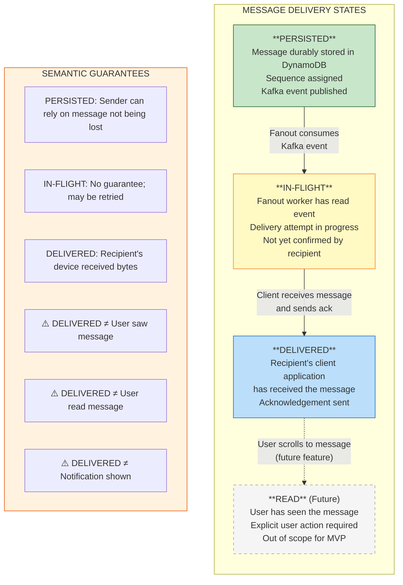
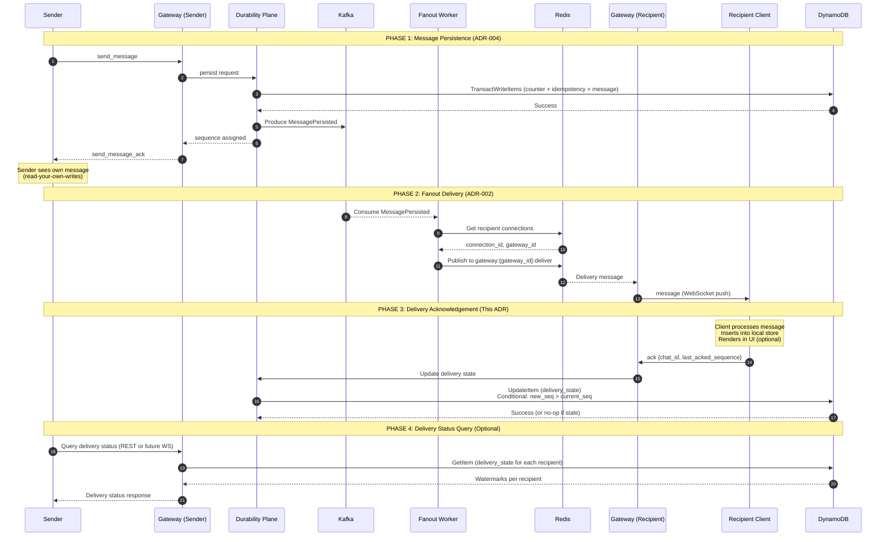
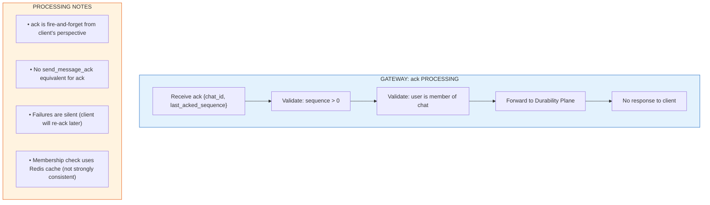
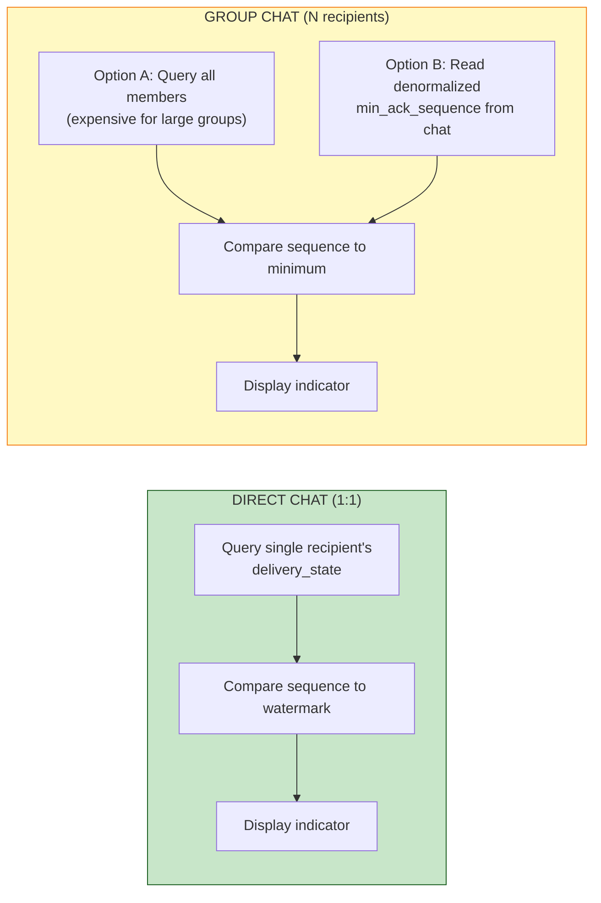
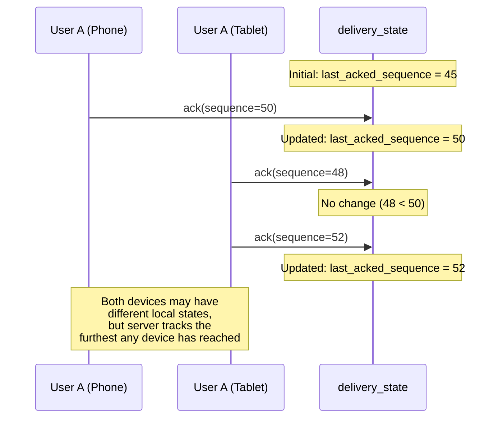
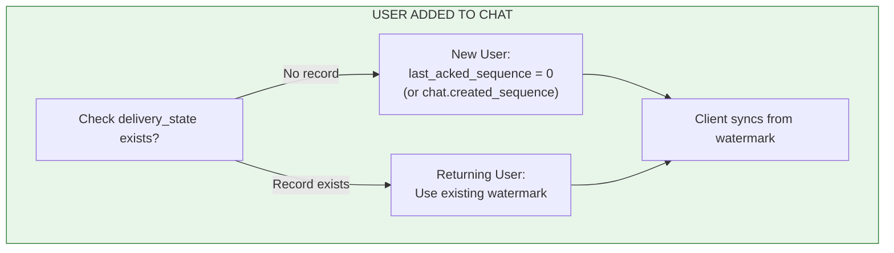
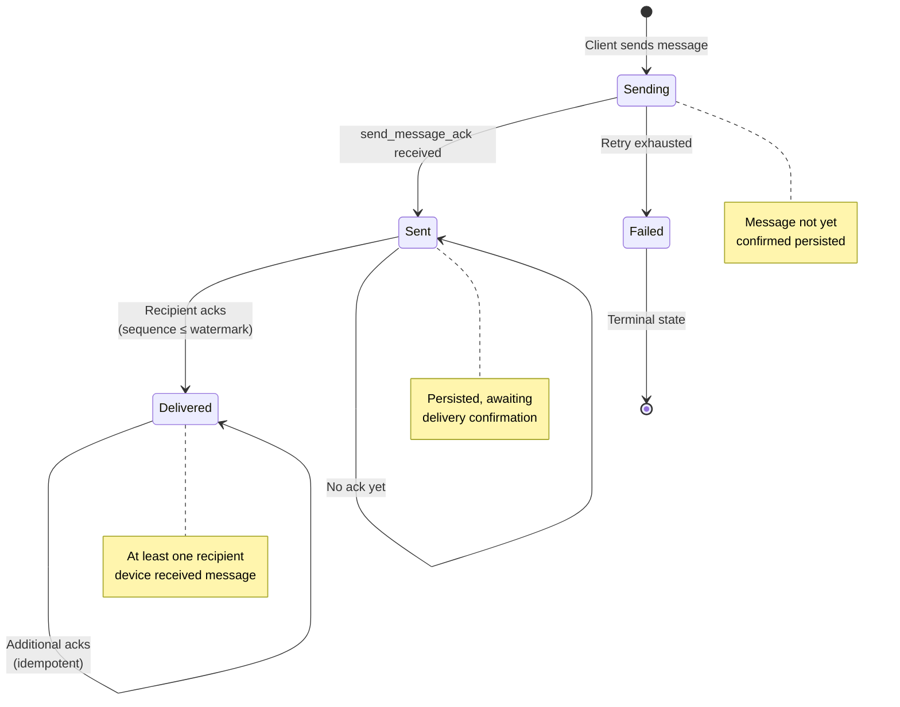
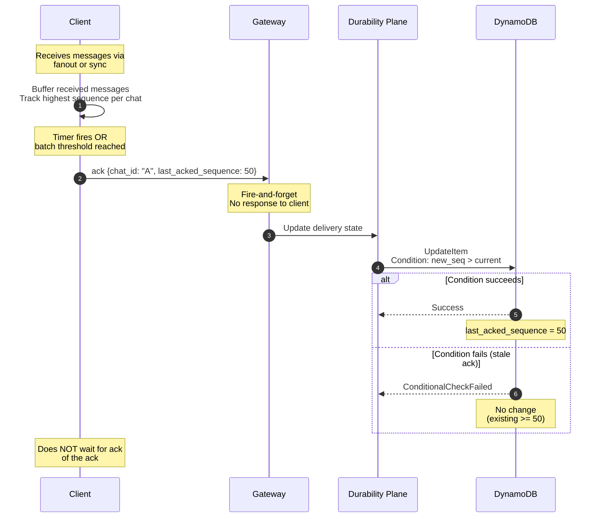
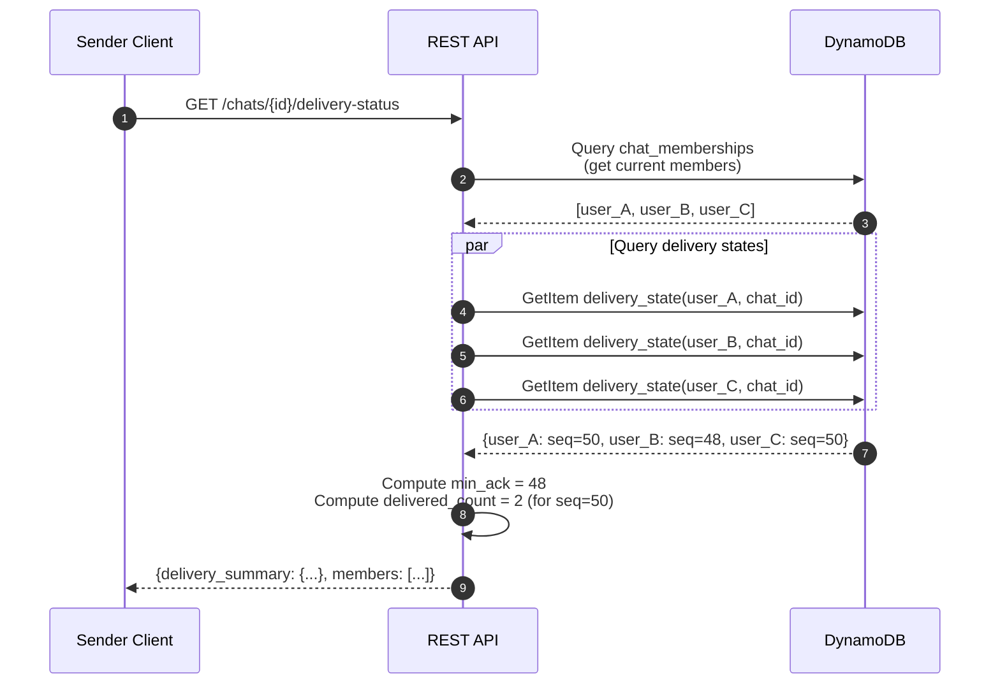

# ADR-008: Delivery Acknowledgements and "Delivered" Semantics

- **Status**: Accepted
- **Date**: 2026-01-31

---

## Context and Problem Statement

ADR-001 through ADR-007 established the foundational architecture for the messaging system: per-chat ordering with server-assigned sequences (ADR-001), three-plane separation (ADR-002), DynamoDB as the source of truth (ADR-003), atomic counter-based sequence allocation (ADR-004), WebSocket protocol including the `ack` message type (ADR-005), REST API contracts (ADR-006), and data model specifications including the `delivery_state` table (ADR-007).

The MVP-DEFINITION.md explicitly states:

> "**Delivery Acknowledgments**: 'Delivered' indicates **receipt by the client application, not user read acknowledgment**. The system stores `(user_id, chat_id, last_acked_sequence)`. Per-message per-recipient delivery state is explicitly **out of scope** for MVP."

However, several critical questions remain unaddressed:

- What precisely does "delivered" mean, and how does it differ from "seen" or "read"?
- When should clients send acknowledgements, and what triggers the `ack` message?
- How does the system prevent unbounded state growth while still tracking delivery?
- What happens when acknowledgements are lost, duplicated, or arrive out of order?
- How do multi-device scenarios affect delivery semantics?
- What are the consistency guarantees for delivery state queries?
- How does delivery state interact with sync operations?

Without explicit answers, implementations will diverge on when to show delivery indicators, how to handle edge cases, and what semantics to promise users. The distinction between "delivered" and "read" is a frequent source of user confusion and engineering bugs in messaging systems.

**Core Question:** What are the precise semantics of delivery acknowledgements, how is delivery state tracked and queried, and what guarantees can users and applications rely on?

---

## Decision Drivers

1. **Semantic Clarity**: Users and developers must understand what "delivered" means. Ambiguity leads to bugs and user confusion.

2. **Bounded State Growth**: Delivery tracking must not create unbounded storage costs, especially in large group chats.

3. **Failure Tolerance**: Lost or duplicated acknowledgements must not corrupt delivery state or cause incorrect UI rendering.

4. **Multi-Device Readiness**: The design must accommodate multi-device delivery (MVP scope) without requiring architectural changes.

5. **Query Efficiency**: Delivery state queries must be efficient for both senders (checking if message was delivered) and recipients (determining sync position).

6. **Consistency with Existing ADRs**: Delivery semantics must align with the cumulative acknowledgement model (ADR-005), watermark storage (ADR-007), and dataflow contracts (ADR-003).

7. **Privacy Considerations**: Delivery tracking should not expose more information than necessary about recipient behavior.

---

## Considered Options

### Option 1: Per-Message Per-Recipient Delivery Tracking

Track delivery status for every (message, recipient) pair. Store explicit "delivered" records for each message to each user.

**Mechanism**: `delivery_receipts` table with `(message_id, recipient_id, delivered_at)`. Each `ack` creates individual records.

### Option 2: Watermark-Based Delivery Tracking (Per-User-Per-Chat)

Track only the highest delivered sequence per (user, chat) pair. "Delivered up to sequence N" implicitly covers all messages ≤ N.

**Mechanism**: `delivery_state` table with `(user_id, chat_id, last_acked_sequence)`. Cumulative acknowledgements update the watermark.

### Option 3: Sender-Side Delivery Aggregation

Track delivery at the message level but only for the sender's perspective. Aggregate recipient delivery into a count or percentage.

**Mechanism**: `message_delivery_stats` with `(message_id, delivered_count, recipient_count)`. Fanout workers update counts.

### Option 4: No Delivery Tracking (Read Receipts Only)

Skip delivery tracking entirely. Only track explicit "read" actions (user opens chat, scrolls to message).

**Mechanism**: No delivery state. "Read" is tracked when user explicitly marks messages as read.

---

## Decision Outcome

**Chosen Option: Option 2 — Watermark-Based Delivery Tracking (Per-User-Per-Chat)**

This approach provides the optimal balance between functionality, scalability, and simplicity. A single watermark per (user, chat) pair enables efficient sync operations, bounds storage growth to O(users × chats) rather than O(messages × users), and aligns with the cumulative acknowledgement model already defined in ADR-005.

### Semantic Definitions

Before detailing the mechanism, we establish precise definitions that govern all delivery-related behavior:



### Foundational Definitions

| Term | Definition | What It Means |
|------|------------|---------------|
| **Delivered** | The recipient's client application has received the message bytes via WebSocket (real-time) or sync (catch-up), processed them successfully, and sent an `ack` message to the server. | The message reached the client software. The user may or may not have seen it. The client may or may not have rendered it. |
| **Acknowledged (Acked)** | The client has sent an `ack` message for this sequence (or a higher sequence in the same chat), and the server has updated `delivery_state`. | Server knows the client received messages up to this point. |
| **Watermark** | The `last_acked_sequence` value stored in `delivery_state` for a (user, chat) pair. | All messages with sequence ≤ watermark are considered delivered to this user in this chat. |
| **Read** (Future) | The user has explicitly seen the message. Requires user interaction (opening chat, scrolling). Out of scope for MVP. | The human looked at the message content. |

### Critical Distinctions

| What "Delivered" Is | What "Delivered" Is NOT |
|---------------------|-------------------------|
| Client application received bytes | User saw the message |
| Network transfer completed | Notification was shown |
| Client acknowledged receipt | Message was rendered in UI |
| Server recorded the acknowledgement | User engaged with content |
| Sync position is updated | User is aware message exists |

**Why This Matters**: Users often misunderstand delivery indicators. A "delivered" checkmark means "your friend's phone received this" not "your friend read this." This distinction must be clear in documentation, UI copy, and engineering conversations.

### Delivery Guarantees (Normative)

These guarantees govern all delivery-related behavior and must be understood by all implementers:

| Guarantee | Statement | Implication |
|-----------|-----------|-------------|
| **Delivered is Eventually Consistent** | Delivery state queries reflect acknowledgements with bounded delay (seconds to minutes). There is no linearizability guarantee between ack send and delivery status visibility. | A sender querying delivery status may not immediately see a recipient's recent ack. UI must tolerate stale reads. |
| **Delivered is Per-Chat Only** | Delivery watermarks are scoped to (user, chat) pairs. There is no cross-chat ordering or causality implied by delivery state. | A sender seeing ✓✓ on message M in Chat A has no guarantee about delivery state in Chat B, even if Chat B's messages were sent earlier. |
| **Delivered is Per-User, Not Per-Device** | A single watermark tracks delivery across all of a user's devices. "Delivered" means at least one device received the message. | If a user has 3 devices, ✓✓ appears when any one device acks. The other devices may not have synced yet. |
| **Delivered is Not Causal** | Delivery acknowledgements do not establish happened-before relationships across chats, users, or system components. | A recipient acking message 50 does not imply they have processed notifications, updated presence, or completed any other system action. |
| **Delivered in Groups Means All Current Members** | For group chats, "delivered to all" (✓✓) requires every current member's watermark to meet or exceed the message sequence. | A single offline member prevents ✓✓ from appearing. This is the strictest reasonable interpretation and matches user expectations. |

**Interview-Ready Summary**: "Delivered" means the recipient's client application received the message bytes and acknowledged receipt. It is eventually consistent, per-chat scoped, per-user aggregated, and carries no causal guarantees beyond the single (user, chat) pair.

---

## Detailed Design

### 1. Delivery State Lifecycle

The complete lifecycle of delivery state for a single message to a single recipient:



### 2. When Clients Should Send Acknowledgements

Acknowledgements serve two purposes: (1) update the server's record of what the client has received, and (2) establish the sync position for reconnection. The timing of acknowledgements affects both correctness and efficiency.

#### 2.1 Acknowledgement Triggers

| Trigger | Action | Rationale |
|---------|--------|-----------|
| **Received via real-time fanout** | Buffer, then batch-ack | Reduces protocol chattiness |
| **Received via sync_response** | Ack highest sequence in batch | Confirms sync completion |
| **Periodic timer (5 seconds)** | Ack if pending messages | Ensures timely server update |
| **Batch threshold (10 messages)** | Ack immediately | Prevents large backlogs |
| **Connection closing (graceful)** | Final ack before close | Minimizes re-delivery on reconnect |
| **App backgrounding** | Ack before suspend | Mobile-specific optimization |

#### 2.2 What Clients Must NOT Do

| Anti-Pattern | Why It's Wrong |
|--------------|----------------|
| Ack before durable local persistence | May lose messages if client crashes; correctness boundary is local storage, not render |
| Ack on network receive, before processing | Message may fail validation or storage; ack implies successful receipt |
| Never ack (rely on sync only) | Server can't track delivery; sync always full |
| Ack each message individually | Excessive protocol overhead |
| Ack out of order | Cumulative semantics break |

> **Note**: Acking before or after UI rendering is implementation-specific and acceptable. The correctness boundary is **durable local storage**, not display. A message written to local SQLite/IndexedDB may be acked even if not yet rendered.

#### 2.3 Recommended Client Implementation

```
STATE: pending_ack_sequences = {} // chat_id -> highest_received_sequence
STATE: last_ack_sent = {}         // chat_id -> last_acked_sequence
STATE: ack_timer = null

ON message_received(chat_id, sequence):
    insert_into_local_store(chat_id, sequence, message)
    pending_ack_sequences[chat_id] = max(pending_ack_sequences[chat_id], sequence)
    
    IF count_pending() >= BATCH_THRESHOLD:
        send_batched_acks()
    ELSE IF ack_timer is null:
        ack_timer = schedule(send_batched_acks, ACK_INTERVAL)

ON send_batched_acks():
    FOR EACH (chat_id, seq) IN pending_ack_sequences:
        IF seq > last_ack_sent[chat_id]:
            send_ack(chat_id, seq)
            last_ack_sent[chat_id] = seq
    pending_ack_sequences.clear()
    ack_timer = null

ON connection_closing():
    send_batched_acks()  // Final flush

CONSTANTS:
    BATCH_THRESHOLD = 10
    ACK_INTERVAL = 5 seconds
```

### 3. Server-Side Acknowledgement Processing

#### 3.1 Gateway Processing

When the Gateway receives an `ack` message:



**Why no membership strong consistency check?** An ack from a recently-removed member is harmless—it just updates delivery state for a user who will no longer receive messages. The operational cost of strong consistency on every ack is not justified.

#### 3.2 Durability Plane Processing

The Durability Plane updates `delivery_state` with a conditional write:

```
UpdateItem:
    TableName: delivery_state
    Key: {user_id, chat_id}
    UpdateExpression: SET last_acked_sequence = :new_seq, updated_at = :now
    ConditionExpression: attribute_not_exists(last_acked_sequence) 
                         OR last_acked_sequence < :new_seq
    ExpressionAttributeValues:
        :new_seq = <acknowledged sequence>
        :now = <ISO 8601 timestamp>
```

**Conditional Write Semantics**:

| Condition | Outcome | Description |
|-----------|---------|-------------|
| No existing record | Create with new value | First ack for this (user, chat) |
| Existing `last_acked_sequence` < new | Update to new value | Normal progression |
| Existing `last_acked_sequence` ≥ new | No-op (condition fails) | Stale or duplicate ack |

**Why conditional?** Prevents regression. If a client sends ack(50) followed by ack(45) (out of order, retry, or bug), the watermark must not move backward.

#### 3.3 Failure Handling

| Failure | Outcome | Recovery |
|---------|---------|----------|
| Gateway crash after receiving ack | Ack lost | Client will re-ack on next batch or reconnect |
| DynamoDB write failure | Ack not persisted | Client will re-ack; conditional write prevents corruption |
| Duplicate ack (same sequence) | No-op | Conditional write ignores stale acks |
| Out-of-order ack processing | Highest wins | Conditional ensures monotonicity |

### 4. Querying Delivery Status

Two perspectives require delivery information:

1. **Recipient's perspective**: "What's my sync position for this chat?" (Used for sync_request)
2. **Sender's perspective**: "Has my message been delivered to recipients?" (Used for delivery indicators)

#### 4.1 Recipient Sync Position (Already Defined)

Per ADR-005, clients include `last_acked_sequence` in `sync_request`. This value comes from the client's local state (what they've received), not from querying the server. The server uses the client-provided value to determine which messages to return.

On fresh install or cache clear, clients should sync from sequence 0 or query the REST API for their delivery state.

#### 4.2 Sender Delivery Status Query

For senders to display delivery indicators (✓✓), they need to know if recipients have received their messages. This is a query against `delivery_state`.

**REST API Endpoint** (extending ADR-006):

```
GET /api/v1/chats/{chat_id}/delivery-status
```

**Response**:

```json
{
  "chat_id": "chat_01HQX...",
  "chat_type": "group",
  "member_count": 5,
  "delivery_summary": {
    "sequence": 47,
    "delivered_count": 4,
    "pending_count": 1
  },
  "members": [
    {
      "user_id": "user_01ABC...",
      "last_acked_sequence": 47,
      "updated_at": "2026-01-31T10:00:05.000Z"
    },
    {
      "user_id": "user_01DEF...",
      "last_acked_sequence": 45,
      "updated_at": "2026-01-31T09:58:00.000Z"
    }
  ],
  "pagination": {
    "has_more": false
  }
}
```

**Authorization**: Only chat members can query delivery status. Only members' delivery states are returned (not historical members).

**Consistency**: **Eventually consistent reads** (per Delivery Guarantees). Delivery state may lag actual acknowledgements by seconds to minutes. Clients must tolerate stale data in delivery indicators.

**Rate Limiting**: Higher rate limit on this endpoint as it may be polled for delivery indicators.

#### 4.3 Efficient Delivery Indicator Computation

For a sender to show "delivered to all" (✓✓) vs "sent" (✓), they need:

```
message.sequence ≤ MIN(all recipient watermarks) → "Delivered to all"
message.sequence > MIN(all recipient watermarks) → "Sent but not all delivered"
```

**Optimization for Direct Chats**: In 1:1 chats, there's only one recipient. A single GetItem on `delivery_state` suffices.

**Optimization for Group Chats**: For groups, the system can maintain a denormalized `min_ack_sequence` on the chat metadata, updated asynchronously by a background worker. This avoids O(N) queries for large groups.



### 5. Multi-Device Semantics

The MVP supports multi-device delivery (one user, multiple devices/connections). Delivery semantics must be coherent across devices.

#### 5.1 Delivery State is Per-User, Not Per-Device

```
delivery_state: (user_id, chat_id) → last_acked_sequence
```

**NOT**:
```
delivery_state: (user_id, device_id, chat_id) → last_acked_sequence
```

**Implication**: If User A has two devices (phone and tablet), and the phone acknowledges sequence 50, then:

- Tablet receives message 51 and acks sequence 51
- Server watermark is now 51 (highest wins)
- Phone later syncs and receives message 51 (it was received but not yet locally processed)
- This is correct: the phone needs to display message 51

#### 5.2 Multi-Device Ack Handling



#### 5.3 What This Means for Users

| Scenario | Behavior | User Perception |
|----------|----------|-----------------|
| Message delivered to phone only | Watermark = message sequence | Sender sees "delivered" |
| User reads on phone, tablet offline | Tablet will sync on connect | Tablet gets message when online |
| User acks on tablet, phone is behind | Watermark advances | Phone catches up via sync |

**Key Insight**: "Delivered" means "at least one of the user's devices received it." This matches user expectation—if your phone buzzed, the message was delivered, even if your laptop hasn't synced yet.

### 6. Delivery State and Membership Changes

What happens to delivery state when a user leaves or is removed from a chat?

#### 6.1 On User Removal

When a user is removed from a chat:

1. Membership record is deleted from `chat_memberships`
2. Delivery state record in `delivery_state` is **retained** (not deleted)
3. User can no longer query delivery status (authorization fails)
4. User's watermark is no longer included in delivery status queries for other members

**Why retain?** For audit and debugging. Also, if the user is re-added, their delivery state provides continuity (they don't re-sync messages they already received).

#### 6.2 On User Addition

When a user is added to a chat:

1. Membership record is created in `chat_memberships`
2. Delivery state record may or may not exist
3. If no delivery state: user syncs from sequence 0 (full history) or a configurable starting point
4. If existing delivery state (re-added user): user syncs from last_acked_sequence (only new messages)



### 7. Delivery State Table Design

> **Schema Reference**: See **[ADR-007: Data Model and Index Strategy](./ADR-007.md)** for complete table specifications.

The `delivery_state` table stores delivery watermarks:

| Attribute | Type | Key | Description |
|-----------|------|-----|-------------|
| `user_id` | String | PK | Recipient user ID |
| `chat_id` | String | SK | Chat ID |
| `last_acked_sequence` | Number | — | Highest acknowledged sequence |
| `updated_at` | String | — | ISO 8601 timestamp of last update |

**Key Design Rationale**:

- **PK = user_id**: Enables efficient query "get all my delivery states" (for full account sync)
- **SK = chat_id**: Enables efficient query "get my delivery state for this chat" (for single-chat sync)
- **No TTL**: Delivery state is retained indefinitely (bounded by user × chat cardinality)

**Access Patterns**:

| Pattern | Query | Use Case |
|---------|-------|----------|
| Get sync position for one chat | `GetItem(user_id, chat_id)` | sync_request |
| Get sync positions for all chats | `Query(user_id)` | Full account sync |
| Update sync position | `UpdateItem(user_id, chat_id)` | ack processing |

### 8. Delivery Status Display Guidelines

For UI implementers, here are guidelines for displaying delivery status:

#### 8.1 Status Icons (Typical Pattern)

| State | Icon | Meaning | When to Show |
|-------|------|---------|--------------|
| Sending | ○ (empty) | Message not yet acked by server | Before `send_message_ack` received |
| Sent | ✓ (single) | Persisted but not delivered | After `send_message_ack`, before delivery confirmation |
| Delivered | ✓✓ (double) | Recipient(s) received message | When sender queries and message.sequence ≤ recipient watermark(s) |
| Read | ✓✓ (blue) | Recipient read message | Future feature (out of scope) |
| Failed | ✗ (error) | Send failed permanently | After retry exhaustion |

#### 8.2 Group Chat Considerations

Per the **Delivery Guarantees** section, "delivered to all" in group chats requires **all current members** to have received the message. This is the normative definition, not merely a UI recommendation.

| Approach | Alignment | Trade-off |
|----------|-----------|-----------|
| Show "delivered" when ALL received | ✅ **Normative** | May never show ✓✓ if one member is permanently offline |
| Show "delivered" when ANY received | ❌ Violates guarantee | Misleading (not everyone got it) |
| Show delivered count (3/5) | ✅ Acceptable alternative | More UI complexity; still requires ALL for ✓✓ |
| Show "delivered" when majority received | ❌ Violates guarantee | Arbitrary threshold; inconsistent semantics |

**Implementation Note**: The REST API's `delivery_summary.all_delivered` field directly supports this semantic. Clients should use this boolean rather than computing delivery status client-side.

#### 8.3 Polling vs. Push for Delivery Status

**MVP Approach**: Clients poll delivery status on-demand (when viewing message details) or with low-frequency background polling.

**Future Enhancement**: Push delivery status updates via WebSocket when watermarks change. This requires:
- Fanout worker publishes to sender's gateway when recipient acks
- Additional complexity for group chats (aggregate updates)

---

## Trade-offs and Consequences

### Positive Consequences

1. **Bounded storage**: O(users × chats) delivery state, not O(messages × users)
2. **Efficient sync**: Watermark tells client exactly where to resume
3. **Idempotent acks**: Out-of-order or duplicate acks are handled correctly
4. **Multi-device coherent**: Highest watermark across devices wins
5. **Simple mental model**: "Delivered" means "client app received it"

### Negative Consequences

1. **No per-message granularity**: Cannot track "user received message 47 but not 46" (gaps)
2. **No delivery timestamps per message**: Only know when watermark was last updated
3. **Group delivery indicators expensive**: Requires querying N members or denormalization
4. **"Delivered" can mislead**: User may not have seen the message

### Explicitly Deferred

| Feature | Status | Future ADR |
|---------|--------|------------|
| Read receipts | Out of scope | ADR-XXX: Read Receipts and "Seen" Semantics |
| Delivery timestamps per recipient | Out of scope | ADR-XXX: Detailed Delivery Tracking |
| Push delivery status updates | Out of scope | ADR-XXX: Real-Time Delivery Status |
| Typing indicators delivery | MVP-optional | Covered in ADR-005 |

---

## Option Analysis Summary

### Option 1: Per-Message Per-Recipient Delivery Tracking

| Aspect | Assessment |
|--------|------------|
| Good | **Maximum granularity**: Know exactly which messages each user received |
| Good | **Delivery timestamps**: Track when each message was delivered |
| Bad | **Unbounded storage**: O(messages × recipients) records |
| Bad | **Write amplification**: Each ack creates multiple records |
| Bad | **Overkill for MVP**: Feature not required by specification |

### Option 2: Watermark-Based Delivery Tracking (Chosen)

| Aspect | Assessment |
|--------|------------|
| Good | **Bounded storage**: O(users × chats) records |
| Good | **Efficient updates**: Single UpdateItem per ack |
| Good | **Natural sync integration**: Watermark = sync position |
| Good | **Cumulative ack alignment**: Matches ADR-005 protocol |
| Neutral | Cannot distinguish "received 47, missing 46" (gap detection) |
| Neutral | No per-message delivery time |

### Option 3: Sender-Side Delivery Aggregation

| Aspect | Assessment |
|--------|------------|
| Good | **Sender-centric**: Optimized for delivery indicator display |
| Good | **Aggregated view**: delivered_count avoids N queries |
| Bad | **Write amplification**: Every ack updates message records |
| Bad | **Race conditions**: Concurrent acks may conflict |
| Bad | **Storage growth**: Delivery stats on every message |

### Option 4: No Delivery Tracking

| Aspect | Assessment |
|--------|------------|
| Good | **Simplest implementation**: No delivery state to manage |
| Bad | **No delivery indicators**: Cannot show ✓✓ |
| Bad | **Inefficient sync**: Must sync from beginning or track client-side |
| Bad | **Does not meet requirements**: MVP requires basic delivery acknowledgment |

---

## More Information

### Related ADRs

This ADR builds on and integrates with:

- **ADR-001 (Ordering & Delivery Semantics)**: Establishes at-least-once delivery and cumulative acknowledgement model
- **ADR-002 (Plane Separation)**: Defines ACK = Durability axiom; delivery is best-effort
- **ADR-003 (Source of Truth)**: Establishes DynamoDB as authoritative for delivery_state
- **ADR-005 (WebSocket Protocol)**: Defines `ack` message format and client behavior
- **ADR-006 (REST API)**: Provides foundation for delivery status query endpoint
- **ADR-007 (Data Model)**: Specifies delivery_state table schema

### References

1. Signal Protocol Documentation. "Delivery Receipts." Open Whisper Systems.
2. WhatsApp FAQ. "About Checkmarks in WhatsApp."
3. Kleppmann, M. (2017). *Designing Data-Intensive Applications*. O'Reilly Media. Chapter 8: The Trouble with Distributed Systems.
4. Discord Engineering Blog. "How Discord Stores Messages."

### Future Considerations

1. **ADR-XXX: Read Receipts and "Seen" Semantics**: Tracking when users actually view messages, with privacy controls.

2. **ADR-XXX: Delivery Status Push**: Real-time delivery indicator updates via WebSocket instead of polling.

3. **ADR-XXX: Typing Indicators Delivery**: Ensuring typing indicators reach recipients with appropriate latency.

4. **ADR-XXX: Multi-Device Sync Optimization**: Avoiding redundant sync across devices with shared delivery state.

---

## Appendix A: Delivery State Machine



---

## Appendix B: Acknowledgement Protocol Sequence



---

## Appendix C: Delivery Status Query Flow



---

## Appendix D: Client Ack Implementation Pseudocode

```python
class DeliveryAcknowledger:
    def __init__(self, ws_client):
        self.ws = ws_client
        self.pending = {}  # chat_id -> highest_received_sequence
        self.sent = {}     # chat_id -> last_acked_sequence
        self.timer = None
        
        # Constants
        self.BATCH_SIZE = 10
        self.INTERVAL_MS = 5000
    
    def on_message_received(self, chat_id: str, sequence: int):
        """Called when a message is received (fanout or sync)."""
        current = self.pending.get(chat_id, 0)
        self.pending[chat_id] = max(current, sequence)
        
        if self._total_pending() >= self.BATCH_SIZE:
            self._flush()
        elif self.timer is None:
            self.timer = schedule(self._flush, self.INTERVAL_MS)
    
    def on_connection_closing(self):
        """Called before graceful disconnect."""
        self._flush()
    
    def _flush(self):
        """Send all pending acks."""
        if self.timer:
            cancel(self.timer)
            self.timer = None
        
        for chat_id, seq in self.pending.items():
            last_sent = self.sent.get(chat_id, 0)
            if seq > last_sent:
                self.ws.send({
                    "type": "ack",
                    "payload": {
                        "chat_id": chat_id,
                        "last_acked_sequence": seq
                    }
                })
                self.sent[chat_id] = seq
        
        self.pending.clear()
    
    def _total_pending(self) -> int:
        """Count total pending acks across all chats."""
        return sum(
            self.pending.get(cid, 0) - self.sent.get(cid, 0)
            for cid in self.pending
        )
```

---

## Appendix E: Invariants (Machine-Checkable)

```
INVARIANT watermark_monotonic:
  ∀ user U, chat C, time T1 < T2:
    delivery_state(U, C, T1).last_acked_sequence 
      ≤ delivery_state(U, C, T2).last_acked_sequence
  -- Watermarks only move forward, never backward

INVARIANT ack_cumulative:
  ∀ ack A with (chat_id, last_acked_sequence = N):
    ∀ message M in chat_id with M.sequence ≤ N:
      M is considered delivered to ack sender
  -- Acknowledging N acknowledges all ≤ N

INVARIANT delivered_implies_persisted:
  ∀ message M, user U:
    delivered(M, U) ⟹ ∃ record R in messages: R.message_id = M.message_id
  -- Cannot deliver a message that doesn't exist

INVARIANT watermark_bounded_by_counter:
  ∀ user U, chat C:
    delivery_state(U, C).last_acked_sequence 
      ≤ chat_counters(C).sequence_counter
  -- Watermark cannot exceed the highest assigned sequence

INVARIANT conditional_write_prevents_regression:
  ∀ UpdateItem U on delivery_state with new_seq S:
    U succeeds ⟹ (∄ existing OR existing.last_acked_sequence < S)
  -- Conditional write ensures monotonicity

INVARIANT multi_device_highest_wins:
  ∀ user U with devices D1, D2, ..., Dn, chat C:
    ∀ acks A from any device:
      delivery_state(U, C).last_acked_sequence = max(all acks)
  -- Highest ack from any device becomes the watermark

INVARIANT delivery_state_independent_of_membership:
  ∀ user U, chat C:
    remove_from_chat(U, C) ⟹ delivery_state(U, C) retained
  -- Removal does not delete delivery state

INVARIANT sync_position_from_watermark:
  ∀ sync_request S from user U for chat C:
    messages_returned = {M ∈ messages(C) : M.sequence > U.last_acked_sequence}
  -- Sync returns messages after the watermark

INVARIANT ack_fire_and_forget:
  ∀ ack A sent by client:
    ∄ server response R: R.request_id = A.request_id
  -- Acks never receive responses

INVARIANT delivery_query_authorization:
  ∀ GET /chats/{C}/delivery-status by user U:
    U ∈ members(C) ⟹ request succeeds
    U ∉ members(C) ⟹ request returns 403
  -- Only members can query delivery status

INVARIANT delivered_is_eventually_consistent:
  ∀ ack A at time T, delivery_status query Q at time T':
    T' > T ⟹ ¬guaranteed(Q reflects A)
    T' > T + ε (bounded delay) ⟹ Q reflects A
  -- Delivery state is eventually consistent, not linearizable
  -- Queries may return stale results within the consistency window

INVARIANT delivered_not_causal_across_chats:
  ∀ user U, chats C1 ≠ C2, messages M1 ∈ C1, M2 ∈ C2:
    delivered(M1, U) ∧ delivered(M2, U) ⟹
      ¬guaranteed(happened_before(M1.delivery, M2.delivery) ∨ 
                  happened_before(M2.delivery, M1.delivery))
  -- No causal ordering between deliveries in different chats

INVARIANT group_delivered_requires_all_members:
  ∀ group chat C, message M:
    all_delivered(M, C) ⟺ 
      ∀ user U ∈ current_members(C):
        delivery_state(U, C).last_acked_sequence ≥ M.sequence
  -- "Delivered to all" requires every current member's watermark ≥ sequence
```

---

## Appendix F: Delivery Status REST API Specification

Extending ADR-006 with the delivery status endpoint:

### F.1 Endpoint: Get Delivery Status

```
GET /api/v1/chats/{chat_id}/delivery-status
```

**Description**: Returns delivery watermarks for all current members of the chat.

**Authorization**: Requires chat membership.

**Query Parameters**:

| Parameter | Type | Required | Default | Description |
|-----------|------|----------|---------|-------------|
| `for_sequence` | Number | No | — | Filter to show delivery status for a specific sequence |

**Response (200 OK)**:

```json
{
  "chat_id": "chat_01HQX...",
  "chat_type": "group",
  "member_count": 5,
  "delivery_summary": {
    "sequence": 47,
    "delivered_count": 4,
    "pending_count": 1,
    "all_delivered": false
  },
  "members": [
    {
      "user_id": "user_01ABC...",
      "display_name": "Alice",
      "last_acked_sequence": 47,
      "updated_at": "2026-01-31T10:00:05.000Z"
    },
    {
      "user_id": "user_01DEF...",
      "display_name": "Bob",
      "last_acked_sequence": 45,
      "updated_at": "2026-01-31T09:58:00.000Z"
    }
  ],
  "pagination": {
    "has_more": false,
    "next_cursor": null
  }
}
```

**Response Fields**:

| Field | Type | Description |
|-------|------|-------------|
| `delivery_summary.sequence` | Number | The sequence being queried (or latest if not specified) |
| `delivery_summary.delivered_count` | Number | Members with watermark ≥ sequence |
| `delivery_summary.pending_count` | Number | Members with watermark < sequence |
| `delivery_summary.all_delivered` | Boolean | True if delivered_count equals member_count |
| `members[].last_acked_sequence` | Number | Member's delivery watermark |
| `members[].updated_at` | String | When watermark was last updated |

**Error Responses**:

| Status | Code | When |
|--------|------|------|
| 403 | `NOT_A_MEMBER` | User is not a member of the chat |
| 404 | `NOT_FOUND` | Chat does not exist |

### F.2 Endpoint: Update Delivery State (REST Alternative)

```
PATCH /api/v1/chats/{chat_id}/delivery-state
```

**Description**: Updates the caller's delivery watermark. Alternative to WebSocket `ack` for REST-only clients.

**Request Body**:

```json
{
  "last_acked_sequence": 47
}
```

**Response (200 OK)**:

```json
{
  "chat_id": "chat_01HQX...",
  "user_id": "user_01ABC...",
  "last_acked_sequence": 47,
  "updated_at": "2026-01-31T10:00:05.000Z"
}
```

**Validation Rules**:

- `last_acked_sequence` must be > 0
- `last_acked_sequence` must be ≤ current chat counter (cannot ack future messages)

**Error Responses**:

| Status | Code | When |
|--------|------|------|
| 403 | `NOT_A_MEMBER` | User is not a member of the chat |
| 422 | `INVALID_SEQUENCE` | Sequence exceeds current chat counter |
