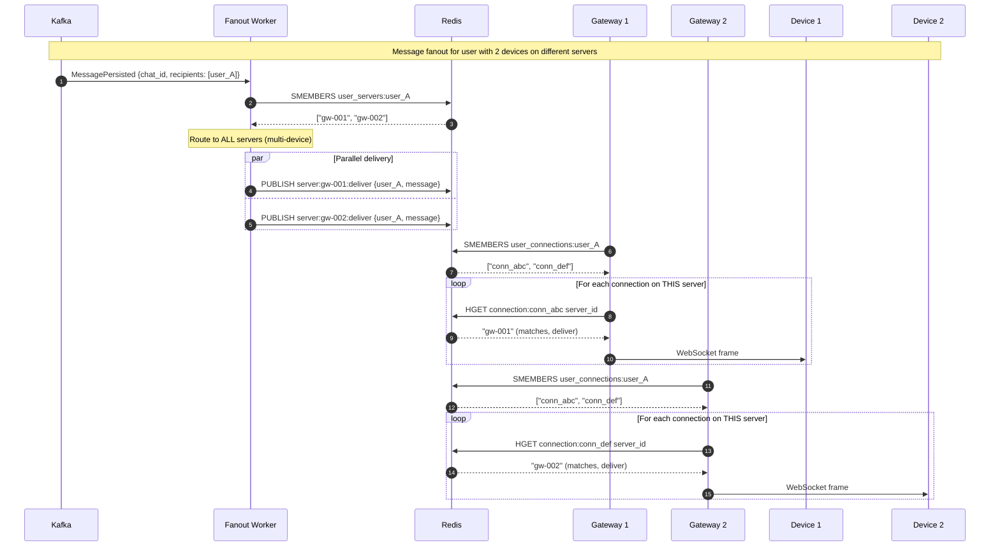
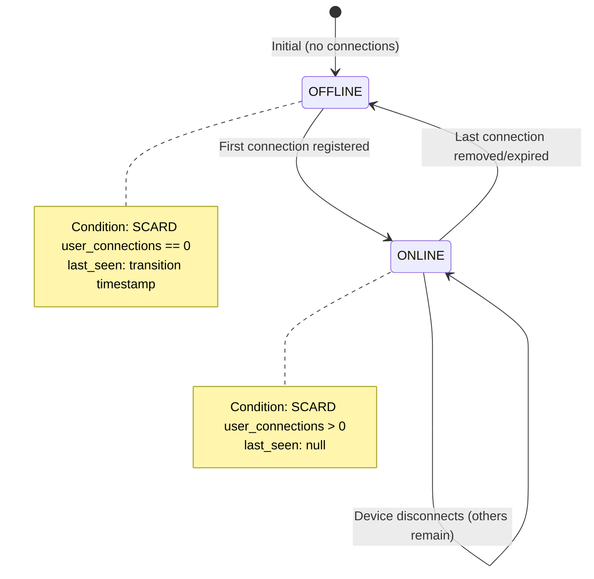

# ADR-010: Presence and Connection Routing (Redis)

- **Status**: Accepted
- **Date**: 2026-01-31

---

## Context and Problem Statement

ADR-001 through ADR-009 established the foundational architecture: per-chat ordering (ADR-001), three-plane separation (ADR-002), DynamoDB as authoritative source with Redis as ephemeral operational state (ADR-003), WebSocket protocol including heartbeat (ADR-005), and failure handling contracts (ADR-009).

ADR-002's "Future Considerations" called out: **"ADR-XXX: Presence System: Detailed design of online/offline status within Connection Plane constraints."**

ADR-003 established Redis's role:

> "Redis stores operational state that enhances performance but is not required for correctness. All Redis data can be lost without data loss."

However, "presence" is dangerously overloaded. Systems commonly conflate:

| Term | What People Mean | Actual Concern |
|------|------------------|----------------|
| "Online" | User is reachable | Connection routing |
| "Available" | User can respond | Product UX |
| "Connected" | WebSocket is open | Infrastructure state |
| "Last seen" | When user was active | Privacy feature |
| "Typing" | User is composing | Ephemeral indicator |
| "In chat" | User has chat open | Focus state |

Without explicit separation, implementations drift, consistency guarantees are violated, and debugging becomes impossible.

**This ADR establishes two distinct planes:**

1. **Connection Routing** — Infrastructure concern: given a `user_id`, find the WebSocket server(s) holding their connection(s). This enables message delivery.

2. **Presence Semantics** — Product concern: what the application displays about user availability. This is derived from connection state but has its own rules.

**Core Questions:**

- What is the authoritative source for connection routing, and what are its consistency guarantees?
- What Redis data structures, TTLs, and ownership rules govern connection state?
- What does "online" mean precisely, and what invariants does the system promise?
- How do failures (server crash, Redis outage, network partition) affect routing and presence?
- What operational metrics confirm the system is healthy?

---

## Decision Drivers

1. **Separation of Concerns**: Connection routing (infrastructure) must be cleanly separated from presence semantics (product). Different consistency requirements, different failure modes.

2. **Ephemeral by Contract**: Per ADR-003, Redis is ephemeral. Connection routing state can be lost; the only consequence is reconnection. Presence cannot promise stronger guarantees than the underlying connection model.

3. **Bounded Staleness**: Presence is eventually consistent. The staleness bound must be explicit and tied to heartbeat/TTL parameters.

4. **Zombie Prevention**: Server crashes must not leave stale routing entries. TTL-based expiration is the primary mechanism.

5. **Multi-Device Reality**: Users have multiple devices. Routing must deliver to ALL active connections. Presence must aggregate meaningfully.

6. **Consistency Ceiling**: Presence cannot promise more consistency than ADR-005's reconnection model and ADR-009's backpressure contracts allow. During partitions, presence is undefined.

7. **Operational Observability**: The system must expose metrics that confirm healthy operation and alert on degradation.

---

## Considered Options

### Option 1: Two-Level Mapping (conn_id → server_id, user_id → conn_ids)

Maintain separate mappings: `connection:{conn_id}` stores server metadata, `user_connections:{user_id}` stores connection set. Routing requires two lookups.

### Option 2: Direct Mapping (user_id → server_ids)

Collapse to single mapping: `user_servers:{user_id}` directly stores which servers hold user's connections. Single lookup for routing.

### Option 3: Server-Centric with Reverse Index

Each server maintains its connections locally. A reverse index `user_id → server_ids` enables routing. Server death requires index cleanup.

### Option 4: Hybrid with Denormalized Routing Table

Maintain both detailed connection state AND a denormalized routing table optimized for fanout. Accept write amplification for read efficiency.

---

## Decision Outcome

**Chosen Option: Option 4 — Hybrid with Denormalized Routing Table**

This approach optimizes for the critical path (message fanout) while maintaining detailed connection state for debugging and multi-device management. The denormalization is acceptable because:

- Write frequency (connect/disconnect/heartbeat) is bounded by connection count
- Read frequency (fanout routing) scales with message volume
- TTL-based expiration handles consistency automatically

---

## Part 1: Connection Routing (Infrastructure)

Connection routing answers: **"Given `user_id`, which WebSocket server(s) should receive messages for this user?"**

### 1.1 Authoritative Source and Consistency Model

| Question | Answer |
|----------|--------|
| **What is the source of truth for routing?** | Redis is the operational source of truth. There is no durable backing store. |
| **What happens if Redis loses data?** | Routing entries are lost. Clients timeout (no heartbeat ack) and reconnect. State rebuilds from new connections. |
| **What consistency does routing provide?** | Eventual consistency with bounded staleness = `EXPIRY_WINDOW` (15 seconds). |
| **Can routing be stale?** | Yes. A server may crash and its entries persist until TTL expires. Messages sent to dead servers fail; clients catch up via sync-on-reconnect (ADR-005). |

### 1.2 Redis Data Structures

```
┌─────────────────────────────────────────────────────────────────────────────┐
│                        CONNECTION ROUTING SCHEMA                            │
├─────────────────────────────────────────────────────────────────────────────┤
│                                                                             │
│  DETAILED CONNECTION STATE (for debugging, multi-device management)         │
│  ┌─────────────────────────────────────────────────────────────────────┐   │
│  │ connection:{conn_id}  →  HASH                                       │   │
│  │   user_id:       "user_01HQX..."                                    │   │
│  │   device_id:     "550e8400-e29b-..."                                │   │
│  │   server_id:     "gw-us-east-1a-001"                                │   │
│  │   connected_at:  "2026-01-31T10:00:00.000Z"                         │   │
│  │   last_heartbeat: "2026-01-31T10:05:25.000Z"                        │   │
│  │   TTL: 15 seconds (EXPIRY_WINDOW)                                   │   │
│  └─────────────────────────────────────────────────────────────────────┘   │
│                                                                             │
│  USER → CONNECTIONS MAPPING (for connection enumeration)                    │
│  ┌─────────────────────────────────────────────────────────────────────┐   │
│  │ user_connections:{user_id}  →  SET of conn_ids                      │   │
│  │   Members: ["conn_abc", "conn_def", ...]                            │   │
│  │   TTL: 15 seconds (EXPIRY_WINDOW)                                   │   │
│  └─────────────────────────────────────────────────────────────────────┘   │
│                                                                             │
│  DENORMALIZED ROUTING TABLE (optimized for fanout - PRIMARY LOOKUP)         │
│  ┌─────────────────────────────────────────────────────────────────────┐   │
│  │ user_servers:{user_id}  →  SET of server_ids                        │   │
│  │   Members: ["gw-us-east-1a-001", "gw-us-east-1a-002"]               │   │
│  │   TTL: 15 seconds (EXPIRY_WINDOW)                                   │   │
│  │   PURPOSE: O(1) routing lookup for message fanout                   │   │
│  └─────────────────────────────────────────────────────────────────────┘   │
│                                                                             │
│  SERVER → CONNECTIONS MAPPING (for graceful drain, crash recovery)          │
│  ┌─────────────────────────────────────────────────────────────────────┐   │
│  │ server_connections:{server_id}  →  SET of conn_ids                  │   │
│  │   Members: ["conn_abc", "conn_xyz", ...]                            │   │
│  │   TTL: 15 seconds (EXPIRY_WINDOW)                                   │   │
│  └─────────────────────────────────────────────────────────────────────┘   │
│                                                                             │
└─────────────────────────────────────────────────────────────────────────────┘
```

#### Key Design Decisions

| Key | Type | TTL | Write Owner | Purpose |
|-----|------|-----|-------------|---------|
| `connection:{conn_id}` | HASH | 15s | Gateway (owner of connection) | Detailed connection metadata |
| `user_connections:{user_id}` | SET | 15s | Gateway (owner of connection) | Enumerate user's connections |
| `user_servers:{user_id}` | SET | 15s | Gateway (owner of connection) | **Primary routing lookup** |
| `server_connections:{server_id}` | SET | 15s | Gateway (self) | Graceful drain, crash inventory |

### 1.3 Timing Parameters

| Parameter | Value | Rationale |
|-----------|-------|-----------|
| `HEARTBEAT_INTERVAL` | 5 seconds | Frequent enough to detect failures quickly; infrequent enough to not overwhelm |
| `EXPIRY_WINDOW` | 15 seconds | 3× heartbeat interval. Tolerates 2 missed heartbeats before expiration. |
| `HEARTBEAT_TIMEOUT` | 10 seconds | Server considers connection unhealthy after 2 missed heartbeats |

**Timing Diagram:**

```
Time:     0s      5s      10s     15s     20s
          │       │       │       │       │
Client:   ├──HB───┼──HB───┼──HB───┼──HB───┤  (healthy)
          │       │       │       │       │
Redis:    ├─TTL=15┼─TTL=15┼─TTL=15┼─TTL=15┤  (refreshed each HB)
          │       │       │       │       │

Client:   ├──HB───┼───────┼───────┼───────┤  (dies after first HB)
          │       │       │       │       │
Redis:    ├─TTL=15┼─TTL=14┼─TTL=9─┼─TTL=4─┼─EXPIRED  (at T=20s)
          │       │       │       │       │
Server:   │       │       ├─UNHEALTHY─────┤  (detected at T=10s)
```

### 1.4 Write Operations

#### Connection Establishment

```python
def register_connection(conn_id: str, user_id: str, device_id: str, server_id: str):
    """
    Called by Gateway when WebSocket connection is established.
    Write owner: Gateway that owns this connection.
    """
    now = utc_now_iso()
    
    pipe = redis.pipeline(transaction=True)
    
    # 1. Detailed connection state
    pipe.hset(f"connection:{conn_id}", mapping={
        "user_id": user_id,
        "device_id": device_id,
        "server_id": server_id,
        "connected_at": now,
        "last_heartbeat": now
    })
    pipe.expire(f"connection:{conn_id}", EXPIRY_WINDOW)
    
    # 2. User → connections mapping
    pipe.sadd(f"user_connections:{user_id}", conn_id)
    pipe.expire(f"user_connections:{user_id}", EXPIRY_WINDOW)
    
    # 3. Denormalized routing table (critical for fanout)
    pipe.sadd(f"user_servers:{user_id}", server_id)
    pipe.expire(f"user_servers:{user_id}", EXPIRY_WINDOW)
    
    # 4. Server → connections mapping
    pipe.sadd(f"server_connections:{server_id}", conn_id)
    pipe.expire(f"server_connections:{server_id}", EXPIRY_WINDOW)
    
    pipe.execute()
```

#### Heartbeat Processing

```python
def process_heartbeat(conn_id: str, user_id: str, server_id: str):
    """
    Called by Gateway on each heartbeat.
    Refreshes all TTLs and updates last_heartbeat timestamp.
    """
    now = utc_now_iso()
    
    pipe = redis.pipeline(transaction=True)
    
    # Refresh all TTLs
    pipe.expire(f"connection:{conn_id}", EXPIRY_WINDOW)
    pipe.expire(f"user_connections:{user_id}", EXPIRY_WINDOW)
    pipe.expire(f"user_servers:{user_id}", EXPIRY_WINDOW)
    pipe.expire(f"server_connections:{server_id}", EXPIRY_WINDOW)
    
    # Update heartbeat timestamp
    pipe.hset(f"connection:{conn_id}", "last_heartbeat", now)
    
    pipe.execute()
```

#### Connection Cleanup (Graceful Disconnect)

```python
def unregister_connection(conn_id: str, user_id: str, server_id: str):
    """
    Called by Gateway on graceful WebSocket close.
    Must handle partial state (some keys may have already expired).
    """
    pipe = redis.pipeline(transaction=True)
    
    # Remove connection record
    pipe.delete(f"connection:{conn_id}")
    
    # Remove from user's connection set
    pipe.srem(f"user_connections:{user_id}", conn_id)
    
    # Remove from server's connection set
    pipe.srem(f"server_connections:{server_id}", conn_id)
    
    pipe.execute()
    
    # Conditionally clean routing table
    # Only remove server from user_servers if no other connections exist
    remaining_conns = redis.smembers(f"user_connections:{user_id}")
    servers_still_needed = set()
    
    for c in remaining_conns:
        conn_data = redis.hgetall(f"connection:{c}")
        if conn_data:
            servers_still_needed.add(conn_data.get("server_id"))
    
    if server_id not in servers_still_needed:
        redis.srem(f"user_servers:{user_id}", server_id)
```

### 1.5 Read Operations (Routing)

#### Primary Routing Lookup (for Fanout)

```python
def get_servers_for_user(user_id: str) -> set[str]:
    """
    Primary routing lookup. O(1) operation.
    Returns set of server_ids where user has active connections.
    
    Used by: Fanout workers during message delivery.
    """
    return redis.smembers(f"user_servers:{user_id}")
```

#### Detailed Connection Enumeration

```python
def get_connections_for_user(user_id: str) -> list[dict]:
    """
    Returns detailed connection info for all user's connections.
    More expensive than routing lookup. Use for debugging/admin.
    """
    conn_ids = redis.smembers(f"user_connections:{user_id}")
    connections = []
    
    for conn_id in conn_ids:
        conn_data = redis.hgetall(f"connection:{conn_id}")
        if conn_data:  # May be empty if expired between SMEMBERS and HGETALL
            connections.append(conn_data)
    
    return connections
```

### 1.6 Fanout Routing Protocol

Message delivery from Fanout Plane to Connection Plane:



**Multi-Device Routing Decision**: Messages are sent to ALL servers holding user connections. Each server filters to connections it owns. This ensures all devices receive messages.

### 1.7 Failure Modes and Recovery

#### Failure: Server Crash (No Graceful Cleanup)

```
SCENARIO: Gateway gw-001 crashes while holding connections for user_A

BEFORE CRASH:
  connection:conn_abc     → {user_id: user_A, server_id: gw-001, ...}  TTL=15s
  user_connections:user_A → [conn_abc]                                  TTL=15s
  user_servers:user_A     → [gw-001]                                    TTL=15s
  server_connections:gw-001 → [conn_abc]                                TTL=15s

T+0s:   Server crashes. No cleanup executed.
T+5s:   Client notices no heartbeat_ack. Enters reconnect backoff.
T+10s:  Client attempts reconnect (to different server via LB).
T+15s:  All Redis keys EXPIRE. Zombie entries gone.

AFTER EXPIRY:
  connection:conn_abc     → (deleted)
  user_connections:user_A → (deleted or empty)
  user_servers:user_A     → (deleted or empty)
  server_connections:gw-001 → (deleted)

RECOVERY: Client reconnects to gw-002, new entries created.

INVARIANT: Zombie entries exist for at most EXPIRY_WINDOW (15s).
```

#### Failure: Redis Unavailable

```
SCENARIO: Redis cluster becomes unreachable

IMPACT:
  - New connections: REJECTED (cannot register)
  - Existing connections: CONTINUE (in-memory state on gateway)
  - Routing lookups: FAIL (fanout cannot find servers)
  - Heartbeats: FAIL (TTL refresh fails)

BEHAVIOR:
  - Gateway marks itself UNHEALTHY (fails health checks)
  - Load balancer stops routing new connections to affected gateways
  - Fanout workers: degrade to BROADCAST mode (send to all known gateways)
  - Clients: receive messages via broadcast OR timeout and reconnect

RECOVERY:
  - Redis recovers
  - Gateways re-register all in-memory connections
  - State rebuilds within EXPIRY_WINDOW
  - Fanout returns to targeted routing

GUARANTEE: No message loss. Worst case: duplicate delivery (broadcast) + delayed delivery (reconnect sync per ADR-005).
```

#### Failure: Split Brain (Two Servers Claim Same Connection)

```
SCENARIO: Network partition causes conn_abc to appear on both gw-001 and gw-002

ROOT CAUSE: Should not happen with proper conn_id generation (UUID).
            Could occur if client reconnects before old entry expires.

DETECTION:
  connection:conn_abc exists with server_id=gw-001
  Same conn_abc appears with server_id=gw-002

RESOLUTION:
  - conn_id is globally unique (UUID v4 or ULID)
  - Reconnection generates NEW conn_id
  - Old conn_id expires via TTL
  - No split brain possible if conn_id uniqueness maintained

INVARIANT: Each conn_id maps to exactly one server at any time.
           Uniqueness enforced by client-generated UUID.
```

#### Failure: Stale Routing Entry (Message to Dead Server)

```
SCENARIO: user_servers:user_A contains gw-001, but gw-001 is dead

TIMELINE:
  T+0s:   gw-001 crashes
  T+5s:   Fanout worker routes message to gw-001
  T+5s:   PUBLISH server:gw-001:deliver → no subscriber (server dead)
  T+15s:  Routing entry expires

IMPACT: Message not delivered in real-time to user_A's device on gw-001.

RECOVERY: User_A's client reconnects (to gw-002). Sync-on-reconnect (ADR-005)
          fetches missed message from Durability Plane.

GUARANTEE: Per ADR-002/ADR-005, real-time delivery is best-effort.
           Sync-on-reconnect provides the guarantee.
```

---

## Part 2: Presence Semantics (Product)

Presence semantics answer: **"What should the application display about a user's availability?"**

**Critical Distinction**: Presence is DERIVED from connection routing state. It cannot promise stronger guarantees.

### 2.1 Definitions and Invariants

| Term | Definition | Derivation |
|------|------------|------------|
| **Online** | User has ≥1 active connection with heartbeat within `EXPIRY_WINDOW` | `SCARD user_connections:{user_id} > 0` |
| **Offline** | User has 0 active connections | `SCARD user_connections:{user_id} == 0` OR key missing |
| **Last Seen** | Timestamp when user transitioned from online to offline | Stored separately on transition |

**Presence Invariants (Machine-Checkable):**

```
INVARIANT presence_derives_from_connections:
  ∀ user U, time T:
    online(U, T) ⟺ ∃ conn C: 
      C ∈ user_connections:{U} ∧ 
      connection:{C}.last_heartbeat > T - EXPIRY_WINDOW

INVARIANT multi_device_aggregation:
  ∀ user U with devices D1, D2, ..., Dn:
    online(U) ⟺ ∃ Di: connected(Di)
  -- User is online if ANY device is connected
  -- Presence aggregates by user_id, not device_id

INVARIANT eventual_consistency_bound:
  ∀ presence change P at time T:
    ∀ observer O: O.observes(P) by time T + EXPIRY_WINDOW
  -- Staleness bounded by EXPIRY_WINDOW (15 seconds)

INVARIANT presence_undefined_during_partition:
  ∀ network partition NP affecting user U:
    presence(U) = UNDEFINED during NP
  -- Presence makes no guarantees during partitions
  -- UI should indicate "presence may be inaccurate"

INVARIANT presence_ceiling:
  consistency(presence) ≤ consistency(connection_routing)
  -- Presence cannot be more consistent than underlying routing
  -- Per ADR-009, routing is eventually consistent with bounded staleness
```

### 2.2 Presence State Storage

```
┌─────────────────────────────────────────────────────────────────────────────┐
│                        PRESENCE STATE SCHEMA                                │
├─────────────────────────────────────────────────────────────────────────────┤
│                                                                             │
│  PRESENCE RECORD (derived from connection state)                            │
│  ┌─────────────────────────────────────────────────────────────────────┐   │
│  │ user_presence:{user_id}  →  HASH                                    │   │
│  │   status:        "online" | "offline"                               │   │
│  │   last_seen:     "2026-01-31T10:00:00.000Z" (null if online)       │   │
│  │   device_count:  2 (internal, not exposed)                          │   │
│  │   updated_at:    "2026-01-31T10:05:30.000Z"                         │   │
│  │   TTL: EXPIRY_WINDOW + 5s (20 seconds) - slightly longer than conn │   │
│  └─────────────────────────────────────────────────────────────────────┘   │
│                                                                             │
│  VISIBILITY SETTINGS (authoritative in DynamoDB, cached here)               │
│  ┌─────────────────────────────────────────────────────────────────────┐   │
│  │ presence_visibility:{user_id}  →  STRING                            │   │
│  │   Value: "everyone" | "contacts_only" | "nobody"                    │   │
│  │   TTL: 300 seconds (5 minutes)                                      │   │
│  │   Source of truth: DynamoDB users table                             │   │
│  └─────────────────────────────────────────────────────────────────────┘   │
│                                                                             │
└─────────────────────────────────────────────────────────────────────────────┘
```

### 2.3 Presence State Transitions



**State Transition Logic:**

```python
def update_presence_on_connect(user_id: str):
    """Called when a new connection is registered."""
    was_offline = redis.scard(f"user_connections:{user_id}") == 1  # Just became 1
    
    if was_offline:
        # Transition: OFFLINE → ONLINE
        redis.hset(f"user_presence:{user_id}", mapping={
            "status": "online",
            "last_seen": None,  # Clear last_seen when online
            "device_count": 1,
            "updated_at": utc_now_iso()
        })
        redis.expire(f"user_presence:{user_id}", EXPIRY_WINDOW + 5)
        
        # Publish presence change
        publish_presence_change(user_id, "online")
    else:
        # Already online, just increment device count
        redis.hincrby(f"user_presence:{user_id}", "device_count", 1)


def update_presence_on_disconnect(user_id: str):
    """Called when a connection is unregistered or expires."""
    remaining = redis.scard(f"user_connections:{user_id}")
    
    if remaining == 0:
        # Transition: ONLINE → OFFLINE
        now = utc_now_iso()
        redis.hset(f"user_presence:{user_id}", mapping={
            "status": "offline",
            "last_seen": now,
            "device_count": 0,
            "updated_at": now
        })
        redis.expire(f"user_presence:{user_id}", EXPIRY_WINDOW + 5)
        
        # Publish presence change
        publish_presence_change(user_id, "offline")
    else:
        # Still online on other devices
        redis.hincrby(f"user_presence:{user_id}", "device_count", -1)
```

### 2.4 Presence Propagation

**Tiered Propagation Model:**

| Tier | Latency | Recipients | Mechanism |
|------|---------|------------|-----------|
| **Tier 1** | < 1s | Active chat participants | Redis Pub/Sub to chat channel |
| **Tier 2** | < 5s | Explicit subscribers | Redis Pub/Sub to user channel |
| **Tier 3** | On-demand | Contact list, profiles | REST API query |

```python
def publish_presence_change(user_id: str, status: str):
    """
    Publishes presence change to interested parties.
    Respects privacy settings.
    """
    visibility = get_visibility_setting(user_id)
    
    if visibility == "nobody":
        return  # No propagation
    
    message = {
        "type": "presence_changed",
        "user_id": user_id,
        "status": status,
        "timestamp": utc_now_iso()
    }
    
    # Tier 1: Active chats (recent activity within 24h)
    active_chats = get_recently_active_chats(user_id, hours=24)
    for chat_id in active_chats:
        redis.publish(f"chat:{chat_id}:presence", json.dumps(message))
    
    # Tier 2: Explicit subscribers (with authorization check)
    if visibility == "everyone":
        redis.publish(f"presence:{user_id}", json.dumps(message))
    elif visibility == "contacts_only":
        # Only publish to contacts (filtered at subscription time)
        redis.publish(f"presence:{user_id}", json.dumps(message))
```

### 2.5 Privacy Controls

| Setting | Who Sees Presence | Who Sees Last Seen |
|---------|-------------------|-------------------|
| `everyone` | Any authenticated user | Any authenticated user |
| `contacts_only` (default) | Mutual contacts only | Mutual contacts only |
| `nobody` | No one (always appears offline) | No one |

**Privacy Enforcement:**

```python
def query_presence(requester_id: str, target_user_id: str) -> dict:
    """
    Query presence with privacy enforcement.
    Returns presence data or "unknown" if not authorized.
    """
    # 1. Check visibility setting (cached in Redis, authoritative in DynamoDB)
    visibility = get_visibility_setting(target_user_id)
    
    # 2. Authorize
    if visibility == "nobody":
        return {"status": "unknown", "reason": "privacy"}
    
    if visibility == "contacts_only":
        if not are_mutual_contacts(requester_id, target_user_id):
            return {"status": "unknown", "reason": "not_contacts"}
    
    # 3. Return presence
    presence = redis.hgetall(f"user_presence:{target_user_id}")
    
    if not presence:
        return {"status": "offline", "last_seen": None}
    
    return {
        "status": presence.get("status", "offline"),
        "last_seen": presence.get("last_seen")
        # device_count intentionally NOT exposed
    }
```

---

## Part 3: Operational Requirements

### 3.1 Capacity Planning

| Metric | Formula | Example (100K users, 1.5 devices/user) |
|--------|---------|----------------------------------------|
| **Connection keys** | users × devices_per_user | 150,000 keys |
| **Avg key size** | ~500 bytes (HASH) | — |
| **Memory for connections** | keys × size | ~75 MB |
| **Heartbeat QPS** | connections / HEARTBEAT_INTERVAL | 30,000 QPS |
| **Write QPS (HB)** | heartbeat_qps × 5 (keys refreshed per HB) | 150,000 write ops/sec |

### 3.2 Redis Configuration

```yaml
# Recommended Redis configuration for presence/routing

# Memory
maxmemory: 2gb
maxmemory-policy: volatile-ttl  # Evict keys with TTL first

# Persistence (DISABLED - ephemeral by design)
save: ""
appendonly: no

# Connections
maxclients: 10000

# Timeouts
timeout: 0  # Disable idle timeout (managed by app)

# Pub/Sub
# No special config; using standard channels
```

### 3.3 Metrics and Alerts

#### Tier 1 Metrics (Page-Worthy)

| Metric | Healthy | Warning | Critical | Action |
|--------|---------|---------|----------|--------|
| `redis.available` | 1 | — | 0 | Page on-call |
| `redis.used_memory_pct` | < 70% | > 80% | > 90% | Scale cluster |
| `routing.lookup_errors_rate` | < 0.1% | > 1% | > 5% | Investigate Redis health |
| `presence.stale_entries` | 0 | > 100 | > 1000 | Check for zombie cleanup issues |

#### Tier 2 Metrics (Investigate)

| Metric | Purpose | Expected Range |
|--------|---------|----------------|
| `redis.keyspace_hits` | Cache effectiveness | > 95% hit rate |
| `redis.keyspace_misses` | Cache misses | < 5% of hits |
| `redis.expired_keys` | TTL expiration rate | Correlates with disconnect rate |
| `redis.evicted_keys` | Memory pressure | Should be 0 (if > 0, scale) |
| `routing.keys_count` | Total routing entries | ~1.5× connection count |
| `heartbeat.qps` | Heartbeat volume | connections / 5 |
| `heartbeat.latency_p99` | Heartbeat processing time | < 10ms |

#### Tier 3 Metrics (Debug)

| Metric | Purpose |
|--------|---------|
| `redis.connected_clients` | Connection pool health |
| `redis.pubsub_channels` | Active pub/sub channels |
| `redis.pubsub_patterns` | Pattern subscriptions |
| `routing.multi_device_users` | Users with > 1 connection |
| `presence.transitions_per_sec` | Online/offline transition rate |

### 3.4 Operational Alerts

```yaml
alerts:
  - name: RedisUnavailable
    condition: redis.available == 0
    severity: critical
    action: "Page on-call. Routing degraded to broadcast mode."
    
  - name: HighMemoryUsage
    condition: redis.used_memory_pct > 80
    severity: warning
    action: "Scale Redis cluster or investigate key growth."
    
  - name: ZombieEntriesDetected
    condition: presence.stale_entries > 100
    severity: warning
    action: "Check for servers not cleaning up on shutdown."
    
  - name: HighEvictionRate
    condition: redis.evicted_keys > 0
    severity: critical
    action: "Memory pressure. Scale immediately or risk data loss."
    
  - name: HeartbeatLatencyHigh
    condition: heartbeat.latency_p99 > 50ms
    severity: warning
    action: "Redis under load or network issues. Investigate."
```

---

## Part 4: Test Vectors (Acceptance Criteria)

### 4.1 Connection Routing Tests

```
TEST: Server crash causes entries to expire within EXPIRY_WINDOW
  GIVEN: user_A connected to gw-001 with conn_abc
  WHEN:  gw-001 crashes at T=0 (no graceful cleanup)
  THEN:  
    - At T=14s: connection:conn_abc still exists (TTL not expired)
    - At T=16s: connection:conn_abc does NOT exist
    - At T=16s: user_servers:user_A does NOT contain gw-001
  VERIFY: Zombie entries exist for at most EXPIRY_WINDOW

TEST: Reconnect updates mapping idempotently
  GIVEN: user_A was connected to gw-001 (entry expired)
  WHEN:  user_A reconnects to gw-002 with new conn_def
  THEN:
    - user_servers:user_A contains ONLY gw-002
    - user_connections:user_A contains ONLY conn_def
    - connection:conn_def exists with server_id=gw-002
  VERIFY: No stale entries from previous connection

TEST: Multi-device routing delivers to all servers
  GIVEN: user_A has conn_abc on gw-001, conn_def on gw-002
  WHEN:  Fanout worker routes message to user_A
  THEN:
    - SMEMBERS user_servers:user_A returns [gw-001, gw-002]
    - Message published to BOTH server:gw-001:deliver AND server:gw-002:deliver
  VERIFY: All devices receive message

TEST: Stale routing entry (message to dead server)
  GIVEN: user_servers:user_A contains gw-001 (but gw-001 is dead)
  WHEN:  Fanout worker routes message to user_A
  THEN:
    - PUBLISH server:gw-001:deliver succeeds (Redis accepts)
    - No subscriber receives (gw-001 dead)
    - Entry expires at T+EXPIRY_WINDOW
    - User catches up via sync-on-reconnect
  VERIFY: No message loss; delivery via sync
```

### 4.2 Presence Tests

```
TEST: First connection transitions to ONLINE
  GIVEN: user_A has no connections (offline)
  WHEN:  user_A connects with conn_abc
  THEN:
    - user_presence:user_A.status = "online"
    - user_presence:user_A.last_seen = null
    - presence_changed event published with status="online"
  VERIFY: Correct state transition

TEST: Last connection transitions to OFFLINE
  GIVEN: user_A has exactly one connection conn_abc
  WHEN:  conn_abc disconnects
  THEN:
    - user_presence:user_A.status = "offline"
    - user_presence:user_A.last_seen = disconnect timestamp
    - presence_changed event published with status="offline"
  VERIFY: Correct state transition with last_seen

TEST: Multi-device keeps user ONLINE
  GIVEN: user_A has conn_abc (device 1) and conn_def (device 2)
  WHEN:  conn_abc disconnects
  THEN:
    - user_presence:user_A.status = "online" (unchanged)
    - user_presence:user_A.device_count = 1
    - NO presence_changed event published
  VERIFY: Aggregation by user_id, not device_id

TEST: Presence staleness bounded by EXPIRY_WINDOW
  GIVEN: user_A transitions to offline at T=0
  WHEN:  Observer queries presence at T=14s
  THEN:  Observer sees status="offline"
  VERIFY: Change visible within EXPIRY_WINDOW
```

### 4.3 Failure Mode Tests

```
TEST: Redis unavailable degrades to broadcast routing
  GIVEN: Redis cluster becomes unreachable
  WHEN:  Fanout worker attempts to route message
  THEN:
    - SMEMBERS user_servers fails
    - Fanout enters BROADCAST mode
    - Message published to ALL known gateways
    - Gateways filter to their connections (in-memory)
  VERIFY: No message loss; duplicate delivery acceptable

TEST: Redis recovery rebuilds state
  GIVEN: Redis was unavailable, now recovered
  WHEN:  Gateways detect Redis available
  THEN:
    - Each gateway re-registers all in-memory connections
    - Routing tables rebuilt within EXPIRY_WINDOW
    - Presence states derived from new routing data
  VERIFY: Full recovery with no manual intervention

TEST: Split brain prevented by conn_id uniqueness
  GIVEN: conn_abc registered on gw-001
  WHEN:  Same user reconnects before conn_abc expires
  THEN:
    - New connection gets NEW conn_id (conn_def)
    - conn_abc expires via TTL
    - No period where two servers claim same conn_id
  VERIFY: conn_id uniqueness prevents split brain
```

---

## Consequences

### Positive

1. **Clear Separation**: Connection routing (infrastructure) and presence (product) have distinct models, consistency guarantees, and failure modes.

2. **Explicit Guarantees**: Bounded staleness (EXPIRY_WINDOW), zombie prevention (TTL), multi-device semantics all explicitly defined.

3. **Operationally Observable**: Comprehensive metrics enable monitoring and alerting.

4. **Failure-Resilient**: Server crash, Redis outage, network partition all have defined behaviors and recovery paths.

5. **Test-Verified**: Acceptance criteria provide concrete validation targets.

### Negative

1. **Write Amplification**: Denormalized routing table means each heartbeat refreshes 4-5 keys.
   *Mitigation*: Acceptable at scale; Redis handles 150K+ ops/sec easily.

2. **Eventual Consistency**: Presence can be stale by up to 15 seconds.
   *Mitigation*: This is inherent to the ephemeral model. UI should indicate uncertainty.

3. **Broadcast Fallback**: Redis outage causes broadcast routing (increased traffic).
   *Mitigation*: Temporary; auto-recovers. Monitor for duration.

---

## Confirmation

Implementation validated through:

1. **Unit Tests**: State transition logic, TTL calculations, privacy enforcement
2. **Integration Tests**: Redis operations, pub/sub delivery, multi-key transactions
3. **Failure Injection Tests**: Server crash, Redis unavailable, network partition
4. **Load Tests**: Heartbeat QPS at scale, memory growth, key cardinality
5. **Operational Validation**: Metrics dashboards, alert thresholds, runbook execution

---

## Appendix A: Complete Redis Key Reference

| Key Pattern | Type | TTL | Write Owner | Read By |
|-------------|------|-----|-------------|---------|
| `connection:{conn_id}` | HASH | 15s | Gateway (owner) | Gateway, Admin |
| `user_connections:{user_id}` | SET | 15s | Gateway (owner) | Gateway, Fanout |
| `user_servers:{user_id}` | SET | 15s | Gateway (owner) | Fanout (primary) |
| `server_connections:{server_id}` | SET | 15s | Gateway (self) | Gateway (drain) |
| `user_presence:{user_id}` | HASH | 20s | Presence Service | API, Gateway |
| `presence_visibility:{user_id}` | STRING | 300s | Presence Service | API (cached) |

## Appendix B: Invariants (Machine-Checkable)

```
INVARIANT routing_ttl_bounded:
  ∀ key K ∈ {connection:*, user_connections:*, user_servers:*, server_connections:*}:
    TTL(K) ≤ EXPIRY_WINDOW
  -- All routing keys expire within EXPIRY_WINDOW

INVARIANT zombie_prevention:
  ∀ server S that crashes at time T:
    ∀ key K written by S:
      K.expires_at ≤ T + EXPIRY_WINDOW
  -- Zombie entries cleared within EXPIRY_WINDOW

INVARIANT conn_id_uniqueness:
  ∀ conn_id C, time T:
    |{K : K = connection:{C} ∧ K.exists_at(T)}| ≤ 1
  -- Each conn_id maps to at most one record at any time

INVARIANT routing_denormalization_consistent:
  ∀ user U, server S:
    S ∈ user_servers:{U} ⟺ 
      ∃ conn C: C ∈ user_connections:{U} ∧ connection:{C}.server_id = S
  -- Denormalized routing table reflects connection state

INVARIANT presence_derives_from_connections:
  ∀ user U:
    presence(U) = "online" ⟺ |user_connections:{U}| > 0
  -- Presence directly derived from connection state

INVARIANT presence_staleness_bounded:
  ∀ presence change P at time T:
    ∀ observer O: O.sees(P) by T + EXPIRY_WINDOW + propagation_delay
  -- Staleness bounded

INVARIANT presence_consistency_ceiling:
  consistency(presence) ≤ consistency(routing)
  -- Presence cannot exceed routing consistency

INVARIANT privacy_enforced:
  ∀ query Q(requester=A, target=B):
    B.visibility = "nobody" ⟹ Q.result = "unknown"
  -- Privacy always enforced

INVARIANT multi_device_delivery:
  ∀ message M to user U with connections C1, C2, ..., Cn:
    delivery_attempted(M, Ci) for all i
  -- All devices receive delivery attempt
```

## Appendix C: Related ADRs

| ADR | Relationship |
|-----|--------------|
| ADR-002 | Plane separation; Connection Plane responsibilities |
| ADR-003 | Redis as ephemeral operational state; authority hierarchy |
| ADR-005 | WebSocket protocol; heartbeat mechanism (30s interval) |
| ADR-009 | Failure handling contracts; backpressure; reconnection guarantees |
