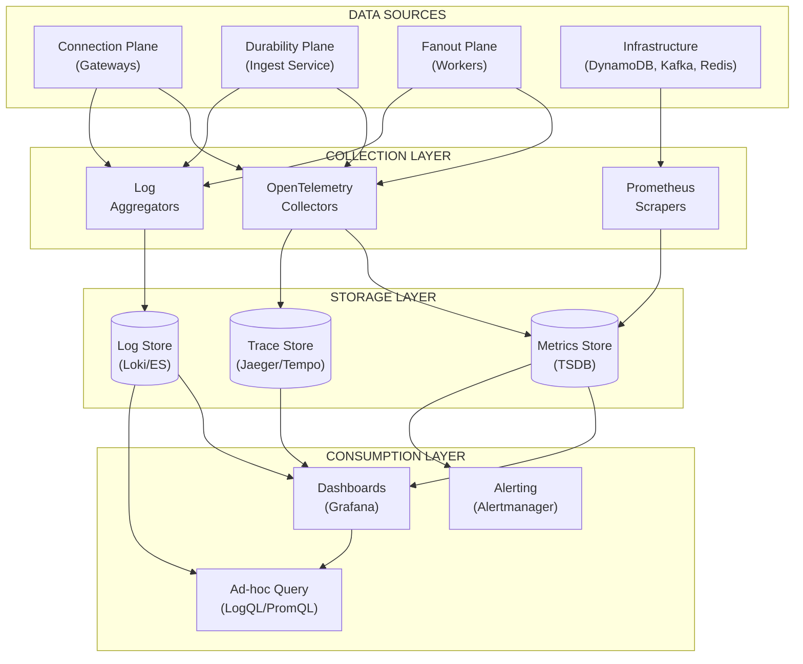
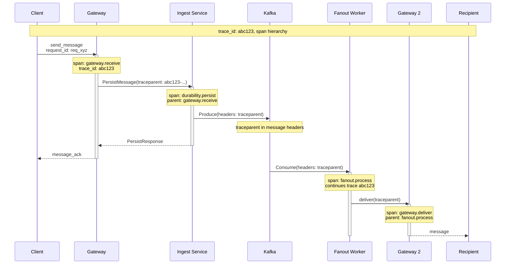
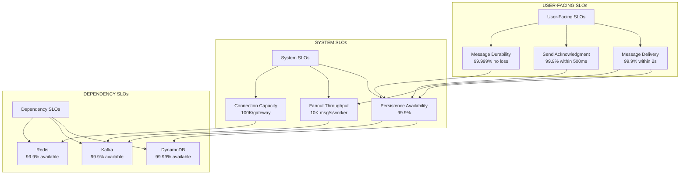
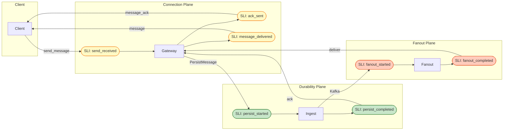
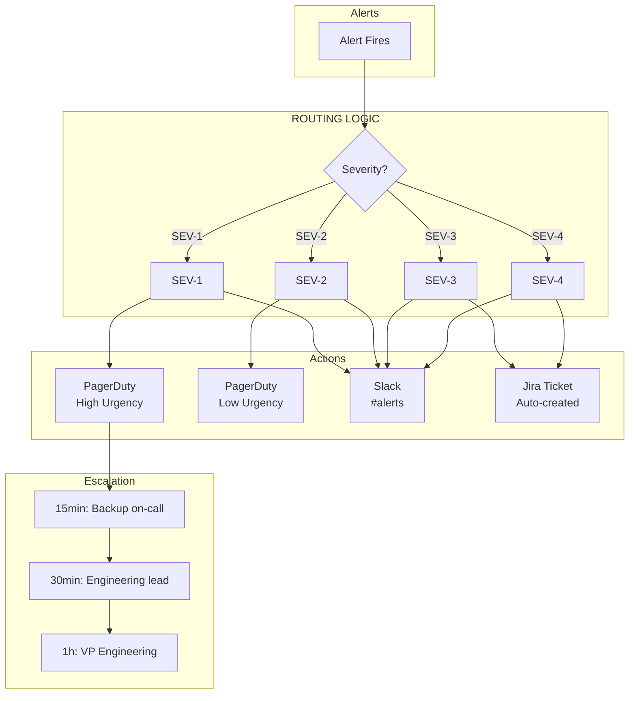
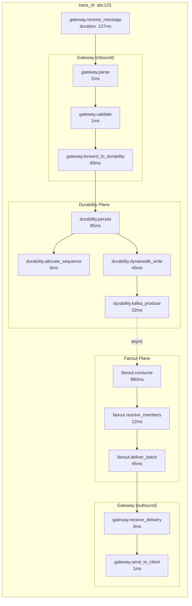
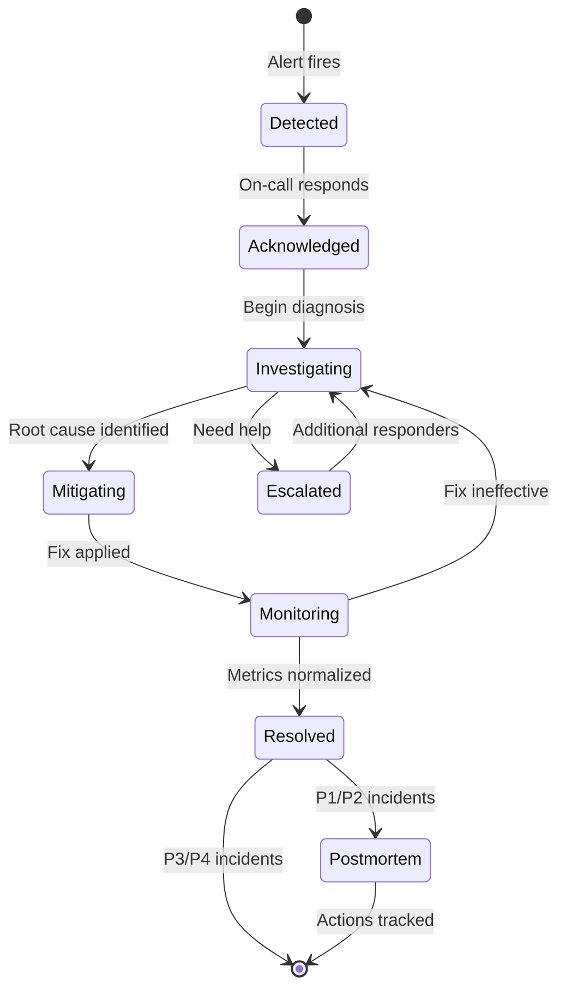

# ADR-012: Observability and SLOs

- **Status**: Accepted
- **Date**: 2026-01-31

---

## Context and Problem Statement

ADR-001 through ADR-011 established the foundational architecture: per-chat ordering with server-assigned sequences (ADR-001), three-plane separation (ADR-002), DynamoDB as authoritative source with Kafka as durable event log (ADR-003), atomic counter-based sequence allocation (ADR-004), WebSocket protocol (ADR-005), REST API contracts (ADR-006), data model specifications (ADR-007), delivery acknowledgement semantics (ADR-008), failure handling contracts (ADR-009), presence/connection routing (ADR-010), and Kafka topic design (ADR-011).

While individual ADRs define component-specific metrics and thresholds, no document provides:

- **Unified Observability Architecture**: How metrics, logs, and traces integrate across planes
- **SLO Framework**: How SLIs are measured, how SLOs relate to error budgets, and what escalation policies apply
- **Cross-Plane Correlation**: How to trace a message from client send through durability to fanout delivery
- **Dashboard Hierarchy**: What dashboards exist, who owns them, and how they relate
- **Alert Taxonomy**: Unified severity definitions, escalation paths, and runbook requirements
- **Incident Classification**: What constitutes an incident, how severity maps to response, and postmortem triggers

The MVP-DEFINITION.md states:

> "The primary goal is to explore **correctness, ordering, delivery semantics, scalability, and failure modes** under realistic constraints."

Observability is the mechanism by which we validate these properties in production. Without explicit contracts, operators cannot distinguish expected behavior from degradation, SLO violations go undetected, and incidents lack correlation across planes.

**Core Questions:**

- What is the **unified observability architecture** across all three planes?
- What are the **normative SLO definitions** with explicit SLI formulas and measurement windows?
- How do **metrics, logs, and traces correlate** for cross-plane debugging?
- What is the **alert severity taxonomy** and escalation policy?
- How are **dashboards organized** for different operational personas?

---

## Decision Drivers

1. **Correctness Verification**: Observability must enable validation of ADR invariants (ACK = Durability, per-chat ordering, no silent message loss).

2. **SLO-Driven Operations**: Operators need error budgets to make deployment decisions and prioritize reliability work.

3. **Cross-Plane Debugging**: A single message traverses Gateway → Durability → Fanout → Gateway. Tracing must span all planes.

4. **Signal-to-Noise Ratio**: Alerts must be actionable. Tier 1 alerts page humans; Tier 2/3 inform but don't interrupt.

5. **Cost-Conscious Design**: High-cardinality metrics and verbose logging have real costs. The design must balance observability depth with operational cost.

6. **Persona-Driven Dashboards**: On-call engineers, capacity planners, and incident commanders have different information needs.

7. **Alignment with Industry Standards**: Use OpenTelemetry semantics, Prometheus metric naming conventions, and SRE best practices.

---

## Considered Options

### Option 1: Per-Plane Independent Observability

Each plane owns its observability stack; no cross-plane correlation.

**Mechanism**: Separate metric namespaces, separate logging pipelines, no distributed tracing.

### Option 2: Centralized Observability with Loose Coupling

Unified metric/log/trace backends; planes emit to central collectors using standard formats.

**Mechanism**: OpenTelemetry collectors aggregate data; correlation via trace_id and request_id; dashboards query unified backend.

### Option 3: Fully Integrated APM Solution

Use a commercial APM vendor for end-to-end observability.

**Mechanism**: Vendor-specific agents, proprietary protocols, managed backend.

### Option 4: Hybrid with Explicit Contracts

Unified semantics and correlation contracts; flexible backend implementation.

**Mechanism**: Define standard labels, trace propagation requirements, and SLI formulas; allow backend substitution.

---

## Decision Outcome

**Chosen Option: Option 4 — Hybrid with Explicit Contracts**

This approach defines normative observability contracts (metric names, label schemas, trace propagation requirements, SLI formulas) while allowing backend flexibility (Prometheus/Grafana, Datadog, or custom). The contracts ensure cross-plane correlation without mandating specific vendor implementations.

---

## Part 1: Observability Architecture

### 1.1 Three Pillars Overview



### 1.2 Correlation Strategy

All observability data is correlated via three identifiers:

| Identifier | Scope | Propagation | Purpose |
|------------|-------|-------------|---------|
| `trace_id` | Cross-plane | W3C Trace Context header | End-to-end request tracing |
| `request_id` | Single request | Protocol messages (ADR-005) | Client-visible correlation |
| `message_id` | Single message | Kafka headers, logs | Message lifecycle tracking |

**Trace Context Propagation:**



### 1.3 Metric Naming Conventions

All metrics follow Prometheus naming conventions with plane prefixes:

```
<plane>_<subsystem>_<metric>_<unit>
```

| Plane | Prefix | Example |
|-------|--------|---------|
| Connection | `gateway_` | `gateway_connections_active` |
| Durability | `durability_` | `durability_persist_duration_seconds` |
| Fanout | `fanout_` | `fanout_delivery_total` |
| Cross-plane | `messaging_` | `messaging_e2e_latency_seconds` |

**Standard Labels:**

| Label | Cardinality | Required On | Description |
|-------|-------------|-------------|-------------|
| `instance` | Low | All metrics | Pod/host identifier |
| `plane` | 3 | Cross-plane | connection/durability/fanout |
| `status` | Low | Counters | success/error/timeout |
| `error_code` | Medium | Error counters | Application error code |
| `chat_id` | **HIGH** | **Never on metrics** | Use logs/traces only |
| `user_id` | **HIGH** | **Never on metrics** | Use logs/traces only |

> **CRITICAL**: High-cardinality labels (`chat_id`, `user_id`, `message_id`) MUST NOT appear on metrics. They cause cardinality explosion and storage cost blowup. Use structured logs with these identifiers instead.

### 1.4 Structured Logging Schema

All logs follow a unified JSON schema:

```json
{
  "timestamp": "2026-01-31T10:00:00.123456Z",
  "level": "INFO",
  "service": "gateway",
  "instance": "gw-us-east-1a-001",
  "trace_id": "abc123def456",
  "span_id": "789xyz",
  "request_id": "req_01HQX...",
  "event": "message_received",
  "message_id": "msg_01HQX...",
  "chat_id": "chat_01HQX...",
  "user_id": "user_01HQX...",
  "latency_ms": 45,
  "error_code": null,
  "metadata": {
    "content_length": 256,
    "connection_id": "conn_01HQX..."
  }
}
```

**Required Fields by Event Type:**

| Event Category | Required Fields |
|----------------|-----------------|
| Request received | timestamp, service, trace_id, request_id, event |
| Message processed | + message_id, chat_id, user_id |
| Error occurred | + error_code, error_message |
| Latency recorded | + latency_ms, operation |

---

## Part 2: SLO Framework

### 2.1 SLO Hierarchy



### 2.2 SLO Definitions

#### User-Facing SLOs

| SLO | SLI Formula | Target | Window | Error Budget (30d) |
|-----|-------------|--------|--------|-------------------|
| **Message Durability** | `1 - (lost_messages / acked_messages)` | 99.999% | 30 days | 0.001% (~10 per million) |
| **Send Latency** | `P99(ack_time - send_time) where status=success` | < 500ms | 1 hour | N/A (latency SLO) |
| **Delivery Latency** | `P99(delivered_time - persisted_time) where recipient=online` | < 2s | 1 hour | N/A (latency SLO) |
| **Availability** | `1 - (failed_sends / total_sends)` | 99.9% | 30 days | 0.1% (~43 min downtime) |

#### System SLOs

| SLO | SLI Formula | Target | Window |
|-----|-------------|--------|--------|
| **Persistence Success Rate** | `successful_persists / persist_attempts` | 99.95% | 1 hour |
| **Fanout Processing Rate** | `processed_events / consumed_events` | 99.9% | 1 hour |
| **Connection Stability** | `1 - (server_disconnects / total_disconnects)` | 95% | 1 hour |
| **Sync Success Rate** | `successful_syncs / sync_attempts` | 99.9% | 1 hour |

### 2.3 SLI Measurement Points



**SLI Calculation Examples:**

```promql
# Message Durability SLI (per 30-day window)
# Lost = acked but never persisted (should be 0 with ACK=Durability)
1 - (
  sum(increase(durability_ack_sent_total{persisted="false"}[30d]))
  /
  sum(increase(durability_ack_sent_total[30d]))
)

# Send Latency P99 (per 1-hour window)
histogram_quantile(0.99,
  sum(rate(gateway_send_latency_seconds_bucket[1h])) by (le)
)

# Availability SLI (per 30-day window)
1 - (
  sum(increase(gateway_send_total{status="error"}[30d]))
  /
  sum(increase(gateway_send_total[30d]))
)

# Delivery Latency P99 (online recipients only)
histogram_quantile(0.99,
  sum(rate(fanout_delivery_latency_seconds_bucket{recipient_online="true"}[1h])) by (le)
)
```

### 2.4 Error Budget Policy

| Budget Remaining | State | Deployment Policy | Alert Level |
|------------------|-------|-------------------|-------------|
| > 50% | Healthy | Normal releases | None |
| 25-50% | Caution | Feature freeze; reliability only | Slack notification |
| 10-25% | Warning | Change freeze; incident response | PagerDuty low-urgency |
| < 10% | Critical | Emergency changes only | PagerDuty high-urgency |
| Exhausted | SLO Breach | Full freeze; postmortem required | Executive escalation |

**Error Budget Burn Rate Alerts:**

| Condition | Severity | Response |
|-----------|----------|----------|
| 14.4x burn rate for 1 hour | SEV-1 | 100% budget consumed in 5 days at this rate |
| 6x burn rate for 6 hours | SEV-2 | 100% budget consumed in 12 days at this rate |
| 3x burn rate for 1 day | SEV-3 | 100% budget consumed in 10 days at this rate |
| 1x burn rate for 3 days | SEV-4 | On track to exhaust budget |

### 2.5 Signal Authority Hierarchy

When observability signals disagree — which they will during partial outages, clock skew, or collection failures — the system requires an explicit authority hierarchy. Without this, incident responders waste time debating which number is "right."

**Authority Precedence (Highest to Lowest):**

| Rank | Signal Type | Authoritative For | Rationale |
|------|-------------|-------------------|-----------|
| **1** | DynamoDB query results | Message existence, sequence integrity | ADR-003: DynamoDB is source of truth |
| **2** | Kafka offset + headers | Event ordering, processing state | Immutable log; survives restarts |
| **3** | Metrics (counters) | Throughput, error rates, SLI calculation | Designed for aggregation; sampled consistently |
| **4** | Structured logs | Individual request details, error context | High-cardinality detail; may be sampled |
| **5** | Traces | Request flow, latency breakdown | Sampled; useful for diagnosis, not counting |

**Conflict Resolution Rules:**

| Conflict | Resolution | Example |
|----------|------------|---------|
| Metric count ≠ log count | Trust metrics | Logs may be sampled or dropped under load |
| Metric says success, DynamoDB missing | Trust DynamoDB | Metric instrumentation bug |
| Trace shows latency, metric histogram differs | Trust metrics | Trace sampling skews distribution |
| Kafka offset says processed, metric says not | Trust Kafka | Metric emission failed; message was processed |
| Two metrics disagree | Trust the one closer to source of truth | `durability_persist_total` > `gateway_forward_total` |

> **INCIDENT RULE**: During active incidents, if signal authority is disputed, the Incident Commander declares which signal is authoritative for that incident. This decision is documented in the incident timeline and revisited in postmortem.

**Why Metrics Over Logs for SLIs:**

Logs are vulnerable to:
- Sampling under high load (especially verbose levels)
- Aggregator backpressure dropping entries
- Clock skew affecting time-window queries
- Parser failures on malformed entries

Metrics are:
- Pre-aggregated at the source
- Pushed on fixed intervals regardless of load
- Immune to log pipeline failures
- Designed for time-series queries

Therefore: **All SLI calculations MUST use metrics as the primary signal.** Logs are for diagnosis and audit trails, not SLO measurement.

### 2.6 Clock Semantics for Latency SLIs

Latency SLIs are sensitive to clock skew between components. This section defines authoritative timestamps for each latency measurement.

**Timestamp Sources:**

| Component | Clock Source | Sync Requirement | Skew Tolerance |
|-----------|--------------|------------------|----------------|
| Client | Device clock | None (untrusted) | N/A |
| Gateway | Server clock | NTP, < 100ms drift | ± 100ms |
| Durability Plane | Server clock | NTP, < 100ms drift | ± 100ms |
| Fanout Plane | Server clock | NTP, < 100ms drift | ± 100ms |
| DynamoDB | AWS-managed | Trusted | ± 10ms |
| Kafka | Broker clock | NTP, < 100ms drift | ± 100ms |

**Latency SLI Definitions (Clock-Precise):**

| SLI | Start Timestamp | End Timestamp | Clock Trust |
|-----|-----------------|---------------|-------------|
| **Send Latency** | Gateway receives `send_message` (gateway clock) | Gateway sends `message_ack` (gateway clock) | Single server; no skew |
| **Persist Latency** | Durability Plane receives RPC (durability clock) | DynamoDB commit confirmed (durability clock) | Single server; no skew |
| **Kafka Produce Latency** | Durability Plane calls produce (durability clock) | Kafka ack received (durability clock) | Single server; no skew |
| **Delivery Latency** | `created_at` in Kafka event (durability clock at persist time) | Gateway sends to recipient (recipient gateway clock) | Cross-server; ± 200ms |
| **End-to-End Latency** | `created_at` in Kafka event (durability clock) | Recipient gateway sends message (gateway clock) | Cross-server; ± 200ms |

> **CRITICAL**: Client timestamps are NEVER used for SLI calculation. Clients may have arbitrarily wrong clocks. All latency SLIs use server-side timestamps only.

**Handling Clock Skew in Cross-Server Measurements:**

For `Delivery Latency` and `End-to-End Latency`, which span servers:

1. **Measurement**: Record `created_at` from Kafka event (set by Durability Plane at persist time) and delivery timestamp from recipient Gateway.

2. **Skew Detection**: If `delivery_time < created_at` (negative latency), this indicates clock skew. These samples are:
   - Logged with `clock_skew_detected: true`
   - Excluded from SLI histogram (they would corrupt percentiles)
   - Counted in `messaging_clock_skew_samples_total` metric

3. **Skew Alerting**: If `messaging_clock_skew_samples_total` exceeds 1% of deliveries over 1 hour, alert for NTP investigation.

```promql
# Clock skew detection
rate(messaging_clock_skew_samples_total[1h]) 
/ 
rate(fanout_delivery_total[1h]) > 0.01
```

### 2.7 Sampling Bias and Correctness Coverage

Head-based sampling (1% of normal traffic) is cost-effective but creates a coverage gap: rare correctness bugs may never appear in sampled traces. This section defines additional sampling rules to ensure correctness invariants remain observable.

**Sampling Strategy Matrix:**

| Traffic Type | Head-Based Rate | Tail-Based Retention | Rationale |
|--------------|-----------------|----------------------|-----------|
| Normal success | 1% | No | Cost management |
| Errors (any) | 100% | Yes | All errors are valuable |
| Latency > P99 | 100% | Yes | Outliers reveal issues |
| Correctness signals | 100% | Yes | Invariant violations |
| Debug header present | 100% | Yes | Explicit investigation |
| Low-traffic periods | Elevated (10%) | Yes | Maintain sample size |

**Correctness Signal Sampling (Always 100%):**

The following events are ALWAYS traced and logged, regardless of head-based sampling decision:

| Signal | Detection Point | Why Always Sampled |
|--------|-----------------|-------------------|
| Idempotency cache hit | Durability Plane | May indicate client bug or replay attack |
| Sequence gap detected | Durability Plane | Ordering invariant at risk |
| Transaction conflict | Durability Plane | Contention or race condition |
| DLQ write | Fanout Plane | Permanent processing failure |
| Duplicate delivery attempt | Gateway | Fanout idempotency issue |
| Sync response with gaps | Gateway | Client state divergence |
| Counter value anomaly | Durability Plane | Sequence integrity at risk |

**Implementation:**

```python
def should_force_sample(event: Event) -> bool:
    """
    Correctness signals always sampled, regardless of head-based decision.
    """
    CORRECTNESS_SIGNALS = {
        "idempotency_hit",
        "sequence_gap",
        "transaction_conflict", 
        "dlq_write",
        "duplicate_delivery",
        "sync_gap_detected",
        "counter_anomaly",
    }
    return event.type in CORRECTNESS_SIGNALS
```

**Low-Traffic Coverage Guarantee:**

During low-traffic periods (< 100 requests/minute), the 1% sampling rate may yield zero samples, hiding issues. To address this:

| Traffic Rate | Effective Sample Rate | Minimum Samples/Hour |
|--------------|----------------------|----------------------|
| > 10,000/min | 1% | ~6,000 |
| 1,000-10,000/min | 1% | ~600 |
| 100-1,000/min | 10% | ~60 |
| < 100/min | 100% | All |

```promql
# Dynamic sampling rate based on traffic
min(1.0, max(0.01, 100 / rate(gateway_messages_received_total[5m])))
```

> **INVARIANT**: At least 60 traces per hour MUST be captured during any period when the system is processing traffic. If traffic is so low that 100% sampling yields < 60 traces/hour, this is acceptable (genuinely low traffic), but the system must never drop below this due to aggressive sampling.

---

## Part 3: Metrics Catalog

### 3.1 Connection Plane Metrics

| Metric | Type | Labels | Description |
|--------|------|--------|-------------|
| `gateway_connections_active` | Gauge | instance | Current WebSocket connections |
| `gateway_connections_total` | Counter | instance, status | Connection attempts |
| `gateway_messages_received_total` | Counter | instance, type | Inbound messages by type |
| `gateway_messages_sent_total` | Counter | instance, type | Outbound messages by type |
| `gateway_send_latency_seconds` | Histogram | instance | Client send → ack latency |
| `gateway_buffer_size_bytes` | Histogram | instance | Outbound buffer utilization |
| `gateway_slow_consumer_disconnects_total` | Counter | instance | Backpressure disconnections |
| `gateway_heartbeat_latency_seconds` | Histogram | instance | Heartbeat round-trip time |
| `gateway_auth_failures_total` | Counter | instance, reason | Authentication failures |

### 3.2 Durability Plane Metrics

| Metric | Type | Labels | Description |
|--------|------|--------|-------------|
| `durability_persist_total` | Counter | instance, status | Persist attempts |
| `durability_persist_duration_seconds` | Histogram | instance | DynamoDB + Kafka write time |
| `durability_sequence_allocation_duration_seconds` | Histogram | instance | Counter increment latency |
| `durability_idempotency_hits_total` | Counter | instance | Duplicate detection count |
| `durability_transaction_conflicts_total` | Counter | instance | DynamoDB conditional check failures |
| `durability_kafka_produce_duration_seconds` | Histogram | instance | Kafka produce latency |
| `durability_dynamodb_errors_total` | Counter | instance, error_type | DynamoDB error breakdown |
| `durability_circuit_breaker_state` | Gauge | instance, dependency | 0=closed, 1=open, 0.5=half-open |

### 3.3 Fanout Plane Metrics

| Metric | Type | Labels | Description |
|--------|------|--------|-------------|
| `fanout_events_consumed_total` | Counter | instance, topic | Kafka events consumed |
| `fanout_events_processed_total` | Counter | instance, status | Processing outcomes |
| `fanout_delivery_total` | Counter | instance, status | Delivery attempts |
| `fanout_delivery_latency_seconds` | Histogram | instance | Persist → deliver latency |
| `fanout_consumer_lag` | Gauge | instance, partition | Kafka consumer lag |
| `fanout_batch_size` | Histogram | instance | Recipients per message |
| `fanout_membership_cache_hits_total` | Counter | instance | Cache hit count |
| `fanout_membership_cache_misses_total` | Counter | instance | Cache miss count |
| `fanout_dlq_events_total` | Counter | instance, reason | Dead letter queue writes |

### 3.4 Cross-Plane Metrics

| Metric | Type | Labels | Description |
|--------|------|--------|-------------|
| `messaging_e2e_latency_seconds` | Histogram | — | Client send → recipient receive |
| `messaging_messages_in_flight` | Gauge | plane | Messages currently processing |
| `messaging_slo_error_budget_remaining` | Gauge | slo_name | Current error budget (0-1) |
| `messaging_clock_skew_samples_total` | Counter | source_plane, dest_plane | Samples with negative latency (clock skew) |

### 3.5 Infrastructure Metrics (Collected via Cloud Provider)

| Service | Key Metrics | Alert Threshold |
|---------|-------------|-----------------|
| **DynamoDB** | ConsumedRCU, ConsumedWCU, ThrottledRequests, SuccessfulRequestLatency | Throttling > 0, Latency P99 > 100ms |
| **Kafka** | UnderReplicatedPartitions, OfflinePartitionsCount, RequestHandlerAvgIdlePercent | Under-replicated > 0, Offline > 0 |
| **Redis** | UsedMemory, ConnectedClients, KeyspaceHits/Misses, EvictedKeys | Memory > 80%, Evictions > 0 |

---

## Part 4: Alert Taxonomy

### 4.1 Severity Definitions

| Severity | Response Time | Escalation | Notification | Examples |
|----------|---------------|------------|--------------|----------|
| **SEV-1** | Immediate (< 5 min) | Page on-call + backup | PagerDuty high-urgency | Data loss, complete outage, SLO breach |
| **SEV-2** | < 30 min | Page on-call | PagerDuty low-urgency | Partial outage, degradation, error budget burn |
| **SEV-3** | < 4 hours | Slack alert | Slack #alerts | Performance degradation, elevated errors |
| **SEV-4** | Next business day | Ticket | Slack + Jira | Capacity warning, non-urgent issues |

### 4.2 Alert Catalog

#### Tier 1: Correctness Alerts (SEV-1/SEV-2)

| Alert Name | Condition | Severity | Runbook |
|------------|-----------|----------|---------|
| `MessageLoss` | `durability_ack_sent{persisted="false"} > 0` | SEV-1 | RB-001 |
| `DuplicateSequence` | `durability_duplicate_sequence_total > 0` | SEV-1 | RB-002 |
| `CounterCorruption` | `durability_counter_missing_total > 0` | SEV-1 | RB-003 |
| `DynamoDBUnavailable` | `durability_dynamodb_available == 0 for 10s` | SEV-1 | RB-004 |
| `KafkaUnavailable` | `durability_kafka_available == 0 for 30s` | SEV-2 | RB-005 |
| `SLOBreachDurability` | `messaging_slo_error_budget_remaining{slo="durability"} <= 0` | SEV-1 | RB-006 |
| `SLOBreachAvailability` | `messaging_slo_error_budget_remaining{slo="availability"} <= 0` | SEV-1 | RB-007 |

#### Tier 2: Capacity/Performance Alerts (SEV-2/SEV-3)

| Alert Name | Condition | Severity | Runbook |
|------------|-----------|----------|---------|
| `HighPersistLatency` | `durability_persist_duration_seconds{quantile="0.99"} > 0.5 for 5m` | SEV-3 | RB-010 |
| `HighConsumerLag` | `fanout_consumer_lag > 10000 for 5m` | SEV-3 | RB-011 |
| `CircuitBreakerOpen` | `durability_circuit_breaker_state == 1 for 1m` | SEV-2 | RB-012 |
| `HighSlowConsumerRate` | `rate(gateway_slow_consumer_disconnects_total[5m]) > 50` | SEV-3 | RB-013 |
| `ConnectionCapacityWarning` | `gateway_connections_active / gateway_connections_limit > 0.9` | SEV-3 | RB-014 |
| `ErrorBudgetBurnHigh` | `14.4x burn rate for 1h` | SEV-2 | RB-015 |
| `DynamoDBThrottling` | `aws_dynamodb_throttled_requests > 0 for 1m` | SEV-3 | RB-016 |

#### Tier 3: Operational Alerts (SEV-4/Slack)

| Alert Name | Condition | Severity | Runbook |
|------------|-----------|----------|---------|
| `HighIdempotencyHitRate` | `durability_idempotency_hit_rate > 0.1 for 15m` | SEV-4 | RB-020 |
| `ElevatedTransactionConflicts` | `durability_transaction_conflict_rate > 0.05 for 15m` | SEV-4 | RB-021 |
| `DLQAccumulating` | `increase(fanout_dlq_events_total[1h]) > 100` | SEV-4 | RB-022 |
| `CacheMissRateHigh` | `fanout_membership_cache_misses / (hits + misses) > 0.5 for 15m` | SEV-4 | RB-023 |
| `RedisMemoryWarning` | `redis_memory_used_bytes / redis_memory_max_bytes > 0.8` | SEV-4 | RB-024 |
| `ClockSkewElevated` | `rate(messaging_clock_skew_samples_total[1h]) / rate(fanout_delivery_total[1h]) > 0.01` | SEV-4 | RB-025 |

### 4.3 Alert Routing



### 4.4 SLO Ownership

Each SLO has a single accountable owner. This prevents diffusion of responsibility and ensures clear escalation paths.

| SLO | Owner | Backup Owner | Escalation |
|-----|-------|--------------|------------|
| **Message Durability** | Durability Plane Team Lead | Platform Engineering Manager | VP Engineering |
| **Send Latency** | Durability Plane Team Lead | Connection Plane Team Lead | Platform Engineering Manager |
| **Delivery Latency** | Fanout Plane Team Lead | Connection Plane Team Lead | Platform Engineering Manager |
| **Availability** | Platform Engineering Manager | VP Engineering | CTO |

**Ownership Responsibilities:**

| Responsibility | Description |
|----------------|-------------|
| **SLI Accuracy** | Ensure SLI calculation is correct and instrumentation is reliable |
| **Error Budget Tracking** | Monitor burn rate; communicate status weekly |
| **Alert Tuning** | Adjust thresholds based on operational experience |
| **Incident Response** | Be available (or delegate) when SLO-related alerts fire |
| **Postmortem Ownership** | Lead postmortem for SLO breaches in their domain |
| **Capacity Planning** | Project when current capacity will breach SLO targets |

**Error Budget Review Cadence:**

| Frequency | Attendees | Agenda |
|-----------|-----------|--------|
| Weekly | SLO owners + on-call | Budget status, recent incidents, alert tuning |
| Monthly | SLO owners + engineering leadership | Trend analysis, capacity planning, roadmap impact |
| Quarterly | Engineering + product leadership | SLO target review, trade-off decisions |

### 4.5 Non-Negotiable Alerts

Certain alerts represent correctness invariants so fundamental that they **cannot be muted, downgraded, or auto-resolved**. These alerts require human acknowledgment and investigation regardless of circumstances.

**Non-Negotiable Alert List:**

| Alert | Invariant Protected | Why Non-Negotiable |
|-------|---------------------|-------------------|
| `MessageLoss` | ACK = Durability | Violates core system promise; potential data loss |
| `DuplicateSequence` | Per-chat ordering | Breaks ordering guarantee; corruption indicator |
| `CounterCorruption` | Sequence integrity | Foundational data structure compromised |

**Non-Negotiable Alert Properties:**

```yaml
# These alerts have special handling in Alertmanager/PagerDuty

non_negotiable_alerts:
  - name: MessageLoss
    properties:
      mute_allowed: false
      auto_resolve_allowed: false
      snooze_allowed: false
      downgrade_allowed: false
      ack_required: true
      ack_timeout: 5m  # Re-pages if not acked
      min_severity: critical
      escalation_override: true  # Always escalates regardless of time
      
  - name: DuplicateSequence
    properties:
      mute_allowed: false
      auto_resolve_allowed: false
      snooze_allowed: false
      downgrade_allowed: false
      ack_required: true
      ack_timeout: 5m
      min_severity: critical
      escalation_override: true
      
  - name: CounterCorruption
    properties:
      mute_allowed: false
      auto_resolve_allowed: false
      snooze_allowed: false
      downgrade_allowed: false
      ack_required: true
      ack_timeout: 5m
      min_severity: critical
      escalation_override: true
```

**Enforcement:**

1. **Technical**: Alertmanager configuration validates that non-negotiable alerts cannot have silence rules or inhibition rules applied.

2. **Process**: Any request to modify non-negotiable alert behavior requires:
   - Written justification
   - Platform Engineering Manager approval
   - VP Engineering approval
   - ADR amendment documenting the change

3. **Audit**: Weekly automated report of any attempted mute/silence on non-negotiable alerts, sent to engineering leadership.

> **OPERATIONAL RULE**: If a non-negotiable alert is firing continuously due to a known, accepted issue, the correct response is to **fix the issue**, not to silence the alert. If the issue cannot be fixed immediately, the team must:
> 1. Document the known issue in the incident management system
> 2. Create a tracking ticket with SLA
> 3. Add a "known issue" annotation to the alert (visible in dashboards)
> 4. Continue to acknowledge each page until resolved

**Rationale for Non-Negotiable Status:**

These three alerts protect invariants that, if violated, mean the system is **fundamentally broken** in ways that users cannot recover from:

- **MessageLoss**: User sent a message, got an ACK, but message is gone. Trust is destroyed.
- **DuplicateSequence**: Two messages have the same sequence in a chat. Ordering is corrupted; sync is broken.
- **CounterCorruption**: The sequence counter is missing or invalid. The chat can no longer accept messages safely.

Any of these conditions represents a **potential data integrity incident** that warrants immediate human investigation, even if it's a false positive. The cost of investigating a false positive is far lower than the cost of missing a real correctness failure.

---

## Part 5: Dashboard Hierarchy

### 5.1 Dashboard Catalog

| Dashboard | Audience | Refresh | Purpose |
|-----------|----------|---------|---------|
| **Executive Summary** | Leadership | 5 min | SLO status, error budgets, key business metrics |
| **On-Call Overview** | On-call engineer | 30 sec | Active alerts, system health, recent changes |
| **Connection Plane** | Platform team | 30 sec | Gateway metrics, connection stats, protocol errors |
| **Durability Plane** | Platform team | 30 sec | Persist latency, DynamoDB health, Kafka produce |
| **Fanout Plane** | Platform team | 30 sec | Consumer lag, delivery stats, DLQ |
| **Capacity Planning** | Capacity team | 1 hour | Resource utilization, growth trends, projections |
| **Incident Investigation** | Incident commander | 10 sec | Drill-down views, trace links, log queries |

### 5.2 Executive Summary Dashboard

```
┌─────────────────────────────────────────────────────────────────────────┐
│                        EXECUTIVE SUMMARY                                 │
├─────────────────────────────────────────────────────────────────────────┤
│                                                                          │
│  ┌─────────────┐  ┌─────────────┐  ┌─────────────┐  ┌─────────────┐    │
│  │ DURABILITY  │  │ AVAILABILITY│  │ SEND P99    │  │ DELIVERY P99│    │
│  │   99.999%   │  │   99.95%    │  │   127ms     │  │   890ms     │    │
│  │  ✓ Target   │  │  ✓ Target   │  │  ✓ <500ms   │  │  ✓ <2s      │    │
│  └─────────────┘  └─────────────┘  └─────────────┘  └─────────────┘    │
│                                                                          │
│  ERROR BUDGET STATUS (30-day window)                                     │
│  ┌────────────────────────────────────────────────────────────────┐    │
│  │ Durability  ██████████████████████████████████████████░░░ 87%  │    │
│  │ Availability██████████████████████████████░░░░░░░░░░░░░░ 62%   │    │
│  └────────────────────────────────────────────────────────────────┘    │
│                                                                          │
│  TRAFFIC (24h)                    │  ACTIVE INCIDENTS                   │
│  ┌────────────────────────────┐  │  ┌─────────────────────────────┐   │
│  │  Messages: 12.4M           │  │  │  None                       │   │
│  │  Peak QPS: 2,847           │  │  │                             │   │
│  │  Connections: 47,293       │  │  │                             │   │
│  └────────────────────────────┘  │  └─────────────────────────────┘   │
│                                                                          │
└─────────────────────────────────────────────────────────────────────────┘
```

### 5.3 On-Call Overview Dashboard

```
┌─────────────────────────────────────────────────────────────────────────┐
│                         ON-CALL OVERVIEW                                 │
├─────────────────────────────────────────────────────────────────────────┤
│                                                                          │
│  ACTIVE ALERTS (0)              │  SYSTEM HEALTH                        │
│  ┌────────────────────────────┐ │  ┌─────────────────────────────────┐ │
│  │  ✓ No active alerts        │ │  │  Connection Plane    ✓ Healthy  │ │
│  │                            │ │  │  Durability Plane    ✓ Healthy  │ │
│  │                            │ │  │  Fanout Plane        ✓ Healthy  │ │
│  └────────────────────────────┘ │  │  DynamoDB            ✓ Healthy  │ │
│                                 │  │  Kafka               ✓ Healthy  │ │
│  RECENT ALERTS (24h)            │  │  Redis               ✓ Healthy  │ │
│  ┌────────────────────────────┐ │  └─────────────────────────────────┘ │
│  │  09:23 SEV-3 HighConsumer  │ │                                      │
│  │         Lag (resolved)     │ │  KEY METRICS                         │
│  │  14:47 SEV-4 CacheMiss     │ │  ┌─────────────────────────────────┐ │
│  │         Rate (resolved)    │ │  │  Persist P99:    89ms           │ │
│  └────────────────────────────┘ │  │  Consumer Lag:   247 msgs       │ │
│                                 │  │  Error Rate:     0.02%          │ │
│  RECENT DEPLOYMENTS             │  │  Connections:    47,293         │ │
│  ┌────────────────────────────┐ │  └─────────────────────────────────┘ │
│  │  10:00 gateway v1.4.2      │ │                                      │
│  │  08:30 fanout v1.3.1       │ │                                      │
│  └────────────────────────────┘ │                                      │
│                                                                          │
└─────────────────────────────────────────────────────────────────────────┘
```

### 5.4 Plane-Specific Dashboards

Each plane dashboard includes:

1. **Golden Signals Panel**: Latency, Traffic, Errors, Saturation
2. **SLI Tracking Panel**: Current values vs. targets
3. **Dependency Health Panel**: Upstream/downstream status
4. **Recent Events Panel**: Deployments, config changes, incidents
5. **Drill-Down Links**: To traces, logs, detailed metrics

---

## Part 6: Distributed Tracing

### 6.1 Span Hierarchy



### 6.2 Span Attributes

| Span | Required Attributes | Optional Attributes |
|------|---------------------|---------------------|
| `gateway.receive_message` | user_id, connection_id, message_type | content_length |
| `durability.persist` | chat_id, client_message_id | retry_count |
| `durability.allocate_sequence` | chat_id, allocated_sequence | contention_wait_ms |
| `durability.dynamodb_write` | table_name, operation | consumed_wcu |
| `durability.kafka_produce` | topic, partition | batch_size |
| `fanout.consume` | topic, partition, offset | lag_at_consume |
| `fanout.resolve_members` | chat_id, member_count | cache_hit |
| `fanout.deliver_batch` | recipient_count, online_count | skipped_offline |
| `gateway.send_to_client` | connection_id, message_type | buffer_size |

### 6.3 Trace Sampling Strategy

| Traffic Type | Sampling Rate | Rationale |
|--------------|---------------|-----------|
| Errors | 100% | All errors are valuable for debugging |
| High latency (> P95) | 100% | Outliers reveal systemic issues |
| Normal traffic | 1% | Cost management; statistically representative |
| Debug mode | 100% | Temporary; triggered by header or config |

**Head-Based Sampling Decision:**

```python
def should_sample(request: Request) -> bool:
    # Always sample errors (determined later, so we sample all initially if...)
    if request.headers.get("X-Debug-Trace") == "true":
        return True
    
    # Always sample if error indicator present
    if request.headers.get("X-Force-Sample") == "true":
        return True
    
    # Probabilistic sampling for normal traffic
    return random.random() < 0.01  # 1%
```

**Tail-Based Adjustment:**

Traces with errors or high latency are retained regardless of head-based decision. This requires trace collectors to buffer briefly before making retention decisions.

---

## Part 7: Incident Management Integration

### 7.1 Incident Classification

| Classification | Criteria | Response | Postmortem Required |
|----------------|----------|----------|---------------------|
| **P1 - Critical** | SLO breach, data loss, complete outage | All-hands, executive notification | Yes, within 48h |
| **P2 - Major** | Significant degradation, partial outage | On-call + backup, team notification | Yes, within 1 week |
| **P3 - Minor** | Elevated errors, performance issue | On-call investigation | Optional |
| **P4 - Low** | Cosmetic, single-user impact | Ticket for next sprint | No |

### 7.2 Incident Lifecycle



### 7.3 Observability During Incidents

**Incident Investigation Checklist:**

1. **What changed?** Check deployment timeline, config changes, traffic patterns
2. **What's the blast radius?** Check affected users, chats, regions
3. **What do traces show?** Find example failing traces, identify bottleneck span
4. **What do logs reveal?** Filter by error codes, search for exceptions
5. **What are the metrics?** Compare current vs. baseline, identify anomalies

**Incident Dashboard Auto-Generation:**

When an incident is declared, automatically generate a dashboard with:
- Time range locked to incident start
- Relevant metrics for affected components
- Log query links pre-filtered
- Trace search links pre-filtered
- Deployment timeline overlay

---

## Part 8: Cost Management

### 8.1 Observability Cost Model

| Component | Cost Driver | Optimization Strategy |
|-----------|-------------|----------------------|
| **Metrics** | Cardinality × retention | Avoid high-cardinality labels; aggregate where possible |
| **Logs** | Volume × retention | Sample verbose logs; use log levels appropriately |
| **Traces** | Spans × retention | Head-based sampling; tail-based retention |
| **Storage** | Total volume | Tiered storage; older data to cold storage |

### 8.2 Cost Guardrails

| Guardrail | Threshold | Action |
|-----------|-----------|--------|
| Metric cardinality | > 1M series | Alert; investigate new labels |
| Log volume | > 100 GB/day | Alert; review log levels |
| Trace volume | > 10M spans/day | Alert; reduce sampling rate |
| Storage growth | > 10%/week | Alert; review retention policies |

### 8.3 Retention Policies

| Data Type | Hot Storage | Warm Storage | Cold Storage |
|-----------|-------------|--------------|--------------|
| Metrics | 15 days | 90 days | 1 year |
| Logs | 7 days | 30 days | 90 days |
| Traces | 3 days | 14 days | 30 days |
| Incident artifacts | Indefinite | — | — |

---

## Consequences

### Positive

1. **Unified Correlation**: trace_id propagation enables end-to-end request tracing across all planes.

2. **SLO-Driven Operations**: Explicit SLI formulas and error budgets enable data-driven reliability decisions.

3. **Actionable Alerts**: Severity taxonomy and runbook requirements ensure alerts drive action, not noise.

4. **Persona-Driven Dashboards**: Different audiences get appropriate views without information overload.

5. **Cost-Conscious Design**: Cardinality limits and sampling strategies balance observability depth with operational cost.

6. **Signal Authority Clarity**: Explicit precedence rules eliminate incident debates about which data to trust.

7. **Clock-Precise SLIs**: Server-side timestamp requirements prevent client clock skew from corrupting latency measurements.

8. **Correctness Coverage**: Forced sampling of correctness signals ensures rare bugs are never hidden by sampling.

9. **Clear Accountability**: Single SLO ownership prevents diffusion of responsibility across teams.

10. **Immutable Safety Rails**: Non-negotiable alerts protect fundamental invariants from human error under pressure.

### Negative

1. **Implementation Complexity**: Full observability stack requires significant infrastructure investment.
   *Mitigation*: Phased rollout; start with metrics, add tracing later.

2. **Trace Sampling Trade-offs**: 1% sampling may miss rare issues.
   *Mitigation*: Tail-based retention for errors; correctness signal forced sampling; elevated rates during low traffic.

3. **Alert Tuning Burden**: Initial thresholds require adjustment based on real traffic patterns.
   *Mitigation*: Start with conservative thresholds; tune based on incident reviews.

4. **Cross-Team Coordination**: Observability contracts require buy-in from all plane owners.
   *Mitigation*: Document contracts in ADR; enforce via CI validation.

5. **Non-Negotiable Alert Fatigue Risk**: If correctness bugs are frequent, non-negotiable alerts could overwhelm on-call.
   *Mitigation*: Treat frequent non-negotiable alerts as P1 bugs requiring immediate engineering investment. The alerts are symptoms; the system is broken.

6. **Clock Synchronization Dependency**: Latency SLIs depend on NTP accuracy across all servers.
   *Mitigation*: Alert on clock skew samples; include NTP health in infrastructure monitoring.

---

## Confirmation

Implementation validated through:

1. **Contract Validation**:
   - All services emit required metrics with correct labels
   - All services propagate trace context correctly
   - All logs conform to structured schema

2. **SLO Accuracy**:
   - SLI calculations match expected values in test scenarios
   - Error budget tracking correctly reflects incident impact
   - Alert thresholds fire at documented conditions

3. **Trace Completeness**:
   - Sample traces span all three planes
   - Parent-child relationships are correct
   - Async boundaries (Kafka) maintain trace continuity

4. **Dashboard Validation**:
   - All documented dashboards render correctly
   - Drill-down links navigate to correct views
   - Refresh rates meet specifications

5. **Alert Testing**:
   - Each alert has a documented test scenario
   - Alerts route to correct channels
   - Runbooks are accessible and accurate

---

## Appendix A: Metric Reference

### A.1 Complete Metric List

```yaml
# Connection Plane
gateway_connections_active:
  type: gauge
  labels: [instance]
  description: Current active WebSocket connections

gateway_connections_total:
  type: counter
  labels: [instance, status]
  description: Total connection attempts

gateway_messages_received_total:
  type: counter
  labels: [instance, type]
  description: Inbound messages by type

gateway_messages_sent_total:
  type: counter
  labels: [instance, type]
  description: Outbound messages by type

gateway_send_latency_seconds:
  type: histogram
  labels: [instance]
  buckets: [0.01, 0.025, 0.05, 0.1, 0.25, 0.5, 1, 2.5, 5, 10]
  description: Client send to ack latency

gateway_buffer_size_bytes:
  type: histogram
  labels: [instance]
  buckets: [1024, 10240, 102400, 1048576, 10485760]
  description: Outbound buffer utilization

gateway_slow_consumer_disconnects_total:
  type: counter
  labels: [instance]
  description: Backpressure disconnections

gateway_heartbeat_latency_seconds:
  type: histogram
  labels: [instance]
  buckets: [0.001, 0.005, 0.01, 0.025, 0.05, 0.1]
  description: Heartbeat round-trip time

gateway_auth_failures_total:
  type: counter
  labels: [instance, reason]
  description: Authentication failures

# Durability Plane
durability_persist_total:
  type: counter
  labels: [instance, status]
  description: Persist attempts

durability_persist_duration_seconds:
  type: histogram
  labels: [instance]
  buckets: [0.01, 0.025, 0.05, 0.1, 0.25, 0.5, 1, 2.5]
  description: Total persist latency

durability_sequence_allocation_duration_seconds:
  type: histogram
  labels: [instance]
  buckets: [0.001, 0.005, 0.01, 0.025, 0.05, 0.1]
  description: Sequence allocation latency

durability_idempotency_hits_total:
  type: counter
  labels: [instance]
  description: Duplicate detection count

durability_transaction_conflicts_total:
  type: counter
  labels: [instance]
  description: DynamoDB conditional check failures

durability_kafka_produce_duration_seconds:
  type: histogram
  labels: [instance]
  buckets: [0.01, 0.025, 0.05, 0.1, 0.25, 0.5]
  description: Kafka produce latency

durability_dynamodb_errors_total:
  type: counter
  labels: [instance, error_type]
  description: DynamoDB error breakdown

durability_circuit_breaker_state:
  type: gauge
  labels: [instance, dependency]
  description: Circuit breaker state (0=closed, 1=open)

durability_dynamodb_available:
  type: gauge
  labels: [instance]
  description: DynamoDB availability (1=up, 0=down)

durability_kafka_available:
  type: gauge
  labels: [instance]
  description: Kafka availability (1=up, 0=down)

durability_counter_missing_total:
  type: counter
  labels: [instance]
  description: Counter not found errors

durability_duplicate_sequence_total:
  type: counter
  labels: [instance]
  description: Duplicate sequence allocation (CRITICAL)

# Fanout Plane
fanout_events_consumed_total:
  type: counter
  labels: [instance, topic]
  description: Kafka events consumed

fanout_events_processed_total:
  type: counter
  labels: [instance, status]
  description: Processing outcomes

fanout_delivery_total:
  type: counter
  labels: [instance, status]
  description: Delivery attempts

fanout_delivery_latency_seconds:
  type: histogram
  labels: [instance]
  buckets: [0.1, 0.25, 0.5, 1, 2, 5, 10]
  description: Persist to deliver latency

fanout_consumer_lag:
  type: gauge
  labels: [instance, partition]
  description: Kafka consumer lag

fanout_batch_size:
  type: histogram
  labels: [instance]
  buckets: [1, 5, 10, 25, 50, 100, 250, 500, 1000]
  description: Recipients per message

fanout_membership_cache_hits_total:
  type: counter
  labels: [instance]
  description: Cache hit count

fanout_membership_cache_misses_total:
  type: counter
  labels: [instance]
  description: Cache miss count

fanout_dlq_events_total:
  type: counter
  labels: [instance, reason]
  description: Dead letter queue writes

# Cross-Plane
messaging_e2e_latency_seconds:
  type: histogram
  labels: []
  buckets: [0.1, 0.25, 0.5, 1, 2, 5, 10, 30]
  description: End-to-end message latency

messaging_messages_in_flight:
  type: gauge
  labels: [plane]
  description: Messages currently processing

messaging_slo_error_budget_remaining:
  type: gauge
  labels: [slo_name]
  description: Error budget remaining (0-1)

messaging_clock_skew_samples_total:
  type: counter
  labels: [source_plane, dest_plane]
  description: Samples excluded from latency SLIs due to clock skew
```

---

## Appendix B: Alert Rule Definitions

```yaml
groups:
  - name: messaging.correctness
    rules:
      - alert: MessageLoss
        expr: durability_ack_sent_total{persisted="false"} > 0
        for: 0m
        labels:
          severity: critical
        annotations:
          summary: "Message acknowledged but not persisted"
          runbook: "https://runbooks.example.com/RB-001"
          
      - alert: DuplicateSequence
        expr: durability_duplicate_sequence_total > 0
        for: 0m
        labels:
          severity: critical
        annotations:
          summary: "Duplicate sequence number allocated"
          runbook: "https://runbooks.example.com/RB-002"
          
      - alert: CounterCorruption
        expr: durability_counter_missing_total > 0
        for: 0m
        labels:
          severity: critical
        annotations:
          summary: "Chat counter missing or corrupted"
          runbook: "https://runbooks.example.com/RB-003"

  - name: messaging.availability
    rules:
      - alert: DynamoDBUnavailable
        expr: durability_dynamodb_available == 0
        for: 10s
        labels:
          severity: critical
        annotations:
          summary: "DynamoDB unavailable"
          runbook: "https://runbooks.example.com/RB-004"
          
      - alert: KafkaUnavailable
        expr: durability_kafka_available == 0
        for: 30s
        labels:
          severity: warning
        annotations:
          summary: "Kafka unavailable"
          runbook: "https://runbooks.example.com/RB-005"

  - name: messaging.slo
    rules:
      - alert: SLOBreachDurability
        expr: messaging_slo_error_budget_remaining{slo_name="durability"} <= 0
        for: 0m
        labels:
          severity: critical
        annotations:
          summary: "Durability SLO breached - error budget exhausted"
          runbook: "https://runbooks.example.com/RB-006"
          
      - alert: SLOBreachAvailability
        expr: messaging_slo_error_budget_remaining{slo_name="availability"} <= 0
        for: 0m
        labels:
          severity: critical
        annotations:
          summary: "Availability SLO breached - error budget exhausted"
          runbook: "https://runbooks.example.com/RB-007"
          
      - alert: ErrorBudgetBurnHigh
        expr: |
          (
            1 - (sum(rate(durability_persist_total{status="success"}[1h])) 
                 / sum(rate(durability_persist_total[1h])))
          ) > (14.4 * 0.001)
        for: 1h
        labels:
          severity: warning
        annotations:
          summary: "Error budget burning at 14.4x rate"
          runbook: "https://runbooks.example.com/RB-015"

  - name: messaging.performance
    rules:
      - alert: HighPersistLatency
        expr: histogram_quantile(0.99, sum(rate(durability_persist_duration_seconds_bucket[5m])) by (le)) > 0.5
        for: 5m
        labels:
          severity: warning
        annotations:
          summary: "Persist latency P99 > 500ms"
          runbook: "https://runbooks.example.com/RB-010"
          
      - alert: HighConsumerLag
        expr: sum(fanout_consumer_lag) > 10000
        for: 5m
        labels:
          severity: warning
        annotations:
          summary: "Kafka consumer lag > 10K messages"
          runbook: "https://runbooks.example.com/RB-011"
          
      - alert: CircuitBreakerOpen
        expr: durability_circuit_breaker_state == 1
        for: 1m
        labels:
          severity: warning
        annotations:
          summary: "Circuit breaker open"
          runbook: "https://runbooks.example.com/RB-012"
          
      - alert: HighSlowConsumerRate
        expr: sum(rate(gateway_slow_consumer_disconnects_total[5m])) > 50
        for: 5m
        labels:
          severity: warning
        annotations:
          summary: "High slow consumer disconnect rate"
          runbook: "https://runbooks.example.com/RB-013"
```

---

## Appendix C: Runbook Templates

### RB-001: Message Loss

**Trigger**: `MessageLoss` alert fires

**Severity**: SEV-1 (Critical)

**Impact**: Messages acknowledged to clients may not be persisted. Violates ACK = Durability invariant.

**Immediate Actions**:
1. Page backup on-call and engineering lead
2. Check DynamoDB health in AWS console
3. Check Durability Plane pod logs for errors
4. Identify affected time window from metrics

**Investigation**:
1. Query logs: `service="durability" AND error_code="PERSIST_FAILED" AND ack_sent="true"`
2. Check if specific chats or users affected
3. Correlate with any recent deployments or config changes

**Mitigation**:
1. If DynamoDB issue: engage AWS support
2. If code bug: rollback to last known good version
3. If config issue: revert config change

**Recovery**:
1. Identify affected messages from logs
2. Notify affected users (if possible)
3. Document for postmortem

**Postmortem Required**: Yes, within 48 hours

---

## Appendix D: SLO Recording Rules

```yaml
groups:
  - name: slo.recording
    interval: 1m
    rules:
      # Availability SLI (success rate)
      - record: messaging:availability:ratio_1h
        expr: |
          sum(rate(durability_persist_total{status="success"}[1h]))
          /
          sum(rate(durability_persist_total[1h]))
      
      # Availability error budget remaining
      - record: messaging:availability:error_budget_remaining
        expr: |
          1 - (
            (1 - messaging:availability:ratio_1h) 
            / 
            (1 - 0.999)  # SLO target
          )
      
      # Durability SLI (no message loss)
      - record: messaging:durability:ratio_30d
        expr: |
          1 - (
            sum(increase(durability_ack_sent_total{persisted="false"}[30d]))
            /
            sum(increase(durability_ack_sent_total[30d]))
          )
      
      # Durability error budget remaining
      - record: messaging:durability:error_budget_remaining
        expr: |
          1 - (
            (1 - messaging:durability:ratio_30d)
            /
            (1 - 0.99999)  # SLO target
          )
      
      # Send latency P99
      - record: messaging:send_latency:p99_1h
        expr: |
          histogram_quantile(0.99,
            sum(rate(gateway_send_latency_seconds_bucket[1h])) by (le)
          )
      
      # Delivery latency P99 (online recipients)
      - record: messaging:delivery_latency:p99_1h
        expr: |
          histogram_quantile(0.99,
            sum(rate(fanout_delivery_latency_seconds_bucket{recipient_online="true"}[1h])) by (le)
          )
```

---

## Appendix E: Related ADRs

| ADR | Relationship |
|-----|--------------|
| ADR-001 | Per-chat ordering invariant that observability must verify |
| ADR-002 | Three-plane architecture; defines plane boundaries for metrics |
| ADR-003 | Source of truth hierarchy; defines authority for debugging |
| ADR-004 | Sequence allocation metrics referenced in durability plane |
| ADR-005 | WebSocket protocol observability requirements (Section 8) |
| ADR-006 | REST API metrics and error codes |
| ADR-007 | DynamoDB metrics and capacity monitoring |
| ADR-008 | Delivery acknowledgement semantics; SLI measurement points |
| ADR-009 | Failure handling; SLO targets originally defined |
| ADR-010 | Presence/routing metrics |
| ADR-011 | Kafka consumer metrics and lag monitoring |

---

## Appendix F: Invariants (Machine-Checkable)

```
INVARIANT trace_propagation:
  ∀ message M processed by gateway G1, durability D, fanout F, gateway G2:
    G1.trace_id = D.trace_id = F.trace_id = G2.trace_id
  -- Single trace spans entire message lifecycle

INVARIANT no_high_cardinality_metrics:
  ∀ metric M:
    ¬∃ label L ∈ M.labels: L ∈ {chat_id, user_id, message_id, connection_id}
  -- High-cardinality identifiers never appear as metric labels

INVARIANT slo_coverage:
  ∀ user-facing SLO S:
    ∃ SLI formula F: F is computable from recorded metrics
    ∧ ∃ alert A: A fires when S is breached
  -- Every SLO has measurable SLI and breach alert

INVARIANT alert_runbook:
  ∀ alert A with severity ∈ {SEV-1, SEV-2, SEV-3}:
    ∃ runbook R: A.annotations.runbook = R.url
  -- Every significant alert has a runbook

INVARIANT log_correlation:
  ∀ log entry L for request processing:
    L.trace_id ≠ null ∧ L.request_id ≠ null
  -- All request logs are correlatable

INVARIANT dashboard_coverage:
  ∀ plane P ∈ {connection, durability, fanout}:
    ∃ dashboard D: D.metrics ⊇ P.golden_signals
  -- Every plane has dashboard with golden signals

INVARIANT signal_authority:
  ∀ SLI calculation C:
    C.primary_signal_type = "metric"
    ∧ C.fallback_to_logs = false
  -- SLIs always use metrics, never logs

INVARIANT clock_trust:
  ∀ latency SLI L:
    L.start_timestamp.source ∈ {gateway, durability, fanout, dynamodb, kafka}
    ∧ L.end_timestamp.source ∈ {gateway, durability, fanout, dynamodb, kafka}
    ∧ L.start_timestamp.source ≠ "client"
    ∧ L.end_timestamp.source ≠ "client"
  -- Client clocks never used for SLI calculation

INVARIANT sampling_correctness:
  ∀ event E where E.type ∈ CORRECTNESS_SIGNALS:
    E.sampled = true ∧ E.trace_retained = true
  -- Correctness signals always captured regardless of sampling rate

INVARIANT minimum_trace_coverage:
  ∀ hour H where traffic(H) > 0:
    traces_captured(H) ≥ min(traffic(H), 60)
  -- At least 60 traces per hour when system is active

INVARIANT non_negotiable_immutable:
  ∀ alert A ∈ {MessageLoss, DuplicateSequence, CounterCorruption}:
    A.mute_allowed = false
    ∧ A.auto_resolve_allowed = false
    ∧ A.downgrade_allowed = false
    ∧ A.ack_required = true
  -- Non-negotiable alerts cannot be silenced or auto-resolved

INVARIANT slo_ownership_single:
  ∀ SLO S:
    |S.owners| = 1 ∧ |S.backup_owners| = 1
  -- Each SLO has exactly one owner and one backup

INVARIANT clock_skew_bounded:
  ∀ server S with role ∈ {gateway, durability, fanout}:
    |S.clock - ntp_reference| < 100ms
  -- All servers synchronized within 100ms
```
