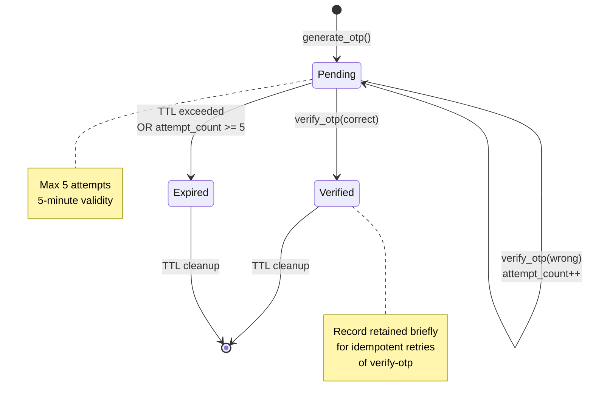
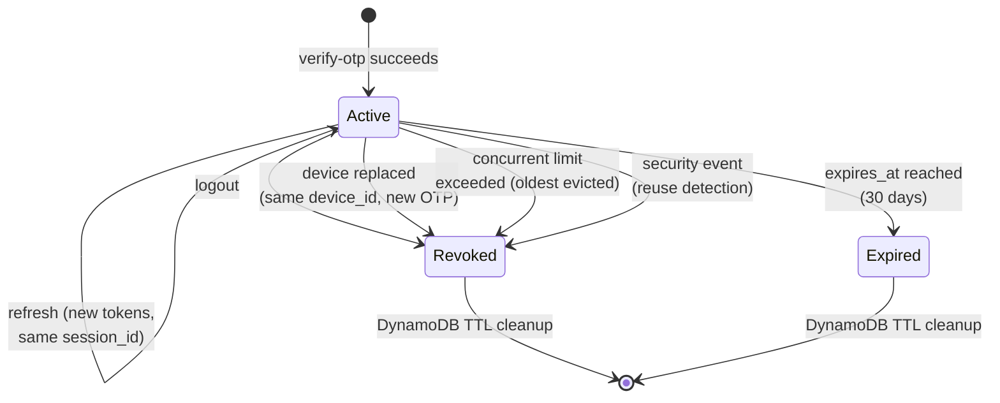
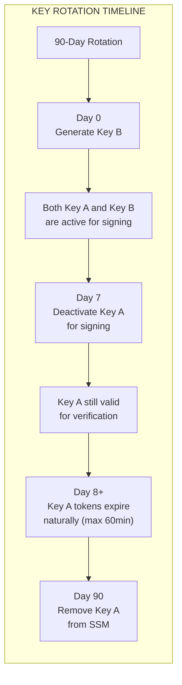
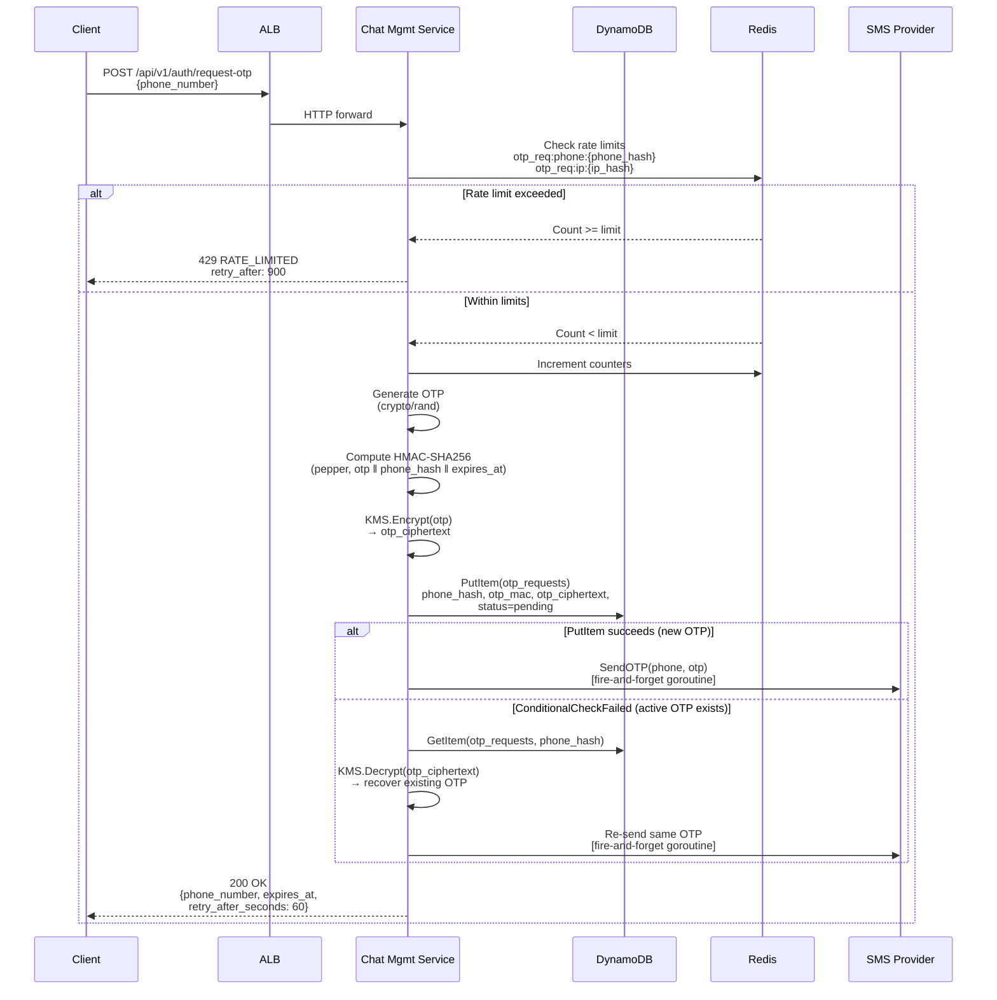
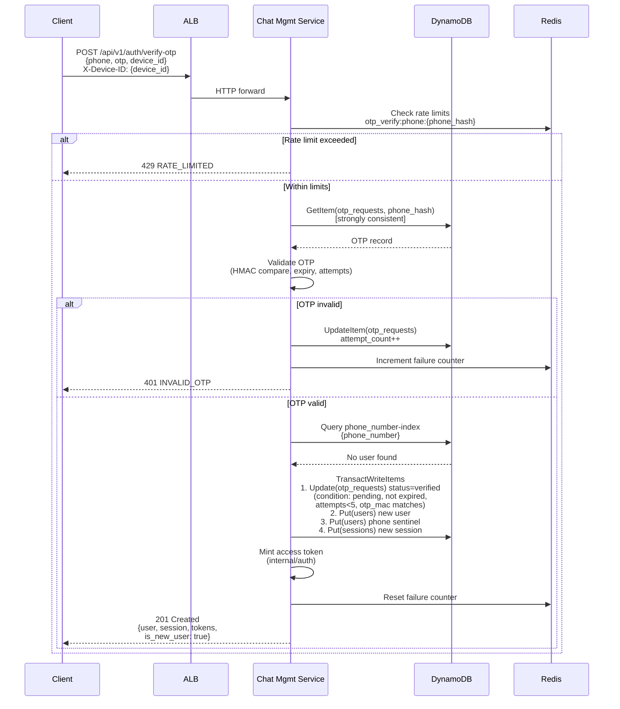
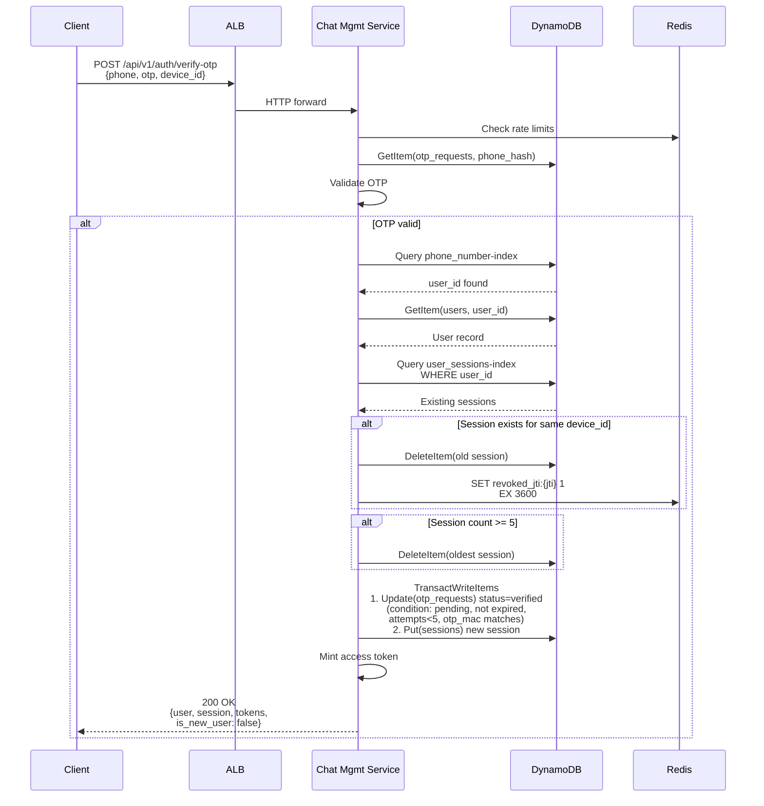
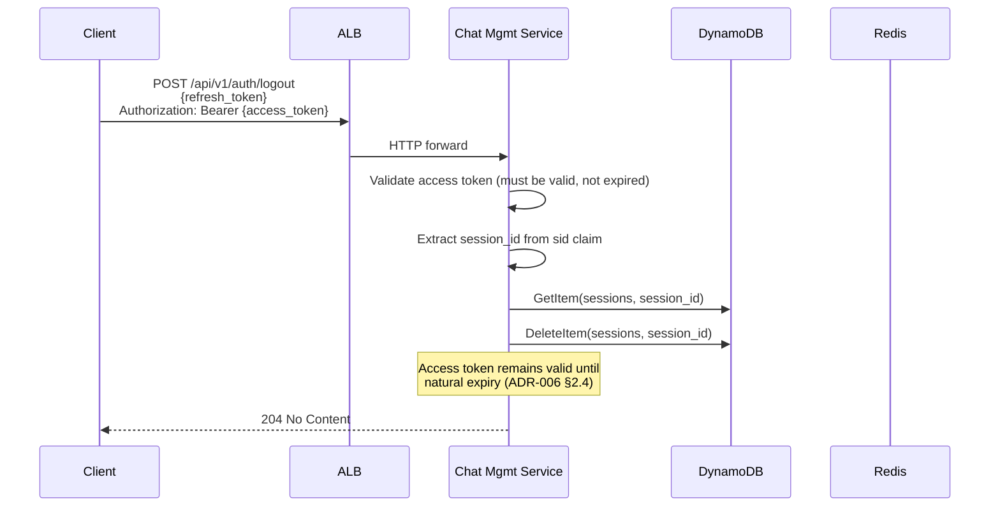
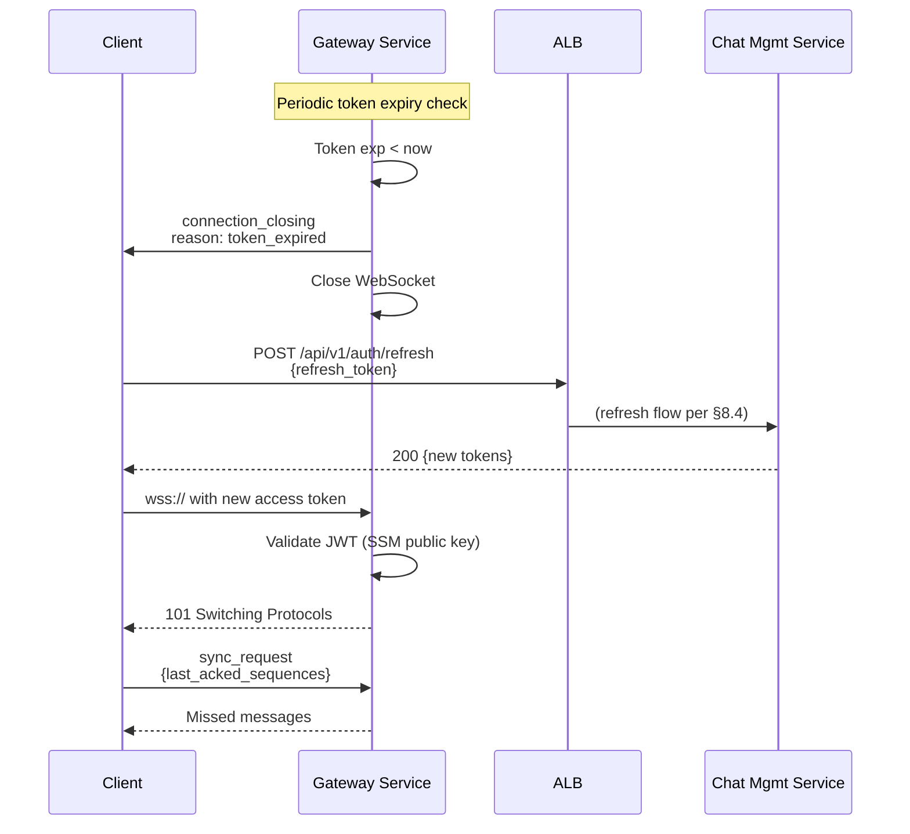

# ADR-015: Authentication & OTP Implementation

- **Status**: Proposed
- **Date**: 2026-02-01

---

## Context and Problem Statement

ADR-001 through ADR-014 established the foundational architecture for the distributed messaging platform. Several ADRs define authentication-adjacent contracts:

- **ADR-005 §1.1, §7.1**: JWT validated at WebSocket handshake; token expiry triggers `connection_closing` with reason `token_expired`.
- **ADR-006 §2**: REST API endpoints for `request-otp`, `verify-otp`, `refresh`, and `logout` with request/response shapes, idempotency semantics, and rate limits.
- **ADR-007 §2.8**: `sessions` table schema (`PK=session_id`, attributes: `user_id`, `device_id`, `refresh_token_hash`, `created_at`, `expires_at`, `ttl`) and `users` table with `phone_number-index` GSI.
- **ADR-013 §2.2**: OTP security controls (6-digit, 5-minute validity, rate limits) and verification flow sequence diagram referencing an "Auth Service" participant.
- **ADR-014 §1.4, §3.1**: Four-service topology (Gateway, Ingest, Fanout Worker, Chat Mgmt) with `internal/auth/` package for "JWT validation, token parsing."

While these ADRs define **what** the authentication interfaces look like, they leave significant **implementation gaps** that, if resolved inconsistently, would violate the fail-secure invariant (ADR-013) or contradict the four-service topology (ADR-014). Specifically:

1. **OTP storage**: No ADR specifies where pending OTP records live. ADR-007 defines 8 tables; none stores OTPs.
2. **OTP delivery**: No ADR specifies how OTPs reach the user's phone.
3. **Token minting ownership**: ADR-014 assigns `/auth/*` to Chat Mgmt but the signing key custody is unspecified.
4. **Refresh token rotation mechanics**: ADR-006 says "old refresh token invalidated" but doesn't specify reuse detection.
5. **User registration flow**: ADR-006 distinguishes `is_new_user: true/false` but the creation transaction is undefined.
6. **Session lifecycle limits**: ADR-013 references "concurrent session limits" without specifying the cap or eviction policy.
7. **Signing key bootstrap and rotation**: ADR-013 says 90-day rotation; ADR-014 says Secrets Manager. The operational procedure is missing.
8. **End-to-end flow mapping**: ADR-013's sequence diagram references "Auth Service" without mapping to the four-service architecture.
9. **Auth rate limit Redis keys**: ADR-006 §9 defines rate limit tiers; the Redis key schemas are unspecified.
10. **Auth-specific failure modes**: Failures spanning SMS providers, DynamoDB, Redis, and Secrets Manager have undefined recovery semantics.

**Core Question**: How does the authentication subsystem—OTP generation through token lifecycle—implement correctly against the existing four-service topology, DynamoDB-authoritative data model, and fail-secure security invariant?

---

## Decision Drivers

1. **Correctness before features** (MVP-DEFINITION.md): Authentication must be provably correct under concurrent and failure conditions.
2. **Fail-secure** (ADR-013 `security_authority` invariant): Security failures deny access, not grant it.
3. **DynamoDB is authoritative** (ADR-003): Persistent auth state (users, sessions, OTPs) lives in DynamoDB.
4. **Four-service topology** (ADR-014): No fifth service without strong justification.
5. **Operational simplicity** (ADR-014): Lab project; minimize infrastructure footprint.
6. **Secrets separation** (ADR-014 §7.1): Signing keys in Secrets Manager, not env vars.

---

## Considered Options

### OTP Storage

- **Option A**: New DynamoDB table (`otp_requests`) with TTL
- **Option B**: Redis with expiry (ephemeral, fast)
- **Option C**: Hybrid — DynamoDB for OTP record + Redis for rate counters

### OTP Delivery

- **Option A**: Amazon SNS (native AWS)
- **Option B**: Twilio (industry standard, better deliverability)
- **Option C**: Provider interface with pluggable implementations (SNS for prod, stdout for dev)

### Token Minting Ownership

- **Option A**: Chat Mgmt Service mints tokens directly (signing key in its IAM task role)
- **Option B**: Separate Auth Service (fifth service)
- **Option C**: `internal/auth` package with minting functions, imported by Chat Mgmt

### Refresh Token Rotation

- **Option A**: Simple rotation (update hash in place, no reuse detection)
- **Option B**: Rotation with reuse detection (replay of old token revokes entire session)

### Signing Key Distribution

- **Option A**: JWKS endpoint served by Chat Mgmt
- **Option B**: All services fetch public key from Secrets Manager at startup
- **Option C**: SSM Parameter Store for public key (non-sensitive, simpler access pattern)

---

## Decision Outcome

| Decision Point | Chosen Option | Key Rationale |
|----------------|---------------|---------------|
| OTP Storage | **Option C** — DynamoDB + Redis hybrid | DynamoDB for authoritative OTP record (ADR-003); Redis for rate counters only |
| OTP Delivery | **Option C** — Provider interface | Decouples auth logic from vendor; enables dev/test without SMS costs |
| Token Minting | **Option C** — `internal/auth` package | No network hop; no fifth service; signing key scoped to Chat Mgmt task role |
| Refresh Rotation | **Option B** — Rotation with reuse detection | Stolen refresh tokens are detectable; session family revocation limits blast radius |
| Signing Key Dist | **Option C** — SSM for public key | Public keys are non-sensitive; SSM is simpler than Secrets Manager for read-heavy access |

---

## Detailed Design

### 1. OTP Generation and Storage

#### 1.1 New DynamoDB Table: `otp_requests`

This is the 9th DynamoDB table, added to the 8 defined in ADR-007. It follows ADR-007's design philosophy of access-pattern-driven table separation.

| Attribute | Type | Key | Description |
|-----------|------|-----|-------------|
| `phone_hash` | String | PK | SHA-256 of E.164 phone number (privacy: never store raw phone in OTP table) |
| `otp_mac` | String | — | HMAC-SHA256(server_pepper, otp ‖ phone_hash ‖ expires_at) — see §1.2 |
| `otp_ciphertext` | String | — | KMS-encrypted OTP (enables re-send without regeneration) — see §1.2 |
| `created_at` | String | — | ISO 8601 timestamp |
| `expires_at` | String | — | ISO 8601 timestamp (`created_at` + 5 minutes) |
| `attempt_count` | Number | — | Verification attempts against this OTP (max 5) |
| `status` | String | — | `pending` &#124; `verified` &#124; `expired` |
| `ttl` | Number | — | DynamoDB TTL (Unix timestamp, `expires_at` + 1 hour cleanup buffer) |

**Why separate table (not embedded in `users`)**:

OTP records are ephemeral, high-write, and keyed by phone number — not user ID. A phone number may not correspond to an existing user (new registration). Co-locating with `users` would couple OTP write velocity to user profile access patterns, violating ADR-007's velocity-based separation principle.

**Why `phone_hash` not raw phone number**:

The OTP table is a high-churn table with TTL-based cleanup. Storing raw phone numbers in a transient table increases the blast radius of a data breach. SHA-256 of the E.164 number is sufficient for exact-match lookup (the only access pattern). The `users` table retains the raw phone number as the authoritative identity store.

**Why HMAC-SHA256 with a server pepper (not bare SHA-256)**:

A bare `SHA-256(otp)` over a 6-digit keyspace (10^6 = 1,000,000 possibilities) can be brute-forced in milliseconds on commodity hardware. A leaked `otp_hash` from a DynamoDB read (backup exposure, console access, IAM misconfiguration) becomes a live OTP recovery — turning a read into an account takeover. HMAC-SHA256 with a server pepper stored in Secrets Manager binds OTP verification to possession of the pepper, making brute force of leaked records computationally infeasible without the pepper.

The MAC is computed over `otp || phone_hash || expires_at` to bind the OTP to the specific request context (phone and expiry). This prevents an attacker who obtains both a leaked pepper and a MAC from one record from reusing it against a different phone or time window.

**Pepper storage**: Secrets Manager at path `otp/pepper`. Loaded at Chat Mgmt Service startup alongside JWT signing keys. Rotation: generate new pepper, store as `otp/pepper/next`, drain existing OTPs (5 minutes), promote to `otp/pepper`. Since OTPs are ephemeral (5-minute validity), pepper rotation is fast.

**Why also store `otp_ciphertext` (KMS-encrypted OTP)**:

Without recoverable OTPs, the "OTP already issued" case (ConditionalCheckFailed on `PutItem`) cannot re-send the same OTP — the server has no way to recover the plaintext. Storing `otp_ciphertext = KMS.Encrypt(otp)` enables:

1. **Re-send**: If the user requests another OTP while one is active, decrypt and re-deliver the same OTP via SMS instead of telling the user to wait.
2. **Defense in depth**: KMS encryption requires `kms:Decrypt` permission on the Chat Mgmt task role. Even if DynamoDB records are leaked, the ciphertexts are useless without IAM access to the KMS key.

The `otp_mac` is used for verification (compare submitted OTP). The `otp_ciphertext` is used only for re-send (decrypt to recover plaintext for SMS delivery). These serve different purposes and both are necessary.

**Constant-time comparison**: OTP verification uses `crypto/subtle.ConstantTimeCompare` on the HMAC output bytes to prevent timing side-channels.

**Capacity mode**: On-Demand (bursty, proportional to auth traffic).

**No GSI**: The only access pattern is `GetItem` by `phone_hash`.

**No backup**: Ephemeral data; TTL-cleaned. Matches the pattern of `idempotency_keys` in ADR-007 §9.

#### 1.2 OTP Generation

```
PROCEDURE generate_otp(phone_number: E.164):
  1. otp = crypto/rand → uniform integer in [000000, 999999]
     (Use rejection sampling to avoid modulo bias)
  2. phone_hash = SHA-256(phone_number)
  3. expires_at = now + 5 minutes
  4. otp_mac = HMAC-SHA256(server_pepper, otp || phone_hash || expires_at)
  5. otp_ciphertext = KMS.Encrypt(otp as zero-padded 6-digit string)
  6. PutItem to otp_requests:
       ConditionExpression: attribute_not_exists(phone_hash)
         OR #status = "verified"
         OR #expires_at < :now
     (Prevents overwriting an active, unverified OTP)
  7. Return otp (plaintext, in-memory only) for SMS delivery
  8. On ConditionalCheckFailed:
       → Active OTP exists for this phone.
       → GetItem(otp_requests, phone_hash)
       → otp_plaintext = KMS.Decrypt(record.otp_ciphertext)
       → Re-send same OTP via SMS provider
       → Return 200 with same expires_at
```

**Why KMS.Encrypt is acceptable latency**: KMS.Encrypt adds ~5-10ms per call. This occurs once per OTP generation (not per verification). At auth traffic volumes (low relative to messaging), this is negligible.

**Why re-send same OTP instead of generating new**: Generating a new OTP on retry would invalidate any SMS already in-flight. If the first SMS arrives after the new OTP is stored, the user enters an OTP that no longer matches. Re-sending the same OTP is idempotent with respect to verification.

**Why `crypto/rand`**: Go's `math/rand` is not cryptographically secure. `crypto/rand.Int` with `big.NewInt(1_000_000)` provides uniform distribution over 6-digit space without modulo bias.

#### 1.3 OTP State Machine



#### 1.4 OTP Verification

```
PROCEDURE verify_otp(phone_number, otp_candidate, device_id):
  1. phone_hash = SHA-256(phone_number)
  2. GetItem(otp_requests, phone_hash) [strongly consistent]
  3. IF record not found → 401 INVALID_OTP
  4. IF record.status = "expired" → 401 INVALID_OTP
  5. IF record.status = "verified":
       → OTP already used; this is an idempotent retry
       → Proceed to session creation (same session_id per ADR-006 §2.2)
  6. IF record.attempt_count >= 5 → 429 RATE_LIMITED (lockout)
  7. IF now > record.expires_at → 401 INVALID_OTP (expired)
  8. candidate_mac = HMAC-SHA256(server_pepper,
       otp_candidate || phone_hash || record.expires_at)
  9. IF NOT constant_time_equal(candidate_mac, record.otp_mac):
       → UpdateItem: increment attempt_count
         ConditionExpression: attempt_count < 5
       → 401 INVALID_OTP
  10. IF constant_time_equal(candidate_mac, record.otp_mac):
       → OTP is valid. Proceed to transactional verify (§5).
```

**Constant-time comparison**: `crypto/subtle.ConstantTimeCompare` on the HMAC bytes prevents timing side-channels. Even though HMAC comparison is inherently more resistant to timing attacks than comparing short OTP strings, constant-time compare is defense-in-depth.

---

### 2. OTP Delivery

#### 2.1 Provider Interface

```go
// internal/auth/sms.go

// SMSProvider abstracts OTP delivery for vendor independence.
type SMSProvider interface {
    // SendOTP delivers the OTP to the given phone number.
    // Returns nil on successful delivery acceptance (not necessarily receipt).
    // Returns error on provider rejection or timeout.
    SendOTP(ctx context.Context, phone string, otp string) error
}
```

#### 2.2 Implementation Strategy

| Environment | Provider | Behavior |
|-------------|----------|----------|
| Production | `SNSProvider` | Amazon SNS SMS (Transactional message type) |
| Development | `LogProvider` | Logs OTP to stdout (structured log: `{"event": "otp_sent", "phone": "...last4", "otp": "123456"}`) |
| Integration test | `FixedProvider` | Always accepts; OTP value fixed to `000000` for deterministic tests |

**Why SNS over Twilio for MVP**: SNS is native AWS, requires no additional vendor relationship, and integrates with IAM (no API key management). Twilio offers better deliverability and international coverage, but for a lab project with limited SMS volume, SNS is operationally simpler. The provider interface allows swapping to Twilio without code changes outside the provider implementation.

#### 2.3 Delivery Semantics

`POST /auth/request-otp` is **fire-and-forget** for SMS delivery:

1. Generate OTP and store in DynamoDB.
2. Enqueue SMS delivery asynchronously (goroutine with timeout).
3. Return `200 OK` to client immediately with `expires_at`.
4. If SMS delivery fails, the OTP exists in DynamoDB but the user never receives it. User can request a new OTP after `retry_after_seconds` (60s).

**Why not wait for delivery confirmation**: SMS delivery confirmation is unreliable (carrier acknowledgment ≠ device receipt). Blocking the HTTP response on SMS delivery adds latency (200-2000ms per provider call) and introduces a failure mode where the OTP is stored but the client gets a 5xx — leaving the user confused about whether to retry.

**Delivery failure handling**: SMS delivery errors are logged as security events (`auth.otp_delivery_failed`) with phone hash and provider error. No automatic retry — the user's client retry (requesting a new OTP) is the recovery mechanism.

---

### 3. Token Minting Ownership

#### 3.1 Architecture: `internal/auth` Package

Token minting lives in the `internal/auth/` package (ADR-014 §3.1), imported by Chat Mgmt Service. This extends the package's current scope from "JWT validation, token parsing" to include minting:

```
internal/auth/
├── jwt.go          # JWT validation (existing per ADR-014)
├── mint.go         # JWT minting (NEW: this ADR)
├── keys.go         # Key loading from Secrets Manager / SSM (NEW)
├── refresh.go      # Refresh token generation and hashing (NEW)
├── sms.go          # SMSProvider interface (NEW: §2.1)
├── otp.go          # OTP generation and verification logic (NEW)
└── provider/
    ├── sns.go      # SNS implementation
    ├── log.go      # Development logger
    └── fixed.go    # Test fixture
```

**Why not a fifth service**: A separate Auth Service would introduce a network hop on every token mint (adding P99 latency to every login and refresh), require its own ECS task definition, health checks, scaling configuration, and monitoring dashboard. For a lab project with one developer, this operational overhead is disproportionate. The `internal/auth` package achieves the same logical separation via Go's module system without the infrastructure cost.

**Security of this approach**: The JWT private signing key is accessible only to the Chat Mgmt Service's ECS task role via Secrets Manager. The Gateway Service (which validates tokens) only needs the public key. This maintains least-privilege: Chat Mgmt can sign, Gateway can verify, Ingest and Fanout have no key access.

#### 3.2 Key Access Model

| Service | Key Access | Source | Purpose |
|---------|-----------|--------|---------|
| Chat Mgmt | Private signing key | Secrets Manager (`jwt/signing-key/{KEY_ID}`) | Mint access + refresh tokens |
| Chat Mgmt | Current key ID | SSM (`/messaging/jwt/current-key-id`) | Identifies which private key to load |
| Chat Mgmt | All public keys | SSM (`/messaging/jwt/public-keys/{KEY_ID}`) | Validate tokens on REST endpoints |
| Gateway | All public keys | SSM (`/messaging/jwt/public-keys/{KEY_ID}`) | Validate tokens at WebSocket handshake |
| Ingest | All public keys | SSM (`/messaging/jwt/public-keys/{KEY_ID}`) | Validate tokens on gRPC calls from Gateway |
| Fanout Worker | None | — | No direct auth; trusts Kafka events |

**SSM parameter naming convention**:

```
/messaging/jwt/
  current-key-id          → STRING: KEY_ID of the active signing key
  public-keys/
    {KEY_ID_A}            → STRING: PEM-encoded RSA public key
    {KEY_ID_B}            → STRING: PEM-encoded RSA public key (during rotation)
```

**Key loading at startup**:

1. Fetch `/messaging/jwt/current-key-id` → get active KEY_ID.
2. Fetch all parameters under prefix `/messaging/jwt/public-keys/` via `GetParametersByPath` (paginated if >10 keys — unlikely but handled).
3. Build in-memory key map: `map[kid]→publicKey`.
4. Chat Mgmt additionally fetches the private key from Secrets Manager at `jwt/signing-key/{KEY_ID}`.

**Key cache TTL**: In-memory cache refreshes every **5 minutes** (configurable via SSM `/messaging/jwt/cache-ttl-seconds`, default 300). This bounds staleness while avoiding per-request SSM calls.

**Unknown `kid` handling**: If a JWT presents a `kid` not in the in-memory key map, the service executes a **single** immediate SSM refresh (bypassing the cache TTL). If the `kid` is still unknown after refresh, the token is rejected. This handles the rotation edge case where a new key is deployed but a verifying service hasn't refreshed yet. A cooldown (30 seconds) prevents repeated SSM calls from a flood of tokens with fabricated `kid` values.

#### 3.3 Access Token Minting

```go
// internal/auth/mint.go

func (m *Minter) MintAccessToken(userID, sessionID string) (string, error) {
    now := time.Now()
    jti := ulid.Make().String()
    
    claims := jwt.MapClaims{
        "sub":   userID,
        "iss":   "messaging-platform",
        "aud":   "messaging-api",
        "iat":   now.Unix(),
        "exp":   now.Add(m.accessTTL).Unix(),  // Default: 60 minutes
        "jti":   jti,
        "sid":   sessionID,
        "scope": "messaging",
    }
    
    token := jwt.NewWithClaims(jwt.SigningMethodRS256, claims)
    token.Header["kid"] = m.currentKeyID  // Key ID for rotation
    
    return token.SignedString(m.privateKey)
}
```

**JWT claims** (extending ADR-006 §1.2):

| Claim | Type | Description | Source |
|-------|------|-------------|--------|
| `sub` | String | `user_id` (ULID with prefix) | ADR-006 §1.2 |
| `iss` | String | `"messaging-platform"` | This ADR |
| `aud` | String | `"messaging-api"` | ADR-006 §1.2 |
| `iat` | Number | Issued-at (Unix seconds) | ADR-006 §1.2 |
| `exp` | Number | Expiration (Unix seconds) | ADR-006 §1.2 |
| `jti` | String | ULID — unique token ID | ADR-006 §1.2 |
| `sid` | String | `session_id` — links token to session | This ADR |
| `scope` | String | `"messaging"` | ADR-006 §1.2 |
| `kid` | String (header) | Key ID for rotation | This ADR |

**Why add `sid` (session ID)**: Linking access tokens to sessions enables session-scoped revocation. When a session is revoked, all access tokens with that `sid` can be identified for revocation without maintaining a per-token index. This is particularly important for the "revoke all sessions for user" operation.

---

### 4. Refresh Token Design and Rotation

#### 4.1 Refresh Token Format

The refresh token is an **opaque random string**, not a JWT:

```
Format: base64url(32 random bytes) = 43 characters
Example: "dGhpcyBpcyBhIHJlZnJlc2ggdG9rZW4AAAAAAAA"
```

**Why not a JWT**: Refresh tokens are always validated server-side against DynamoDB (the `sessions` table stores `refresh_token_hash`). A JWT's self-contained claims add no value — the server must check DynamoDB regardless. An opaque token is simpler, shorter, and reveals no information if intercepted.

**Storage**: Only the SHA-256 hash is stored in the `sessions` table (ADR-007 §2.8: `refresh_token_hash`). The raw token is returned to the client exactly once and never stored server-side.

#### 4.2 Rotation with Reuse Detection

Each session maintains a `token_family` identifier and a `token_generation` counter:

**Extended sessions table attributes** (additions to ADR-007 §2.8):

| Attribute | Type | Description |
|-----------|------|-------------|
| `token_family` | String | ULID assigned at session creation; groups all refresh tokens for this session |
| `token_generation` | Number | Monotonic counter; incremented on each rotation |
| `prev_token_hash` | String | SHA-256 of the immediately previous refresh token (for reuse detection window) |

**Rotation procedure**:

```
PROCEDURE refresh_token(old_refresh_token, device_id):
  1. old_hash = SHA-256(old_refresh_token)
  2. Query sessions table:
       Scan user_sessions-index? No — we need to find session by refresh_token_hash.
       Since refresh_token_hash is not a key, we need a GSI or a different approach.
       
       APPROACH: Client sends session_id (embedded in refresh token? No, token is opaque.)
       
       REVISED APPROACH: The refresh endpoint requires the Authorization header
       with the (potentially expired) access token. Extract session_id from the
       access token's `sid` claim. Then GetItem on sessions table by session_id.
       
       VALIDATION ON EXPIRED ACCESS TOKEN:
       The expired access token MUST still pass full JWT validation EXCEPT for
       the `exp` claim. Specifically, the following are verified:
         - Signature (RS256 against cached public key)
         - `iss` = "messaging-platform"
         - `aud` = "messaging-api"
         - `iat` ≤ now (not issued in the future)
         - `nbf` ≤ now (if present; not-before check)
         - `kid` resolves to a known public key
       Only `exp` is explicitly waived.
       
       This prevents an attacker from crafting a fake access token (without
       a valid signature) to probe arbitrary session IDs during refresh.
       
       IF CLIENT LOST THE ACCESS TOKEN:
       The refresh endpoint REQUIRES the expired access token to locate the
       session. If the client has lost the access token but still holds the
       refresh token, the client CANNOT refresh. The client must
       re-authenticate with OTP. This is an explicit design choice:
         - Adding a `refresh_token_hash` lookup GSI on the sessions table would
           enable refresh without the access token, but adds GSI cost, write
           amplification, and a new attack surface (probing refresh tokens
           against the index).
         - For MVP, "lost access token = re-auth" is acceptable. The access
           token is short-lived (60 minutes), so loss is rare in practice.
       
  3. session = GetItem(sessions, session_id)
  4. Validate device_id = session.device_id (ADR-006 §2.3: 401 DEVICE_MISMATCH)
  5. Validate session not expired (session.expires_at > now)
  
  6. IF old_hash = session.refresh_token_hash:
       → Current token; normal rotation
       → Generate new_refresh_token = base64url(crypto/rand 32 bytes)
       → new_hash = SHA-256(new_refresh_token)
       → UpdateItem(sessions):
           SET refresh_token_hash = new_hash,
               prev_token_hash = old_hash,
               token_generation = token_generation + 1
           ConditionExpression: refresh_token_hash = :old_hash
       → Mint new access token
       → Return new tokens
       
  7. IF old_hash = session.prev_token_hash:
       → REUSE DETECTED: This is the immediately previous token being replayed.
         This likely indicates token theft (attacker and legitimate client both
         have a valid refresh token; the legitimate client rotated first).
       → REVOKE ENTIRE SESSION:
           DeleteItem(sessions, session_id)
           Add access token JTI to Redis revocation set
           Log security event: auth.refresh_token_reuse
       → Return 401 INVALID_REFRESH_TOKEN
       
  8. IF neither match:
       → Token is invalid (old generation, wrong session, or fabricated)
       → Return 401 INVALID_REFRESH_TOKEN
```

**Why only track `prev_token_hash` (not full history)**: Tracking the full chain requires unbounded storage. The immediately previous token is the most security-relevant case — it's the token the attacker is most likely replaying. Older generations would already have been invalidated by intervening rotations.

#### 4.3 Refresh Token Rotation Diagram

```mermaid
sequenceDiagram
    participant C as Client
    participant CM as Chat Mgmt
    participant DB as DynamoDB
    participant RD as Redis

    C->>CM: POST /auth/refresh<br/>{refresh_token}<br/>Authorization: Bearer {expired_access_token}<br/>X-Device-ID: {device_id}
    
    CM->>CM: Extract session_id from<br/>access token sid claim<br/>(verify sig+iss+aud+kid&#59;<br/>ONLY exp waived)
    CM->>DB: GetItem(sessions, session_id)<br/>[strongly consistent]
    DB-->>CM: Session record
    
    CM->>CM: Validate device_id match
    CM->>CM: Validate session not expired
    CM->>CM: SHA-256(refresh_token)
    
    alt Hash matches current refresh_token_hash
        CM->>CM: Generate new refresh token
        CM->>DB: UpdateItem(sessions)<br/>SET refresh_token_hash = new_hash<br/>prev_token_hash = old_hash<br/>token_generation++<br/>Condition: refresh_token_hash = old_hash
        CM->>CM: Mint new access token
        CM-->>C: 200 {access_token, refresh_token}
    else Hash matches prev_token_hash
        Note over CM: REUSE DETECTED — possible theft
        CM->>DB: DeleteItem(sessions, session_id)
        CM->>RD: SET revoked_jti:{jti} 1 EX 3600
        CM-->>C: 401 INVALID_REFRESH_TOKEN
    else No match
        CM-->>C: 401 INVALID_REFRESH_TOKEN
    end
```



---

### 5. User Registration (First-Time Verify-OTP)

#### 5.1 Registration Flow

When `verify-otp` succeeds for a phone number with no existing user, OTP consumption, user creation, session creation, and phone uniqueness enforcement occur in a **single DynamoDB `TransactWriteItems`**:

```
PROCEDURE verify_otp_new_user(phone_number, phone_hash, device_id):
  1. user_id = generate ULID with "user_" prefix
  2. session_id = generate ULID with "sess_" prefix
  3. refresh_token = base64url(crypto/rand 32 bytes)
  4. refresh_token_hash = SHA-256(refresh_token)
  5. token_family = generate ULID
  6. now = current UTC timestamp
  
  7. TransactWriteItems:
     a. Update(otp_requests):
          Key: {phone_hash}
          UpdateExpression: SET #status = :verified
          ConditionExpression:
            #status = :pending
            AND #expires_at > :now
            AND #attempt_count < :max_attempts
            AND #otp_mac = :candidate_mac
        (Atomic OTP consumption — fails if already verified, expired,
         or exhausted. The MAC check within the condition ensures the
         OTP is correct as part of the same transaction.)
        
     b. Put(users):
          user_id, phone_number, phone_verified: true,
          display_name: null, created_at: now, updated_at: now
        ConditionExpression: attribute_not_exists(user_id)
        
     c. Put(phone_uniqueness sentinel):
          TableName: users
          Item: { user_id: "PHONE#" + phone_hash, phone_number: phone_number,
                  phone_verified: true, canonical_user_id: user_id }
          ConditionExpression: attribute_not_exists(user_id)
        (DynamoDB-native unique constraint: if another transaction
         inserts the same sentinel first, this condition fails and the
         entire transaction is rolled back.)
        
     d. Put(sessions):
          session_id, user_id, device_id,
          refresh_token_hash, token_family,
          token_generation: 0, prev_token_hash: null,
          created_at: now,
          expires_at: now + 30 days,
          ttl: unix(now + 30 days)
        ConditionExpression: attribute_not_exists(session_id)
  
  8. Mint access token with user_id, session_id
  9. Return 201 Created with user, session, tokens, is_new_user: true
  
  On TransactionCanceledException:
    Check CancellationReasons by index:
    - Index 0 (otp_requests): OTP already consumed, expired, or wrong
      → 401 INVALID_OTP
    - Index 2 (phone sentinel): Another user already registered this phone
      → Query phone_number-index to find existing user_id
      → Proceed to existing-user flow (§5.2)
    - Index 1 or 3 (ULID collision): Regenerate IDs and retry (virtually impossible)
```

**Why transactional verify-otp is critical**: The previous design used separate operations for OTP consumption and session creation. This left an edge case: OTP validated → session creation fails → OTP still "pending" → retry "safe." But this is only safe if the OTP is re-verifiable, which creates a window where the OTP can be consumed twice. With `TransactWriteItems`, the OTP is consumed and the session is created atomically — either both succeed or neither does. This makes the `otp_consumption_atomic` invariant real, not aspirational.

**Phone uniqueness via sentinel item**: GSIs in DynamoDB are eventually consistent, which means two concurrent transactions could both observe "no user for this phone" via the `phone_number-index` GSI and both succeed in creating a user. Instead of relying on eventual reconciliation, we insert a sentinel item in the `users` table with `PK = "PHONE#" + phone_hash`. The `attribute_not_exists(user_id)` condition on this item acts as a DynamoDB-native unique constraint — exactly one transaction can insert this sentinel, and the other is rolled back.

**Why the sentinel is in the `users` table (not a separate table)**: `TransactWriteItems` supports up to 100 items across multiple tables and partitions (we use 4 items across 2 tables here). Putting the sentinel in the `users` table is a pragmatic choice — it avoids adding a 10th DynamoDB table for a single-purpose uniqueness check. The `PHONE#` prefix on `user_id` ensures no collision with real user ULID keys (ULIDs never start with "PHONE#"). The sentinel item is invisible to the `phone_number-index` GSI (which projects only `user_id`) and to any query by real user IDs.

**Why `TransactWriteItems` works across these tables**: DynamoDB transactions support up to 100 items across any number of tables and partition keys (see ADR-004 §3 for precedent — it uses transactions across `chat_counters`, `idempotency_keys`, and `messages`). The constraint is 25 items per transaction in standard API, but our 4 items are well within limits.

#### 5.2 Existing User Verify-OTP

```
PROCEDURE verify_otp_existing_user(phone_number, phone_hash, device_id, user):
  1. session_id = generate ULID with "sess_" prefix
  2. refresh_token = base64url(crypto/rand 32 bytes)
  3. Check for existing session with same (user_id, device_id):
     Query user_sessions-index WHERE user_id = user.user_id
     Filter: device_id = device_id
     
  4. IF existing session found for this device:
       → Revoke that session (replace per ADR-006)
       → DeleteItem(sessions, existing_session_id)
       → Log security event: session.replaced
       
  5. IF active session count >= 5:
       → Sort by created_at ascending
       → Revoke oldest session until count < 5
       
  6. TransactWriteItems:
     a. Update(otp_requests):
          Key: {phone_hash}
          UpdateExpression: SET #status = :verified
          ConditionExpression:
            #status = :pending
            AND #expires_at > :now
            AND #attempt_count < :max_attempts
            AND #otp_mac = :candidate_mac
        (Same atomic OTP consumption as new-user flow.)

     b. Put(sessions):
          session_id, user_id, device_id,
          refresh_token_hash, token_family, token_generation: 0,
          created_at: now, expires_at: now + 30 days, ttl: unix(now + 30 days)
       
  7. Mint access token
  8. Return 200 OK with user, session, tokens, is_new_user: false
  
  On TransactionCanceledException:
    Check CancellationReasons:
    - Index 0 (otp_requests): OTP already consumed, expired, or wrong
      → 401 INVALID_OTP
    - Index 1 (sessions): ULID collision → retry (virtually impossible)
```

**Note on session cleanup before transaction**: Steps 4-5 (revoking old sessions) happen before the transaction in step 6. If the transaction fails (OTP wrong), the revocations have already occurred. This is acceptable because the user initiated a new OTP verification — they clearly intend to replace sessions. For more conservative behavior, session revocation could be moved to after the transaction succeeds, at the cost of a brief window where the user exceeds the session limit.

#### 5.3 User Creation Events

**No Kafka event for user creation in MVP**. ADR-011 defines three topics: `messages.persisted`, `memberships.changed`, `chats.created`. A `users.created` topic is not defined. Adding one would require:

- New topic definition (partition key, retention, schema)
- New consumer(s) — no current consumer needs this event
- Schema in ADR-011's evolution framework

For MVP, user creation is a low-frequency event with no downstream consumers. The `users` table in DynamoDB is the authoritative record. A `users.created` topic can be added in a future ADR when a consumer (e.g., analytics, welcome message service) requires it.

---

### 6. Session Lifecycle and Concurrent Limits

#### 6.1 Concurrent Session Policy

| Policy | Value | Rationale |
|--------|-------|-----------|
| Max sessions per user | **5** | Matches ADR-013 §3.2: "Max 5 sessions per user" |
| Max sessions per (user, device) | **1** | ADR-006: "existing session for that device is replaced" |
| Eviction on limit exceeded | **Oldest session** | Simplest; preserves most recent devices |

#### 6.2 Session Creation with Limit Enforcement

```
PROCEDURE create_session(user_id, device_id):
  1. Query user_sessions-index WHERE user_id = user_id [eventually consistent]
  2. active_sessions = filter by expires_at > now
  
  3. IF any session has device_id = device_id:
       → Revoke that session (replace per ADR-006)
       → active_sessions.remove(that session)
       
  4. IF len(active_sessions) >= 5:
       → Sort by created_at ascending
       → Revoke oldest session until len < 5
       
  5. Create new session (Put to sessions table)
```

**Revocation cascade** (for each revoked session):

```
PROCEDURE revoke_session(session):
  1. DeleteItem(sessions, session.session_id)
  2. IF session's most recent access token JTI is known:
       SET revoked_jti:{jti} "1" EX 3600
     ELSE:
       Access token remains valid until natural expiry (max 60 min)
       (JTI is not stored in session; see note below)
  3. Log security event: session.revoked
```

**Note on JTI tracking**: The `sessions` table does not store the JTI of issued access tokens (access tokens are stateless by design). When a session is revoked, the associated access token remains valid until its natural expiry (max 60 minutes per ADR-013). This is the accepted trade-off documented in ADR-013 §3.1: "Access token remains valid until expiration" after logout.

**Revocation Redis key (single mechanism)**: ADR-013 §3.1 defined two overlapping patterns: `revoked_tokens` (SET, no TTL) and `revoked_token:{jti}` (STRING with TTL). This ADR resolves the inconsistency by choosing a **single, TTL-bounded mechanism**:

```
# Per-JTI revocation (bounded memory, TTL-cleaned)
revoked_jti:{jti}  →  "1"
TTL: 3600 seconds (matches max access token lifetime)
Written by: Chat Mgmt Service (on logout, session revoke, reuse detection)
Checked by: Gateway (WebSocket handshake), Chat Mgmt (REST interceptor)
```

**Why per-key with TTL over an unbounded SET**:

The `SISMEMBER`-based SET approach from ADR-013 accumulates indefinitely (the "cleaned by background job" note was unspecified). Per-key strings with TTL = access token max lifetime are self-cleaning: once the access token would have expired naturally, the revocation entry is automatically removed by Redis. Memory usage is bounded by `max_concurrent_revocations × ~50 bytes per key`.

**Revocation check location and fail mode**:

| Check Point | When | Operation | Fail Mode |
|-------------|------|-----------|-----------|
| Gateway WebSocket handshake | Connection establishment | `GET revoked_jti:{jti}` | Fail closed (503) |
| Gateway periodic check | Every 60s per connection | `GET revoked_jti:{jti}` | Fail closed (close connection) |
| Chat Mgmt REST interceptor | Every authenticated request | `GET revoked_jti:{jti}` | Fail closed (503) |

**Future: session-scoped revocation** — For immediate invalidation of all tokens for a session (not just known JTIs), a `revoked_sid:{session_id}` key with TTL = access token max lifetime would allow checking the `sid` claim on every request. This is deferred; the current model accepts up to 60 minutes of stale access tokens after session revocation.

#### 6.3 Session Lifecycle Diagram



---

### 7. Signing Key Bootstrap and Rotation

#### 7.1 Key Generation

Initial key generation is performed via a one-time operational script (not automated in the service):

```bash
# generate-jwt-keys.sh (run once, or during rotation)
openssl genrsa -out jwt-private.pem 2048
openssl rsa -in jwt-private.pem -pubout -out jwt-public.pem

KEY_ID=$(uuidgen)

# Store private key in Secrets Manager
aws secretsmanager create-secret \
  --name "jwt/signing-key/${KEY_ID}" \
  --secret-string "$(cat jwt-private.pem)" \
  --tags Key=purpose,Value=jwt-signing

# Store current key ID in SSM
aws ssm put-parameter \
  --name "/messaging/jwt/current-key-id" \
  --value "${KEY_ID}" \
  --type String

# Store public key in SSM (non-sensitive, read by all services)
aws ssm put-parameter \
  --name "/messaging/jwt/public-keys/${KEY_ID}" \
  --value "$(cat jwt-public.pem)" \
  --type String

# Store OTP pepper in Secrets Manager (one-time setup)
OTP_PEPPER=$(openssl rand -hex 32)
aws secretsmanager create-secret \
  --name "otp/pepper" \
  --secret-string "${OTP_PEPPER}" \
  --tags Key=purpose,Value=otp-hmac

# Cleanup local files
shred -u jwt-private.pem jwt-public.pem
```

#### 7.2 Rotation Procedure

Per ADR-013: 90-day rotation with 7-day overlap.



**Rotation steps**:

1. **Day 0**: Generate new key pair (Key B). Store private key in Secrets Manager (`jwt/signing-key/{KEY_B_ID}`), public key in SSM (`/messaging/jwt/public-keys/{KEY_B_ID}`). Update `/messaging/jwt/current-key-id` to Key B's ID. Key A remains in both stores.
2. **Day 0–7 (overlap)**: Chat Mgmt Service signs new tokens with Key B (`kid` = Key B ID). All services accept tokens signed by either Key A or Key B (both public keys loaded via `GetParametersByPath` on `/messaging/jwt/public-keys/`).
3. **Day 7**: Remove Key A's private key from Secrets Manager. Chat Mgmt can no longer sign with Key A (even if it refreshes its cache).
4. **Day 8+**: All Key A access tokens have expired (max 60-minute TTL). Key A's public key remains in SSM for any stragglers.
5. **Day 90**: Remove Key A's public key from SSM (`/messaging/jwt/public-keys/{KEY_A_ID}`). Any remaining Key A tokens are expired and rejected.

**Key discovery at verification**: Services load all public keys from SSM at startup using `GetParametersByPath` with prefix `/messaging/jwt/public-keys/`. When validating a JWT, the `kid` header selects the correct public key from the in-memory map. If `kid` is unknown, the service executes a single immediate SSM refresh (with 30-second cooldown), then rejects if still unknown.

**Why not a JWKS endpoint**: A JWKS endpoint adds a network dependency to every token validation. For a four-service topology where all services already have SSM access, distributing public keys via SSM is simpler and avoids a circular dependency (the JWKS endpoint would itself need authentication, or be unauthenticated and require rate limiting).

#### 7.3 Startup Failure: Secrets Manager Unavailable

```
INVARIANT signing_key_required:
  Chat Mgmt Service MUST NOT start without a valid signing key.
  IF Secrets Manager is unavailable at startup:
    → Service fails health check
    → ECS does not route traffic to this task
    → Existing healthy tasks continue serving
    → Alert fires: secrets_manager_unavailable
```

This is consistent with ADR-009's fail-fast philosophy. A service that cannot sign tokens must not accept authentication requests.

---

### 8. End-to-End Authentication Flows

All flows map to the four-service architecture (ADR-014 §1.4). "Auth Service" from ADR-013's diagram is realized as the Chat Mgmt Service using the `internal/auth` package.

#### 8.1 Request OTP Flow



#### 8.2 Verify OTP — New User



#### 8.3 Verify OTP — Existing User



#### 8.4 Token Refresh

```mermaid
sequenceDiagram
    participant C as Client
    participant ALB as ALB
    participant CM as Chat Mgmt Service
    participant DB as DynamoDB

    C->>ALB: POST /api/v1/auth/refresh<br/>{refresh_token}<br/>Authorization: Bearer {access_token}<br/>X-Device-ID: {device_id}
    ALB->>CM: HTTP forward

    CM->>CM: Parse access token<br/>(verify sig+iss+aud+kid&#59;<br/>ONLY exp waived, extract sid)
    CM->>DB: GetItem(sessions, session_id)<br/>[strongly consistent]
    DB-->>CM: Session record
    
    CM->>CM: Validate device_id match
    CM->>CM: Validate session not expired
    CM->>CM: SHA-256(refresh_token)
    
    alt Hash matches current refresh_token_hash
        CM->>CM: Generate new refresh token
        CM->>DB: UpdateItem(sessions)<br/>new hash, prev_hash = old,<br/>generation++<br/>Condition: hash = old_hash
        CM->>CM: Mint new access token
        CM-->>C: 200 OK<br/>{access_token, refresh_token}
    else Hash matches prev_token_hash
        Note over CM: REUSE DETECTED
        CM->>DB: DeleteItem(sessions)
        CM-->>C: 401 INVALID_REFRESH_TOKEN
    else No match
        CM-->>C: 401 INVALID_REFRESH_TOKEN
    end
```



#### 8.5 Logout



#### 8.6 Token Expiry During WebSocket



---

### 9. Rate Limit Redis Key Schemas

Building on ADR-006 §9 rate limit tiers and ADR-013 §2.2 OTP security controls:

#### 9.1 Auth Rate Limit Keys

```
# OTP request rate limit (per phone)
otp_req:phone:{phone_hash}  →  INT (counter)
TTL: 900 seconds (15 minutes)
Algorithm: Fixed window counter
Limit: 3 per 15 minutes (ADR-013 §2.2)

# OTP request rate limit (per IP)
otp_req:ip:{ip_hash}  →  INT (counter)
TTL: 900 seconds (15 minutes)
Algorithm: Fixed window counter
Limit: 10 per 15 minutes (ADR-013 §2.2)

# OTP verification attempt limit (per phone)
otp_verify:phone:{phone_hash}  →  INT (counter)
TTL: 300 seconds (5 minutes, matches OTP validity)
Algorithm: Fixed window counter
Limit: 5 per validity window (ADR-013 §2.2)

# OTP lockout (per phone, set after 5 failures)
otp_lockout:phone:{phone_hash}  →  "1"
TTL: 900 seconds (15-minute lockout per ADR-013 §2.2)

# Refresh rate limit (per user)
auth_refresh:user:{user_id}  →  INT (counter)
TTL: 60 seconds
Algorithm: Fixed window counter
Limit: 30 per minute (ADR-006 §9.2)
```

#### 9.2 Algorithm Choice: Fixed Window Counter

**Why fixed window over sliding window for auth rate limits**:

Sliding window provides smoother rate limiting but requires sorted sets (ZSET) with per-request entries — higher memory cost and more complex atomic operations. For auth rate limits where the windows are large (5–15 minutes) and limits are small (3–10), the fixed window's edge-case burst (up to 2x limit at window boundary) is acceptable:

- Worst case: 3 OTP requests at 14:59, 3 more at 15:00 = 6 in 1 minute
- This is within the IP-level rate limit (10/15min) and OTP validity window (5min)
- The OTP itself provides a second layer of protection (5-attempt limit)

**Implementation**: Atomic increment-with-TTL via Lua script (portable across Redis versions, avoids dependency on `EXPIRE ... NX` which requires Redis 7.0+):

```lua
-- rate_limit.lua: Atomic increment with TTL on first write
-- KEYS[1] = rate limit key
-- ARGV[1] = TTL in seconds
-- Returns: current count after increment
local count = redis.call('INCR', KEYS[1])
if count == 1 then
  redis.call('EXPIRE', KEYS[1], ARGV[1])
end
return count
```

```go
// Go usage (go-redis/v9)
count, err := rdb.Eval(ctx, rateLimitScript, []string{key}, ttlSeconds).Int64()
if err != nil { /* fail closed or open per table above */ }
if count > limit { /* rate limited */ }
```

**Why Lua over `MULTI/EXEC`**: The `MULTI`-based approach (`INCR` + `EXPIRE NX`) is not truly atomic — `EXPIRE NX` requires Redis 7.0+, and the `MULTI` block does not conditionally execute `EXPIRE` only on the first write. The Lua script runs atomically in a single Redis evaluation, guaranteeing that the TTL is set exactly once (on the first increment) regardless of Redis version.

#### 9.3 Rate Limit Enforcement Location

Rate limiting for auth endpoints is implemented as **gRPC interceptor middleware** in the Chat Mgmt Service, not in the Gateway:

| Endpoint Category | Enforcement Point | Rationale |
|-------------------|------------------|-----------|
| `/auth/*` | Chat Mgmt (gRPC interceptor) | Auth traffic doesn't pass through Gateway's WebSocket path |
| WebSocket messages | Gateway | Per ADR-013 §4.1 |
| Authenticated REST | Chat Mgmt (gRPC interceptor) | All REST goes through Chat Mgmt |

**Fail-open vs. fail-closed for rate limiting**:

Per ADR-013 `security_authority` invariant: "Redis failures in security-critical paths MUST fail closed."

For auth rate limits specifically:

| Rate Limit | Failure Mode | Rationale |
|------------|-------------|-----------|
| OTP request (per phone) | **Fail closed** (deny) | Prevents OTP bombing if Redis is down |
| OTP request (per IP) | **Fail open** (allow) | IP limits are secondary; phone limits are primary |
| OTP verification attempts | **Fail closed** (deny) | Prevents brute force if Redis is down |
| Refresh (per user) | **Fail open** (allow) | Refresh has device binding as secondary control |

---

### 10. Failure Modes and Recovery

#### 10.1 Failure Mode Table: `request-otp`

| Failure | Impact | Recovery | Fail Mode |
|---------|--------|----------|-----------|
| Redis unavailable (rate limit check) | Cannot check rate limits | **Fail closed**: return 503 | Deny |
| DynamoDB unavailable (OTP storage) | Cannot store OTP | Return 503; client retries | Deny |
| KMS unavailable (Encrypt) | Cannot encrypt OTP for storage | Return 503; cannot generate OTP | Deny |
| SMS provider timeout | OTP stored but not delivered | Client sees 200 but gets no SMS; requests new OTP after 60s | Accept |
| SMS provider rejects (bad phone) | OTP stored, SMS not sent | Logged; user can't verify | Accept |
| DynamoDB conditional check fails | Active OTP already exists | Decrypt existing OTP via KMS; re-send same OTP | Resend |
| KMS unavailable (Decrypt for re-send) | Cannot recover OTP for re-send | Return 200 with `expires_at` (user waits for first SMS or requests again after expiry) | Degraded |

#### 10.2 Failure Mode Table: `verify-otp`

| Failure | Impact | Recovery | Fail Mode |
|---------|--------|----------|-----------|
| Redis unavailable (rate limit) | Cannot check attempt count | **Fail closed**: return 503 | Deny |
| DynamoDB unavailable (OTP lookup pre-validation) | Cannot read OTP record for pre-checks | Return 503; client retries | Deny |
| DynamoDB TransactWriteItems fails (capacity) | OTP not consumed, session not created | Return 503; client retries with same OTP (transaction is all-or-nothing) | Retry-safe |
| DynamoDB TransactionCanceledException (OTP condition) | OTP wrong, expired, or already consumed | Return 401 INVALID_OTP | Deny |
| DynamoDB TransactionCanceledException (phone sentinel) | Concurrent registration race | Query phone_number-index → proceed as existing user | Redirect |
| Token minting failure (key unavailable) | Transaction succeeded but no tokens | Return 503; client retries verify-otp → OTP is now "verified" → idempotent retry path returns existing session | Retry-safe |
| KMS unavailable (OTP pepper in Secrets Manager) | Cannot compute HMAC for verification | Return 503; fail-secure | Deny |

**Critical invariant for verify-otp atomicity**:

```
INVARIANT otp_consumption_atomic:
  OTP status transition (pending → verified) AND session creation
  occur in a SINGLE DynamoDB TransactWriteItems call.
  
  TransactWriteItems guarantees:
    Either ALL operations succeed, or NONE do.
  
  Therefore:
    ¬∃ state where OTP is consumed but session is not created.
    ¬∃ state where session exists but OTP is still "pending".
```

This invariant is **mechanically enforced** by DynamoDB's transaction guarantee — it is not a "best effort" property. See ADR-004 §3 for precedent: the message persistence transaction uses the same `TransactWriteItems` across `chat_counters`, `idempotency_keys`, and `messages` tables.

#### 10.3 Failure Mode Table: `refresh`

| Failure | Impact | Recovery | Fail Mode |
|---------|--------|----------|-----------|
| DynamoDB unavailable (session lookup) | Cannot validate refresh token | Return 503; client retries | Deny |
| DynamoDB conditional update fails | Concurrent refresh from same session | Retry; only one succeeds, other gets stale token error | Retry |
| Token minting failure | Session rotated but no new access token | Return 503; session has new refresh_token_hash; client must use the new refresh token (returned before minting fails?) — **mitigated by minting before updating session** | See note |

**Minting-before-update pattern**: To avoid the "session updated but no token minted" failure mode, the refresh procedure mints the new access token *before* updating the session in DynamoDB. If minting fails, no state change occurs. If the DynamoDB update fails after minting, the minted token is discarded (never returned to client) and the client retries.

#### 10.4 Failure Mode Table: Secrets Manager / SSM

| Failure | Impact | Recovery | Fail Mode |
|---------|--------|----------|-----------|
| Secrets Manager unavailable at startup | Cannot load signing key | Service fails health check; ECS doesn't route traffic | **Fatal** |
| Secrets Manager unavailable at key refresh | Cannot refresh key cache | Continue with cached key; alert fires | Degraded |
| SSM unavailable at startup | Cannot load public keys | Service fails health check | **Fatal** |
| SSM unavailable at key refresh | Cannot refresh key cache | Continue with cached keys; alert fires; new keys not discovered until SSM recovers | Degraded |

---

## Trade-offs and Consequences

### Positive Consequences

1. **Complete auth specification**: All 10 gaps identified in the prompt are now explicitly decided, with DynamoDB schemas, Redis key schemas, and sequence diagrams.
2. **Fail-secure by default**: Rate limits fail closed for security-critical paths; services refuse to start without signing keys and OTP pepper.
3. **No fifth service**: Token minting in `internal/auth` preserves the four-service topology with zero-latency minting.
4. **Reuse detection**: Refresh token rotation catches stolen tokens and revokes the entire session.
5. **Provider abstraction**: SMS delivery is swappable without touching auth logic.
6. **Transactional verify-otp**: OTP consumption, user creation, phone uniqueness, and session creation are atomic — no partial-state edge cases.
7. **Phone uniqueness deterministic**: Sentinel item in `users` table provides DynamoDB-native unique constraint, not eventual-consistency reconciliation.
8. **OTP storage resists brute force**: HMAC-SHA256 with server pepper makes leaked DynamoDB records unbrutable without the pepper. KMS encryption enables safe re-send.
9. **Single revocation mechanism**: TTL-bounded `revoked_jti:{jti}` keys are self-cleaning with bounded memory; no unbounded SET accumulation.

### Negative Consequences

1. **Chat Mgmt signing key exposure**: The service that handles chat CRUD also holds the JWT private key. A compromise of Chat Mgmt compromises token signing.
   *Mitigation*: IAM task role scoping; Secrets Manager access logging; key rotation every 90 days.

2. **Fixed window rate limiting edge case**: Up to 2x burst at window boundaries for OTP requests.
   *Mitigation*: Secondary controls (IP rate limit, OTP attempt limit) bound the effective burst.

3. **No immediate access token revocation on session revoke**: Access tokens live until natural expiry (up to 60 minutes).
   *Mitigation*: Short access token TTL (60 minutes); future enhancement for `sid`-based revocation.

4. **OTP table adds a 9th DynamoDB table**: Increases infrastructure footprint.
   *Mitigation*: On-Demand capacity; TTL-cleaned; no backup required.

5. **KMS dependency for OTP operations**: Adds ~5-10ms per `Encrypt` (generation) and `Decrypt` (re-send) call, plus a hard dependency on KMS availability.
   *Mitigation*: KMS has 99.999% SLA; `Encrypt` is on the non-critical request-otp path; `Decrypt` only on re-send (not verification).

6. **Lost access token prevents refresh**: Client must re-authenticate with OTP if access token is lost.
   *Mitigation*: Access tokens are short-lived (60 minutes); loss scenarios are rare in practice.

7. **Phone sentinel items in users table**: Adds "PHONE#"-prefixed items to the users table, consuming storage and appearing in scans.
   *Mitigation*: Sentinel items are small (~100 bytes); table scans are already prohibited by ADR-007 invariants; sentinel PK prefix prevents collision with ULID user IDs.

### Explicitly Deferred

| Feature | Status | Future ADR |
|---------|--------|------------|
| `users.created` Kafka topic | Out of scope | ADR-XXX when a consumer requires it |
| `sid`-based access token revocation | Out of scope | Enhances session revocation to immediate invalidation |
| Automated key rotation (Lambda cron) | Out of scope | Manual rotation acceptable for lab project |
| JWKS endpoint | Out of scope | SSM distribution sufficient at 4-service scale |
| Multi-factor authentication | Out of scope | OTP is single-factor; future security enhancement |
| SMS delivery retry queue | Out of scope | Fire-and-forget acceptable; user retries |
| Refresh without access token (GSI) | Out of scope | "Lost token = re-auth" acceptable for MVP |
| OTP pepper automated rotation | Out of scope | Manual rotation via Secrets Manager; 5-min drain |

---

## Confirmation

The implementation of this ADR will be validated through:

1. **OTP Lifecycle Tests**:
   - OTP generation produces cryptographically random 6-digit codes
   - OTP stored as HMAC-SHA256 (with pepper) and KMS ciphertext; no plaintext persisted
   - HMAC verification uses constant-time comparison
   - OTP re-send (ConditionalCheckFailed) decrypts ciphertext and re-delivers same OTP
   - OTP expires after 5 minutes (DynamoDB record transitions to expired)
   - OTP locked out after 5 failed attempts
   - Successful verification sets status to "verified" atomically with session creation
   - Leaked DynamoDB record (without pepper) cannot be brute-forced to recover OTP

2. **Token Minting Tests**:
   - Access token contains all required claims (`sub`, `iss`, `aud`, `iat`, `exp`, `jti`, `sid`, `scope`)
   - Access token signed with RS256 using current key
   - `kid` header matches current key ID in SSM
   - Token validates against public key from SSM
   - Token rejected after expiry

3. **Refresh Token Rotation Tests**:
   - Refresh returns new access token + new refresh token
   - Old refresh token no longer valid after rotation
   - Replaying previous refresh token (reuse detection) revokes session
   - `device_id` mismatch returns 401 `DEVICE_MISMATCH`
   - Concurrent refresh calls: exactly one succeeds, other retries safely

4. **Session Lifecycle Tests**:
   - Max 5 concurrent sessions per user enforced
   - Same device_id replaces existing session
   - Oldest session evicted when limit exceeded
   - Session expires after 30 days

5. **Rate Limit Tests**:
   - OTP request limited to 3 per phone per 15 minutes
   - OTP request limited to 10 per IP per 15 minutes
   - OTP verification limited to 5 attempts per validity window
   - Redis failure on rate limit check returns 503 (fail closed)

6. **User Registration Tests**:
   - New phone number creates user + session + phone sentinel in single TransactWriteItems
   - Phone uniqueness sentinel prevents concurrent duplicate registration
   - Concurrent verify-otp for same new phone: exactly one succeeds, other redirected to existing-user flow
   - `is_new_user: true` on first verification, `false` on subsequent
   - User record has `phone_verified: true`, `display_name: null`
   - OTP consumption is atomic with user/session creation (no partial-state possible)

7. **Signing Key Tests**:
   - Service fails to start without signing key (health check failure)
   - Key rotation: tokens signed with old key validate during overlap window
   - Key rotation: tokens signed with new key validate immediately
   - Unknown `kid` triggers key cache refresh, then rejection

8. **Failure Mode Tests**:
   - DynamoDB unavailable during OTP storage → 503
   - SMS delivery failure → 200 returned, OTP stored, security event logged
   - DynamoDB TransactWriteItems failure during verify → OTP not consumed, client retries safely
   - KMS unavailable during OTP generation → 503 (cannot encrypt OTP)
   - OTP pepper unavailable at startup → service fails health check
   - Secrets Manager unavailable at startup → service does not accept traffic
   - Redis unavailable during rate limit → 503 (fail closed for security-critical)
   - Revocation check (GET revoked_jti:{jti}) with Redis down → 503 (fail closed)

9. **End-to-End Flow Tests**:
   - Complete flow: request-otp → verify-otp → use access token → refresh → logout
   - WebSocket: connect with valid token → token expires → `connection_closing` → refresh → reconnect
   - New user flow: request-otp → verify-otp (201) → subsequent verify-otp (200)

---

## Appendix A: Complete DynamoDB Schema for `otp_requests`

```
Table: otp_requests
  Partition Key: phone_hash (String) — SHA-256 of E.164 phone number
  Sort Key: None
  
  Attributes:
    phone_hash:       String  (PK)
    otp_mac:          String  — HMAC-SHA256(server_pepper, otp || phone_hash || expires_at)
    otp_ciphertext:   String  — KMS-encrypted OTP plaintext (enables re-send)
    created_at:       String  — ISO 8601
    expires_at:       String  — ISO 8601
    attempt_count:    Number  — [0, 5]
    status:           String  — "pending" | "verified" | "expired"
    ttl:              Number  — Unix timestamp for DynamoDB TTL
  
  GSIs: None
  Capacity: On-Demand
  TTL Attribute: ttl
  PITR: Enabled (operational recovery)
  Backup: None (ephemeral data)
  Encryption: AWS-managed KMS (default)
  
  Security dependencies:
    - OTP pepper: Secrets Manager (otp/pepper)
    - KMS key: AWS-managed or CMK for otp_ciphertext encryption
```

## Appendix B: Complete Redis Key Reference for Auth

| Key Pattern | Type | TTL | Write Owner | Read By | Fail Mode |
|-------------|------|-----|-------------|---------|-----------|
| `otp_req:phone:{phone_hash}` | INT | 900s | Chat Mgmt | Chat Mgmt | Closed |
| `otp_req:ip:{ip_hash}` | INT | 900s | Chat Mgmt | Chat Mgmt | Open |
| `otp_verify:phone:{phone_hash}` | INT | 300s | Chat Mgmt | Chat Mgmt | Closed |
| `otp_lockout:phone:{phone_hash}` | STRING | 900s | Chat Mgmt | Chat Mgmt | Closed |
| `auth_refresh:user:{user_id}` | INT | 60s | Chat Mgmt | Chat Mgmt | Open |
| `revoked_jti:{jti}` | STRING | 3600s | Chat Mgmt | Gateway, Chat Mgmt | Closed |

**Note**: The `revoked_tokens` SET and `revoked_token:{jti}` STRING patterns from ADR-013 §3.1 are superseded by the single `revoked_jti:{jti}` pattern above. This resolves the inconsistency in ADR-013 by choosing the TTL-bounded approach for bounded memory and self-cleaning behavior. See §6.2 for details.

## Appendix C: Extended Sessions Table Schema

Additions to ADR-007 §2.8 sessions table:

| Attribute | Type | Key | Description | Source |
|-----------|------|-----|-------------|--------|
| `session_id` | String | PK | ULID with `sess_` prefix | ADR-007 |
| `user_id` | String | — | Foreign key to users table | ADR-007 |
| `device_id` | String | — | Client-generated UUIDv4 | ADR-007 |
| `refresh_token_hash` | String | — | SHA-256 of current refresh token | ADR-007 |
| `token_family` | String | — | ULID; groups all tokens for this session | **This ADR** |
| `token_generation` | Number | — | Monotonic counter; incremented on rotation | **This ADR** |
| `prev_token_hash` | String | — | SHA-256 of immediately previous refresh token | **This ADR** |
| `created_at` | String | — | ISO 8601 | ADR-007 |
| `expires_at` | String | — | ISO 8601 (created_at + 30 days) | ADR-007 |
| `ttl` | Number | — | DynamoDB TTL (Unix timestamp) | ADR-007 |

## Appendix D: Invariants (Machine-Checkable)

```
INVARIANT otp_never_plaintext:
  ∀ otp_record R ∈ DynamoDB.otp_requests:
    R.otp_mac = HMAC-SHA256(server_pepper, otp || R.phone_hash || R.expires_at)
    ∧ R.otp_ciphertext = KMS.Encrypt(otp)
    ∧ ¬∃ attribute A ∈ R: A contains original_otp as plaintext
  -- OTPs stored as HMAC (for verification) and KMS ciphertext (for re-send)
  -- Bare SHA-256 is NOT used (brute-forceable over 10^6 keyspace)

INVARIANT otp_consumption_atomic:
  ∀ verify-otp call V:
    V.otp_status_update ∧ V.session_creation ∧ V.user_creation_if_new
    occur in a SINGLE DynamoDB TransactWriteItems call.
    ¬∃ state where OTP is consumed but session is not created.
    ¬∃ state where session exists but OTP is still "pending".
  -- Enforced by DynamoDB transaction guarantee, not application logic.

INVARIANT phone_uniqueness_enforced:
  ∀ phone_hash P:
    |{U : U ∈ users ∧ U.phone_number = phone_for(P)}| ≤ 1
  -- Enforced by sentinel item "PHONE#"+phone_hash in users table
  -- within the TransactWriteItems that creates the user.
  -- NOT reliant on eventually-consistent GSI reads.

INVARIANT otp_single_active:
  ∀ phone_hash P, time T:
    |{R : R ∈ otp_requests ∧ R.phone_hash = P ∧ R.status = "pending" ∧ R.expires_at > T}| ≤ 1
  -- At most one active OTP per phone number at any time

INVARIANT session_device_bound:
  ∀ session S:
    S.device_id is set at creation ∧ immutable
    ∧ refresh(S) requires X-Device-ID = S.device_id
  -- Sessions are permanently bound to their creating device

INVARIANT refresh_requires_valid_access_token:
  ∀ refresh request R:
    R.access_token must pass signature, iss, aud, iat, kid validation
    ∧ ONLY exp check is waived
  -- Prevents probing arbitrary session IDs with forged tokens

INVARIANT refresh_reuse_revokes:
  ∀ refresh attempt A with token T on session S:
    SHA-256(T) = S.prev_token_hash
    ⟹ S is deleted ∧ security_event("auth.refresh_token_reuse") is logged
  -- Replay of previous refresh token triggers session revocation

INVARIANT concurrent_session_bounded:
  ∀ user U, time T:
    |{S : S ∈ sessions ∧ S.user_id = U ∧ S.expires_at > T}| ≤ 5
  -- No user has more than 5 active sessions

INVARIANT signing_key_required_for_startup:
  ∀ service S ∈ {chatmgmt}:
    S.started ⟹ S.has_valid_signing_key ∧ S.has_otp_pepper
  -- Chat Mgmt cannot serve traffic without signing key AND OTP pepper

INVARIANT public_key_required_for_startup:
  ∀ service S ∈ {gateway, ingest, chatmgmt}:
    S.started ⟹ S.has_valid_public_key
  -- Token-validating services cannot start without verification keys

INVARIANT rate_limit_fail_secure:
  ∀ rate_limit_check C where C.category ∈ {otp_phone, otp_verify, lockout}:
    redis_unavailable ⟹ C.result = DENY
  -- Security-critical rate limits fail closed

INVARIANT revocation_single_mechanism:
  ∀ revoked token JTI:
    revocation_record = revoked_jti:{JTI} (STRING with TTL=3600s)
    ∧ ¬∃ revoked_tokens SET
  -- Single TTL-bounded revocation mechanism; no unbounded SET

INVARIANT revocation_checked_at:
  ∀ authenticated request R:
    R passes through Gateway (WebSocket) OR Chat Mgmt (REST)
    ⟹ revoked_jti:{R.jti} is checked
    ∧ redis_unavailable ⟹ R is denied (fail closed)
  -- Revocation checked at all auth enforcement points

INVARIANT auth_endpoints_no_gateway:
  ∀ request R to /auth/*:
    R.path = Client → ALB → Chat Mgmt
    ∧ R.path ≠ Client → ALB → Gateway → Chat Mgmt
  -- Auth traffic routes directly to Chat Mgmt, not through WebSocket Gateway

INVARIANT four_service_preserved:
  |{services}| = 4
  ∧ services = {gateway, ingest, fanout, chatmgmt}
  -- No fifth service introduced by authentication implementation
```

## Appendix E: Related ADRs

| ADR | Relationship |
|-----|--------------|
| ADR-001 | Idempotency principles applied to verify-otp retry semantics |
| ADR-003 | DynamoDB authoritative for OTPs, users, sessions; Redis ephemeral for rate limits |
| ADR-005 | WebSocket auth lifecycle: JWT at handshake, token_expired → reconnect |
| ADR-006 | REST API contract: endpoint shapes, idempotency semantics, rate limit tiers |
| ADR-007 | Data model: sessions table schema (extended here with token_family, token_generation, prev_token_hash); new otp_requests table |
| ADR-009 | Fail-fast philosophy: service won't start without signing keys |
| ADR-010 | Redis key patterns: auth rate limit keys follow same conventions |
| ADR-011 | Kafka topics: no users.created topic in MVP (explicitly deferred) |
| ADR-013 | Security controls: OTP parameters, rate limits, token revocation, fail-secure invariant |
| ADR-014 | Four-service topology: auth logic in internal/auth package of Chat Mgmt; signing keys in Secrets Manager |
