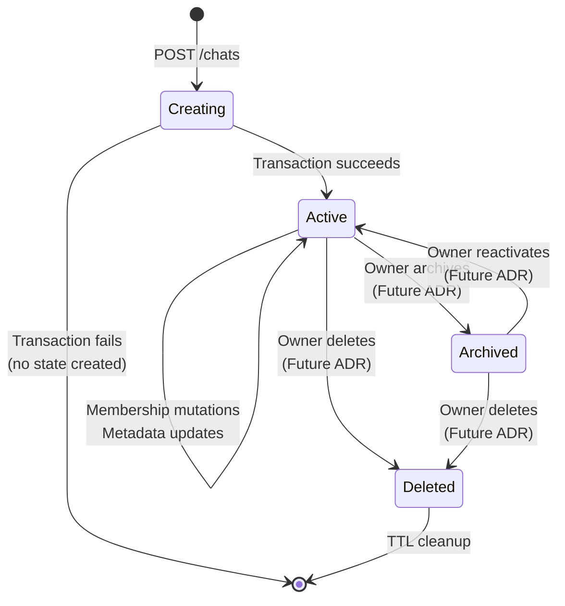
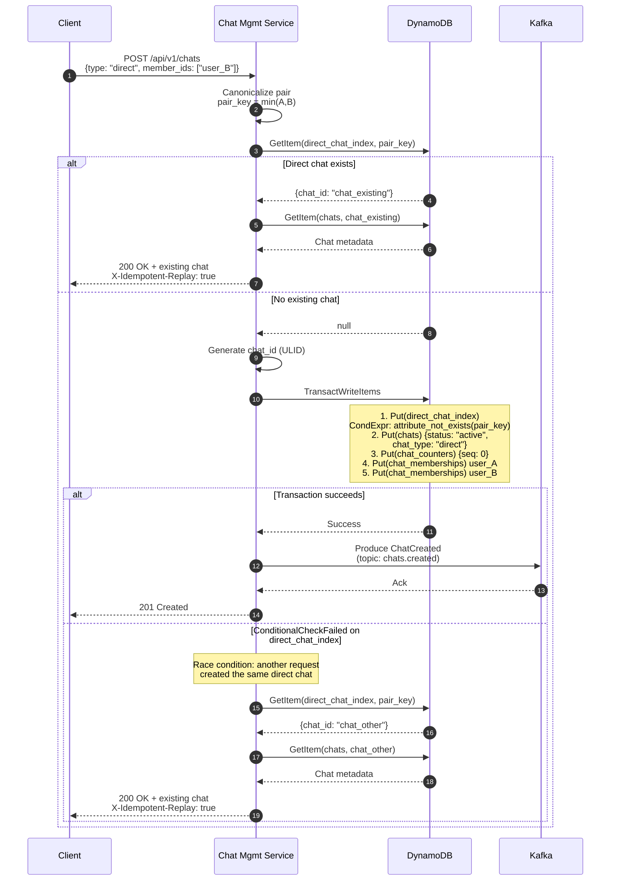
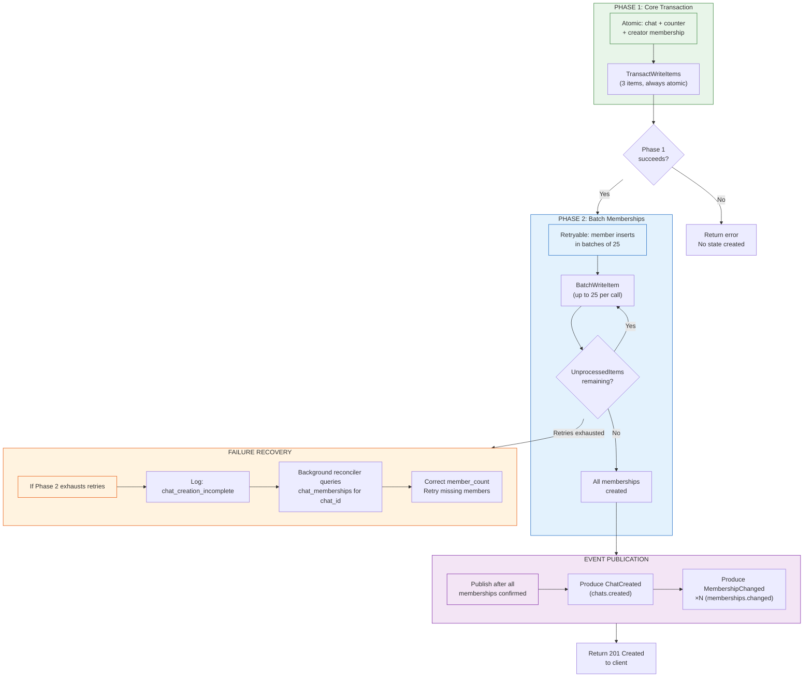
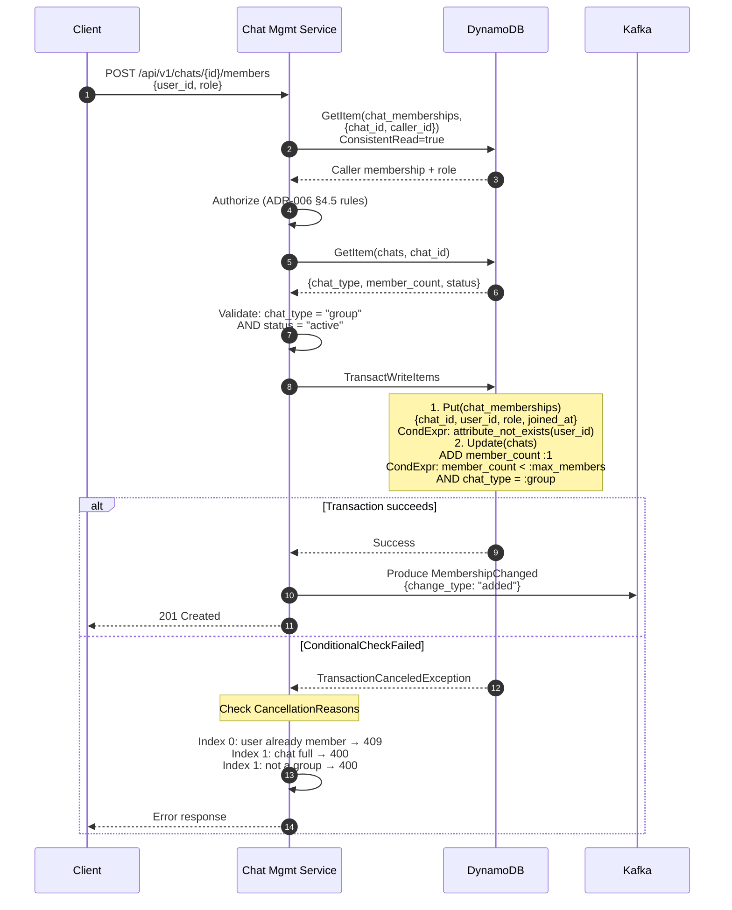
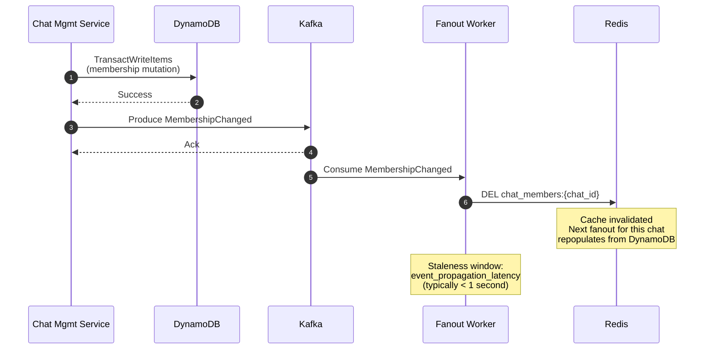

# ADR-016: Chat Lifecycle & Membership Orchestration

- **Status**: Accepted
- **Date**: 2026-02-01

---

## Context and Problem Statement

ADR-001 through ADR-015 established the foundational architecture for the distributed messaging platform. Several ADRs define chat-and-membership-adjacent contracts:

- **ADR-003 §4.3, §4.4**: Sequence diagrams for chat creation and membership change dataflows, including `TransactWriteItems` for creation and `MembershipChanged` Kafka events for cache invalidation.
- **ADR-006 §4.1–§4.10**: REST API endpoints for chat CRUD, member add/remove/role change, leave, and mute/unmute with authorization rules and error codes.
- **ADR-007 §2.5, §2.6**: `chats` table (PK: `chat_id`), `chat_memberships` table (PK: `chat_id`, SK: `user_id`) with `user_chats-index` GSI, and `chat_counters` table (PK: `chat_id`).
- **ADR-011 §Part 3**: Kafka event schemas for `ChatCreated`, `MembershipChanged`, and `chats.created` / `memberships.changed` topics with partition-by-`chat_id` semantics.
- **ADR-013 §Security Authority Invariant**: Durability Plane is the sole authority for write authorization; Gateway must not authorize.
- **ADR-014 §1.4**: Chat Management Service handles REST + gRPC via grpc-gateway, scaling independently by REST request rate.

While these ADRs define the **data model**, **API surface**, **event schemas**, and **authorization boundaries**, they leave significant **orchestration gaps** that, if resolved inconsistently, would violate the DynamoDB-authoritative invariant (ADR-003), introduce race conditions in membership checks, or produce orphaned state across DynamoDB and Kafka. Specifically:

1. **Direct chat deduplication**: ADR-006 §4.1 specifies canonicalization ("member_ids are sorted lexicographically") and idempotent creation (return 200 OK for existing direct chats), but the DynamoDB implementation mechanism — how uniqueness is enforced without a scan — is unspecified.
2. **Chat creation atomicity boundary**: ADR-003 §4.3 shows a `TransactWriteItems` for `chats` + `chat_counters` + `chat_memberships` (×N members). DynamoDB transactions are limited to 100 items. For a group chat with 99 members (ADR-006 §4.1: max 100 including creator), the transaction contains 1 (`chats`) + 1 (`chat_counters`) + 100 (`chat_memberships`) = 102 items — exceeding the limit.
3. **Membership mutation ordering**: Concurrent `add_member` and `remove_member` on the same chat could interleave, producing inconsistent membership state visible to the Durability Plane's strongly consistent membership checks (ADR-004 §Step 2).
4. **Chat lifecycle states**: No ADR defines valid chat states (active, archived, deleted) or transitions. ADR-006 §4.8 (Leave Chat) implies ownership constraints ("owner cannot leave without transferring ownership first") but ownership transfer is explicitly deferred.
5. **Orphan prevention**: If DynamoDB writes succeed but the subsequent Kafka publish fails (chat creation or membership change), downstream consumers never learn about the mutation. The membership cache (ADR-003 §3.2, TTL: 300s) serves stale data until natural expiry.
6. **Member count denormalization**: ADR-006 §4.2 returns `member_count` in chat listings. This value must be maintained consistently with actual membership records without expensive count queries on every read.
7. **Group size enforcement**: ADR-006 §4.1 specifies max 100 members but the enforcement mechanism — preventing TOCTOU races between count check and member insertion — is unspecified.
8. **Direct chat immutability invariants**: Direct chats cannot have members added/removed (ADR-006 §4.5, §4.6, §4.8). This invariant must be enforced at the data layer, not just the API layer.

**Core Question**: How does the Chat Management Service orchestrate chat creation, membership mutations, and lifecycle transitions correctly against the DynamoDB transaction limits, Kafka event contracts, and authorization model?

---

## Decision Drivers

1. **DynamoDB is authoritative** (ADR-003): All chat and membership state is authoritative in DynamoDB. Kafka events are derived and may lag.

2. **Correctness before performance** (MVP-DEFINITION.md): Race conditions in membership operations are unacceptable. Performance optimizations that sacrifice correctness are rejected.

3. **Transaction limits are real** (DynamoDB): 100-item limit on `TransactWriteItems` is a hard constraint. Design must accommodate group chats at maximum size.

4. **Idempotency** (ADR-001, ADR-006 §10): All mutation operations must be retry-safe. Partial failures must not produce inconsistent state visible to clients.

5. **Fail-secure** (ADR-013): Authorization failures deny the operation. Ambiguity resolves to denial.

6. **Event contracts** (ADR-011): Kafka events must reflect committed DynamoDB state. An event must never precede the write it describes.

7. **Operational simplicity** (ADR-014): Prefer DynamoDB-native mechanisms (conditions, transactions, atomic counters) over application-level distributed coordination.

---

## Considered Options

### Direct Chat Deduplication

- **Option A**: GSI on `chat_memberships` with composite key `direct_chat:{min_user}:{max_user}` — query before create
- **Option B**: Dedicated `direct_chat_index` table with PK = `{min_user_id}#{max_user_id}` — atomic lookup
- **Option C**: Conditional `PutItem` on `chats` table with a `direct_pair` attribute using a condition expression

### Chat Creation Transaction Strategy

- **Option A**: Single `TransactWriteItems` (fails for large groups due to 100-item limit)
- **Option B**: Two-phase creation — core transaction first, then batch membership inserts
- **Option C**: Saga pattern with compensating transactions

### Member Count Maintenance

- **Option A**: Denormalized `member_count` on `chats` table, updated atomically on each mutation
- **Option B**: Computed on read via `Query` count on `chat_memberships`
- **Option C**: Cached in Redis with invalidation

### Group Size Enforcement

- **Option A**: Read-then-write with conditional expression (TOCTOU-vulnerable)
- **Option B**: Atomic counter on `chats` table with conditional check
- **Option C**: DynamoDB transaction with membership count assertion

---

## Decision Outcome

| Decision Point | Chosen Option | Key Rationale |
|----------------|---------------|---------------|
| Direct Chat Deduplication | **Option B** — Dedicated `direct_chat_index` table | Atomic lookup + conditional put; no scan; O(1) existence check |
| Chat Creation Transaction | **Option B** — Two-phase creation | Accommodates max group size; core chat is atomic; memberships are eventually complete |
| Member Count Maintenance | **Option A** — Denormalized `member_count` | O(1) reads; atomic updates via `ADD`; consistent with DynamoDB patterns |
| Group Size Enforcement | **Option B** — Atomic counter with conditional check | Prevents TOCTOU races; uses `member_count` as the serialization point |

---

## Detailed Design

### 1. Chat Lifecycle State Model

Chats follow a minimal lifecycle model. MVP defines two active states; archival and deletion are deferred but the model is designed for extension.



**MVP scope**: Only `Active` state is implemented. The `status` attribute on the `chats` table is set to `active` at creation. This reserves the attribute for future lifecycle extensions without schema changes.

**Status attribute addition to `chats` table** (extends ADR-007 §2.5):

| Attribute | Type | Description |
|-----------|------|-------------|
| `status` | String | `active` (MVP). Future: `archived`, `deleted` |

### 2. Direct Chat Deduplication

#### 2.1 New DynamoDB Table: `direct_chat_index`

This is the 10th DynamoDB table (9th from ADR-007, plus `otp_requests` from ADR-015). It follows ADR-007's design philosophy: access-pattern-driven table separation.

| Attribute | Type | Key | Description |
|-----------|------|-----|-------------|
| `pair_key` | String | PK | `{min(user_a, user_b)}#{max(user_a, user_b)}` |
| `chat_id` | String | — | The chat_id of the existing direct chat |
| `created_at` | String | — | ISO 8601 timestamp |

**Why a separate table (not a GSI on `chats` or `chat_memberships`)**:

A GSI would require either overloading the `chats` table partition key (violating ADR-007's access-pattern separation) or adding a GSI to `chat_memberships` with a synthetic attribute (increasing write amplification on every membership write — not just direct chat creation). A dedicated table makes the access pattern explicit: given two user IDs, does a direct chat exist? This is a point lookup (`GetItem`), not a query.

**Why `#` separator**: User IDs are ULIDs (ADR-007) which use `[0-9A-Z]` characters. `#` is not in the ULID alphabet, guaranteeing no ambiguity in the composite key.

**Capacity mode**: On-Demand (low write frequency, proportional to direct chat creation rate).

**No GSI**: The only access pattern is `GetItem` by `pair_key`.

**No TTL**: Direct chat index entries are permanent. If direct chat deletion is implemented (future ADR), the index entry must be deleted in the same transaction.

#### 2.2 Direct Chat Creation Flow



**Transaction size**: Direct chats always create exactly 5 items (index + chat + counter + 2 memberships). Well within the 100-item limit.

**Race condition handling**: Two concurrent `POST /chats` for the same user pair will both call `GetItem` and find no existing chat. Both will attempt `TransactWriteItems`. The `attribute_not_exists(pair_key)` condition on the `direct_chat_index` item guarantees exactly one succeeds. The loser receives `TransactionCanceledException` with `ConditionalCheckFailed`, reads the winning chat_id from the index, and returns it as a 200 OK.

**Idempotency-Key interaction**: If the client provides an `Idempotency-Key` (ADR-006 §10), the standard idempotency mechanism applies. The `direct_chat_index` provides a second layer of deduplication independent of idempotency keys, ensuring correctness even across different requests from different clients for the same pair.

### 3. Group Chat Creation

#### 3.1 Two-Phase Creation Strategy

DynamoDB `TransactWriteItems` is limited to 100 items. A group chat with N members requires:
- 1 × `chats` item
- 1 × `chat_counters` item
- N × `chat_memberships` items

For N ≤ 97 members (total = N + 3 items ≤ 100), a single transaction suffices. For N = 98–99 members (total = 101–102), the limit is exceeded. Rather than special-casing at the boundary, the design uses a consistent two-phase approach for all group chats.

**Phase 1: Core Chat Transaction** (always atomic)

```
TransactWriteItems:
  1. Put(chats): {chat_id, chat_type: "group", name, created_by,
                   status: "active", member_count: N+1, created_at, updated_at}
     ConditionExpression: attribute_not_exists(chat_id)
     -- member_count is set to the INTENDED final count, not the
     -- immediately materialized membership cardinality. See §3.2.
  2. Put(chat_counters): {chat_id, sequence_counter: 0}
     ConditionExpression: attribute_not_exists(chat_id)
  3. Put(chat_memberships): creator as owner
     ConditionExpression: attribute_not_exists(user_id)
```

**Phase 2: Batch Membership Inserts** (retryable, idempotent)

```
BatchWriteItem (batches of 25):
  For each member in member_ids:
    Put(chat_memberships): {chat_id, user_id, role: "member", joined_at}
```

**Why `BatchWriteItem` (not `TransactWriteItems`) for Phase 2**:

Phase 2 items are independent — each membership record has a unique `(chat_id, user_id)` key. No cross-item conditions are needed. `BatchWriteItem` supports up to 25 items per call, handles partial failures via `UnprocessedItems`, and has lower latency than transactions. The Chat Mgmt Service retries `UnprocessedItems` with exponential backoff.

#### 3.2 Consistency Window and `member_count` Semantics

**`member_count` is an intended count, not an actual count.** During group creation, `member_count` represents the *intended final member count*, not the immediately materialized membership cardinality. It converges to the actual count once Phase 2 completes (or the reconciler corrects it). This distinction is critical:

> **`member_count` is never used for authorization or correctness checks.** It serves exactly two purposes: (1) display in API responses (ADR-006 §4.2, §4.3), and (2) group size enforcement via conditional expressions (§4.1). The Durability Plane's membership check (ADR-004 §Step 2) reads `chat_memberships` directly — never `member_count`. Future engineers must not repurpose `member_count` as a truth source for membership cardinality.

Between Phase 1 completion and Phase 2 completion, the chat exists with only the creator as a member. During this window:

- **Messages**: Only the creator can send messages (membership check in Durability Plane passes only for creator). This is correct behavior — the chat is being set up.
- **Chat listing**: The chat appears in the creator's chat list immediately. Other members see it as memberships are created (eventual).
- **Member count**: `member_count` temporarily exceeds the actual membership record count. This is a cosmetic discrepancy, not a correctness issue.
- **Fanout interaction**: A user added late in Phase 2 may temporarily not receive fanout delivery (missing membership in both DynamoDB and Redis cache) but may see the chat listed via the creator's `member_count`. Message delivery becomes consistent once membership insertion completes or the cache expires. This is an acceptable user-visible quirk bounded by Phase 2 duration (typically milliseconds).

**Why set `member_count` to final value in Phase 1**: Updating `member_count` atomically as each membership is added would require a transaction for every membership insert. Instead, we set the intended count upfront and treat Phase 2 as "catching up." If Phase 2 partially fails, the `member_count` is corrected during reconciliation (§3.3).

#### 3.3 Phase 2 Failure and Reconciliation



**Reconciliation procedure** (background, periodic):

```
PROCEDURE reconcile_incomplete_chats():
  1. Scan chats table WHERE status = "active"
     AND created_at > (now - 1 hour)
     (Scoped to recent chats to bound work)
  2. For each chat:
     a. Query chat_memberships (PK = chat_id)
     b. actual_count = result.Count
     c. IF actual_count != chat.member_count:
          UpdateItem(chats, {chat_id}):
            SET member_count = :actual_count
            ConditionExpression: member_count != :actual_count
          Log: member_count_corrected
  3. Frequency: Every 5 minutes
  4. Implementation: ECS scheduled task or Chat Mgmt background goroutine
```

**Reconciler operational invariants** (binding):

| Invariant | Rule | Rationale |
|-----------|------|-----------|
| Time-bounded | Scan window must never exceed 1 hour of `created_at` | Prevents unbounded full-table scans as chat volume grows |
| Not correctness-critical | System is correct without reconciler running | Reconciler fixes cosmetic drift (`member_count`), not authorization or delivery |
| Idempotent | Multiple concurrent runs produce same result | Conditional update (`member_count != :actual_count`) prevents conflicting writes |
| Observable | Every correction emits `chat_reconciliation_corrections_total` metric | Corrections indicate upstream failures worth investigating |

**Future evolution**: The time-bounded scan approach is acceptable at MVP scale. At higher chat creation rates, this scan can be replaced with either (a) a write-ahead `incomplete_chat_creations` marker set in Phase 1 and cleared after Phase 2 completion, enabling targeted reconciliation, or (b) a DynamoDB Streams–driven repair loop that reacts to `chats` table inserts. Both approaches eliminate scanning entirely. This is a future ADR concern and does not affect the current design.

**Why this is acceptable**: Phase 2 failures are extremely rare (DynamoDB `BatchWriteItem` is highly reliable with automatic retries). The reconciler is a safety net, not a primary correctness mechanism. The `member_count` discrepancy during the window is a cosmetic issue — the actual membership check in the Durability Plane (ADR-004 §Step 2) reads `chat_memberships` directly, not `member_count`.

### 4. Membership Mutation Orchestration

#### 4.1 Add Member



**Atomicity**: The `Put` on `chat_memberships` and the `Update` on `chats.member_count` are in the same transaction. This prevents the TOCTOU race where two concurrent `add_member` calls both see `member_count = 99` and both succeed, producing 101 members.

**Authorization enforcement**: Caller's membership and role are read with `ConsistentRead=true` before the transaction. This is outside the transaction because the authorization check is a precondition, not a mutation. If the caller's role changes between the read and the transaction, the worst case is a briefly stale authorization — acceptable because role changes are rare and the Durability Plane re-validates on every message send.

#### 4.2 Remove Member

```
PROCEDURE remove_member(caller_id, chat_id, target_user_id):
  1. GetItem(chat_memberships, {chat_id, caller_id}, ConsistentRead=true)
     → Validate caller exists and has permission (ADR-006 §4.6)
  2. GetItem(chat_memberships, {chat_id, target_user_id}, ConsistentRead=true)
     → Validate target exists and is removable
     → Cannot remove owner
  3. TransactWriteItems:
     a. Delete(chat_memberships, {chat_id, target_user_id})
        ConditionExpression: attribute_exists(user_id)
          AND role != :owner
     b. Update(chats, {chat_id})
        ADD member_count :-1
        ConditionExpression: member_count > :one
          AND status = :active
  4. On success:
     → Produce MembershipChanged {change_type: "removed"}
     → Return 204 No Content
  5. On ConditionalCheckFailed:
     → Index 0: target not found or is owner → 403/404
     → Index 1: last member or chat not active → 400
```

**Member count floor**: The condition `member_count > 1` prevents removing the last member. A group chat must always have at least the owner.

#### 4.3 Leave Chat

```
PROCEDURE leave_chat(caller_id, chat_id):
  1. GetItem(chat_memberships, {chat_id, caller_id}, ConsistentRead=true)
     → Validate caller is a member
     → Validate chat_type = "group" (cannot leave direct chats)
     → Validate role != "owner" (owner cannot leave without transfer)
  2. TransactWriteItems:
     a. Delete(chat_memberships, {chat_id, caller_id})
        ConditionExpression: attribute_exists(user_id)
          AND role != :owner
     b. Update(chats, {chat_id})
        ADD member_count :-1
  3. On success:
     → Produce MembershipChanged {change_type: "removed", changed_by: caller_id}
     → Return 204 No Content
```

**Ownership transfer (deferred)**: ADR-006 §4.8 states "owner cannot leave without transferring ownership first" and "MVP: ownership transfer not supported, so owner cannot leave." This ADR preserves that constraint. A future ADR will define the ownership transfer operation as a transactional role swap within `chat_memberships`.

**Ownership invariant enforcement note**: The `owner_always_exists` invariant (Appendix B) is enforced *procedurally* — by preventing owner removal, owner departure, and owner role reassignment via condition expressions. DynamoDB has no built-in constraint that guarantees "at least one item in a collection has attribute X." A future ownership-transfer ADR must preserve this invariant *transactionally* (i.e., the old owner's role change and the new owner's role change must be in the same `TransactWriteItems` call). Two independent `UpdateItem` calls would create a window where either zero or two owners exist.

#### 4.4 Update Member Role

```
PROCEDURE update_role(caller_id, chat_id, target_user_id, new_role):
  1. GetItem(chat_memberships, {chat_id, caller_id}, ConsistentRead=true)
     → Validate caller.role = "owner" (ADR-006 §4.7: only owner can change roles)
  2. UpdateItem(chat_memberships, {chat_id, target_user_id})
     SET role = :new_role, updated_at = :now
     ConditionExpression:
       attribute_exists(user_id)
       AND user_id != :caller_id
       AND role != :owner
     → Cannot change own role; cannot assign/revoke owner role
  3. On success:
     → Produce MembershipChanged {change_type: "role_changed"}
     → Return 200 OK
```

**No transaction needed**: Role updates modify a single item (`chat_memberships`). The conditional expression on `UpdateItem` prevents race conditions (target must exist, must not be owner). No denormalized data requires coordinated updates.

### 5. Direct Chat Immutability Invariants

Direct chats have stricter invariants than group chats. These are enforced at the data layer to prevent bypassing API-level checks:

| Operation | Group Chat | Direct Chat | Enforcement Mechanism |
|-----------|------------|-------------|----------------------|
| Add member | Allowed (with auth) | **Blocked** | Transaction CondExpr: `chat_type = :group` |
| Remove member | Allowed (with auth) | **Blocked** | Transaction CondExpr: `chat_type = :group` |
| Leave | Allowed (non-owner) | **Blocked** | Pre-check: `chat_type = "group"` |
| Update name | Allowed (admin/owner) | **Blocked** | Pre-check: `chat_type = "group"` |
| Update role | Allowed (owner) | **Blocked** | N/A (direct chats have no owner) |
| Mute/Unmute | Allowed | **Allowed** | Per-user setting, not chat mutation |
| Send message | Allowed | **Allowed** | Membership check only |

**Why data-layer enforcement**: API-level checks (returning 400 `INVALID_OPERATION`) are the first line of defense. However, a bug in the API handler, a new code path, or a direct gRPC call from another service could bypass these checks. The `ConditionExpression: chat_type = :group` on mutation transactions provides defense-in-depth per ADR-013's principle.

### 6. Event Publication Contract

#### 6.1 Event Ordering Relative to DynamoDB

All lifecycle events follow the pattern established in ADR-003 §4.3 and ADR-011:

```
INVARIANT event_follows_commit:
  ∀ event E ∈ {ChatCreated, MembershipChanged}:
    E published to Kafka at time T_kafka
    ⟹ corresponding DynamoDB write committed at time T_ddb
    ∧ T_ddb < T_kafka
  -- Events are always published AFTER DynamoDB commit
```

**Failure case**: If Kafka publish fails after DynamoDB commit:
- The DynamoDB state is correct (authoritative).
- Downstream consumers (Fanout Worker) miss the event.
- **Consequence**: The membership cache in Redis (`chat_members:{chat_id}`, ADR-003 §3.2) is not invalidated. Stale membership data persists until TTL expiry (300 seconds).
- **Mitigation**: The Durability Plane's membership check (ADR-004 §Step 2) uses `ConsistentRead=true` on DynamoDB, not the cache. Message authorization is never affected. Only fanout routing may temporarily deliver messages to a removed member or fail to deliver to a newly added member.

#### 6.2 Event Schemas

All events follow ADR-011's envelope format. This section specifies the lifecycle-specific payloads.

**ChatCreated** (extends ADR-011 §Part 3):

```json
{
  "event_type": "ChatCreated",
  "event_version": 1,
  "event_id": "evt_01HQX...",
  "event_time": "2026-02-01T14:30:00.000Z",
  "partition_key": "chat_abc123",
  "payload": {
    "chat_id": "chat_abc123",
    "chat_type": "group",
    "name": "Project Team",
    "status": "active",
    "created_by": "user_456",
    "member_count": 4,
    "initial_members": ["user_456", "user_789", "user_012", "user_345"],
    "created_at": "2026-02-01T14:30:00.000Z"
  }
}
```

**MembershipChanged** (extends ADR-011 §Part 3):

```json
{
  "event_type": "MembershipChanged",
  "event_version": 1,
  "event_id": "evt_01HQY...",
  "event_time": "2026-02-01T14:31:00.000Z",
  "partition_key": "chat_abc123",
  "payload": {
    "chat_id": "chat_abc123",
    "user_id": "user_789",
    "change_type": "added",
    "role": "member",
    "changed_by": "user_456",
    "member_count_after": 5,
    "changed_at": "2026-02-01T14:31:00.000Z"
  }
}
```

The `member_count_after` field is added to enable downstream consumers to maintain consistent counters without querying DynamoDB.

**Schema evolution note on `initial_members`**: The `initial_members` array in `ChatCreated` is included for MVP convenience (e.g., rendering "Alice created a group with Bob, Carol, and Dave"). Downstream consumers must not assume this field is complete or will remain present in future event versions. For groups created via the two-phase strategy (§3.1), `initial_members` reflects the *intended* member list at creation time, not necessarily the materialized membership at the moment the event is consumed. Consumers requiring authoritative membership must query DynamoDB.

#### 6.3 Kafka Publish Failure Handling

```
PROCEDURE publish_lifecycle_event(event):
  1. Attempt kafka.Produce(topic, event, acks=all)
  2. IF success → return
  3. IF failure:
     a. Retry with exponential backoff (3 attempts, 100ms/500ms/2000ms)
     b. IF all retries fail:
        → Log: lifecycle_event_publish_failed (CRITICAL)
        → Metric: kafka_publish_failures_total{event_type="..."}
        → Do NOT roll back DynamoDB write
        → Return success to client (DynamoDB is authoritative)
        → The background reconciler (§3.3) will detect and correct
           downstream inconsistencies on next run
```

**Why not roll back**: Rolling back DynamoDB after a successful write but failed Kafka publish would create a worse inconsistency — the client received a success response but the operation was reverted. The DynamoDB state is correct; only the downstream notification is delayed. This aligns with ADR-003's axiom: "If DynamoDB says it happened, it happened."

### 7. Membership Read Consistency Model

The system provides two consistency tiers for membership reads, depending on the operation:

| Read Context | Consistency | Source | Rationale |
|--------------|-------------|--------|-----------|
| Message authorization (Durability Plane) | **Strongly consistent** | DynamoDB `GetItem(ConsistentRead=true)` | Security-critical (ADR-004 §Step 2) |
| Fanout delivery routing | **Eventually consistent** | Redis cache → DynamoDB fallback | Performance-critical; stale delivery is acceptable |
| Chat listing (REST API) | **Eventually consistent** | DynamoDB `Query` on GSI | GSI is eventually consistent by default |
| Chat detail (REST API) | **Strongly consistent** | DynamoDB `GetItem` + `Query` | User expects current state |

**Membership cache invalidation flow** (reaffirms ADR-003 §3.2):



**Worst-case staleness**: If Kafka publish fails, the cache TTL (300 seconds per ADR-003 §3.2) is the upper bound on staleness. The Durability Plane's strongly consistent membership check is never affected.

### 8. Authorization Decision Matrix

This section consolidates all authorization rules from ADR-006 §4 into a single reference. All checks are performed by the Chat Mgmt Service with `ConsistentRead=true` on the caller's membership record.

| Operation | Owner | Admin | Member | Non-Member |
|-----------|-------|-------|--------|------------|
| Create group chat | N/A (becomes owner) | N/A | N/A | Authenticated user |
| Create direct chat | N/A | N/A | N/A | Authenticated user |
| Update chat name | ✅ | ✅ | ❌ | ❌ |
| Add member (as member) | ✅ | ✅ | ❌ | ❌ |
| Add member (as admin) | ✅ | ❌ | ❌ | ❌ |
| Remove member | ✅ (except self) | ✅ (members only) | ❌ | ❌ |
| Change role | ✅ (except self) | ❌ | ❌ | ❌ |
| Leave chat | ❌ (must transfer first) | ✅ | ✅ | N/A |
| Mute/Unmute | ✅ | ✅ | ✅ | ❌ |
| Send message | ✅ | ✅ | ✅ | ❌ |
| Read history | ✅ | ✅ | ✅ | ❌ |

**Authorization invariant**:

```
INVARIANT authorization_hierarchy:
  ∀ operation O, user U, chat C:
    authorized(U, O, C) ⟹
      ∃ membership M ∈ chat_memberships:
        M.chat_id = C ∧ M.user_id = U
        ∧ M.role ∈ required_roles(O)
  -- Authorization requires current membership with sufficient role
```

### 9. Failure Mode Catalog

| Failure | Impact | Recovery | Data Consistency |
|---------|--------|----------|-----------------|
| Phase 1 transaction fails (chat creation) | No chat created | Client retries with same Idempotency-Key | ✅ No partial state |
| Phase 2 batch partially fails (group creation) | Chat exists with partial membership | Retry `UnprocessedItems`; reconciler corrects `member_count` | ⚠️ Temporary: some members missing |
| Kafka publish fails after DynamoDB commit | Downstream unaware of mutation | Membership cache expires in ≤300s; reconciler detects inconsistency | ⚠️ Temporary: stale cache |
| DynamoDB throttling during batch membership | Slow membership creation | Automatic retries via `UnprocessedItems`; backoff | ⚠️ Temporary: creation latency |
| Concurrent add + remove same user | One wins via `ConditionExpression` | Loser receives error; client retries if needed | ✅ Serialized by DynamoDB |
| Chat Mgmt Service crashes mid-Phase 2 | Partial membership state | Reconciler detects and completes on next run | ⚠️ Temporary: partial membership |
| Direct chat race (two concurrent creates) | One wins via conditional put on index | Loser reads winner's chat_id, returns 200 OK | ✅ Exactly one chat created |

**Concurrent mutation determinism**: If `add_member` and `remove_member` race for the same `(chat_id, user_id)`, DynamoDB serialization guarantees exactly one mutation commits. The `add_member` transaction's `attribute_not_exists(user_id)` condition and the `remove_member` transaction's `attribute_exists(user_id)` condition are mutually exclusive on the same item — exactly one will pass. The loser receives `ConditionalCheckFailed` and must surface an appropriate error to the client. No application-level retry is needed; the client can re-read the current membership state and decide whether to retry.

### 10. Operational Metrics

These metrics extend ADR-012's observability framework for lifecycle operations.

| Metric | Type | Labels | Description |
|--------|------|--------|-------------|
| `chat_created_total` | Counter | `chat_type` | Chat creations by type |
| `chat_creation_duration_seconds` | Histogram | `chat_type`, `phase` | Latency by phase (1, 2, kafka) |
| `membership_mutation_total` | Counter | `change_type` | Membership changes by type |
| `membership_mutation_duration_seconds` | Histogram | `change_type` | Mutation latency |
| `direct_chat_dedup_total` | Counter | `result` (created/existing) | Deduplication outcomes |
| `chat_creation_phase2_retries_total` | Counter | — | BatchWriteItem retry count |
| `chat_reconciliation_corrections_total` | Counter | — | Member count corrections |
| `kafka_lifecycle_publish_failures_total` | Counter | `event_type` | Publish failures by event type |

**Alert thresholds** (integrate with ADR-012 alert taxonomy):

| Alert | Severity | Condition |
|-------|----------|-----------|
| `chat_creation_phase2_retries_high` | SEV-3 | >5 retries in 5 minutes |
| `kafka_lifecycle_publish_failures` | SEV-2 | Any failure (Kafka publish is critical path) |
| `chat_reconciliation_corrections` | SEV-3 | Any correction (indicates prior failure) |

---

## Consequences

### Positive

1. **Race-condition-free membership management**: DynamoDB conditional expressions and transactions serialize concurrent mutations. No application-level locking required.

2. **Direct chat uniqueness guaranteed**: The `direct_chat_index` table provides O(1) deduplication with atomic conditional puts, handling concurrent creation races correctly.

3. **Scalable group creation**: The two-phase approach supports group chats up to 100 members without hitting DynamoDB transaction limits while maintaining atomic core state.

4. **Defense-in-depth for direct chats**: Immutability invariants are enforced at both the API layer (400 errors) and the data layer (condition expressions), preventing bypass via internal service calls.

5. **Bounded inconsistency**: The worst-case inconsistency window (stale membership cache) is bounded at 300 seconds and only affects fanout routing, never message authorization. During group creation specifically, the Phase-2 membership insertion lag and Redis cache staleness can compound: a newly added member may observe the chat in their chat list (via `member_count`) before fanout routing includes them. This is bounded by Phase 2 completion time (typically milliseconds) and documented as an accepted UX quirk in §3.2.

6. **Observable lifecycle operations**: Comprehensive metrics and alerts enable monitoring of creation latency, deduplication rates, and failure recovery.

### Negative

1. **Additional DynamoDB table**: The `direct_chat_index` is the 10th table, increasing operational surface.
   *Mitigation*: Table is simple (single PK, no GSI, no TTL), low write volume, on-demand pricing. Managed via existing Terraform/CloudFormation pipeline (ADR-014).

2. **Two-phase group creation window**: Between Phase 1 and Phase 2 completion, the chat has partial membership. A member who has not yet been inserted cannot send messages.
   *Mitigation*: Phase 2 typically completes in milliseconds (BatchWriteItem for ≤100 items). The window is a cosmetic issue; the reconciler provides a safety net.

3. **`member_count` denormalization drift risk**: If the reconciler fails, `member_count` may diverge from actual membership count.
   *Mitigation*: The `member_count` is a display optimization, not a correctness mechanism. The Durability Plane reads `chat_memberships` directly. Reconciler metrics (§10) alert on corrections.

4. **No ownership transfer in MVP**: Owners cannot leave group chats. This may frustrate users who want to leave a chat they created.
   *Mitigation*: Documented as explicitly deferred (ADR-006 §4.8). A future ADR will define transactional ownership transfer.

### Explicitly Deferred

| Decision | Status | Trigger for Revisit |
|----------|--------|---------------------|
| Ownership transfer | Out of scope | User demand or operational need for owner departure |
| Chat archival/deletion | Out of scope | Storage cost pressure or compliance requirements |
| Batch member operations | Out of scope | ADR-006 Future Considerations §1: bulk add/remove |
| Chat search/discovery | Out of scope | Product requirement for finding public or suggested chats |
| Member invitation flow | Out of scope | Product requirement for invite links or approval workflows |

---

## Confirmation

The implementation of this ADR will be validated through:

1. **Direct Chat Deduplication Tests**:
   - Two concurrent `POST /chats {type: "direct"}` for the same pair → exactly one chat created, both clients receive same `chat_id`
   - `POST /chats` for an existing direct pair → 200 OK with `X-Idempotent-Replay: true`
   - `POST /chats` with swapped member order → same canonical pair, same chat

2. **Group Chat Creation Tests**:
   - Group with 2 members → single-phase transaction succeeds
   - Group with 99 members → two-phase creation completes, all memberships exist, `member_count` = 100
   - Phase 2 partial failure → reconciler corrects `member_count`

3. **Membership Mutation Tests**:
   - Add member to full chat (100 members) → 400 `CHAT_FULL`
   - Concurrent add same user → exactly one succeeds (409), other fails
   - Remove member → `member_count` decremented atomically
   - Remove owner → 400 `INVALID_OPERATION`
   - Any mutation on direct chat → 400 `INVALID_OPERATION`

4. **Authorization Tests**:
   - Member attempts add_member → 403 `FORBIDDEN`
   - Admin attempts role change → 403 `FORBIDDEN`
   - Non-member attempts any operation → 403 `NOT_A_MEMBER`

5. **Event Publication Tests**:
   - Chat creation → `ChatCreated` event in Kafka with correct `member_count`
   - Member add → `MembershipChanged` event with `change_type: "added"`
   - Kafka publish failure → DynamoDB state correct, metric incremented, reconciler detects

6. **Failure Injection Tests**:
   - Kill Chat Mgmt mid-Phase 2 → reconciler completes creation on next run
   - DynamoDB throttling → retries succeed via `UnprocessedItems`
   - Concurrent create + leave race → consistent final state

---

## More Information

### Related ADRs

| ADR | Relationship |
|-----|--------------|
| ADR-001 | Idempotency and ordering invariants that lifecycle operations must preserve |
| ADR-002 | Plane separation; Chat Mgmt is cross-cutting, not in a single plane |
| ADR-003 | Source of truth hierarchy; DynamoDB authoritative, Kafka derived, Redis ephemeral |
| ADR-004 | Message ingest membership check (Step 2) consumes this ADR's membership state |
| ADR-006 | REST API contract that this ADR implements; authorization rules; endpoint specifications |
| ADR-007 | Data model for `chats`, `chat_memberships`, `chat_counters` tables; this ADR adds `direct_chat_index` |
| ADR-009 | Failure handling contracts; reconciliation aligns with backpressure philosophy |
| ADR-011 | Kafka event schemas for `ChatCreated` and `MembershipChanged`; partition semantics |
| ADR-013 | Security authority invariant; defense-in-depth enforcement |
| ADR-014 | Chat Mgmt Service topology; this ADR specifies its internal orchestration |
| ADR-015 | Authentication; user creation is a precondition for chat membership |

### References

- Alex DeBrie. *The DynamoDB Book*. 2020. Chapter on transaction patterns and conditional writes.
- AWS Documentation. "Managing Complex Workflows with DynamoDB Transactions." 2024.
- Pat Helland. "Life beyond Distributed Transactions: an Apostate's Opinion." CIDR 2007.
- Kleppmann, M. (2017). *Designing Data-Intensive Applications*. O'Reilly Media. Chapter 7: Transactions.

### Future Considerations

1. **ADR-XXX: Ownership Transfer**: Transactional role swap within `chat_memberships`; implications for active WebSocket sessions of the departing owner.

2. **ADR-XXX: Chat Archival and Deletion**: Soft delete with TTL, message tombstoning, GDPR compliance considerations.

3. **ADR-XXX: Batch Membership Operations**: Bulk add/remove API for admin tooling; implications for event volume and Kafka partition throughput.

4. **ADR-XXX: Chat Discovery and Invitations**: Public chats, invite links, approval workflows; new table/index requirements.

---

## Appendix A: DynamoDB Table Summary (Updated)

After this ADR, the system uses **10 DynamoDB tables**:

| # | Table | ADR | Purpose |
|---|-------|-----|---------|
| 1 | `users` | ADR-007 | User identity and profiles |
| 2 | `chats` | ADR-007, **ADR-016** | Chat metadata (adds `status`, `member_count` attributes) |
| 3 | `chat_memberships` | ADR-007 | User-chat relationships |
| 4 | `messages` | ADR-007 | Message content |
| 5 | `chat_counters` | ADR-007 | Atomic sequence counters |
| 6 | `idempotency_keys` | ADR-007 | Duplicate detection |
| 7 | `delivery_state` | ADR-007 | Delivery watermarks |
| 8 | `sessions` | ADR-007 | Authentication sessions |
| 9 | `otp_requests` | ADR-015 | Pending OTP records |
| 10 | `direct_chat_index` | **ADR-016** | Direct chat pair deduplication |

## Appendix B: Invariants (Machine-Checkable)

```
INVARIANT direct_chat_uniqueness:
  ∀ users A, B where A ≠ B:
    |{C : C ∈ chats ∧ C.chat_type = "direct"
       ∧ {A, B} ⊆ members(C)}| ≤ 1
  -- At most one direct chat exists per user pair

INVARIANT direct_chat_immutable_membership:
  ∀ chat C where C.chat_type = "direct":
    |members(C)| = 2
    ∧ members(C) is constant after creation
  -- Direct chat membership never changes

INVARIANT group_size_bounded:
  ∀ chat C where C.chat_type = "group":
    |members(C)| ≤ 100
  -- Group chats never exceed maximum size

INVARIANT member_count_eventually_consistent:
  ∀ chat C:
    eventually(C.member_count = |members(C)|)
  -- Denormalized count converges to actual membership count

INVARIANT owner_always_exists:
  ∀ chat C where C.chat_type = "group" ∧ C.status = "active":
    ∃ member M ∈ members(C): M.role = "owner"
  -- Active group chats always have an owner
  -- ENFORCEMENT: Procedural (condition expressions prevent owner removal/departure)
  -- NOT enforced by DynamoDB constraints; ownership transfer (future ADR)
  -- must use TransactWriteItems to swap roles atomically

INVARIANT event_follows_commit:
  ∀ event E ∈ {ChatCreated, MembershipChanged}:
    E published at T_kafka
    ⟹ ∃ DynamoDB write W: W committed at T_ddb ∧ T_ddb < T_kafka
  -- Kafka events always follow DynamoDB commits

INVARIANT authorization_requires_membership:
  ∀ mutation M on chat C by user U:
    authorized(U, M, C) ⟹
      ∃ record R ∈ chat_memberships:
        R.chat_id = C ∧ R.user_id = U
  -- All mutations require current membership

INVARIANT direct_chat_index_consistent:
  ∀ chat C where C.chat_type = "direct":
    ∃ record R ∈ direct_chat_index:
      R.pair_key = canonical_pair(members(C))
      ∧ R.chat_id = C.chat_id
  -- Every direct chat has a corresponding index entry
```
