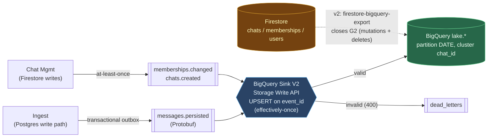

# ADR-022: Analytics Data Lake — Event Wire Format, BigQuery Sink, and History Coverage

- **Status**: Accepted
- **Date**: 2026-07-24
- **Depends on**: [ADR-021](ADR-021.md) (GCP substrate; this ADR discharges its Acceptance Conditions §1 and §2)
- **Amends**: [ADR-011](ADR-011.md) (event wire format: JSON → Protobuf; compatibility policy unchanged — FULL), [ADR-003](ADR-003.md) (adds BigQuery as an analytical consumer; scopes the history invariant), [ADR-007](ADR-007.md) (adds the `outbox` table to the two-store schema)

---

## Context and Problem Statement

ADR-021 brought the analytics data lake into scope, chose a Kafka → BigQuery Sink tap, and deferred the detailed design to this ADR — while making three of its consequences **binding conditions on first infrastructure apply**:

1. **The event wire format must be decided _before_ the Managed Kafka cluster is provisioned** (ADR-021 Acceptance Conditions §1). ADR-011 currently specifies JSON envelopes. Once topics produce bytes and BigQuery consumes them, the envelope is a published analytical contract; changing the format afterward is a breaking topic migration, not a greenfield choice.
2. **The narrowed "complete history" claim must have its coverage gaps enumerated** (ADR-021 Acceptance Conditions §2 / Data Lake §2), because the polyglot substrate spreads history across three partial stores and Firestore has no changelog.
3. **The PII surface of streaming events into an analytical store must be decided at design time** (ADR-021 Data Lake §3), because it constrains what the sink connector is allowed to project.

A fourth force is created by ADR-021's polyglot split: **event production is no longer single-sourced.** Message events originate from the Postgres write path (Ingest); entity events (chats, memberships) originate from Firestore writes (Chat Management). The reliability mechanism that guarantees "Kafka reflects, never contradicts" (ADR-003) must be re-established on each substrate.

**Core question:** What wire format, ingestion mechanism, table design, privacy scope, and history-coverage contract define an analytics data lake that is buildable now, honest about what it captures, and does not foreclose the questions the lab exists to ask (traffic, amplification, membership-over-time, activity patterns)?

---

## Decision Drivers

1. **Unblock provisioning.** The wire-format decision is a hard predecessor to creating the Kafka cluster; it must be made here and be final.
2. **One schema language.** The repo is already Protobuf-native (`buf`, `proto/messaging/v1/*.proto`, gRPC per ADR-014). A second schema system (Avro) would be a foreign body with its own toolchain and generated types.
3. **Honesty over completeness.** A lake that claims complete history it does not have is worse than one that states its coverage precisely. Gaps are enumerated, not hidden.
4. **Minimise the privacy surface.** Stream the least data that answers the analytical questions. Message *content* is not one of those questions for v1.
5. **Exactly-once, or explicitly not.** Duplicate analytical rows corrupt counts; the ingestion path should be exactly-once where the platform offers it, and its failure mode (DLQ) explicit.
6. **Teaching-grade, deploy-and-destroy.** Managed connector over bespoke pipeline; the lake must stand up and tear down with the rest of the Terraform (ADR-021).

---

## Decisions

### D1 — Event wire format: Protobuf via the Managed Kafka Schema Registry (the blocking decision)

**Decision:** Kafka event envelopes are **Protobuf**, registered in **GCP Managed Service for Apache Kafka's managed Schema Registry**. This supersedes ADR-011's JSON *encoding* while **preserving ADR-011 §5.1's FULL (forward + backward) compatibility policy unchanged** — this ADR changes the wire format, not the evolution rules. FULL is cheap under Protobuf: proto3 *retains* unknown fields on deserialization (since 3.5), so a consumer on an older schema round-trips an event carrying a newer optional field without dropping it, giving forward compatibility for additive changes for free. Breaking changes under FULL remain what they always were — removing/renumbering a field, changing a field's type, or repurposing a tag — and stay CI-enforced by `buf breaking` on the `proto/events/v1` module.

Why Protobuf and not Avro or JSON:

- **The project is already Protobuf.** Services define contracts in `proto/messaging/v1/*.proto`, generate Go types with `buf`, and talk gRPC. Event schemas live in the *same* `buf` module, reuse the *same* generated types, and are checked by the *same* `buf breaking` lint in CI. Avro would duplicate all of that; JSON-schemaless would give the BigQuery sink no schema to map.
- **The BigQuery Sink V2 connector consumes Protobuf** (alongside Avro and JSON Schema) from a Schema Registry, using the Storage Write API. Managed Kafka provides the registry natively (`https://managedkafka.googleapis.com/v1/projects/PROJECT/locations/REGION/schemaRegistries/NAME`), authenticated with `value.converter.bearer.auth.credentials.source = GCP` — no self-hosted registry to run.

The events get a dedicated proto package so the wire contract is versioned independently of the gRPC service contracts:

```proto
// proto/events/v1/events.proto
syntax = "proto3";
package events.v1;
import "google/protobuf/timestamp.proto";

// EnvelopeMeta is a faithful Protobuf translation of ADR-011 §3.3's JSON envelope.
// Every ADR-011 field is preserved except `partition_key`, which is intentionally
// dropped: it was "always chat_id", and each event already carries chat_id.
message EnvelopeMeta {
  string event_id      = 1;   // ULID (matches ADR-011) — sortable; the UPSERT key at the sink (D2)
  string event_type    = 2;   // "MessagePersisted" | ... — discriminator, kept for DLQ triage/parity
  string schema_version = 3;  // replaces ADR-011 event_version; semver of proto/events/v1, e.g. "1.0.0"
  google.protobuf.Timestamp occurred_at = 4;
  string producer_id   = 5;   // producing service INSTANCE identity (ADR-011 fidelity), e.g. "ingest-7d9f"
  string trace_id      = 6;   // distributed-tracing correlation ID — preserved from ADR-011
}

message MessagePersisted {         // topic: messages.persisted  — METADATA ONLY (see D3)
  EnvelopeMeta meta   = 1;
  string chat_id      = 2;         // also the partition key (ADR-011 bucketing)
  uint64 sequence     = 3;
  string sender_id    = 4;
  uint32 content_bytes = 5;        // size, NOT the content
  string content_type = 6;         // "text/plain"
  // NO message body field — deliberately absent, see D3.
}

message MembershipChanged {        // topic: memberships.changed
  EnvelopeMeta meta = 1;
  string chat_id    = 2;
  string user_id    = 3;
  enum Change { CHANGE_UNSPECIFIED = 0; ADDED = 1; REMOVED = 2; ROLE_CHANGED = 3; }
  Change change     = 4;           // 0 = UNSPECIFIED so an omitted field is never silently "ADDED"
}

message ChatCreated {              // topic: chats.created
  EnvelopeMeta meta = 1;
  string chat_id    = 2;
  string creator_id = 3;
}
```

**Transition from JSON.** There is no in-place, dual-format migration: per ADR-021 the environment is **deploy-and-destroy**, so the Managed Kafka cluster is created fresh with Protobuf topics — a full teardown/standup, not a rolling schema swap. The field mapping from ADR-011's JSON envelope is one-to-one: `event_type`/`event_id`/`producer_id`/`trace_id` carry over verbatim, `event_version` → `schema_version`, `partition_key` → the event's `chat_id`, and `payload` → the typed message body. The only existing consumer, the Fanout Worker, is redeployed against the Protobuf schema in the same standup; because there is no persistent cluster, there is no old-format backlog to bridge.

### D2 — Ingestion: the Managed-Kafka BigQuery Sink V2 connector, UPSERT-keyed on `event_id`

**Decision:** The concrete artifact is the **BigQuery Sink V2 connector running on GCP Managed Kafka Connect** (Google's managed connector on the Connect cluster — *not* the Confluent-Cloud-hosted variant), using the **Storage Write API** in **UPSERT mode keyed on `event_id`**, one raw landing table per topic. Invalid records route to the **`dead_letters`** topic ADR-011 already defines, closing the loop with the existing DLQ.

**Delivery semantics, stated honestly (resolving the outbox chain, D4).** The full path is `Postgres txn → outbox → relay → Kafka → sink → BigQuery`. The relay is **at-least-once** (D4), so a retry can publish the same `event_id` to Kafka twice; the Storage Write API is exactly-once **from Kafka to BigQuery**, but that does not dedupe relay duplicates on its own. The dedupe comes from the sink's **UPSERT keyed on `event_id`**: a repeated `event_id` overwrites its own row rather than appending a second. The end-to-end guarantee is therefore **effectively-once** (at-least-once relay + idempotent event-keyed upsert), *not* end-to-end exactly-once. Analytical aggregates are correct because duplicates collapse to one row per `event_id` — the correctness rests on the upsert key, not on a claim the whole pipeline is exactly-once. (Were the managed connector limited to at-least-once streaming, a `QUALIFY ROW_NUMBER() OVER (PARTITION BY event_id …) = 1` view over append-only tables would give the same guarantee; UPSERT is preferred because it dedupes at write time.)

| Kafka topic | BigQuery table | Partition | Cluster | Upsert key |
|---|---|---|---|---|
| `messages.persisted` | `lake.raw_messages_persisted` | `DATE(occurred_at)`, DAY | `chat_id` | `event_id` |
| `memberships.changed` | `lake.raw_memberships_changed` | `DATE(occurred_at)`, DAY | `chat_id` | `event_id` |
| `chats.created` | `lake.raw_chats_created` | `DATE(occurred_at)`, DAY | `chat_id` | `event_id` |

Partition-by-event-date + cluster-by-`chat_id` is the standard event-table layout: date-range queries scan only the relevant partitions, and per-chat analysis prunes within them. Clustering is on `chat_id` alone — the primary analytical dimension; a secondary `sender_id` key would only help queries filtering `chat_id` AND `sender_id`, which is not the primary pattern, so it is omitted. **Caveat (documented, not fixed):** streamed rows land in an unclustered buffer that BigQuery re-clusters asynchronously, so clustering does not benefit queries over the last few minutes of freshly-streamed data.

**Retention (bounds the history claim):** each table has a **partition expiration of 90 days** by default. This is what makes "BigQuery is the complete history since sink activation" a *bounded* claim rather than an unbounded one, and it is the primary right-to-erasure mechanism (D3). The value is set by the privacy policy, not by BigQuery cost — 90 days is the v1 default and is adjustable if a regulatory or product requirement dictates otherwise.

Iceberg/BigLake external tables (the connector supports Iceberg managed tables) are a **future lakehouse option**, explicitly out of scope for v1 — direct Storage-Write-API ingestion is simpler.

### D3 — Privacy: metadata-only for messages (no bodies in the lake)

**Decision:** The lake ingests **message metadata only — never message content.** `MessagePersisted` carries `chat_id`, `sequence`, `sender_id`, `content_bytes`, `content_type`, and timing; the body is a field that **does not exist** in the event proto, so it cannot leak through connector misconfiguration.

Rationale: the analytical questions the lab cares about — traffic volume, retry/amplification, fan-out size, membership over time, activity patterns — are all answerable from metadata. Streaming bodies would (a) create a large content-PII surface in an analytical store, (b) make right-to-erasure a cross-store deletion problem, and (c) buy nothing v1 needs. ADR-013 already scopes message content narrowly (validated `text/plain`, HMAC-signed, encrypted at rest); the lake honours that scope by not copying content out of the operational store at all. Content analytics, if ever required, is a **separate decision with its own privacy controls** (field-level access, shorter retention, tokenisation) — not a default.

**Identifiers are still personal data, and metadata-only does not exempt them.** `sender_id` in `raw_messages_persisted` and `user_id` in `raw_memberships_changed` are direct identifiers of natural persons; excluding the body narrows the surface but does not remove it. The erasure model is two-tier: (1) **bounded retention is the primary mechanism** — the 90-day partition expiration (D2) means lake data self-erases on a fixed horizon, so most erasure obligations are met by simply not keeping identifiers indefinitely; (2) **on-demand erasure** for a specific subject uses a **targeted `DELETE` DML** keyed on the identifier — BigQuery supports row-level DML, and partition expiration alone is *not* sufficient for a mid-retention erasure request, so this path must exist even though it is more expensive than partition drop. If a stronger guarantee is ever required, the sink can pseudonymise identifiers via an SMT (store an HMAC/token in the lake, keep the reverse map in the operational store), reducing erasure to deleting the map entry — noted as the escalation path, not the v1 default.

### D4 — Reliable event production under the polyglot substrate

**Decision:** Preserve ADR-003's "Kafka reflects, never contradicts" invariant per substrate:

- **Message events (from Postgres):** a **transactional outbox**. The Ingest write path already runs one transaction (ADR-021 D-A: counter + message + idempotency); it additionally inserts an `outbox` row *in the same transaction*, so the outbox entry exists **iff** the message committed. This is cleaner than the DynamoDB-Streams path the AWS design implied — Postgres transactionality makes the outbox atomic with the write. The `outbox` table is the addition this ADR makes to the ADR-007 two-store schema.
- **The relay, specified.** The relay is an **in-process poller goroutine inside the Ingest service** — not a separate deployment and not CDC — chosen to keep the deploy-and-destroy footprint minimal. It reads unpublished `outbox` rows **in `(chat_id, sequence)` order**, publishes each to `messages.persisted` (partitioned by `chat_id` per ADR-011, preserving per-chat order), and marks the row published. It is **at-least-once**: a crash after publish but before mark re-publishes on restart. That duplicate is harmless because the sink upserts on `event_id` (D2). **Claiming must be atomic under horizontal scale:** if Ingest runs multiple replicas, two relays could otherwise grab the same `outbox` row, so a row is claimed with an atomic `UPDATE outbox SET published_at = now() WHERE id IN (SELECT id FROM outbox WHERE published_at IS NULL ORDER BY chat_id, sequence FOR UPDATE SKIP LOCKED LIMIT :n) RETURNING *` — `SKIP LOCKED` lets replicas take disjoint rows without blocking, and the marking is atomic with the claim so no row publishes twice. Per-chat *ordering* under multiple replicas requires that one worker owns a given `chat_id` at a time (a Postgres advisory lock on `hash(chat_id)`, or the v1 default of a **single relay replica**, which is the simplest correct choice for the lab). CDC (Datastream/Debezium on the `outbox` table) is a valid alternative that trades a heavier footprint for decoupling; it is noted, not chosen, for v1.
- **Entity events (from Firestore):** Chat Management publishes `chats.created` / `memberships.changed` after the Firestore write. Firestore lacks a cross-collection transactional outbox, so this path is **at-least-once**, deduped downstream by the same `event_id` upsert. This asymmetry — transactional-outbox exactness for messages, at-least-once for entities — is real and is carried into the coverage section.

Both producers are at-least-once at the Kafka boundary; **effectively-once** analytics is restored downstream by D2's `event_id` upsert, never by assuming the producers emit exactly once.

### D5 — History coverage: what the lake does and does not contain

Per ADR-021 Acceptance Conditions §2, the coverage is enumerated explicitly. **v1 covers the three event topics, from sink activation onward, metadata-only.** The gaps:

| # | Gap | Consequence | Closure (scoped) |
|---|---|---|---|
| G1 | **Pre-sink events** | Nothing before the connector was first switched on is in BigQuery. | Accepted permanently for v1; a one-off Postgres → BigQuery backfill is possible if ever needed. |
| G2 | **Firestore entity mutations & deletions** | `chats.created` and `memberships.changed` exist, but there is **no** `chats.updated`, `chats.deleted`, `users.*`, or profile-edit event. "What was chat X's membership on date D?" is **not answerable**. | **v2:** the **Firestore → BigQuery extension** (`firebase/firestore-bigquery-export`) streams a full change history (op type, `document_name`, timestamp) for the `chats`/`memberships`/`users` collections — closing G2 without an application change — *or* emit explicit mutation/deletion events on the Kafka backbone. Chosen direction: the extension (pragmatic, captures deletes for free); revisit if event-native history is later required. |
| G3 | **Kafka byte-retention loss if the sink lags** | ADR-011 caps partitions by bytes (7 days *or* capacity); if the sink is down long enough to breach the byte cap, unconsumed events are deleted before landing. | Monitor sink consumer lag; alert well below the byte-retention horizon. Operational, not architectural. |
| G4 | **Message content** | By design (D3), never in the lake. | Not a gap to close — a deliberate exclusion. |

The defensible invariant, stated for ADR-003's amendment: *"BigQuery is the complete history of the events emitted to Kafka (`messages.persisted`, `memberships.changed`, `chats.created`), metadata-only, from sink activation onward. It is **not** a complete history of entity state; Firestore mutation/deletion history is a v2 addition (G2)."*

---

## Decision Outcome



| Concern | Decision |
|---|---|
| Wire format | **Protobuf** in `proto/events/v1`, Managed Kafka Schema Registry, **FULL compatibility (unchanged from ADR-011 §5.1)** |
| Ingestion | **BigQuery Sink V2** on Managed Kafka Connect, Storage Write API, **UPSERT on `event_id`** → effectively-once; DLQ → `dead_letters` |
| Tables | One raw landing table per topic; partition `DATE(occurred_at)`, cluster `chat_id` |
| Privacy | **Metadata-only** (body absent from proto); identifiers erased via 90-day retention + on-demand DML |
| Event production | Postgres **transactional outbox** + in-process relay (at-least-once); effectively-once via `event_id` upsert |
| Coverage v1 | Three event topics, metadata-only, since sink activation; G1–G4 enumerated |
| Retention | **90-day** per-table partition expiration (bounds the history claim; primary erasure mechanism) |

---

## Consequences

### Positive
- **Provisioning is unblocked:** the wire format is fixed before the cluster exists (ADR-021 §1 discharged).
- **One schema toolchain:** events share `buf`, generated Go types, and `buf breaking` CI with the gRPC contracts.
- **Small blast radius:** no message content in the lake means the analytical store is not a content-PII liability.
- **Effectively-once counts:** the at-least-once relay plus the sink's `event_id` upsert keep analytical aggregates correct without claiming end-to-end exactly-once — the guarantee rests on the upsert key, which is auditable.
- **The Postgres outbox is a genuine upgrade** over the AWS design's implicit DynamoDB-Streams fidelity — events are now atomic with the write.

### Negative
- **Entity history is incomplete in v1 (G2).** Membership-over-time and deletion history require the v2 Firestore-export addition; until then, temporal entity questions are unanswerable.
- **Two event-production reliability models** (transactional outbox vs at-least-once) is asymmetric and must be documented for implementers.
- **A running Kafka Connect worker** is another component in the deploy-and-destroy footprint (cost is bounded by ADR-021's budget guard).

### Neutral
- Iceberg/BigLake remains available as a future lakehouse substrate; v1 uses native BigQuery tables.
- The `dead_letters` topic gains a second producer (the sink), alongside ADR-011's poison-pill path.

---

## References

Verified to primary source (July 2026).

| Source | Function in this document |
|---|---|
| Managed Service for Apache Kafka — Schema Registry & BigQuery Sink connector | Native registry endpoint + `bearer.auth…= GCP`; connector setup (D1, D2). https://docs.cloud.google.com/managed-service-for-apache-kafka/docs/connect-cluster/create-bq-connector · https://docs.cloud.google.com/managed-service-for-apache-kafka/docs/connect-cluster/kafka-connect-schema-registry |
| Write Kafka messages to BigQuery — Managed Kafka Connect | The concrete GCP-managed connector artifact and its deployment on the Connect cluster (D2, OQ-4). https://docs.cloud.google.com/managed-service-for-apache-kafka/docs/connect-cluster/kafka-connect-write-to-bigquery |
| BigQuery Sink V2 connector — delivery modes, Storage Write API | STREAMING/BATCH/**UPSERT/UPSERT_DELETE** modes; at-least-once *or* exactly-once; Protobuf/Avro/JSON_SR; DLQ (D1, D2, CI-1). https://docs.confluent.io/cloud/current/connectors/cc-gcp-bigquery-storage-sink.html |
| Protocol Buffers — proto3 unknown-field retention & enum defaults | proto3 retains unknown fields (FULL-cheap additive evolution, D1); `0`-value enum convention (N2). https://protobuf.dev/programming-guides/proto3/ |
| Stream Firestore to BigQuery (`firebase/firestore-bigquery-export`) | Realtime change history (op, document_name, timestamp) — the G2 closure (D5). https://extensions.dev/extensions/firebase/firestore-bigquery-export |
| Datastream — BigQuery destination (Postgres CDC) | Alternative CDC path (INSERT/UPDATE/DELETE, CHANGE_TYPE) considered for backfill/G1. https://docs.cloud.google.com/datastream/docs/destination-bigquery |
| BigQuery — partitioned & clustered tables | Partition-by-date + cluster-by-key event-table layout; streaming-buffer clustering caveat (D2). https://docs.cloud.google.com/bigquery/docs/partitioned-tables |

**Internal:** [ADR-021](ADR-021.md) (substrate; acceptance conditions discharged) · [ADR-011](ADR-011.md) (topics, partitioning, DLQ — wire format amended here) · [ADR-003](ADR-003.md) (history invariant scoped here) · [ADR-013](ADR-013.md) (content scope honoured by D3) · [ADR-023](ADR-023.md) (two-store schema — the `outbox` table is specified there)

---

## Changelog

| Version | Date | Changes |
|---|---|---|
| v1.0 | 2026-07-24 | **Accepted.** Addressed the second review's non-blocking residual: the in-process relay's outbox claim is now specified as **atomic under horizontal scale** — `UPDATE … WHERE published_at IS NULL … FOR UPDATE SKIP LOCKED … RETURNING *` so concurrent Ingest replicas never double-claim a row, with per-chat ordering preserved by single-owner-per-`chat_id` (advisory lock, or the v1 single-relay default). Status flipped Proposed → Accepted after two review rounds (Approve). Discharges ADR-021 Acceptance Conditions §1 (wire format) and §2 (coverage gaps); the Managed Kafka cluster may now be provisioned. The `outbox` table is carried into the ADR-007 two-store amendment. |
| v0.2 | 2026-07-24 | **Review response (Approve-with-Conditions — all three critical issues + four open questions + four nitpicks addressed).** **CI-1:** stopped claiming end-to-end exactly-once; the relay is at-least-once and correctness comes from the sink's **UPSERT keyed on `event_id`** (effectively-once). **CI-2:** aligned to ADR-011 §5.1's **FULL** compatibility (not BACKWARD), justified by proto3 unknown-field retention; wire format amended, evolution policy unchanged. **CI-3:** restored full envelope fidelity to ADR-011 — `event_id` as ULID, `event_type`, `trace_id`, instance-level `producer_id` all preserved; `partition_key` dropped (= `chat_id`); added the JSON→Protobuf field map and stated the transition is a full teardown/standup (ephemeral, no dual-format). **OQ-1:** retention set to **90 days**. **OQ-2:** identifier erasure specified (bounded retention primary + on-demand DML; pseudonymisation as escalation). **OQ-3:** relay specified as an **in-process poller in Ingest**, `(chat_id, sequence)`-ordered, at-least-once. **OQ-4:** named the artifact — GCP-managed **BigQuery Sink V2 on Managed Kafka Connect**. **N1:** `schema_version` format = semver. **N2:** enum `CHANGE_UNSPECIFIED = 0`. **N3:** clustering reduced to `chat_id` only. **N4:** added **ADR-007** to the header `Amends` (the `outbox` table). **Status: Proposed.** |
| v0.1 | 2026-07-24 | Initial draft. Discharges ADR-021 Acceptance Conditions §1 (wire format) and §2 (coverage gaps). D1: **Protobuf** events via Managed Kafka Schema Registry (supersedes ADR-011 JSON), reusing the repo's `buf` toolchain; BACKWARD compatibility. D2: **BigQuery Sink V2** (Storage Write API, exactly-once, DLQ), one landing table per topic, partition-by-date/cluster-by-`chat_id`. D3: **metadata-only** — message body absent from the event proto (honours ADR-013). D4: Postgres **transactional outbox** for message events; at-least-once + idempotent sink for entity events. D5: coverage gaps G1–G4 enumerated; G2 (Firestore mutation/deletion history) scoped to v2 via the Firestore→BigQuery extension; the narrowed history invariant stated for ADR-003. **Status: Proposed** — this discharges the blocking predecessor for provisioning the Managed Kafka cluster; the `outbox` table is a required addition to the ADR-007 two-store schema amendment. |
