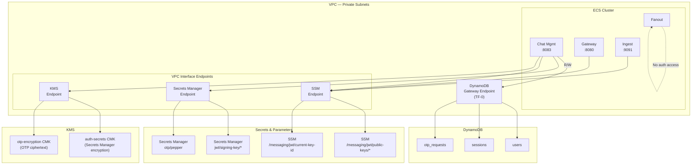

# TF-1 TBD Decisions: Auth Infrastructure

- **Status**: Draft
- **Date**: 2026-02-09
- **Related ADRs**: ADR-015 (Authentication & OTP), ADR-007 §2.4/§2.8 (Users & Sessions tables), ADR-014 §7 (Secrets & Configuration Management), ADR-013 (Security & Abuse Controls)
- **Execution Plan Reference**: TF-1 Auth Infrastructure

---

## Purpose

This document resolves the infrastructure decisions for TF-1, the authentication infrastructure for the Realtime Messaging Platform. These decisions provision the DynamoDB tables, secrets management, KMS keys, SSM parameters, VPC Interface Endpoints, and IAM roles required by the authentication subsystem defined in ADR-015.

TF-1 builds on the TF-0 foundation (VPC, subnets, security groups, ECS cluster) and must align with PR-1 (Auth implementation in Go). All auth-related infrastructure is provisioned here so that PR-1 code has the backing resources it needs.

> **Normative Policy Layer**: This document defines **mandatory auth infrastructure conventions**. All Terraform code for auth resources must conform to these specifications. Deviations require an ADR or explicit justification in the PR description with reviewer approval.

### Auth Infrastructure Overview



---

## TBD-TF1-1: Module Decomposition

### Problem Statement

TF-1 provisions ~35–40 resources spanning DynamoDB tables, KMS keys, Secrets Manager secrets, SSM parameters, VPC Interface Endpoints, and IAM roles. These must be organized into modules following the TF-0 pattern of clear boundaries and explicit interfaces (TBD-TF0-3).

### Decision

| Module | Owns | Est. Resources | Dependencies |
|--------|------|---------------|--------------|
| `networking` (extended) | VPC Interface Endpoints (Secrets Manager, SSM, KMS) + endpoint security group + service SG egress rules | ~8 | Existing networking module |
| `auth` (new) | DynamoDB tables (users, sessions, otp_requests), KMS keys, Secrets Manager secrets, SSM parameters, IAM task roles + policies | ~30 | `networking` (VPC ID, subnet IDs, endpoint SG ID, service SG IDs) |

### Rationale

- **Two-module approach** keeps auth resources in a single cohesive module while placing VPC endpoints in the networking module, consistent with TF-0's pattern where Gateway Endpoints (S3, DynamoDB) live in networking.
- **Extending networking** for Interface Endpoints is consistent with TF-0's design: the networking module owns all VPC endpoints and security group rules. Future TF-2 services (MSK, ElastiCache) may also need Interface Endpoints — the networking module is the natural home.
- **Single `auth` module** rather than splitting into `dynamodb-auth`, `auth-secrets`, and `auth-iam` because these resources form a tight logical unit: IAM policies reference DynamoDB table ARNs, KMS key ARNs, and Secrets Manager secret ARNs. Splitting would require extensive cross-module output passing with no meaningful boundary benefit.
- **~38 total resources** stays well under the 100-resource-per-state-file guideline from TERRAFORM.md.

### Normative Rules

> **Rule: Auth Module Owns Auth Resources**
>
> All auth-related DynamoDB tables, KMS keys, Secrets Manager secrets, SSM parameters, and IAM roles must be defined in the `auth` module. No other module may create resources in these namespaces. This ensures a single source of truth for auth infrastructure.

> **Rule: Networking Module Owns VPC Endpoints**
>
> All VPC endpoints (Gateway and Interface) and their associated security groups must be defined in the networking module. The auth module receives endpoint security group IDs as input variables.

---

## TBD-TF1-2: DynamoDB Auth Tables

### Problem Statement

ADR-007 defines the `users` and `sessions` tables (§2.4, §2.8). ADR-015 adds the `otp_requests` table (Appendix A). These three tables need consistent Terraform configuration for capacity mode, encryption, TTL, PITR, deletion protection, and GSIs — respecting the decisions already made in the ADRs.

### Decision

#### Table Specifications

| Setting | `users` | `sessions` | `otp_requests` |
|---------|---------|-----------|---------------|
| Partition key | `user_id` (S) | `session_id` (S) | `phone_hash` (S) |
| Sort key | None | None | None |
| Capacity mode | On-Demand | On-Demand | On-Demand |
| TTL attribute | None | `ttl` | `ttl` |
| Deletion protection | Dev: off, Prod: on | Dev: off, Prod: on | Dev: off, Prod: on |
| PITR | Enabled | Enabled | Enabled |
| Encryption | AWS-managed SSE | AWS-managed SSE | AWS-managed SSE |
| Table class | `STANDARD` | `STANDARD` | `STANDARD` |

#### GSI Specifications

| Table | GSI Name | Partition Key | Sort Key | Projection | Purpose |
|-------|----------|--------------|----------|------------|---------|
| `users` | `phone_number-index` | `phone_number` (S) | None | `KEYS_ONLY` | Phone-based login lookup (ADR-007 §2.4) |
| `sessions` | `user_sessions-index` | `user_id` (S) | None | `ALL` | List/manage user sessions (ADR-007 §2.8) |
| `otp_requests` | None | — | — | — | Single access pattern: `GetItem(phone_hash)` |

#### Table Naming Convention

Following TF-0 cloud resource naming (`{project}-{environment}-{component}`):

```
messaging-dev-users
messaging-dev-sessions
messaging-dev-otp-requests
messaging-prod-users
messaging-prod-sessions
messaging-prod-otp-requests
```

### Rationale

- **On-Demand for all three tables**: ADR-007 §7.1 recommends Provisioned for `users` and `sessions` at steady-state, but for initial deployment (lab project, no traffic baseline), On-Demand eliminates the risk of under-provisioning and requires zero capacity management. ADR-007's Provisioned recommendation is based on "predictable" traffic patterns that don't exist yet. Switching to Provisioned later is a non-destructive, zero-downtime operation via `aws dynamodb update-table`. ADR-015 specifies On-Demand for `otp_requests` explicitly.
- **AWS-managed SSE (not CMK)**: DynamoDB encrypts all data at rest by default using AWS-owned keys at no cost. A customer-managed KMS key (CMK) would add ~$1/month per table but provides no practical benefit here: DynamoDB encryption is transparent, automatic, and the tables don't cross account boundaries. CMK is only valuable when you need cross-account access control or independent key rotation auditability. Per ADR-015 Appendix A: "Encryption: AWS-managed KMS (default)."
- **PITR on all tables**: ADR-007 §9 specifies PITR for `users` and `sessions`. ADR-015 Appendix A specifies PITR for `otp_requests` (operational recovery). PITR costs ~$0.20/GB/month — negligible at MVP scale.
- **`STANDARD` table class**: `STANDARD_INFREQUENT_ACCESS` offers 60% lower storage cost but 25% higher read/write cost. At MVP scale (< 1 GB total), storage costs are negligible, so the standard class with lower per-request cost is optimal.
- **`phone_number-index` uses `KEYS_ONLY`**: ADR-007 §2.4 specifies sparse projection of only `user_id`. This minimizes GSI storage and write amplification. The subsequent `GetItem` by `user_id` fetches the full profile when needed.
- **`user_sessions-index` uses `ALL`**: ADR-007 §2.8 specifies ALL projection because session management needs all attributes (device_id, expires_at, created_at) without a second round-trip.
- **Deletion protection off in dev**: Allows `terraform destroy` during development. Production enables deletion protection to prevent accidental table deletion — table must be manually unprotected before destruction.

### Normative Rules

> **Rule: On-Demand Until Baseline Established**
>
> All auth DynamoDB tables must use On-Demand capacity until traffic patterns are established and a cost-benefit analysis justifies switching to Provisioned. Capacity mode changes must be documented in a PR description with the traffic analysis.

> **Rule: TTL Attributes Are Mandatory for Ephemeral Data**
>
> Tables storing time-bounded data (`sessions`, `otp_requests`) must have a TTL attribute enabled. DynamoDB TTL is the primary garbage collection mechanism — application code must not implement manual cleanup for TTL-eligible records.

> **Rule: PITR Enabled on All Tables**
>
> Point-in-time recovery must be enabled on all auth DynamoDB tables, including ephemeral tables like `otp_requests`. PITR enables recovery from application bugs that corrupt data, which TTL alone cannot prevent.

---

## TBD-TF1-3: KMS Key Architecture

### Problem Statement

ADR-015 requires two distinct KMS use cases: (1) encrypting Secrets Manager secrets (JWT signing key, OTP pepper) and (2) encrypting OTP ciphertexts via direct `KMS.Encrypt`/`KMS.Decrypt` calls. These have different access patterns, rotation requirements, and key policies. The architecture must decide: one key or two?

### Decision

Two KMS customer-managed symmetric keys:

| Key | Alias | Purpose | Used By | Rotation |
|-----|-------|---------|---------|----------|
| Auth Secrets CMK | `alias/{project}-{env}-auth-secrets` | Encrypts Secrets Manager secrets (JWT signing key, OTP pepper) | Secrets Manager service, Chat Mgmt (indirect) | AWS automatic (annually) |
| OTP Encryption CMK | `alias/{project}-{env}-otp-encryption` | Direct `KMS.Encrypt`/`KMS.Decrypt` for OTP ciphertexts (ADR-015 §1.1) | Chat Mgmt task role (direct API calls) | AWS automatic (annually) |

#### Key Policies

**Auth Secrets CMK** — allows Secrets Manager to use the key for encryption/decryption, and the root account for key management:

```
Key Policy Principals:
  - Root account: kms:* (key administration)
  - aws:secretsmanager service: kms:Encrypt, kms:Decrypt, kms:ReEncrypt*,
    kms:GenerateDataKey*, kms:DescribeKey
    Condition: kms:ViaService = secretsmanager.{region}.amazonaws.com
  - Chat Mgmt task role: kms:Decrypt, kms:DescribeKey
    (For Secrets Manager SDK GetSecretValue — Secrets Manager passes
     the decrypted value, but the task role still needs decrypt permission
     on the CMK when using the SDK directly)
```

**OTP Encryption CMK** — allows only Chat Mgmt to encrypt/decrypt OTP ciphertexts:

```
Key Policy Principals:
  - Root account: kms:* (key administration)
  - Chat Mgmt task role: kms:Encrypt, kms:Decrypt, kms:DescribeKey
    Condition: kms:EncryptionContext:purpose = "otp-ciphertext"
```

### Rationale

- **Two keys, not one**: Separate keys provide independent audit trails in CloudTrail — Secrets Manager decryption events are distinct from OTP encryption events. Key policies enforce different principal sets: the auth-secrets CMK grants access to the Secrets Manager service principal, while the OTP encryption CMK is scoped exclusively to the Chat Mgmt task role. A single key would require a union of both policy sets, weakening least-privilege.
- **AWS automatic rotation (annually)**: KMS symmetric keys support automatic rotation, which creates new key material annually while retaining old material for decryption. This is transparent — no application code changes required. The 90-day rotation in ADR-013 applies to JWT *signing keys* (application-level), not KMS keys (infrastructure-level).
- **Encryption context for OTP key**: The `kms:EncryptionContext` condition binds OTP encryption operations to a declared purpose, preventing the key from being repurposed for arbitrary encryption. The Chat Mgmt service must include `{"purpose": "otp-ciphertext"}` in every `KMS.Encrypt`/`KMS.Decrypt` call. This is a defense-in-depth measure.
- **Not using KMS asymmetric keys for JWT**: ADR-015 §3.2 specifies RSA-2048 key pairs stored as PEM in Secrets Manager (private) and SSM (public). KMS asymmetric keys are a different mechanism — they don't export private key material, which conflicts with the `jwt-go` library's need to hold the private key in memory for signing. The JWT signing key is a Secrets Manager secret, not a KMS key.

### Normative Rules

> **Rule: Separate KMS Keys by Function**
>
> Auth infrastructure must use dedicated KMS keys per function (Secrets Manager encryption vs. OTP encryption). No KMS key may serve multiple unrelated purposes. This ensures independent audit trails and least-privilege key policies.

> **Rule: Encryption Context Required for OTP Operations**
>
> All direct `KMS.Encrypt` and `KMS.Decrypt` calls for OTP ciphertexts must include the encryption context `{"purpose": "otp-ciphertext"}`. The KMS key policy enforces this condition. Calls without the context are denied.

---

## TBD-TF1-4: Secrets Manager Configuration

### Problem Statement

ADR-015 §7.1 specifies JWT signing keys stored in Secrets Manager at `jwt/signing-key/{KEY_ID}` and the OTP pepper at `otp/pepper`. ADR-014 §7.1 confirms Secrets Manager for "sensitive credentials that must be rotated." Terraform must create the secret containers, but secret values are managed by an operational script (ADR-015 §7.1 `generate-jwt-keys.sh`).

### Decision

#### Terraform-Managed Secrets

| Secret Name | Description | Encryption | Recovery Window |
|-------------|-------------|------------|-----------------|
| `{project}-{env}/otp/pepper` | OTP HMAC pepper (ADR-015 §1.1) | Auth Secrets CMK | Dev: 0 days, Prod: 30 days |

#### Script-Managed Secrets (NOT in Terraform)

| Secret Name Pattern | Description | Manager |
|-------------------|-------------|---------|
| `jwt/signing-key/{KEY_ID}` | RSA private key PEM per rotation (ADR-015 §7.1) | `scripts/generate-jwt-keys.sh` |

#### Configuration Details

**OTP Pepper Secret**:
- Terraform creates the secret with a placeholder value (`"PLACEHOLDER_REPLACE_VIA_CLI"`)
- Lifecycle: `ignore_changes = [secret_string]` — Terraform manages the container, not the value
- The operational script updates the value via `aws secretsmanager put-secret-value`
- At most one pepper is active for validation at any time; rotation uses a staged secret (`otp/pepper/next`) and controlled cutover after draining active OTPs (5-minute window per ADR-015 §1.1)

**JWT Signing Keys**:
- NOT managed by Terraform — created dynamically by `scripts/generate-jwt-keys.sh` with unique `{KEY_ID}` per rotation
- Terraform provides the IAM permissions (wildcard on `jwt/signing-key/*`) and KMS key
- The operational script handles the full lifecycle: create, rotate, delete old keys

### Rationale

- **Terraform manages OTP pepper container**: The OTP pepper is a single, well-known secret path. Terraform can create the container and IAM policies referencing its ARN. The `ignore_changes` lifecycle prevents Terraform from overwriting the actual pepper value on subsequent applies.
- **Terraform does NOT manage JWT signing keys**: JWT signing keys are dynamically named (`jwt/signing-key/{KEY_ID}`) and created during key rotation events. Terraform's declarative model doesn't fit dynamic resource creation. IAM policies use a wildcard path (`jwt/signing-key/*`) to grant access regardless of KEY_ID.
- **Recovery window 0 in dev**: Allows immediate secret deletion during development (no 7–30 day waiting period). Production uses 30 days for accidental deletion recovery.
- **Recovery window 30 in prod (not 7)**: AWS default is 30 days. Shorter recovery windows reduce the safety net for accidental deletion. For a production signing key pepper, 30 days provides ample time to detect and recover from accidental deletion.

### Normative Rules

> **Rule: Secret Values Are Never in Terraform**
>
> Terraform creates secret containers with placeholder values. Actual secret values (keys, peppers) are provisioned via operational scripts or CLI. `ignore_changes = [secret_string]` must be set on all Secrets Manager secrets to prevent Terraform from overwriting values.

> **Rule: Wildcard IAM for Dynamic Secrets**
>
> IAM policies for JWT signing keys must use the wildcard path `jwt/signing-key/*` (or the full ARN pattern `arn:aws:secretsmanager:{region}:{account}:secret:jwt/signing-key/*`). Policies must not reference specific KEY_IDs, as these change during rotation.

---

## TBD-TF1-5: SSM Parameter Store Configuration

### Problem Statement

ADR-015 §3.2 specifies SSM Parameter Store for JWT public keys and key metadata. The parameter hierarchy, types, and Terraform management model must be defined.

### Decision

#### Parameter Hierarchy

```
/messaging/jwt/
  current-key-id          → STRING: Active signing key ID
  cache-ttl-seconds       → STRING: Key cache refresh interval (default "300")
  public-keys/
    {KEY_ID_A}            → STRING: PEM-encoded RSA public key
    {KEY_ID_B}            → STRING: PEM-encoded RSA public key (during rotation)
```

#### Terraform-Managed Parameters

| Parameter | Type | Value | Managed By |
|-----------|------|-------|------------|
| `/messaging/jwt/cache-ttl-seconds` | `String` | `"300"` | Terraform (fully managed) |

#### Script-Managed Parameters (NOT in Terraform)

| Parameter Pattern | Type | Managed By |
|------------------|------|------------|
| `/messaging/jwt/current-key-id` | `String` | `scripts/generate-jwt-keys.sh` |
| `/messaging/jwt/public-keys/{KEY_ID}` | `String` | `scripts/generate-jwt-keys.sh` |

### Rationale

- **`String` type (not `SecureString`)**: Public keys are non-sensitive by definition. `SecureString` parameters require KMS decryption on every read, adding latency and cost. SSM `String` parameters are free for standard throughput and simpler to access. Per ADR-015 §3.2: "SSM for public key (non-sensitive, simpler access pattern)."
- **Terraform manages only `cache-ttl-seconds`**: This is a static configuration value with a known default. Terraform owns it completely. Note that this value bounds the maximum time a revoked or rotated signing key may still be accepted by downstream services — it is a correctness knob, not just a performance tuning parameter.
- **Script manages `current-key-id` and `public-keys/*`**: These change during key rotation events. `current-key-id` is updated when a new signing key is activated. Public key parameters are created/deleted per KEY_ID during rotation. Terraform's declarative model doesn't fit this dynamic lifecycle.
- **`/messaging/` prefix**: Namespaces all platform parameters under a common prefix, avoiding collisions with other applications in the same AWS account. Services use `GetParametersByPath` with prefix `/messaging/jwt/public-keys/` to discover all public keys (ADR-015 §3.2).

### Normative Rules

> **Rule: No SecureString for Public Keys**
>
> JWT public key SSM parameters must use `String` type, not `SecureString`. Public keys are non-sensitive data. `SecureString` would add unnecessary KMS dependency and cost to the high-frequency key validation path.

> **Rule: Parameter Hierarchy Is Fixed**
>
> All JWT-related SSM parameters must follow the `/messaging/jwt/` hierarchy defined above. Service code references these paths at startup. Changing the hierarchy requires updating all service configurations simultaneously.

---

## TBD-TF1-6: VPC Interface Endpoints

### Problem Statement

TBD-TF0-4 normative rule states: "If a new AWS service requires egress (e.g., Secrets Manager in TF-1), it must go through a VPC Interface Endpoint with a corresponding security group, not a CIDR-based rule." Chat Mgmt needs Secrets Manager, SSM, and KMS access. Gateway and Ingest need SSM access. These services run in private subnets.

### Decision

#### Interface Endpoints

| Endpoint | Service Name | Used By | Purpose |
|----------|-------------|---------|---------|
| Secrets Manager | `com.amazonaws.{region}.secretsmanager` | Chat Mgmt | Fetch JWT signing key, OTP pepper |
| SSM | `com.amazonaws.{region}.ssm` | Chat Mgmt, Gateway, Ingest | Fetch JWT public keys, key metadata |
| KMS | `com.amazonaws.{region}.kms` | Chat Mgmt | OTP ciphertext encryption/decryption |

#### Endpoint Configuration

| Setting | Value | Rationale |
|---------|-------|-----------|
| Endpoint type | Interface | Required for these services (no Gateway Endpoint option) |
| Subnet placement | All private subnets (2 AZs) | AZ-local access for ECS tasks |
| Private DNS | Enabled | Services use standard AWS SDK endpoints without custom config |
| Security group | `sg-vpc-endpoints` (new, shared) | Single SG for all auth-related Interface Endpoints |

#### Security Group: `sg-vpc-endpoints`

| Direction | Rule | Source/Destination |
|-----------|------|--------------------|
| Inbound | HTTPS (443) from `sg-chatmgmt` | Chat Mgmt → all 3 endpoints |
| Inbound | HTTPS (443) from `sg-gateway` | Gateway → SSM endpoint |
| Inbound | HTTPS (443) from `sg-ingest` | Ingest → SSM endpoint |
| Outbound | None (Interface Endpoints are inbound-only targets) | — |

#### Service SG Egress Rules (added to existing SGs)

| Security Group | New Egress Rule | Destination |
|---------------|-----------------|-------------|
| `sg-chatmgmt` | HTTPS (443) | `sg-vpc-endpoints` |
| `sg-gateway` | HTTPS (443) | `sg-vpc-endpoints` |
| `sg-ingest` | HTTPS (443) | `sg-vpc-endpoints` |

### Rationale

- **Three endpoints, not four**: STS is NOT required as a VPC Interface Endpoint because ECS Fargate provides task role credentials via the task metadata endpoint (169.254.170.2), which doesn't traverse the VPC network. No STS calls leave the task.
- **Shared security group**: A single `sg-vpc-endpoints` SG for all three Interface Endpoints simplifies management. All three endpoints accept HTTPS on port 443 from the same set of service SGs. Future endpoints (TF-2) can reuse this SG.
- **Private DNS enabled**: AWS SDK clients automatically resolve `secretsmanager.{region}.amazonaws.com` to the VPC endpoint's private IP. No application code changes required. This is the standard configuration for Interface Endpoints.
- **Cost**: 3 endpoints × 2 AZs × $0.01/hr = ~$43.80/month. This is the cost of complying with TBD-TF0-4's normative rule. For dev, this cost is accepted as the price of security parity with production. Traffic through the endpoints is minimal (key loading at startup, periodic SSM refreshes) so data processing charges are negligible.
- **Service SG egress to single endpoint SG**: Rather than creating separate egress rules per endpoint, each service SG gets a single `443 → sg-vpc-endpoints` rule. This works because all three endpoints share the SG. The IAM policies (not SGs) enforce which service can access which specific AWS API — SGs only control network reachability.

### Normative Rules

> **Rule: Interface Endpoints for AWS API Access**
>
> All ECS task access to AWS APIs (Secrets Manager, SSM, KMS) must go through VPC Interface Endpoints. Direct internet-routed access via NAT Gateway is prohibited for these services. This ensures AWS API traffic stays within the VPC.

> **Rule: Shared Endpoint Security Group**
>
> All VPC Interface Endpoints for AWS APIs must use the shared `sg-vpc-endpoints` security group. Service-level access control is enforced by IAM policies, not by security group granularity per endpoint.

---

## TBD-TF1-7: IAM Role Architecture

### Problem Statement

ADR-015 §3.2 defines per-service key access requirements. ADR-014 §7 specifies Secrets Manager and SSM as the configuration stores. The EXECUTION_PLAN scopes TF-1 to "IAM roles (Chat Mgmt task role with Secrets Manager + DynamoDB + Redis access)" but Gateway and Ingest also need SSM access for JWT validation starting with PR-1.

### Decision

TF-1 creates all four ECS task roles and one shared execution role. The EXECUTION_PLAN specifies only the Chat Mgmt task role, but creating all four in TF-1 is necessary because Gateway and Ingest need SSM permissions for JWT public key loading, which is deployed with PR-1.

#### Execution Role (shared)

| Permission | Resource | Purpose |
|------------|----------|---------|
| `ecr:GetAuthorizationToken` | `*` | ECR login |
| `ecr:BatchGetImage`, `ecr:GetDownloadUrlForLayer` | ECR repo ARNs | Pull images |
| `logs:CreateLogStream`, `logs:PutLogEvents` | Log group ARN | CloudWatch Logs |

#### Task Roles

**Chat Mgmt Task Role** — full auth permissions:

| Permission | Resource | Purpose |
|------------|----------|---------|
| `dynamodb:GetItem`, `PutItem`, `UpdateItem`, `DeleteItem`, `Query` | `users`, `sessions`, `otp_requests` table ARNs + index ARNs | Auth data operations |
| `secretsmanager:GetSecretValue` | `arn:...:secret:{project}-{env}/otp/pepper-*` | OTP pepper loading |
| `secretsmanager:GetSecretValue` | `arn:...:secret:jwt/signing-key/*` | JWT private key loading |
| `kms:Encrypt`, `kms:Decrypt`, `kms:DescribeKey` | OTP Encryption CMK ARN | OTP ciphertext operations |
| `kms:Decrypt`, `kms:DescribeKey` | Auth Secrets CMK ARN | Secrets Manager decryption |
| `ssm:GetParameter`, `ssm:GetParametersByPath` | `/messaging/jwt/*` | JWT key metadata + public keys |

**Gateway Task Role** — JWT validation only:

| Permission | Resource | Purpose |
|------------|----------|---------|
| `ssm:GetParameter`, `ssm:GetParametersByPath` | `/messaging/jwt/*` | JWT public key loading |

Gateway does not need KMS access: it only consumes JWT public keys via SSM, never decrypts secrets or performs cryptographic operations.

**Ingest Task Role** — JWT validation only:

| Permission | Resource | Purpose |
|------------|----------|---------|
| `ssm:GetParameter`, `ssm:GetParametersByPath` | `/messaging/jwt/*` | JWT public key loading |

Ingest does not need KMS access for the same reason: it validates JWTs using public keys from SSM, never decrypts secrets or performs cryptographic operations.

**Fanout Task Role** — no auth permissions:

| Permission | Resource | Purpose |
|------------|----------|---------|
| (none for auth) | — | Fanout trusts Kafka events; no direct auth (ADR-015 §3.2) |

Fanout must never have direct access to auth stores (DynamoDB, Secrets Manager, SSM, KMS). Its trust boundary is Kafka, not identity. This enforces the plane separation defined in ADR-002.

#### Trust Policy (all task roles)

```json
{
  "Version": "2012-10-17",
  "Statement": [{
    "Effect": "Allow",
    "Principal": { "Service": "ecs-tasks.amazonaws.com" },
    "Action": "sts:AssumeRole",
    "Condition": {
      "StringEquals": {
        "aws:SourceAccount": "${data.aws_caller_identity.current.account_id}"
      },
      "ArnLike": {
        "aws:SourceArn": "arn:aws:ecs:${region}:${account}:*"
      }
    }
  }]
}
```

### Rationale

- **All four task roles in TF-1**: Gateway and Ingest validate JWTs using public keys from SSM (ADR-015 §3.2). PR-1 implements this validation logic. If task roles were deferred to TF-2, PR-1 services couldn't authenticate requests. Creating all four roles now avoids a circular dependency between TF-1 and PR-1.
- **Confused deputy prevention**: The trust policy includes `aws:SourceAccount` and `aws:SourceArn` conditions to prevent cross-account or cross-service confused deputy attacks. This is an AWS IAM best practice for ECS task roles.
- **Separate roles per service**: ADR-015 §3.2 defines distinct access levels per service. A shared role would violate least-privilege: Fanout would get Secrets Manager access it doesn't need, and Gateway would get DynamoDB write access it shouldn't have.
- **Secrets Manager ARN wildcard suffix**: Secrets Manager appends a random 6-character suffix to secret ARNs. The IAM policy must use `secret:name-*` (with hyphen-star) to match both the secret name and its suffix. Without this suffix, the policy would fail to match the actual secret ARN.
- **DynamoDB index ARNs**: IAM policies for DynamoDB must include both table ARNs and index ARNs (`table/*/index/*`) to allow `Query` operations on GSIs. Omitting index ARNs would block queries on `phone_number-index` and `user_sessions-index`.
- **Redis access via SG, not IAM**: ElastiCache Redis access is controlled by security groups (TBD-TF0-4), not IAM policies. Redis is not listed in the IAM policies above. The `sg-chatmgmt` → `sg-redis` egress rule (TF-0) provides the network access.
- **Shared execution role**: All four services need identical ECR pull + CloudWatch Logs permissions. A single execution role avoids duplication. This role has no auth-specific permissions — it's purely operational.
- **TF-2/TF-3 will add permissions**: The task roles created in TF-1 contain only auth-related permissions. TF-2 adds DynamoDB permissions for messaging tables, MSK permissions, and ElastiCache. TF-3 may add CloudWatch metrics permissions. IAM policies are additive — new inline policies can be attached without modifying existing ones.

### Normative Rules

> **Rule: One Task Role Per Service**
>
> Each ECS service must have a dedicated task role. Shared task roles are prohibited. This enables IAM-level enforcement of the least-privilege access patterns defined in ADR-015 §3.2.

> **Rule: Confused Deputy Prevention**
>
> All ECS task role trust policies must include `aws:SourceAccount` and `aws:SourceArn` conditions. Trust policies without these conditions are prohibited.

> **Rule: Fanout Has No Auth Access**
>
> The Fanout task role must never have permissions to DynamoDB auth tables, Secrets Manager, SSM `/messaging/jwt/*`, or KMS auth keys. Fanout's trust boundary is Kafka, not identity (ADR-002 plane separation). Any PR that adds auth-store access to Fanout requires an ADR amendment.

> **Rule: Additive Policy Composition**
>
> Each Terraform PR (TF-1, TF-2, TF-3) adds permissions to task roles via separate inline policies named by scope (e.g., `auth-policy`, `messaging-policy`). This avoids monolithic policies and enables independent modification per infrastructure layer.

---

## TBD-TF1-8: Secret Value Lifecycle

### Problem Statement

Terraform manages infrastructure (secret containers, KMS keys, IAM roles) but must not manage secret values (private keys, peppers). The boundary between Terraform-managed and operationally-managed resources must be explicit to prevent Terraform from overwriting production secrets on `terraform apply`.

### Decision

#### Management Boundary

| Resource | Terraform Manages | Script Manages |
|----------|-------------------|----------------|
| OTP pepper (Secrets Manager) | Container: name, KMS key, recovery window, tags, IAM | Value: actual pepper bytes |
| JWT signing keys (Secrets Manager) | IAM policies (wildcard), KMS key | Everything: create, rotate, delete secrets |
| SSM `current-key-id` | Nothing | Everything: create, update during rotation |
| SSM `public-keys/{KEY_ID}` | Nothing | Everything: create, delete during rotation |
| SSM `cache-ttl-seconds` | Everything: create, value, type | Nothing |
| DynamoDB tables | Everything: schema, capacity, GSIs, TTL | Nothing |
| KMS keys | Everything: key, alias, policy, rotation | Nothing |
| IAM roles + policies | Everything | Nothing |

#### Lifecycle Rules

```hcl
# Secrets Manager — Terraform owns container, script owns value
resource "aws_secretsmanager_secret_version" "otp_pepper" {
  # ...
  lifecycle {
    ignore_changes = [secret_string]
  }
}

# DynamoDB — prevent accidental table deletion in production
resource "aws_dynamodb_table" "users" {
  # ...
  deletion_protection_enabled = var.enable_deletion_protection
}
```

#### Operational Script Requirements

The `scripts/generate-jwt-keys.sh` script (ADR-015 §7.1) must:

1. Generate RSA-2048 key pair
2. Create Secrets Manager secret at `jwt/signing-key/{KEY_ID}` encrypted with Auth Secrets CMK
3. Create SSM parameter at `/messaging/jwt/public-keys/{KEY_ID}` with public key PEM
4. Update SSM parameter `/messaging/jwt/current-key-id` with new KEY_ID
5. Be idempotent (safe to re-run)
6. Clean up local key material after upload (`shred -u`)

### Rationale

- **`ignore_changes` on secret values**: Without this, `terraform apply` would detect drift (the operational script changed the value) and attempt to revert to the placeholder. This is the standard Terraform pattern for externally-managed values.
- **Terraform creates OTP pepper container but not JWT key containers**: The OTP pepper has a stable, well-known path — Terraform can reference its ARN in IAM policies. JWT signing keys have dynamic paths (`jwt/signing-key/{KEY_ID}`) that Terraform cannot predict. IAM policies use wildcards instead.
- **Clear ownership boundary**: Every resource has exactly one owner (Terraform or script). No resource is partially managed by both (except the OTP pepper container, which has an explicit `ignore_changes` boundary). This eliminates "who changed this?" ambiguity.
- **DynamoDB deletion protection is environment-gated**: Using a variable (`var.enable_deletion_protection`) allows dev environments to be freely destroyed while protecting production data. This matches TF-0's ALB pattern (`enable_deletion_protection = false` in dev, `true` in prod).

### Normative Rules

> **Rule: Single Owner Per Resource**
>
> Every infrastructure resource and configuration value must have exactly one owner: either Terraform or the operational script. When Terraform creates a container whose value is externally managed, `ignore_changes` must be set on the value attribute. No exceptions.

> **Rule: Placeholder Values Are Never Secrets**
>
> Terraform placeholder values for secrets (used in initial creation before the script populates real values) must be obvious non-secrets like `"PLACEHOLDER_REPLACE_VIA_CLI"`. Placeholders must never resemble real credentials.

> **Rule: Script-Managed Secrets Use Terraform-Managed KMS**
>
> The operational script must encrypt JWT signing keys and OTP pepper using the Auth Secrets CMK created by Terraform. The script receives the KMS key ARN as a parameter. Using the default `aws/secretsmanager` key is prohibited because it doesn't provide the independent audit trail the CMK was created for.

---

## Summary of Decisions

| TBD | Decision | Key Points |
|-----|----------|------------|
| **TBD-TF1-1** | Two-module: extend networking + new auth module | ~38 resources; networking owns endpoints, auth owns everything else |
| **TBD-TF1-2** | 3 DynamoDB tables: users, sessions, otp_requests | All On-Demand; PITR enabled; AWS-managed SSE; 2 GSIs |
| **TBD-TF1-3** | 2 KMS CMKs: auth-secrets + otp-encryption | Separate audit trails; encryption context for OTP operations |
| **TBD-TF1-4** | Secrets Manager: 1 Terraform secret (otp/pepper), JWT keys script-managed | Recovery window 0 (dev) / 30 (prod); ignore_changes on values |
| **TBD-TF1-5** | SSM: 1 Terraform param (cache-ttl), rest script-managed | String type (not SecureString); /messaging/jwt/ hierarchy |
| **TBD-TF1-6** | 3 VPC Interface Endpoints: Secrets Manager, SSM, KMS | Shared sg-vpc-endpoints SG; private DNS enabled; ~$44/month |
| **TBD-TF1-7** | 4 task roles + 1 execution role | Chat Mgmt: full auth; Gateway/Ingest: SSM-only; Fanout: none |
| **TBD-TF1-8** | Clear Terraform/script ownership boundary | ignore_changes for externally managed values; single owner per resource |

---

## Validation Checklist

### DynamoDB Tables (TBD-TF1-2)
- [ ] `users` table created with `user_id` PK, `phone_number-index` GSI (KEYS_ONLY)
- [ ] `sessions` table created with `session_id` PK, `user_sessions-index` GSI (ALL), TTL on `ttl`
- [ ] `otp_requests` table created with `phone_hash` PK, TTL on `ttl`, no GSI
- [ ] All tables use On-Demand capacity mode
- [ ] PITR enabled on all 3 tables
- [ ] Deletion protection matches environment (off in dev, on in prod)
- [ ] Table names follow `{project}-{env}-{table}` convention

### KMS Keys (TBD-TF1-3)
- [ ] Auth Secrets CMK created with key policy granting Secrets Manager service access
- [ ] OTP Encryption CMK created with key policy scoped to Chat Mgmt task role
- [ ] Both keys have automatic rotation enabled
- [ ] Key aliases follow `alias/{project}-{env}-{purpose}` convention

### Secrets Manager (TBD-TF1-4)
- [ ] OTP pepper secret created with Auth Secrets CMK encryption
- [ ] `ignore_changes = [secret_string]` on secret version
- [ ] Recovery window matches environment (0 in dev, 30 in prod)
- [ ] Placeholder value is obvious non-secret

### SSM Parameters (TBD-TF1-5)
- [ ] `cache-ttl-seconds` parameter created as `String` type with value `"300"`
- [ ] No `SecureString` parameters for public key paths

### VPC Interface Endpoints (TBD-TF1-6)
- [ ] 3 Interface Endpoints created (Secrets Manager, SSM, KMS)
- [ ] All placed in private subnets across 2 AZs
- [ ] Private DNS enabled on all endpoints
- [ ] `sg-vpc-endpoints` security group created with correct ingress rules
- [ ] Service SG egress rules added (sg-chatmgmt, sg-gateway, sg-ingest → sg-vpc-endpoints)

### IAM Roles (TBD-TF1-7)
- [ ] 4 task roles created (chatmgmt, gateway, ingest, fanout)
- [ ] 1 shared execution role created
- [ ] Chat Mgmt task role has DynamoDB, Secrets Manager, KMS, SSM permissions
- [ ] Gateway task role has SSM-only permissions
- [ ] Ingest task role has SSM-only permissions
- [ ] Fanout task role has no auth permissions
- [ ] All trust policies include confused deputy prevention conditions
- [ ] Secrets Manager ARN patterns include `-*` suffix for random characters

---

## References

### AWS Documentation
- [DynamoDB On-Demand Capacity](https://docs.aws.amazon.com/amazondynamodb/latest/developerguide/HowItWorks.ReadWriteCapacityMode.html#HowItWorks.OnDemand)
- [DynamoDB Point-in-Time Recovery](https://docs.aws.amazon.com/amazondynamodb/latest/developerguide/PointInTimeRecovery.html)
- [KMS Key Policies](https://docs.aws.amazon.com/kms/latest/developerguide/key-policies.html)
- [KMS Encryption Context](https://docs.aws.amazon.com/kms/latest/developerguide/concepts.html#encrypt_context)
- [Secrets Manager with CMK](https://docs.aws.amazon.com/secretsmanager/latest/userguide/security-encryption.html)
- [SSM Parameter Store](https://docs.aws.amazon.com/systems-manager/latest/userguide/systems-manager-parameter-store.html)
- [VPC Interface Endpoints](https://docs.aws.amazon.com/vpc/latest/privatelink/create-interface-endpoint.html)
- [ECS Task IAM Roles](https://docs.aws.amazon.com/AmazonECS/latest/developerguide/task-iam-roles.html)
- [Confused Deputy Prevention](https://docs.aws.amazon.com/IAM/latest/UserGuide/confused-deputy.html)

### Project References
- [ADR-007: Data Model and Index Strategy](../adr/ADR-007.md) — §2.4 (users), §2.8 (sessions), §7.1 (capacity)
- [ADR-013: Security & Abuse Controls](../adr/ADR-013.md) — Rate limits, fail-secure invariant
- [ADR-014: Technology Stack & Deployment](../adr/ADR-014.md) — §7 (Secrets & Configuration Management)
- [ADR-015: Authentication & OTP Implementation](../adr/ADR-015.md) — Complete auth design
- [TF0-DECISIONS.md: Infrastructure Foundation](TF0-DECISIONS.md) — TBD-TF0-4 (Security Groups), TBD-TF0-3 (Module Decomposition)
- [TERRAFORM.md: Terraform Standards](../standards/TERRAFORM.md) — Invariants, naming, versioning
